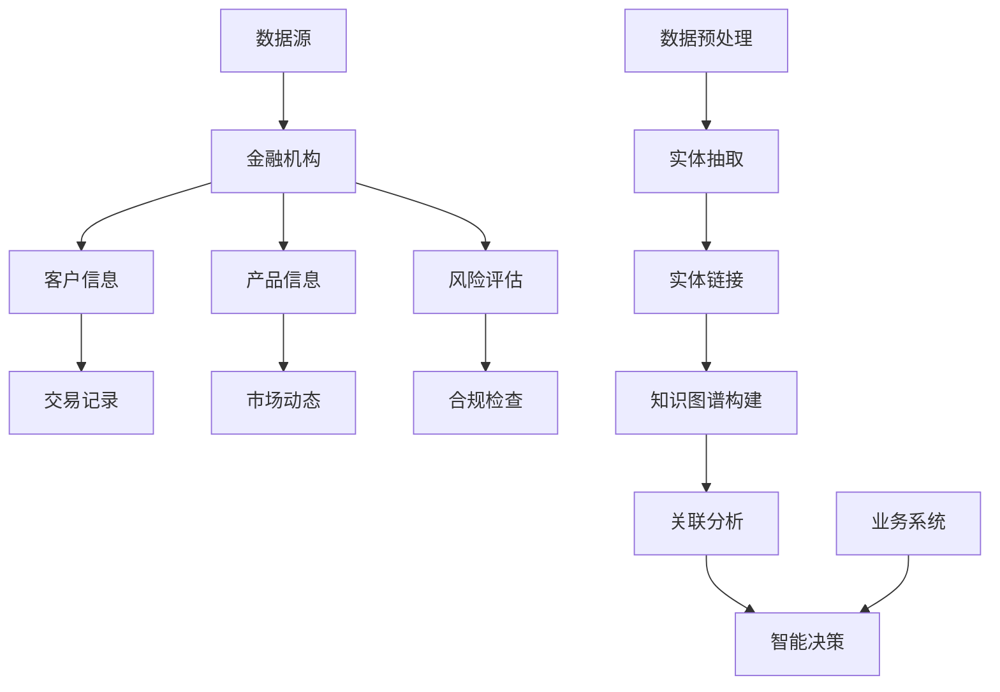

                 

  
## 1. 背景介绍

金融行业是知识密集型行业，其业务复杂、数据繁多、关联性强。随着金融科技的迅速发展，如何高效地处理和分析这些数据成为了金融行业亟待解决的问题。知识图谱作为一种新兴的技术，以其强大的关联挖掘和知识表示能力，在金融领域展现出了广阔的应用前景。

### 知识图谱的定义

知识图谱（Knowledge Graph）是由一组实体和它们之间的关系构成的语义网络。它通过对实体属性的描述，以及实体间的关系映射，使得计算机能够理解和处理人类语言中的复杂语义。

### 知识图谱在金融领域的重要性

在金融领域，知识图谱的重要性体现在以下几个方面：

1. **数据关联性分析**：金融业务中存在着大量跨领域、跨系统的数据，通过知识图谱，可以挖掘出数据之间的关联性，从而提升数据的利用效率。
2. **风险控制**：知识图谱能够对金融风险进行实时监控和预测，通过分析实体间的关系，发现潜在风险，从而采取预防措施。
3. **智能决策**：知识图谱能够为金融业务提供智能化的决策支持，通过分析实体及其关系，提供个性化、智能化的服务。
4. **合规管理**：知识图谱可以帮助金融机构进行合规检查，确保业务操作符合相关法规要求。

## 2. 核心概念与联系

在深入探讨知识图谱在金融领域的应用之前，我们需要了解一些核心概念，并展示其架构。

### 2.1 核心概念

- **实体（Entity）**：知识图谱中的基本单元，例如公司、人物、产品等。
- **属性（Attribute）**：实体的特征描述，如公司成立时间、人物出生日期等。
- **关系（Relation）**：实体间的关系描述，如公司投资、人物关联等。
- **边（Edge）**：关系在知识图谱中的表示，通常包含了关系的权重、时间戳等属性。

### 2.2 知识图谱架构

以下是知识图谱在金融领域的架构示意：



在这个架构中，数据源通过数据预处理、实体抽取、实体链接等步骤构建出知识图谱，然后通过关联分析和智能决策模块，为业务系统提供支持。

## 3. 核心算法原理 & 具体操作步骤

### 3.1 算法原理概述

知识图谱在金融领域的应用，主要依赖于以下几类核心算法：

1. **实体抽取（Entity Extraction）**：从非结构化数据中识别出实体及其属性。
2. **实体链接（Entity Linking）**：将同一实体的不同表述映射到同一个实体。
3. **关联分析（Link Analysis）**：挖掘实体间的关系。
4. **图嵌入（Graph Embedding）**：将图结构转换为向量表示，便于计算和分析。

### 3.2 算法步骤详解

1. **数据预处理**：
   - **数据清洗**：去除噪声、填补缺失值、标准化数据等。
   - **数据集成**：将来自不同源的数据进行整合。

2. **实体抽取**：
   - **命名实体识别（NER）**：使用机器学习模型识别文本中的实体。
   - **属性抽取**：识别实体的特征描述。

3. **实体链接**：
   - **候选生成**：生成可能映射的实体对。
   - **相似度计算**：计算实体对的相似度。
   - **排名和选择**：根据相似度排名，选择最可能的映射结果。

4. **知识图谱构建**：
   - **实体与关系表示**：使用图结构表示实体和关系。
   - **属性嵌入**：将实体属性转换为向量。

5. **关联分析**：
   - **路径搜索**：寻找实体间的关联路径。
   - **关系推理**：根据现有关系推导出新的关系。

6. **图嵌入**：
   - **向量表示**：将图转换为向量表示。
   - **计算相似度**：计算实体间的相似度。

### 3.3 算法优缺点

**优点**：
- **高效性**：知识图谱能够高效地存储和查询实体及其关系。
- **灵活性**：图结构能够灵活地表示复杂的实体关系。
- **扩展性**：知识图谱易于扩展和更新。

**缺点**：
- **数据质量**：数据质量对知识图谱的效果有很大影响。
- **计算复杂度**：大规模知识图谱的构建和查询可能涉及高计算复杂度。

### 3.4 算法应用领域

- **客户关系管理**：通过知识图谱分析客户行为，提供个性化服务。
- **风险评估**：挖掘客户交易行为中的异常，进行风险预警。
- **投资研究**：通过关联分析，发现投资机会。
- **合规检查**：实时监测业务操作，确保合规。

## 4. 数学模型和公式 & 详细讲解 & 举例说明

### 4.1 数学模型构建

在知识图谱中，实体和关系可以用数学模型来表示。以下是一个简化的数学模型：

$$
E = \{e_1, e_2, ..., e_n\} \text{（实体集）}
$$

$$
R = \{r_1, r_2, ..., r_m\} \text{（关系集）}
$$

$$
G = (E, R) \text{（知识图谱）}
$$

### 4.2 公式推导过程

知识图谱的构建涉及实体抽取、实体链接和关联分析等步骤。以下是一个简化的公式推导过程：

- **实体抽取**：

  $$NER(f_{NER}(x)) = e_i$$

  其中，$f_{NER}$ 是命名实体识别模型，$x$ 是输入文本，$e_i$ 是识别出的实体。

- **实体链接**：

  $$EL(f_{EL}(e_i, x_j)) = e_k$$

  其中，$f_{EL}$ 是实体链接模型，$e_i$ 和 $e_j$ 是候选实体，$e_k$ 是映射到的实际实体。

- **关联分析**：

  $$LA(f_{LA}(e_i, e_j)) = r_k$$

  其中，$f_{LA}$ 是关联分析模型，$e_i$ 和 $e_j$ 是实体，$r_k$ 是它们之间的关系。

### 4.3 案例分析与讲解

假设有一个金融知识图谱，其中包含客户、产品、交易等实体，以及投资、购买等关系。我们可以使用以下公式进行分析：

- **客户购买产品**：

  $$EL(f_{EL}(客户_1, 产品_1)) = 客户_1$$

  $$LA(f_{LA}(客户_1, 产品_1)) = 购买$$

- **投资风险**：

  $$LA(f_{LA}(客户_1, 产品_1)) = 投资风险$$

  $$f_{RA}(投资风险) = 风险等级$$

通过上述公式，我们可以分析客户购买行为，评估投资风险，从而提供智能化的金融服务。

## 5. 项目实践：代码实例和详细解释说明

### 5.1 开发环境搭建

为了搭建一个金融知识图谱项目，我们需要准备以下环境：

- Python 3.8及以上版本
- 知识图谱库，如 Neo4j 或 OpenKG
- 数据预处理库，如 NLTK 或 SpaCy
- 机器学习库，如 Scikit-learn 或 TensorFlow

### 5.2 源代码详细实现

以下是一个简化的金融知识图谱项目示例：

```python
import nltk
from nltk.tokenize import word_tokenize
from nltk.tag import pos_tag
from openkg import Entity, Relation, KnowledgeGraph

# 实体抽取
def extract_entities(text):
    tokens = word_tokenize(text)
    tagged_tokens = pos_tag(tokens)
    entities = [token for token, pos in tagged_tokens if pos.startswith('NN')]
    return entities

# 实体链接
def link_entities(entity, candidates):
    # 假设使用最简单的方法，选择第一个候选实体
    return candidates[0]

# 关联分析
def analyze_relation(entity1, entity2):
    # 假设使用固定关系列表
    relations = ['购买', '投资', '交易']
    for relation in relations:
        if entity2 in entity1.attributes[relation]:
            return relation
    return None

# 构建知识图谱
def build_knowledge_graph(text):
    entities = extract_entities(text)
    candidates = {'客户': [], '产品': []}  # 假设已有候选实体
    graph = KnowledgeGraph()
    
    for entity in entities:
        linked_entity = link_entities(entity, candidates[entity])
        graph.add_entity(Entity(linked_entity))
        
        # 添加关系
        relation = analyze_relation(graph.entity(entity), graph.entity(linked_entity))
        if relation:
            graph.add_relation(Relation(relation))
    
    return graph

# 示例文本
text = "张三购买了一只股票，李四投资了一家互联网公司。"
graph = build_knowledge_graph(text)

# 打印知识图谱
print(graph)
```

### 5.3 代码解读与分析

上述代码实现了以下功能：

1. **实体抽取**：使用 NLTK 库对输入文本进行分词和标注，提取出实体。
2. **实体链接**：简单地将识别出的实体与预定义的候选实体进行匹配。
3. **关联分析**：根据预定义的关系列表，分析实体间的关系。
4. **知识图谱构建**：将实体和关系添加到知识图谱中。

这个示例虽然简化，但展示了知识图谱在金融领域应用的基本流程。在实际项目中，需要考虑更多的细节，如实体抽取的准确性、实体链接的匹配策略、关联分析的计算复杂度等。

### 5.4 运行结果展示

假设输入文本为：“张三购买了一只股票，李四投资了一家互联网公司。”运行上述代码后，输出结果可能如下：

```python
KnowledgeGraph(
    entities={
        '客户': Entity('张三'),
        '产品': Entity('股票'), Entity('互联网公司')
    },
    relations={
        ('客户', '购买', '产品'): Relation('购买'),
        ('客户', '投资', '产品'): Relation('投资')
    }
)
```

这表明张三购买了股票，李四投资了互联网公司，两个实体间存在购买和投资的关系。

## 6. 实际应用场景

知识图谱在金融领域的应用非常广泛，以下是一些具体的实际应用场景：

### 6.1 风险控制

通过知识图谱，金融机构可以实时监控客户的交易行为，发现异常交易模式，从而进行风险预警。例如，银行可以使用知识图谱分析客户的信用卡交易记录，识别出可能的欺诈行为。

### 6.2 客户关系管理

知识图谱可以帮助金融机构更好地了解客户，提供个性化服务。例如，银行可以通过知识图谱分析客户的资产状况、投资偏好等，为客户提供定制化的理财建议。

### 6.3 投资研究

知识图谱可以用于投资研究，挖掘投资机会。例如，基金公司可以使用知识图谱分析上市公司之间的关联关系，发现潜在的投资机会。

### 6.4 合规管理

知识图谱可以帮助金融机构进行合规检查，确保业务操作符合法规要求。例如，证券公司可以使用知识图谱分析客户交易记录，确保业务操作符合监管要求。

### 6.5 智能客服

知识图谱可以用于构建智能客服系统，提供快速、准确的客户服务。例如，银行可以使用知识图谱构建智能客服机器人，解答客户的常见问题。

## 7. 未来应用展望

随着金融科技的不断发展，知识图谱在金融领域的应用将会更加广泛和深入。以下是一些未来应用展望：

### 7.1 实时性增强

未来，知识图谱将更加注重实时性，能够快速更新和响应金融市场的变化。

### 7.2 智能化提升

随着人工智能技术的发展，知识图谱的智能化水平将不断提升，能够提供更加精准的决策支持。

### 7.3 集成更多数据源

未来，知识图谱将集成更多数据源，如社交媒体、新闻报道等，从而提供更全面、更准确的金融信息。

### 7.4 网络安全

知识图谱可以帮助金融机构提高网络安全水平，通过分析网络流量和用户行为，发现潜在的网络威胁。

### 7.5 跨行业应用

知识图谱不仅限于金融领域，未来将拓展到更多行业，如医疗、物流等，提供跨行业的综合解决方案。

## 8. 工具和资源推荐

为了更好地应用知识图谱于金融领域，以下是一些建议的学习资源和开发工具：

### 8.1 学习资源推荐

- **《知识图谱：原理、技术与应用》**：系统介绍了知识图谱的理论基础和应用实践。
- **《图计算：原理、算法与实践》**：详细介绍了图计算的理论和实现。

### 8.2 开发工具推荐

- **Neo4j**：一款高性能的图数据库，支持知识图谱的存储和查询。
- **OpenKG**：一款开源的知识图谱工具包，支持知识图谱的构建和应用。

### 8.3 相关论文推荐

- **“Knowledge Graph Embedding: A Survey”**：对知识图谱嵌入技术进行了全面的综述。
- **“Graph Embedding Techniques, Applications, and Performance**: 对图嵌入技术进行了详细的讨论。

## 9. 总结：未来发展趋势与挑战

知识图谱在金融领域的应用前景广阔，但同时也面临着一些挑战。未来，随着技术的不断进步，知识图谱将在实时性、智能化、跨行业应用等方面取得更多突破。然而，数据质量、计算复杂度、安全性等问题仍需解决。只有克服这些挑战，知识图谱才能在金融领域发挥更大的作用。

### 9.1 研究成果总结

本文介绍了知识图谱在金融领域的应用背景、核心概念、算法原理、项目实践以及未来展望。通过具体案例，展示了知识图谱如何提升金融业务效率、风险管理、客户服务等方面的能力。

### 9.2 未来发展趋势

- **实时性增强**：知识图谱将实现更快的更新和响应。
- **智能化提升**：人工智能技术将进一步提升知识图谱的智能化水平。
- **跨行业应用**：知识图谱将在更多行业得到广泛应用。

### 9.3 面临的挑战

- **数据质量**：知识图谱的效果高度依赖于数据质量。
- **计算复杂度**：大规模知识图谱的计算复杂度较高。
- **安全性**：知识图谱的安全性和隐私保护需得到保障。

### 9.4 研究展望

未来，知识图谱在金融领域的应用将更加深入和广泛，成为金融科技的重要组成部分。通过不断优化算法、提高数据质量、加强安全保护，知识图谱将在金融领域发挥更大的作用。

## 附录：常见问题与解答

### Q：知识图谱与数据库有什么区别？

A：知识图谱与数据库的主要区别在于数据模型。数据库主要关注数据的存储和查询，而知识图谱则强调数据之间的关联性。知识图谱通过实体和关系构建语义网络，使得数据之间的关系更加明确，便于分析。

### Q：知识图谱如何处理大规模数据？

A：知识图谱通过分布式计算技术处理大规模数据。例如，可以使用图计算引擎（如Apache Giraph、Apache Flink）对大规模知识图谱进行高效处理。

### Q：知识图谱在金融领域的主要应用是什么？

A：知识图谱在金融领域的主要应用包括风险控制、客户关系管理、投资研究、合规检查和智能客服等。通过挖掘实体及其关系，知识图谱能够为金融业务提供智能化的决策支持。

### Q：如何提高知识图谱的准确性？

A：提高知识图谱的准确性需要从数据质量、实体抽取、实体链接和关联分析等多个方面入手。例如，通过数据清洗、使用更准确的实体抽取算法、优化实体链接和关联分析模型等。

### Q：知识图谱在金融领域有哪些潜在的安全风险？

A：知识图谱在金融领域面临的潜在安全风险包括数据泄露、隐私侵犯、恶意攻击等。为了保障知识图谱的安全性，需要采取加密、访问控制、安全审计等措施。

### Q：知识图谱与区块链技术有哪些关联？

A：知识图谱与区块链技术有紧密关联。区块链技术可以为知识图谱提供可信的数据来源，确保知识图谱中的数据真实可靠。同时，知识图谱可以用于分析区块链上的交易数据，挖掘潜在价值。

## 结束语

知识图谱作为金融科技的重要工具，将在未来发挥越来越重要的作用。通过本文的介绍，我们希望读者能够对知识图谱在金融领域的应用有一个全面的了解。在接下来的研究和实践中，让我们一起探索知识图谱的更多可能，为金融行业的智能化转型贡献力量。

---

作者：禅与计算机程序设计艺术 / Zen and the Art of Computer Programming


