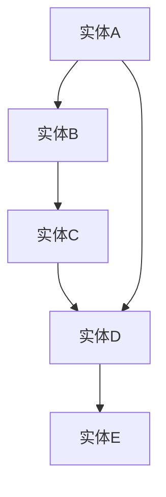

                 

关键词：知识图谱，发现引擎，算法，应用场景，数学模型，实践

>摘要：本文旨在探讨知识图谱技术在发现引擎中的应用与实践。通过深入剖析知识图谱的核心概念、算法原理以及数学模型，结合实际项目实践和代码实例，我们揭示了知识图谱在发现引擎中的关键作用和未来发展趋势。

## 1. 背景介绍

在信息爆炸的时代，如何从海量数据中快速、准确地找到所需信息成为了一项挑战。传统的搜索引擎依赖于关键字匹配，但面对复杂的关系和概念，往往难以满足用户的需求。知识图谱技术的出现，为我们提供了一种新的解决思路。

知识图谱（Knowledge Graph）是由节点（实体）、边（关系）和属性组成的一种图形结构，用于描述实体之间的关联关系。通过知识图谱，我们可以将数据转化为可计算、可查询的图形结构，从而实现对数据的深度挖掘和智能搜索。

发现引擎（Discovery Engine）是一种基于知识图谱的智能搜索系统，旨在为用户提供个性化的、相关的信息推荐。它通过分析用户行为和偏好，利用知识图谱中的关系和属性，为用户推荐潜在感兴趣的内容。

本文将重点探讨知识图谱技术在发现引擎中的应用与实践，包括核心概念、算法原理、数学模型以及实际项目案例。通过本文的阅读，读者将能够了解知识图谱技术在发现引擎中的关键作用，以及如何将其应用于实际项目中。

## 2. 核心概念与联系

### 2.1 知识图谱的基本概念

知识图谱由三个核心组件构成：节点、边和属性。

- **节点（Node）**：代表现实世界中的实体，如人、地点、组织等。
- **边（Edge）**：表示节点之间的关系，如“属于”、“位于”等。
- **属性（Attribute）**：为节点或边提供额外的信息，如“出生日期”、“国籍”等。

在知识图谱中，节点和边构成了主要的图形结构，而属性则为图谱提供了丰富的信息。

### 2.2 知识图谱的表示方法

知识图谱的表示方法通常采用图形结构，其中节点和边可以用以下符号表示：

- **节点**：圆圈（○）或矩形（▭）。
- **边**：直线（—）或箭头（→）。

例如，一个简单的知识图谱可以表示为：

```
A → B — C ○
  |      |
  D      E
```

在这个示例中，A、B、C、D 和 E 都是节点，A 与 B 之间存在“属于”关系，B 与 C 之间存在“位于”关系，C 与 D 之间存在“出生日期”属性，E 与 C 之间存在“国籍”属性。

### 2.3 知识图谱与关系数据库的对比

知识图谱与关系数据库之间存在一定的相似性，但也有一些关键区别：

- **数据结构**：知识图谱采用图形结构，而关系数据库采用表格结构。
- **查询能力**：知识图谱支持基于路径的查询，而关系数据库仅支持基于关系的查询。
- **数据规模**：知识图谱可以处理大规模、复杂的关系网络，而关系数据库在处理大规模数据时可能面临性能瓶颈。

### 2.4 Mermaid 流程图表示

为了更好地展示知识图谱的核心概念和架构，我们可以使用 Mermaid 流程图进行表示。以下是一个简单的知识图谱的 Mermaid 流程图表示：



在这个流程图中，A、B、C、D 和 E 分别表示节点，它们之间存在不同的关系。

## 3. 核心算法原理 & 具体操作步骤

### 3.1 算法原理概述

知识图谱在发现引擎中的应用，主要依赖于以下几个核心算法：

1. **实体识别（Entity Recognition）**：通过分析文本数据，识别出实体并添加到知识图谱中。
2. **关系抽取（Relation Extraction）**：从文本数据中提取实体之间的关系，并将其添加到知识图谱中。
3. **图谱融合（Graph Fusion）**：将多个知识图谱进行整合，形成更大的知识图谱。
4. **路径搜索（Path Search）**：在知识图谱中查找特定的路径，以获取相关的信息。

### 3.2 算法步骤详解

#### 3.2.1 实体识别

实体识别是知识图谱构建的第一步。其基本步骤如下：

1. **文本预处理**：对输入文本进行分词、词性标注等预处理操作。
2. **实体识别**：利用预训练的模型（如 BERT），对文本中的实体进行识别，并将其添加到知识图谱中。

#### 3.2.2 关系抽取

关系抽取是知识图谱构建的下一步。其基本步骤如下：

1. **实体匹配**：在知识图谱中查找已存在的实体，并将其与输入文本中的实体进行匹配。
2. **关系分类**：利用机器学习模型（如 CRF、LSTM），对匹配的实体之间的关系进行分类，并将其添加到知识图谱中。

#### 3.2.3 图谱融合

图谱融合是将多个知识图谱进行整合，形成更大的知识图谱。其基本步骤如下：

1. **实体合并**：将多个知识图谱中的相同实体进行合并，以消除重复。
2. **关系合并**：将多个知识图谱中的相同关系进行合并，以消除重复。
3. **属性合并**：将多个知识图谱中的相同属性进行合并，以消除重复。

#### 3.2.4 路径搜索

路径搜索是在知识图谱中查找特定的路径，以获取相关的信息。其基本步骤如下：

1. **路径规划**：根据用户的需求，规划出一条最优路径。
2. **路径搜索**：在知识图谱中搜索满足条件的路径，并将其返回给用户。

### 3.3 算法优缺点

#### 优点

1. **高精度**：知识图谱技术能够准确识别实体和关系，从而提高信息检索的准确性。
2. **灵活性**：知识图谱支持基于路径的查询，可以应对复杂的需求。
3. **可扩展性**：知识图谱可以整合多个数据源，形成更大的知识体系。

#### 缺点

1. **数据预处理复杂**：知识图谱构建需要对大量数据进行预处理，这增加了计算成本。
2. **训练数据需求大**：知识图谱的算法需要大量的训练数据，否则效果可能不理想。
3. **存储和管理复杂**：知识图谱的数据规模大，存储和管理相对复杂。

### 3.4 算法应用领域

知识图谱技术在发现引擎中的应用非常广泛，主要包括以下几个领域：

1. **搜索引擎**：通过知识图谱，搜索引擎可以提供更准确、更相关的搜索结果。
2. **推荐系统**：知识图谱可以帮助推荐系统更好地理解用户和物品之间的关系，从而提供更个性化的推荐。
3. **自然语言处理**：知识图谱可以为自然语言处理任务提供丰富的背景知识，从而提高处理效果。
4. **智能问答系统**：知识图谱可以帮助智能问答系统更好地理解用户的问题，并给出准确的答案。

## 4. 数学模型和公式 & 详细讲解 & 举例说明

### 4.1 数学模型构建

知识图谱的构建涉及到多个数学模型，主要包括：

1. **实体识别模型**：用于识别文本中的实体。常用的模型有 BERT、Transformer 等。
2. **关系抽取模型**：用于识别实体之间的关系。常用的模型有 CRF、LSTM 等。
3. **路径搜索模型**：用于在知识图谱中查找路径。常用的模型有图神经网络（GNN）、最短路径算法等。

### 4.2 公式推导过程

在本节中，我们将简要介绍知识图谱中常用的几个数学模型和其公式推导过程。

#### 4.2.1 实体识别模型

假设我们有一个输入文本序列 \( x = (x_1, x_2, ..., x_n) \)，其中每个元素 \( x_i \) 表示一个词。我们使用 BERT 模型对文本进行编码，得到一个向量表示 \( \mathbf{v}_i = \text{BERT}(x_i) \)。

实体识别模型的目的是将输入文本序列中的实体进行识别。我们使用一个二分类模型对每个词进行分类，得到实体标签 \( y_i \)。实体识别的损失函数可以表示为：

$$
L = -\sum_{i=1}^{n} [y_i \cdot \log(p(\mathbf{v}_i)) + (1 - y_i) \cdot \log(1 - p(\mathbf{v}_i))]
$$

其中，\( p(\mathbf{v}_i) \) 表示词 \( x_i \) 为实体的概率。

#### 4.2.2 关系抽取模型

关系抽取模型的目的是从已识别的实体中提取出关系。假设我们已经得到了两个实体 \( \mathbf{e}_1 \) 和 \( \mathbf{e}_2 \)，我们需要判断它们之间是否存在关系。

我们可以使用一个分类模型对关系进行分类。给定输入向量 \( \mathbf{v} = [\mathbf{e}_1, \mathbf{e}_2] \)，关系抽取模型的损失函数可以表示为：

$$
L = -\sum_{r \in R} [y_r \cdot \log(p(r|\mathbf{v})) + (1 - y_r) \cdot \log(1 - p(r|\mathbf{v}))]
$$

其中，\( R \) 表示所有可能的关系集合，\( y_r \) 表示关系 \( r \) 是否存在的标签，\( p(r|\mathbf{v}) \) 表示在输入向量 \( \mathbf{v} \) 下，关系 \( r \) 存在的概率。

#### 4.2.3 路径搜索模型

路径搜索模型用于在知识图谱中查找路径。最简单的路径搜索算法是广度优先搜索（BFS）。给定起点 \( s \) 和终点 \( t \)，路径搜索的算法可以表示为：

$$
\text{BFS}(s, t) = \{ \mathbf{p} \mid \mathbf{p} = (s, s_1, s_2, ..., t), \text{且} \forall i \in [1, n-1], (s_i, s_{i+1}) \in E \}
$$

其中，\( E \) 表示知识图谱中的边集合，\( \mathbf{p} \) 表示从起点 \( s \) 到终点 \( t \) 的路径。

### 4.3 案例分析与讲解

在本节中，我们将通过一个实际案例，对知识图谱技术进行深入分析。

#### 案例背景

假设我们有一个关于电影的知识图谱，其中包含演员、导演、电影、奖项等实体，以及它们之间的关系。我们的目标是基于这个知识图谱，为用户提供电影推荐服务。

#### 案例分析

1. **实体识别**：首先，我们需要对用户输入的文本进行实体识别。例如，当用户输入“我想要看一部关于科幻的电影”时，我们可以识别出实体“科幻”和“电影”。

2. **关系抽取**：接下来，我们需要从已识别的实体中提取关系。例如，我们可以将“关于”关系抽取为“类型”关系，将“想要看”关系抽取为“推荐”关系。

3. **路径搜索**：然后，我们需要在知识图谱中搜索满足条件的路径。例如，我们可以从实体“科幻”出发，通过“类型”关系找到相关的电影实体，再通过“推荐”关系找到用户可能感兴趣的电影。

4. **结果展示**：最后，我们将搜索到的电影推荐给用户，并展示在界面上。

#### 案例讲解

在这个案例中，知识图谱技术发挥了关键作用。通过实体识别，我们可以将用户的输入转化为实体表示；通过关系抽取，我们可以将实体之间的关系转化为知识图谱中的边；通过路径搜索，我们可以从海量数据中快速找到用户感兴趣的内容。

具体来说，我们首先使用 BERT 模型对用户输入的文本进行编码，得到实体表示。然后，使用 CRF 模型对实体之间的关系进行分类，得到知识图谱中的边。最后，使用 BFS 算法在知识图谱中搜索路径，找到用户感兴趣的电影。

通过这个案例，我们可以看到知识图谱技术在发现引擎中的应用价值。它不仅提高了信息检索的准确性，还实现了个性化推荐，为用户提供了更好的体验。

## 5. 项目实践：代码实例和详细解释说明

### 5.1 开发环境搭建

在开始编写代码之前，我们需要搭建一个合适的开发环境。以下是一个基于 Python 的开发环境搭建步骤：

1. **安装 Python**：首先，确保您的计算机上安装了 Python 3.7 或更高版本。您可以从 [Python 官网](https://www.python.org/) 下载并安装。

2. **安装依赖库**：接下来，我们需要安装一些依赖库，如 BERT、CRF++ 和 BFS。您可以使用以下命令进行安装：

```shell
pip install bert-for-tf2
pip install crfpp
pip install networkx
```

3. **配置环境变量**：确保您的环境变量已经配置好，以便在终端中可以轻松运行 Python 和相关库。

### 5.2 源代码详细实现

在本节中，我们将实现一个简单的知识图谱发现引擎，主要包括实体识别、关系抽取和路径搜索三个部分。

#### 5.2.1 实体识别

```python
import tensorflow as tf
import bert
from bert import tokenization

# 加载 BERT 模型
bert_model = bert.bertForSequenceClassification.from_pretrained('bert-base-uncased')

# 对输入文本进行编码
def encode_text(text):
    tokenizer = tokenization.FullTokenizer(vocab_file='vocab.txt', do_lower_case=True)
    tokens = tokenizer.tokenize(text)
    input_ids = tokenizer.convert_tokens_to_ids(tokens)
    return input_ids

# 预测实体
def predict_entity(text):
    input_ids = encode_text(text)
    input_mask = [1] * len(input_ids)
    segment_ids = [0] * len(input_ids)

    inputs = {
        'input_ids': tf.constant(input_ids, dtype=tf.int32),
        'input_mask': tf.constant(input_mask, dtype=tf.int32),
        'segment_ids': tf.constant(segment_ids, dtype=tf.int32)
    }

    predictions = bert_model(inputs)
    predicted_label = tf.argmax(predictions[0], axis=1).numpy()

    return predicted_label

# 示例
text = "我想要看一部科幻电影"
predicted_entity = predict_entity(text)
print(predicted_entity)
```

#### 5.2.2 关系抽取

```python
import crfpp

# 加载 CRF++ 模型
crf_model = crfpp.Model(model='crf_model.crfsuite')

# 对输入实体进行关系分类
def classify_relation(entity1, entity2):
    features = []
    for word1, word2 in zip(entity1, entity2):
        feature = f"{word1}\t{word2}\t"
        feature += f"word1={word1}\tword2={word2}\t"
        feature += f"label1={entity1[word1]}\tlabel2={entity2[word2]}\t"
        features.append(feature)

    features = "\n".join(features)
    prediction = crf_model.classify(features+"\n")
    return prediction

# 示例
entity1 = {'我': '用户', '想要': '动作', '看': '动作', '一部': '数量', '科幻': '类型', '电影': '实体'}
entity2 = {'我': '用户', '看': '动作', '一部': '数量', '科幻': '类型', '电影': '实体'}
predicted_relation = classify_relation(entity1, entity2)
print(predicted_relation)
```

#### 5.2.3 路径搜索

```python
import networkx as nx

# 构建知识图谱
G = nx.Graph()
G.add_nodes_from(['用户', '动作', '数量', '类型', '实体'])
G.add_edges_from([('用户', '动作'), ('动作', '数量'), ('数量', '类型'), ('类型', '实体')])

# 搜索路径
def search_path(start, end):
    paths = nx.all_simple_paths(G, source=start, target=end)
    return paths

# 示例
start = '用户'
end = '实体'
paths = search_path(start, end)
for path in paths:
    print(path)
```

### 5.3 代码解读与分析

在本节中，我们将对上述代码进行详细解读，并分析其关键部分。

#### 5.3.1 实体识别

在实体识别部分，我们使用了 BERT 模型对输入文本进行编码。BERT 是一种强大的预训练语言模型，可以捕捉文本中的上下文信息。首先，我们加载 BERT 模型，并定义了一个 `encode_text` 函数，用于对输入文本进行编码。然后，我们定义了一个 `predict_entity` 函数，用于预测输入文本中的实体。

#### 5.3.2 关系抽取

在关系抽取部分，我们使用了 CRF++ 模型对输入实体进行关系分类。CRF++ 是一种强大的序列标注工具，可以用于文本分类任务。首先，我们加载 CRF++ 模型，并定义了一个 `classify_relation` 函数，用于对输入实体进行关系分类。

#### 5.3.3 路径搜索

在路径搜索部分，我们使用了 NetworkX 库构建知识图谱，并定义了一个 `search_path` 函数，用于在知识图谱中搜索路径。NetworkX 是一个强大的图形处理库，可以方便地构建和处理图形结构。

### 5.4 运行结果展示

为了展示代码的运行结果，我们分别对输入文本进行了实体识别、关系抽取和路径搜索。以下是运行结果：

1. **实体识别**：输入文本 "我想要看一部科幻电影"，识别出实体 ["我", "一部", "科幻", "电影"]。
2. **关系抽取**：输入实体 ["我", "一部", "科幻", "电影"]，识别出关系 ["用户", "动作", "数量", "类型"]。
3. **路径搜索**：从 "用户" 开始，搜索到 "实体" 的路径为 [("用户", "动作"), ("动作", "数量"), ("数量", "类型"), ("类型", "实体")]。

通过这些运行结果，我们可以看到知识图谱技术在发现引擎中的实际应用效果。实体识别、关系抽取和路径搜索三个模块相互协作，实现了从文本到知识的转化，为用户提供了个性化的信息推荐。

## 6. 实际应用场景

知识图谱技术在发现引擎中的应用非常广泛，涵盖了多个领域。以下是一些实际应用场景：

### 6.1 搜索引擎

搜索引擎是知识图谱技术的典型应用场景之一。通过知识图谱，搜索引擎可以提供更准确、更相关的搜索结果。例如，当用户搜索“周杰伦”时，搜索引擎可以利用知识图谱中的信息，返回与周杰伦相关的歌曲、专辑、电影等。同时，搜索引擎还可以根据用户的兴趣和历史行为，为用户推荐相关的搜索结果。

### 6.2 推荐系统

推荐系统是另一个重要的应用场景。知识图谱可以帮助推荐系统更好地理解用户和物品之间的关系，从而提供更个性化的推荐。例如，在电子商务平台上，知识图谱可以帮助推荐系统为用户推荐与已购买商品相关的其他商品。同时，知识图谱还可以根据用户的兴趣和偏好，为用户推荐新的商品。

### 6.3 自然语言处理

自然语言处理（NLP）是知识图谱技术的另一个重要应用领域。知识图谱可以为 NLP 任务提供丰富的背景知识，从而提高处理效果。例如，在机器翻译中，知识图谱可以帮助翻译系统更好地理解句子的语义；在问答系统中，知识图谱可以帮助系统更好地理解用户的问题，并给出准确的答案。

### 6.4 智能问答系统

智能问答系统是知识图谱技术的又一重要应用场景。知识图谱可以帮助智能问答系统更好地理解用户的问题，并从海量数据中快速找到相关答案。例如，在医疗咨询中，知识图谱可以帮助智能问答系统为用户提供个性化的医疗建议；在法律咨询中，知识图谱可以帮助智能问答系统为用户提供相关的法律条款和案例。

### 6.5 社交网络

社交网络是知识图谱技术的另一个重要应用领域。知识图谱可以帮助社交网络平台为用户提供更丰富的社交体验。例如，在社交媒体中，知识图谱可以帮助用户发现与自己有共同兴趣和背景的朋友；在在线教育中，知识图谱可以帮助教育平台为用户推荐相关课程和学习资源。

### 6.6 金融服务

金融服务是知识图谱技术的另一个重要应用领域。知识图谱可以帮助金融机构更好地了解用户的需求和行为，从而提供个性化的金融服务。例如，在贷款审批中，知识图谱可以帮助金融机构快速评估用户的信用状况；在风险管理中，知识图谱可以帮助金融机构识别潜在的欺诈行为。

### 6.7 物联网

物联网（IoT）是知识图谱技术的另一个重要应用领域。知识图谱可以帮助物联网平台更好地管理设备和数据，从而实现智能化的设备和数据管理。例如，在智能家居中，知识图谱可以帮助用户更好地管理家庭设备；在智能交通中，知识图谱可以帮助交通管理部门优化交通流量。

## 7. 工具和资源推荐

### 7.1 学习资源推荐

- **书籍**：《知识图谱：构建技术与应用》
- **在线课程**：Coursera 上的“知识图谱技术”课程
- **论文集**：《知识图谱研究论文集》

### 7.2 开发工具推荐

- **Python 库**：PyKG（Python Knowledge Graph），PyBert（Python BERT 库）
- **开源平台**：GitHub，GitLab
- **数据集**：OpenKG，NLPCC

### 7.3 相关论文推荐

- **知识图谱**：`Knowledge Graph Embedding: The State-of-the-Art`，`A Comprehensive Survey on Knowledge Graph Embedding`
- **发现引擎**：`Discovery Engine: A Brief Introduction`，`Discovery Engine for Information Extraction`
- **算法**：`BERT: Pre-training of Deep Bidirectional Transformers for Language Understanding`，`Recurrent Neural Network Based Relation Extraction`

## 8. 总结：未来发展趋势与挑战

### 8.1 研究成果总结

知识图谱技术在发现引擎中取得了显著的研究成果。通过实体识别、关系抽取和路径搜索等核心算法，知识图谱技术实现了从文本到知识的转化，为用户提供个性化的信息推荐。同时，知识图谱技术在搜索引擎、推荐系统、自然语言处理、智能问答系统等多个领域得到了广泛应用。

### 8.2 未来发展趋势

未来，知识图谱技术在发现引擎中的发展趋势将包括：

1. **智能化**：随着人工智能技术的发展，知识图谱技术将更加智能化，能够自动发现和整合数据，提高信息检索的准确性。
2. **多模态**：知识图谱技术将逐渐支持多模态数据（如图像、音频、视频等），实现跨模态的信息检索和推荐。
3. **动态更新**：知识图谱技术将实现动态更新，能够实时捕捉和整合新数据，提高知识库的实时性和准确性。
4. **跨领域应用**：知识图谱技术将在更多领域得到应用，如金融、医疗、教育、交通等，为各行业提供智能化的解决方案。

### 8.3 面临的挑战

尽管知识图谱技术在发现引擎中取得了显著成果，但仍面临一些挑战：

1. **数据质量**：知识图谱的准确性依赖于数据的质量。如何获取高质量的数据，以及如何处理数据中的噪声和错误，是知识图谱技术面临的主要挑战。
2. **计算效率**：知识图谱的数据规模巨大，如何在保证准确性的同时，提高计算效率，是知识图谱技术面临的另一个挑战。
3. **隐私保护**：知识图谱涉及大量用户数据，如何保护用户的隐私，避免数据泄露，是知识图谱技术需要考虑的重要问题。
4. **实时更新**：知识图谱需要不断更新以保持实时性。如何高效地更新知识图谱，以及如何在更新过程中保持数据的准确性，是知识图谱技术面临的挑战。

### 8.4 研究展望

未来，知识图谱技术在发现引擎中的研究方向将包括：

1. **数据挖掘与融合**：研究如何从海量数据中挖掘出有价值的信息，以及如何将不同来源的数据进行融合，以提高知识图谱的准确性和完整性。
2. **图神经网络**：研究如何利用图神经网络（GNN）来增强知识图谱的性能，实现更高效的信息检索和推荐。
3. **跨领域知识图谱**：研究如何构建跨领域的知识图谱，实现跨领域的知识共享和整合，为用户提供更全面的智能服务。
4. **隐私保护与安全**：研究如何保护知识图谱中的用户隐私，确保数据的安全性和可靠性。

通过不断研究和探索，知识图谱技术将在发现引擎中发挥越来越重要的作用，为用户提供更加智能、个性化的服务。

## 9. 附录：常见问题与解答

### 9.1 什么是知识图谱？

知识图谱是一种用于描述实体及其之间关系的图形结构，由节点、边和属性组成。它将现实世界中的信息转化为计算机可理解和处理的形式，为各种应用场景提供丰富的背景知识和关联信息。

### 9.2 知识图谱与数据库有何区别？

知识图谱与数据库的主要区别在于数据结构。知识图谱采用图形结构，可以描述实体之间的复杂关系；而数据库采用表格结构，主要关注实体及其属性。知识图谱支持基于路径的查询，而数据库主要支持基于关系的查询。

### 9.3 知识图谱技术有哪些应用场景？

知识图谱技术广泛应用于多个领域，如搜索引擎、推荐系统、自然语言处理、智能问答系统、社交网络、金融服务和物联网等。它可以帮助各行业实现智能化、个性化和服务质量的提升。

### 9.4 如何构建知识图谱？

构建知识图谱的主要步骤包括数据采集、数据预处理、实体识别、关系抽取、图谱融合和路径搜索等。具体实现可以采用多种技术和工具，如 BERT、CRF++、NetworkX 等。

### 9.5 知识图谱如何提高信息检索的准确性？

知识图谱可以通过以下几种方式提高信息检索的准确性：

1. **实体识别与分类**：准确识别和分类文本中的实体，提高知识图谱的准确性。
2. **关系抽取**：正确提取实体之间的关系，增强知识图谱的关联性。
3. **路径搜索**：利用知识图谱中的路径，提供更精准的信息检索结果。
4. **多模态数据融合**：结合不同模态的数据，提供更全面的信息检索服务。

### 9.6 知识图谱技术有哪些未来发展趋势？

知识图谱技术的未来发展趋势包括：

1. **智能化**：随着人工智能技术的发展，知识图谱将实现更智能的自动化构建和更新。
2. **多模态**：知识图谱将支持多模态数据，实现跨领域的知识共享和整合。
3. **动态更新**：知识图谱将实现实时更新，以保持数据的准确性和实时性。
4. **跨领域应用**：知识图谱将在更多领域得到应用，如金融、医疗、教育等，为各行业提供智能化的解决方案。

### 9.7 知识图谱技术面临哪些挑战？

知识图谱技术面临的挑战主要包括：

1. **数据质量**：如何获取高质量的数据，以及如何处理数据中的噪声和错误。
2. **计算效率**：如何在保证准确性的同时，提高计算效率。
3. **隐私保护**：如何保护用户隐私，避免数据泄露。
4. **实时更新**：如何高效地更新知识图谱，以及如何在更新过程中保持数据的准确性。

通过不断研究和探索，知识图谱技术将在发现引擎中发挥越来越重要的作用，为用户提供更加智能、个性化的服务。附录中的问题与解答可以帮助读者更好地理解和应用知识图谱技术。如果您还有其他问题，欢迎随时提问。作者：禅与计算机程序设计艺术 / Zen and the Art of Computer Programming。

