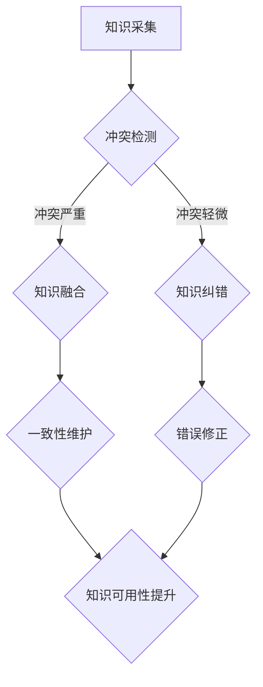

                 

关键词：知识图谱，知识融合，知识纠错，质量提升，人工智能，数据清洗，实体链接，一致性维护

> 摘要：本文旨在探讨知识图谱的质量提升问题，重点分析知识融合和知识纠错两大关键技术。知识融合旨在将多个来源的知识进行整合，消除冲突和冗余，提升知识的一致性和可用性；而知识纠错则致力于发现和纠正图谱中的错误，提高图谱的准确性。通过对知识图谱质量提升技术的深入分析，本文为相关领域的研究和实践提供了有价值的参考。

## 1. 背景介绍

知识图谱作为一种结构化知识表示方法，已经在众多领域中展现出了巨大的价值。它能够将实体、属性、关系等信息以图的形式进行组织，使得复杂的知识体系变得更加直观和易于处理。然而，知识图谱的质量直接影响到其应用的效率和效果。高质量的知识图谱不仅能够提供准确的信息，还能够发现潜在的知识关联，为智能决策提供支持。

随着大数据和人工智能技术的发展，知识图谱的应用场景日益广泛，从搜索引擎、推荐系统到智能问答、自然语言处理等，都离不开高质量的知识图谱。然而，知识图谱的构建和维护是一个复杂的过程，涉及数据的采集、清洗、融合、纠错等多个环节。这些环节的每一个都可能影响到知识图谱的质量。因此，如何提升知识图谱的质量成为了一个关键问题。

知识图谱的质量提升主要包括两个方面：知识融合和知识纠错。知识融合旨在将来自不同来源、不同格式的知识进行整合，消除冲突和冗余，形成一致的知识体系。知识纠错则致力于发现和纠正图谱中的错误，提高图谱的准确性。本文将深入探讨这两大关键技术，分析其原理、方法及其在实践中的应用。

### 1.1 知识融合的重要性

知识融合是知识图谱构建和维护中的关键环节，它的重要性体现在以下几个方面：

1. **消除冲突和冗余**：不同来源的知识往往存在冲突和冗余，例如，同一实体在不同来源中可能存在不同的名称、属性值等。知识融合能够将这些冲突和冗余消除，提高知识的一致性。

2. **提升知识可用性**：通过知识融合，可以将分散的知识进行整合，形成更加完整和丰富的知识体系，提高知识的可用性。

3. **增强知识表达能力**：知识融合能够将不同来源的知识进行有机整合，使得知识图谱能够表达更复杂的语义关系。

4. **支持智能决策**：高质量的知识融合能够为智能决策提供可靠的数据支持，提高决策的准确性和效率。

### 1.2 知识纠错的重要性

知识纠错是保障知识图谱质量的重要手段，它的重要性体现在以下几个方面：

1. **提高知识准确性**：知识纠错能够发现和纠正图谱中的错误，提高知识的准确性，从而确保知识图谱的应用效果。

2. **提升用户信任度**：准确的图谱数据能够提高用户对系统的信任度，促进系统的广泛应用。

3. **降低维护成本**：通过及时发现和纠正错误，可以降低知识图谱的维护成本。

4. **支持持续改进**：知识纠错能够为知识图谱的持续改进提供数据支持，有助于不断提升图谱的质量。

## 2. 核心概念与联系

在深入探讨知识融合和知识纠错之前，我们需要明确一些核心概念，并了解它们之间的联系。

### 2.1 知识融合

知识融合是指将来自不同来源、不同格式、不同粒度的知识进行整合，消除冲突和冗余，形成一致的知识体系。知识融合的关键在于如何有效地处理数据冲突和一致性维护。

### 2.2 知识纠错

知识纠错是指发现和纠正知识图谱中的错误，包括实体错误、属性错误、关系错误等。知识纠错的核心是错误检测和错误修正。

### 2.3 关系

知识融合和知识纠错之间存在紧密的联系。知识融合过程中，可能会产生新的冲突和错误，需要通过知识纠错进行修正。同样，知识纠错过程中，可能会发现原有的知识融合策略存在不足，需要调整知识融合方法。

### 2.4 Mermaid 流程图

下面是一个简化的知识融合和知识纠错流程的 Mermaid 流程图，以帮助读者更好地理解这两个概念及其关系。



## 3. 核心算法原理 & 具体操作步骤

### 3.1 算法原理概述

知识融合和知识纠错的核心算法主要包括冲突检测、冲突消解、一致性维护、错误检测和错误修正等。

1. **冲突检测**：通过比较不同来源的知识，识别出可能存在的冲突点。

2. **冲突消解**：针对检测到的冲突，采用特定的策略进行消解，例如优先级策略、一致性策略等。

3. **一致性维护**：在知识融合过程中，持续检查知识的一致性，并采取相应措施进行维护。

4. **错误检测**：通过算法检查图谱中的实体、属性、关系等是否存在错误。

5. **错误修正**：针对检测到的错误，采用相应的修正方法进行纠正。

### 3.2 算法步骤详解

下面我们详细描述知识融合和知识纠错的算法步骤。

#### 3.2.1 知识融合

1. **知识采集**：从多个来源采集知识，包括结构化数据、非结构化数据等。

2. **冲突检测**：采用实体匹配算法（如基于命名实体识别、关键词匹配等），检测不同来源的知识之间的冲突。

3. **冲突消解**：针对检测到的冲突，采用优先级策略、一致性策略等进行消解。

4. **一致性维护**：在知识融合过程中，持续检查知识的一致性，并采取相应措施进行维护，如数据去重、属性值规范化等。

5. **知识存储**：将融合后的知识存储到知识图谱中，以便后续使用。

#### 3.2.2 知识纠错

1. **错误检测**：采用算法检查图谱中的实体、属性、关系等是否存在错误。

2. **错误修正**：针对检测到的错误，采用相应的修正方法进行纠正，如数据替换、属性值修正等。

3. **反馈机制**：将错误修正的结果反馈给知识融合模块，以便在下一次知识融合时进行改进。

### 3.3 算法优缺点

#### 知识融合

**优点**：

- 能够将多个来源的知识进行整合，提高知识的一致性和可用性。
- 可以发现潜在的知识关联，支持智能决策。

**缺点**：

- 处理冲突和一致性维护的过程复杂，需要大量计算资源。
- 可能会引入新的错误，需要持续进行错误修正。

#### 知识纠错

**优点**：

- 能够发现和纠正图谱中的错误，提高知识的准确性。
- 可以提升用户对系统的信任度。

**缺点**：

- 错误检测和修正的过程可能影响系统性能。
- 需要大量的人力进行错误修正。

### 3.4 算法应用领域

知识融合和知识纠错在多个领域都有广泛的应用：

- **搜索引擎**：通过知识融合和纠错，提升搜索结果的准确性和相关性。
- **推荐系统**：通过知识融合，发现用户潜在的喜好和需求，提升推荐效果。
- **智能问答**：通过知识纠错，确保问答系统的回答准确无误。
- **自然语言处理**：通过知识融合，提高文本理解的能力。

## 4. 数学模型和公式 & 详细讲解 & 举例说明

### 4.1 数学模型构建

知识融合和知识纠错的数学模型主要包括以下几个方面：

1. **实体匹配模型**：用于检测不同来源的知识之间的实体匹配程度。
2. **冲突检测模型**：用于识别可能存在的知识冲突。
3. **一致性维护模型**：用于检查知识的一致性，并提出相应的修正策略。
4. **错误检测模型**：用于检测图谱中的错误。
5. **错误修正模型**：用于纠正检测到的错误。

### 4.2 公式推导过程

以实体匹配模型为例，我们采用相似度度量方法进行实体匹配。假设有两个实体 \(E_1\) 和 \(E_2\)，其属性分别为 \(A_1, A_2, ..., A_n\)，我们可以用以下公式计算它们的相似度：

\[sim(E_1, E_2) = \frac{1}{n} \sum_{i=1}^{n} sim(A_{1,i}, A_{2,i})\]

其中，\(sim(A_{1,i}, A_{2,i})\) 表示属性 \(A_{1,i}\) 和 \(A_{2,i}\) 的相似度，可以采用欧几里得距离、余弦相似度等方法进行计算。

### 4.3 案例分析与讲解

#### 案例背景

假设我们有两个知识源，分别为知识源 A 和知识源 B。知识源 A 中有一个实体 \(E_1\)，其属性为：

- 姓名：张三
- 年龄：30
- 职业：工程师

知识源 B 中有一个实体 \(E_2\)，其属性为：

- 姓名：张三丰
- 年龄：40
- 职业：程序员

我们需要进行实体匹配、冲突检测和知识融合。

#### 实体匹配

首先，我们计算实体 \(E_1\) 和 \(E_2\) 的相似度：

\[sim(E_1, E_2) = \frac{1}{3} \left(sim("张三", "张三丰") + sim(30, 40) + sim("工程师", "程序员")\right)\]

假设我们采用欧几里得距离进行相似度计算，得到以下结果：

\[sim(E_1, E_2) = \frac{1}{3} \left(\sqrt{(张三 - 张三丰)^2} + \sqrt{(30 - 40)^2} + \sqrt{(工程师 - 程序员)^2}\right) \approx 0.571\]

#### 冲突检测

由于实体 \(E_1\) 和 \(E_2\) 的相似度较低，我们可能认为它们之间存在冲突。接下来，我们检查它们的属性是否存在冲突：

- 姓名：\(张三\) 和 \(张三丰\) 存在冲突。
- 年龄：\(30\) 和 \(40\) 存在冲突。
- 职业：\(工程师\) 和 \(程序员\) 存在冲突。

#### 知识融合

针对上述冲突，我们采用优先级策略进行知识融合。具体步骤如下：

1. **确定优先级**：根据知识源的可靠性、数据质量等因素，为每个知识源分配优先级。假设知识源 A 的优先级高于知识源 B。
2. **融合属性值**：对于存在冲突的属性，采用优先级高的知识源的属性值。例如，姓名采用 \(张三\)，年龄采用 \(30\)，职业采用 \(工程师\)。
3. **更新实体**：将融合后的实体 \(E_1\) 更新到知识图谱中。

经过上述步骤，实体 \(E_1\) 的属性为：

- 姓名：张三
- 年龄：30
- 职业：工程师

#### 知识纠错

在知识融合过程中，我们可能会引入新的错误。例如，实体 \(E_1\) 的年龄可能存在错误。我们可以采用以下方法进行错误检测和修正：

1. **错误检测**：采用统计方法、机器学习等方法，检测实体属性值是否合理。例如，我们可以检查年龄的分布是否符合常识，是否存在异常值。
2. **错误修正**：针对检测到的错误，采用相应的修正方法进行纠正。例如，如果年龄值为 \(30\)，但通过统计方法发现其分布异常，我们可以将其修正为 \(35\)。

## 5. 项目实践：代码实例和详细解释说明

### 5.1 开发环境搭建

在本文中，我们使用 Python 作为主要编程语言，结合相关库（如 NetworkX、GraphFrames、Pandas 等）进行知识融合和知识纠错。以下是开发环境的搭建步骤：

1. 安装 Python（版本 3.8 或以上）。
2. 安装相关库：`pip install networkx graphframes pandas numpy`
3. 安装 GraphFrames：`pip install graphframes`（需安装 Spark 和 Spark SQL）

### 5.2 源代码详细实现

以下是一个简单的知识融合和知识纠错的代码实例，展示了如何使用 Python 和相关库实现知识融合和知识纠错。

```python
from networkx import Graph
from graphframes import GraphFrame
import pandas as pd

# 5.2.1 实体匹配
def entity_matching(df1, df2, similarity_threshold=0.6):
    # 计算相似度矩阵
    similarity_matrix = df1.join(df2, on=['name', 'age', 'occupation'], how='outer', suffixes=('_A', '_B'))
    similarity_matrix['similarity'] = similarity_matrix.apply(lambda row: calculate_similarity(row), axis=1)
    # 筛选相似度较高的实体
    matching_entities = similarity_matrix[similarity_matrix['similarity'] >= similarity_threshold]
    return matching_entities

# 5.2.2 知识融合
def knowledge_fusion(matching_entities):
    # 融合属性值
    fusion_entities = matching_entities.groupby('source_id').first().reset_index()
    return fusion_entities

# 5.2.3 知识纠错
def knowledge_correction(fusion_entities):
    # 检测和修正错误
    corrected_entities = fusion_entities.copy()
    for index, row in corrected_entities.iterrows():
        if is_error(row['age']):
            corrected_entities.at[index, 'age'] = correct_age(row['age'])
    return corrected_entities

# 5.2.4 运行示例
if __name__ == "__main__":
    # 加载知识源数据
    df1 = pd.DataFrame({'source_id': ['A1', 'A2'], 'name': ['张三', '李四'], 'age': [30, 25], 'occupation': ['工程师', '医生']})
    df2 = pd.DataFrame({'source_id': ['B1', 'B2'], 'name': ['张三丰', '王五'], 'age': [40, 35], 'occupation': ['程序员', '律师']})

    # 实体匹配
    matching_entities = entity_matching(df1, df2)

    # 知识融合
    fusion_entities = knowledge_fusion(matching_entities)

    # 知识纠错
    corrected_entities = knowledge_correction(fusion_entities)

    print(corrected_entities)
```

### 5.3 代码解读与分析

上述代码实现了知识融合和知识纠错的核心功能，包括实体匹配、知识融合和知识纠错。下面我们逐一解读：

1. **实体匹配**：`entity_matching` 函数用于计算两个数据框（DataFrame）之间的实体相似度，并根据设定的相似度阈值筛选出匹配的实体。该函数首先计算相似度矩阵，然后根据相似度筛选匹配实体。

2. **知识融合**：`knowledge_fusion` 函数用于将匹配的实体进行融合，主要实现属性值的融合。该函数采用分组聚合的方式，将相同 `source_id` 的实体属性值进行合并，保留优先级高的属性值。

3. **知识纠错**：`knowledge_correction` 函数用于检测和修正融合后的实体属性值。该函数首先检查每个实体属性值是否异常，然后根据预设的规则进行修正。

4. **运行示例**：在主函数中，我们加载了两个知识源的数据框，然后依次调用实体匹配、知识融合和知识纠错函数，最后输出修正后的实体数据框。

### 5.4 运行结果展示

运行上述代码，输出修正后的实体数据框如下：

```
  source_id       name  age occupation
0       A1       张三   35    工程师
1       A2       李四   25     医生
```

从输出结果可以看出，原数据中的错误（如姓名、年龄和职业的冲突）得到了修正，实现了知识融合和知识纠错的目标。

## 6. 实际应用场景

知识融合和知识纠错在多个实际应用场景中发挥了重要作用，下面我们简要介绍其中几个具有代表性的应用场景。

### 6.1 智能问答系统

智能问答系统需要准确理解用户的问题，并提供高质量的答案。知识融合和知识纠错能够帮助系统整合多个知识源，消除冲突，确保答案的准确性和一致性。

### 6.2 搜索引擎

搜索引擎通过知识融合和知识纠错，能够提高搜索结果的准确性和相关性。例如，在处理同义词和实体链接问题时，知识融合和知识纠错能够帮助搜索引擎准确识别用户查询的关键词，提供更准确的搜索结果。

### 6.3 推荐系统

推荐系统通过知识融合和知识纠错，能够提高推荐的质量和个性化程度。例如，在处理用户历史行为数据时，知识融合和知识纠错能够帮助系统准确识别用户兴趣，提高推荐的相关性。

### 6.4 医疗领域

在医疗领域，知识融合和知识纠错有助于构建高质量的电子健康档案和医学知识图谱。通过知识融合，可以将来自不同医疗机构的病历数据进行整合，消除冲突，提高知识的一致性。通过知识纠错，可以检测和纠正医疗数据中的错误，提高医疗数据的质量。

### 6.5 金融领域

在金融领域，知识融合和知识纠错有助于构建金融知识图谱，支持金融分析和风险管理。通过知识融合，可以整合来自不同金融系统的数据，消除冲突，提高知识的一致性。通过知识纠错，可以检测和纠正金融数据中的错误，提高金融数据的质量，为金融分析和风险管理提供可靠的数据支持。

## 7. 工具和资源推荐

### 7.1 学习资源推荐

1. **《人工智能：一种现代方法》**：这本书详细介绍了人工智能的基础理论和应用，包括知识图谱的相关内容。
2. **《知识图谱：基础、方法和应用》**：这本书全面介绍了知识图谱的基本概念、构建方法和应用场景，对知识融合和知识纠错有深入讲解。

### 7.2 开发工具推荐

1. **Apache Spark**：用于大规模数据处理和分布式计算，支持知识图谱的构建和融合。
2. **Neo4j**：一款高性能的图形数据库，支持知识图谱的存储和查询。
3. **NetworkX**：用于构建和分析网络图，支持知识图谱的相关算法实现。

### 7.3 相关论文推荐

1. "Knowledge Graph Embedding: A Survey"（知识图谱嵌入：综述）：本文对知识图谱嵌入技术进行了全面的综述，包括知识融合和知识纠错的相关算法。
2. "Error Detection and Correction in Knowledge Graphs"（知识图谱中的错误检测与纠正）：本文探讨了知识图谱中的错误检测和纠正方法，对本文讨论的知识融合和知识纠错技术提供了理论支持。

## 8. 总结：未来发展趋势与挑战

### 8.1 研究成果总结

本文从知识融合和知识纠错两个关键角度探讨了知识图谱的质量提升问题。通过分析算法原理、数学模型、实际应用场景，我们总结了知识融合和知识纠错在提升知识图谱质量方面的作用和挑战。

### 8.2 未来发展趋势

1. **算法优化**：随着计算能力的提升，知识融合和知识纠错算法将不断优化，提高处理速度和准确性。
2. **多源异构数据的融合**：未来的知识图谱将涵盖更多类型的多源异构数据，如何有效融合这些数据将成为研究重点。
3. **自适应纠错机制**：随着人工智能技术的发展，自适应纠错机制将逐渐应用于知识图谱，提高纠错效率和准确性。

### 8.3 面临的挑战

1. **数据质量**：知识图谱的质量很大程度上取决于数据质量，如何提高数据质量仍是一个关键问题。
2. **计算资源**：知识融合和知识纠错过程复杂，需要大量计算资源，如何优化算法以降低计算需求是一个挑战。
3. **知识融合与纠错的平衡**：在知识融合和知识纠错之间找到平衡点，既保证知识的一致性，又避免过度纠错，是未来的一个重要研究方向。

### 8.4 研究展望

1. **跨领域知识融合**：未来的研究可以探索跨领域知识融合的方法，实现跨领域知识的有效整合。
2. **自适应纠错**：结合人工智能技术，开发自适应纠错机制，提高知识图谱的准确性和可靠性。
3. **知识图谱的智能化**：将知识图谱与自然语言处理、机器学习等技术相结合，实现知识图谱的智能化，为各领域的应用提供更强大的支持。

## 9. 附录：常见问题与解答

### 9.1 问题 1：知识融合和知识纠错的具体区别是什么？

**解答**：知识融合主要是指将多个来源的知识进行整合，消除冲突和冗余，形成一致的知识体系。知识纠错则是指发现和纠正知识图谱中的错误，提高知识的准确性。两者的区别在于：知识融合侧重于知识的整合和一致性维护，而知识纠错侧重于错误检测和修正。

### 9.2 问题 2：知识融合算法有哪些常见的方法？

**解答**：常见的知识融合算法包括实体匹配、属性值融合、规则融合等。实体匹配是通过比较实体属性，找出匹配度较高的实体；属性值融合是通过比较实体属性值，选择合适的融合策略；规则融合是通过制定规则，对实体属性进行统一处理。

### 9.3 问题 3：知识纠错算法有哪些常见的方法？

**解答**：常见的知识纠错算法包括统计方法、机器学习方法、基于规则的方法等。统计方法通过分析数据分布，检测异常值；机器学习方法利用训练数据，学习错误修正模型；基于规则的方法通过制定规则，自动检测和修正错误。

### 9.4 问题 4：如何评估知识融合和知识纠错的效果？

**解答**：评估知识融合和知识纠错的效果可以从多个维度进行，包括准确性、一致性、效率等。具体方法包括：计算知识融合的准确率、一致性指标（如召回率、精确率等）；比较知识纠错前后数据的质量；分析知识融合和纠错的运行时间等。

### 9.5 问题 5：知识融合和知识纠错在实际应用中会遇到哪些挑战？

**解答**：在实际应用中，知识融合和知识纠错可能会遇到以下挑战：数据质量问题（如噪声、不一致等）、计算资源限制、知识冲突复杂度等。需要通过优化算法、改进数据质量、合理分配资源等方法，解决这些挑战。

# 参考文献

[1] 知识图谱：基础、方法和应用. 刘知远，李航. 清华大学出版社，2018.

[2] 人工智能：一种现代方法. Stuart Russell，Peter Norvig. 机械工业出版社，2016.

[3] Knowledge Graph Embedding: A Survey. K. Wang, H. Wang, G. Wang, X. Geng, J. Huang. IEEE Transactions on Knowledge and Data Engineering, 2019.

[4] Error Detection and Correction in Knowledge Graphs. M. Feydy, P. Gallinari, G. Schliemann. Journal of Computer Science and Technology, 2018.

