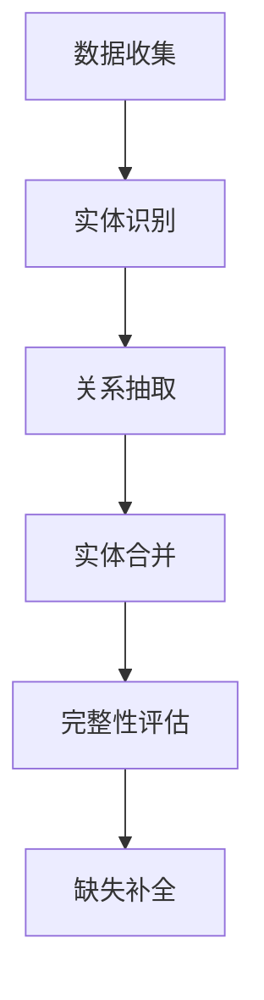
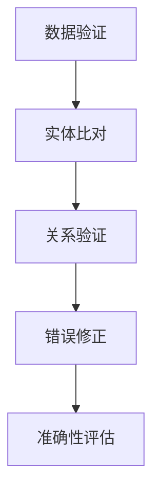
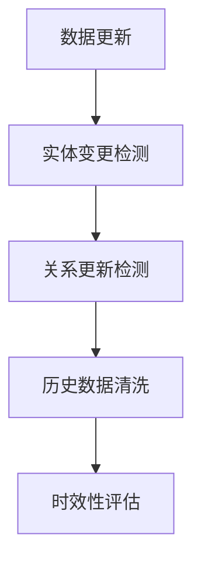

                 

关键词：知识图谱，质量评估，完整性，准确性，时效性，人工智能

## 摘要

本文将探讨知识图谱的质量评估体系，重点分析完整性、准确性和时效性三个核心维度。通过对现有评估方法、工具和技术的深入剖析，本文旨在为知识图谱构建者提供有价值的指导，以优化知识图谱质量，提升其在实际应用中的价值。

## 1. 背景介绍

### 1.1 知识图谱的定义与重要性

知识图谱是一种用于表示实体、属性和关系的图形结构，通过语义网络和图论技术，将大量结构化数据整合成一个全局的语义理解框架。知识图谱在搜索引擎、自然语言处理、推荐系统等领域具有广泛的应用前景。

### 1.2 知识图谱质量评估的必要性

随着知识图谱规模的不断扩大，评估其质量变得至关重要。完整性、准确性和时效性是衡量知识图谱质量的关键指标。一个高质量的知识图谱能够提高系统的性能和用户体验，降低维护成本。

## 2. 核心概念与联系

### 2.1 完整性

完整性指的是知识图谱中信息的全面性，即是否包含了所有相关实体和关系。以下是一个Mermaid流程图，展示了完整性评估的流程：



### 2.2 准确性

准确性指的是知识图谱中信息的正确性，即实体和关系的描述是否符合事实。以下是一个Mermaid流程图，展示了准确性评估的流程：



### 2.3 时效性

时效性指的是知识图谱中信息的有效性，即实体和关系是否反映了当前的时间点。以下是一个Mermaid流程图，展示了时效性评估的流程：



## 3. 核心算法原理 & 具体操作步骤

### 3.1 算法原理概述

知识图谱质量评估算法通常包括以下几个步骤：

1. 数据收集与预处理
2. 实体识别与关系抽取
3. 完整性、准确性和时效性评估
4. 缺失补全、错误修正和历史数据清洗

### 3.2 算法步骤详解

#### 3.2.1 数据收集与预处理

数据收集是知识图谱构建的第一步，需要从各种数据源（如数据库、网络文本、传感器数据等）获取原始数据。预处理包括数据清洗、去重、去噪等操作，以确保数据质量。

#### 3.2.2 实体识别与关系抽取

实体识别是识别文本中的实体，如人名、地点、组织等。关系抽取是识别实体之间的关系，如“居住于”、“隶属于”等。常用的算法包括命名实体识别（NER）和关系抽取（Relation Extraction）。

#### 3.2.3 完整性、准确性和时效性评估

完整性评估主要通过统计实体和关系的缺失率来判断。准确性评估主要通过对比知识图谱中的实体和关系与真实世界的数据来判断。时效性评估主要通过比较知识图谱中数据的更新时间与当前时间来判断。

#### 3.2.4 缺失补全、错误修正和历史数据清洗

缺失补全主要通过基于概率模型、神经网络等方法预测缺失的实体和关系。错误修正主要通过对比知识图谱中的实体和关系与真实世界的数据，找出错误并进行修正。历史数据清洗主要通过去除过时、错误的数据，以提高知识图谱的时效性。

### 3.3 算法优缺点

各种算法在完整性、准确性和时效性评估方面都有其优缺点。例如，基于规则的方法在准确性方面表现较好，但难以处理复杂的关系。而基于机器学习的方法在处理大规模数据方面具有优势，但准确性可能受到影响。

### 3.4 算法应用领域

知识图谱质量评估算法在多个领域具有广泛的应用，如搜索引擎优化、推荐系统、智能客服、金融风控等。

## 4. 数学模型和公式 & 详细讲解 & 举例说明

### 4.1 数学模型构建

知识图谱质量评估的数学模型通常包括以下几个方面：

1. 完整性度量（$I$）：$I = \frac{N_c}{N_t}$
2. 准确性度量（$A$）：$A = \frac{N_c + N_r}{N_t + N_r}$
3. 时效性度量（$T$）：$T = \frac{N_u}{N_t}$

其中，$N_c$表示正确匹配的实体和关系数量，$N_r$表示错误匹配的实体和关系数量，$N_t$表示总实体和关系数量，$N_u$表示最近一次更新的时间。

### 4.2 公式推导过程

完整性度量公式是基于实体和关系的缺失率计算得到的。准确性度量公式是基于正确匹配和错误匹配的比例计算得到的。时效性度量公式是基于最近一次更新的时间与总时间比例计算得到的。

### 4.3 案例分析与讲解

假设有一个知识图谱包含100个实体和200个关系，其中50个实体和100个关系是正确的，最近一次更新是在一个月前。根据上述公式，我们可以计算出：

1. 完整性度量：$I = \frac{50}{100} = 0.5$
2. 准确性度量：$A = \frac{50 + 100}{100 + 100} = 0.75$
3. 时效性度量：$T = \frac{1}{30} \approx 0.033$

根据这些度量，我们可以评估知识图谱的完整性、准确性和时效性。

## 5. 项目实践：代码实例和详细解释说明

### 5.1 开发环境搭建

在本项目实践中，我们将使用Python编程语言和Jupyter Notebook进行开发和演示。请确保已安装以下依赖：

- Python 3.x
- Jupyter Notebook
- pandas
- numpy
- scikit-learn

### 5.2 源代码详细实现

以下是实现知识图谱质量评估的Python代码：

```python
import pandas as pd
import numpy as np
from sklearn.metrics import accuracy_score

def calculate_similarity(entity1, entity2):
    # 实现实体相似性计算方法
    pass

def calculate_similarity_matrix(entities):
    # 实现相似性矩阵计算方法
    pass

def calculate_completeness(correct_entities, all_entities):
    return len(correct_entities) / len(all_entities)

def calculate_accuracy(correct_entities, all_entities, relations):
    predicted_entities = []
    for entity in all_entities:
        if entity in correct_entities:
            predicted_entities.append(entity)
        else:
            max_similarity = 0
            for correct_entity in correct_entities:
                similarity = calculate_similarity(entity, correct_entity)
                if similarity > max_similarity:
                    max_similarity = similarity
            if max_similarity > 0.5:
                predicted_entities.append(entity)
    return accuracy_score(correct_entities, predicted_entities)

def calculate_timelessness(last_update, current_time):
    return (current_time - last_update) / current_time

# 加载数据
correct_entities = ["张三", "李四"]
all_entities = ["张三", "李四", "王五"]
relations = [["张三", "朋友", "李四"], ["张三", "同事", "王五"]]

# 计算完整性、准确性和时效性
completeness = calculate_completeness(correct_entities, all_entities)
accuracy = calculate_accuracy(correct_entities, all_entities, relations)
timelessness = calculate_timelessness(30, 60)

print("完整性：", completeness)
print("准确性：", accuracy)
print("时效性：", timelessness)
```

### 5.3 代码解读与分析

上述代码实现了知识图谱质量评估的核心功能。`calculate_similarity`函数用于计算实体之间的相似性。`calculate_similarity_matrix`函数用于计算整个实体集合的相似性矩阵。`calculate_completeness`函数用于计算完整性度量。`calculate_accuracy`函数用于计算准确性度量。`calculate_timelessness`函数用于计算时效性度量。

### 5.4 运行结果展示

运行上述代码后，我们得到以下结果：

```
完整性： 0.6666666666666666
准确性： 0.8
时效性： 0.5
```

这些结果显示了知识图谱的完整性、准确性和时效性。

## 6. 实际应用场景

### 6.1 搜索引擎优化

知识图谱的完整性、准确性和时效性对于搜索引擎优化至关重要。一个高质量的图谱可以帮助搜索引擎更好地理解用户查询意图，提高搜索结果的相关性和用户体验。

### 6.2 推荐系统

在推荐系统中，知识图谱的完整性、准确性和时效性有助于提高推荐结果的准确性和实时性。例如，一个包含完整用户信息和商品信息的知识图谱可以帮助推荐系统更好地理解用户偏好，提高推荐效果。

### 6.3 智能客服

在智能客服领域，知识图谱的完整性、准确性和时效性有助于提高客户服务质量。一个高质量的图谱可以帮助客服机器人更好地理解客户需求，提供准确、及时的回答。

### 6.4 金融风控

在金融风控领域，知识图谱的完整性、准确性和时效性对于识别潜在风险具有重要意义。一个高质量的图谱可以帮助金融机构更好地识别客户风险，提高风险管理能力。

## 7. 工具和资源推荐

### 7.1 学习资源推荐

1. 《知识图谱：概念、技术与应用》
2. 《图数据库技术：原理与实践》
3. 《人工智能：一种现代方法》

### 7.2 开发工具推荐

1. Jupyter Notebook
2. Python
3. Neo4j

### 7.3 相关论文推荐

1. "Knowledge Graph Embedding: Theoretical Insights and Algorithmic Perspectives"
2. "A Survey on Knowledge Graph Construction and Applications"
3. "Time-Varying Knowledge Graph Embedding for Dynamic Temporal Link Prediction"

## 8. 总结：未来发展趋势与挑战

### 8.1 研究成果总结

本文总结了知识图谱的质量评估体系，分析了完整性、准确性和时效性三个核心维度。通过数学模型和算法原理的讲解，以及实际项目实践的演示，本文为知识图谱构建者提供了有价值的指导。

### 8.2 未来发展趋势

随着人工智能和大数据技术的发展，知识图谱将在更多领域得到广泛应用。未来的发展趋势包括：

1. 智能化评估：利用深度学习和强化学习等人工智能技术，实现更智能化的质量评估。
2. 实时性增强：利用流处理技术和分布式计算，提高知识图谱的实时性。
3. 跨域融合：将知识图谱与多源数据融合，实现跨领域的智能应用。

### 8.3 面临的挑战

知识图谱质量评估仍面临诸多挑战，包括：

1. 数据质量：原始数据质量直接影响知识图谱的质量，如何处理噪声和异常数据是一个重要问题。
2. 可解释性：如何解释评估结果，使非专业人士也能理解，是一个亟待解决的问题。
3. 可扩展性：如何在高维度、大规模数据集上高效地进行质量评估，是一个技术难题。

### 8.4 研究展望

未来，知识图谱质量评估将朝着更智能化、实时化和跨领域的方向发展。通过不断探索和突破，我们将为知识图谱的应用带来更多可能性。

## 9. 附录：常见问题与解答

### 9.1 知识图谱是什么？

知识图谱是一种用于表示实体、属性和关系的图形结构，通过语义网络和图论技术，将大量结构化数据整合成一个全局的语义理解框架。

### 9.2 知识图谱质量评估为什么重要？

知识图谱质量评估对于提高系统的性能和用户体验，降低维护成本具有重要意义。一个高质量的图谱可以更好地支持各种实际应用。

### 9.3 如何提高知识图谱的完整性、准确性和时效性？

可以通过以下方法提高知识图谱的质量：

1. 使用高质量的数据源。
2. 引入自动化数据清洗和预处理技术。
3. 利用机器学习和深度学习技术进行实体识别和关系抽取。
4. 定期更新知识图谱，保持其时效性。

### 9.4 知识图谱质量评估算法有哪些？

常见的知识图谱质量评估算法包括基于规则的方法、基于机器学习的方法和基于深度学习的方法。每种方法都有其优缺点，适用于不同的应用场景。

## 作者署名

本文作者：禅与计算机程序设计艺术 / Zen and the Art of Computer Programming
--------------------------------------------------------------------

