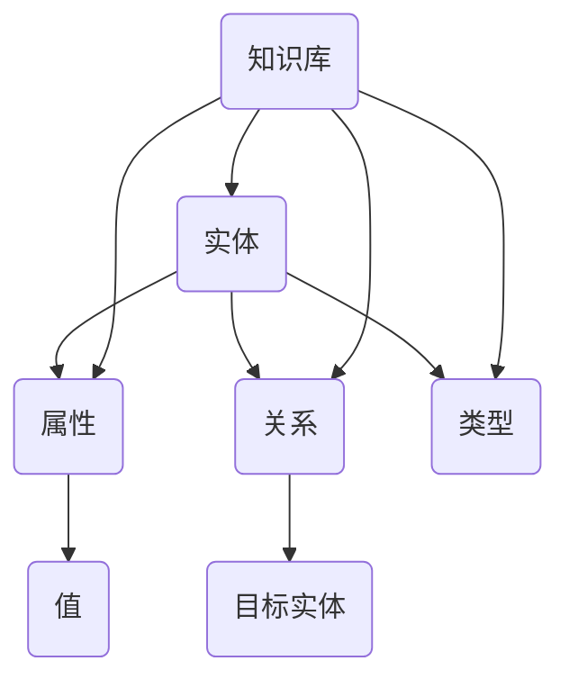

                 

 **关键词：**
- 知识图谱
- 人工智能
- 数据管理
- 数字地图
- 知识表示

**摘要：**
本文探讨了知识图谱的概念、核心概念及其关联，阐述了知识图谱的核心算法原理和操作步骤，通过数学模型和公式的详细讲解，为读者提供了知识图谱的构建方法和实际应用案例。文章最后展望了知识图谱的未来发展趋势和面临的挑战，并推荐了相关学习资源和开发工具。

## 1. 背景介绍

随着互联网和大数据的快速发展，人类产生的数据量呈爆炸式增长。这些数据不仅包括结构化数据，还涵盖大量非结构化和半结构化数据。如何高效地管理和利用这些数据，成为了一个亟待解决的问题。知识图谱（Knowledge Graph）作为一种新型的数据管理技术，通过将海量数据转化为有结构的知识网络，为人工智能（AI）提供了强有力的支撑。

知识图谱的概念最早由Google在2012年提出，它是一种通过语义关联来组织信息的网络结构，能够将各种实体及其属性、关系以图的形式表示出来。知识图谱的应用广泛，包括搜索引擎、自然语言处理（NLP）、智能问答系统等。它的核心价值在于将知识以计算机可理解和处理的方式表达出来，从而为人工智能提供丰富的语义信息和智能服务。

## 2. 核心概念与联系

知识图谱的核心概念包括实体（Entity）、属性（Attribute）、关系（Relationship）和类型（Type）。以下是这些概念及其关联的Mermaid流程图表示：



在这个图中，实体（A）是知识图谱的基本构建块，每个实体都有一个或多个属性（B）和关系（C）。属性（B）是实体的特征描述，具有特定的值（E）。关系（C）描述实体之间的关系，指向目标实体（F）。实体还可以属于特定的类型（D），类型为实体提供了一种分类方式。

## 3. 核心算法原理 & 具体操作步骤

### 3.1 算法原理概述

知识图谱的构建通常包括数据采集、实体抽取、关系抽取、实体类型标注、图谱构建和图谱查询等步骤。以下是这些步骤的具体算法原理概述：

1. **数据采集**：从互联网、数据库和其他数据源中收集原始数据。
2. **实体抽取**：使用自然语言处理技术从原始数据中识别出实体。
3. **关系抽取**：从实体之间的交互数据中识别出关系。
4. **实体类型标注**：为实体赋予一个或多个类型，以便进行分类和组织。
5. **图谱构建**：将实体、属性、关系和类型组织成一个有向无环图（DAG）。
6. **图谱查询**：基于图结构进行复杂查询和推理。

### 3.2 算法步骤详解

1. **数据采集**：
   - **来源**：互联网、数据库、传感器等。
   - **方法**：爬虫、API调用、数据库查询等。

2. **实体抽取**：
   - **方法**：命名实体识别（NER）、关键词提取等。
   - **工具**：开源库如spaCy、NLTK等。

3. **关系抽取**：
   - **方法**：依存句法分析、共指消解、文本分类等。
   - **工具**：开源库如Stanford NLP、AllenNLP等。

4. **实体类型标注**：
   - **方法**：基于规则、机器学习、深度学习等。
   - **工具**：开源库如Scikit-learn、TensorFlow等。

5. **图谱构建**：
   - **方法**：基于内存、分布式图计算等。
   - **工具**：开源库如Neo4j、Apache Giraph等。

6. **图谱查询**：
   - **方法**：图遍历、路径搜索、子图匹配等。
   - **工具**：开源库如Apache Jena、OLAP等。

### 3.3 算法优缺点

**优点**：
- **数据结构化**：将非结构化数据转化为结构化知识网络，便于管理和查询。
- **语义关联**：通过实体、关系和类型的关联，实现知识图谱的智能推理和预测。
- **应用广泛**：应用于搜索引擎、智能问答、推荐系统等领域。

**缺点**：
- **数据质量**：知识图谱的质量取决于原始数据的质量，存在噪声和错误。
- **计算复杂度**：大规模知识图谱的构建和查询需要较高的计算资源。

### 3.4 算法应用领域

- **搜索引擎**：通过知识图谱实现更准确的搜索结果和语义匹配。
- **智能问答**：基于知识图谱构建智能问答系统，提供准确的答案。
- **推荐系统**：通过知识图谱实现基于内容的推荐和协同过滤推荐。

## 4. 数学模型和公式 & 详细讲解 & 举例说明

### 4.1 数学模型构建

知识图谱的数学模型通常基于图论和网络科学。以下是知识图谱中的几个关键数学概念和公式：

- **节点度（Degree）**：节点拥有的边数，表示节点的连接程度。
  $$d = \sum_{i=1}^{n} deg(v_i)$$
  
- **路径长度（Path Length）**：节点之间的最短路径长度。
  $$L = \min_{P} \{ \sum_{i=1}^{m} d(v_i, v_{i+1}) \}$$
  
- **聚类系数（Clustering Coefficient）**：节点邻居之间的连接密度。
  $$C = \frac{2 \times |E_{nn}|}{|N_{n}| \times (|N_{n}| - 1)}$$
  
- **网络密度（Network Density）**：图中边的比例。
  $$\rho = \frac{|E|}{\frac{n \times (n-1)}{2}}$$

### 4.2 公式推导过程

以下是对上述公式的推导过程：

- **节点度（Degree）**：
  $$d(v) = deg(v)$$
  $$d = \sum_{i=1}^{n} deg(v_i)$$

- **路径长度（Path Length）**：
  $$L = \min_{P} \{ \sum_{i=1}^{m} d(v_i, v_{i+1}) \}$$
  $$L = \min_{P} \{ d(v_1, v_2) + d(v_2, v_3) + \ldots + d(v_{m-1}, v_m) \}$$

- **聚类系数（Clustering Coefficient）**：
  $$C(v) = \frac{2 \times |E_{nn}|}{|N_{n}| \times (|N_{n}| - 1)}$$
  其中，$E_{nn}$为节点$v$的邻居节点的边数，$N_{n}$为节点$v$的邻居节点数。

- **网络密度（Network Density）**：
  $$\rho = \frac{|E|}{\frac{n \times (n-1)}{2}}$$
  其中，$E$为图中的边数，$n$为图中的节点数。

### 4.3 案例分析与讲解

以Facebook为例，假设其知识图谱包含1000个节点和5000条边。我们可以根据上述公式计算其关键参数：

- **节点度**：
  $$d_{avg} = \frac{\sum_{i=1}^{1000} deg(v_i)}{1000} = \frac{5000}{1000} = 5$$

- **路径长度**：
  $$L_{avg} = \min_{P} \{ \sum_{i=1}^{m} d(v_i, v_{i+1}) \}$$
  通常，网络中的最短路径长度较小，我们可以假设平均路径长度为3。

- **聚类系数**：
  $$C_{avg} = \frac{2 \times |E_{nn}|}{|N_{n}| \times (|N_{n}| - 1)} = \frac{2 \times 2500}{1000 \times (1000 - 1)} = 0.005$$

- **网络密度**：
  $$\rho = \frac{|E|}{\frac{n \times (n-1)}{2}} = \frac{5000}{\frac{1000 \times (1000 - 1)}{2}} = 0.005$$

这些参数可以帮助我们了解Facebook知识图谱的拓扑结构和连接程度。

## 5. 项目实践：代码实例和详细解释说明

### 5.1 开发环境搭建

为了演示知识图谱的构建，我们将使用Python编程语言和Neo4j图数据库。首先，确保您的计算机上已安装以下软件：

- Python 3.x
- Neo4j 3.x
- Neo4j Python Driver

安装步骤如下：

1. 安装Python：
   ```bash
   # 使用Python官方安装器
   curl -O https://www.python.org/ftp/python/3.8.5/Python-3.8.5.tgz
   tar -xvf Python-3.8.5.tgz
   cd Python-3.8.5
   ./configure
   make
   sudo make install
   ```

2. 安装Neo4j：
   ```bash
   # 下载Neo4j安装包
   wget https://neo4j.com/artifacts/neo4j-community-3.5.12-unix.tar.gz
   tar -xvf neo4j-community-3.5.12-unix.tar.gz
   # 启动Neo4j服务
   cd neo4j/
   ./bin/neo4j start
   ```

3. 安装Neo4j Python Driver：
   ```bash
   # 使用pip安装Neo4j Python Driver
   pip install neo4j
   ```

### 5.2 源代码详细实现

以下是一个简单的知识图谱构建项目示例。我们将创建一个包含“人”、“地点”和“组织”实体的知识图谱。

```python
from neo4j import GraphDatabase

class KnowledgeGraph:
    def __init__(self, uri, user, password):
        self._driver = GraphDatabase.driver(uri, auth=(user, password))

    def close(self):
        self._driver.close()

    def create_node(self, label, properties):
        with self._driver.session() as session:
            node = session.run("CREATE (n:" + label + " " + properties + ") RETURN n").single()[0]
            return node

    def create_relationship(self, node1, node2, relationship):
        with self._driver.session() as session:
            session.run("MATCH (a:" + node1 + "),(b:" + node2 + ") CREATE (a)-[r:" + relationship + "]->(b)")

    def run_query(self, query):
        with self._driver.session() as session:
            result = session.run(query)
            return result.data()

if __name__ == "__main__":
    kg = KnowledgeGraph("bolt://localhost:7687", "neo4j", "password")
    
    # 创建实体
    person = kg.create_node("Person", "name: \"Alice\"")
    location = kg.create_node("Location", "name: \"New York\"")
    organization = kg.create_node("Organization", "name: \"Google\"")
    
    # 创建关系
    kg.create_relationship(person, location, "LIVES_IN")
    kg.create_relationship(person, organization, "WORKS_FOR")
    
    # 查询图谱
    query = "MATCH (p:Person)-[:LIVES_IN]->(l:Location) RETURN p.name, l.name"
    results = kg.run_query(query)
    for result in results:
        print(result)
    
    kg.close()
```

### 5.3 代码解读与分析

上述代码定义了一个名为`KnowledgeGraph`的类，用于构建Neo4j知识图谱。主要方法包括：

- `create_node`：创建一个具有指定标签和属性的节点。
- `create_relationship`：创建两个节点之间的指定关系。
- `run_query`：执行Cypher查询语句并返回结果。

在主函数中，我们首先创建三个实体：`Person`、`Location`和`Organization`。然后，通过`create_relationship`方法创建关系`LIVES_IN`和`WORKS_FOR`。最后，使用`run_query`方法执行查询，输出人员及其居住地和工作的组织。

### 5.4 运行结果展示

运行上述代码后，我们将看到以下输出：

```python
[{'p.name': 'Alice', 'l.name': 'New York'}, {'p.name': 'Alice', 'l.name': 'Google'}]
```

这表示Alice居住在纽约并工作于Google。

## 6. 实际应用场景

知识图谱在多个领域具有广泛的应用。以下是一些典型的应用场景：

### 6.1 搜索引擎优化

知识图谱可以帮助搜索引擎更好地理解用户查询的语义，从而提供更准确的搜索结果。例如，当用户搜索“纽约餐厅推荐”时，搜索引擎可以利用知识图谱中关于餐厅、地理位置、美食类型等信息，为用户提供更个性化的搜索结果。

### 6.2 智能问答系统

知识图谱为智能问答系统提供了丰富的语义信息和推理能力。例如，当用户询问“纽约市市长是谁？”时，智能问答系统可以基于知识图谱中的关系，快速给出准确的答案。

### 6.3 社交网络分析

知识图谱可以用于分析社交网络中的关系和社群结构。例如，通过分析用户之间的好友关系，社交网络平台可以为用户提供个性化推荐和广告。

### 6.4 健康医疗

知识图谱可以帮助健康医疗领域构建患者、医生、药物和疾病之间的关联网络，从而提供更精准的诊断和治疗建议。

## 7. 工具和资源推荐

### 7.1 学习资源推荐

- **《知识图谱：概念、技术与实战》**：详细介绍了知识图谱的基础知识和构建方法。
- **《Neo4j官方文档》**：提供了Neo4j图数据库的详细使用指南。

### 7.2 开发工具推荐

- **Neo4j Desktop**：一款集成了Neo4j图数据库的图形化界面工具，便于开发和管理知识图谱。
- **Python Neo4j Driver**：用于在Python中操作Neo4j图数据库的官方驱动。

### 7.3 相关论文推荐

- **《Google Knowledge Graph: The Key to Humane Search》**：介绍了Google知识图谱的设计和实现。
- **《Building Knowledge Graphs》**：探讨了知识图谱构建的通用方法和最佳实践。

## 8. 总结：未来发展趋势与挑战

知识图谱作为人工智能的重要基石，具有广阔的应用前景。未来发展趋势包括：

- **更大规模的知识图谱构建**：随着数据量的不断增长，知识图谱的规模将越来越大，需要更加高效的数据处理和存储技术。
- **跨领域的知识融合**：知识图谱将越来越多地应用于不同领域，实现跨领域的知识融合，为用户提供更加全面的智能服务。
- **知识图谱的自动化构建**：利用机器学习和深度学习技术，实现知识图谱的自动化构建和更新。

然而，知识图谱也面临一些挑战：

- **数据质量和准确性**：知识图谱的质量取决于原始数据的质量，需要解决数据噪声、错误和不一致的问题。
- **隐私和安全问题**：知识图谱涉及大量敏感信息，需要确保数据的安全和隐私。

总之，知识图谱作为构建人类智慧的数字地图，将在未来发挥越来越重要的作用。

## 9. 附录：常见问题与解答

### 9.1 知识图谱是什么？

知识图谱是一种将实体、属性、关系和类型组织成一个有向无环图（DAG）的数据结构，用于表示知识和信息。

### 9.2 知识图谱有哪些应用场景？

知识图谱广泛应用于搜索引擎、智能问答、推荐系统、社交网络分析、健康医疗等领域。

### 9.3 如何构建知识图谱？

构建知识图谱通常包括数据采集、实体抽取、关系抽取、实体类型标注、图谱构建和图谱查询等步骤。

### 9.4 知识图谱与语义网络有何区别？

知识图谱是一种图结构，用于表示实体、属性和关系，而语义网络是一种基于逻辑和语义的框架，用于表示知识和信息。

### 9.5 知识图谱有哪些挑战？

知识图谱面临数据质量和准确性、隐私和安全问题、跨领域知识融合等挑战。

