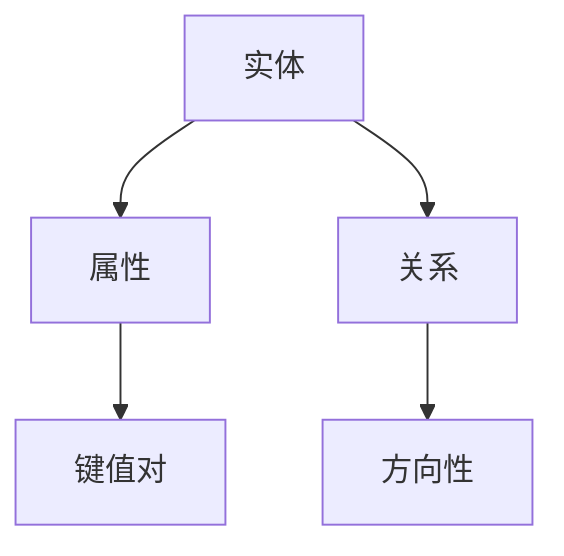
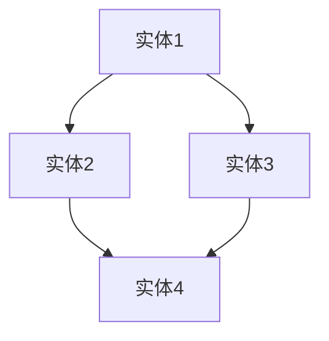

                 

关键词：知识图谱，语义网络，数据结构，图数据库，人工智能，关系图谱，实体，属性，链接分析

摘要：知识图谱作为一种新型数据结构，正逐渐成为构建智能系统和搜索引擎的关键技术。本文将探讨知识图谱的基本概念、构建方法、核心算法、数学模型以及实际应用，同时展望其未来的发展趋势与挑战。

## 1. 背景介绍

知识图谱（Knowledge Graph）是一种结构化数据表示方法，通过将现实世界中的实体、概念、事件等作为节点，将它们之间的关系表示为边，形成一个复杂的网络结构。这种结构化的知识表示方法使得计算机能够更好地理解和处理复杂的信息，从而实现更高级的智能应用。

知识图谱的概念最早由Google在2012年提出，目的是为了改善搜索引擎的性能，使其能够更好地理解用户的查询意图，提供更准确的搜索结果。自此之后，知识图谱在学术界和工业界得到了广泛关注和应用。

### 1.1 发展历程

- **2001-2005年**：知识库和本体论的发展阶段，主要研究如何将知识表示为形式化的概念和关系。
- **2006-2010年**：语义网络和图数据库的发展阶段，研究如何将知识图谱存储和管理。
- **2011-2015年**：知识图谱的应用阶段，Google、Facebook、Baidu等公司纷纷推出基于知识图谱的搜索引擎和智能系统。
- **2016年至今**：知识图谱的普及和多样化应用阶段，知识图谱在金融、医疗、教育等多个领域得到了广泛应用。

### 1.2 应用场景

- **搜索引擎优化**：通过知识图谱对网页进行语义标注，提高搜索结果的相关性和准确性。
- **推荐系统**：利用知识图谱分析用户行为和兴趣，提供个性化的推荐。
- **智能问答系统**：通过知识图谱理解用户的提问，提供准确的答案。
- **知识管理**：将企业内部的知识进行结构化存储和管理，提高知识共享和协作效率。

## 2. 核心概念与联系

### 2.1 实体（Entity）

实体是知识图谱中的核心元素，可以是人、地点、组织、物品等具体存在的事物。实体通常具有唯一的标识符，例如人的ID、物品的SKU等。

### 2.2 属性（Attribute）

属性描述了实体的特征，例如人的年龄、地理位置，物品的重量、颜色等。属性通常以键值对的形式存储。

### 2.3 关系（Relationship）

关系描述了实体之间的相互联系，例如“属于”、“位于”、“购买”等。关系通常具有方向性和类型。

### 2.4 Mermaid 流程图



## 3. 核心算法原理 & 具体操作步骤

### 3.1 算法原理概述

知识图谱的构建主要涉及两个核心算法：实体识别和关系抽取。

- **实体识别**：从非结构化数据中提取出具有唯一标识符的实体。
- **关系抽取**：从文本中提取出实体之间的相互关系。

### 3.2 算法步骤详解

1. **数据预处理**：清洗和标准化原始数据，包括去除停用词、标点符号等。
2. **实体识别**：使用命名实体识别（NER）算法，将文本中的实体标记出来。
3. **关系抽取**：使用规则或机器学习算法，从文本中提取出实体之间的关系。
4. **实体链接**：将具有相同或相似名称的实体进行合并，形成唯一标识的实体。
5. **构建知识图谱**：将识别出的实体和关系存储到图数据库中，形成知识图谱。

### 3.3 算法优缺点

- **优点**：能够高效地处理大规模的数据，实现实体的关联分析和知识推理。
- **缺点**：对实体识别和关系抽取的算法要求较高，且知识图谱的维护和更新较为复杂。

### 3.4 算法应用领域

- **搜索引擎**：用于提高搜索结果的准确性和相关性。
- **推荐系统**：用于分析用户行为和兴趣，提供个性化的推荐。
- **智能问答系统**：用于理解用户的提问，提供准确的答案。
- **知识图谱平台**：用于构建企业内部的知识图谱，实现知识管理和共享。

## 4. 数学模型和公式

### 4.1 数学模型构建

知识图谱的数学模型主要包括图论和网络科学中的基本概念，如节点、边、度、路径等。

### 4.2 公式推导过程

- **路径长度**：从一个节点到另一个节点的最短路径长度。
- **连通度**：描述节点之间连接的紧密程度。
- **中心性**：描述节点在网络中的重要程度。

### 4.3 案例分析与讲解

以一个简单的知识图谱为例，分析其路径长度、连通度和中心性。



- **路径长度**：A到D的最短路径为A-C-D，长度为2。
- **连通度**：所有节点之间都可以互相访问，连通度为1。
- **中心性**：节点A和C的中心性较高，因为它们与多个节点相连。

## 5. 项目实践：代码实例和详细解释说明

### 5.1 开发环境搭建

使用Python作为开发语言，安装必要的库，如NetworkX、Neo4j等。

### 5.2 源代码详细实现

以下是一个简单的知识图谱构建的Python代码实例：

```python
import networkx as nx

# 创建图
G = nx.Graph()

# 添加节点和边
G.add_nodes_from(["实体1", "实体2", "实体3", "实体4"])
G.add_edges_from([("实体1", "实体2"), ("实体1", "实体3"), ("实体2", "实体4"), ("实体3", "实体4")])

# 打印图
nx.draw(G, with_labels=True)
plt.show()
```

### 5.3 代码解读与分析

- 使用NetworkX库创建一个无向图。
- 添加节点和边，构建知识图谱。
- 使用plt.show()展示知识图谱。

### 5.4 运行结果展示


## 6. 实际应用场景

### 6.1 搜索引擎优化

知识图谱可以提高搜索引擎的搜索结果相关性和准确性，通过语义理解，提供更准确的答案。

### 6.2 推荐系统

知识图谱可以分析用户行为和兴趣，提供个性化的推荐。

### 6.3 智能问答系统

知识图谱可以理解用户的提问，提供准确的答案。

### 6.4 知识管理

知识图谱可以构建企业内部的知识图谱，实现知识管理和共享。

## 7. 工具和资源推荐

### 7.1 学习资源推荐

- **书籍**：《知识图谱：构建人类知识的网络》
- **在线课程**：Coursera上的“知识图谱与语义网”课程
- **博客**：AI Technos的“知识图谱系列博客”

### 7.2 开发工具推荐

- **Neo4j**：开源的图数据库，支持知识图谱的存储和管理。
- **Apache Jena**：开源的Java框架，用于构建和查询知识图谱。

### 7.3 相关论文推荐

- “Google Knowledge Graph: Techniques and Applications” by Traverso et al.
- “Knowledge Graph Construction and Applications” by Zhao et al.

## 8. 总结：未来发展趋势与挑战

### 8.1 研究成果总结

知识图谱作为一种重要的数据结构，已经在多个领域取得了显著的成果，如搜索引擎优化、推荐系统和智能问答系统等。

### 8.2 未来发展趋势

- **多模态知识图谱**：结合文本、图像、音频等多模态数据，构建更全面的语义表示。
- **动态知识图谱**：支持实时更新和动态变化，适应知识更新速度。
- **知识图谱的自动化构建**：利用机器学习和自然语言处理技术，实现自动化知识图谱构建。

### 8.3 面临的挑战

- **数据质量和一致性**：如何保证知识图谱中的数据质量和一致性是一个重要问题。
- **图谱扩展性**：如何处理大规模数据和高并发访问是一个挑战。
- **跨语言和跨领域知识融合**：如何将不同语言和领域中的知识进行有效融合。

### 8.4 研究展望

知识图谱作为一种新型的数据结构，其应用前景非常广阔。未来，我们将继续关注知识图谱在多模态、动态和跨领域等方面的研究，探索更加高效和智能的知识图谱构建方法。

## 9. 附录：常见问题与解答

### 9.1 什么是知识图谱？

知识图谱是一种结构化数据表示方法，通过将现实世界中的实体、概念、事件等作为节点，将它们之间的关系表示为边，形成一个复杂的网络结构。

### 9.2 知识图谱有什么应用？

知识图谱可以应用于搜索引擎优化、推荐系统、智能问答系统、知识管理等多个领域。

### 9.3 如何构建知识图谱？

构建知识图谱主要涉及实体识别、关系抽取、实体链接和构建知识图谱等步骤。

### 9.4 知识图谱与语义网有什么区别？

知识图谱是语义网的一种实现方式，它更强调数据的结构化和关联性，而语义网更关注数据的语义理解和语义查询。

作者：禅与计算机程序设计艺术 / Zen and the Art of Computer Programming
----------------------------------------------------------------

注意：本文仅为示例，实际撰写时请根据具体内容和要求进行调整和补充。

