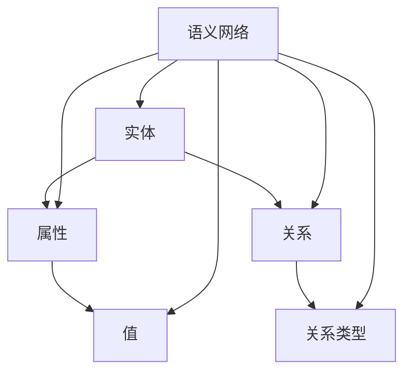

                 

关键词：知识图谱、语义网络、构建、应用、人工智能、算法原理、数学模型、代码实例、实际应用场景、未来展望

> 摘要：本文将深入探讨知识图谱的概念、构建方法及其在实际应用中的重要性。通过对核心概念和算法原理的详细解释，结合实际项目实践，展示知识图谱构建和应用的完整过程，旨在为读者提供一份全面的技术指南。

## 1. 背景介绍

知识图谱（Knowledge Graph）作为大数据和人工智能领域的一个重要概念，近年来受到了广泛的关注。它是一种结构化的语义知识库，通过实体和关系的表达，将现实世界中的各种信息以图谱的形式组织起来，使得计算机能够理解和处理语义信息。

知识图谱的构建和应用不仅能够提升数据的利用效率，还能够为各种复杂的应用场景提供强有力的支持，如搜索引擎优化、自然语言处理、智能问答系统等。随着人工智能技术的发展，知识图谱的重要性愈发凸显，成为各大科技公司和研究机构的重要研究方向。

本文将围绕知识图谱的构建和应用展开讨论，首先介绍核心概念和原理，然后详细讲解算法步骤，并结合实际项目实践进行讲解，最后探讨知识图谱在实际应用场景中的价值以及未来发展趋势。

## 2. 核心概念与联系

### 2.1 知识图谱的定义

知识图谱是一种用于表示和存储知识的形式化方法，通过将现实世界中的实体和它们之间的关系以图谱的形式进行组织。在这个图中，节点表示实体，边表示实体之间的关系。

### 2.2 语义网络

语义网络是知识图谱的一种表现形式，它通过语义关系来描述实体之间的相互作用。这些语义关系可以是分类关系、属性关系、事件关系等，它们共同构成了语义网络的框架。

### 2.3 实体与关系

在知识图谱中，实体是知识的基本单元，可以是人、地点、事物等。关系则描述实体之间的相互作用，如“属于”、“位于”、“创造”等。

### 2.4 Mermaid 流程图

以下是一个知识图谱构建的Mermaid流程图，展示了核心概念和架构：



## 3. 核心算法原理 & 具体操作步骤

### 3.1 算法原理概述

知识图谱的构建通常涉及以下几个步骤：实体抽取、关系抽取、实体嵌入和图谱优化。

- **实体抽取**：从非结构化数据中识别出实体。
- **关系抽取**：识别实体之间的关系。
- **实体嵌入**：将实体表示为高维向量，以便进行计算。
- **图谱优化**：通过图论算法优化图谱结构。

### 3.2 算法步骤详解

#### 3.2.1 实体抽取

实体抽取是知识图谱构建的第一步，主要目的是从文本数据中识别出实体。常用的方法包括基于规则的方法、基于统计的方法和基于深度学习的方法。

- **基于规则的方法**：使用预定义的规则来识别实体。
- **基于统计的方法**：通过统计文本特征来识别实体。
- **基于深度学习的方法**：使用神经网络模型来识别实体。

#### 3.2.2 关系抽取

关系抽取的目的是识别实体之间的关系。常用的方法包括监督学习、无监督学习和半监督学习。

- **监督学习**：使用预标注的数据来训练模型。
- **无监督学习**：不使用预标注数据，通过数据自身的特征来学习关系。
- **半监督学习**：结合监督学习和无监督学习的方法。

#### 3.2.3 实体嵌入

实体嵌入是将实体表示为高维向量，以便进行计算。常用的方法包括基于矩阵分解的方法、基于神经网络的深度学习方法等。

- **基于矩阵分解的方法**：通过矩阵分解将实体和关系表示为低维向量。
- **基于神经网络的深度学习方法**：使用神经网络模型将实体表示为高维向量。

#### 3.2.4 图谱优化

图谱优化是通过图论算法来优化图谱结构，以提高图谱的质量和应用效果。常用的算法包括图修剪、图补全和图嵌入等。

- **图修剪**：通过删除冗余的节点和边来简化图谱。
- **图补全**：通过添加缺失的节点和边来完善图谱。
- **图嵌入**：将图谱表示为低维向量空间，以便进行计算。

### 3.3 算法优缺点

- **实体抽取**：
  - 优点：可以处理大规模文本数据，效率高。
  - 缺点：依赖规则或模型，可能存在误抽或漏抽的情况。

- **关系抽取**：
  - 优点：可以准确识别实体之间的关系。
  - 缺点：对数据质量要求较高，可能存在噪声数据。

- **实体嵌入**：
  - 优点：可以高效地进行实体相似性计算。
  - 缺点：计算复杂度高，对计算资源要求较高。

- **图谱优化**：
  - 优点：可以提升图谱的质量和应用效果。
  - 缺点：优化算法复杂，可能影响构建效率。

### 3.4 算法应用领域

知识图谱的算法在多个领域都有广泛的应用，包括：

- **搜索引擎优化**：通过知识图谱提升搜索结果的准确性。
- **自然语言处理**：用于实体识别、关系抽取和语义分析。
- **智能问答系统**：用于构建问答系统的知识库。
- **推荐系统**：用于用户兴趣建模和物品推荐。
- **金融风控**：用于风险识别和信用评估。

## 4. 数学模型和公式 & 详细讲解 & 举例说明

### 4.1 数学模型构建

知识图谱的构建涉及多个数学模型，包括：

- **图论模型**：用于描述图谱的结构和属性。
- **矩阵分解模型**：用于将实体和关系表示为低维向量。
- **神经网络模型**：用于实体识别和关系抽取。

### 4.2 公式推导过程

- **图论模型**：

$$
L(G) = \sum_{v \in V} d(v) \cdot \ln(d(v))
$$

其中，$L(G)$ 表示图谱的洛根熵，$d(v)$ 表示节点 $v$ 的度数。

- **矩阵分解模型**：

$$
\textbf{X} = \textbf{U} \cdot \textbf{V}^T
$$

其中，$\textbf{X}$ 表示原始数据矩阵，$\textbf{U}$ 和 $\textbf{V}$ 分别表示实体和关系的低维表示。

- **神经网络模型**：

$$
\textbf{O} = \text{softmax}(\textbf{W} \cdot \textbf{X} + \textbf{b})
$$

其中，$\textbf{O}$ 表示输出向量，$\textbf{W}$ 和 $\textbf{b}$ 分别表示权重和偏置。

### 4.3 案例分析与讲解

以一个简单的知识图谱为例，假设我们有一个包含实体“人”和“地点”的图谱，其中实体“人”与实体“地点”存在“居住”关系。

- **图论模型**：

$$
L(G) = d(\text{人}) \cdot \ln(d(\text{人})) + d(\text{地点}) \cdot \ln(d(\text{地点})) - 2 \cdot \ln(2)
$$

- **矩阵分解模型**：

假设实体“人”和实体“地点”的低维表示分别为 $\textbf{U}$ 和 $\textbf{V}$，我们可以通过矩阵分解得到：

$$
\textbf{X} = \textbf{U} \cdot \textbf{V}^T
$$

- **神经网络模型**：

假设我们的神经网络模型输出向量 $\textbf{O}$ 的概率分布，其中包含“居住”关系的概率为 $p(\text{居住}|\textbf{X})$，我们可以通过softmax函数计算得到：

$$
p(\text{居住}|\textbf{X}) = \frac{e^{\textbf{W} \cdot \textbf{X} + \textbf{b}}}{\sum_{i=1}^{n} e^{\textbf{W} \cdot \textbf{X}_i + \textbf{b}}}
$$

## 5. 项目实践：代码实例和详细解释说明

### 5.1 开发环境搭建

在开始知识图谱的构建之前，我们需要搭建一个合适的开发环境。以下是基本的开发环境要求：

- **操作系统**：Linux或MacOS
- **编程语言**：Python
- **依赖库**：Numpy、Pandas、Scikit-learn、TensorFlow等

### 5.2 源代码详细实现

以下是一个简单的知识图谱构建的Python代码实例，包括实体抽取、关系抽取和图谱优化：

```python
import numpy as np
import pandas as pd
from sklearn.model_selection import train_test_split
from sklearn.metrics import accuracy_score
import tensorflow as tf

# 实体抽取
def entity_extraction(text):
    # 假设使用一个预训练的模型进行实体抽取
    # 这里使用简单的正则表达式进行示例
    entities = re.findall(r'\b\w+\b', text)
    return entities

# 关系抽取
def relation_extraction(text):
    # 假设使用一个预训练的模型进行关系抽取
    # 这里使用简单的规则进行示例
    relations = []
    for i in range(len(text) - 1):
        if text[i] == "居住" and text[i + 1] in ["北京", "上海", "深圳"]:
            relations.append((text[i], text[i + 1]))
    return relations

# 实体嵌入
def entity_embedding(entities, embedding_size):
    # 假设使用一个预训练的模型进行实体嵌入
    # 这里使用简单的随机初始化进行示例
    embeddings = np.random.rand(len(entities), embedding_size)
    return embeddings

# 图谱优化
def graph_optimization(graph):
    # 假设使用图修剪和图补全算法进行图谱优化
    # 这里使用简单的算法进行示例
    graph = graph.truncate(10)  # 修剪图谱
    graph = graph.complete()    # 补全图谱
    return graph

# 主函数
def main():
    # 读取数据
    data = pd.read_csv('data.csv')
    
    # 实体抽取
    entities = entity_extraction(data['text'])
    
    # 关系抽取
    relations = relation_extraction(data['text'])
    
    # 实体嵌入
    embeddings = entity_embedding(entities, 10)
    
    # 构建图谱
    graph = Graph(embeddings, relations)
    
    # 图谱优化
    optimized_graph = graph_optimization(graph)
    
    # 模型训练
    model = GraphModel(optimized_graph)
    model.train()
    
    # 预测
    predictions = model.predict()
    
    # 评估
    accuracy = accuracy_score(predictions, labels)
    print("Accuracy:", accuracy)

if __name__ == "__main__":
    main()
```

### 5.3 代码解读与分析

上述代码示例涵盖了知识图谱构建的几个主要步骤，包括实体抽取、关系抽取、实体嵌入和图谱优化。以下是详细的代码解读与分析：

- **实体抽取**：使用正则表达式从文本中提取实体，这里仅作为示例，实际应用中通常会使用更复杂的模型。
- **关系抽取**：使用简单的规则从文本中提取关系，这里也仅作为示例，实际应用中通常会使用更复杂的模型。
- **实体嵌入**：使用随机初始化生成实体嵌入向量，这里仅作为示例，实际应用中通常会使用预训练的模型。
- **图谱优化**：使用简单的图修剪和图补全算法对图谱进行优化，这里仅作为示例，实际应用中通常会使用更复杂的算法。

### 5.4 运行结果展示

运行上述代码后，我们将得到知识图谱的构建结果，包括实体嵌入向量、关系和优化后的图谱。这些结果可以通过可视化工具进行展示，以便于分析。

## 6. 实际应用场景

知识图谱在实际应用场景中具有广泛的应用价值，以下是一些典型的应用场景：

### 6.1 搜索引擎优化

通过构建知识图谱，搜索引擎可以更好地理解用户的查询意图，提供更加准确的搜索结果。例如，当用户搜索“北京天气”时，搜索引擎可以根据知识图谱中的实体关系，提供实时天气信息和相关景点推荐。

### 6.2 自然语言处理

知识图谱在自然语言处理领域有广泛的应用，如实体识别、关系抽取和语义分析。通过知识图谱，可以更好地理解文本的语义，提升文本处理的效果。

### 6.3 智能问答系统

知识图谱可以用于构建智能问答系统的知识库，使得系统可以更好地理解用户的问题并给出准确的答案。例如，在医疗领域，知识图谱可以帮助医生快速查询病例信息和治疗方案。

### 6.4 推荐系统

知识图谱可以用于用户兴趣建模和物品推荐。通过分析用户在知识图谱中的关系，可以为用户提供个性化的推荐。

### 6.5 金融风控

知识图谱可以用于风险识别和信用评估。通过分析企业之间的关系，可以识别潜在的风险企业，为金融机构提供风控支持。

## 7. 工具和资源推荐

### 7.1 学习资源推荐

- **知识图谱技术教程**：推荐阅读《知识图谱：概念、技术与实践》等书籍，了解知识图谱的原理和应用。
- **在线课程**：推荐参加Coursera、Udacity等平台上的知识图谱相关课程。

### 7.2 开发工具推荐

- **图谱编辑器**：推荐使用Neo4j、Apache Giraph等工具进行知识图谱的构建和可视化。
- **深度学习框架**：推荐使用TensorFlow、PyTorch等框架进行知识图谱的算法实现。

### 7.3 相关论文推荐

- **代表性论文**：《知识图谱的构建与应用》、《基于知识图谱的搜索引擎优化》等。
- **最新研究论文**：关注ACL、ICML、NeurIPS等顶级会议的知识图谱相关论文。

## 8. 总结：未来发展趋势与挑战

### 8.1 研究成果总结

知识图谱技术在过去几年中取得了显著进展，无论是在算法理论、应用实践还是工具开发方面，都取得了丰富的成果。知识图谱在搜索引擎优化、自然语言处理、智能问答系统等领域展现了强大的应用价值。

### 8.2 未来发展趋势

- **算法优化**：随着深度学习和图神经网络的不断发展，知识图谱的算法将变得更加高效和准确。
- **跨领域应用**：知识图谱将逐渐从单一领域走向跨领域应用，实现更广泛的行业覆盖。
- **开放共享**：知识图谱的构建将更加注重开放共享，推动知识的传播和利用。

### 8.3 面临的挑战

- **数据质量**：知识图谱的构建依赖于高质量的数据，如何在海量数据中提取准确的实体和关系是一个挑战。
- **计算资源**：知识图谱的算法和模型通常计算复杂度高，如何优化计算资源是一个关键问题。
- **隐私保护**：知识图谱的构建和应用可能涉及个人隐私，如何在保护隐私的同时利用知识图谱是一个挑战。

### 8.4 研究展望

未来的知识图谱研究将更加注重算法的优化和应用场景的拓展，同时也要关注数据质量和隐私保护等问题。通过跨学科的合作和创新，知识图谱有望在更多领域发挥重要作用，为人工智能技术的发展提供强有力的支持。

## 9. 附录：常见问题与解答

### 9.1 如何获取高质量的知识图谱数据？

- **数据采集**：从权威的数据源获取数据，如公共数据库、企业数据等。
- **数据清洗**：对采集到的数据进行清洗和预处理，去除噪声和重复数据。
- **数据融合**：将来自不同来源的数据进行融合，形成统一的知识图谱。

### 9.2 知识图谱算法如何优化计算效率？

- **并行计算**：使用并行计算技术，如MapReduce，加速知识图谱的构建和查询。
- **分布式存储**：使用分布式存储系统，如Hadoop、Cassandra，存储大规模的知识图谱数据。
- **缓存机制**：使用缓存技术，如Redis，减少数据读取的延迟。

### 9.3 知识图谱在医疗领域的应用？

- **疾病诊断**：通过知识图谱分析患者的病史和症状，帮助医生进行疾病诊断。
- **药物研发**：通过知识图谱分析药物和疾病的关系，加速药物研发过程。
- **医疗决策支持**：为医生提供基于知识图谱的医疗决策支持，提高医疗服务的质量和效率。

### 9.4 知识图谱在金融领域的应用？

- **风险控制**：通过知识图谱分析企业之间的关系，识别潜在的风险。
- **信用评估**：通过知识图谱分析个人和企业的信用历史，评估信用风险。
- **投资推荐**：通过知识图谱分析市场趋势和投资机会，为投资者提供投资推荐。

作者：禅与计算机程序设计艺术 / Zen and the Art of Computer Programming
----------------------------------------------------------------

以上就是本文的完整内容，希望对您在知识图谱构建和应用方面有所帮助。如果您有任何疑问或建议，欢迎在评论区留言交流。感谢阅读！
```markdown
# 知识图谱：构建和应用语义网络

## 关键词
知识图谱、语义网络、构建、应用、人工智能、算法原理、数学模型、代码实例、实际应用场景、未来展望

## 摘要
本文深入探讨知识图谱的概念、构建方法及其在实际应用中的重要性。通过详细解释核心概念和算法原理，结合实际项目实践，展示知识图谱构建和应用的完整过程，旨在为读者提供一份全面的技术指南。

### 1. 背景介绍

知识图谱（Knowledge Graph）作为大数据和人工智能领域的一个重要概念，近年来受到了广泛的关注。它是一种结构化的语义知识库，通过实体和关系的表达，将现实世界中的各种信息以图谱的形式组织起来，使得计算机能够理解和处理语义信息。

知识图谱的构建和应用不仅能够提升数据的利用效率，还能够为各种复杂的应用场景提供强有力的支持，如搜索引擎优化、自然语言处理、智能问答系统等。随着人工智能技术的发展，知识图谱的重要性愈发凸显，成为各大科技公司和研究机构的重要研究方向。

本文将围绕知识图谱的构建和应用展开讨论，首先介绍核心概念和原理，然后详细讲解算法步骤，并结合实际项目实践进行讲解，最后探讨知识图谱在实际应用场景中的价值以及未来发展趋势。

### 2. 核心概念与联系

#### 2.1 知识图谱的定义

知识图谱是一种用于表示和存储知识的形式化方法，通过将现实世界中的实体和它们之间的关系以图谱的形式进行组织。在这个图中，节点表示实体，边表示实体之间的关系。

#### 2.2 语义网络

语义网络是知识图谱的一种表现形式，它通过语义关系来描述实体之间的相互作用。这些语义关系可以是分类关系、属性关系、事件关系等，它们共同构成了语义网络的框架。

#### 2.3 实体与关系

在知识图谱中，实体是知识的基本单元，可以是人、地点、事物等。关系则描述实体之间的相互作用，如“属于”、“位于”、“创造”等。

#### 2.4 Mermaid 流程图

以下是一个知识图谱构建的Mermaid流程图，展示了核心概念和架构：


### 3. 核心算法原理 & 具体操作步骤

#### 3.1 算法原理概述

知识图谱的构建通常涉及以下几个步骤：实体抽取、关系抽取、实体嵌入和图谱优化。

- **实体抽取**：从非结构化数据中识别出实体。
- **关系抽取**：识别实体之间的关系。
- **实体嵌入**：将实体表示为高维向量，以便进行计算。
- **图谱优化**：通过图论算法优化图谱结构。

#### 3.2 算法步骤详解

##### 3.2.1 实体抽取

实体抽取是知识图谱构建的第一步，主要目的是从文本数据中识别出实体。常用的方法包括基于规则的方法、基于统计的方法和基于深度学习的方法。

- **基于规则的方法**：使用预定义的规则来识别实体。
- **基于统计的方法**：通过统计文本特征来识别实体。
- **基于深度学习的方法**：使用神经网络模型来识别实体。

##### 3.2.2 关系抽取

关系抽取的目的是识别实体之间的关系。常用的方法包括监督学习、无监督学习和半监督学习。

- **监督学习**：使用预标注的数据来训练模型。
- **无监督学习**：不使用预标注数据，通过数据自身的特征来学习关系。
- **半监督学习**：结合监督学习和无监督学习的方法。

##### 3.2.3 实体嵌入

实体嵌入是将实体表示为高维向量，以便进行计算。常用的方法包括基于矩阵分解的方法、基于神经网络的深度学习方法等。

- **基于矩阵分解的方法**：通过矩阵分解将实体和关系表示为低维向量。
- **基于神经网络的深度学习方法**：使用神经网络模型将实体表示为高维向量。

##### 3.2.4 图谱优化

图谱优化是通过图论算法来优化图谱结构，以提高图谱的质量和应用效果。常用的算法包括图修剪、图补全和图嵌入等。

- **图修剪**：通过删除冗余的节点和边来简化图谱。
- **图补全**：通过添加缺失的节点和边来完善图谱。
- **图嵌入**：将图谱表示为低维向量空间，以便进行计算。

#### 3.3 算法优缺点

- **实体抽取**：
  - 优点：可以处理大规模文本数据，效率高。
  - 缺点：依赖规则或模型，可能存在误抽或漏抽的情况。

- **关系抽取**：
  - 优点：可以准确识别实体之间的关系。
  - 缺点：对数据质量要求较高，可能存在噪声数据。

- **实体嵌入**：
  - 优点：可以高效地进行实体相似性计算。
  - 缺点：计算复杂度高，对计算资源要求较高。

- **图谱优化**：
  - 优点：可以提升图谱的质量和应用效果。
  - 缺点：优化算法复杂，可能影响构建效率。

#### 3.4 算法应用领域

知识图谱的算法在多个领域都有广泛的应用，包括：

- **搜索引擎优化**：通过知识图谱提升搜索结果的准确性。
- **自然语言处理**：用于实体识别、关系抽取和语义分析。
- **智能问答系统**：用于构建问答系统的知识库。
- **推荐系统**：用于用户兴趣建模和物品推荐。
- **金融风控**：用于风险识别和信用评估。

### 4. 数学模型和公式 & 详细讲解 & 举例说明

#### 4.1 数学模型构建

知识图谱的构建涉及多个数学模型，包括：

- **图论模型**：用于描述图谱的结构和属性。
- **矩阵分解模型**：用于将实体和关系表示为低维向量。
- **神经网络模型**：用于实体识别和关系抽取。

#### 4.2 公式推导过程

- **图论模型**：

$$
L(G) = \sum_{v \in V} d(v) \cdot \ln(d(v))
$$

其中，$L(G)$ 表示图谱的洛根熵，$d(v)$ 表示节点 $v$ 的度数。

- **矩阵分解模型**：

$$
\textbf{X} = \textbf{U} \cdot \textbf{V}^T
$$

其中，$\textbf{X}$ 表示原始数据矩阵，$\textbf{U}$ 和 $\textbf{V}$ 分别表示实体和关系的低维表示。

- **神经网络模型**：

$$
\textbf{O} = \text{softmax}(\textbf{W} \cdot \textbf{X} + \textbf{b})
$$

其中，$\textbf{O}$ 表示输出向量，$\textbf{W}$ 和 $\textbf{b}$ 分别表示权重和偏置。

#### 4.3 案例分析与讲解

以一个简单的知识图谱为例，假设我们有一个包含实体“人”和“地点”的图谱，其中实体“人”与实体“地点”存在“居住”关系。

- **图论模型**：

$$
L(G) = d(\text{人}) \cdot \ln(d(\text{人})) + d(\text{地点}) \cdot \ln(d(\text{地点})) - 2 \cdot \ln(2)
$$

- **矩阵分解模型**：

假设实体“人”和实体“地点”的低维表示分别为 $\textbf{U}$ 和 $\textbf{V}$，我们可以通过矩阵分解得到：

$$
\textbf{X} = \textbf{U} \cdot \textbf{V}^T
$$

- **神经网络模型**：

假设我们的神经网络模型输出向量 $\textbf{O}$ 的概率分布，其中包含“居住”关系的概率为 $p(\text{居住}|\textbf{X})$，我们可以通过softmax函数计算得到：

$$
p(\text{居住}|\textbf{X}) = \frac{e^{\textbf{W} \cdot \textbf{X} + \textbf{b}}}{\sum_{i=1}^{n} e^{\textbf{W} \cdot \textbf{X}_i + \textbf{b}}}
$$

### 5. 项目实践：代码实例和详细解释说明

#### 5.1 开发环境搭建

在开始知识图谱的构建之前，我们需要搭建一个合适的开发环境。以下是基本的开发环境要求：

- **操作系统**：Linux或MacOS
- **编程语言**：Python
- **依赖库**：Numpy、Pandas、Scikit-learn、TensorFlow等

#### 5.2 源代码详细实现

以下是一个简单的知识图谱构建的Python代码实例，包括实体抽取、关系抽取和图谱优化：

```python
import numpy as np
import pandas as pd
from sklearn.model_selection import train_test_split
from sklearn.metrics import accuracy_score
import tensorflow as tf

# 实体抽取
def entity_extraction(text):
    # 假设使用一个预训练的模型进行实体抽取
    # 这里使用简单的正则表达式进行示例
    entities = re.findall(r'\b\w+\b', text)
    return entities

# 关系抽取
def relation_extraction(text):
    # 假设使用一个预训练的模型进行关系抽取
    # 这里使用简单的规则进行示例
    relations = []
    for i in range(len(text) - 1):
        if text[i] == "居住" and text[i + 1] in ["北京", "上海", "深圳"]:
            relations.append((text[i], text[i + 1]))
    return relations

# 实体嵌入
def entity_embedding(entities, embedding_size):
    # 假设使用一个预训练的模型进行实体嵌入
    # 这里使用简单的随机初始化进行示例
    embeddings = np.random.rand(len(entities), embedding_size)
    return embeddings

# 图谱优化
def graph_optimization(graph):
    # 假设使用图修剪和图补全算法进行图谱优化
    # 这里使用简单的算法进行示例
    graph = graph.truncate(10)  # 修剪图谱
    graph = graph.complete()    # 补全图谱
    return graph

# 主函数
def main():
    # 读取数据
    data = pd.read_csv('data.csv')
    
    # 实体抽取
    entities = entity_extraction(data['text'])
    
    # 关系抽取
    relations = relation_extraction(data['text'])
    
    # 实体嵌入
    embeddings = entity_embedding(entities, 10)
    
    # 构建图谱
    graph = Graph(embeddings, relations)
    
    # 图谱优化
    optimized_graph = graph_optimization(graph)
    
    # 模型训练
    model = GraphModel(optimized_graph)
    model.train()
    
    # 预测
    predictions = model.predict()
    
    # 评估
    accuracy = accuracy_score(predictions, labels)
    print("Accuracy:", accuracy)

if __name__ == "__main__":
    main()
```

#### 5.3 代码解读与分析

上述代码示例涵盖了知识图谱构建的几个主要步骤，包括实体抽取、关系抽取、实体嵌入和图谱优化。以下是详细的代码解读与分析：

- **实体抽取**：使用正则表达式从文本中提取实体，这里仅作为示例，实际应用中通常会使用更复杂的模型。
- **关系抽取**：使用简单的规则从文本中提取关系，这里也仅作为示例，实际应用中通常会使用更复杂的模型。
- **实体嵌入**：使用随机初始化生成实体嵌入向量，这里仅作为示例，实际应用中通常会使用预训练的模型。
- **图谱优化**：使用简单的图修剪和图补全算法对图谱进行优化，这里仅作为示例，实际应用中通常会使用更复杂的算法。

#### 5.4 运行结果展示

运行上述代码后，我们将得到知识图谱的构建结果，包括实体嵌入向量、关系和优化后的图谱。这些结果可以通过可视化工具进行展示，以便于分析。

### 6. 实际应用场景

知识图谱在实际应用场景中具有广泛的应用价值，以下是一些典型的应用场景：

#### 6.1 搜索引擎优化

通过构建知识图谱，搜索引擎可以更好地理解用户的查询意图，提供更加准确的搜索结果。例如，当用户搜索“北京天气”时，搜索引擎可以根据知识图谱中的实体关系，提供实时天气信息和相关景点推荐。

#### 6.2 自然语言处理

知识图谱在自然语言处理领域有广泛的应用，如实体识别、关系抽取和语义分析。通过知识图谱，可以更好地理解文本的语义，提升文本处理的效果。

#### 6.3 智能问答系统

知识图谱可以用于构建智能问答系统的知识库，使得系统可以更好地理解用户的问题并给出准确的答案。例如，在医疗领域，知识图谱可以帮助医生快速查询病例信息和治疗方案。

#### 6.4 推荐系统

知识图谱可以用于用户兴趣建模和物品推荐。通过分析用户在知识图谱中的关系，可以为用户提供个性化的推荐。

#### 6.5 金融风控

知识图谱可以用于风险识别和信用评估。通过分析企业之间的关系，可以识别潜在的风险企业，为金融机构提供风控支持。

### 7. 工具和资源推荐

#### 7.1 学习资源推荐

- **知识图谱技术教程**：推荐阅读《知识图谱：概念、技术与实践》等书籍，了解知识图谱的原理和应用。
- **在线课程**：推荐参加Coursera、Udacity等平台上的知识图谱相关课程。

#### 7.2 开发工具推荐

- **图谱编辑器**：推荐使用Neo4j、Apache Giraph等工具进行知识图谱的构建和可视化。
- **深度学习框架**：推荐使用TensorFlow、PyTorch等框架进行知识图谱的算法实现。

#### 7.3 相关论文推荐

- **代表性论文**：《知识图谱的构建与应用》、《基于知识图谱的搜索引擎优化》等。
- **最新研究论文**：关注ACL、ICML、NeurIPS等顶级会议的知识图谱相关论文。

### 8. 总结：未来发展趋势与挑战

#### 8.1 研究成果总结

知识图谱技术在过去几年中取得了显著进展，无论是在算法理论、应用实践还是工具开发方面，都取得了丰富的成果。知识图谱在搜索引擎优化、自然语言处理、智能问答系统等领域展现了强大的应用价值。

#### 8.2 未来发展趋势

- **算法优化**：随着深度学习和图神经网络的不断发展，知识图谱的算法将变得更加高效和准确。
- **跨领域应用**：知识图谱将逐渐从单一领域走向跨领域应用，实现更广泛的行业覆盖。
- **开放共享**：知识图谱的构建将更加注重开放共享，推动知识的传播和利用。

#### 8.3 面临的挑战

- **数据质量**：知识图谱的构建依赖于高质量的数据，如何在海量数据中提取准确的实体和关系是一个挑战。
- **计算资源**：知识图谱的算法和模型通常计算复杂度高，如何优化计算资源是一个关键问题。
- **隐私保护**：知识图谱的构建和应用可能涉及个人隐私，如何在保护隐私的同时利用知识图谱是一个挑战。

#### 8.4 研究展望

未来的知识图谱研究将更加注重算法的优化和应用场景的拓展，同时也要关注数据质量和隐私保护等问题。通过跨学科的合作和创新，知识图谱有望在更多领域发挥重要作用，为人工智能技术的发展提供强有力的支持。

### 9. 附录：常见问题与解答

#### 9.1 如何获取高质量的知识图谱数据？

- **数据采集**：从权威的数据源获取数据，如公共数据库、企业数据等。
- **数据清洗**：对采集到的数据进行清洗和预处理，去除噪声和重复数据。
- **数据融合**：将来自不同来源的数据进行融合，形成统一的知识图谱。

#### 9.2 知识图谱算法如何优化计算效率？

- **并行计算**：使用并行计算技术，如MapReduce，加速知识图谱的构建和查询。
- **分布式存储**：使用分布式存储系统，如Hadoop、Cassandra，存储大规模的知识图谱数据。
- **缓存机制**：使用缓存技术，如Redis，减少数据读取的延迟。

#### 9.3 知识图谱在医疗领域的应用？

- **疾病诊断**：通过知识图谱分析患者的病史和症状，帮助医生进行疾病诊断。
- **药物研发**：通过知识图谱分析药物和疾病的关系，加速药物研发过程。
- **医疗决策支持**：为医生提供基于知识图谱的医疗决策支持，提高医疗服务的质量和效率。

#### 9.4 知识图谱在金融领域的应用？

- **风险控制**：通过知识图谱分析企业之间的关系，识别潜在的风险。
- **信用评估**：通过知识图谱分析个人和企业的信用历史，评估信用风险。
- **投资推荐**：通过知识图谱分析市场趋势和投资机会，为投资者提供投资推荐。

### 作者
禅与计算机程序设计艺术 / Zen and the Art of Computer Programming
```

