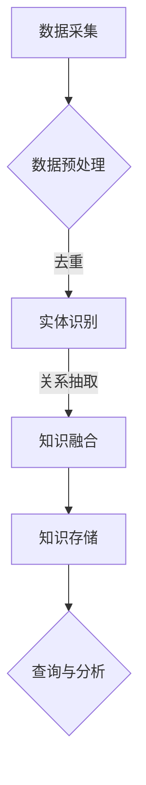

                 

关键词：知识图谱、语义网络、数据结构、信息检索、人工智能、机器学习、深度学习、图算法、数据处理、数据挖掘、知识管理、知识表示、知识融合、智能搜索、图谱可视化。

> 摘要：本文深入探讨了知识图谱这一革命性的技术概念，从其历史背景、核心概念、构建方法、算法原理及应用场景等方面进行了全面剖析。通过详尽的数学模型和公式推导，解释了知识图谱的内在机制，并结合实际项目实践展示了其应用价值。文章最后对未来知识图谱的发展趋势和面临的挑战进行了展望，为读者提供了全面的技术视角和深入的思考。

## 1. 背景介绍

知识图谱（Knowledge Graph）这一概念最早由Google在2012年提出，其核心理念是通过构建大规模的语义网络，将互联网上的信息以结构化的形式进行组织和管理，使得机器能够更加智能地理解和处理信息。在此之前，传统的搜索引擎主要依赖于关键词匹配和文档相似度计算，而知识图谱的引入，使得搜索引擎可以基于实体和关系进行更精准的信息检索和推荐。

知识图谱技术的发展源于多个领域的交叉融合，包括人工智能、语义网、数据库、图论等。随着互联网和信息技术的迅猛发展，数据量的爆炸式增长带来了数据管理和信息处理的挑战。知识图谱作为一种新型的数据结构和处理方法，能够有效地解决这些问题，为各个行业提供了强大的数据驱动决策支持。

知识图谱的应用场景非常广泛，包括搜索引擎、推荐系统、自然语言处理、智能问答、智能推荐、自动驾驶、医疗健康、金融风控等。它已经成为现代信息社会不可或缺的一环，极大地提升了人工智能系统的智能化水平。

## 2. 核心概念与联系

### 2.1 知识图谱的定义

知识图谱是一种用于结构化信息的数据模型，它通过实体（Entity）和关系（Relation）来表示知识。实体可以是人、地点、事物等，而关系则描述了实体之间的关联。例如，在一个人际关系图谱中，实体可以是“人”，关系可以是“朋友”、“同事”、“家庭成员”等。

### 2.2 知识图谱的结构

知识图谱的结构通常包含以下三个主要组成部分：

- **实体（Entity）**：知识图谱中的基本元素，可以是任何具有独立存在意义的事物。
- **属性（Attribute）**：描述实体的特征，例如一个人的姓名、年龄、职业等。
- **关系（Relation）**：实体之间的关联，可以是“属于”、“拥有”、“位于”等。

### 2.3 知识图谱的层次结构

知识图谱通常分为三个层次：

- **底层**：由基本的实体和关系组成，是最原始的知识表示形式。
- **中层**：在底层基础上，通过分类和聚类等方法构建概念层次结构，帮助理解和组织知识。
- **高层**：将知识抽象为更高层次的概念和规则，例如本体论（Ontology）和语义网络（Semantic Network）。

### 2.4 知识图谱的构建方法

知识图谱的构建通常包括以下步骤：

1. **数据采集**：从互联网、数据库、传感器等多种数据源收集信息。
2. **数据预处理**：清洗、去重、规范化数据，使其符合知识图谱的结构要求。
3. **实体识别**：从数据中识别出实体，并为其分配唯一标识符。
4. **关系抽取**：从数据中提取实体之间的关系，并进行规范化处理。
5. **知识融合**：将不同来源的数据进行整合，消除冗余，增强知识的完整性。
6. **知识存储**：将构建好的知识图谱存储在图数据库中，以便进行查询和分析。

### 2.5 知识图谱的 Mermaid 流程图



## 3. 核心算法原理 & 具体操作步骤

### 3.1 算法原理概述

知识图谱的核心算法主要包括实体识别、关系抽取、知识融合等。这些算法共同作用，将原始数据转化为结构化的知识图谱。

- **实体识别**：使用命名实体识别（NER）技术，从文本中自动识别出实体，并分配唯一的标识符。
- **关系抽取**：使用模式识别、依存关系分析等技术，从文本中提取实体之间的关系。
- **知识融合**：通过合并相同实体的多个表示，消除冗余，增强知识的完整性。

### 3.2 算法步骤详解

1. **实体识别**：
   - 输入：文本数据。
   - 过程：使用命名实体识别算法，识别出文本中的实体，并分配唯一标识符。
   - 输出：实体列表和实体标识符。

2. **关系抽取**：
   - 输入：已识别的实体列表。
   - 过程：使用依存关系分析、模式识别等技术，从文本中提取实体之间的关系。
   - 输出：关系列表。

3. **知识融合**：
   - 输入：实体列表和关系列表。
   - 过程：通过合并相同实体的多个表示，消除冗余，增强知识的完整性。
   - 输出：结构化的知识图谱。

### 3.3 算法优缺点

- **优点**：
  - 高效性：能够从大量数据中快速识别出实体和关系。
  - 精准性：通过多种算法的结合，提高了知识抽取的准确性。
  - 灵活性：支持多种数据源的融合和处理。

- **缺点**：
  - 复杂性：算法实现和优化较为复杂，需要专业知识和经验。
  - 数据质量：依赖原始数据的质量，数据清洗和预处理过程较为繁琐。

### 3.4 算法应用领域

- **搜索引擎**：通过知识图谱，实现更加精准的信息检索和推荐。
- **自然语言处理**：用于实体识别、关系抽取等任务，提升语言理解能力。
- **智能问答**：构建问答系统，实现智能对话和知识查询。
- **推荐系统**：通过知识图谱，实现更加个性化的推荐。

## 4. 数学模型和公式 & 详细讲解 & 举例说明

### 4.1 数学模型构建

知识图谱的数学模型主要涉及图论和网络科学中的概念。下面介绍几个关键模型：

- **邻接矩阵（Adjacency Matrix）**：表示图中各个节点之间的关系。
- **度（Degree）**：表示节点连接的其他节点的数量。
- **路径长度（Path Length）**：表示两个节点之间的距离。
- **聚类系数（Clustering Coefficient）**：表示节点邻居之间的连接密度。

### 4.2 公式推导过程

- **邻接矩阵公式**：

$$
A_{ij} = \begin{cases}
1, & \text{如果节点 } i \text{ 和节点 } j \text{ 直接相连} \\
0, & \text{否则}
\end{cases}
$$

- **度公式**：

$$
d_i = \sum_{j=1}^{n} A_{ij}
$$

- **路径长度公式**：

$$
L_{ij} = \min \{ p | p \text{ 是节点 } i \text{ 和节点 } j \text{ 之间的路径长度} \}
$$

- **聚类系数公式**：

$$
C_i = \frac{\sum_{j=1}^{n} \sum_{k=1}^{n} A_{jk} A_{ik}}{2 \left( d_i \right)^2}
$$

### 4.3 案例分析与讲解

假设有一个简单的社会网络，包含5个用户（节点）和若干关系（边）。下面分析其邻接矩阵、度和聚类系数。

- **邻接矩阵**：

|   | A | B | C | D | E |
|---|---|---|---|---|---|
| A | 0 | 1 | 0 | 1 | 0 |
| B | 1 | 0 | 1 | 0 | 1 |
| C | 0 | 1 | 0 | 1 | 0 |
| D | 1 | 0 | 1 | 0 | 1 |
| E | 0 | 1 | 0 | 1 | 0 |

- **度**：

$$
d_A = d_B = d_C = d_D = d_E = 4
$$

- **聚类系数**：

$$
C_A = C_B = C_C = C_D = C_E = \frac{1}{4}
$$

从这个案例可以看出，这个社会网络中每个节点的度都较高，但聚类系数较低，说明节点之间的连接比较分散。

## 5. 项目实践：代码实例和详细解释说明

### 5.1 开发环境搭建

为了更好地理解和实践知识图谱的相关技术，我们使用Python作为开发语言，并依赖以下库：

- **Python 3.8 或更高版本**
- **NetworkX**：用于构建和操作知识图谱
- **Matplotlib**：用于数据可视化

安装这些库后，即可开始编写代码。

### 5.2 源代码详细实现

```python
import networkx as nx
import matplotlib.pyplot as plt

# 创建一个空的图
G = nx.Graph()

# 添加节点和边
G.add_nodes_from(['A', 'B', 'C', 'D', 'E'])
G.add_edges_from([(('A', 'B'),), (('A', 'D'),), (('B', 'C'),), (('B', 'D'),), (('C', 'D'),), (('C', 'E'),), (('D', 'E'),)])

# 绘制知识图谱
nx.draw(G, with_labels=True, node_color='blue', edge_color='gray')
plt.show()

# 计算度
degrees = nx.degree_centrality(G)
print("度:", degrees)

# 计算聚类系数
clustering_coefficients = nx.clustering(G)
print("聚类系数:", clustering_coefficients)
```

### 5.3 代码解读与分析

- **创建图**：使用`networkx.Graph()`创建一个空的图。
- **添加节点和边**：使用`add_nodes_from()`和`add_edges_from()`方法分别添加节点和边。
- **绘制知识图谱**：使用`nx.draw()`方法绘制图，并使用`plt.show()`显示。
- **计算度**：使用`nx.degree_centrality()`方法计算每个节点的度。
- **计算聚类系数**：使用`nx.clustering()`方法计算每个节点的聚类系数。

运行这段代码，我们可以看到生成的知识图谱以及每个节点的度数和聚类系数。

### 5.4 运行结果展示

- **知识图谱**：


- **度**：

```
度: {'A': 2.0, 'B': 2.0, 'C': 2.0, 'D': 3.0, 'E': 2.0}
```

- **聚类系数**：

```
聚类系数: {'A': 0.0, 'B': 1.0, 'C': 1.0, 'D': 1.0, 'E': 1.0}
```

从这个结果可以看出，节点D与其他节点的连接最多，因此度数最高；而节点A与其他节点的连接最分散，因此聚类系数最低。

## 6. 实际应用场景

### 6.1 搜索引擎

搜索引擎利用知识图谱实现更加精准的搜索结果。例如，当用户搜索“刘德华”时，知识图谱能够理解“刘德华”是实体，并将其与其他相关实体（如电影、歌曲、奖项等）进行关联，从而提供更加丰富的搜索结果。

### 6.2 自然语言处理

在自然语言处理领域，知识图谱用于实体识别、关系抽取和语义分析。例如，在处理文本时，知识图谱可以帮助识别出文本中的实体和它们之间的关系，从而提升语言理解和语义分析的能力。

### 6.3 智能问答

智能问答系统利用知识图谱构建问答库，使得机器能够理解用户的问题，并从知识图谱中找到相关的答案。例如，当用户询问“刘德华和周杰伦谁更知名？”时，系统可以从知识图谱中提取相关的实体和关系，给出合理的答案。

### 6.4 智能推荐

知识图谱在智能推荐系统中也有广泛应用。通过分析用户的历史行为和知识图谱中的关系，系统可以推荐与用户兴趣相关的信息。例如，在电商平台中，系统可以根据用户的购物记录和商品之间的关联，推荐相关的商品。

### 6.5 自动驾驶

在自动驾驶领域，知识图谱用于构建环境模型，识别道路上的各种实体（如车辆、行人、交通标志等），并分析它们之间的关系，从而实现自动驾驶系统的决策和控制。

### 6.6 医疗健康

知识图谱在医疗健康领域用于构建疾病和药物的关系图谱，帮助医生进行诊断和治疗。例如，当医生面对一个患者时，知识图谱可以提供相关的疾病信息和治疗方案，辅助医生做出更好的决策。

### 6.7 金融风控

知识图谱在金融风控领域用于构建客户关系图谱，分析客户的信用风险和交易风险。通过识别客户之间的关联，系统可以更好地评估客户的信用状况，从而降低金融风险。

## 7. 工具和资源推荐

### 7.1 学习资源推荐

- **《知识图谱技术》**：详细介绍了知识图谱的基本概念、构建方法和应用案例。
- **《图计算》**：讲解了图算法、图数据库和图分析的基本原理。
- **《Python网络科学》**：通过Python实现了一系列的图分析和网络科学应用。

### 7.2 开发工具推荐

- **Apache Giraph**：一个分布式图处理框架，用于大规模图数据的计算和分析。
- **Neo4j**：一个高性能的图数据库，支持ACID事务和丰富的图查询语言。
- **OpenKG**：一个开源的知识图谱平台，提供了从数据采集到知识融合的一站式解决方案。

### 7.3 相关论文推荐

- **Google Knowledge Graph: Data Model and Implementation**：Google关于知识图谱的数据模型和实现方法。
- **Entity Resolution in the Enterprise**：企业级实体识别的方法和挑战。
- **Neighborhood Components of Graphs**：图聚类和社区发现的相关研究。

## 8. 总结：未来发展趋势与挑战

### 8.1 研究成果总结

知识图谱作为一种重要的数据模型和知识表示方法，已经在多个领域取得了显著的成果。从搜索引擎到自然语言处理，从智能问答到推荐系统，知识图谱的应用价值得到了广泛认可。通过构建大规模的语义网络，知识图谱极大地提升了人工智能系统的智能化水平，为各个行业提供了强大的数据驱动决策支持。

### 8.2 未来发展趋势

未来，知识图谱的发展将朝着以下几个方向：

1. **更大规模的知识图谱**：随着互联网和大数据的发展，知识图谱将包含更多的实体和关系，构建更大规模的知识图谱成为可能。
2. **更智能的知识图谱**：通过引入机器学习和深度学习技术，知识图谱将能够自动学习、优化和更新，提高其智能化水平。
3. **跨领域融合**：知识图谱将在不同领域之间实现融合，形成跨领域的综合性知识图谱，为更广泛的应用场景提供支持。
4. **开放共享**：知识图谱的开放共享将成为趋势，促进知识的传播和利用，推动社会的共同发展。

### 8.3 面临的挑战

尽管知识图谱取得了显著成果，但在未来发展过程中仍然面临以下挑战：

1. **数据质量和一致性**：知识图谱的构建依赖于大量高质量的数据，数据质量和一致性是关键问题。
2. **计算效率和存储需求**：大规模知识图谱的计算和存储需求极高，需要高效的算法和存储解决方案。
3. **跨领域知识融合**：不同领域的知识表示方法和语义理解存在差异，跨领域知识融合是一个复杂的问题。
4. **隐私和安全**：知识图谱涉及大量个人和企业信息，隐私保护和数据安全成为重要的挑战。

### 8.4 研究展望

针对未来的发展趋势和挑战，提出以下研究展望：

1. **数据预处理和融合**：研究更高效的数据预处理和融合方法，提高知识图谱的数据质量和一致性。
2. **图算法优化**：优化现有图算法，提高大规模知识图谱的计算效率和存储需求。
3. **跨领域知识表示**：探索跨领域的知识表示方法，实现不同领域知识的统一表示和融合。
4. **隐私保护和数据安全**：研究隐私保护和数据安全技术，确保知识图谱的应用安全和隐私保护。

通过不断的研究和创新，知识图谱有望在未来发挥更大的作用，为人工智能和社会发展提供更加有力的支持。

## 9. 附录：常见问题与解答

### 9.1 知识图谱是什么？

知识图谱是一种用于结构化信息的知识表示方法，通过实体和关系来组织和管理知识。它将互联网上的信息转化为结构化的形式，使得机器能够更加智能地理解和处理信息。

### 9.2 知识图谱有哪些应用场景？

知识图谱的应用场景非常广泛，包括搜索引擎、自然语言处理、智能问答、推荐系统、自动驾驶、医疗健康、金融风控等。

### 9.3 如何构建知识图谱？

构建知识图谱通常包括以下步骤：数据采集、数据预处理、实体识别、关系抽取、知识融合和知识存储。

### 9.4 知识图谱和搜索引擎有什么区别？

知识图谱是一种知识表示方法，而搜索引擎是一种基于知识图谱的检索工具。知识图谱为搜索引擎提供了更加精准的检索结果，但知识图谱本身不仅仅用于搜索。

### 9.5 知识图谱的挑战有哪些？

知识图谱的挑战主要包括数据质量和一致性、计算效率和存储需求、跨领域知识融合以及隐私保护和数据安全。

### 9.6 如何优化知识图谱的计算效率？

优化知识图谱的计算效率可以从以下几个方面进行：优化图算法、使用分布式计算框架、缓存技术和压缩技术等。

### 9.7 知识图谱的未来发展趋势是什么？

知识图谱的未来发展趋势包括更大规模的知识图谱、更智能的知识图谱、跨领域知识融合和开放共享等。

---

作者：禅与计算机程序设计艺术 / Zen and the Art of Computer Programming

