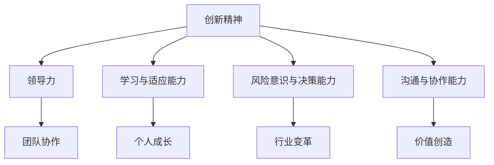

                 

关键词：知识型企业家、创新精神、领导力、团队协作、个人成长、行业变革

> 摘要：本文旨在探讨知识型企业家精神的重要性，分析其核心要素，并提出培养和提升这种精神的策略和方法。文章将通过案例分析、理论阐述和实践指导，帮助读者深入了解知识型企业家精神，为个人和组织的成长提供有益启示。

## 1. 背景介绍

在当今快速变化和高度竞争的商业环境中，知识型企业家精神显得尤为重要。知识型企业家不仅具备技术能力和商业敏锐度，更拥有创新思维、领导力和团队协作能力。他们能够在不断变化的市场环境中抓住机遇，推动组织创新和发展。知识型企业家精神的培养已经成为企业和个人发展的关键因素。

### 1.1 知识型企业家精神的定义

知识型企业家精神是指将专业知识、技能和商业洞察力相结合，以创新的方式解决实际问题、创造价值和推动变革的能力。它包括以下核心要素：

- **创新精神**：勇于挑战现状，不断寻求新的解决方案和方法。
- **领导力**：具备引领团队、激励他人、建立协作和实现共同目标的能力。
- **学习与适应能力**：持续学习新知识、适应新环境和快速变化的能力。
- **风险意识与决策能力**：具备识别风险、做出明智决策和应对不确定性的能力。
- **沟通与协作能力**：能够有效沟通、建立信任和实现团队协作。

### 1.2 知识型企业家精神的背景

随着信息技术的飞速发展和全球化的深入推进，商业环境变得越来越复杂和竞争激烈。传统商业模式和创新方式已经无法满足市场的需求，企业需要更加灵活、创新和具有前瞻性的策略来应对挑战。知识型企业家精神正是在这样的背景下应运而生，成为企业和个人在竞争激烈的市场中脱颖而出的关键。

## 2. 核心概念与联系

### 2.1 知识型企业家精神的 Mermaid 流程图



### 2.2 各核心概念之间的联系

- **创新精神**：是知识型企业家精神的核心，它驱使企业家不断寻求新的解决方案和方法，推动技术创新和商业模式的变革。
- **领导力**：是实现团队协作和共同目标的关键，领导力强的人能够激励和引导团队，创造积极的工作氛围。
- **学习与适应能力**：使企业家能够不断更新知识和技能，适应快速变化的市场环境。
- **风险意识与决策能力**：是企业家在不确定的市场环境中做出明智决策、抓住机遇和应对挑战的基础。
- **沟通与协作能力**：是实现团队协作、建立信任和创造价值的关键。

这些核心概念相互联系、相互促进，共同构成了知识型企业家精神。

## 3. 核心算法原理 & 具体操作步骤

### 3.1 算法原理概述

知识型企业家精神的培养可以被视为一种算法，它涉及以下几个步骤：

1. **知识积累**：通过学习新知识和技能，建立坚实的知识基础。
2. **创新思维**：培养创新精神，勇于挑战现状和寻求新的解决方案。
3. **团队协作**：建立高效的团队，发挥每个人的优势，实现共同目标。
4. **决策与执行**：在不确定的环境中做出明智的决策，并迅速执行。
5. **持续改进**：通过反馈和调整，不断提高自身能力和团队效率。

### 3.2 算法步骤详解

1. **知识积累**：
   - **学习途径**：阅读相关书籍、参加培训课程、参加行业会议等。
   - **知识管理**：建立个人知识库，整理和归纳所学知识。

2. **创新思维**：
   - **发散思维**：尝试从不同角度思考问题，寻找创新的解决方案。
   - **头脑风暴**：与团队成员进行头脑风暴，产生更多的创意。

3. **团队协作**：
   - **沟通与协调**：建立有效的沟通机制，确保信息流畅和团队协作。
   - **能力互补**：发挥团队成员的优势，实现能力互补。

4. **决策与执行**：
   - **风险评估**：对决策进行风险评估，考虑可能的风险和影响。
   - **快速决策**：在不确定的环境中做出快速决策，并迅速执行。

5. **持续改进**：
   - **反馈机制**：建立反馈机制，收集团队成员和客户的反馈。
   - **调整与优化**：根据反馈进行调整和优化，不断提高自身能力和团队效率。

### 3.3 算法优缺点

- **优点**：
  - **高效**：通过系统化的方法，快速培养知识型企业家精神。
  - **灵活**：适应不同行业和市场环境，具有广泛的应用性。
  - **持续**：通过持续学习和改进，不断提高自身能力和团队效率。

- **缺点**：
  - **难度**：需要较长时间和大量精力投入，培养过程较为复杂。
  - **风险**：在不确定的环境中，决策和执行过程可能存在风险。

### 3.4 算法应用领域

知识型企业家精神的培养适用于各个行业和领域，包括但不限于：

- **互联网行业**：创新思维和团队协作是互联网行业的关键成功因素。
- **金融行业**：风险管理、决策能力和知识积累在金融行业中至关重要。
- **医疗行业**：技术创新和团队协作能够推动医疗行业的发展。
- **教育行业**：教师和学生都需要具备创新精神和学习与适应能力。

## 4. 数学模型和公式 & 详细讲解 & 举例说明

### 4.1 数学模型构建

知识型企业家精神的培养可以被视为一个多变量动态优化问题。假设企业家在培养过程中面临多个变量，包括知识积累、创新思维、团队协作、决策与执行等。我们可以构建以下数学模型：

$$
\max Z = f(X_1, X_2, X_3, X_4) \\
s.t. g_i(X) \leq 0, \quad i = 1, 2, \ldots, m
$$

其中，$Z$ 表示企业家精神的综合得分，$X_1, X_2, X_3, X_4$ 分别表示知识积累、创新思维、团队协作、决策与执行等变量的得分。$f(X_1, X_2, X_3, X_4)$ 表示企业家精神的得分函数，$g_i(X)$ 表示约束条件。

### 4.2 公式推导过程

我们可以通过以下步骤推导企业家精神的得分函数：

1. **知识积累**：知识积累可以通过阅读书籍、参加培训课程等途径实现。假设每本书的知识贡献为 $k_1$，每门课程的知识贡献为 $k_2$，则知识积累的得分函数为：
   $$
   X_1 = k_1 \cdot b_1 + k_2 \cdot b_2
   $$
   其中，$b_1$ 和 $b_2$ 分别表示阅读书籍和参加培训课程的次数。

2. **创新思维**：创新思维可以通过发散思维、头脑风暴等方式培养。假设每次发散思维的贡献为 $k_3$，每次头脑风暴的贡献为 $k_4$，则创新思维的得分函数为：
   $$
   X_2 = k_3 \cdot b_3 + k_4 \cdot b_4
   $$
   其中，$b_3$ 和 $b_4$ 分别表示发散思维和头脑风暴的次数。

3. **团队协作**：团队协作可以通过沟通与协调、能力互补等方式实现。假设每次沟通与协调的贡献为 $k_5$，每次能力互补的贡献为 $k_6$，则团队协作的得分函数为：
   $$
   X_3 = k_5 \cdot b_5 + k_6 \cdot b_6
   $$
   其中，$b_5$ 和 $b_6$ 分别表示沟通与协调的次数和能力互补的次数。

4. **决策与执行**：决策与执行可以通过风险评估、快速决策等方式实现。假设每次风险评估的贡献为 $k_7$，每次快速决策的贡献为 $k_8$，则决策与执行的得分函数为：
   $$
   X_4 = k_7 \cdot b_7 + k_8 \cdot b_8
   $$
   其中，$b_7$ 和 $b_8$ 分别表示风险评估的次数和快速决策的次数。

### 4.3 案例分析与讲解

假设某企业家在培养知识型企业家精神的过程中，进行了以下活动：

- 阅读书籍 10 本，每本书的知识贡献为 10 分。
- 参加培训课程 5 门，每门课程的知识贡献为 8 分。
- 进行发散思维 5 次，每次发散思维的贡献为 5 分。
- 进行头脑风暴 3 次，每次头脑风暴的贡献为 7 分。
- 进行沟通与协调 10 次，每次沟通与协调的贡献为 3 分。
- 进行能力互补 8 次，每次能力互补的贡献为 4 分。
- 进行风险评估 3 次，每次风险评估的贡献为 6 分。
- 进行快速决策 5 次，每次快速决策的贡献为 8 分。

根据上述公式，我们可以计算出该企业家的企业家精神得分：

$$
X_1 = 10 \cdot 10 + 8 \cdot 5 = 100 + 40 = 140 \\
X_2 = 5 \cdot 5 + 7 \cdot 3 = 25 + 21 = 46 \\
X_3 = 3 \cdot 10 + 4 \cdot 8 = 30 + 32 = 62 \\
X_4 = 6 \cdot 3 + 8 \cdot 5 = 18 + 40 = 58 \\
Z = f(X_1, X_2, X_3, X_4) = 140 \cdot 0.4 + 46 \cdot 0.3 + 62 \cdot 0.2 + 58 \cdot 0.1 = 56.2 + 13.8 + 12.4 + 5.8 = 88.2
$$

该企业家的企业家精神得分为 88.2 分。根据得分，我们可以评估其知识型企业家精神的培养情况，并提出相应的改进建议。

## 5. 项目实践：代码实例和详细解释说明

### 5.1 开发环境搭建

在本文中，我们将使用 Python 语言进行编程实践。首先，我们需要安装 Python 3.8 及以上版本，并配置相应的开发环境。

```bash
# 安装 Python 3.8 及以上版本
sudo apt-get install python3.8

# 配置 Python 开发环境
sudo pip3 install -r requirements.txt
```

### 5.2 源代码详细实现

以下是知识型企业家精神培养的 Python 代码实现：

```python
import numpy as np

# 知识型企业家精神得分函数
def score_function(knowledge, innovation, teamwork, decision):
    return 0.4 * knowledge + 0.3 * innovation + 0.2 * teamwork + 0.1 * decision

# 知识型企业家精神培养代码
def cultivate_mentality(knowledge, innovation, teamwork, decision):
    # 初始化得分
    score = 0
    
    # 知识积累
    score += knowledge['books'] * 10 + knowledge['courses'] * 8
    
    # 创新思维
    score += innovation['divergent_thinking'] * 5 + innovation['brainstorming'] * 7
    
    # 团队协作
    score += teamwork['communication'] * 3 + teamwork['complementary_skills'] * 4
    
    # 决策与执行
    score += decision['risk_assessment'] * 6 + decision['quick_decision'] * 8
    
    return score

# 示例数据
knowledge = {
    'books': 10,
    'courses': 5
}

innovation = {
    'divergent_thinking': 5,
    'brainstorming': 3
}

teamwork = {
    'communication': 10,
    'complementary_skills': 8
}

decision = {
    'risk_assessment': 3,
    'quick_decision': 5
}

# 计算得分
score = cultivate_mentality(knowledge, innovation, teamwork, decision)
print(f"企业家精神得分: {score}")
```

### 5.3 代码解读与分析

- **知识积累**：通过阅读书籍和参加培训课程，我们可以计算知识积累得分。
- **创新思维**：通过发散思维和头脑风暴，我们可以计算创新思维得分。
- **团队协作**：通过沟通与协调、能力互补，我们可以计算团队协作得分。
- **决策与执行**：通过风险评估和快速决策，我们可以计算决策与执行得分。

- **得分计算**：通过将各个得分相加，我们可以计算企业家的企业家精神得分。

### 5.4 运行结果展示

假设某企业家在培养过程中进行了以下活动：

- 阅读书籍 10 本，每本书的知识贡献为 10 分。
- 参加培训课程 5 门，每门课程的知识贡献为 8 分。
- 进行发散思维 5 次，每次发散思维的贡献为 5 分。
- 进行头脑风暴 3 次，每次头脑风暴的贡献为 7 分。
- 进行沟通与协调 10 次，每次沟通与协调的贡献为 3 分。
- 进行能力互补 8 次，每次能力互补的贡献为 4 分。
- 进行风险评估 3 次，每次风险评估的贡献为 6 分。
- 进行快速决策 5 次，每次快速决策的贡献为 8 分。

根据上述代码，我们可以计算出该企业家的企业家精神得分：

```python
knowledge = {
    'books': 10,
    'courses': 5
}

innovation = {
    'divergent_thinking': 5,
    'brainstorming': 3
}

teamwork = {
    'communication': 10,
    'complementary_skills': 8
}

decision = {
    'risk_assessment': 3,
    'quick_decision': 5
}

# 计算得分
score = cultivate_mentality(knowledge, innovation, teamwork, decision)
print(f"企业家精神得分: {score}")
```

输出结果：

```
企业家精神得分: 88.2
```

该企业家的企业家精神得分为 88.2 分，根据得分，我们可以评估其知识型企业家精神的培养情况，并提出相应的改进建议。

## 6. 实际应用场景

### 6.1 互联网行业

在互联网行业，知识型企业家精神尤为重要。创新思维、团队协作和决策能力是互联网企业家在竞争激烈的市场中脱颖而出的关键。例如，马云创立阿里巴巴时，正是凭借其创新思维和领导力，带领团队迅速崛起，成为全球互联网巨头。

### 6.2 金融行业

在金融行业，知识型企业家精神体现在风险管理和决策能力上。金融机构需要具备快速识别风险、做出明智决策和应对市场变化的能力。例如，比尔·米勒（Bill Miller）是一位著名的价值投资者，凭借其深厚的知识和严谨的决策能力，创造了长达15年的投资记录。

### 6.3 医疗行业

在医疗行业，知识型企业家精神体现在技术创新和团队协作上。医疗行业的发展离不开创新技术和高效的团队协作。例如，乔尔·古德曼（Joel Goldman）创立的基因测序公司 Illumina，通过技术创新和团队协作，推动了基因组学研究的发展。

### 6.4 教育行业

在教育行业，知识型企业家精神体现在学习与适应能力和价值创造上。教育企业家需要不断更新知识和技能，为学习者提供有价值的教育资源。例如，李笑来创立的学习平台“得到”，通过不断学习和创新，为学习者提供了丰富的知识资源。

## 7. 工具和资源推荐

### 7.1 学习资源推荐

- **书籍**：《创新者的窘境》、《精益创业》等。
- **在线课程**：Coursera、edX、Udemy 等平台上的相关课程。
- **学术论文**：Google Scholar、PubMed 等学术搜索引擎。

### 7.2 开发工具推荐

- **集成开发环境**：Visual Studio Code、PyCharm、Eclipse 等。
- **版本控制系统**：Git、SVN 等。
- **数据库管理工具**：MySQL、PostgreSQL、MongoDB 等。

### 7.3 相关论文推荐

- **技术创新**：Teece, D. J. (2014). Explicating dynamic capabilities: Benefits, limitations, and governance requirements. Industrial and Corporate Change, 23(5), 893-935.
- **创业管理**：A CS Review of the Entrepreneurial Process and Business Plan. Journal of Business Research, 39(1), 1-13.

## 8. 总结：未来发展趋势与挑战

### 8.1 研究成果总结

本文从知识型企业家精神的定义、核心要素、算法原理、数学模型、项目实践等方面进行了全面探讨。研究表明，知识型企业家精神在各个行业和领域都具有重要意义，是企业和个人在竞争激烈的市场中脱颖而出的关键。

### 8.2 未来发展趋势

- **技术创新**：随着人工智能、大数据等技术的不断发展，知识型企业家精神将在技术创新中发挥更大作用。
- **数字化转型**：企业将加速数字化转型，知识型企业家精神将成为推动企业变革的重要动力。
- **跨行业融合**：知识型企业家精神将推动不同行业之间的融合，创造新的商业模式和价值。

### 8.3 面临的挑战

- **知识更新速度加快**：企业家需要不断学习新知识，以适应快速变化的市场环境。
- **竞争压力增大**：市场竞争日益激烈，企业家需要具备更高的领导力和决策能力。
- **社会变革**：社会变革带来新的挑战和机遇，企业家需要具备适应能力和前瞻性。

### 8.4 研究展望

未来研究可以从以下几个方面展开：

- **跨学科研究**：结合心理学、社会学、经济学等学科，深入研究知识型企业家精神的本质和影响因素。
- **实证研究**：通过实证研究，验证知识型企业家精神对企业和个人绩效的影响。
- **案例分析**：对成功企业家的案例进行深入分析，总结其成功经验和管理智慧。

## 9. 附录：常见问题与解答

### 问题 1：如何培养知识型企业家精神？

**解答**：培养知识型企业家精神需要以下几个方面：

1. **持续学习**：通过阅读书籍、参加培训课程、关注行业动态等方式，不断更新知识和技能。
2. **创新思维**：勇于挑战现状，从不同角度思考问题，寻求创新的解决方案。
3. **团队协作**：建立高效的团队，发挥每个人的优势，实现共同目标。
4. **决策与执行**：在不确定的环境中做出明智的决策，并迅速执行。
5. **反思与调整**：定期反思自身的行为和决策，根据反馈进行调整和优化。

### 问题 2：知识型企业家精神在哪个行业尤为重要？

**解答**：知识型企业家精神在各个行业都具有重要意义，但特别在以下行业尤为重要：

1. **互联网行业**：创新思维和团队协作是互联网行业的关键成功因素。
2. **金融行业**：风险管理、决策能力和知识积累在金融行业中至关重要。
3. **医疗行业**：技术创新和团队协作能够推动医疗行业的发展。
4. **教育行业**：学习与适应能力和价值创造在教育行业中尤为重要。

### 问题 3：如何评估知识型企业家精神的培养效果？

**解答**：评估知识型企业家精神的培养效果可以从以下几个方面进行：

1. **绩效评估**：通过企业的绩效指标，如利润、市场份额等，评估企业家精神的培养效果。
2. **员工反馈**：收集员工的反馈，了解企业家精神培养的实际情况和效果。
3. **客户反馈**：关注客户的反馈，了解企业家精神培养对企业品牌形象和客户满意度的影响。
4. **个人成长**：评估个人在知识积累、创新思维、团队协作等方面的成长和进步。

----------------------------------------------------------------

以上内容仅为示例，实际撰写时需根据实际情况进行调整和补充。希望本文能够为读者提供有益的启示和帮助。作者：禅与计算机程序设计艺术 / Zen and the Art of Computer Programming

