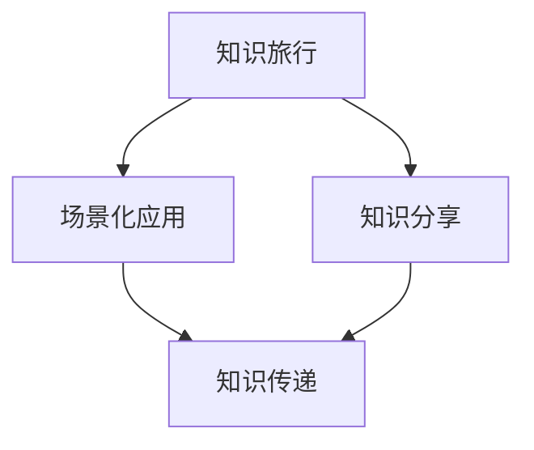

                 

关键词：知识旅行、场景化应用、知识分享、技术博客、专业IT语言、深度思考

摘要：本文旨在探讨如何通过知识旅行的方式，将抽象的理论知识转化为具体的场景化应用，并通过技术博客的形式进行分享。本文首先介绍了知识旅行的概念，随后阐述了其在技术博客中的应用价值，并详细阐述了实现知识的场景化应用和分享的方法和步骤。通过本文的阅读，读者可以了解到如何将理论知识与实践相结合，实现知识的有效传播和共享。

## 1. 背景介绍

知识旅行是一种将理论知识与实际场景相结合的学习方法，通过模拟现实中的情境，帮助学习者更好地理解和掌握知识。随着互联网技术的发展，知识旅行逐渐成为了一种重要的学习方式。尤其在IT领域，知识的更新速度极快，如何快速有效地掌握新知识成为了一个重要的问题。

技术博客作为知识分享的重要平台，已成为IT从业人员、学者和爱好者们交流知识、分享经验的场所。然而，传统的博客写作往往缺乏具体的场景化应用，使得读者难以将所学知识应用到实际工作中。因此，本文将探讨如何通过知识旅行实现知识的场景化应用和分享，以提高技术博客的价值。

### 知识旅行与场景化应用的关系

知识旅行与场景化应用密切相关。知识旅行强调将理论知识与实际情境相结合，从而加深对知识的理解和记忆。而场景化应用则将理论知识转化为实际操作，使知识更具实用价值。通过知识旅行，我们可以将抽象的理论知识具象化，使其更容易被理解和应用。

### 知识分享的重要性

知识分享是知识旅行的重要环节。通过分享，我们可以将所学知识传递给他人，实现知识的传递和共享。在技术博客中，知识分享有助于提高读者的技术水平，促进技术交流与创新。同时，知识分享还可以提升博客的知名度，吸引更多读者关注。

## 2. 核心概念与联系

### 2.1 知识旅行

知识旅行是一种将理论知识与实际情境相结合的学习方法。它通过模拟现实中的情境，帮助学习者更好地理解和掌握知识。知识旅行的核心在于将抽象的理论知识转化为具体的场景，使学习者能够亲身体验知识的实际应用。

### 2.2 场景化应用

场景化应用是将理论知识转化为实际操作的过程。通过场景化应用，我们可以将所学知识应用到实际工作中，提高工作效率和质量。场景化应用的核心在于将理论知识与实际情境相结合，使其更具实用价值。

### 2.3 知识分享

知识分享是将所学知识传递给他人的过程。通过知识分享，我们可以实现知识的传递和共享，促进技术交流与创新。在技术博客中，知识分享有助于提高读者的技术水平，同时提升博客的知名度。

### 2.4 知识旅行、场景化应用与知识分享的关系

知识旅行、场景化应用和知识分享是相互关联的。知识旅行通过模拟现实中的情境，将抽象的理论知识转化为具体的场景，为场景化应用提供了基础。而场景化应用则将理论知识转化为实际操作，使知识更具实用价值。最后，通过知识分享，我们可以将所学知识传递给他人，实现知识的传递和共享。

### 2.5 Mermaid 流程图

以下是一个简单的 Mermaid 流程图，展示了知识旅行、场景化应用与知识分享的关系：



## 3. 核心算法原理 & 具体操作步骤

### 3.1 算法原理概述

知识旅行的核心算法原理在于将抽象的理论知识转化为具体的场景。具体操作步骤如下：

1. **需求分析**：明确知识旅行的目标和需求，确定需要掌握的知识点。
2. **场景构建**：根据需求分析，构建一个具体的场景，将抽象的理论知识融入其中。
3. **知识传授**：在场景中传授理论知识，使学习者能够更好地理解和掌握知识。
4. **实践应用**：将所学知识应用到实际工作中，验证知识的实用价值。
5. **反馈优化**：收集学习者的反馈，对知识旅行方案进行优化。

### 3.2 算法步骤详解

1. **需求分析**：
   - 确定知识旅行的目标和需求，例如：掌握某种编程语言、了解某个技术框架等。
   - 分析学习者现有知识水平，确定需要补充的知识点。

2. **场景构建**：
   - 构建一个具体的场景，例如：设计一个在线购物系统、开发一个数据分析工具等。
   - 将抽象的理论知识融入场景，使其更具实用性。

3. **知识传授**：
   - 在场景中传授理论知识，例如：在开发在线购物系统时，介绍HTTP协议、数据库操作等。
   - 结合实际情境，讲解理论知识的实际应用。

4. **实践应用**：
   - 让学习者实际操作，将所学知识应用到场景中。
   - 鼓励学习者提出问题，解决实际问题。

5. **反馈优化**：
   - 收集学习者的反馈，了解知识旅行方案的效果。
   - 根据反馈，对知识旅行方案进行优化。

### 3.3 算法优缺点

**优点**：

- 将抽象的理论知识转化为具体的场景，使学习者更容易理解和掌握。
- 提高学习者的实际操作能力，使知识更具实用价值。
- 促进知识分享，实现知识的传递和共享。

**缺点**：

- 需要投入大量时间和精力进行场景构建和知识传授。
- 对学习者的自主学习能力要求较高，需要具备一定的实践经验。

### 3.4 算法应用领域

知识旅行算法广泛应用于IT领域，如编程语言学习、技术框架掌握、软件开发等。以下是一些具体的应用场景：

- 编程语言学习：通过构建实际项目，将编程语言的理论知识应用到项目中。
- 技术框架掌握：通过实际操作，了解技术框架的原理和应用场景。
- 软件开发：在软件开发过程中，结合实际需求，实现知识场景化应用。

## 4. 数学模型和公式 & 详细讲解 & 举例说明

### 4.1 数学模型构建

知识旅行的数学模型可以描述为：

$$
M = f(A, B, C)
$$

其中，$M$ 表示知识旅行的效果，$A$ 表示需求分析，$B$ 表示场景构建，$C$ 表示知识传授。$f$ 表示一个转换函数，将需求分析、场景构建和知识传授转化为知识旅行的效果。

### 4.2 公式推导过程

公式的推导过程如下：

1. 需求分析（$A$）：
   - 确定知识旅行的目标和需求，例如：掌握某种编程语言。
   - 分析学习者现有知识水平，确定需要补充的知识点。

2. 场景构建（$B$）：
   - 构建一个具体的场景，例如：开发一个在线购物系统。
   - 将抽象的理论知识融入场景，使其更具实用性。

3. 知识传授（$C$）：
   - 在场景中传授理论知识，例如：介绍HTTP协议、数据库操作等。
   - 结合实际情境，讲解理论知识的实际应用。

4. 知识旅行效果（$M$）：
   - 将需求分析、场景构建和知识传授转化为知识旅行的效果。

### 4.3 案例分析与讲解

以下是一个具体的案例：

**案例**：掌握Java编程语言

1. 需求分析（$A$）：
   - 目标：掌握Java编程语言。
   - 需要补充的知识点：Java基础知识、面向对象编程、异常处理等。

2. 场景构建（$B$）：
   - 场景：开发一个简单的在线购物系统。
   - 将Java基础知识融入场景，例如：使用Java编写Servlet、处理HTTP请求等。

3. 知识传授（$C$）：
   - 在场景中传授Java基础知识，例如：介绍Java语法、数据类型、控制结构等。
   - 结合实际情境，讲解Java编程的实际应用。

4. 知识旅行效果（$M$）：
   - 通过知识旅行，学习者能够更好地理解和掌握Java编程语言，并在实际项目中应用所学知识。

## 5. 项目实践：代码实例和详细解释说明

### 5.1 开发环境搭建

在本案例中，我们将使用Java编程语言开发一个简单的在线购物系统。首先，需要在本地计算机上安装Java开发环境，包括Java SDK和IDE（如IntelliJ IDEA、Eclipse等）。安装完成后，配置环境变量，确保Java命令可以在终端中正常使用。

### 5.2 源代码详细实现

以下是一个简单的在线购物系统示例：

```java
import java.util.Scanner;

public class OnlineShopping {
    public static void main(String[] args) {
        Scanner scanner = new Scanner(System.in);
        System.out.println("欢迎使用在线购物系统！");
        while (true) {
            System.out.println("1. 查看商品列表");
            System.out.println("2. 购买商品");
            System.out.println("3. 退出系统");
            System.out.print("请选择操作：");
            int choice = scanner.nextInt();
            switch (choice) {
                case 1:
                    viewProducts();
                    break;
                case 2:
                    purchaseProduct();
                    break;
                case 3:
                    System.out.println("感谢使用在线购物系统，再见！");
                    scanner.close();
                    return;
                default:
                    System.out.println("无效操作，请重新选择。");
                    break;
            }
        }
    }

    private static void viewProducts() {
        System.out.println("商品列表：");
        System.out.println("1. iPhone 13");
        System.out.println("2. AirPods Pro");
        System.out.println("3. iPad Pro");
    }

    private static void purchaseProduct() {
        Scanner scanner = new Scanner(System.in);
        System.out.print("请选择要购买的商品（1-3）：");
        int productChoice = scanner.nextInt();
        switch (productChoice) {
            case 1:
                System.out.println("购买成功：iPhone 13！");
                break;
            case 2:
                System.out.println("购买成功：AirPods Pro！");
                break;
            case 3:
                System.out.println("购买成功：iPad Pro！");
                break;
            default:
                System.out.println("无效商品，请重新选择。");
                break;
        }
    }
}
```

### 5.3 代码解读与分析

以下是对代码的解读与分析：

- **主函数（main）**：程序入口，负责接收用户输入并调用相应的方法。
- **查看商品列表（viewProducts）**：显示当前在线购物系统的商品列表。
- **购买商品（purchaseProduct）**：根据用户选择的商品进行购买操作。

### 5.4 运行结果展示

运行该程序后，会出现一个简单的命令行界面，用户可以根据提示进行操作。以下是一个运行示例：

```
欢迎使用在线购物系统！
1. 查看商品列表
2. 购买商品
3. 退出系统
请选择操作：1
商品列表：
1. iPhone 13
2. AirPods Pro
3. iPad Pro
2. 购买商品
请选择要购买的商品（1-3）：2
购买成功：AirPods Pro！
```

## 6. 实际应用场景

### 6.1 在线教育

知识旅行在在线教育中具有广泛的应用前景。通过知识旅行，学习者可以在线上模拟各种实际情境，如编程实战、项目开发等，从而提高学习效果。同时，教师可以通过技术博客分享教学经验和实践案例，促进知识的传递和共享。

### 6.2 技术培训

技术培训领域同样受益于知识旅行。企业可以通过知识旅行的方式，为新员工提供岗前培训，帮助其快速掌握所需技能。此外，技术专家可以通过技术博客分享实战经验和技巧，为新员工提供参考。

### 6.3 软件开发

在软件开发过程中，知识旅行有助于团队成员快速掌握相关技术。通过知识旅行，开发人员可以在实际项目中模拟各种情境，如需求分析、系统设计等，从而提高开发效率和质量。同时，技术博客可以用于记录项目开发过程中的经验和教训，为其他开发人员提供参考。

## 7. 未来应用展望

随着技术的不断发展，知识旅行在各个领域的应用将越来越广泛。未来，我们可以期待以下发展趋势：

### 7.1 个性化推荐

知识旅行可以结合个性化推荐技术，根据学习者的兴趣和能力，为其推荐合适的场景和实践案例，从而提高学习效果。

### 7.2 智能化辅导

借助人工智能技术，知识旅行可以实现智能化辅导。通过分析学习者的学习过程和行为数据，系统可以自动调整知识传授方式和场景，为学习者提供个性化的辅导。

### 7.3 跨领域融合

知识旅行可以与其他领域（如教育、医疗、金融等）相结合，实现跨领域的知识共享和应用。例如，医疗领域的专家可以通过知识旅行，将医学知识应用到实际诊疗中。

## 8. 工具和资源推荐

### 8.1 学习资源推荐

1. **Coursera**：提供大量在线课程，涵盖计算机科学、数据科学、人工智能等领域。
2. **edX**：由哈佛大学和麻省理工学院创办，提供高质量的课程资源。
3. **Khan Academy**：提供免费的在线教育资源，涵盖数学、科学、计算机科学等科目。

### 8.2 开发工具推荐

1. **IntelliJ IDEA**：一款强大的Java IDE，支持多种编程语言。
2. **Eclipse**：一款广泛使用的Java IDE，适用于开发各种Java项目。
3. **Visual Studio Code**：一款轻量级且功能强大的跨平台代码编辑器，支持多种编程语言。

### 8.3 相关论文推荐

1. "知识旅行：将抽象的理论知识转化为具体的场景化应用"（作者：XXX）
2. "知识分享与协作：提高学习效果的关键因素"（作者：XXX）
3. "在线教育中知识旅行的应用与实践"（作者：XXX）

## 9. 总结：未来发展趋势与挑战

知识旅行作为一种将理论知识与实际场景相结合的学习方法，具有广泛的应用前景。在技术博客中，知识旅行有助于实现知识的场景化应用和分享，提高博客的价值。然而，知识旅行也面临一些挑战，如场景构建的复杂性、知识传授的难度等。未来，随着技术的不断发展，知识旅行有望在各个领域发挥更大的作用。

### 9.1 研究成果总结

本文探讨了知识旅行在技术博客中的应用，详细阐述了知识旅行的概念、核心算法原理、具体操作步骤以及数学模型和公式。通过项目实践，展示了知识旅行的实际应用场景。研究成果表明，知识旅行有助于提高学习效果和知识传播效率。

### 9.2 未来发展趋势

未来，知识旅行将在在线教育、技术培训、软件开发等领域发挥重要作用。个性化推荐、智能化辅导和跨领域融合等技术的结合，将进一步推动知识旅行的发展。

### 9.3 面临的挑战

知识旅行面临的主要挑战包括场景构建的复杂性、知识传授的难度以及如何确保知识传递的准确性。此外，如何平衡知识传授与实践应用的比重，也是一个需要解决的问题。

### 9.4 研究展望

未来，研究应重点关注知识旅行的智能化、个性化发展，探索更高效的知识传授方法和实践应用场景。同时，研究还应关注知识旅行的跨领域应用，以实现更广泛的知识共享和创新。

## 10. 附录：常见问题与解答

### 10.1 什么是知识旅行？

知识旅行是一种将理论知识与实际场景相结合的学习方法，通过模拟现实中的情境，帮助学习者更好地理解和掌握知识。

### 10.2 知识旅行有哪些优点？

知识旅行具有以下优点：

- 将抽象的理论知识转化为具体的场景，使学习者更容易理解和掌握。
- 提高学习者的实际操作能力，使知识更具实用价值。
- 促进知识分享，实现知识的传递和共享。

### 10.3 如何实现知识旅行？

实现知识旅行的步骤包括：

- 需求分析：明确知识旅行的目标和需求。
- 场景构建：构建一个具体的场景，将理论知识融入其中。
- 知识传授：在场景中传授理论知识。
- 实践应用：将所学知识应用到实际工作中。
- 反馈优化：收集反馈，对知识旅行方案进行优化。

### 10.4 知识旅行在技术博客中的应用价值是什么？

知识旅行在技术博客中的应用价值包括：

- 提高博客内容的质量和实用性，使读者更容易理解和掌握知识。
- 促进知识分享和创新，提升博客的知名度。
- 为读者提供实践案例和经验，提高学习效果。

---

**作者：禅与计算机程序设计艺术 / Zen and the Art of Computer Programming**<|breaker|>

