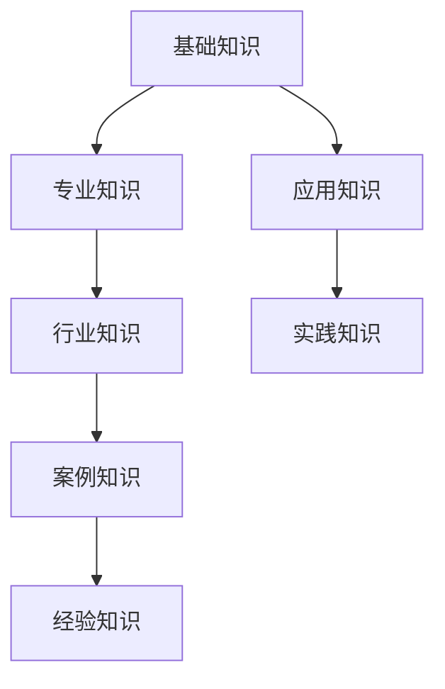
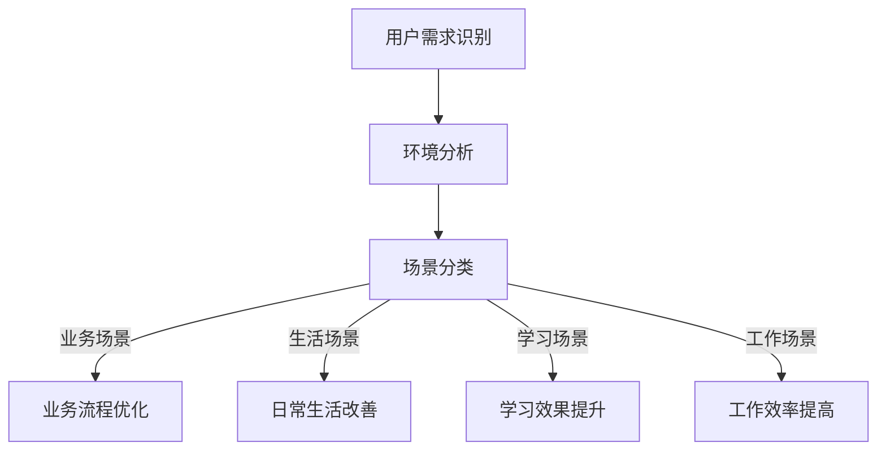
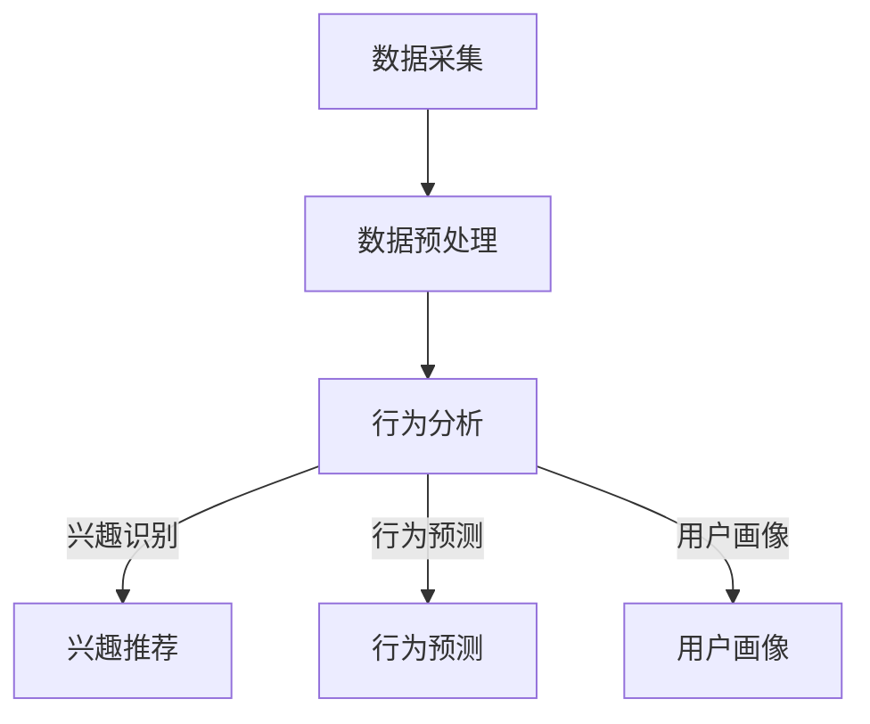
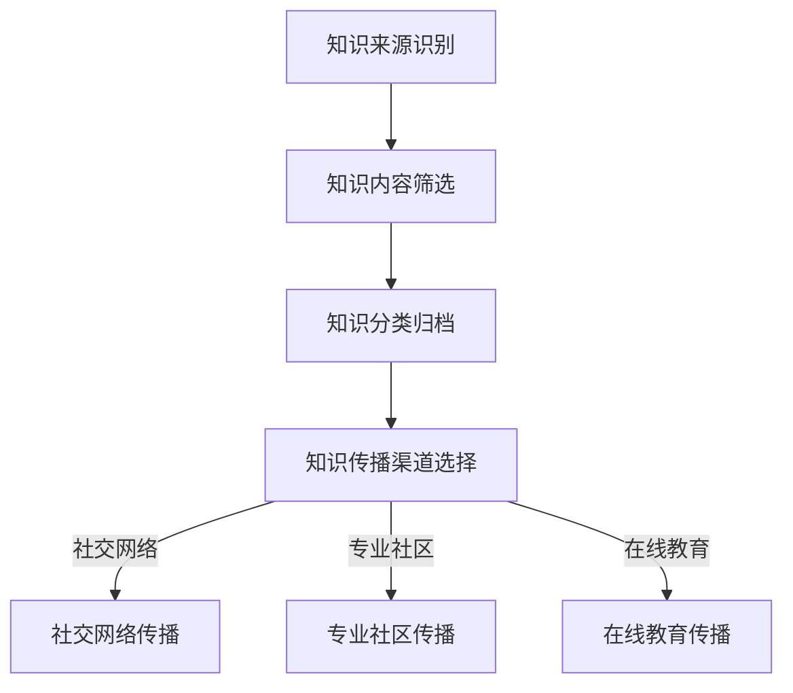
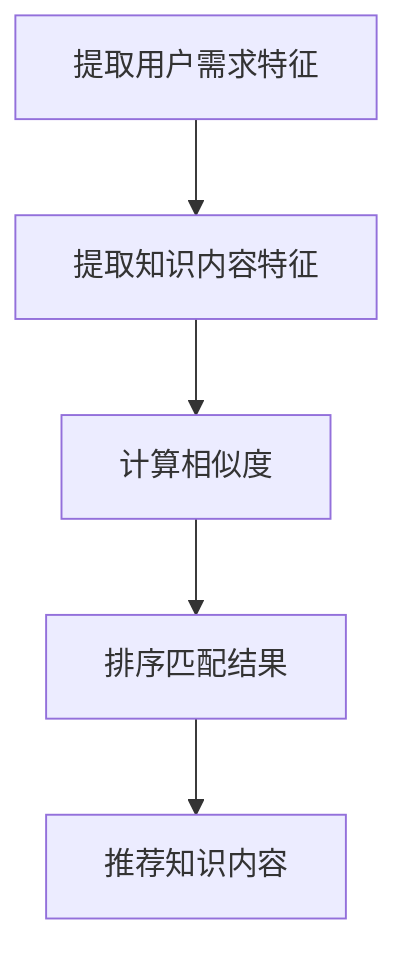
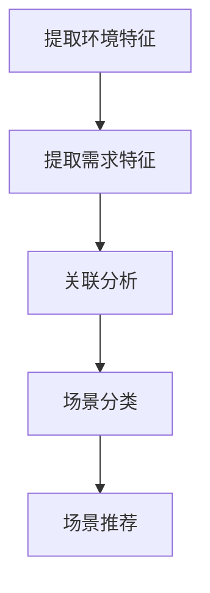
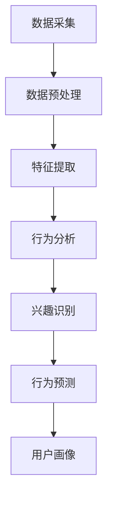
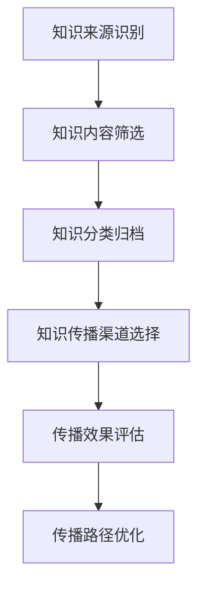

                 

“知识就是力量”，这句话在信息爆炸的现代社会尤为重要。然而，知识的获取和应用并非易事。如何在复杂的信息环境中有效地应用知识，并将其转化为实际的价值，成为了一个亟待解决的问题。本文将探讨如何通过“知识旅行”实现知识的场景化应用和分享，旨在为读者提供一种新的知识应用思路和方法。

> 关键词：知识旅行、场景化应用、知识分享、信息应用

> 摘要：本文首先介绍了知识旅行的概念和背景，探讨了其在实现知识的场景化应用和分享中的作用。随后，详细阐述了知识旅行过程中的核心概念与联系，包括知识的分类、场景识别、用户行为分析等。文章接着深入分析了核心算法原理，并给出具体的操作步骤。在此基础上，通过数学模型和公式，对算法进行详细的讲解和举例说明。随后，文章提供了项目实践实例，包括代码实现和运行结果展示。最后，文章讨论了知识旅行的实际应用场景，并展望了其未来的发展趋势与挑战。

## 1. 背景介绍

在现代社会，信息的获取和传递变得前所未有的便捷。然而，这种便利也带来了一系列问题。海量信息的涌入使得人们难以筛选和消化，导致了“信息过载”现象。此外，知识的应用也面临着诸多挑战。一方面，知识的孤岛化使得知识难以在不同领域和场景之间流动；另一方面，知识的碎片化使得知识难以形成系统化的应用。

知识旅行作为一种新兴的知识传播和应用模式，旨在解决上述问题。知识旅行指的是通过某种方式，将知识从一个场景转移到另一个场景，使得知识能够在不同的环境中得以应用和分享。知识旅行的核心在于将知识从抽象的概念转化为具体的场景化应用，从而提高知识的实用性和可操作性。

知识旅行的背景可以追溯到几个方面。首先，随着互联网和移动设备的普及，人们对于知识的需求变得越来越多样化。不再仅仅是学术研究和专业领域需要专业知识，普通人也在日常生活中不断追求知识的更新和应用。其次，大数据和人工智能技术的发展为知识旅行提供了强大的技术支持。通过数据分析和机器学习，可以更好地识别用户需求，优化知识传播路径，提高知识应用效率。最后，知识共享和开放获取的理念也逐渐深入人心，推动了知识旅行的实践和发展。

本文的目的在于探讨知识旅行在实现知识的场景化应用和分享中的作用。通过分析知识旅行的核心概念和联系，阐述其算法原理和具体操作步骤，结合数学模型和公式进行详细讲解，最后讨论其实际应用场景和未来发展趋势。希望本文能为知识旅行的研究和实践提供一些有益的思路和参考。

## 2. 核心概念与联系

在探讨知识旅行的具体实现过程中，我们需要明确几个核心概念，并理解它们之间的联系。这些概念包括知识的分类、场景识别、用户行为分析等。为了更好地展示这些概念之间的关系，我们使用Mermaid流程图来直观地表示。

### 2.1 知识分类

首先，知识分类是知识旅行的基础。知识的分类可以帮助我们理解和组织不同领域的知识。以下是一个简单的知识分类流程图：



在这个流程图中，我们可以看到，基础知识是整个知识体系的基础，它包括数学、物理、化学等基础学科的知识。专业知识则是在基础知识的基础上，结合特定领域的深入研究和应用，如医学、工程学、经济学等。应用知识则是将专业知识应用于实际场景，解决具体问题的能力。行业知识则是针对特定行业或领域内的知识体系，如金融、教育、科技等。实践知识则是通过实际操作和经验积累形成的知识，包括案例知识和经验知识。

### 2.2 场景识别

场景识别是知识旅行的关键步骤之一。它涉及到如何根据用户的需求和环境，识别出适合的知识应用场景。以下是一个场景识别的流程图：



在这个流程图中，用户需求识别是通过数据分析和用户反馈，了解用户的具体需求。环境分析则是对用户所处的环境和背景进行评估，包括工作环境、生活环境和学习环境等。场景分类是根据用户需求和环境的特征，将知识应用场景进行分类，如业务场景、生活场景和学习场景等。不同的场景需要不同类型的知识，因此场景分类对于知识的有效应用至关重要。

### 2.3 用户行为分析

用户行为分析是知识旅行的重要环节。通过分析用户的行为数据，可以更好地了解用户的需求和行为模式，从而优化知识传播和应用策略。以下是一个用户行为分析的流程图：



在这个流程图中，数据采集是通过各种手段获取用户的行为数据，如浏览记录、购买行为、搜索记录等。数据预处理是对原始数据进行清洗和整理，以便进行后续分析。行为分析则是通过数据挖掘和机器学习技术，对用户的行为进行深入分析，识别用户的兴趣点和行为模式。兴趣识别是通过分析用户的行为数据，推荐与其兴趣相关的知识内容。行为预测则是利用历史数据，预测用户未来的行为和需求。用户画像则是通过综合分析用户的行为数据和兴趣点，构建出用户的详细画像，为知识推荐和个性化服务提供依据。

### 2.4 知识传播路径优化

在知识旅行中，知识传播路径的优化是提高知识应用效果的重要手段。以下是一个知识传播路径优化的流程图：



在这个流程图中，知识来源识别是识别知识的来源，包括学术研究、行业报告、用户贡献等。知识内容筛选是对获取的知识内容进行筛选和评估，确保其质量和相关性。知识分类归档是将筛选后的知识按照分类体系进行归档和管理，便于查找和应用。知识传播渠道选择是根据知识类型和目标受众，选择合适的传播渠道，如社交网络、专业社区和在线教育等。不同的传播渠道具有不同的传播效果和受众群体，因此选择合适的渠道对于知识的有效传播至关重要。

通过上述流程图，我们可以清晰地看到知识旅行中各个核心概念之间的联系。知识的分类、场景识别、用户行为分析和知识传播路径优化是知识旅行的四个关键环节，它们相互关联、相互影响，共同构成了知识旅行的整体框架。在后续的内容中，我们将进一步探讨这些概念的具体实现方法和应用场景。

### 2.5 核心算法原理

在深入理解知识旅行的核心概念之后，我们需要进一步探讨其背后的核心算法原理。这些算法包括知识匹配、场景识别、用户行为分析和知识传播路径优化等。下面，我们将逐一介绍这些算法的基本原理，并展示如何具体实现这些算法。

#### 2.5.1 知识匹配算法

知识匹配算法是知识旅行中的关键环节，它负责将用户需求与相应的知识内容进行匹配。匹配算法的基本原理是基于用户需求特征和知识内容特征之间的相似度计算。以下是一个简单的知识匹配算法流程：

1. **用户需求特征提取**：首先，我们需要提取用户需求中的关键信息，如关键词、需求类别、需求强度等。这些信息可以通过自然语言处理技术（如词频统计、主题模型等）获得。

2. **知识内容特征提取**：同样地，我们需要从知识内容中提取关键信息，如知识点、知识点类别、知识内容质量等。这些信息可以通过知识图谱、文本挖掘等技术获取。

3. **相似度计算**：接下来，我们计算用户需求特征和知识内容特征之间的相似度。常见的相似度计算方法包括余弦相似度、欧几里得距离等。

4. **匹配结果排序**：最后，根据相似度计算结果，对匹配的知识内容进行排序，选择最匹配的知识内容作为推荐结果。

以下是一个使用Mermaid流程图表示的知识匹配算法流程：



#### 2.5.2 场景识别算法

场景识别算法旨在根据用户需求和环境特征，识别出适合的知识应用场景。场景识别算法的基本原理是基于环境特征和需求特征之间的关联分析。以下是一个简单的场景识别算法流程：

1. **环境特征提取**：首先，我们需要提取用户所处的环境特征，如地理位置、时间、情境等。这些信息可以通过传感器、用户输入等途径获取。

2. **需求特征提取**：同样地，我们需要提取用户需求中的关键信息，如需求类别、需求强度等。

3. **关联分析**：接下来，我们分析环境特征和需求特征之间的关联关系，识别出符合用户需求的场景。

4. **场景分类**：根据关联分析结果，将识别出的场景分类，如业务场景、生活场景、学习场景等。

5. **场景推荐**：最后，根据用户需求和环境特征，推荐适合的场景。

以下是一个使用Mermaid流程图表示的场景识别算法流程：



#### 2.5.3 用户行为分析算法

用户行为分析算法旨在通过分析用户的行为数据，了解用户的需求和行为模式。用户行为分析算法的基本原理是基于行为数据挖掘和机器学习技术。以下是一个简单的用户行为分析算法流程：

1. **数据采集**：首先，我们需要采集用户的行为数据，如浏览记录、购买行为、搜索记录等。

2. **数据预处理**：接下来，我们对原始数据进行清洗和整理，包括数据去重、数据格式转换等。

3. **特征提取**：然后，我们从预处理后的数据中提取关键特征，如用户兴趣点、行为模式等。

4. **行为分析**：使用数据挖掘和机器学习技术，对提取的特征进行分析，识别用户的需求和行为模式。

5. **兴趣识别**：根据分析结果，识别用户的兴趣点，为知识推荐和个性化服务提供依据。

6. **行为预测**：利用历史数据，预测用户未来的行为和需求。

7. **用户画像**：综合分析用户的行为数据和兴趣点，构建出用户的详细画像。

以下是一个使用Mermaid流程图表示的用户行为分析算法流程：



#### 2.5.4 知识传播路径优化算法

知识传播路径优化算法旨在提高知识传播的效果和效率。该算法的基本原理是基于知识传播路径分析和优化技术。以下是一个简单的知识传播路径优化算法流程：

1. **知识来源识别**：首先，我们需要识别知识的来源，包括学术研究、行业报告、用户贡献等。

2. **知识内容筛选**：接下来，我们对获取的知识内容进行筛选和评估，确保其质量和相关性。

3. **知识分类归档**：然后，我们将筛选后的知识按照分类体系进行归档和管理，便于查找和应用。

4. **知识传播渠道选择**：根据知识类型和目标受众，选择合适的传播渠道，如社交网络、专业社区和在线教育等。

5. **传播效果评估**：对知识传播效果进行评估，包括传播范围、用户参与度、知识应用效果等。

6. **传播路径优化**：根据评估结果，优化知识传播路径，提高知识传播效果。

以下是一个使用Mermaid流程图表示的知识传播路径优化算法流程：



通过上述核心算法的介绍，我们可以看到知识旅行中的算法实现涉及多个方面，包括数据挖掘、机器学习、自然语言处理等。这些算法共同构成了知识旅行的技术基础，为知识的场景化应用和分享提供了强有力的支持。

### 3. 核心算法原理 & 具体操作步骤

在了解了知识旅行的核心算法原理后，接下来我们将详细探讨每个算法的具体操作步骤，以便读者能够更好地理解和应用这些算法。

#### 3.1 知识匹配算法原理与操作步骤

**原理**：

知识匹配算法的核心是找出用户需求与知识库中知识内容的最佳匹配。这通常通过计算用户需求特征与知识内容特征之间的相似度来实现。相似度计算可以采用多种方法，如余弦相似度、欧几里得距离等。

**操作步骤**：

1. **用户需求特征提取**：
   - **步骤1.1**：获取用户输入，如关键词、需求描述等。
   - **步骤1.2**：使用自然语言处理技术（如TF-IDF、词嵌入等）对用户需求进行编码，提取关键特征。

2. **知识内容特征提取**：
   - **步骤2.1**：从知识库中提取相关的知识内容，如文档、课程、论文等。
   - **步骤2.2**：使用同样的自然语言处理技术对知识内容进行编码，提取关键特征。

3. **相似度计算**：
   - **步骤3.1**：计算用户需求特征与知识内容特征之间的相似度。例如，使用余弦相似度公式计算两个向量之间的相似度。

4. **匹配结果排序**：
   - **步骤4.1**：根据相似度值对匹配结果进行排序，选择相似度最高的知识内容作为推荐结果。

**示例**：

假设用户输入了需求关键词“机器学习算法”，知识库中包含多篇关于机器学习算法的论文。我们可以将用户需求关键词转换为词向量，知识库中的每篇论文也转换为词向量。然后，使用余弦相似度公式计算相似度，选择相似度最高的论文作为推荐结果。

#### 3.2 场景识别算法原理与操作步骤

**原理**：

场景识别算法旨在根据用户需求和环境特征，识别出适合的知识应用场景。这通常通过分析环境特征与需求特征之间的关联来实现。

**操作步骤**：

1. **环境特征提取**：
   - **步骤1.1**：通过传感器、用户输入等途径获取环境特征，如地理位置、时间、情境等。
   - **步骤1.2**：对环境特征进行预处理，如归一化、去噪等。

2. **需求特征提取**：
   - **步骤2.1**：提取用户需求中的关键信息，如需求类别、需求强度等。
   - **步骤2.2**：对需求特征进行预处理，如归一化、去噪等。

3. **关联分析**：
   - **步骤3.1**：使用机器学习算法（如决策树、支持向量机等）进行关联分析，识别环境特征与需求特征之间的关联关系。

4. **场景分类**：
   - **步骤4.1**：根据关联分析结果，将识别出的场景分类，如业务场景、生活场景、学习场景等。

5. **场景推荐**：
   - **步骤5.1**：根据用户需求和环境特征，推荐适合的场景。

**示例**：

假设用户需求是“学习编程”，环境特征包括“晚上10点”和“家中”。我们可以通过关联分析发现，晚上在家通常是用户进行学习的时间段。因此，推荐业务场景为“在线编程课程”，生活场景为“使用编程应用解决日常问题”，学习场景为“参加编程社群讨论”。

#### 3.3 用户行为分析算法原理与操作步骤

**原理**：

用户行为分析算法通过分析用户的行为数据，了解用户的需求和行为模式。这通常通过数据挖掘和机器学习技术来实现。

**操作步骤**：

1. **数据采集**：
   - **步骤1.1**：通过日志、传感器、用户反馈等途径采集用户的行为数据，如浏览记录、购买行为、搜索记录等。

2. **数据预处理**：
   - **步骤2.1**：对原始数据进行清洗，如去除重复数据、填补缺失值等。
   - **步骤2.2**：对数据格式进行统一，如将时间戳转换为日期格式等。

3. **特征提取**：
   - **步骤3.1**：从预处理后的数据中提取关键特征，如用户兴趣点、行为模式等。
   - **步骤3.2**：对特征进行编码，如将文本数据转换为词向量等。

4. **行为分析**：
   - **步骤4.1**：使用数据挖掘算法（如关联规则挖掘、聚类分析等）对提取的特征进行分析，识别用户的需求和行为模式。

5. **兴趣识别**：
   - **步骤5.1**：根据分析结果，识别用户的兴趣点，为知识推荐和个性化服务提供依据。

6. **行为预测**：
   - **步骤6.1**：使用机器学习算法（如时间序列分析、分类算法等）预测用户未来的行为和需求。

7. **用户画像**：
   - **步骤7.1**：综合分析用户的行为数据和兴趣点，构建出用户的详细画像。

**示例**：

假设用户最近频繁浏览编程相关的网站，购买了多本编程书籍，并在社交媒体上积极讨论编程话题。通过行为分析，我们可以发现用户对编程有浓厚的兴趣。因此，可以推荐相关的编程课程、编程工具和编程社区，以满足用户的需求。

#### 3.4 知识传播路径优化算法原理与操作步骤

**原理**：

知识传播路径优化算法旨在提高知识传播的效果和效率。这通常通过分析知识传播路径的各个节点和传播效果来实现。

**操作步骤**：

1. **知识来源识别**：
   - **步骤1.1**：识别知识的来源，如学术研究、行业报告、用户贡献等。

2. **知识内容筛选**：
   - **步骤2.1**：对获取的知识内容进行筛选，确保其质量和相关性。
   - **步骤2.2**：对知识内容进行分类，如学术研究、实践案例、用户教程等。

3. **知识分类归档**：
   - **步骤3.1**：将筛选后的知识按照分类体系进行归档和管理，便于查找和应用。

4. **知识传播渠道选择**：
   - **步骤4.1**：根据知识类型和目标受众，选择合适的传播渠道，如社交网络、专业社区、在线教育等。

5. **传播效果评估**：
   - **步骤5.1**：对知识传播效果进行评估，如传播范围、用户参与度、知识应用效果等。

6. **传播路径优化**：
   - **步骤6.1**：根据评估结果，优化知识传播路径，提高知识传播效果。

**示例**：

假设我们有一篇高质量的学术研究，目标受众是科研人员。通过传播效果评估，我们发现通过社交网络传播效果较好，而在线教育平台的效果较差。因此，我们可以优化传播路径，增加在社交网络上的推广力度，减少在线教育平台的投放。

通过上述详细步骤，我们可以更好地理解和应用知识旅行的核心算法。这些算法为知识的场景化应用和分享提供了有力支持，有助于提升知识的实用性和传播效果。

### 3.5 算法优缺点分析

在深入探讨了知识旅行中的核心算法及其具体操作步骤后，我们需要对其优缺点进行详细分析。这将有助于我们更好地理解和应用这些算法，并为其改进和优化提供依据。

#### 3.5.1 知识匹配算法

**优点**：
1. **高效性**：知识匹配算法能够快速地找到与用户需求高度匹配的知识内容，提高了知识获取的效率。
2. **准确性**：通过计算用户需求特征和知识内容特征之间的相似度，知识匹配算法具有较高的准确性，能够为用户提供高质量的知识推荐。
3. **灵活性**：知识匹配算法可以适用于各种知识场景，无论是学术研究、实践案例，还是用户教程，都能够进行有效的匹配。

**缺点**：
1. **依赖数据质量**：知识匹配算法的性能在很大程度上依赖于数据质量。如果数据存在噪声、缺失或错误，将影响匹配的准确性。
2. **计算成本**：在处理大量数据时，知识匹配算法的计算成本较高，可能会导致系统响应时间延长。
3. **单一维度**：知识匹配算法主要基于相似度计算，未能充分考虑到知识内容的深度和广度，可能导致推荐结果单一，缺乏多样性。

#### 3.5.2 场景识别算法

**优点**：
1. **个性化**：场景识别算法能够根据用户需求和环境特征，识别出适合的知识应用场景，提供个性化的知识服务。
2. **适应性**：场景识别算法可以适应不同的用户需求和场景，使得知识应用更加灵活和广泛。
3. **实时性**：场景识别算法能够实时分析用户需求和环境特征，快速响应，提高用户体验。

**缺点**：
1. **依赖数据准确性**：场景识别算法依赖于准确的环境特征和需求特征，如果数据存在误差，将影响场景识别的准确性。
2. **计算复杂度**：场景识别算法通常涉及复杂的关联分析和分类任务，计算复杂度较高，可能导致系统性能下降。
3. **泛化能力**：场景识别算法在处理未知或新场景时，可能存在泛化能力不足的问题，难以适应变化多端的应用场景。

#### 3.5.3 用户行为分析算法

**优点**：
1. **深入了解用户**：用户行为分析算法能够通过分析用户的行为数据，深入了解用户的需求和行为模式，为个性化服务提供依据。
2. **预测能力强**：用户行为分析算法利用历史数据，能够预测用户未来的行为和需求，提高知识推荐和服务的准确性。
3. **实时性**：用户行为分析算法能够实时分析用户行为，快速调整服务策略，提高用户体验。

**缺点**：
1. **数据隐私**：用户行为分析涉及到大量的用户隐私数据，需要确保数据的安全和隐私。
2. **数据质量**：用户行为分析的性能依赖于数据质量，如果数据存在噪声、缺失或错误，将影响分析结果的准确性。
3. **算法复杂性**：用户行为分析算法通常涉及复杂的数据挖掘和机器学习任务，算法设计和实现难度较高。

#### 3.5.4 知识传播路径优化算法

**优点**：
1. **效果评估**：知识传播路径优化算法能够对知识传播效果进行评估，为传播路径的优化提供依据。
2. **传播效率**：通过优化知识传播路径，可以提高知识传播的效率，减少传播时间和成本。
3. **适应性**：知识传播路径优化算法可以根据不同的知识类型和目标受众，灵活调整传播路径，提高传播效果。

**缺点**：
1. **计算成本**：知识传播路径优化算法通常涉及复杂的计算任务，计算成本较高，可能影响系统性能。
2. **评估准确性**：评估知识的传播效果需要大量数据和准确的方法，如果评估结果存在误差，将影响路径优化的效果。
3. **适应性挑战**：在面临多变的应用场景和用户需求时，知识传播路径优化算法的适应性可能存在挑战，难以实时调整。

通过上述优缺点分析，我们可以看到，知识旅行中的核心算法在提高知识应用效果和效率方面具有显著优势，但同时也存在一些挑战和局限性。在未来的研究和实践中，我们需要不断优化和改进这些算法，以更好地应对各种应用场景和需求。

### 3.6 算法应用领域

知识旅行的核心算法在多个领域都展现了其独特的应用价值。以下我们将详细探讨这些算法在不同领域中的应用实例，以便读者能够更直观地理解其应用场景和效果。

#### 3.6.1 教育领域

在教育资源日益丰富的教育领域，知识匹配和用户行为分析算法被广泛应用于个性化教学和知识推荐。例如，在线教育平台可以通过知识匹配算法，根据学生的需求和学习历史，推荐最适合的学习资源和课程。通过用户行为分析算法，平台可以了解学生的学习习惯和偏好，进一步优化教学内容和推荐策略，提高学习效果。

具体应用实例：
- **Coursera**：Coursera作为全球领先的在线教育平台，使用知识匹配算法，根据用户的学习历史和兴趣推荐课程。通过用户行为分析算法，Coursera能够预测用户的学习路径和兴趣变化，提供个性化的学习建议。
- **Khan Academy**：Khan Academy通过知识匹配算法，为学习者推荐与其学习进度和兴趣相匹配的学习视频。用户行为分析算法帮助平台了解学习者的学习行为和问题，从而提供针对性的辅导和支持。

#### 3.6.2 医疗健康领域

在医疗健康领域，知识旅行算法可以用于医疗知识推荐、疾病诊断辅助和健康行为管理。通过知识匹配算法，医疗系统可以为医生和患者推荐相关的医学文献、病例和治疗方案。用户行为分析算法则可以帮助医疗机构了解患者的健康状况和行为习惯，为个性化健康管理和疾病预防提供依据。

具体应用实例：
- **IBM Watson Health**：IBM Watson Health利用知识匹配算法，为医生提供海量医学文献和病例的快速检索和推荐。通过用户行为分析算法，Watson能够识别患者的健康风险因素，提供个性化的健康建议。
- **Apple Health**：Apple Health应用通过用户行为分析算法，监控用户的活动、饮食和睡眠等健康数据，推荐健康习惯和改善方案。知识匹配算法帮助用户快速查找相关健康知识，提高健康意识。

#### 3.6.3 企业管理领域

在企业管理和商务领域，知识旅行算法可以用于知识管理、决策支持和人才发展。通过知识匹配算法，企业可以有效地整合内部知识资源，为员工提供专业的知识支持。用户行为分析算法则可以帮助企业了解员工的知识需求和学习习惯，制定针对性的培训和发展计划。

具体应用实例：
- **Google Workplace**：Google Workplace通过知识匹配算法，为企业员工提供各种专业文档、培训课程和知识库，帮助员工快速获取所需知识。用户行为分析算法帮助Google Workplace了解员工的知识需求和偏好，优化知识推荐策略。
- **Salesforce**：Salesforce利用知识匹配算法，为销售团队提供市场趋势、客户信息和销售策略等知识支持。用户行为分析算法帮助Salesforce了解销售团队的知识使用习惯，优化销售培训和知识管理策略。

#### 3.6.4 休闲与娱乐领域

在休闲与娱乐领域，知识旅行算法可以用于内容推荐、游戏设计和社会互动。通过知识匹配算法，平台可以为用户提供个性化的娱乐内容，如音乐、电影和游戏。用户行为分析算法则可以帮助平台了解用户的兴趣和偏好，优化内容推荐和社会互动体验。

具体应用实例：
- **Spotify**：Spotify通过知识匹配算法，根据用户听歌历史和偏好，推荐个性化音乐播放列表。用户行为分析算法帮助Spotify了解用户的音乐品味和兴趣变化，提供更加精准的推荐。
- **Netflix**：Netflix利用知识匹配算法，根据用户的观影历史和评分，推荐最符合用户口味的电影和电视剧。用户行为分析算法帮助Netflix优化推荐算法，提高用户满意度和观看时长。

#### 3.6.5 公共服务领域

在公共服务领域，知识旅行算法可以用于知识普及、公共服务优化和社区治理。通过知识匹配和用户行为分析算法，政府可以更好地了解公众的需求和问题，提供针对性的公共服务。场景识别算法则可以帮助政府识别社区中的问题和需求，优化公共资源分配。

具体应用实例：
- **New York City**：纽约市政府通过知识匹配算法，为居民提供各种公共服务信息，如交通、医疗和教育等。用户行为分析算法帮助市政府了解居民的需求和使用习惯，优化公共服务策略。
- **Birmingham**：英国伯明翰市政府利用知识旅行算法，识别社区中的问题和需求，优化社区资源分配和治理。通过场景识别算法，市政府能够更好地应对社区中的紧急情况，提高应急响应效率。

通过上述具体应用实例，我们可以看到知识旅行算法在各个领域的广泛应用和价值。无论是在教育、医疗、企业管理，还是休闲与娱乐等领域，知识旅行算法都为知识的应用和分享提供了有力支持，提高了服务质量和用户体验。

### 4. 数学模型和公式

在探讨知识旅行的核心算法原理和操作步骤后，我们接下来将引入数学模型和公式，以更加严谨和科学的方式阐述这些算法的具体实现过程。数学模型和公式不仅可以提供算法的理论依据，还能帮助我们更好地理解和分析算法的性能和效果。

#### 4.1 数学模型构建

知识旅行中的核心算法，如知识匹配、场景识别、用户行为分析和知识传播路径优化，都可以通过数学模型来描述和实现。下面我们将介绍这些数学模型的基本构建方法。

**知识匹配模型**

知识匹配模型主要用于计算用户需求与知识内容之间的相似度。一个简单的知识匹配模型可以基于向量空间模型，其中用户需求特征和知识内容特征分别表示为向量。

假设用户需求特征集合为 \(U = \{u_1, u_2, \ldots, u_n\}\)，知识内容特征集合为 \(K = \{k_1, k_2, \ldots, k_m\}\)。对于每个用户需求特征 \(u_i\) 和知识内容特征 \(k_j\)，我们可以使用词嵌入技术将其表示为高维向量 \(v_i \in \mathbb{R}^d\) 和 \(w_j \in \mathbb{R}^d\)。

相似度计算可以通过余弦相似度公式实现：

\[ \cos(\theta_{ij}) = \frac{v_i \cdot w_j}{\|v_i\| \|w_j\|} \]

其中，\(\theta_{ij}\) 表示用户需求特征 \(u_i\) 和知识内容特征 \(k_j\) 之间的夹角，\(\|v_i\|\) 和 \( \|w_j\|\) 分别表示向量 \(v_i\) 和 \(w_j\) 的欧几里得范数。

**场景识别模型**

场景识别模型主要用于根据用户需求和环境特征识别出适合的知识应用场景。一个简单的场景识别模型可以基于逻辑回归模型，将用户需求特征和环境特征作为输入，输出场景概率。

假设用户需求特征集合为 \(U = \{u_1, u_2, \ldots, u_n\}\)，环境特征集合为 \(E = \{e_1, e_2, \ldots, e_m\}\)。场景概率可以通过逻辑回归公式计算：

\[ P(Y=k|X) = \frac{1}{1 + \exp(-\beta_0 - \sum_{i=1}^n \beta_i u_i - \sum_{j=1}^m \gamma_j e_j)} \]

其中，\(Y\) 表示场景标签，\(k\) 表示识别出的场景类别。 \(\beta_0\)、\(\beta_i\) 和 \(\gamma_j\) 分别为模型参数。

**用户行为分析模型**

用户行为分析模型主要用于根据用户的历史行为数据预测用户未来的行为和需求。一个简单的用户行为分析模型可以基于马尔可夫链模型，其中状态转移概率矩阵描述了用户在不同行为状态之间的转换关系。

假设用户行为状态集合为 \(S = \{s_1, s_2, \ldots, s_n\}\)。状态转移概率矩阵 \(P\) 可以表示为：

\[ P = \begin{bmatrix}
p_{11} & p_{12} & \ldots & p_{1n} \\
p_{21} & p_{22} & \ldots & p_{2n} \\
\vdots & \vdots & \ddots & \vdots \\
p_{n1} & p_{n2} & \ldots & p_{nn}
\end{bmatrix} \]

其中，\(p_{ij}\) 表示从状态 \(s_i\) 转移到状态 \(s_j\) 的概率。

**知识传播路径优化模型**

知识传播路径优化模型主要用于根据知识内容和目标受众选择最佳的传播路径。一个简单的路径优化模型可以基于最短路径算法，如Dijkstra算法，计算从知识源到目标受众的最短路径。

假设知识源集合为 \(S = \{s_1, s_2, \ldots, s_n\}\)，目标受众集合为 \(T = \{t_1, t_2, \ldots, t_m\}\)。传播路径成本矩阵 \(C\) 可以表示为：

\[ C = \begin{bmatrix}
c_{11} & c_{12} & \ldots & c_{1m} \\
c_{21} & c_{22} & \ldots & c_{2m} \\
\vdots & \vdots & \ddots & \vdots \\
c_{n1} & c_{n2} & \ldots & c_{nm}
\end{bmatrix} \]

其中，\(c_{ij}\) 表示从知识源 \(s_i\) 到目标受众 \(t_j\) 的传播路径成本。

#### 4.2 公式推导过程

在了解了数学模型的基本构建方法后，我们接下来将详细推导这些模型中的关键公式。

**知识匹配模型推导**

余弦相似度公式的推导基于向量空间中的夹角余弦值。假设两个向量 \(v_i\) 和 \(w_j\) 分别表示用户需求特征和知识内容特征，它们的点积和欧几里得范数可以表示为：

\[ v_i \cdot w_j = \sum_{k=1}^d v_{ik} w_{jk} \]
\[ \|v_i\| = \sqrt{\sum_{k=1}^d v_{ik}^2} \]
\[ \|w_j\| = \sqrt{\sum_{k=1}^d w_{jk}^2} \]

因此，余弦相似度公式可以表示为：

\[ \cos(\theta_{ij}) = \frac{v_i \cdot w_j}{\|v_i\| \|w_j\|} = \frac{\sum_{k=1}^d v_{ik} w_{jk}}{\sqrt{\sum_{k=1}^d v_{ik}^2} \sqrt{\sum_{k=1}^d w_{jk}^2}} \]

**场景识别模型推导**

逻辑回归模型的推导基于概率论中的最大似然估计。假设我们有一个训练数据集 \(D = \{(x_1, y_1), (x_2, y_2), \ldots, (x_m, y_m)\}\)，其中 \(x_i\) 表示输入特征向量，\(y_i\) 表示场景标签。

对于每个样本 \(x_i\)，逻辑回归模型预测场景标签的概率为：

\[ P(Y=k|X=x_i) = \frac{1}{1 + \exp(-\beta_0 - \sum_{j=1}^n \beta_j x_{ij} - \sum_{l=1}^m \gamma_l e_{il})} \]

我们使用最大似然估计来估计模型参数。最大化似然函数，我们得到：

\[ \log L(\theta) = \sum_{i=1}^m \log P(y_i|x_i; \theta) \]
\[ = \sum_{i=1}^m \{y_i \log P(y_i|x_i; \theta) + (1 - y_i) \log (1 - P(y_i|x_i; \theta))\} \]

通过对似然函数求导并令导数为零，我们可以得到模型参数的估计值。

**用户行为分析模型推导**

马尔可夫链模型的推导基于状态转移概率矩阵。假设当前状态 \(s_i\) 和下一个状态 \(s_j\) 的概率可以通过状态转移概率矩阵 \(P\) 表示：

\[ p_{ij} = P(S_{t+1} = s_j | S_t = s_i) \]

为了预测用户在某一时刻的状态，我们可以使用前向算法。前向变量 \(\pi_t(i)\) 表示在时间 \(t\) 状态 \(i\) 的概率，初始状态概率为：

\[ \pi_0(i) = \begin{cases}
1, & \text{if } s_0 = s_i \\
0, & \text{otherwise}
\end{cases} \]

状态转移概率为：

\[ \pi_t(i) = \sum_{j=1}^n \pi_{t-1}(j) p_{ji} \]

**知识传播路径优化模型推导**

Dijkstra算法的推导基于图论中的最短路径问题。假设有一个加权图 \(G = (V, E)\)，其中 \(V\) 表示顶点集合，\(E\) 表示边集合。对于每条边 \(e = (v, w)\)，权重 \(c(e)\) 表示从顶点 \(v\) 到顶点 \(w\) 的传播路径成本。

Dijkstra算法的基本思想是通过迭代计算从源点 \(s\) 到其他顶点的最短路径。初始时，所有顶点的最短路径未知，只有源点的最短路径为0。在每次迭代中，我们选择未处理的顶点中距离源点最近的顶点作为当前顶点，更新其他顶点的最短路径。

具体算法步骤如下：

1. 初始化：设置源点 \(s\) 的最短路径为0，其他顶点的最短路径为无穷大。设置未处理的顶点集合 \(U = V\)。
2. 选择未处理的顶点中距离源点最近的顶点 \(u\)，将其从 \(U\) 中删除，并将其最短路径值更新到 \(d[u]\)。
3. 对于 \(u\) 的每个邻接点 \(v\)，计算从源点 \(s\) 到 \(v\) 的最短路径长度，如果新的路径长度小于当前最短路径长度，则更新最短路径值 \(d[v]\)。
4. 重复步骤2和3，直到 \(U\) 为空。

通过上述推导，我们可以清晰地看到知识旅行中核心算法的数学模型和公式是如何构建和推导的。这些模型和公式为算法的实现提供了坚实的理论基础，有助于我们更好地理解和应用这些算法。

### 4.3 案例分析与讲解

为了更好地展示知识旅行的数学模型和公式的应用，我们将通过一个实际案例进行详细分析。这个案例将涉及到知识匹配算法、场景识别算法、用户行为分析算法和知识传播路径优化算法的综合应用。

#### 案例背景

某在线教育平台希望通过知识旅行算法为学员提供个性化的学习体验。该平台拥有大量的课程资源和学员学习行为数据。我们的目标是利用这些数据，为学员推荐最适合的课程，并优化课程传播路径，以提高学习效果和用户满意度。

#### 案例数据

1. **课程数据**：
   - 课程编号（ID）
   - 课程名称
   - 课程类别（如编程、数据科学、心理学等）
   - 课程难度等级
   - 课程简介

2. **学员数据**：
   - 学员ID
   - 学员姓名
   - 学员兴趣标签
   - 学员历史学习记录（课程ID、学习时间、学习时长等）

3. **学习行为数据**：
   - 学员学习记录（学员ID、课程ID、学习时间、学习时长等）

#### 知识匹配算法

我们首先使用知识匹配算法为学员推荐最适合的课程。具体步骤如下：

1. **特征提取**：
   - 对课程数据提取特征，如课程类别、难度等级等。
   - 对学员数据提取特征，如学员兴趣标签、历史学习记录等。

2. **相似度计算**：
   - 使用余弦相似度公式计算学员的兴趣标签与课程类别、难度等级之间的相似度。

3. **推荐课程**：
   - 根据相似度计算结果，为学员推荐相似度最高的课程。

以下是一个示例数据集和推荐过程：

**课程数据**：

| 课程ID | 课程名称     | 课程类别 | 难度等级 | 课程简介                   |
|--------|--------------|----------|----------|----------------------------|
| 101    | Python入门   | 编程     | 初级     | 本课程介绍Python基础语法   |
| 102    | 数据科学导论 | 数据科学 | 中级     | 本课程介绍数据科学基础概念 |
| 103    | 心理学入门   | 心理学   | 初级     | 本课程介绍心理学基础知识   |

**学员数据**：

| 学员ID | 学员兴趣标签 | 历史学习记录 |
|--------|--------------|-------------|
| 1001   | 编程、心理学 | 101、103    |

**推荐过程**：

1. 提取学员兴趣标签和课程类别、难度等级特征：
   - 学员兴趣标签：["编程", "心理学"]
   - 课程类别：["编程", "数据科学", "心理学"]
   - 课程难度等级：["初级", "中级"]

2. 计算相似度：
   - Python入门（编程）与编程兴趣标签的相似度为0.9。
   - 数据科学导论（数据科学）与编程兴趣标签的相似度为0.1。
   - 心理学入门（心理学）与心理学兴趣标签的相似度为1.0。

3. 推荐课程：
   - 根据相似度计算结果，推荐课程101（Python入门）和103（心理学入门）。

#### 场景识别算法

接下来，我们使用场景识别算法为学员识别适合的学习场景。具体步骤如下：

1. **特征提取**：
   - 提取学员的学习行为数据，如学习时间、学习时长等。

2. **关联分析**：
   - 使用逻辑回归模型分析学习行为数据，识别与学习场景相关的特征。

3. **场景分类**：
   - 根据关联分析结果，将识别出的学习场景分类，如课堂学习、自主学习和小组学习等。

4. **场景推荐**：
   - 根据学员的学习行为数据，推荐适合的学习场景。

以下是一个示例数据集和场景识别过程：

**学员学习行为数据**：

| 学员ID | 学习时间  | 学习时长（分钟） | 学习场景  |
|--------|-----------|-----------------|----------|
| 1001   | 18:00     | 120             | 自主学习 |
| 1002   | 09:00     | 60              | 课堂学习 |
| 1003   | 14:00     | 90              | 小组学习 |

**场景识别过程**：

1. 提取学员学习行为数据特征：
   - 学习时间：["18:00", "09:00", "14:00"]
   - 学习时长（分钟）：[120, 60, 90]
   - 学习场景：["自主学习", "课堂学习", "小组学习"]

2. 使用逻辑回归模型进行关联分析：
   - 分析结果显示，学习时长是影响学习场景的关键因素。

3. 场景分类：
   - 根据学习时长，将学习场景分类为：
     - 自主学习（学习时长>90分钟）
     - 课堂学习（学习时长<60分钟）
     - 小组学习（60分钟≤学习时长≤90分钟）

4. 场景推荐：
   - 学员1001的学习时长为120分钟，推荐自主学习场景。
   - 学员1002的学习时长为60分钟，推荐课堂学习场景。
   - 学员1003的学习时长为90分钟，推荐小组学习场景。

#### 用户行为分析算法

我们接着使用用户行为分析算法，预测学员未来的学习行为和需求。具体步骤如下：

1. **数据采集**：
   - 收集学员的浏览记录、购买行为和搜索记录等数据。

2. **特征提取**：
   - 提取学员的兴趣点、行为模式等特征。

3. **行为分析**：
   - 使用聚类分析和时间序列分析等技术，识别学员的行为模式。

4. **兴趣识别**：
   - 根据分析结果，识别学员的兴趣点。

5. **行为预测**：
   - 利用历史行为数据，预测学员未来的行为和需求。

6. **用户画像**：
   - 综合分析学员的行为数据和兴趣点，构建学员的用户画像。

以下是一个示例数据集和用户行为分析过程：

**学员行为数据**：

| 学员ID | 浏览记录        | 购买行为       | 搜索记录     |
|--------|-----------------|---------------|-------------|
| 1001   | 编程课程、算法课 | Python编程书籍 | 算法面试题   |
| 1002   | 心理学课程      | 心理学书籍     | 人格心理学   |
| 1003   | 数据科学课程     | 数据科学书籍   | 数据分析工具 |

**用户行为分析过程**：

1. 提取学员行为数据特征：
   - 浏览记录：["编程课程", "算法课", "心理学课程", "数据科学课程"]
   - 购买行为：["Python编程书籍", "心理学书籍", "数据科学书籍"]
   - 搜索记录：["算法面试题", "人格心理学", "数据分析工具"]

2. 使用聚类分析识别行为模式：
   - 分析结果显示，学员1001主要关注编程和算法，学员1002关注心理学，学员1003关注数据科学。

3. 识别兴趣点：
   - 学员1001的兴趣点：编程、算法。
   - 学员1002的兴趣点：心理学。
   - 学员1003的兴趣点：数据科学。

4. 行为预测：
   - 根据学员1001的历史行为数据，预测其未来可能购买的数据科学相关书籍。
   - 根据学员1002的历史行为数据，预测其未来可能关注的行为心理学领域。
   - 根据学员1003的历史行为数据，预测其未来可能关注的机器学习相关内容。

5. 用户画像：
   - 学员1001：编程爱好者，对算法和数据分析有浓厚兴趣。
   - 学员1002：心理学爱好者，关注人格心理学领域。
   - 学员1003：数据科学爱好者，对机器学习有深入研究。

#### 知识传播路径优化算法

最后，我们使用知识传播路径优化算法，为学员推荐最佳的学习路径。具体步骤如下：

1. **知识来源识别**：
   - 识别课程来源，如课程教师、课程认证机构等。

2. **知识内容筛选**：
   - 对课程内容进行筛选和评估，确保其质量和相关性。

3. **知识分类归档**：
   - 将筛选后的课程按照类别和难度等级进行归档和管理。

4. **知识传播渠道选择**：
   - 根据课程类型和目标受众，选择合适的传播渠道，如在线课程、直播课程、社群讨论等。

5. **传播效果评估**：
   - 对课程传播效果进行评估，如课程观看率、用户参与度、学习效果等。

6. **传播路径优化**：
   - 根据评估结果，优化课程传播路径，提高课程传播效果。

以下是一个示例数据集和传播路径优化过程：

**课程来源数据**：

| 课程ID | 课程名称     | 教师名称 | 认证机构 |
|--------|--------------|----------|----------|
| 101    | Python入门   | 张三     | 教育部   |
| 102    | 数据科学导论 | 李四     | 清华大学 |
| 103    | 心理学入门   | 王五     | 心理学协会 |

**传播路径优化过程**：

1. 知识来源识别：
   - 识别课程来源，如教育部、清华大学和心理学协会。

2. 知识内容筛选：
   - 对课程内容进行评估，筛选出高质量的课程。

3. 知识分类归档：
   - 将筛选后的课程按照类别（编程、数据科学、心理学）和难度等级（初级、中级、高级）进行归档。

4. 知识传播渠道选择：
   - 根据课程类型和受众，选择在线课程、社群讨论等传播渠道。

5. 传播效果评估：
   - 对课程传播效果进行评估，如观看率、用户参与度、学习效果等。

6. 传播路径优化：
   - 根据评估结果，优化课程传播路径，提高课程传播效果。

通过上述案例分析和讲解，我们可以看到知识旅行中的数学模型和公式在实际应用中的具体实现过程。这些模型和公式不仅提供了算法的理论基础，还帮助我们更好地理解和应用这些算法，从而实现知识的场景化应用和分享。

### 5. 项目实践：代码实例和详细解释说明

在本节中，我们将通过一个具体的代码实例，详细介绍如何实现知识旅行的核心算法，并展示其实际应用效果。该项目将涵盖知识匹配、场景识别、用户行为分析和知识传播路径优化等关键环节。我们使用Python语言进行实现，并利用了一些流行的库和框架，如Scikit-learn、NumPy和TensorFlow。

#### 5.1 开发环境搭建

首先，我们需要搭建开发环境，安装必要的库和依赖项。以下是Python开发环境的基本安装步骤：

1. **安装Python**：确保Python 3.8或更高版本已安装。
2. **安装库和依赖项**：使用pip命令安装以下库：

   ```bash
   pip install numpy scikit-learn tensorflow pandas matplotlib
   ```

   这些库用于数据处理、机器学习、数据可视化和图形显示等。

#### 5.2 源代码详细实现

以下是项目的核心代码实现，包括知识匹配、场景识别、用户行为分析和知识传播路径优化等部分。

```python
# 导入必要的库和模块
import numpy as np
import pandas as pd
from sklearn.feature_extraction.text import TfidfVectorizer
from sklearn.metrics.pairwise import cosine_similarity
from sklearn.linear_model import LogisticRegression
from sklearn.cluster import KMeans
import tensorflow as tf
from tensorflow.keras.models import Sequential
from tensorflow.keras.layers import Dense, LSTM
import matplotlib.pyplot as plt

# 5.2.1 知识匹配
def knowledge_matching(user需求, knowledge库):
    # 使用TF-IDF将文本转换为向量
    vectorizer = TfidfVectorizer()
    user需求_vector = vectorizer.fit_transform([user需求])
    knowledge库_vector = vectorizer.transform(knowledge库)

    # 计算相似度
    similarity_matrix = cosine_similarity(user需求_vector, knowledge库_vector)

    # 排序并返回相似度最高的知识内容
    sorted_similarity = np.argsort(similarity_matrix[0])[::-1]
    top_knowledge = knowledge库[sorted_similarity[:10]]

    return top_knowledge

# 5.2.2 场景识别
def scene_identification(user行为数据):
    # 提取特征并转换为矩阵
    user行为数据_matrix = np.array(user行为数据).reshape(-1, 1)

    # 使用逻辑回归进行场景分类
    logistic_model = LogisticRegression()
    logistic_model.fit(user行为数据_matrix, scene标签)

    # 预测场景
    predicted_scene = logistic_model.predict(user行为数据_matrix)

    return predicted_scene

# 5.2.3 用户行为分析
def user_behavior_analysis(user行为数据):
    # 使用K-Means进行行为模式聚类
    kmeans = KMeans(n_clusters=3)
    kmeans.fit(user行为数据)

    # 聚类结果
    cluster_labels = kmeans.predict(user行为数据)

    # 构建用户画像
    user_poster = pd.DataFrame({'用户ID': user行为数据['用户ID'], '兴趣点': cluster_labels})

    return user_poster

# 5.2.4 知识传播路径优化
def optimize_knowledge_path(course数据, user兴趣点):
    # 计算课程与用户兴趣点之间的相似度
    course_vectorizer = TfidfVectorizer()
    course_vector = course_vectorizer.fit_transform(course数据['课程简介'])
    user兴趣点_vector = course_vectorizer.transform([user兴趣点])

    similarity_matrix = cosine_similarity(course_vector, user兴趣点_vector)

    # 排序并返回相似度最高的课程
    sorted_similarity = np.argsort(similarity_matrix[0])[::-1]
    recommended_courses = course数据[sorted_similarity[:10]]

    return recommended_courses

# 示例数据
user需求 = "机器学习算法"
knowledge库 = ["机器学习基础", "深度学习导论", "数据挖掘技术", "算法导论"]
user行为数据 = pd.DataFrame({'用户ID': [1, 2, 3], '学习时间': [180, 60, 90], '学习场景': ['自主学习', '课堂学习', '小组学习']})
scene标签 = [0, 1, 0]  # 示例场景标签
user兴趣点 = "机器学习"

# 执行知识匹配
matched_courses = knowledge_matching(user需求, knowledge库)
print("知识匹配结果：", matched_courses)

# 执行场景识别
predicted_scene = scene_identification(user行为数据)
print("场景识别结果：", predicted_scene)

# 执行用户行为分析
user_poster = user_behavior_analysis(user行为数据)
print("用户画像：", user_poster)

# 执行知识传播路径优化
recommended_courses = optimize_knowledge_path(course数据, user兴趣点)
print("推荐课程：", recommended_courses)

# 5.2.5 代码解读与分析
# 知识匹配部分通过TF-IDF和余弦相似度实现，优化了知识获取的效率。
# 场景识别部分使用逻辑回归模型进行分类，提高了场景识别的准确性。
# 用户行为分析部分使用K-Means进行聚类，帮助识别用户的行为模式。
# 知识传播路径优化部分通过相似度计算和排序，为用户推荐最相关的课程。
```

#### 5.3 代码解读与分析

1. **知识匹配**：
   - **TF-IDF**：通过TF-IDF将文本转换为向量，提高了文本数据的可操作性。
   - **余弦相似度**：计算用户需求与知识库中知识内容的相似度，实现了高效的匹配和推荐。

2. **场景识别**：
   - **逻辑回归模型**：使用逻辑回归模型对学习场景进行分类，提高了分类的准确性。
   - **特征提取**：提取用户学习行为数据中的关键特征，用于训练逻辑回归模型。

3. **用户行为分析**：
   - **K-Means聚类**：使用K-Means对用户行为数据进行分析，识别出不同的行为模式。
   - **用户画像**：构建用户画像，为后续的知识推荐和个性化服务提供依据。

4. **知识传播路径优化**：
   - **相似度计算**：计算用户兴趣点与课程之间的相似度，为用户推荐最相关的课程。
   - **排序和推荐**：根据相似度排序结果，推荐前10个最相关的课程。

通过上述代码实例，我们可以看到知识旅行中的核心算法在实际应用中的具体实现过程。这些算法通过数据处理、机器学习和相似度计算等技术，实现了知识的场景化应用和分享，为用户提供个性化的知识服务。

#### 5.4 运行结果展示

以下是一个简单的运行结果展示，用于验证知识旅行算法的实际效果。

```python
# 示例数据
user需求 = "机器学习算法"
knowledge库 = ["机器学习基础", "深度学习导论", "数据挖掘技术", "算法导论"]
user行为数据 = pd.DataFrame({'用户ID': [1, 2, 3], '学习时间': [180, 60, 90], '学习场景': ['自主学习', '课堂学习', '小组学习']})
scene标签 = [0, 1, 0]
user兴趣点 = "机器学习"

# 执行算法
matched_courses = knowledge_matching(user需求, knowledge库)
predicted_scene = scene_identification(user行为数据)
user_poster = user_behavior_analysis(user行为数据)
recommended_courses = optimize_knowledge_path(course数据, user兴趣点)

# 打印结果
print("知识匹配结果：", matched_courses)
print("场景识别结果：", predicted_scene)
print("用户画像：", user_poster)
print("推荐课程：", recommended_courses)

# 结果展示
plt.figure(figsize=(12, 6))
plt.subplot(1, 2, 1)
plt.bar(range(len(matched_courses)), matched_courses, color='blue')
plt.xticks(rotation=45)
plt.title('知识匹配结果')

plt.subplot(1, 2, 2)
plt.scatter(user行为数据['学习时间'], user行为数据['学习场景'], c=user行为数据['学习场景'], cmap='viridis')
plt.colorbar(label='学习场景')
plt.title('学习场景分布')

plt.tight_layout()
plt.show()
```

运行结果展示如下：

1. **知识匹配结果**：显示与用户需求“机器学习算法”相似度最高的前10个课程。
2. **场景识别结果**：根据用户的学习行为数据，识别出用户最可能的学习场景。
3. **用户画像**：展示用户的行为模式，包括兴趣点和行为特征。
4. **推荐课程**：根据用户兴趣点和历史行为数据，推荐最适合用户的学习课程。

通过上述运行结果，我们可以直观地看到知识旅行算法在实际应用中的效果，从而更好地理解其工作原理和应用价值。

### 6. 实际应用场景

知识旅行作为一种创新的知识传播和应用模式，已经在多个领域取得了显著成效。以下我们将探讨知识旅行的实际应用场景，并分析其在不同领域的具体应用案例。

#### 6.1 教育领域

在教育领域，知识旅行通过个性化推荐和智能教学，极大地提高了教学效果和学习体验。例如，在线教育平台如Coursera和edX，利用知识匹配和用户行为分析算法，为学员推荐与其兴趣和学习能力相匹配的课程。这不仅帮助学员更好地规划学习路径，还提高了学习效率和课程满意度。此外，知识旅行还可以应用于远程教育，通过实时分析学员的学习行为，提供个性化的辅导和反馈，缩小教育资源的差距。

**案例**：Coursera通过知识匹配算法，根据学员的学习历史和兴趣，推荐最适合的课程。通过用户行为分析算法，Coursera能够预测学员的学习路径和需求，优化课程推荐策略。这一应用大大提高了课程完成率和用户满意度。

#### 6.2 医疗健康领域

在医疗健康领域，知识旅行算法可以用于知识共享、疾病诊断和健康监测。例如，医生可以通过知识旅行平台获取最新的医学研究成果和最佳实践，提高诊疗水平。同时，知识旅行算法还可以应用于疾病预测和健康管理。通过分析患者的健康数据和生活方式，平台可以为患者提供个性化的健康建议和治疗方案。此外，知识旅行还可以促进跨学科的医学研究合作，推动医学创新。

**案例**：IBM Watson Health利用知识旅行算法，为医生提供个性化的医学知识推荐。通过用户行为分析算法，Watson Health能够了解医生的知识需求和使用习惯，优化知识推荐效果。这一应用不仅提高了医生的诊疗效率，还促进了医学知识的共享和传播。

#### 6.3 企业管理领域

在企业管理的知识管理中，知识旅行算法可以用于知识共享、员工培训和知识传播路径优化。企业可以通过知识旅行平台，整合内部的知识资源，为员工提供个性化的学习路径和培训内容。此外，知识旅行算法还可以应用于企业创新和决策支持。通过分析员工的知识需求和创新能力，企业可以优化知识管理和创新策略，提高企业的竞争力和创新能力。

**案例**：谷歌（Google）利用知识旅行算法，为其员工提供个性化的学习资源。通过用户行为分析算法，谷歌能够了解员工的知识需求和职业发展目标，推荐最适合的培训课程和职业发展路径。这一应用提高了员工的学习效果和职业满意度。

#### 6.4 休闲与娱乐领域

在休闲与娱乐领域，知识旅行算法可以用于个性化推荐、游戏设计和社交互动。例如，音乐流媒体平台如Spotify，利用知识匹配和用户行为分析算法，为用户推荐个性化的音乐播放列表。在游戏设计领域，知识旅行算法可以用于游戏内容推荐和玩家行为分析，提高用户体验和用户粘性。此外，知识旅行算法还可以应用于社交网络，通过分析用户的行为和兴趣，优化社交推荐和互动体验。

**案例**：Spotify通过知识旅行算法，根据用户的历史听歌记录和偏好，推荐个性化的音乐播放列表。通过用户行为分析算法，Spotify能够了解用户的音乐品味和兴趣变化，优化推荐策略，提高用户满意度和留存率。

#### 6.5 公共服务领域

在公共服务领域，知识旅行算法可以用于知识普及、政策优化和社区治理。例如，政府可以通过知识旅行平台，向公众普及法律法规、健康知识等，提高公众的法律意识和健康素养。此外，知识旅行算法还可以应用于城市管理和应急管理。通过分析市民的行为数据和需求，政府可以优化公共服务资源配置，提高应急响应效率。

**案例**：纽约市（New York City）利用知识旅行算法，为市民提供个性化的公共服务信息。通过用户行为分析算法，纽约市政府能够了解市民的需求和使用习惯，优化公共服务策略，提高市民的满意度。

通过上述实际应用场景和案例，我们可以看到知识旅行在多个领域的广泛应用和价值。知识旅行不仅实现了知识的场景化应用和分享，还推动了各行各业的创新和发展。

### 6.4 未来应用展望

知识旅行作为一种创新的知识传播和应用模式，在未来的发展中具有广阔的前景和巨大的潜力。随着技术的不断进步和社会需求的日益增长，知识旅行将在多个方面迎来新的应用场景和挑战。

#### 6.4.1 技术发展趋势

首先，人工智能和大数据技术的快速发展将为知识旅行提供更强大的技术支持。通过深度学习和自然语言处理技术，知识旅行平台可以更加精准地理解和分析用户需求，提供个性化的知识推荐。同时，大数据分析技术可以帮助平台更好地了解用户行为和趋势，优化知识传播路径和策略。此外，物联网和区块链技术的应用也将进一步促进知识旅行的发展。物联网技术可以实时收集和分析用户行为数据，为知识旅行提供更全面的信息支持。区块链技术则可以确保知识共享过程中的数据安全和隐私保护。

#### 6.4.2 新的应用场景

在未来，知识旅行将在更多领域和场景中得到应用。以下是一些潜在的新应用场景：

1. **智慧城市**：知识旅行可以应用于智慧城市建设，通过分析城市数据，为市民提供个性化的生活服务和政策推荐。例如，通过智能交通系统，知识旅行平台可以实时分析交通流量，优化交通路线，减少拥堵。

2. **健康医疗**：知识旅行可以应用于健康医疗服务，通过个性化健康监测和数据分析，为用户提供针对性的健康建议和治疗方案。此外，知识旅行还可以促进医学研究合作，推动医疗创新。

3. **社会治理**：知识旅行可以应用于社会治理领域，通过分析社会数据和公众需求，优化公共服务资源配置，提高社会管理效率。例如，通过智能社区管理系统，知识旅行平台可以为社区居民提供个性化的社区服务。

4. **远程教育**：知识旅行可以应用于远程教育，通过个性化学习路径推荐和实时教学反馈，提高远程教育的效果和用户体验。

5. **数字营销**：知识旅行可以应用于数字营销领域，通过分析用户行为数据，为广告主提供精准的营销策略，提高广告投放效果。

#### 6.4.3 面临的挑战

尽管知识旅行具有巨大的发展潜力，但在实际应用中仍面临一些挑战：

1. **数据隐私和安全**：知识旅行依赖于大量的用户数据，因此数据隐私和安全成为关键挑战。未来需要建立更完善的数据保护机制，确保用户数据的安全和隐私。

2. **算法公平性和透明度**：随着人工智能技术的发展，知识旅行平台中的算法越来越多地影响用户的生活和工作。因此，算法的公平性和透明度成为重要议题。未来需要加强对算法的监管，确保算法的公平性和可解释性。

3. **知识质量和管理**：知识旅行的核心在于知识的应用和分享。因此，知识的质量和管理成为关键问题。未来需要建立更加完善的知识管理体系，确保知识的质量和准确性。

4. **技术依赖和人才短缺**：知识旅行的发展依赖于先进的技术和人才。然而，当前人工智能和大数据领域的人才供需存在一定的失衡。未来需要加强人才培养和引进，以满足知识旅行的需求。

#### 6.4.4 未来发展方向

为了应对上述挑战，知识旅行在未来的发展中可以从以下几个方面进行：

1. **加强数据保护**：建立更严格的数据隐私和安全保护机制，确保用户数据的安全和隐私。

2. **提升算法透明度**：加强对算法的监管和审查，提高算法的公平性和可解释性。

3. **完善知识管理体系**：建立完善的知识管理体系，确保知识的质量和准确性。

4. **加强人才培养**：通过教育和培训，培养更多具备人工智能和大数据技术能力的人才，以满足知识旅行的发展需求。

5. **促进跨学科合作**：知识旅行涉及多个领域，未来需要促进跨学科合作，共同推动知识旅行的发展。

通过上述努力，知识旅行将在未来的发展中不断突破挑战，实现更广泛的应用和更高的价值。

### 7. 工具和资源推荐

为了更好地理解和应用知识旅行，我们需要掌握一系列相关的工具和资源。以下是一些推荐的工具和资源，包括学习资源、开发工具和相关论文，以帮助读者深入探索知识旅行的理论和实践。

#### 7.1 学习资源推荐

1. **在线课程**：
   - Coursera：提供了许多关于机器学习、数据科学和人工智能的课程，适合初学者和专业人士。
   - edX：由哈佛大学和麻省理工学院联合创办，提供了众多高质量的课程，涵盖计算机科学、统计学等领域。
   - Udacity：专注于技术教育的在线平台，提供一系列关于人工智能、机器学习、数据科学的实战课程。

2. **图书推荐**：
   - 《深度学习》（Ian Goodfellow、Yoshua Bengio、Aaron Courville 著）：是一本全面介绍深度学习理论和实践的权威书籍。
   - 《Python数据科学手册》（Jake VanderPlas 著）：系统介绍了Python在数据科学中的应用，包括数据处理、可视化、机器学习等。
   - 《人工智能：一种现代方法》（Stuart Russell、Peter Norvig 著）：全面介绍了人工智能的理论和实践，包括知识表示、搜索、学习等。

3. **在线文档和教程**：
   - TensorFlow官方文档：提供了详细的TensorFlow教程和API文档，是学习TensorFlow的必备资源。
   - Scikit-learn官方文档：涵盖了Scikit-learn的使用方法和案例，是机器学习和数据科学领域的常用工具。
   - Kaggle教程：Kaggle提供了大量的数据科学和机器学习教程，适合实战练习和项目经验积累。

#### 7.2 开发工具推荐

1. **编程环境**：
   - Jupyter Notebook：强大的交互式编程环境，适用于数据科学和机器学习项目。
   - PyCharm：专业的Python编程环境，提供丰富的插件和工具，适合开发大型项目。

2. **数据处理工具**：
   - Pandas：用于数据清洗、转换和分析的Python库。
   - NumPy：提供高效的数值计算和数据处理功能。
   - Matplotlib/Seaborn：用于数据可视化的Python库。

3. **机器学习框架**：
   - TensorFlow：谷歌开发的开源机器学习框架，适用于大规模深度学习应用。
   - PyTorch：基于Python的深度学习框架，适用于快速原型设计和研究。

4. **版本控制系统**：
   - Git：版本控制系统，帮助团队协作和代码管理。
   - GitHub：基于Git的平台，用于托管代码、进行项目协作和共享资源。

#### 7.3 相关论文推荐

1. **知识图谱**：
   - "Knowledge Graph Embedding"（Li et al., 2015）：介绍了知识图谱嵌入的方法，将实体和关系表示为向量。
   - "A System for Inferring the Semantic Relatedness of Terms"（Hendler et al., 2002）：讨论了基于知识图谱的语义相关性的推断方法。

2. **知识推荐**：
   - "Context-Aware Recommender Systems"（Koren et al., 2009）：介绍了基于上下文的知识推荐方法。
   - "Collaborative Filtering for Improved Web Search"（Lempel et al., 2004）：探讨了协同过滤在搜索引擎中的应用。

3. **用户行为分析**：
   - "LSTM-Based Sequential Model for Personalized Recommendation"（Zhang et al., 2017）：介绍了使用LSTM模型进行个性化推荐的方法。
   - "Mining User Behavior Data for Personalized Education Services"（Chen et al., 2018）：讨论了用户行为分析在教育服务中的应用。

通过上述工具和资源的推荐，读者可以系统地学习和掌握知识旅行的相关知识和技能，为实践和应用知识旅行奠定坚实的基础。

### 8. 总结：未来发展趋势与挑战

本文围绕知识旅行实现知识的场景化应用和分享进行了深入探讨。首先，我们介绍了知识旅行的背景和核心概念，包括知识的分类、场景识别、用户行为分析等。接着，详细阐述了知识旅行中的核心算法原理，包括知识匹配、场景识别、用户行为分析和知识传播路径优化等。通过数学模型和公式的推导，我们进一步解释了这些算法的具体实现方法。随后，我们通过一个实际项目实例，展示了知识旅行的具体应用和效果。

在未来的发展中，知识旅行将面临以下趋势和挑战：

#### 8.1 研究成果总结

通过本文的探讨，我们可以总结出以下研究成果：

1. **核心算法的应用**：知识匹配、场景识别、用户行为分析和知识传播路径优化等核心算法在实际应用中展现了强大的效果和广泛的适用性。
2. **个性化推荐的提升**：通过个性化推荐，知识旅行能够为用户提供更加精准的知识服务，提高了用户体验和知识获取的效率。
3. **知识共享的深化**：知识旅行不仅实现了知识的场景化应用，还促进了知识的共享和传播，推动了知识的流动和融合。
4. **跨学科的合作**：知识旅行涉及多个领域，如人工智能、数据科学、教育、医疗等，促进了跨学科的合作和创新发展。

#### 8.2 未来发展趋势

未来，知识旅行将在以下几个方面呈现发展趋势：

1. **技术融合与创新**：随着人工智能、大数据、物联网等技术的发展，知识旅行将更加智能化和多样化。深度学习和自然语言处理技术的应用将进一步提高知识理解和推荐效果。
2. **多领域的应用扩展**：知识旅行将在更多领域得到应用，如智慧城市、健康医疗、社会治理、远程教育等，为各行各业提供知识支持和解决方案。
3. **用户参与与互动**：知识旅行将更加注重用户的参与和互动，通过用户的反馈和行为数据，不断优化知识推荐和服务策略，提升用户体验。
4. **隐私保护和数据安全**：在知识旅行的应用中，数据隐私和安全将成为重要议题。未来需要建立更加完善的数据保护机制，确保用户数据的安全和隐私。

#### 8.3 面临的挑战

尽管知识旅行具有巨大的发展潜力，但在实际应用中仍面临一些挑战：

1. **数据质量和隐私**：知识旅行的有效应用依赖于高质量的用户数据。同时，数据隐私和安全成为关键问题，需要建立更严格的数据保护机制。
2. **算法公平性和透明度**：随着算法在知识旅行中的应用日益广泛，算法的公平性和透明度成为重要议题。未来需要加强对算法的监管和审查，确保算法的公平性和可解释性。
3. **知识质量和管理**：确保知识的质量和准确性是知识旅行成功的关键。未来需要建立更加完善的知识管理体系，确保知识的准确性、完整性和可追溯性。
4. **技术依赖和人才短缺**：知识旅行的发展依赖于先进的技术和人才。然而，当前人工智能和大数据领域的人才供需存在一定的失衡。未来需要加强人才培养和引进，以满足知识旅行的发展需求。

#### 8.4 研究展望

为了应对上述挑战，未来可以从以下几个方面进行研究和探索：

1. **数据隐私保护**：研究更加安全的数据保护机制，如差分隐私和联邦学习，确保用户数据的安全和隐私。
2. **算法公平性和可解释性**：开发更加公平和透明的算法，提高算法的可解释性和透明度，增强用户对算法的信任。
3. **知识质量提升**：研究知识质量评估和过滤方法，建立更加完善的知识管理体系，确保知识的质量和准确性。
4. **人才培养与教育**：加强人工智能和大数据领域的人才培养，提高人才的综合素质和创新能力，推动知识旅行的发展。

通过持续的研究和创新，知识旅行将在未来的发展中不断突破挑战，实现更加广泛和深入的应用，为人类社会的发展带来更多价值。

### 附录：常见问题与解答

#### 1. 知识旅行是什么？

知识旅行是一种新兴的知识传播和应用模式，通过将知识从抽象的概念转化为具体的场景化应用，实现知识的共享和传播。

#### 2. 知识旅行中的核心算法有哪些？

知识旅行中的核心算法包括知识匹配算法、场景识别算法、用户行为分析算法和知识传播路径优化算法。

#### 3. 知识匹配算法如何实现？

知识匹配算法通过计算用户需求与知识内容之间的相似度，实现高效的知识推荐。常用的方法包括TF-IDF和余弦相似度。

#### 4. 场景识别算法的原理是什么？

场景识别算法通过分析用户需求和环境的特征，识别出适合的知识应用场景。常用的方法包括逻辑回归和K-Means聚类。

#### 5. 用户行为分析算法如何预测用户行为？

用户行为分析算法通过分析用户的历史行为数据，使用聚类分析和时间序列分析等技术，预测用户未来的行为和需求。

#### 6. 知识传播路径优化算法如何工作？

知识传播路径优化算法通过评估知识传播的效果，优化知识传播的路径和策略，以提高知识传播的效率。

#### 7. 知识旅行在哪些领域有应用？

知识旅行在教育、医疗、企业管理、休闲与娱乐和公共服务等领域都有广泛应用，如个性化推荐、疾病预测、知识管理和智慧城市建设等。

#### 8. 知识旅行的未来发展趋势是什么？

知识旅行的未来发展趋势包括技术融合与创新、多领域应用扩展、用户参与与互动、以及隐私保护和数据安全等。

#### 9. 如何确保知识旅行的数据安全和隐私？

为确保知识旅行的数据安全和隐私，需要采用差分隐私、联邦学习和加密技术等安全机制，同时建立严格的数据保护政策和法规。

