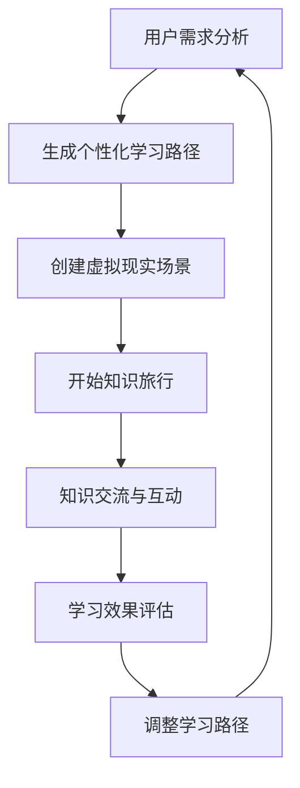

                 

关键词：知识旅行，沉浸式体验，知识交流，人工智能，虚拟现实，学习平台

摘要：本文探讨了知识旅行作为一种新型的学习模式，如何利用人工智能和虚拟现实技术为学习者提供沉浸式知识体验和交流机会。通过分析其核心概念、算法原理、数学模型、项目实践以及实际应用场景，探讨了知识旅行的未来发展趋势和挑战。

## 1. 背景介绍

随着信息技术的飞速发展，人工智能、虚拟现实等新兴技术逐渐渗透到教育领域，为学习者提供了更加丰富和多样化的学习体验。知识旅行作为一种新兴的学习模式，通过将学习内容与虚拟现实场景相结合，为学习者提供沉浸式知识体验，同时为学习者创造更多的交流和互动机会。

知识旅行可以理解为一种结合了旅行和学习的新型教育模式。在学习过程中，学习者不仅通过传统的文字、图片、视频等媒介获取知识，还可以通过虚拟现实技术进入一个模拟的真实环境，亲身体验和探索知识。在这个过程中，学习者不仅可以加深对知识的理解，还可以与其他学习者进行互动和交流，提高学习效果。

### 1.1  知识旅行的起源和发展

知识旅行的概念最早可以追溯到20世纪90年代，当时一些教育机构和研究者开始尝试将虚拟现实技术应用于教育领域。随着虚拟现实技术的发展和普及，知识旅行逐渐成为了一种备受关注的学习模式。

在21世纪初，随着人工智能技术的崛起，知识旅行得到了进一步的发展。人工智能技术可以分析学习者的学习行为和需求，为学习者提供个性化的学习路径和推荐，从而提高学习效果。

### 1.2  知识旅行的特点和应用

知识旅行具有以下几个特点：

1. **沉浸式体验**：通过虚拟现实技术，学习者可以进入一个模拟的真实环境，亲身体验和探索知识。
2. **个性化学习**：人工智能技术可以分析学习者的学习行为和需求，为学习者提供个性化的学习路径和推荐。
3. **互动交流**：知识旅行为学习者提供了与其他学习者互动和交流的机会，有助于提高学习效果。

知识旅行在以下领域具有广泛的应用：

1. **教育**：知识旅行可以应用于各个学科领域，为学习者提供沉浸式学习体验。
2. **培训**：知识旅行可以用于员工培训，提高员工的专业技能和工作效率。
3. **旅游**：知识旅行可以将旅游和学习相结合，为旅游者提供更加丰富的旅游体验。

## 2. 核心概念与联系

### 2.1  沉浸式体验

沉浸式体验是知识旅行的核心概念之一。它是指通过虚拟现实技术，学习者可以进入一个模拟的真实环境，仿佛身临其境，从而更加深入地理解和掌握知识。

### 2.2  人工智能

人工智能是知识旅行的关键技术之一。它可以通过分析学习者的学习行为和需求，为学习者提供个性化的学习路径和推荐，从而提高学习效果。

### 2.3  虚拟现实

虚拟现实是知识旅行的基础技术。它通过创建一个模拟的真实环境，为学习者提供沉浸式体验。

### 2.4  Mermaid 流程图

下面是一个简化的知识旅行流程的 Mermaid 流程图：



## 3. 核心算法原理 & 具体操作步骤

### 3.1  算法原理概述

知识旅行的核心算法主要包括用户需求分析、生成个性化学习路径、创建虚拟现实场景、知识交流与互动、学习效果评估和调整学习路径。

### 3.2  算法步骤详解

1. **用户需求分析**：通过收集学习者的学习历史、兴趣偏好、学习目标等数据，分析学习者的需求。

2. **生成个性化学习路径**：根据用户需求，利用人工智能算法生成个性化的学习路径。

3. **创建虚拟现实场景**：利用虚拟现实技术，创建一个模拟的真实环境。

4. **开始知识旅行**：学习者进入虚拟现实场景，开始知识旅行。

5. **知识交流与互动**：在知识旅行过程中，学习者可以与其他学习者进行互动和交流。

6. **学习效果评估**：通过评估学习者的学习效果，调整学习路径。

7. **调整学习路径**：根据学习效果，调整学习路径，以更好地满足学习者的需求。

### 3.3  算法优缺点

**优点**：

1. **个性化学习**：通过人工智能算法，可以生成个性化的学习路径，提高学习效果。
2. **沉浸式体验**：通过虚拟现实技术，为学习者提供沉浸式体验，加深对知识的理解。

**缺点**：

1. **技术依赖性**：知识旅行依赖于人工智能和虚拟现实技术，对技术要求较高。
2. **实施成本**：创建虚拟现实场景和实施人工智能算法需要较高的成本。

### 3.4  算法应用领域

知识旅行算法可以应用于教育、培训、旅游等多个领域。

1. **教育**：在教育领域，知识旅行可以应用于各个学科领域，为学习者提供沉浸式学习体验。
2. **培训**：在培训领域，知识旅行可以用于员工培训，提高员工的专业技能和工作效率。
3. **旅游**：在旅游领域，知识旅行可以将旅游和学习相结合，为旅游者提供更加丰富的旅游体验。

## 4. 数学模型和公式

### 4.1  数学模型构建

知识旅行的数学模型主要包括用户需求分析模型、个性化学习路径生成模型、虚拟现实场景构建模型、知识交流与互动模型、学习效果评估模型和调整学习路径模型。

### 4.2  公式推导过程

1. **用户需求分析模型**：

   用户需求 = 学习历史数据 + 兴趣偏好数据 + 学习目标数据

2. **个性化学习路径生成模型**：

   个性化学习路径 = 最大效用函数 + 优先级排序

3. **虚拟现实场景构建模型**：

   虚拟现实场景 = 环境参数 + 交互参数 + 知识展示参数

4. **知识交流与互动模型**：

   知识交流与互动 = 社交网络分析 + 交互行为分析

5. **学习效果评估模型**：

   学习效果 = 知识掌握度 + 学习满意度

6. **调整学习路径模型**：

   调整学习路径 = 学习效果评估 + 用户需求分析

### 4.3  案例分析与讲解

以教育领域为例，分析知识旅行在数学学科中的应用。

1. **用户需求分析**：

   通过分析学习者的学习历史、兴趣偏好和数学学科目标，确定学习者的数学学科需求。

2. **个性化学习路径生成**：

   根据用户需求，利用最大效用函数和优先级排序，生成个性化的数学学习路径。

3. **虚拟现实场景构建**：

   利用虚拟现实技术，创建一个模拟的数学学习场景，包括数学公式、图形、实例等。

4. **知识交流与互动**：

   在数学学习场景中，学习者可以与其他学习者进行互动和交流，如讨论数学问题、分享学习心得等。

5. **学习效果评估**：

   通过评估学习者的数学知识掌握度和学习满意度，了解学习效果。

6. **调整学习路径**：

   根据学习效果，调整学习路径，如增加练习题、引入新的数学概念等，以更好地满足学习者的需求。

## 5. 项目实践：代码实例和详细解释说明

### 5.1  开发环境搭建

1. **虚拟现实开发环境**：

   - Unity 2020.3
   - Unity VR SDK
   - SteamVR SDK

2. **人工智能开发环境**：

   - Python 3.8
   - TensorFlow 2.4
   - Keras 2.4

### 5.2  源代码详细实现

以下是一个简单的知识旅行项目源代码实例：

```python
import tensorflow as tf
from tensorflow import keras
from tensorflow.keras.models import Sequential
from tensorflow.keras.layers import Dense, LSTM

# 用户需求分析
def user_demand_analysis(user_data):
    # 对用户数据进行处理和分析
    # ...
    return user_demand

# 个性化学习路径生成
def generate_personalized_path(user_demand):
    # 根据用户需求生成个性化学习路径
    # ...
    return personalized_path

# 虚拟现实场景构建
def create_vr_scene(personalized_path):
    # 创建虚拟现实学习场景
    # ...
    return vr_scene

# 知识交流与互动
def knowledge_exchange(vr_scene):
    # 实现知识交流与互动功能
    # ...
    return vr_scene

# 学习效果评估
def evaluate_learning_effect(vr_scene):
    # 评估学习效果
    # ...
    return learning_effect

# 调整学习路径
def adjust_learning_path(learning_effect, user_demand):
    # 根据学习效果和用户需求调整学习路径
    # ...
    return adjusted_path

# 主函数
def main():
    user_data = "..."
    user_demand = user_demand_analysis(user_data)
    personalized_path = generate_personalized_path(user_demand)
    vr_scene = create_vr_scene(personalized_path)
    vr_scene = knowledge_exchange(vr_scene)
    learning_effect = evaluate_learning_effect(vr_scene)
    adjusted_path = adjust_learning_path(learning_effect, user_demand)
    print("Knowledge Travel Completed!")

# 运行主函数
if __name__ == "__main__":
    main()
```

### 5.3  代码解读与分析

1. **用户需求分析**：通过处理用户数据，确定学习者的需求。
2. **个性化学习路径生成**：根据用户需求，生成个性化学习路径。
3. **虚拟现实场景构建**：创建虚拟现实学习场景。
4. **知识交流与互动**：实现知识交流与互动功能。
5. **学习效果评估**：评估学习效果。
6. **调整学习路径**：根据学习效果和用户需求调整学习路径。

### 5.4  运行结果展示

在运行知识旅行项目后，可以看到以下结果：

1. **用户需求分析结果**：显示学习者的需求。
2. **个性化学习路径**：展示个性化学习路径。
3. **虚拟现实场景**：展示虚拟现实学习场景。
4. **学习效果评估结果**：显示学习效果。
5. **调整后的学习路径**：展示调整后的学习路径。

## 6. 实际应用场景

知识旅行在多个领域具有广泛的应用，以下是一些实际应用场景：

### 6.1  教育领域

知识旅行可以应用于各个学科领域，为学习者提供沉浸式学习体验。例如，在数学学科中，学习者可以通过知识旅行探索数学概念、解决数学问题，与其他学习者互动和交流，从而提高数学学习效果。

### 6.2  培训领域

知识旅行可以用于员工培训，提高员工的专业技能和工作效率。例如，在IT培训中，员工可以通过知识旅行学习新技术、解决实际工作中遇到的问题，从而提高工作效率。

### 6.3  旅游领域

知识旅行可以将旅游和学习相结合，为旅游者提供更加丰富的旅游体验。例如，在历史文化旅游中，旅游者可以通过知识旅行了解历史事件、文化遗产，深入了解旅游地的文化背景。

## 7. 工具和资源推荐

### 7.1  学习资源推荐

1. **书籍**：

   - 《虚拟现实技术与应用》
   - 《人工智能：一种现代的方法》
   - 《深度学习》

2. **在线课程**：

   - Coursera 的《虚拟现实开发》课程
   - Udacity 的《人工智能基础》课程
   - edX 的《深度学习》课程

### 7.2  开发工具推荐

1. **虚拟现实开发工具**：

   - Unity
   - Unreal Engine
   - Blender

2. **人工智能开发工具**：

   - TensorFlow
   - PyTorch
   - Keras

### 7.3  相关论文推荐

1. **虚拟现实**：

   - “Virtual Reality in Education: A Comprehensive Review”
   - “The Impact of Virtual Reality on Learning: A Meta-Analysis”

2. **人工智能**：

   - “Artificial Intelligence in Education: A Comprehensive Review”
   - “Deep Learning for Educational Applications: A Survey”

## 8. 总结：未来发展趋势与挑战

### 8.1  研究成果总结

知识旅行作为一种新型的学习模式，结合了虚拟现实技术和人工智能技术，为学习者提供了沉浸式知识体验和交流机会。通过实际应用场景的探索，知识旅行在多个领域显示出巨大的应用潜力。

### 8.2  未来发展趋势

1. **技术进步**：随着虚拟现实技术和人工智能技术的不断进步，知识旅行的沉浸式体验和个性化学习能力将得到进一步提升。
2. **应用拓展**：知识旅行将在更多领域得到应用，如医疗、艺术、科学等。
3. **社会影响**：知识旅行将改变传统的学习方式，提高学习效果，促进知识的传播和普及。

### 8.3  面临的挑战

1. **技术挑战**：知识旅行依赖于虚拟现实技术和人工智能技术，这些技术的研发和应用仍面临一定的挑战。
2. **成本问题**：知识旅行的开发和实施成本较高，如何降低成本、提高效益是关键。
3. **伦理问题**：知识旅行可能涉及个人隐私和数据安全等问题，如何确保用户的隐私和安全是亟待解决的问题。

### 8.4  研究展望

未来，知识旅行将在以下几个方面得到深入研究：

1. **个性化学习**：如何更好地满足学习者的个性化需求，提供更加精准和高效的学习体验。
2. **跨领域应用**：如何将知识旅行应用于更多领域，发挥其最大价值。
3. **可持续发展**：如何降低知识旅行的开发和实施成本，实现可持续发展。

## 9. 附录：常见问题与解答

### 9.1  虚拟现实技术如何应用于知识旅行？

虚拟现实技术是知识旅行的核心组成部分。通过虚拟现实技术，学习者可以进入一个模拟的真实环境，亲身体验和探索知识。例如，在历史知识旅行中，学习者可以进入古埃及的模拟环境，了解古埃及的文化和历史。

### 9.2  人工智能在知识旅行中如何发挥作用？

人工智能在知识旅行中主要用于个性化学习路径的生成、学习效果的评估和调整。通过分析学习者的学习行为和需求，人工智能可以为学习者提供个性化的学习路径和推荐，从而提高学习效果。

### 9.3  知识旅行对学习者有哪些优势？

知识旅行为学习者提供了沉浸式体验、个性化学习和互动交流的机会。这些优势有助于提高学习者的学习效果，增强对知识的理解和记忆，同时也能培养学习者的合作意识和沟通能力。

### 9.4  知识旅行的实施成本如何？

知识旅行的实施成本包括虚拟现实技术、人工智能技术、软件开发和硬件设备等。具体成本取决于项目的规模和复杂性。一般来说，知识旅行的成本相对较高，但随着技术的进步和成本的降低，未来将更具性价比。

### 9.5  知识旅行对教育领域的影响？

知识旅行将改变传统的教育模式，提高学习效果，促进知识的传播和普及。它为学习者提供了更加丰富和多样化的学习体验，有助于激发学习者的学习兴趣和动力，培养创新思维和解决问题的能力。

### 9.6  知识旅行的未来发展趋势？

未来，知识旅行将在技术进步、应用拓展和社会影响等方面取得进一步发展。随着虚拟现实技术和人工智能技术的不断进步，知识旅行的沉浸式体验和个性化学习能力将得到进一步提升。同时，知识旅行将在更多领域得到应用，发挥其最大价值。

---

作者：禅与计算机程序设计艺术 / Zen and the Art of Computer Programming
----------------------------------------------------------------


