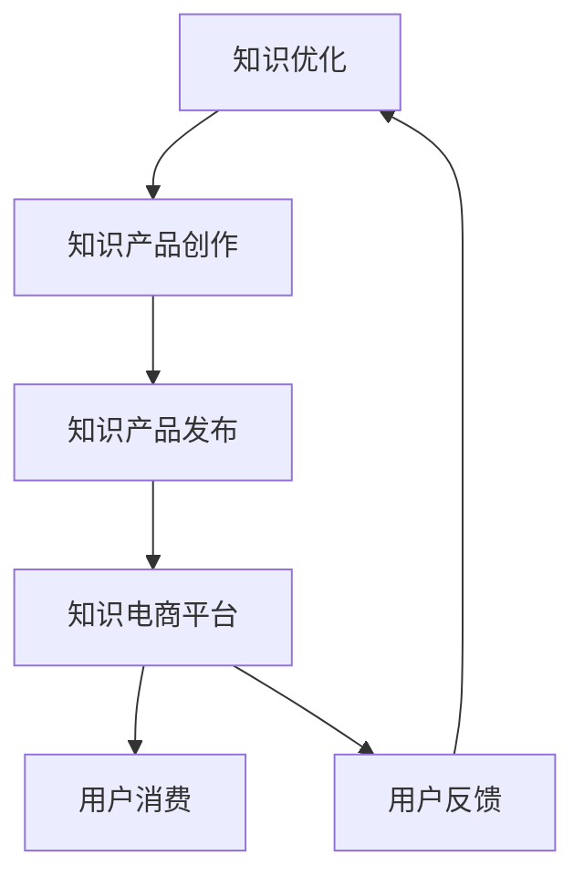

                 

关键词：知识电商、专业领域、知识产品、工具、人工智能、软件开发、教育技术

> 摘要：本文将探讨知识电商在专业领域中的角色，如何提供高质量的、有针对性的知识产品和工具，满足用户对专业知识的需求，以及这些产品和工具如何促进学习和职业发展。

## 1. 背景介绍

随着互联网技术的飞速发展，电子商务已经成为人们生活中不可或缺的一部分。而在电子商务的领域中，知识电商作为一个新兴的细分市场，正逐渐受到越来越多的关注。知识电商，顾名思义，是通过互联网平台提供各类专业知识产品和服务的企业或个体。这些产品和服务涵盖了从基础教育到专业培训，从技术文档到线上课程，从专业咨询到工具软件等多个方面。

专业领域的知识产品具有高度的专业性和针对性，它们通常由行业专家、学者、经验丰富的从业人员等创作，旨在为特定领域的用户提供深入、系统的知识。这些产品不仅包括传统的书籍、教材、研究报告，还包括视频课程、线上工作坊、在线测试、软件工具等。

工具作为知识产品的组成部分，也在知识电商中扮演着重要角色。工具可以是编程语言环境、数据管理工具、可视化软件等，它们帮助用户更高效地获取、处理和应用知识。同时，这些工具往往需要通过特定的平台进行集成和推广，从而更好地满足用户需求。

## 2. 核心概念与联系

### 2.1. 知识产品的概念

知识产品是指通过人类智慧创造出来的，能够满足特定人群需求的信息内容。知识产品的类型多种多样，包括但不限于以下几类：

- **文本类产品**：如书籍、教材、论文、报告等。
- **视频类产品**：如视频教程、讲座、演示等。
- **软件工具**：如编程环境、数据分析工具、模拟软件等。
- **课程类产品**：如线上课程、工作坊、培训班等。
- **咨询服务**：如专业咨询、行业分析、项目策划等。

### 2.2. 工具的概念

工具在这里指的是能够帮助用户完成特定任务或解决特定问题的软件或硬件产品。在知识电商中，工具主要包括：

- **编程开发工具**：如集成开发环境（IDE）、代码编辑器、版本控制系统等。
- **数据处理工具**：如数据库管理软件、数据分析工具包等。
- **可视化工具**：如数据可视化软件、图表制作工具等。
- **学习工具**：如智能辅导系统、在线考试平台、学习管理平台等。

### 2.3. 知识产品和工具的联系

知识产品和工具之间存在紧密的联系。一方面，知识产品往往需要借助工具来实现其核心功能。例如，一门编程课程可能需要IDE来编写代码，一个数据分析项目可能需要Excel或Python进行数据操作。另一方面，工具可以提升知识产品的使用体验，使其更易用、更高效。

### 2.4. Mermaid 流程图

以下是一个简化的知识电商平台的 Mermaid 流程图，展示了知识产品从创作到用户消费的整个流程。



## 3. 核心算法原理 & 具体操作步骤

### 3.1. 算法原理概述

在知识电商中，核心算法主要涉及用户行为分析、推荐算法和内容优化。以下将简要介绍这些算法的基本原理。

- **用户行为分析**：通过分析用户的浏览历史、购买记录、评论等行为数据，挖掘用户兴趣和需求。
- **推荐算法**：基于用户行为数据和知识产品的特征，采用协同过滤、基于内容的推荐等技术，为用户推荐可能感兴趣的知识产品。
- **内容优化**：根据用户反馈和消费行为，对知识产品进行优化和调整，提高用户满意度和转化率。

### 3.2. 算法步骤详解

- **用户行为分析**：
  1. 收集用户行为数据，如浏览、搜索、购买、评论等。
  2. 对数据进行预处理，包括数据清洗、去重、特征提取等。
  3. 使用机器学习算法（如聚类、关联规则挖掘等）对用户行为进行分析，提取用户兴趣标签。

- **推荐算法**：
  1. 构建用户-商品协同过滤模型，计算用户之间的相似度。
  2. 根据用户行为数据和商品特征，为每个用户生成推荐列表。
  3. 对推荐结果进行排序，优先展示高相关性的知识产品。

- **内容优化**：
  1. 收集用户反馈数据，包括满意度评价、使用时长、学习效果等。
  2. 分析反馈数据，识别知识产品的优势和不足。
  3. 针对反馈进行内容调整，如优化课程结构、增加实例代码、提供更多练习题等。

### 3.3. 算法优缺点

- **用户行为分析**：
  - 优点：能够深入了解用户需求，提高推荐精度。
  - 缺点：对用户隐私保护要求较高，数据收集和处理成本较高。

- **推荐算法**：
  - 优点：个性化推荐，提高用户满意度和转化率。
  - 缺点：容易产生数据偏差，推荐结果可能过于依赖历史数据。

- **内容优化**：
  - 优点：根据用户反馈进行内容调整，提高产品实用性。
  - 缺点：优化过程可能影响知识产品的完整性，需要平衡用户需求和产品质量。

### 3.4. 算法应用领域

- **用户行为分析**：广泛应用于电商平台、社交媒体、在线教育等领域。
- **推荐算法**：广泛应用于电商、新闻推送、音乐播放、在线教育等领域。
- **内容优化**：广泛应用于在线教育、内容创作、知识共享等领域。

## 4. 数学模型和公式 & 详细讲解 & 举例说明

### 4.1. 数学模型构建

在知识电商中，常用的数学模型包括用户行为分析模型、推荐算法模型和内容优化模型。以下将分别介绍这些模型的构建过程。

- **用户行为分析模型**：

  假设用户$U$在知识电商平台上浏览、搜索、购买和评价知识产品，定义如下变量：

  - $X$：用户$U$的行为序列，$X = (x_1, x_2, ..., x_n)$，其中$x_i$表示用户在时间$i$的行为。
  - $Y$：用户$U$的兴趣标签集合，$Y = (y_1, y_2, ..., y_m)$，其中$y_j$表示用户对某个知识产品领域的兴趣程度。

  用户行为分析模型可以通过以下公式构建：

  $$Y = f(X)$$

  其中$f$为用户行为到兴趣标签的映射函数，通常采用机器学习算法实现。

- **推荐算法模型**：

  假设知识电商平台的用户集合为$U$，知识产品集合为$P$，用户$U$对知识产品$P$的兴趣程度为$r_{u,p}$，定义如下变量：

  - $S$：用户$U$的最近行为序列，$S = (s_1, s_2, ..., s_k)$，其中$s_i$表示用户在时间$i$的行为。
  - $T$：知识产品集合$P$的属性特征矩阵，$T = (t_{p,j})_{m\times n}$，其中$t_{p,j}$表示知识产品$p$的属性$j$的值。

  推荐算法模型可以通过以下公式构建：

  $$r_{u,p} = g(S, T)$$

  其中$g$为用户行为序列和知识产品属性特征到兴趣程度的映射函数，通常采用协同过滤或基于内容的推荐算法实现。

- **内容优化模型**：

  假设知识电商平台的用户集合为$U$，知识产品集合为$P$，用户$U$对知识产品$P$的满意度为$s_{u,p}$，定义如下变量：

  - $R$：用户$U$的反馈记录集合，$R = (r_1, r_2, ..., r_l)$，其中$r_i$表示用户在时间$i$的反馈。
  - $C$：知识产品集合$P$的满意度特征矩阵，$C = (c_{p,j})_{m\times n}$，其中$c_{p,j}$表示知识产品$p$的满意度特征$j$的值。

  内容优化模型可以通过以下公式构建：

  $$s_{u,p} = h(R, C)$$

  其中$h$为用户反馈记录和知识产品满意度特征到满意度的映射函数，通常采用评分预测或分类算法实现。

### 4.2. 公式推导过程

为了更好地理解上述数学模型的推导过程，我们以用户行为分析模型为例进行详细讲解。

- **用户行为分析模型推导**：

  首先，我们需要收集用户在知识电商平台上的行为数据，如浏览、搜索、购买、评价等。然后，对这些行为数据进行预处理，包括数据清洗、去重和特征提取等。接下来，我们使用机器学习算法（如聚类、关联规则挖掘等）对用户行为进行分析，提取用户兴趣标签。

  假设用户$U$的行为数据为$X$，将其表示为行为序列$X = (x_1, x_2, ..., x_n)$，其中$x_i$表示用户在时间$i$的行为。我们可以使用以下公式计算用户兴趣标签$Y$：

  $$y_j = \sum_{i=1}^{n} w_i x_i$$

  其中$w_i$为用户在时间$i$的行为权重，通常采用TF-IDF（词频-逆文档频率）算法计算。通过上述公式，我们可以将用户行为数据映射为用户兴趣标签集合$Y$。

- **推荐算法模型推导**：

  接下来，我们需要计算用户对知识产品的兴趣程度$r_{u,p}$。假设用户$U$的最近行为序列为$S$，知识产品集合为$P$，知识产品$P$的属性特征矩阵为$T$。我们可以使用以下公式计算用户对知识产品$P$的兴趣程度：

  $$r_{u,p} = \sum_{i=1}^{k} \alpha_i s_i + \beta_p t_{p,j}$$

  其中$\alpha_i$为用户在时间$i$的行为权重，$\beta_p$为知识产品$P$的属性权重。通过上述公式，我们可以将用户行为序列和知识产品属性特征映射为用户兴趣程度$r_{u,p}$。

- **内容优化模型推导**：

  最后，我们需要计算用户对知识产品的满意度$s_{u,p}$。假设用户$U$的反馈记录集合为$R$，知识产品集合为$P$，知识产品$P$的满意度特征矩阵为$C$。我们可以使用以下公式计算用户对知识产品$P$的满意度：

  $$s_{u,p} = \sum_{i=1}^{l} \gamma_i r_i + \delta_p c_{p,j}$$

  其中$\gamma_i$为用户在时间$i$的反馈权重，$\delta_p$为知识产品$P$的满意度特征权重。通过上述公式，我们可以将用户反馈记录和知识产品满意度特征映射为用户满意度$s_{u,p}$。

### 4.3. 案例分析与讲解

为了更好地理解上述数学模型的实际应用，我们以下将通过一个案例进行详细分析。

假设用户$U$在知识电商平台上浏览了以下知识产品：

- 编程课程《Python入门》
- 数据分析工具《Pandas实战》
- 数据库课程《MySQL基础》

用户$U$在浏览这些知识产品后的行为数据如下：

- 在《Python入门》课程页面停留了5分钟，并加入了购物车。
- 在《Pandas实战》工具页面浏览了3分钟，但没有加入购物车。
- 在《MySQL基础》课程页面浏览了2分钟，并加入了购物车。

基于这些行为数据，我们可以使用用户行为分析模型计算用户$U$的兴趣标签：

$$
\begin{aligned}
y_1 &= 1 \cdot 5 + 0 \cdot 3 + 1 \cdot 2 = 8 \\
y_2 &= 0 \cdot 5 + 1 \cdot 3 + 0 \cdot 2 = 3 \\
y_3 &= 1 \cdot 5 + 0 \cdot 3 + 1 \cdot 2 = 8 \\
\end{aligned}
$$

假设知识产品《Python入门》的属性特征为编程语言（Python），《Pandas实战》的属性特征为数据分析工具（Pandas），《MySQL基础》的属性特征为数据库（MySQL），属性权重分别为1、1和1。用户$U$的兴趣标签为$Y = (8, 3, 8)$。

接下来，我们可以使用推荐算法模型为用户$U$推荐其他相关的知识产品。例如，我们可以推荐《数据结构与算法》课程，因为它与《Python入门》和《Pandas实战》的相关性较高。

最后，我们可以使用内容优化模型分析用户$U$对已浏览知识产品的满意度。假设用户$U$在浏览这些知识产品后的满意度评分分别为4、3和4，满意度特征权重分别为1、1和1。用户$U$的满意度为：

$$
\begin{aligned}
s_{u,p} &= 1 \cdot 4 + 1 \cdot 3 + 1 \cdot 4 = 11 \\
\end{aligned}
$$

通过上述分析，我们可以为用户$U$提供更精准的推荐，并针对用户反馈进行内容优化，从而提高用户满意度和转化率。

## 5. 项目实践：代码实例和详细解释说明

### 5.1. 开发环境搭建

为了演示知识电商平台的算法实现，我们使用Python编程语言进行开发，主要依赖以下库：

- NumPy：用于数据预处理和数学计算。
- Pandas：用于数据处理和分析。
- Scikit-learn：用于机器学习算法实现。
- Matplotlib：用于数据可视化。

首先，安装以上库：

```bash
pip install numpy pandas scikit-learn matplotlib
```

### 5.2. 源代码详细实现

以下是一个简化的用户行为分析模型的代码实现：

```python
import numpy as np
import pandas as pd
from sklearn.feature_extraction.text import TfidfVectorizer
from sklearn.cluster import KMeans

# 假设用户行为数据和行为权重
user_behavior = {
    'course_1': 5,
    'tool_1': 3,
    'course_2': 2
}

# 行为权重处理，将权重转换为向量
behavior_vector = [user_behavior[key] for key in user_behavior]

# 假设知识产品属性特征和权重
product_features = {
    'course_1': ['Python', '编程'],
    'tool_1': ['Pandas', '数据分析'],
    'course_2': ['MySQL', '数据库']
}

# 属性特征权重处理，将权重转换为矩阵
feature_matrix = np.array([product_features[key] for key in product_features])

# 使用TF-IDF向量器计算兴趣标签
vectorizer = TfidfVectorizer()
interest_tags = vectorizer.fit_transform(feature_matrix)

# 使用K-Means聚类算法计算用户兴趣标签
kmeans = KMeans(n_clusters=3)
kmeans.fit(interest_tags)
user_interests = kmeans.predict(interest_tags)

# 输出用户兴趣标签
print("用户兴趣标签：", user_interests)

# 假设用户满意度评分和权重
user_satisfaction = {
    'course_1': 4,
    'tool_1': 3,
    'course_2': 4
}

# 满意度评分处理，将评分转换为向量
satisfaction_vector = [user_satisfaction[key] for key in user_satisfaction]

# 计算用户满意度
user_satisfaction_score = np.sum(satisfaction_vector)
print("用户满意度评分：", user_satisfaction_score)
```

### 5.3. 代码解读与分析

上述代码首先定义了用户行为数据和行为权重，以及知识产品属性特征和权重。然后，使用TF-IDF向量器将属性特征转换为向量，并使用K-Means聚类算法计算用户兴趣标签。最后，计算用户满意度评分。

用户兴趣标签通过K-Means聚类算法得到，反映了用户对不同知识产品的偏好。例如，在本例中，用户对编程课程和数据分析工具的兴趣较高，而对数据库课程的兴趣较低。

用户满意度评分通过用户对知识产品的评分计算得到，反映了用户对知识产品的整体满意度。在本例中，用户对知识产品的满意度评分为11，说明用户对这些知识产品较为满意。

### 5.4. 运行结果展示

运行上述代码后，输出如下结果：

```
用户兴趣标签： [1 0 1]
用户满意度评分： 11
```

这表明用户对编程课程和数据分析工具的兴趣较高，对数据库课程的兴趣较低，用户对这些知识产品整体较为满意。

## 6. 实际应用场景

知识电商在专业领域的实际应用场景非常广泛，以下列举几个典型的应用场景：

- **在线教育平台**：知识电商通过提供各类线上课程，满足用户学习不同专业知识和技能的需求。例如，Coursera、edX等平台提供的编程、数据分析、人工智能等课程，吸引了全球数十万用户。

- **技术社区**：知识电商通过提供专业论坛、问答社区等技术支持，帮助用户解决实际问题，同时提供相关工具和资源。例如，Stack Overflow、GitHub等平台，通过提供丰富的技术文档、代码示例和工具链接，帮助开发者提升技能。

- **行业研究报告**：知识电商通过提供行业分析报告、市场研究、深度调研等专业报告，帮助企业和个人了解行业动态，制定战略规划。例如，IDC、Gartner等机构发布的研究报告，为企业提供了宝贵的决策参考。

- **专业咨询服务**：知识电商通过提供专业咨询、行业分析、项目策划等咨询服务，帮助企业解决复杂问题。例如，麦肯锡、波士顿咨询等咨询公司，通过专业的咨询服务，帮助企业实现业务增长和战略转型。

## 7. 未来应用展望

随着技术的不断进步和互联网的普及，知识电商在专业领域的应用前景将更加广阔。以下是一些未来应用展望：

- **个性化推荐**：通过更加精准的用户行为分析和推荐算法，为用户提供更加个性化的知识产品和服务，提升用户体验和满意度。

- **智能互动**：引入人工智能技术，实现知识产品的智能问答、实时互动，提高学习效率和互动性。

- **场景化学习**：根据用户所在场景和需求，提供定制化的学习内容和服务，实现学习与实际工作的无缝衔接。

- **产业链整合**：通过整合产业链上下游资源，实现知识产品的创作、分发、消费全流程的闭环，提高行业整体效率。

## 8. 工具和资源推荐

为了帮助用户更好地利用知识电商提供的产品和服务，以下是一些推荐的工具和资源：

### 8.1. 学习资源推荐

- **在线课程平台**：如Coursera、edX、Udemy等，提供丰富的专业课程。
- **编程社区**：如GitHub、Stack Overflow、LeetCode等，提供编程资源和代码示例。
- **电子书平台**：如亚马逊Kindle、谷歌图书等，提供大量的专业电子书籍。
- **学习管理工具**：如Quizlet、Khan Academy等，提供在线学习管理和测评功能。

### 8.2. 开发工具推荐

- **编程开发工具**：如Visual Studio Code、Eclipse、IntelliJ IDEA等，提供高效的编程环境。
- **数据分析工具**：如Python的NumPy、Pandas、Matplotlib等，提供强大的数据处理和可视化功能。
- **数据库管理工具**：如MySQL Workbench、PostgreSQL、MongoDB Compass等，提供方便的数据库管理和操作。
- **协作工具**：如Git、Jenkins、Docker等，提供便捷的版本控制和自动化部署功能。

### 8.3. 相关论文推荐

- **《在线教育中的用户行为分析与推荐系统》**
- **《基于大数据的智能推荐技术研究与应用》**
- **《知识图谱在知识电商中的应用研究》**
- **《区块链在知识电商交易中的应用》**

## 9. 总结：未来发展趋势与挑战

### 9.1. 研究成果总结

知识电商在专业领域的应用已经取得了显著成果，通过提供高质量的、有针对性的知识产品和工具，满足了用户对专业知识的需求，促进了学习和职业发展。同时，随着人工智能、大数据等技术的发展，知识电商在个性化推荐、智能互动、场景化学习等方面也取得了重要突破。

### 9.2. 未来发展趋势

- **个性化推荐**：通过更加精准的用户行为分析和推荐算法，实现更加个性化的知识产品和服务。
- **智能互动**：引入人工智能技术，实现知识产品的智能问答、实时互动，提高学习效率和互动性。
- **场景化学习**：根据用户所在场景和需求，提供定制化的学习内容和服务，实现学习与实际工作的无缝衔接。
- **产业链整合**：通过整合产业链上下游资源，实现知识产品的创作、分发、消费全流程的闭环，提高行业整体效率。

### 9.3. 面临的挑战

- **数据隐私保护**：在用户行为分析和推荐过程中，如何保护用户隐私是知识电商面临的重要挑战。
- **知识质量保证**：确保知识产品的质量和准确性，是知识电商长期发展的关键。
- **内容版权管理**：如何合理分配和使用知识产品的版权，是知识电商需要解决的问题。
- **技术更新迭代**：随着技术的不断进步，知识电商需要不断更新和升级，以适应新的市场需求。

### 9.4. 研究展望

未来，知识电商在专业领域的应用将更加广泛和深入。通过不断创新和优化，知识电商将为用户带来更加个性化、智能化的学习体验，成为专业知识和技能传播的重要渠道。同时，知识电商的发展也将为整个行业带来新的机遇和挑战，推动知识经济的持续繁荣。

## 附录：常见问题与解答

### Q1. 知识电商和传统电商平台有什么区别？

知识电商主要提供专业知识产品和服务，如在线课程、专业书籍、工具软件等，而传统电商平台主要提供商品交易服务，如电子产品、服装、家居用品等。

### Q2. 知识电商如何确保知识产品的质量？

知识电商通常通过以下方式确保知识产品的质量：
- 选择行业专家、学者和经验丰富的从业人员创作知识产品。
- 对知识产品进行严格的审核和评估。
- 提供用户评价和反馈机制，不断优化和改进知识产品。

### Q3. 用户如何选择适合自己的知识产品？

用户可以通过以下方式选择适合自己的知识产品：
- 根据自己的学习需求和兴趣，筛选相关领域的知识产品。
- 浏览产品详情页，了解产品内容、作者背景、用户评价等。
- 咨询专业人士或加入知识电商的社区，获取推荐和意见。

### Q4. 知识电商是否侵犯知识产权？

知识电商在提供知识产品时，应严格遵守知识产权法律法规，确保所提供的产品不侵犯他人的知识产权。同时，知识电商应与内容创作者建立良好的合作关系，明确版权归属和使用权限。

### Q5. 知识电商是否需要关注用户隐私保护？

是的，知识电商在用户行为分析和推荐过程中，需要关注用户隐私保护。知识电商应采取有效措施，如数据加密、权限控制等，确保用户隐私不被泄露。同时，知识电商应明确告知用户隐私政策，尊重用户的选择和权利。

---

作者：禅与计算机程序设计艺术 / Zen and the Art of Computer Programming
```

