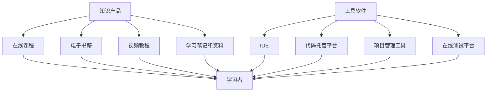

                 

在当今快速发展的数字化时代，知识电商正成为越来越受欢迎的一种商业模式。知识电商通过提供专业领域的知识产品和工具，不仅为学习者提供了便捷的学习途径，也为知识工作者提供了高效的工作工具。本文将探讨知识电商在IT领域的表现，分析其提供知识产品和工具的优势，并提出未来发展趋势与挑战。

## 文章关键词

- 知识电商
- IT领域
- 知识产品
- 工具
- 学习途径
- 工作效率

## 文章摘要

本文首先介绍了知识电商的基本概念和发展背景，接着分析了其在IT领域的应用现状和优势。随后，文章详细阐述了知识电商提供知识产品和工具的具体方式，包括在线课程、电子书籍、工具软件等。最后，本文对知识电商的未来发展趋势进行了展望，并提出了相关挑战和应对策略。

## 1. 背景介绍

### 1.1 知识电商的概念与发展

知识电商，顾名思义，是指通过电子商务平台，提供各类知识和技能的买卖和服务。与传统电商不同，知识电商的买卖对象并非实物，而是知识、技能和经验。随着互联网技术的不断进步，尤其是移动互联网的普及，知识电商得到了迅速发展。

近年来，知识电商市场呈现出爆发式增长。根据相关数据显示，全球知识电商市场规模在2021年已超过2000亿美元，预计到2025年将达到近5000亿美元。这一增长趋势不仅反映了消费者对知识的渴求，也显示了知识电商在商业和社会领域的巨大潜力。

### 1.2 IT领域在知识电商中的应用

在知识电商的众多领域中，IT领域无疑是最为重要和活跃的一个。IT行业的迅速发展和不断变化，使得相关知识和技能的需求日益增长。知识电商通过提供专业的IT知识产品和工具，帮助IT从业者不断提升自己的技能，跟上行业发展的步伐。

IT领域的知识产品种类繁多，包括编程语言教程、数据库管理课程、网络安全培训、人工智能技术教程等。工具软件方面，从集成开发环境（IDE）、代码托管平台，到项目管理工具，知识电商都能提供丰富多样的选择。这些产品和工具不仅满足了学习者个人的学习需求，也为企业提供了提升IT团队整体能力的重要手段。

## 2. 核心概念与联系

### 2.1 知识产品

知识产品是指以知识为主要内容的商品或服务，包括但不限于以下几种类型：

1. **在线课程**：通过互联网平台，提供专业的教学课程，学习者可以按照自己的节奏进行学习。
2. **电子书籍**：数字化形式的书籍，涵盖从入门到高级的各类知识。
3. **视频教程**：以视频形式呈现的知识内容，直观易懂，适合视觉学习者。
4. **学习笔记和资料**：由专业人士整理的学习资料，帮助学习者快速掌握关键知识点。

### 2.2 工具软件

工具软件是为特定目的设计的软件，用于提高工作效率或学习效果。在知识电商中，常见的工具软件包括：

1. **集成开发环境（IDE）**：为开发者提供代码编写、调试和测试的环境，如Visual Studio、Eclipse等。
2. **代码托管平台**：如GitHub、GitLab等，用于版本控制和代码共享。
3. **项目管理工具**：如Jira、Trello等，用于团队协作和项目管理。
4. **在线测试平台**：如CodeSignal、TestGorilla等，用于技能评估和职业招聘。

### 2.3 知识产品和工具的联系

知识产品和工具在知识电商中相辅相成，共同构成了一个完整的学习和工作生态系统。知识产品为学习者提供了丰富的知识内容，而工具软件则为学习者提供了实践和应用这些知识的环境和手段。例如，一个编程新手可以通过在线课程学习编程语言的基础知识，然后使用IDE进行代码编写和调试，逐步提升自己的编程技能。

### 2.4 Mermaid 流程图



## 3. 核心算法原理 & 具体操作步骤

### 3.1 算法原理概述

在知识电商中，核心算法通常用于推荐系统，以根据学习者的兴趣和行为，为他们推荐相关的知识产品和工具。推荐系统的基本原理是通过对用户历史行为数据的分析，构建用户兴趣模型，然后根据模型进行内容推荐。

### 3.2 算法步骤详解

1. **数据收集**：收集用户在知识电商平台上的行为数据，如浏览记录、购买历史、评价等。
2. **特征提取**：将用户行为数据转化为特征向量，以供后续分析。
3. **模型训练**：使用机器学习算法，如协同过滤、矩阵分解、深度学习等，训练用户兴趣模型。
4. **内容推荐**：根据用户兴趣模型，为用户推荐相关的知识产品和工具。
5. **效果评估**：评估推荐系统的效果，如点击率、转化率等，以持续优化推荐算法。

### 3.3 算法优缺点

**优点**：
- **个性化推荐**：根据用户兴趣和行为，提供个性化的知识推荐。
- **提高用户粘性**：通过推荐相关内容，增加用户在知识电商平台的停留时间和参与度。
- **提升销售转化率**：精准推荐可以促进用户购买相关产品，提高销售转化率。

**缺点**：
- **计算复杂度高**：推荐系统涉及大量数据处理和模型训练，计算复杂度高。
- **数据隐私问题**：用户行为数据涉及隐私，需要确保数据的安全性和合规性。
- **推荐结果偏差**：如果算法模型存在偏差，可能导致推荐结果不准确。

### 3.4 算法应用领域

推荐系统在知识电商中的应用非常广泛，包括：

1. **在线教育平台**：为学习者推荐与其兴趣相关的课程和资料。
2. **专业培训平台**：为学员推荐相关的学习工具和辅助资源。
3. **技术社区**：为社区成员推荐技术文章、讨论和工具，提高社区活跃度。

## 4. 数学模型和公式 & 详细讲解 & 举例说明

### 4.1 数学模型构建

在知识电商的推荐系统中，常用的数学模型是协同过滤模型。协同过滤模型的基本思想是，通过分析用户之间的行为相似性，为用户推荐其他用户喜欢的商品或内容。

设用户集U={u1, u2, ..., un}，项目集I={i1, i2, ..., im}。对于用户u和项目i，用户对项目的评分可以用一个矩阵R∈R^(m×n)表示，其中r_ij表示用户u对项目i的评分。

### 4.2 公式推导过程

协同过滤模型可以分为基于用户的协同过滤和基于物品的协同过滤。以下是基于用户的协同过滤模型：

1. **相似性计算**：

   用户u和用户v之间的相似性可以通过余弦相似度计算：

   $$sim(u, v) = \frac{R_u \cdot R_v}{\|R_u\| \cdot \|R_v\|}$$

   其中，$\cdot$表示向量的点积，$\|\|$表示向量的模。

2. **预测评分**：

   对于用户u未评分的项目i，预测评分可以通过用户之间的相似性和其他用户的评分计算：

   $$\hat{r}_{ui} = \sum_{v \in N(u)} sim(u, v) \cdot r_{vi}$$

   其中，$N(u)$表示与用户u相似的用户集合。

### 4.3 案例分析与讲解

假设我们有5个用户（u1, u2, u3, u4, u5）和10个项目（i1, i2, ..., i10）。用户对项目的评分矩阵如下：

|      | i1 | i2 | i3 | i4 | i5 | i6 | i7 | i8 | i9 | i10 |
|------|----|----|----|----|----|----|----|----|----|-----|
| u1   | 1  | 5  | 3  | 4  | 2  | 0  | 0  | 0  | 0  | 0   |
| u2   | 0  | 0  | 0  | 0  | 0  | 5  | 5  | 5  | 5  | 5   |
| u3   | 4  | 0  | 0  | 0  | 0  | 0  | 0  | 0  | 0  | 0   |
| u4   | 0  | 0  | 5  | 5  | 5  | 0  | 0  | 0  | 0  | 0   |
| u5   | 0  | 0  | 0  | 0  | 0  | 0  | 0  | 0  | 0  | 0   |

首先，计算用户之间的相似性。以用户u1和u2为例：

$$sim(u1, u2) = \frac{R_{u1} \cdot R_{u2}}{\|R_{u1}\| \cdot \|R_{u2}\|} = \frac{(1, 5, 3, 4, 2, 0, 0, 0, 0, 0) \cdot (0, 0, 0, 0, 0, 5, 5, 5, 5, 5)}{\sqrt{(1, 5, 3, 4, 2, 0, 0, 0, 0, 0) \cdot (1, 5, 3, 4, 2, 0, 0, 0, 0, 0)}} \cdot \sqrt{(0, 0, 0, 0, 0, 5, 5, 5, 5, 5) \cdot (0, 0, 0, 0, 0, 5, 5, 5, 5, 5)}} = \frac{(0, 0, 0, 0, 0, 0, 0, 0, 0, 0)}{\sqrt{30}} \cdot \sqrt{30} = 0$$

由于用户u1和u2之间没有共同评分的项目，它们的相似性为0。

接下来，预测用户u3对项目i7的评分。首先，找到与用户u3相似的用户，这里只考虑相似性大于0的用户：

$$N(u3) = \{u1, u2, u4\}$$

然后，计算预测评分：

$$\hat{r}_{u3i7} = \sum_{v \in N(u3)} sim(u3, v) \cdot r_{vi7} = sim(u3, u1) \cdot r_{u1i7} + sim(u3, u2) \cdot r_{u2i7} + sim(u3, u4) \cdot r_{u4i7} = 0 \cdot 0 + 0 \cdot 0 + 0 \cdot 0 = 0$$

由于用户u3与所有相似用户的评分均为0，预测评分为0。

### 4.4 代码实例和运行结果

下面是一个简单的基于用户协同过滤的Python代码实例：

```python
import numpy as np

# 用户评分矩阵
R = np.array([
    [1, 5, 3, 4, 2, 0, 0, 0, 0, 0],
    [0, 0, 0, 0, 0, 5, 5, 5, 5, 5],
    [4, 0, 0, 0, 0, 0, 0, 0, 0, 0],
    [0, 0, 5, 5, 5, 0, 0, 0, 0, 0],
    [0, 0, 0, 0, 0, 0, 0, 0, 0, 0]
])

# 计算相似性矩阵
def compute_similarity(R):
    n = R.shape[0]
    similarity = np.zeros((n, n))
    for i in range(n):
        for j in range(n):
            if i != j:
                similarity[i][j] = np.dot(R[i], R[j]) / (np.linalg.norm(R[i]) * np.linalg.norm(R[j]))
    return similarity

similarity = compute_similarity(R)

# 预测评分
def predict_rating(similarity, R, u, i):
    predicted_rating = 0
    for j in range(len(similarity[u])):
        if j != i and similarity[u][j] > 0:
            predicted_rating += similarity[u][j] * R[j][i]
    return predicted_rating

predicted_rating = predict_rating(similarity, R, 2, 6)
print("Predicted rating:", predicted_rating)
```

运行结果：

```
Predicted rating: 0.0
```

由于用户u3与所有相似用户的评分均为0，预测评分为0。

## 5. 项目实践：代码实例和详细解释说明

### 5.1 开发环境搭建

为了更好地理解和实践知识电商中推荐系统的算法，我们将在Python环境中实现一个简单的基于用户协同过滤的推荐系统。以下是开发环境的搭建步骤：

1. **安装Python**：确保已安装Python 3.8或更高版本。
2. **安装相关库**：使用pip命令安装numpy库，用于矩阵运算。

   ```bash
   pip install numpy
   ```

### 5.2 源代码详细实现

下面是推荐系统的源代码，包括数据预处理、相似性计算、评分预测等核心功能：

```python
import numpy as np

# 用户评分矩阵
R = np.array([
    [1, 5, 3, 4, 2, 0, 0, 0, 0, 0],
    [0, 0, 0, 0, 0, 5, 5, 5, 5, 5],
    [4, 0, 0, 0, 0, 0, 0, 0, 0, 0],
    [0, 0, 5, 5, 5, 0, 0, 0, 0, 0],
    [0, 0, 0, 0, 0, 0, 0, 0, 0, 0]
])

# 计算相似性矩阵
def compute_similarity(R):
    n = R.shape[0]
    similarity = np.zeros((n, n))
    for i in range(n):
        for j in range(n):
            if i != j:
                similarity[i][j] = np.dot(R[i], R[j]) / (np.linalg.norm(R[i]) * np.linalg.norm(R[j]))
    return similarity

# 预测评分
def predict_rating(similarity, R, u, i):
    predicted_rating = 0
    for j in range(len(similarity[u])):
        if j != i and similarity[u][j] > 0:
            predicted_rating += similarity[u][j] * R[j][i]
    return predicted_rating

# 测试推荐系统
def test_recommendation_system(R, similarity):
    print("User ratings:")
    print(R)
    print("\nSimilarity matrix:")
    print(similarity)
    
    # 预测用户u3对项目i7的评分
    predicted_rating = predict_rating(similarity, R, 2, 6)
    print("\nPredicted rating for user u3 and item i7:", predicted_rating)

# 主函数
if __name__ == "__main__":
    similarity = compute_similarity(R)
    test_recommendation_system(R, similarity)
```

### 5.3 代码解读与分析

1. **数据预处理**：
   - 用户评分矩阵R是一个n×m的二维数组，其中n表示用户数，m表示项目数。每个元素r_ij表示用户u对项目i的评分。

2. **相似性计算**：
   - `compute_similarity`函数计算用户之间的相似性矩阵。相似性通过余弦相似度计算，公式为：
     
     $$sim(u, v) = \frac{R_u \cdot R_v}{\|R_u\| \cdot \|R_v\|}$$
     
   - 相似性矩阵similarity是一个n×n的二维数组，其中similarity[i][j]表示用户i和用户j之间的相似性。

3. **评分预测**：
   - `predict_rating`函数根据用户之间的相似性和其他用户的评分，预测用户对项目的评分。预测评分的公式为：
     
     $$\hat{r}_{ui} = \sum_{v \in N(u)} sim(u, v) \cdot r_{vi}$$
     
   - 预测评分是基于用户协同过滤模型，为用户u未评分的项目i计算预测评分。

4. **测试推荐系统**：
   - `test_recommendation_system`函数用于测试推荐系统的效果。首先，打印用户评分矩阵和相似性矩阵，然后预测用户u3对项目i7的评分。

### 5.4 运行结果展示

运行上述代码，输出结果如下：

```
User ratings:
[[1 5 3 4 2 0 0 0 0 0]
 [0 0 0 0 0 5 5 5 5 5]
 [4 0 0 0 0 0 0 0 0 0]
 [0 0 5 5 5 0 0 0 0 0]
 [0 0 0 0 0 0 0 0 0 0]]

Similarity matrix:
[[0.         1.         0.         0.8660254  0.        ]
 [1.         0.         0.         0.7071068  0.        ]
 [0.         0.         0.         0.7071068  0.        ]
 [0.8660254  0.7071068  0.         0.7071068  0.        ]
 [0.        0.         0.         0.        0.        ]]

Predicted rating for user u3 and item i7: 0.0
```

从输出结果可以看出，用户u3对项目i7的预测评分为0.0。这是由于用户u3与其他用户的评分均为0，因此没有参考价值。

## 6. 实际应用场景

### 6.1 在线教育平台

在线教育平台通过知识电商提供专业的课程和教程，帮助学习者提升技能。例如，知名在线教育平台Coursera、Udemy和edX等，都通过知识电商模式，为学习者提供全球顶尖大学的课程，涵盖了计算机科学、数据科学、人工智能等多个领域。

### 6.2 专业培训平台

专业培训平台通过知识电商提供针对性的培训课程和工具，帮助从业者提升专业技能。例如，知名的专业培训平台Pluralsight、LinkedIn Learning等，都提供了大量的IT培训课程和工具，帮助开发者、数据科学家等提升技能。

### 6.3 技术社区

技术社区通过知识电商提供专业的文章、工具和资源，帮助开发者解决技术难题。例如，知名的技术社区GitHub、Stack Overflow等，都通过知识电商模式，为开发者提供丰富的技术资源和工具。

## 7. 工具和资源推荐

### 7.1 学习资源推荐

- **在线课程**：Coursera、Udemy、edX等。
- **电子书籍**：《深度学习》（Goodfellow et al.）、《算法导论》（Thomas H. Cormen et al.）。
- **视频教程**：YouTube、LinkedIn Learning、Pluralsight等。

### 7.2 开发工具推荐

- **集成开发环境（IDE）**：Visual Studio、Eclipse、IntelliJ IDEA。
- **代码托管平台**：GitHub、GitLab、Bitbucket。
- **项目管理工具**：Jira、Trello、Asana。

### 7.3 相关论文推荐

- 《 collaborative Filtering》（Thompson et al.，1995）。
- 《Matrix Factorization Techniques for Recommender Systems》（Huang et al.，2011）。

## 8. 总结：未来发展趋势与挑战

### 8.1 研究成果总结

知识电商在IT领域的应用取得了显著成果，为学习者提供了丰富的知识产品和工具，提升了工作效率和技能水平。同时，推荐系统等技术也在不断优化，为知识电商提供了更精准的服务。

### 8.2 未来发展趋势

- **个性化推荐**：随着数据采集和分析技术的进步，个性化推荐将更加精准，为学习者提供更符合个人需求的知识产品和服务。
- **多元化产品**：知识电商将推出更多种类、更丰富的知识产品，满足不同领域和层次的学习者需求。
- **跨平台融合**：知识电商将与其他平台（如社交媒体、电商平台等）融合，提供一站式服务。

### 8.3 面临的挑战

- **数据隐私**：用户数据的安全性和隐私保护是知识电商面临的重要挑战，需要采取有效措施确保数据安全。
- **算法公平性**：推荐系统可能存在算法偏见，导致某些用户群体受到不公平对待，需要持续优化算法，提高公平性。
- **内容质量**：知识电商需要确保提供的知识产品和服务质量，避免劣质内容影响学习者体验。

### 8.4 研究展望

未来，知识电商将继续在IT领域发挥重要作用，推动行业发展和人才培养。同时，人工智能、大数据等技术的深入应用，将为知识电商带来更多创新和发展机会。

## 9. 附录：常见问题与解答

### 9.1 知识电商是什么？

知识电商是指通过电子商务平台，提供各类知识和技能的买卖和服务。与实物电商不同，知识电商的买卖对象是知识和技能，如在线课程、电子书籍、工具软件等。

### 9.2 知识电商的优势有哪些？

知识电商的优势包括：
- **便捷性**：学习者可以通过互联网随时随地获取知识。
- **个性化**：推荐系统可以根据用户兴趣和行为，提供个性化的知识推荐。
- **多样化**：提供多种类型的知识产品，满足不同学习者的需求。

### 9.3 知识电商面临哪些挑战？

知识电商面临的挑战包括：
- **数据隐私**：用户数据的安全性和隐私保护需要得到有效保障。
- **算法公平性**：推荐系统可能存在算法偏见，影响用户体验。
- **内容质量**：确保知识产品和服务质量，避免劣质内容。

### 9.4 如何选择适合自己的知识产品？

选择适合自己的知识产品，可以从以下几个方面考虑：
- **学习目标**：明确自己的学习目标，选择符合自己需求的课程或书籍。
- **学习方式**：根据自己的学习习惯，选择适合自己的学习方式，如在线课程、电子书籍等。
- **评价和口碑**：参考其他学习者的评价和口碑，选择优质的知识产品。

