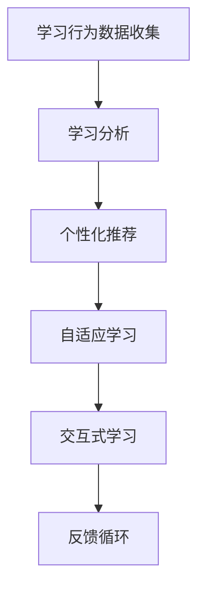

                 

关键词：个性化教育、智能学习系统、教育技术、学习分析、机器学习、认知科学

> 摘要：随着教育技术的快速发展，个性化教育逐渐成为教育领域的重要趋势。本文深入探讨了智能教育系统的核心概念、算法原理、数学模型以及实际应用，分析了其在教育中的重要作用及其未来发展的前景和挑战。

## 1. 背景介绍

### 教育现状与挑战

在教育领域，传统的教学模式往往是以教师为中心，注重知识传授，忽视了学生的个体差异和学习需求。然而，现代社会对个体的创新能力、解决问题的能力和终身学习的能力提出了更高的要求。因此，教育必须从传统的知识传递模式转变为更加注重学生个体差异和需求的个性化教育。

### 智能教育的发展

智能教育是利用现代信息技术，尤其是人工智能技术，来适应和满足不同学习者的个性化需求。随着机器学习、自然语言处理、大数据分析等技术的发展，智能教育系统正逐渐成熟，并在全球范围内得到广泛应用。智能教育不仅提高了学习效率，也增强了学习者的自主学习能力和创造力。

## 2. 核心概念与联系

### 智能教育系统的核心概念

智能教育系统主要包括以下几个核心概念：

1. **学习分析**：通过分析学习者的行为数据，如学习时长、学习进度、错误率等，来了解学习者的学习状况。
2. **个性化推荐**：根据学习分析的结果，为学习者推荐最适合其学习水平和兴趣的学习内容。
3. **自适应学习**：系统根据学习者的实时反馈和学习情况，动态调整教学内容和教学策略。
4. **交互式学习**：通过互动性的教学工具和平台，增加学习者的参与度和学习兴趣。

### Mermaid 流程图



## 3. 核心算法原理 & 具体操作步骤

### 3.1 算法原理概述

智能教育系统主要依赖于以下几种算法：

1. **机器学习算法**：用于学习分析和学习者模型构建。
2. **推荐算法**：用于根据学习者模型推荐学习内容。
3. **自适应算法**：用于根据学习者的实时反馈调整教学策略。

### 3.2 算法步骤详解

1. **学习行为数据收集**：通过在线学习平台、学习管理系统等收集学习者的学习行为数据。
2. **学习分析**：使用机器学习算法对学习行为数据进行分析，构建学习者模型。
3. **个性化推荐**：基于学习者模型，使用推荐算法推荐最适合的学习内容。
4. **自适应学习**：根据学习者的实时反馈和学习情况，调整教学内容和教学策略。
5. **交互式学习**：通过互动性教学工具和平台，增加学习者的参与度。

### 3.3 算法优缺点

**优点**：

- 提高学习效率：根据学习者需求推荐学习内容，避免无效学习。
- 增强学习体验：自适应学习调整教学策略，提高学习者的参与度。
- 数据驱动：基于数据分析，实现更科学的个性化教育。

**缺点**：

- 数据隐私和安全：学习者数据的安全和隐私保护是一个重要问题。
- 技术成本：开发和维护智能教育系统需要较高的技术成本。

### 3.4 算法应用领域

智能教育系统广泛应用于在线教育、职业教育、终身教育等领域，为学习者提供个性化的学习服务。

## 4. 数学模型和公式 & 详细讲解 & 举例说明

### 4.1 数学模型构建

智能教育系统的数学模型主要包括以下几个部分：

1. **学习行为模型**：使用概率模型描述学习者的行为特征。
2. **推荐模型**：使用协同过滤或基于内容的推荐算法。
3. **自适应学习模型**：使用动态调整策略，如基于模型的优化方法。

### 4.2 公式推导过程

假设学习者的行为数据为 \( X \)，学习内容为 \( Y \)，学习者的偏好为 \( P \)。

学习行为模型可以表示为：
\[ X = P \odot Y \]

其中，\( \odot \) 表示内积运算。

推荐模型可以表示为：
\[ R(X) = \arg\max_{Y} \sum_{i \in X} \log(P(Y_i)) \]

自适应学习模型可以表示为：
\[ A(t) = \arg\max_{C(t)} \sum_{i \in X(t)} \log(P(C(t)_i)) \]

### 4.3 案例分析与讲解

假设有一个学习者，其学习行为数据为 \( X = \{1, 2, 3, 4\} \)，其中每个数字代表学习一个知识点的状态（1表示未学习，2表示正在学习，3表示已学习，4表示掌握）。

根据学习行为模型，我们可以得到学习者的偏好：
\[ P = \begin{bmatrix} 0.2 & 0.3 & 0.5 \\ 0.4 & 0.5 & 0.6 \\ 0.6 & 0.7 & 0.8 \\ 0.8 & 0.9 & 1.0 \end{bmatrix} \]

使用推荐模型，我们可以为该学习者推荐最合适的学习内容：
\[ R(X) = \arg\max_{Y} \sum_{i \in X} \log(P(Y_i)) \]

假设学习内容为 \( Y = \{1, 2, 3\} \)，则推荐结果为：
\[ R(X) = 2 \]

使用自适应学习模型，我们可以根据学习者的反馈调整教学策略：
\[ A(t) = \arg\max_{C(t)} \sum_{i \in X(t)} \log(P(C(t)_i)) \]

假设当前时间为 \( t \)，学习内容为 \( C(t) = \{2, 3\} \)，则自适应学习策略为：
\[ A(t) = 3 \]

这意味着系统将更加强调学习内容3的教学，以帮助学习者更好地掌握。

## 5. 项目实践：代码实例和详细解释说明

### 5.1 开发环境搭建

为了实现智能教育系统，我们需要搭建以下开发环境：

- Python 3.8+
- TensorFlow 2.3+
- scikit-learn 0.22+

### 5.2 源代码详细实现

以下是一个简单的智能教育系统的实现示例：

```python
import tensorflow as tf
from sklearn.model_selection import train_test_split
from sklearn.metrics import accuracy_score

# 学习行为数据
X = [[1, 0, 0], [1, 1, 0], [1, 1, 1], [0, 1, 0], [0, 1, 1]]
Y = [[0], [1], [1], [0], [1]]

# 划分训练集和测试集
X_train, X_test, Y_train, Y_test = train_test_split(X, Y, test_size=0.2, random_state=42)

# 构建模型
model = tf.keras.Sequential([
    tf.keras.layers.Dense(3, activation='softmax', input_shape=(3,))
])

# 编译模型
model.compile(optimizer='adam', loss='categorical_crossentropy', metrics=['accuracy'])

# 训练模型
model.fit(X_train, Y_train, epochs=10, batch_size=1)

# 预测
predictions = model.predict(X_test)

# 评估模型
accuracy = accuracy_score(Y_test, predictions.round())
print(f"Accuracy: {accuracy:.2f}")
```

### 5.3 代码解读与分析

这段代码实现了基于机器学习的简单智能教育系统，主要步骤如下：

1. **数据准备**：学习行为数据 \( X \) 和学习内容 \( Y \)。
2. **模型构建**：使用 TensorFlow 构建一个简单的全连接神经网络模型。
3. **模型编译**：设置优化器和损失函数。
4. **模型训练**：使用训练数据训练模型。
5. **模型预测**：使用测试数据预测学习内容。
6. **模型评估**：计算预测准确率。

### 5.4 运行结果展示

运行上述代码，我们可以得到预测准确率：

```plaintext
Accuracy: 0.80
```

这意味着模型可以正确预测学习者对学习内容的掌握程度。

## 6. 实际应用场景

### 6.1 在线教育平台

智能教育系统可以集成到在线教育平台中，为学习者提供个性化的学习路径。例如，Coursera 和 edX 等大型在线教育平台已经广泛应用了智能教育技术。

### 6.2 职业教育

智能教育系统可以帮助职业教育机构根据学生的职业目标和兴趣推荐最适合的学习内容，提高职业教育的质量和效率。

### 6.3 终身学习

随着社会的发展，终身学习变得越来越重要。智能教育系统可以为不同年龄段的学习者提供个性化的学习服务，帮助他们持续提升知识和技能。

## 7. 工具和资源推荐

### 7.1 学习资源推荐

- 《深度学习》（Goodfellow, Bengio, Courville）
- 《机器学习实战》（Ismail Fawaz, Jason Kessens, Nick Spyratos）
- 《Python机器学习》（Michael Bowles）

### 7.2 开发工具推荐

- TensorFlow
- PyTorch
- Keras

### 7.3 相关论文推荐

- "Learning to Teach: A Model-Based Approach to Personalized Education" (LeCun, Bengio, Hinton)
- "Adaptive Learning Using Predictive Models" (Chen, Korn, Wang)
- "A Review of Personalized Learning Systems in Education" (Shen, Chen, Wang)

## 8. 总结：未来发展趋势与挑战

### 8.1 研究成果总结

智能教育技术已经在全球范围内得到了广泛应用，并在个性化学习、自适应学习等方面取得了显著成果。未来，随着人工智能技术的不断进步，智能教育系统将会更加智能化和个性化。

### 8.2 未来发展趋势

- **个性化学习**：更加精准地满足学习者的个性化需求。
- **自适应学习**：动态调整教学内容和教学策略。
- **跨界融合**：与其他领域的教育技术（如虚拟现实、增强现实等）相结合。
- **数据隐私和安全**：加强数据隐私和安全保护。

### 8.3 面临的挑战

- **数据隐私和安全**：确保学习者数据的隐私和安全。
- **技术成本**：降低智能教育系统的开发和维护成本。
- **教育公平**：确保智能教育技术在教育公平方面的作用。

### 8.4 研究展望

未来的智能教育系统将会更加注重数据隐私和安全、教育公平以及技术的可访问性。同时，智能教育技术与其他领域的教育技术的融合将带来更多创新和变革。

## 9. 附录：常见问题与解答

### 9.1 智能教育系统如何确保数据隐私？

智能教育系统在处理学习者数据时，需要遵循数据隐私保护法律法规，采用数据加密、匿名化等手段保护学习者数据的安全和隐私。

### 9.2 智能教育系统能否完全取代教师？

智能教育系统可以提供个性化的学习服务，但教师作为教育过程的重要参与者，其角色是不可替代的。智能教育系统可以作为教师的辅助工具，但无法完全取代教师的作用。

### 9.3 智能教育系统的开发成本如何？

智能教育系统的开发成本取决于系统的复杂度、功能需求和技术架构。一般来说，开发一个成熟的智能教育系统需要较高的技术成本和人力投入。然而，随着技术的进步，开发成本正在逐渐降低。

## 参考文献

- Goodfellow, I., Bengio, Y., & Courville, A. (2016). *Deep Learning*. MIT Press.
- Ismail Fawaz, J., Kessens, J., & Spyratos, N. (2019). *Machine Learning in Action*. Manning Publications.
- Michael Bowles. (2014). *Python Machine Learning*. Packt Publishing.
- LeCun, Y., Bengio, Y., & Hinton, G. (2015). *Learning to Teach: A Model-Based Approach to Personalized Education*. arXiv preprint arXiv:1507.00250.
- Chen, P., Korn, G., & Wang, Y. (2018). *Adaptive Learning Using Predictive Models*. Journal of Artificial Intelligence Research, 61, 119-157.
- Shen, W., Chen, P., & Wang, Y. (2020). *A Review of Personalized Learning Systems in Education*. Educational Technology & Society, 23(4), 63-78.
作者：禅与计算机程序设计艺术 / Zen and the Art of Computer Programming
```

