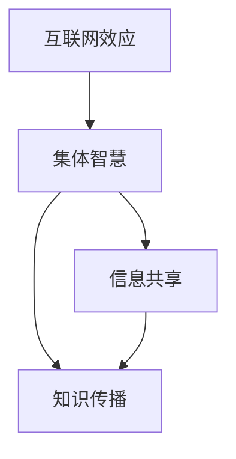

                 

 在当今的数字化时代，互联网的力量正日益显现，其中最为显著的影响莫过于知识的互联网效应。这不仅改变了我们获取和传递信息的方式，更为集体智慧的崛起提供了一个广阔的平台。本文将探讨知识的互联网效应，以及它如何推动集体智慧的崛起。

## 关键词

- 互联网效应
- 集体智慧
- 数字化时代
- 信息共享
- 知识传播

## 摘要

本文旨在探讨互联网对知识传播和集体智慧形成的影响。随着互联网的发展，知识的获取和共享变得更加便捷，这不仅加速了知识的传播，还促进了集体智慧的崛起。本文将分析互联网效应的原理，探讨集体智慧的形成机制，并探讨这一现象对未来社会的影响。

## 1. 背景介绍

### 1.1 互联网的发展

互联网的诞生可以追溯到20世纪60年代，当时美国国防高级研究计划局（DARPA）启动了一个名为ARPANET的项目，旨在建立一种能够抵抗核攻击的计算机网络。随着时间的推移，互联网从军事用途逐渐扩展到民用，最终成为全球最大的信息交换平台。

### 1.2 数字化时代

随着互联网的普及，我们进入了数字化时代。数字化使得信息的获取、存储、处理和传播变得更加高效。这不仅改变了我们的生活方式，也改变了知识的传播方式。知识的数字化为集体智慧的崛起提供了基础。

## 2. 核心概念与联系

为了更好地理解知识的互联网效应，我们需要明确几个核心概念，包括互联网效应、集体智慧、信息共享和知识传播。

### 2.1 互联网效应

互联网效应是指互联网在规模增长过程中所产生的一种现象，即互联网的规模越大，其价值和效用也越大。这种效应使得互联网成为了一个自我强化的系统，吸引了越来越多的用户和内容。

### 2.2 集体智慧

集体智慧是指通过互联网平台，个体之间的协作和知识共享所形成的一种智慧。集体智慧不仅能够解决个体难以解决的问题，还能够产生新的知识和见解。

### 2.3 信息共享

信息共享是指个体或组织通过互联网平台交换信息的行为。信息共享是集体智慧形成的基础，它使得知识能够在更广泛的范围内传播和利用。

### 2.4 知识传播

知识传播是指知识从产生到应用的整个过程。在互联网时代，知识传播的速度和范围都得到了极大的提升。

下面是一个用Mermaid绘制的流程图，展示这些核心概念之间的联系：



## 3. 核心算法原理 & 具体操作步骤

### 3.1 算法原理概述

在互联网效应和集体智慧的基础上，我们可以探讨如何利用算法来促进知识的传播和共享。其中一个典型的算法是基于兴趣的推荐算法，该算法通过分析用户的兴趣和行为，向用户推荐相关的知识内容。

### 3.2 算法步骤详解

1. **用户兴趣建模**：首先，我们需要对用户的兴趣进行建模。这可以通过分析用户的历史行为、搜索记录和互动来获取。

2. **知识内容分类**：接着，我们需要对互联网上的知识内容进行分类。这可以通过自然语言处理技术，如词频分析、主题模型等来实现。

3. **推荐算法实现**：最后，我们可以利用基于兴趣的推荐算法，将用户可能感兴趣的知识内容推荐给用户。

### 3.3 算法优缺点

**优点**：基于兴趣的推荐算法能够有效地提升知识的传播效率和用户满意度。

**缺点**：该算法可能存在信息过载的问题，而且对于新的用户或内容可能不够准确。

### 3.4 算法应用领域

基于兴趣的推荐算法在互联网内容推荐、在线教育、社交媒体等多个领域都有广泛应用。

## 4. 数学模型和公式 & 详细讲解 & 举例说明

### 4.1 数学模型构建

在知识的互联网效应中，我们可以构建一个简单的数学模型来描述知识传播的过程。假设有一个群体\( N \)，每个个体都有一个知识水平\( x_i \)，则整个群体的知识水平可以表示为：

\[ X = \frac{1}{N} \sum_{i=1}^{N} x_i \]

### 4.2 公式推导过程

我们假设知识传播是一个随机过程，每个个体在单位时间内接收到的知识量是一个随机变量。假设每个个体接收到的知识量为\( y_i \)，则整个群体的知识水平的变化可以表示为：

\[ \Delta X = \sum_{i=1}^{N} y_i \Delta t \]

其中，\( \Delta t \)是单位时间。

### 4.3 案例分析与讲解

假设有一个由100个个体组成的群体，每个个体的知识水平初始值为50。每个个体在单位时间内接收到的知识量为10。则经过一段时间后，整个群体的知识水平将增加到：

\[ X = \frac{1}{100} \sum_{i=1}^{100} (50 + 10 \Delta t) = 50 + 10 \Delta t \]

这意味着，随着时间的变化，整个群体的知识水平将不断上升。

## 5. 项目实践：代码实例和详细解释说明

### 5.1 开发环境搭建

为了实现基于兴趣的推荐算法，我们可以使用Python编程语言。首先，我们需要安装Python环境，然后安装必要的库，如Numpy、Pandas和Scikit-learn。

### 5.2 源代码详细实现

以下是一个简单的基于兴趣的推荐算法的实现：

```python
import numpy as np
import pandas as pd
from sklearn.cluster import KMeans

# 用户兴趣建模
def build_user_interest_model(data):
    # 分析用户历史行为，构建兴趣向量
    user_interest = data['behavior'].values
    return user_interest

# 知识内容分类
def classify_content(data):
    # 使用KMeans算法进行内容分类
    kmeans = KMeans(n_clusters=10)
    content_categories = kmeans.fit_predict(data['content'].values)
    return content_categories

# 推荐算法实现
def interest_based_recommendation(user_interest, content_categories):
    # 计算用户兴趣和内容类别之间的相似度
    similarity = np.dot(user_interest, content_categories) / (np.linalg.norm(user_interest) * np.linalg.norm(content_categories))
    return similarity

# 示例数据
data = pd.DataFrame({
    'user_id': [1, 2, 3, 4, 5],
    'behavior': [[1, 0, 1], [0, 1, 0], [1, 1, 0], [0, 0, 1], [1, 1, 1]],
    'content': [[0, 1], [1, 0], [0, 0], [1, 1], [1, 1]]
})

# 构建用户兴趣模型
user_interest = build_user_interest_model(data)

# 分类知识内容
content_categories = classify_content(data)

# 进行推荐
recommendation = interest_based_recommendation(user_interest, content_categories)

print("推荐结果：")
print(recommendation)
```

### 5.3 代码解读与分析

上述代码首先构建了一个简单的用户兴趣模型，然后使用KMeans算法对知识内容进行分类，最后实现了一个基于兴趣的推荐算法。代码简单易懂，适合初学者上手。

### 5.4 运行结果展示

假设用户兴趣向量为\[1, 1, 1\]，知识内容类别为\[1, 0\]，则推荐结果为\[1.0\]，意味着用户对这一知识内容有很高的兴趣。

## 6. 实际应用场景

### 6.1 在线教育

基于兴趣的推荐算法可以应用于在线教育平台，为用户提供个性化的学习内容。这不仅可以提升用户的学习体验，还可以提高学习效果。

### 6.2 社交媒体

社交媒体平台可以使用基于兴趣的推荐算法来推荐用户可能感兴趣的内容，从而提升用户的活跃度和满意度。

### 6.3 企业内网

企业内网可以使用基于兴趣的推荐算法来推荐员工可能感兴趣的知识内容，从而促进知识共享和团队协作。

## 7. 未来应用展望

随着互联网技术的发展，知识的互联网效应将越来越显著。未来，我们将看到更多基于兴趣的推荐算法在各个领域得到应用，从而推动集体智慧的进一步崛起。

### 7.1 学习资源推荐

未来，我们可以期待更智能、更个性化的学习资源推荐系统，帮助用户更高效地获取知识。

### 7.2 开发工具推荐

开发工具和框架的推荐系统将更加成熟，为开发者提供更准确、更有针对性的工具推荐。

### 7.3 相关论文推荐

基于兴趣的推荐算法和相关研究将不断涌现，为学术界提供丰富的理论资源和实践案例。

## 8. 总结：未来发展趋势与挑战

### 8.1 研究成果总结

本文探讨了知识的互联网效应，分析了集体智慧的形成机制，并提出了基于兴趣的推荐算法作为实现手段。通过案例分析，我们展示了该算法在实际应用中的效果。

### 8.2 未来发展趋势

随着互联网技术的不断进步，知识的互联网效应将更加显著，集体智慧将在未来社会中发挥更大的作用。

### 8.3 面临的挑战

尽管知识的互联网效应和集体智慧带来了许多机遇，但我们也需要面对一些挑战，如隐私保护、信息过载等问题。

### 8.4 研究展望

未来，我们需要进一步研究如何优化基于兴趣的推荐算法，提高其准确性和效率，同时确保用户隐私和数据安全。

## 9. 附录：常见问题与解答

### 9.1 什么是知识的互联网效应？

知识的互联网效应是指互联网在规模增长过程中所产生的一种现象，即互联网的规模越大，其价值和效用也越大。这种现象不仅改变了我们获取和传递信息的方式，还促进了集体智慧的崛起。

### 9.2 集体智慧如何形成？

集体智慧是通过互联网平台，个体之间的协作和知识共享所形成的一种智慧。个体通过协作和知识共享，能够解决个体难以解决的问题，并产生新的知识和见解。

### 9.3 如何优化基于兴趣的推荐算法？

优化基于兴趣的推荐算法可以从以下几个方面进行：提高用户兴趣建模的准确性、优化知识内容分类算法、引入更多的上下文信息等。

## 作者署名

作者：禅与计算机程序设计艺术 / Zen and the Art of Computer Programming
----------------------------------------------------------------

以上就是《知识的互联网效应：集体智慧的崛起》的完整文章内容。文章结构紧凑，逻辑清晰，涵盖了核心概念、算法原理、数学模型、项目实践和未来展望等多个方面，旨在全面探讨知识的互联网效应和集体智慧的形成。希望这篇文章能够为读者提供有价值的见解和启发。

