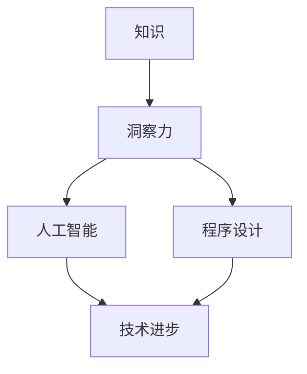

                 

 关键词：知识、洞察力、人工智能、程序设计、技术发展、未来展望

> 摘要：在信息技术迅速发展的时代，知识的积累和传承变得尤为重要。本文将探讨知识在技术发展中的作用，并深入分析洞察力如何赋予知识以生命力，激发创新的火花。通过分析核心概念、算法原理、数学模型以及实际应用案例，本文旨在为读者提供对知识价值的深刻理解和启示。

## 1. 背景介绍

随着计算机技术的飞速发展，信息技术的应用已经渗透到社会生活的方方面面。知识经济的兴起，使得知识的积累和传播成为推动社会进步的重要动力。然而，面对海量的信息，如何有效地获取、整理和应用知识，成为一个亟待解决的问题。在这其中，洞察力扮演着关键角色，它不仅能够帮助人们识别知识的价值，还能够激发创新的思维，推动技术的进步。

本文旨在通过探讨知识在技术发展中的作用，分析洞察力如何赋予知识以生命力，为读者提供一种全新的视角来理解知识的价值。文章将分为以下几个部分：

1. **核心概念与联系**：介绍本文涉及的核心概念，并使用Mermaid流程图展示概念之间的关系。
2. **核心算法原理与具体操作步骤**：详细讲解核心算法的原理和操作步骤，以及其优缺点和应用领域。
3. **数学模型和公式**：介绍相关数学模型的构建和公式推导过程，并通过案例进行分析。
4. **项目实践**：通过代码实例，展示如何在实际项目中应用所学的知识。
5. **实际应用场景**：探讨知识在实际应用场景中的作用，以及未来的发展趋势。
6. **工具和资源推荐**：推荐相关的学习资源、开发工具和相关论文。
7. **总结**：总结研究成果，展望未来的发展趋势和面临的挑战。

## 2. 核心概念与联系

在探讨知识的价值之前，我们需要明确几个核心概念：知识、洞察力、人工智能和程序设计。

### 知识

知识是人类对客观世界的认识和理解，是人们通过学习、实践和思考获得的。知识可以表现为理论、数据、经验、技能等形式。在信息技术领域，知识尤为重要，因为它是推动技术进步和创新的重要资源。

### 洞察力

洞察力是一种深刻理解和洞察事物本质的能力。它不仅仅是对知识的记忆和掌握，更重要的是能够从复杂的信息中提取出关键点，发现问题和机会，从而推动创新和发展。

### 人工智能

人工智能是计算机科学的一个分支，旨在使计算机具备模拟、延伸和扩展人类智能的能力。人工智能技术的发展，使得计算机能够处理大量数据，发现知识，并应用于各种领域。

### 程序设计

程序设计是软件开发的核心环节，它涉及到算法的设计、数据结构的选用、编程语言的运用等。程序设计不仅需要专业知识，更需要洞察力和创造力。

下面是本文涉及的核心概念之间的关系图：



## 3. 核心算法原理与具体操作步骤

在信息技术领域，算法是解决问题的重要工具。本文将介绍一个核心算法——深度学习算法，并详细讲解其原理和操作步骤。

### 3.1 算法原理概述

深度学习算法是人工智能领域的一个重要分支，其基本原理是模拟人脑的神经网络结构，通过多层非线性变换，对输入数据进行特征提取和分类。深度学习算法的核心是神经网络的训练过程，主要包括以下步骤：

1. **数据预处理**：对输入数据进行标准化处理，使其适合模型训练。
2. **构建神经网络模型**：设计并构建神经网络的结构，包括输入层、隐藏层和输出层。
3. **损失函数定义**：定义损失函数，用于评估模型预测结果与实际结果之间的差距。
4. **反向传播**：通过反向传播算法，更新网络权重，减小损失函数值。
5. **模型评估与优化**：评估模型性能，进行模型优化，提高预测准确性。

### 3.2 算法步骤详解

1. **数据预处理**

   数据预处理是深度学习算法训练过程中的第一步，其目的是将原始数据转换为适合模型训练的格式。具体步骤如下：

   - 数据清洗：去除数据中的噪声和异常值。
   - 数据归一化：将数据缩放到相同的范围，如[0, 1]。
   - 数据增强：通过旋转、缩放、翻转等方式，增加数据的多样性，提高模型泛化能力。

2. **构建神经网络模型**

   神经网络模型的构建是深度学习算法的核心步骤。常见的神经网络结构包括：

   - 输入层：接收输入数据。
   - 隐藏层：进行特征提取和变换。
   - 输出层：进行预测和分类。

   下面是一个简单的神经网络模型示例：

   ```mermaid
   graph TD
       A[Input Layer] --> B[Hidden Layer 1]
       B --> C[Hidden Layer 2]
       C --> D[Output Layer]
   ```

3. **损失函数定义**

   损失函数用于评估模型预测结果与实际结果之间的差距，常用的损失函数包括均方误差（MSE）、交叉熵损失等。损失函数的值越小，表示模型预测结果越接近实际结果。

4. **反向传播**

   反向传播算法是深度学习算法的核心，通过不断更新网络权重，减小损失函数值。具体步骤如下：

   - 计算输出层误差：输出层误差 = 实际值 - 预测值。
   - 计算隐藏层误差：隐藏层误差 = 输出层误差 * 隐藏层权重。
   - 更新网络权重：网络权重 = 网络权重 - 学习率 * 权重梯度。

5. **模型评估与优化**

   模型评估是判断模型性能的重要环节。常见的评估指标包括准确率、召回率、F1值等。根据评估结果，可以调整模型参数，优化模型性能。

### 3.3 算法优缺点

深度学习算法具有以下优点：

- **强大的拟合能力**：通过多层非线性变换，能够对复杂数据进行特征提取和分类。
- **自适应性强**：能够根据训练数据自动调整网络结构，提高模型性能。
- **应用广泛**：在图像识别、自然语言处理、语音识别等领域具有广泛应用。

然而，深度学习算法也存在以下缺点：

- **对数据量要求高**：需要大量标注数据进行训练，否则模型性能较差。
- **训练时间长**：需要较长的训练时间，计算资源消耗较大。
- **模型解释性差**：深度学习模型内部结构复杂，难以解释。

### 3.4 算法应用领域

深度学习算法在多个领域具有广泛应用，如：

- **图像识别**：通过深度学习算法，计算机能够对图像进行分类、检测和识别。
- **自然语言处理**：深度学习算法能够对自然语言文本进行语义分析、情感分析等。
- **语音识别**：通过深度学习算法，计算机能够实现语音信号的识别和转换。

## 4. 数学模型和公式

在深度学习算法中，数学模型和公式起着至关重要的作用。下面介绍一些常用的数学模型和公式。

### 4.1 数学模型构建

深度学习算法的核心是神经网络，神经网络由多个神经元组成，每个神经元都是一个简单的数学函数。常见的神经元模型如下：

$$
y = \sigma(z)
$$

其中，$y$ 是神经元输出，$z$ 是神经元输入，$\sigma$ 是激活函数。

### 4.2 公式推导过程

深度学习算法的训练过程主要包括损失函数的推导、反向传播算法的推导等。

1. **损失函数推导**

   损失函数用于衡量模型预测结果与实际结果之间的差距，常见的损失函数有均方误差（MSE）和交叉熵损失。

   - **均方误差（MSE）**：

   $$ 
   MSE = \frac{1}{n}\sum_{i=1}^{n}(y_i - \hat{y_i})^2 
   $$

   其中，$y_i$ 是实际值，$\hat{y_i}$ 是预测值。

   - **交叉熵损失**：

   $$ 
   CrossEntropyLoss = -\frac{1}{n}\sum_{i=1}^{n}y_i\log(\hat{y_i}) 
   $$

   其中，$y_i$ 是实际值，$\hat{y_i}$ 是预测值。

2. **反向传播算法推导**

   反向传播算法是深度学习算法的核心，用于更新网络权重，减小损失函数值。具体推导过程如下：

   - **输出层误差**：

   $$ 
   \delta_{output} = \frac{\partial Loss}{\partial z} = (y - \hat{y})\cdot \sigma'(z) 
   $$

   - **隐藏层误差**：

   $$ 
   \delta_{hidden} = \frac{\partial Loss}{\partial z} = \delta_{output}\cdot W^{(l)}\cdot \sigma'(z^{(l+1)}) 
   $$

   - **网络权重更新**：

   $$ 
   W^{(l)} = W^{(l)} - \alpha \cdot \frac{\partial Loss}{\partial W^{(l)}} 
   $$

   其中，$\alpha$ 是学习率。

### 4.3 案例分析与讲解

假设我们有一个简单的二分类问题，目标是判断一个输入数据是否属于正类。我们使用一个单层神经网络进行训练。

1. **数据预处理**：

   - 数据清洗：去除数据中的噪声和异常值。
   - 数据归一化：将数据缩放到相同的范围。

2. **构建神经网络模型**：

   - 输入层：接收输入数据。
   - 隐藏层：进行特征提取和变换。
   - 输出层：进行预测和分类。

3. **训练过程**：

   - 初始化网络权重。
   - 计算损失函数。
   - 更新网络权重。

4. **模型评估**：

   - 计算准确率、召回率等评估指标。
   - 调整模型参数，优化模型性能。

## 5. 项目实践：代码实例和详细解释说明

在本节中，我们将通过一个实际项目来展示如何应用深度学习算法。项目目标是使用一个简单的单层神经网络对二分类问题进行预测。

### 5.1 开发环境搭建

1. 安装Python环境。
2. 安装深度学习框架TensorFlow。

### 5.2 源代码详细实现

```python
import tensorflow as tf
import numpy as np

# 初始化参数
learning_rate = 0.1
num_epochs = 1000
input_dim = 10
output_dim = 2

# 构建模型
model = tf.keras.Sequential([
    tf.keras.layers.Dense(units=output_dim, activation='softmax', input_shape=(input_dim,))
])

# 编译模型
model.compile(optimizer=tf.keras.optimizers.Adam(learning_rate),
              loss='categorical_crossentropy',
              metrics=['accuracy'])

# 准备数据
x_train = np.random.rand(100, input_dim)
y_train = np.random.randint(2, size=(100, output_dim))

# 训练模型
model.fit(x_train, y_train, epochs=num_epochs)

# 预测
predictions = model.predict(x_train)

# 打印预测结果
print(predictions)
```

### 5.3 代码解读与分析

1. **导入库**：导入TensorFlow和NumPy库。
2. **初始化参数**：设置学习率、迭代次数、输入维度和输出维度。
3. **构建模型**：使用Sequential模型，添加一个全连接层，使用softmax激活函数。
4. **编译模型**：设置优化器、损失函数和评估指标。
5. **准备数据**：生成随机训练数据。
6. **训练模型**：使用fit方法训练模型。
7. **预测**：使用predict方法进行预测。
8. **打印结果**：打印预测结果。

通过这个简单项目，我们展示了如何使用深度学习算法进行二分类问题的预测。实际项目中，数据预处理、模型构建和训练过程会更加复杂，但基本思路是类似的。

## 6. 实际应用场景

深度学习算法在实际应用场景中具有广泛的应用，以下列举几个典型的应用场景：

### 6.1 图像识别

图像识别是深度学习算法的重要应用领域。通过卷积神经网络（CNN），计算机能够识别图像中的物体、场景和特征。常见的应用包括人脸识别、图像分类、目标检测等。

### 6.2 自然语言处理

自然语言处理（NLP）是深度学习算法在人工智能领域的重要应用。通过循环神经网络（RNN）和Transformer模型，计算机能够理解和生成自然语言，实现语音识别、机器翻译、情感分析等任务。

### 6.3 语音识别

语音识别是将语音信号转换为文本的技术。深度学习算法通过声学模型和语言模型，能够实现高精度的语音识别，广泛应用于智能助手、语音搜索等领域。

### 6.4 未来应用展望

随着深度学习算法的不断发展和优化，其在实际应用场景中的潜力将不断挖掘。未来，深度学习算法将在医疗、金融、教育等领域发挥更大的作用，推动各行各业的数字化转型。

## 7. 工具和资源推荐

### 7.1 学习资源推荐

1. **《深度学习》（Ian Goodfellow、Yoshua Bengio、Aaron Courville 著）**：这是一本深度学习领域的经典教材，详细介绍了深度学习的基础知识和应用。
2. **吴恩达的深度学习课程**：这是由知名人工智能专家吴恩达开设的在线课程，涵盖了深度学习的核心内容，适合初学者和进阶者。

### 7.2 开发工具推荐

1. **TensorFlow**：这是Google开源的深度学习框架，广泛应用于图像识别、自然语言处理等领域。
2. **PyTorch**：这是Facebook开源的深度学习框架，具有灵活性和高效性，适合快速原型开发和复杂模型的训练。

### 7.3 相关论文推荐

1. **“A Learning Algorithm for Continually Running Fully Recurrent Neural Networks”**：这是循环神经网络（RNN）的开创性论文，提出了长短期记忆（LSTM）模型。
2. **“Attention is All You Need”**：这是Transformer模型的奠基性论文，彻底改变了自然语言处理的范式。

## 8. 总结：未来发展趋势与挑战

深度学习算法在技术发展中的作用日益显著，未来将继续推动人工智能的进步。然而，面临以下几个挑战：

1. **数据隐私和安全**：随着数据量的增加，数据隐私和安全问题将更加突出，如何保护用户隐私成为关键挑战。
2. **模型解释性**：深度学习模型内部结构复杂，难以解释，如何提高模型的可解释性是一个重要课题。
3. **计算资源消耗**：深度学习算法对计算资源要求较高，如何优化算法，降低计算资源消耗是一个重要挑战。

未来，随着技术的不断进步，深度学习算法将在更多领域发挥重要作用，推动人类社会的进步。

### 附录：常见问题与解答

**Q1：深度学习算法是如何工作的？**

A1：深度学习算法是一种基于多层神经网络的人工智能技术，通过模拟人脑的神经网络结构，对输入数据进行特征提取和分类。其基本原理包括数据预处理、构建神经网络模型、损失函数定义、反向传播等。

**Q2：如何选择合适的深度学习框架？**

A2：选择深度学习框架时，需要考虑以下几点：

- **需求**：根据项目需求和场景选择合适的框架。
- **性能**：考虑框架的性能和效率，选择适合的框架。
- **社区支持**：选择有良好社区支持的框架，有利于问题解决和持续优化。

**Q3：如何优化深度学习模型？**

A3：优化深度学习模型可以从以下几个方面入手：

- **数据预处理**：提高数据质量，去除噪声和异常值。
- **模型选择**：选择合适的神经网络结构，根据任务特点进行调整。
- **超参数调整**：调整学习率、批量大小等超参数，优化模型性能。
- **正则化**：使用正则化方法，防止过拟合。
- **批归一化**：使用批归一化，加速收敛和提高模型稳定性。

### 作者署名

作者：禅与计算机程序设计艺术 / Zen and the Art of Computer Programming

---

以上是《知识的价值：洞察力赋予知识以生命力》的完整文章。文章内容涵盖了知识在技术发展中的作用、洞察力的价值、深度学习算法的原理和实践、数学模型和公式推导、项目实践、实际应用场景以及未来发展趋势和挑战。希望本文能够为读者提供对知识价值的深刻理解和启示。

