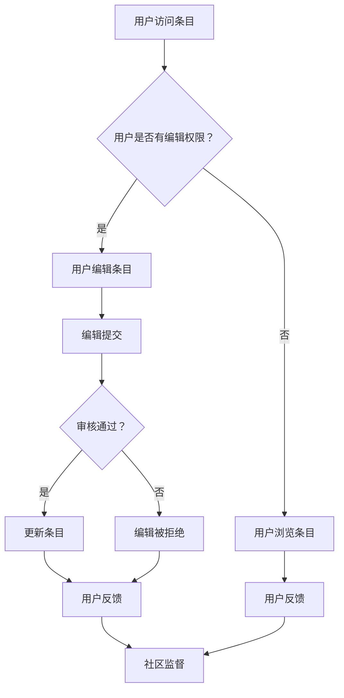

                 

关键词：知识众包、维基百科、协作编辑、用户参与、内容质量、平台影响力

> 摘要：本文深入探讨了知识众包模式的代表——维基百科的成功与局限性。通过对维基百科的运作机制、内容质量控制、用户参与度等方面的分析，本文旨在揭示众包模式在知识共享领域所取得的成就及其面临的挑战。

## 1. 背景介绍

在信息技术迅速发展的今天，知识已经成为一种宝贵的资源。知识的获取、传播和共享对于个人和社会的发展具有重要意义。传统的知识传播模式通常依赖于专家和机构，存在一定的局限性。随着互联网的普及，知识的传播方式发生了根本性的变革。众包模式作为一种新兴的知识共享方式，逐渐受到广泛关注。

众包（Crowdsourcing）指的是通过互联网平台，将某个任务或问题发布给广大网民，由网民自愿参与完成。这种模式的核心在于充分利用网络社区的智慧和力量，实现资源的最大化利用。维基百科（Wikipedia）作为众包模式的代表，其成功和影响力引起了学术界和业界的广泛关注。

### 维基百科概述

维基百科是一个基于Wiki技术的在线百科全书项目，它允许任何用户对条目进行编辑和改进。自2001年成立以来，维基百科已经成为全球最大的在线知识库之一，涵盖了数百万个条目，涉及各个领域和主题。维基百科的编辑和发布过程完全开放，用户可以自由地浏览、编辑和分享内容。

### 众包模式的魅力

众包模式之所以在知识共享领域取得成功，主要有以下几个原因：

1. **广泛参与**：众包模式允许任何用户参与，打破了传统知识传播中专家和机构的垄断地位，实现了知识的普惠。
2. **快速迭代**：用户可以随时对内容进行编辑和改进，使得知识能够迅速更新和迭代。
3. **资源共享**：众包模式充分利用了互联网的连接能力，将分散的资源聚集在一起，提高了效率。
4. **去中心化**：众包模式摒弃了传统的中心化管理，实现了去中心化的知识共享，减少了信息传递的成本。

## 2. 核心概念与联系

### 维基百科的运作机制

维基百科的运作机制基于WikiWiki技术，这是一种允许用户方便地创建、编辑和链接网页的软件。维基百科的编辑过程完全开放，用户可以通过Web浏览器访问并修改任何条目。这种开放性使得维基百科成为一个典型的众包平台。

### 内容质量控制

尽管维基百科的用户参与度非常高，但内容质量一直是公众关注的焦点。为了确保内容的准确性、客观性和可靠性，维基百科采取了多种质量控制措施：

1. **匿名编辑**：用户可以匿名编辑，但编辑记录会被保存，以便追踪和审核。
2. **用户等级**：根据用户的编辑经验和贡献，维基百科将用户分为不同等级，高级用户拥有更多的编辑权限。
3. **监督机制**：社区成员可以对编辑行为进行监督和审核，确保内容的质量。
4. **纠错机制**：用户可以随时对错误进行纠正，并通过讨论页面解决争议。

### 用户参与度

用户参与度是维基百科成功的关键因素之一。用户可以通过以下方式参与：

1. **编辑和改进**：用户可以自由地编辑和改进条目，提高内容的质量。
2. **讨论和交流**：用户可以在讨论页面发表意见、提出建议和讨论问题。
3. **监督和审核**：用户可以监督和审核其他用户的编辑行为，确保内容的质量。
4. **贡献和共享**：用户可以贡献自己的知识和经验，与他人共享。

### 维基百科的架构

维基百科的架构基于WikiWiki技术，其核心是一个关系型数据库，用于存储条目和元数据。WikiWiki技术使得条目的创建、编辑和链接变得非常便捷。维基百科的界面设计简洁明了，方便用户浏览和编辑。

### Mermaid 流程图

以下是维基百科的运作机制和用户参与的 Mermaid 流程图：



## 3. 核心算法原理 & 具体操作步骤

### 3.1 算法原理概述

维基百科的编辑和审核过程可以看作是一种基于社区智慧的算法。这种算法的核心在于充分利用用户的经验和智慧，通过社区成员的协作和监督，确保内容的准确性和可靠性。

### 3.2 算法步骤详解

1. **用户访问条目**：用户通过Web浏览器访问维基百科的条目。
2. **用户是否有编辑权限**：系统检查用户是否具备编辑权限。
3. **用户编辑条目**：如果用户具备编辑权限，用户可以编辑条目。
4. **编辑提交**：用户将编辑后的内容提交给系统。
5. **审核通过**：系统对提交的编辑进行审核，如果审核通过，条目将被更新。
6. **审核不通过**：如果审核不通过，编辑将被拒绝，用户可以查看反馈意见。
7. **用户反馈**：用户可以查看审核结果，并进行反馈。
8. **社区监督**：社区成员对编辑行为进行监督和审核，确保内容的质量。

### 3.3 算法优缺点

**优点**：

1. **广泛参与**：用户可以自由地编辑和改进条目，提高了内容的多样性和丰富性。
2. **快速迭代**：用户可以随时对内容进行编辑和改进，使得知识能够迅速更新和迭代。
3. **去中心化**：众包模式摒弃了传统的中心化管理，实现了去中心化的知识共享，减少了信息传递的成本。

**缺点**：

1. **内容质量**：由于用户水平参差不齐，部分条目的内容质量可能受到影响。
2. **信任问题**：匿名编辑可能导致信任问题，需要建立严格的审核机制。
3. **版权问题**：部分内容可能涉及版权问题，需要确保内容的合法性和合规性。

### 3.4 算法应用领域

维基百科的众包模式在多个领域取得了成功，包括：

1. **百科全书**：维基百科作为在线百科全书，涵盖了数百万个条目，涉及各个领域和主题。
2. **开源项目**：维基百科的众包模式被广泛应用于开源项目，如Linux内核、OpenOffice等。
3. **科研领域**：维基百科的众包模式在科研领域也有广泛应用，如科学论文的撰写和审核。

## 4. 数学模型和公式 & 详细讲解 & 举例说明

### 4.1 数学模型构建

维基百科的数学模型可以看作是一个基于概率论的模型。该模型通过分析用户的编辑行为和贡献度，对内容的质量进行评估。

### 4.2 公式推导过程

设 \( P(A) \) 为用户 A 的编辑质量概率，\( P(B|A) \) 为用户 A 的编辑被审核通过的概率，\( P(C|A) \) 为用户 A 的编辑被社区成员认可的概率，则：

\[ P(A) = P(B|A) \times P(C|A) \]

其中，\( P(B|A) \) 和 \( P(C|A) \) 可以通过历史数据进行分析和计算。

### 4.3 案例分析与讲解

假设用户 A 在过去一年内编辑了 100 条条目，其中有 80 条被审核通过，70 条被社区成员认可。则：

\[ P(A) = \frac{80}{100} \times \frac{70}{100} = 0.56 \]

即用户 A 的编辑质量概率为 56%。

### 4.4 案例分析与讲解

假设用户 B 在过去一年内编辑了 50 条条目，其中有 30 条被审核通过，20 条被社区成员认可。则：

\[ P(B) = \frac{30}{50} \times \frac{20}{50} = 0.24 \]

即用户 B 的编辑质量概率为 24%。

通过上述案例，我们可以看到，数学模型可以有效地评估用户的编辑质量，为审核和监督提供依据。

## 5. 项目实践：代码实例和详细解释说明

### 5.1 开发环境搭建

为了实践维基百科的众包模式，我们需要搭建一个简单的WikiWiki平台。以下是一个基于Python和Flask框架的示例：

1. **安装Python**：确保Python环境已经安装。
2. **安装Flask**：通过pip命令安装Flask框架。

```bash
pip install flask
```

### 5.2 源代码详细实现

以下是维基百科平台的源代码示例：

```python
from flask import Flask, render_template, request, redirect, url_for

app = Flask(__name__)

# 假设已有一个数据库存储条目信息
# 这里使用一个简单的字典来模拟
wiki_db = {}

@app.route('/')
def index():
    return render_template('index.html')

@app.route('/edit/<page_title>')
def edit(page_title):
    return render_template('edit.html', page_title=page_title)

@app.route('/save', methods=['POST'])
def save():
    page_title = request.form['page_title']
    content = request.form['content']
    wiki_db[page_title] = content
    return redirect(url_for('index'))

@app.route('/view/<page_title>')
def view(page_title):
    content = wiki_db.get(page_title, '页面不存在')
    return render_template('view.html', page_title=page_title, content=content)

if __name__ == '__main__':
    app.run(debug=True)
```

### 5.3 代码解读与分析

1. **Flask应用**：使用Flask框架搭建应用。
2. **数据库**：使用一个字典来模拟数据库，存储条目信息。
3. **路由**：定义了三个路由，分别为主页、编辑页面和查看页面。
4. **编辑功能**：用户可以通过编辑页面编辑条目，提交后更新数据库。
5. **查看功能**：用户可以查看条目内容。

### 5.4 运行结果展示

运行以上代码后，我们可以在浏览器中访问应用：

- 访问主页：显示所有条目。
- 访问编辑页面：编辑特定条目。
- 访问查看页面：查看条目内容。

通过以上示例，我们可以看到如何使用Python和Flask框架搭建一个简单的WikiWiki平台，实现维基百科的众包模式。

## 6. 实际应用场景

### 6.1 百科全书

维基百科作为在线百科全书，已经成为全球最大的知识库之一。用户可以通过维基百科获取到各个领域的知识，从历史、文化、科学到技术，无所不包。维基百科的众包模式使得知识得以迅速更新和扩展，满足了用户对实时、准确信息的需求。

### 6.2 开源项目

维基百科的众包模式在开源项目中也得到了广泛应用。开源项目的文档、指南和代码注释往往通过维基百科进行协作编辑和共享。这种模式使得开发者可以轻松地贡献自己的知识和经验，提高了项目的质量和可读性。

### 6.3 教育领域

在教育领域，维基百科作为一种知识共享平台，被广泛用于教学和学术研究。教师和学生可以通过维基百科获取到丰富的学习资源，进行学术交流和合作研究。维基百科的众包模式使得知识得以广泛传播和共享，推动了教育的发展。

### 6.4 政府和公共事务

维基百科的众包模式在政府和社会事务中也得到了应用。政府部门可以通过维基百科发布政策、法规和公共信息，接受公众的意见和建议。公众可以通过维基百科参与公共事务的讨论和决策，提高了民主参与度和社会透明度。

## 7. 未来应用展望

### 7.1 智能化

随着人工智能技术的发展，未来维基百科的众包模式有望实现智能化。通过引入自然语言处理、机器学习等技术，维基百科可以自动识别和纠正错误，提高内容质量。同时，智能化还可以帮助维基百科更好地理解和满足用户需求，提供个性化的知识服务。

### 7.2 区块链

区块链技术作为一种去中心化的分布式账本技术，有望在维基百科的众包模式中发挥作用。通过引入区块链技术，维基百科可以确保内容的真实性和不可篡改性，提高用户对内容的信任度。同时，区块链还可以实现用户身份验证和数据追溯，提高众包模式的安全性和透明度。

### 7.3 跨平台协作

未来，维基百科的众包模式有望实现跨平台协作。通过与其他知识共享平台、社交媒体和学术机构合作，维基百科可以整合更多的知识和资源，提高内容的丰富性和多样性。跨平台协作还可以促进知识的流动和共享，推动全球知识的发展。

### 7.4 社区治理

随着用户参与度的提高，维基百科的社区治理将变得越来越重要。未来，维基百科可以引入更完善的社区治理机制，如社区自治、激励机制等，提高用户的积极性和参与度。同时，社区治理还可以帮助维基百科更好地应对恶意编辑、版权问题等挑战，确保内容的质量和可靠性。

## 8. 总结：未来发展趋势与挑战

### 8.1 研究成果总结

本文通过对维基百科的成功与局限的深入探讨，总结了知识众包模式在知识共享领域的成就和挑战。维基百科作为众包模式的代表，展现了众包模式在广泛参与、快速迭代、资源共享和去中心化方面的优势。同时，本文也揭示了众包模式在内容质量、信任问题和版权问题等方面面临的挑战。

### 8.2 未来发展趋势

未来，知识众包模式有望在智能化、区块链、跨平台协作和社区治理等方面取得进一步发展。通过引入人工智能、区块链等技术，维基百科可以提升内容质量、增强用户信任度和实现更高效的协作。同时，跨平台协作和社区治理的优化也将推动知识共享的深入发展。

### 8.3 面临的挑战

尽管众包模式在知识共享领域取得了显著成就，但仍面临诸多挑战。首先，内容质量是众包模式的核心问题，需要建立更完善的审核和监督机制。其次，信任问题需要通过技术手段和社区治理机制加以解决。最后，版权问题需要得到法律和政策的支持，确保内容的合法性和合规性。

### 8.4 研究展望

未来，对知识众包模式的研究应重点关注以下几个方面：

1. **内容质量控制**：研究更有效的审核和监督机制，提高内容质量。
2. **信任建立**：探讨如何通过技术手段和社区治理机制建立用户之间的信任。
3. **版权保护**：研究法律和政策的支持，确保内容的合法性和合规性。
4. **跨平台协作**：探索跨平台协作模式，实现知识资源的整合和共享。
5. **社区治理**：研究社区治理的优化，提高用户的参与度和积极性。

通过持续的研究和实践，知识众包模式有望在知识共享领域发挥更大的作用，推动全球知识的发展。

## 9. 附录：常见问题与解答

### 9.1 什么是众包？

众包（Crowdsourcing）指的是通过互联网平台，将某个任务或问题发布给广大网民，由网民自愿参与完成。这种模式的核心在于充分利用网络社区的智慧和力量，实现资源的最大化利用。

### 9.2 维基百科如何确保内容质量？

维基百科通过多种质量控制措施确保内容质量，包括匿名编辑、用户等级、监督机制和纠错机制。社区成员可以对编辑行为进行监督和审核，确保内容的质量。

### 9.3 众包模式有哪些优缺点？

众包模式的优点包括广泛参与、快速迭代、资源共享和去中心化。缺点包括内容质量难以保证、信任问题和版权问题。

### 9.4 维基百科的众包模式在其他领域有哪些应用？

维基百科的众包模式在百科全书、开源项目、教育领域和政府和社会事务等多个领域得到了广泛应用。

### 9.5 未来维基百科的发展趋势是什么？

未来维基百科的发展趋势包括智能化、区块链、跨平台协作和社区治理等方面的优化。通过引入新技术和优化治理机制，维基百科有望进一步提升内容质量、增强用户信任度和实现更高效的协作。

### 9.6 众包模式面临的主要挑战是什么？

众包模式面临的主要挑战包括内容质量难以保证、信任问题、版权问题和法律政策支持不足等问题。需要通过研究和技术手段加以解决。

