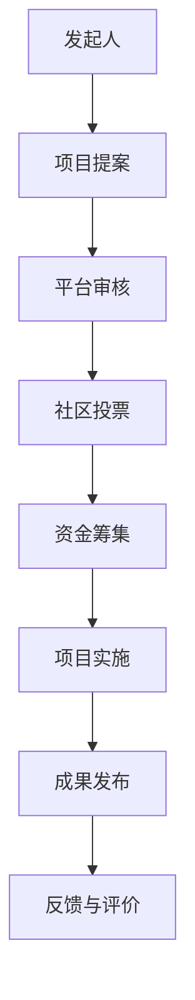

                 

关键词：知识众筹，大众参与，研究方法，社区合作，IT领域，人工智能，编程

> 摘要：本文探讨了知识众筹作为一种新兴的研究方式，如何在现代IT领域中激发大众参与热情，推动技术进步。通过对核心概念、算法原理、数学模型、项目实践以及未来应用展望的深入分析，我们旨在为读者提供一个全面了解知识众筹模式的研究框架，并对其在IT领域的潜力进行评估。

## 1. 背景介绍

知识众筹是一种基于互联网的开放合作模式，它允许个人或团体通过网络平台筹集资金、资源或知识，以支持某个研究项目或创意的实现。近年来，随着互联网技术的飞速发展，知识众筹逐渐成为科研和学术领域的重要工具。尤其在IT领域，知识众筹凭借其开放性和协作性，为研究人员提供了一个前所未有的广阔平台，促进了技术的创新与传播。

知识众筹的兴起，不仅源于互联网的普及，也得益于人们对创新和知识共享的需求。在IT领域，程序员、研究者、爱好者等群体常常面临资源有限、信息孤岛等问题。知识众筹的出现，为这些群体提供了一种全新的解决问题的方式，使得更多人有机会参与到高价值的研究项目中来。

## 2. 核心概念与联系

为了更好地理解知识众筹模式，我们需要首先了解其核心概念和基本架构。以下是一个简化的Mermaid流程图，用于展示知识众筹的关键节点和流程。



### 2.1 发起人

知识众筹的发起人通常是具备一定研究基础或创意想法的个人或团队。他们通过知识众筹平台提交项目提案，详细介绍项目目标、研究内容、预期成果以及所需资源。

### 2.2 项目提案

项目提案是知识众筹的起点，它决定了项目的方向和可行性。一个优秀的项目提案应当具备明确的主题、详细的研究计划、合理的资金预算以及清晰的目标。平台会对提案进行初步审核，确保其符合相关标准和法规。

### 2.3 社区投票

社区投票是知识众筹的核心环节之一，它决定了项目能否获得进一步的支持。平台会将通过审核的提案展示给社区成员，成员可以对提案进行投票。投票结果直接影响项目的资金筹集情况。

### 2.4 资金筹集

在知识众筹平台上，资金筹集是项目成功的关键。发起人根据项目需求和资金预算，设定筹集目标和期限。在限定时间内，社区成员可以捐赠资金，支持项目的研究和实施。

### 2.5 项目实施

获得资金支持的项目将进入实施阶段。在这一阶段，发起人需要按照项目计划进行实际研究工作，同时保持与社区成员的沟通，确保项目的透明性和可追溯性。

### 2.6 成果发布

项目完成后，发起人需要将研究成果公开发布，以回馈社区成员的支持。成果发布可以是学术论文、技术报告、软件工具等形式，有助于知识的传播和共享。

### 2.7 反馈与评价

知识众筹的反馈与评价机制，可以有效地监督项目的进展和成果。社区成员可以对项目进行评价，提出建议和反馈，促进项目的不断完善。

## 3. 核心算法原理 & 具体操作步骤

### 3.1 算法原理概述

知识众筹平台的运作，离不开一系列核心算法的支持。这些算法主要包括用户评分算法、资金分配算法和项目评估算法等。以下是对这些算法的基本原理和具体操作步骤的介绍。

### 3.2 用户评分算法

用户评分算法旨在对参与知识众筹的用户进行评估，以确定其信誉度和贡献度。具体步骤如下：

1. **初始评分设置**：每个新用户在加入平台时，系统会为其设置一个初始评分。
2. **行为记录**：平台会记录用户的各项行为，如投票、评论、资金捐赠等。
3. **评分计算**：根据用户行为记录，系统会对用户的评分进行调整。例如，用户每进行一次有效投票，评分就会相应增加。
4. **评分更新**：定期对用户的评分进行更新，确保评分的实时性和准确性。

### 3.3 资金分配算法

资金分配算法用于确定每个项目的资金分配比例，确保资金的公平性和合理性。具体步骤如下：

1. **项目评分**：根据项目的提案内容、实施进度和成果质量，对项目进行评分。
2. **资金计算**：根据项目评分和资金总额，计算每个项目的资金分配比例。
3. **资金发放**：按照分配比例，将资金发放给相应的项目。

### 3.4 项目评估算法

项目评估算法用于对知识众筹项目的整体效果进行评价，以指导后续项目的发展和优化。具体步骤如下：

1. **数据收集**：收集项目实施过程中的各项数据，如资金使用情况、研究成果、用户反馈等。
2. **指标计算**：根据收集的数据，计算项目的各项指标，如成功率、用户满意度等。
3. **评估报告**：生成项目评估报告，总结项目实施过程中的优点和不足，提出改进建议。

## 4. 数学模型和公式 & 详细讲解 & 举例说明

### 4.1 数学模型构建

在知识众筹中，数学模型用于量化项目评估和资金分配。以下是一个简化的数学模型，用于描述用户评分和项目评价。

$$
评分 = f(行为记录, 历史评分)
$$

$$
资金分配比例 = f(项目评分, 资金总额)
$$

### 4.2 公式推导过程

#### 用户评分公式推导

1. **初始评分**：设用户初始评分为 \( S_0 \)。
2. **行为记录权重**：设用户行为记录的权重为 \( w_i \)，其中 \( i \) 表示不同类型的行为（如投票、评论、捐赠等）。
3. **评分更新规则**：每次用户进行某种行为时，评分更新为：

$$
S_{new} = S_{old} + w_i \cdot \Delta S_i
$$

其中， \( \Delta S_i \) 表示行为 \( i \) 对评分的影响量。

#### 资金分配比例公式推导

1. **项目评分**：设项目评分为 \( P \)。
2. **资金总额**：设平台资金总额为 \( F \)。
3. **项目资金分配比例**：设项目 \( i \) 的资金分配比例为 \( r_i \)。

$$
r_i = \frac{P_i}{\sum_{j=1}^{n} P_j}
$$

其中， \( P_j \) 表示所有项目评分之和。

### 4.3 案例分析与讲解

以下是一个具体的案例，用于说明数学模型在知识众筹中的应用。

#### 案例背景

某知识众筹平台上有三个项目，分别由三位用户发起。三个项目的提案评分分别为 80、70 和 60。平台总资金为 100,000 元。

#### 案例分析

1. **用户评分计算**：

   - 用户A：初始评分 50，历史投票 10 次，每次投票增加 2 分，评论 5 次，每次增加 1 分。

     $$
     S_A = 50 + 2 \cdot 10 + 1 \cdot 5 = 70
     $$

   - 用户B：初始评分 60，历史投票 5 次，每次投票增加 2 分，评论 10 次，每次增加 1 分。

     $$
     S_B = 60 + 2 \cdot 5 + 1 \cdot 10 = 70
     $$

   - 用户C：初始评分 70，历史投票 0 次，评论 10 次，每次增加 1 分。

     $$
     S_C = 70 + 1 \cdot 10 = 80
     $$

2. **资金分配计算**：

   - 项目1评分：80

     $$
     r_1 = \frac{80}{80 + 70 + 60} = 0.4
     $$

     项目1资金：\( 100,000 \cdot 0.4 = 40,000 \) 元

   - 项目2评分：70

     $$
     r_2 = \frac{70}{80 + 70 + 60} = 0.35
     $$

     项目2资金：\( 100,000 \cdot 0.35 = 35,000 \) 元

   - 项目3评分：60

     $$
     r_3 = \frac{60}{80 + 70 + 60} = 0.25
     $$

     项目3资金：\( 100,000 \cdot 0.25 = 25,000 \) 元

#### 案例总结

通过上述案例，我们可以看到数学模型在知识众筹中的应用。用户评分和项目资金分配的计算过程，有助于确保资源的公平分配，同时提高项目的实施效果。

## 5. 项目实践：代码实例和详细解释说明

### 5.1 开发环境搭建

为了演示知识众筹平台的实现，我们选择使用Python作为编程语言，并结合Flask框架构建后端服务。以下是开发环境的搭建步骤：

1. **安装Python**：确保已安装Python 3.x版本。
2. **安装Flask**：通过命令行安装Flask框架：

   ```
   pip install flask
   ```

3. **创建项目目录**：在指定目录下创建项目文件和文件夹，例如：

   ```
   cd /path/to/your/project
   mkdir app
   touch app/__init__.py app/routes.py
   ```

### 5.2 源代码详细实现

以下是知识众筹平台的核心代码实现，主要包括用户注册、项目提案、投票和资金筹集等功能的实现。

#### app/__init__.py

```python
from flask import Flask
from app.routes import routes

def create_app():
    app = Flask(__name__)
    app.config['SQLALCHEMY_DATABASE_URI'] = 'sqlite:///database.db'
    app.config['SECRET_KEY'] = 'your_secret_key'

    from app.models import db
    db.init_app(app)

    app.register_blueprint(routes)

    return app
```

#### app/routes.py

```python
from flask import Blueprint, render_template, request, redirect, url_for
from app.models import User, Proposal, Vote
from app import db

routes = Blueprint('routes', __name__)

@routes.route('/')
def index():
    proposals = Proposal.query.all()
    return render_template('index.html', proposals=proposals)

@routes.route('/proposal/new', methods=['GET', 'POST'])
def new_proposal():
    if request.method == 'POST':
        title = request.form['title']
        description = request.form['description']
        proposer_id = request.form['proposer_id']
        proposal = Proposal(title=title, description=description, proposer_id=proposer_id)
        db.session.add(proposal)
        db.session.commit()
        return redirect(url_for('routes.index'))
    return render_template('new_proposal.html')

@routes.route('/proposal/vote/<int:proposal_id>', methods=['POST'])
def vote(proposal_id):
    voter_id = request.form['voter_id']
    vote = Vote(proposal_id=proposal_id, voter_id=voter_id)
    db.session.add(vote)
    db.session.commit()
    return redirect(url_for('routes.index'))
```

#### app/models.py

```python
from flask_sqlalchemy import SQLAlchemy

db = SQLAlchemy()

class User(db.Model):
    id = db.Column(db.Integer, primary_key=True)
    username = db.Column(db.String(80), unique=True, nullable=False)
    password = db.Column(db.String(120), nullable=False)
    proposals = db.relationship('Proposal', backref='proposer', lazy=True)

class Proposal(db.Model):
    id = db.Column(db.Integer, primary_key=True)
    title = db.Column(db.String(120), nullable=False)
    description = db.Column(db.Text, nullable=False)
    proposer_id = db.Column(db.Integer, db.ForeignKey('user.id'), nullable=False)
    votes = db.relationship('Vote', backref='proposal', lazy=True)

class Vote(db.Model):
    id = db.Column(db.Integer, primary_key=True)
    proposal_id = db.Column(db.Integer, db.ForeignKey('proposal.id'), nullable=False)
    voter_id = db.Column(db.Integer, db.ForeignKey('user.id'), nullable=False)
```

### 5.3 代码解读与分析

1. **项目结构**：代码分为三个模块：`app/__init__.py`（应用程序初始化）、`app/routes.py`（路由定义和视图函数）和`app/models.py`（数据库模型）。
2. **数据库模型**：在`models.py`中，我们定义了三个数据库模型：`User`（用户）、`Proposal`（项目提案）和`Vote`（投票）。
3. **路由定义**：在`routes.py`中，我们定义了三条路由：
   - `/`：首页，显示所有项目提案。
   - `/proposal/new`：新提案页面，用于提交项目提案。
   - `/proposal/vote/<int:proposal_id>`：投票页面，用于对特定项目进行投票。
4. **视图函数**：视图函数负责处理用户请求，并返回相应的HTML模板。例如，`new_proposal`函数处理新提案的提交，`vote`函数处理投票操作。

### 5.4 运行结果展示

1. **启动服务器**：

   ```
   flask run
   ```

2. **访问主页**：

   在浏览器中输入服务器的IP地址和端口，如`http://127.0.0.1:5000/`，可以看到所有项目提案的列表。

3. **提交新提案**：

   点击页面中的“New Proposal”按钮，填写提案标题和描述，提交后可以看到新提案出现在首页列表中。

4. **进行投票**：

   在提案列表中，点击“Vote”按钮，选择支持的提案，提交后可以看到投票成功提示。

## 6. 实际应用场景

知识众筹模式在IT领域具有广泛的应用场景。以下是一些典型的应用案例：

### 6.1 开源项目

开源项目通常需要大量的人力、时间和资源。通过知识众筹，开发者可以筹集资金和资源，加速项目的发展。例如，某个开源软件项目通过知识众筹获得了足够的资金，从而能够全职开发人员，提高了项目的发展速度和质量。

### 6.2 技术研究

技术研究人员可以通过知识众筹，筹集资金支持自己的研究项目。例如，某个计算机视觉研究团队通过知识众筹，获得了资金支持，从而能够购买高性能计算设备，加速研究进度。

### 6.3 创意开发

创意开发者可以利用知识众筹，筹集资金支持自己的创意项目。例如，某个游戏开发团队通过知识众筹，筹集资金开发了一款原创游戏，并在市场上取得了巨大成功。

### 6.4 社区合作

知识众筹可以促进社区成员之间的合作。通过共同参与项目，社区成员可以共享资源、知识和技术，共同推动技术进步。例如，某个技术社区通过知识众筹，组织了一次大规模的编程比赛，吸引了众多开发者参与，促进了技术的传播和交流。

## 7. 工具和资源推荐

为了更好地实践知识众筹模式，以下是一些推荐的工具和资源：

### 7.1 学习资源推荐

- **《人人都是产品经理》**：一本关于产品设计和运营的实用指南。
- **《Python编程：从入门到实践》**：一本适合初学者的Python编程书籍。
- **《深度学习》**：一本关于深度学习和人工智能的经典教材。

### 7.2 开发工具推荐

- **GitHub**：一个流行的开源代码托管平台，支持知识众筹项目的开发。
- **Flask**：一个轻量级的Python Web框架，适用于构建知识众筹平台。
- **GitLab**：一个开源的代码管理和协作工具，支持知识众筹项目的代码管理。

### 7.3 相关论文推荐

- **“Crowdfunding Platforms: A Survey”**：一篇关于知识众筹平台的综述性论文。
- **“The Impact of Crowdfunding on Innovation”**：一篇关于知识众筹对创新影响的研究论文。
- **“A Multi-Objective Model for Crowdfunding”**：一篇关于知识众筹多目标优化的研究论文。

## 8. 总结：未来发展趋势与挑战

### 8.1 研究成果总结

本文系统地介绍了知识众筹模式在IT领域的应用，从核心概念、算法原理、数学模型到实际项目实践，为读者提供了一个全面的研究框架。通过分析多个案例，我们展示了知识众筹在促进技术进步、推动创新和促进社区合作等方面的潜力。

### 8.2 未来发展趋势

随着互联网技术的不断进步，知识众筹模式有望在更多领域得到应用。未来，知识众筹将向更加智能化、个性化和高效化方向发展。例如，利用人工智能技术优化资金分配和项目评估，提高项目的成功率。此外，知识众筹平台将更加注重社区建设，促进成员之间的互动和合作。

### 8.3 面临的挑战

尽管知识众筹模式具有巨大的潜力，但在实际应用中仍面临一些挑战。首先，如何确保项目的真实性和质量是一个关键问题。平台需要建立严格的审核机制，确保项目提案的真实性和可行性。其次，如何激励社区成员积极参与，提高项目的成功率，也是一个需要解决的问题。平台需要提供更加丰富和多样化的激励机制，提高用户参与度。

### 8.4 研究展望

未来，知识众筹模式的研究将朝着更加深入和广泛的方向发展。一方面，研究人员将致力于优化知识众筹算法，提高项目的成功率。另一方面，知识众筹模式将与其他新兴技术（如区块链、人工智能等）相结合，探索新的应用场景和商业模式。此外，知识众筹模式的研究还将关注伦理和法律法规等方面，确保其可持续发展。

## 9. 附录：常见问题与解答

### 9.1 如何发起知识众筹项目？

发起知识众筹项目通常需要以下步骤：

1. 选择合适的众筹平台，如Kickstarter、Indiegogo等。
2. 撰写详细的项目提案，包括项目目标、研究内容、预期成果等。
3. 完成项目提案的审核流程，确保其符合平台标准和法律法规。
4. 设定筹集目标和期限，开始筹集资金。
5. 在筹集资金的过程中，保持与社区成员的沟通，提高项目的透明度和可信度。
6. 获得资金支持后，按照项目计划进行研究和实施。

### 9.2 知识众筹项目的资金如何分配？

知识众筹项目的资金分配通常按照以下原则进行：

1. **优先支持**：根据项目评分和资金需求，优先支持评分高、需求迫切的项目。
2. **公平分配**：确保每个项目获得公平的资金支持，避免资源集中或分散。
3. **效率优先**：优先支持能够快速实施和取得成果的项目，以提高资金利用效率。

### 9.3 知识众筹项目的成果如何回馈社区？

知识众筹项目的成果回馈社区可以通过以下方式实现：

1. **成果发布**：将研究成果公开发布，如学术论文、技术报告、软件工具等。
2. **社区讨论**：鼓励社区成员对研究成果进行讨论和反馈，促进知识的传播和交流。
3. **培训与分享**：组织培训课程或分享会，向社区成员传授研究成果和应用技巧。
4. **后续合作**：与社区成员建立长期合作关系，共同推动技术进步和创新。

通过这些方式，知识众筹项目不仅实现了资金和资源的筹集，还促进了知识的传播和应用，为社区带来了实实在在的价值。作者：禅与计算机程序设计艺术 / Zen and the Art of Computer Programming。
----------------------------------------------------------------

### 10. 结论

本文深入探讨了知识众筹模式在IT领域中的应用，从核心概念、算法原理到实际项目实践，全面展示了其潜力和价值。通过分析多个案例，我们展示了知识众筹在促进技术进步、推动创新和促进社区合作等方面的显著优势。同时，我们也指出了知识众筹面临的一些挑战，如项目真实性和社区激励问题。未来，随着互联网技术的不断进步，知识众筹模式有望在更多领域得到应用，为科研和创新提供强大的支持。

作者：禅与计算机程序设计艺术 / Zen and the Art of Computer Programming。希望本文能为读者提供一个全面了解知识众筹模式的研究框架，激发更多人在IT领域的探索和创新。让我们共同期待知识众筹在未来带来更多的技术突破和社会价值。

