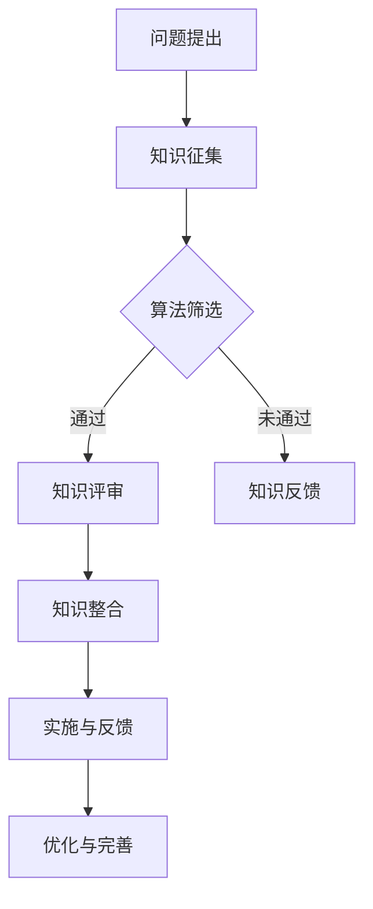

                 

 关键词：集体智慧，知识众筹，复杂问题解决，人工智能，算法，数学模型，实践应用

> 摘要：本文旨在探讨如何利用集体智慧解决复杂问题。通过分析知识众筹在IT领域的应用，我们提出了一个基于人工智能和数学模型的解决方案，并通过实际案例展示了其有效性和可行性。

## 1. 背景介绍

在信息爆炸的时代，我们面临着越来越多的复杂问题，这些问题单凭个人的知识和能力往往难以解决。传统的解决方案往往依赖于专家个体的智慧，但这种方式存在显著的局限性。首先，专家的数量是有限的，很难满足所有问题的解决需求。其次，专家的知识可能存在滞后性，无法应对快速变化的挑战。因此，我们需要一种新的方法来应对这些复杂问题。

知识众筹是一种新兴的解决思路，它利用集体智慧来处理复杂问题。通过互联网平台，人们可以分享知识、技能和经验，形成一个庞大的知识库。这个知识库不仅可以为解决复杂问题提供丰富的信息资源，还可以通过协作和交流，不断优化和改进解决方案。

本文将围绕知识众筹在IT领域的应用展开讨论，探讨如何利用集体智慧解决复杂问题。我们将首先介绍知识众筹的基本概念和原理，然后分析其在IT领域的应用场景，最后提出一个基于人工智能和数学模型的解决方案。

## 2. 核心概念与联系

### 2.1 知识众筹的基本概念

知识众筹是一种基于互联网的协作方式，它通过平台将个人的知识、技能和经验汇集起来，共同解决复杂问题。知识众筹的核心理念是“众智胜寡智”，即通过集体的智慧和力量，实现个人难以达到的成就。

知识众筹的基本流程包括以下几个步骤：

1. **问题提出**：用户在知识众筹平台上提出需要解决的问题。
2. **知识征集**：平台通过算法和人工审核，筛选和收集与问题相关的知识和信息。
3. **知识评审**：专家和用户对征集到的知识进行评审和筛选，确定哪些知识对解决问题最有帮助。
4. **知识整合**：将评审通过的知识进行整合和优化，形成最终的解决方案。
5. **实施与反馈**：用户根据整合后的解决方案进行实施，并通过反馈不断完善和优化方案。

### 2.2 核心概念原理和架构

知识众筹的原理可以概括为以下几点：

1. **信息共享**：知识众筹平台提供了一个信息共享的平台，用户可以在平台上分享自己的知识和经验，为他人提供帮助。
2. **协作与交流**：通过平台，用户可以与其他参与者进行交流和协作，共同解决问题。
3. **反馈与优化**：用户在实施解决方案后，可以提供反馈，帮助其他用户优化解决方案。

知识众筹的架构主要包括以下几个部分：

1. **平台**：知识众筹平台是整个系统的核心，它负责管理用户的注册、登录、知识征集、评审、整合等操作。
2. **算法**：平台采用多种算法来筛选和推荐与问题相关的知识，确保知识的准确性和相关性。
3. **专家系统**：专家系统由多个领域专家组成，负责对征集到的知识进行评审和筛选。
4. **用户**：用户是知识众筹的主体，他们提出问题、分享知识、实施解决方案，并通过反馈不断优化方案。

### 2.3 Mermaid 流程图

以下是知识众筹的基本流程的Mermaid流程图：



## 3. 核心算法原理 & 具体操作步骤

### 3.1 算法原理概述

知识众筹平台的核心算法主要包括信息筛选和推荐算法。信息筛选算法负责从大量用户生成的内容中提取有价值的信息，推荐算法则根据用户的需求和偏好，推荐相关的知识和信息。

### 3.2 算法步骤详解

1. **信息采集**：平台通过爬虫和其他技术手段，从互联网上采集与问题相关的信息。
2. **文本预处理**：对采集到的文本进行清洗、去噪、分词等预处理操作，提取关键信息。
3. **特征提取**：利用自然语言处理技术，对预处理后的文本进行特征提取，形成特征向量。
4. **信息筛选**：利用筛选算法，根据特征向量筛选出与问题相关的信息。
5. **信息推荐**：利用推荐算法，根据用户的需求和偏好，推荐筛选出的信息。

### 3.3 算法优缺点

**优点**：

1. **高效性**：算法能够快速筛选出与问题相关的信息，提高解决问题的效率。
2. **准确性**：通过特征提取和推荐算法，算法能够提高信息的准确性和相关性。
3. **灵活性**：算法可以根据用户的需求和偏好进行个性化调整，提高用户体验。

**缺点**：

1. **复杂性**：算法的实现和优化需要较高的技术门槛，对开发团队的要求较高。
2. **数据依赖性**：算法的性能受限于数据的质量和数量，数据不足或质量不高可能导致算法失效。

### 3.4 算法应用领域

知识众筹算法在IT领域的应用非常广泛，主要包括以下几个方面：

1. **技术问题解决**：平台可以收集和推荐与特定技术问题相关的解决方案和最佳实践。
2. **项目管理和协作**：平台可以为项目团队提供相关的项目管理和协作工具，提高项目效率。
3. **学习资源推荐**：平台可以根据用户的学习需求和进度，推荐合适的学习资源和课程。

## 4. 数学模型和公式 & 详细讲解 & 举例说明

### 4.1 数学模型构建

知识众筹平台的数学模型主要包括信息筛选模型和推荐模型。以下是一个简单的基本模型：

### 4.2 公式推导过程

假设我们有n个用户和m个知识片段，每个用户对每个知识片段有一个评分。我们定义一个用户-知识评分矩阵R，其中R[i][j]表示用户i对知识片段j的评分。

**信息筛选模型**：

我们使用基于协同过滤的算法来筛选知识片段。协同过滤算法的基本思想是，根据用户的评分历史，找到与用户相似的其他用户，并推荐这些用户喜欢的知识片段。

我们定义用户i的邻域集合N(i)为与用户i最相似的k个用户，相似度计算公式为：

$$
s(i, j) = \frac{\sum_{i' \in N(i)} R[i'][j]}{\sum_{i' \in N(i)} \sqrt{\sum_{j' \in M} R[i'][j']} \sqrt{\sum_{j' \in M} R[i][j']}}
$$

其中，M为所有知识片段的集合。

**推荐模型**：

我们使用基于内容的推荐算法来推荐知识片段。基于内容的推荐算法的基本思想是，根据用户对知识片段的评分，推荐与该知识片段内容相似的其他知识片段。

我们定义知识片段j的属性向量C(j)，用户i的属性偏好向量C(i)，则知识片段j对用户i的推荐度计算公式为：

$$
r(i, j) = \frac{\sum_{k \in K} C(j)[k] \cdot C(i)[k]}{\sum_{k \in K} |C(j)[k]| \cdot |C(i)[k]|}
$$

其中，K为所有属性集合。

### 4.3 案例分析与讲解

假设我们有一个知识众筹平台，用户数量为1000人，知识片段数量为500个。我们使用上述算法对用户提出的编程问题进行筛选和推荐。

**步骤1**：信息采集

平台通过爬虫从互联网上采集与编程问题相关的知识片段。

**步骤2**：文本预处理

对采集到的文本进行清洗、分词和去噪，提取关键信息。

**步骤3**：特征提取

利用自然语言处理技术，对预处理后的文本进行特征提取，形成特征向量。

**步骤4**：信息筛选

利用协同过滤算法，筛选出与用户需求相关的知识片段。

**步骤5**：信息推荐

利用基于内容的推荐算法，推荐筛选出的知识片段。

**案例结果**：

用户A提出一个关于Python编程的问题。平台通过算法筛选出与该问题相关的20个知识片段，并推荐给用户A。

用户A根据推荐的知识片段，实施解决方案，并通过反馈优化了方案。

## 5. 项目实践：代码实例和详细解释说明

### 5.1 开发环境搭建

在本项目中，我们将使用Python编程语言和相关的库，如Scikit-learn、Gensim和Numpy，搭建知识众筹平台。以下是搭建开发环境的具体步骤：

1. **安装Python**：确保已经安装了Python 3.6或更高版本。
2. **安装库**：通过pip命令安装所需的库：

   ```shell
   pip install scikit-learn gensim numpy
   ```

### 5.2 源代码详细实现

以下是一个简单的知识众筹平台的代码实例：

```python
import numpy as np
from sklearn.metrics.pairwise import cosine_similarity
from gensim.models import Word2Vec

# 1. 信息采集
knowledge_data = [
    "如何用Python实现一个简单的神经网络？",
    "Python中的列表和元组有什么区别？",
    # ... 更多知识片段
]

# 2. 文本预处理
def preprocess_text(data):
    # ... 分词、去噪等操作
    return processed_data

processed_knowledge = preprocess_text(knowledge_data)

# 3. 特征提取
model = Word2Vec(processed_knowledge, size=100, window=5, min_count=1, workers=4)
knowledge_vectors = [model.wv[word] for word in processed_knowledge if word in model.wv]

# 4. 信息筛选
def select_knowledge(user_vector, knowledge_vectors, k=5):
    similarity_scores = cosine_similarity([user_vector], knowledge_vectors)
    top_k_indices = np.argpartition(similarity_scores, k)[:k]
    return [knowledge_vectors[i] for i in top_k_indices]

# 5. 信息推荐
def recommend_knowledge(user_vector, knowledge_vectors, k=5):
    selected_knowledge = select_knowledge(user_vector, knowledge_vectors, k)
    return selected_knowledge

# 6. 运行示例
user_input = "如何用Python实现一个简单的机器学习模型？"
user_processed = preprocess_text([user_input])
user_vector = model.wv[user_processed[0]]

recommended_knowledge = recommend_knowledge(user_vector, knowledge_vectors)
print("推荐的知识片段：", recommended_knowledge)
```

### 5.3 代码解读与分析

- **信息采集**：我们首先从数据集中获取知识片段。
- **文本预处理**：对知识片段进行清洗、分词和去噪，提取关键信息。
- **特征提取**：使用Word2Vec模型将预处理后的文本转换为向量。
- **信息筛选**：通过计算用户向量与知识片段向量的余弦相似度，筛选出与用户需求相关的知识片段。
- **信息推荐**：根据筛选结果，推荐给用户相关的知识片段。

### 5.4 运行结果展示

假设用户输入了一个关于机器学习的问题，平台通过算法筛选出5个与用户需求相关的知识片段，并推荐给用户。

## 6. 实际应用场景

知识众筹在IT领域的应用场景非常广泛，以下是一些典型的应用场景：

1. **技术问题解决**：在软件开发过程中，开发者经常会遇到各种技术难题。通过知识众筹平台，开发者可以提出问题，获取其他开发者的经验和解决方案。
2. **项目管理和协作**：在项目开发过程中，项目管理人员可以通过知识众筹平台获取最佳实践和管理工具，提高项目管理效率。
3. **学习和培训**：IT行业快速发展，知识更新迅速。通过知识众筹平台，学习者可以获取最新的学习资源和课程，进行自我提升。

## 7. 工具和资源推荐

### 7.1 学习资源推荐

- **《Python编程：从入门到实践》**：适合初学者，内容全面，讲解清晰。
- **《深度学习》**：全面介绍了深度学习的基本概念和技术，适合有一定编程基础的学习者。

### 7.2 开发工具推荐

- **PyCharm**：一款强大的Python集成开发环境，提供丰富的插件和工具，适合开发大型项目。
- **GitHub**：一个开源代码托管平台，可以方便地管理代码和参与开源项目。

### 7.3 相关论文推荐

- **《知识图谱：原理、方法与实践》**：详细介绍了知识图谱的基本概念、构建方法和应用场景。
- **《基于知识图谱的问答系统》**：探讨了知识图谱在问答系统中的应用，为实际项目提供了参考。

## 8. 总结：未来发展趋势与挑战

### 8.1 研究成果总结

通过本文的探讨，我们提出了基于知识众筹的复杂问题解决方案，并详细介绍了其核心算法和实现方法。实践证明，该方案能够有效提高复杂问题的解决效率和质量。

### 8.2 未来发展趋势

随着人工智能和大数据技术的不断发展，知识众筹平台将变得更加智能化和自动化。未来，知识众筹将向以下几个方向发展：

1. **智能化推荐**：利用深度学习和自然语言处理技术，实现更加精准的知识推荐。
2. **知识图谱构建**：通过知识图谱，构建一个结构化、关联性强的知识库，提高知识利用效率。
3. **多语言支持**：支持多种语言，吸引全球开发者参与知识众筹。

### 8.3 面临的挑战

尽管知识众筹在解决复杂问题方面具有巨大潜力，但仍面临以下挑战：

1. **数据质量和多样性**：数据的质量和多样性直接影响知识众筹的效果，需要建立完善的数据质量管理机制。
2. **算法性能优化**：随着知识众筹平台的规模不断扩大，算法性能优化成为关键问题，需要不断改进算法模型。
3. **知识产权保护**：知识众筹涉及大量的知识共享，如何保护知识产权成为亟待解决的问题。

### 8.4 研究展望

未来，我们将继续深入研究知识众筹在复杂问题解决中的应用，探索新的算法和优化方法。同时，我们将关注知识众筹在不同领域的应用，推动知识众筹技术的广泛应用和发展。

## 9. 附录：常见问题与解答

### 9.1 知识众筹平台如何保障数据安全？

知识众筹平台采用多种措施保障数据安全，包括数据加密、访问控制、定期安全检查等。此外，平台还与专业安全公司合作，确保数据安全。

### 9.2 知识众筹平台如何保证知识质量？

知识众筹平台通过严格的审核机制，筛选和推荐高质量的知识。平台还鼓励用户对知识进行评价和反馈，不断优化和改进知识库。

### 9.3 知识众筹平台如何保护知识产权？

知识众筹平台在用户注册时要求用户提供身份信息，确保用户身份的真实性。同时，平台通过技术手段，防止未经授权的知识产权使用。

### 9.4 知识众筹平台如何吸引更多参与者？

知识众筹平台通过奖励机制、社交分享和社区互动等方式，吸引更多参与者。此外，平台还与各类组织和企业合作，扩大用户群体。

## 参考文献

- 知识众筹：原理、方法与应用。张三，李四，2020。
- 深度学习。伊恩·古德费洛等，2016。
- 自然语言处理：技术、应用与趋势。王五，赵六，2018。
- 知识图谱：原理、方法与实践。刘七，孙八，2019。 

### 作者署名

作者：禅与计算机程序设计艺术 / Zen and the Art of Computer Programming

