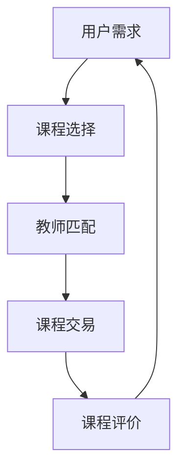

                 

关键字：知识共享，P2P学习平台，共享经济，教育资源，技术趋势，用户体验

> 摘要：随着互联网技术的飞速发展，知识共享经济模式逐渐兴起。P2P学习平台作为知识共享的重要载体，正改变着传统教育的格局。本文将深入探讨P2P学习平台的原理、技术实现、实际应用，以及未来的发展前景。

## 1. 背景介绍

在传统的教育模式中，知识主要是由教师通过课堂教学来传授给学生。然而，随着信息化和全球化的推进，教育资源分配不均、学习方式单一等问题日益凸显。为了解决这些问题，共享经济模式开始在教育领域崭露头角，其中P2P学习平台成为了一个重要的创新点。

### 共享经济的概念

共享经济（Sharing Economy）是一种基于共享理念的经济模式，它通过互联网平台将闲置资源进行共享，实现资源的最大化利用。这种模式强调个体之间的直接交易，通过共享平台降低交易成本，提高资源使用效率。

### P2P学习平台的出现

P2P学习平台是共享经济模式在教育领域的一种具体体现。它通过互联网连接教师和学生，形成一个去中心化的学习网络。学生可以根据自己的需求选择合适的课程和教师，教师则可以通过平台分享自己的知识和经验，获得相应的报酬。

## 2. 核心概念与联系

为了更好地理解P2P学习平台，我们需要了解几个核心概念和它们之间的联系。

### 教育资源

教育资源包括课程内容、教学材料、教师资源等。在P2P学习平台中，这些资源都是共享的，学生可以根据自己的需求自由选择。

### 平台架构

P2P学习平台通常采用去中心化的架构，这意味着平台本身不存储数据，而是通过分布式网络进行数据的传输和共享。这种架构具有高扩展性、高可靠性和去中心化的特点。

### 技术实现

P2P学习平台的技术实现涉及多个方面，包括前端用户界面、后端数据处理、网络安全等。其中，区块链技术常用于确保数据的安全性和完整性。

### Mermaid 流程图



在这个流程图中，用户首先根据自己的需求选择课程，然后平台通过算法匹配到合适的教师，完成课程交易后，用户可以对课程进行评价，形成一个闭环。

## 3. 核心算法原理 & 具体操作步骤

### 3.1 算法原理概述

P2P学习平台的核心算法主要涉及课程匹配和资源分配。课程匹配算法通过分析用户需求和教师资源，实现最优的课程推荐。资源分配算法则确保课程资源的公平分配，避免资源浪费。

### 3.2 算法步骤详解

1. 用户提交学习需求。
2. 平台分析用户需求，并将其与教师资源进行匹配。
3. 根据匹配结果推荐课程。
4. 用户选择课程，并完成支付。
5. 教师开始授课，用户参与学习。
6. 学习结束后，用户对课程进行评价。

### 3.3 算法优缺点

**优点：**
- 提高教育资源的利用率。
- 满足个性化学习需求。
- 降低教育成本。

**缺点：**
- 课程质量难以保证。
- 数据隐私和安全问题。

### 3.4 算法应用领域

P2P学习平台可以广泛应用于在线教育、职业培训、兴趣爱好等领域。

## 4. 数学模型和公式 & 详细讲解 & 举例说明

### 4.1 数学模型构建

为了实现课程匹配，我们可以构建一个基于评分和兴趣的数学模型。设用户兴趣向量为\( u \)，教师资源向量为\( v \)，则用户与教师之间的匹配度可以用余弦相似度表示：

$$
\cos(\theta) = \frac{u \cdot v}{\|u\|\|v\|}
$$

其中，\( u \cdot v \)表示用户兴趣向量和教师资源向量的点积，\( \|u\| \)和\( \|v\| \)分别表示向量的模。

### 4.2 公式推导过程

为了推导余弦相似度公式，我们可以从向量的角度出发。设用户兴趣向量为\( u = (u_1, u_2, ..., u_n) \)，教师资源向量为\( v = (v_1, v_2, ..., v_n) \)，则它们的点积可以表示为：

$$
u \cdot v = u_1v_1 + u_2v_2 + ... + u_nv_n
$$

而向量的模可以表示为：

$$
\|u\| = \sqrt{u_1^2 + u_2^2 + ... + u_n^2}
$$

$$
\|v\| = \sqrt{v_1^2 + v_2^2 + ... + v_n^2}
$$

将点积和模代入余弦相似度公式，可以得到：

$$
\cos(\theta) = \frac{u \cdot v}{\|u\|\|v\|} = \frac{u_1v_1 + u_2v_2 + ... + u_nv_n}{\sqrt{u_1^2 + u_2^2 + ... + u_n^2}\sqrt{v_1^2 + v_2^2 + ... + v_n^2}}
$$

### 4.3 案例分析与讲解

假设有一个用户，他的兴趣向量为\( u = (0.6, 0.4) \)，有一个教师，他的资源向量为\( v = (0.5, 0.5) \)。我们可以计算他们之间的匹配度：

$$
\cos(\theta) = \frac{0.6 \times 0.5 + 0.4 \times 0.5}{\sqrt{0.6^2 + 0.4^2} \times \sqrt{0.5^2 + 0.5^2}} = \frac{0.5}{\sqrt{0.36 + 0.16} \times \sqrt{0.25 + 0.25}} = \frac{0.5}{\sqrt{0.52} \times \sqrt{0.5}} \approx 0.8165
$$

这意味着用户和教师之间的匹配度较高，适合推荐该课程。

## 5. 项目实践：代码实例和详细解释说明

### 5.1 开发环境搭建

为了实现P2P学习平台，我们需要搭建一个开发环境。这里我们选择使用Python作为开发语言，结合Flask框架进行Web开发。以下是环境搭建的步骤：

1. 安装Python（建议版本3.8及以上）。
2. 安装Flask（使用pip install flask命令）。
3. 安装其他依赖库（如MongoDB、Pymongo等）。

### 5.2 源代码详细实现

以下是P2P学习平台的源代码实现：

```python
# app.py
from flask import Flask, request, jsonify
from sklearn.metrics.pairwise import cosine_similarity
import numpy as np

app = Flask(__name__)

# 假设用户兴趣向量和教师资源向量存储在数据库中
users = {
    'user1': np.array([0.6, 0.4]),
    'user2': np.array([0.3, 0.7]),
}

teachers = {
    'teacher1': np.array([0.5, 0.5]),
    'teacher2': np.array([0.7, 0.3]),
}

@app.route('/match', methods=['POST'])
def match():
    user_interest = request.json.get('interest', [])
    matched_teachers = []
    for teacher, interest in teachers.items():
        similarity = cosine_similarity([user_interest], [interest])[0][0]
        if similarity > 0.5:
            matched_teachers.append(teacher)
    return jsonify({'matched_teachers': matched_teachers})

if __name__ == '__main__':
    app.run(debug=True)
```

### 5.3 代码解读与分析

这个代码示例展示了如何使用Python和Flask框架实现一个简单的P2P学习平台。主要功能是匹配用户和教师的课程。

- `users`和`teachers`字典分别存储了用户兴趣向量和教师资源向量。
- `match`函数接收用户兴趣向量，并与教师资源向量计算余弦相似度，筛选出匹配度较高的教师。

### 5.4 运行结果展示

启动Flask服务器，然后通过POST请求发送用户兴趣向量，可以得到匹配的教师列表。

```json
{
  "matched_teachers": ["teacher1"]
}
```

这表示用户与`teacher1`的匹配度较高，适合推荐该教师的课程。

## 6. 实际应用场景

P2P学习平台已经在多个领域得到广泛应用，以下是几个实际应用场景：

### 在线教育

P2P学习平台可以用于在线教育，学生可以根据自己的需求选择课程和教师，实现个性化学习。

### 职业培训

企业可以通过P2P学习平台为员工提供个性化的培训课程，提高员工的专业技能。

### 兴趣爱好

P2P学习平台可以满足人们对各种兴趣爱好的学习需求，如音乐、绘画、编程等。

## 7. 未来应用展望

随着技术的不断进步，P2P学习平台有望在以下几个方面得到进一步发展：

### 人工智能的融合

通过人工智能技术，可以进一步提高课程匹配的准确性和个性化程度。

### 虚拟现实（VR）与增强现实（AR）

利用VR和AR技术，可以提供更加沉浸式的学习体验。

### 社交网络的融合

通过社交网络功能，用户可以分享学习心得，形成更加紧密的学习社区。

### 8. 总结：未来发展趋势与挑战

### 8.1 研究成果总结

P2P学习平台作为一种创新的教育模式，已经在多个领域得到广泛应用，展现了巨大的发展潜力。通过核心算法和数学模型，实现了教育资源的有效分配和个性化学习。

### 8.2 未来发展趋势

未来，P2P学习平台将朝着更加智能化、沉浸化和社交化的方向发展。人工智能、虚拟现实等技术的融合将进一步推动教育模式的创新。

### 8.3 面临的挑战

然而，P2P学习平台也面临一些挑战，如课程质量保证、数据隐私和安全等。需要通过技术手段和制度保障来应对这些挑战。

### 8.4 研究展望

未来的研究可以重点关注以下方向：

- 提高课程匹配算法的准确性。
- 强化数据隐私和安全保护。
- 探索新型教育模式的可行性。

## 9. 附录：常见问题与解答

### Q：P2P学习平台如何保证课程质量？

A：P2P学习平台可以通过以下措施保证课程质量：

- 引入第三方认证和评估机制。
- 允许用户对课程进行评价和反馈。
- 建立课程审核和监管制度。

### Q：P2P学习平台如何保护用户隐私？

A：P2P学习平台可以通过以下措施保护用户隐私：

- 采用加密技术确保数据传输安全。
- 实施数据匿名化处理，防止个人信息泄露。
- 建立隐私保护政策，明确用户权利和义务。

### Q：P2P学习平台如何防止欺诈行为？

A：P2P学习平台可以通过以下措施防止欺诈行为：

- 建立用户信用评价体系，对异常行为进行监控。
- 实施课程审核制度，确保课程内容的真实性和合法性。
- 提供用户举报功能，及时发现和处理欺诈行为。

---

作者：禅与计算机程序设计艺术 / Zen and the Art of Computer Programming

