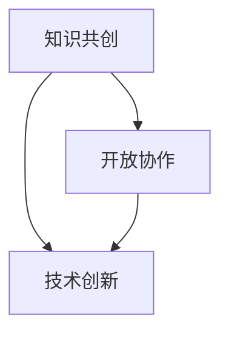

                 

关键词：开放创新平台、共创、知识管理、技术创新、协作

> 摘要：本文探讨了开放创新平台在推动知识共创中的关键作用。通过分析其原理、构建方法、实现步骤及实际应用，本文揭示了开放创新平台在促进知识共享、增强团队协作和推动技术创新方面的巨大潜力。文章最后展望了开放创新平台未来的发展前景及面临的挑战。

## 1. 背景介绍

在当今快速变化和高度互联的世界中，知识的创造和传播已成为企业竞争的重要驱动力。然而，传统的知识管理方法往往存在效率低、互动性差等问题，难以适应日益复杂的业务环境和多样化的知识需求。为了应对这一挑战，开放创新平台应运而生，它通过构建一个集知识共享、协同创新于一体的生态系统，有效地促进了知识的共创和传播。

### 1.1 开放创新平台的定义

开放创新平台是一个集成化的、基于网络的技术创新生态系统，旨在通过开放协作、共享资源和知识创造，推动技术创新和商业价值的实现。它融合了多种技术手段和管理理念，包括云计算、大数据、人工智能和区块链等，旨在为用户提供一个高效、灵活的创新环境。

### 1.2 开放创新平台的重要性

开放创新平台的重要性体现在以下几个方面：

1. **知识共享**：通过开放创新平台，企业能够更有效地共享知识资源，提高知识利用率。
2. **协同创新**：开放创新平台为团队成员提供了一个协同工作的平台，促进了跨部门、跨领域的合作。
3. **技术创新**：开放创新平台鼓励多样化的创新模式，加速了新技术的研发和推广。
4. **商业价值**：通过开放创新平台，企业能够快速响应市场需求，提升市场竞争力。

## 2. 核心概念与联系

### 2.1 核心概念

#### 2.1.1 知识共创

知识共创是指多个个体或组织在开放共享的环境下，通过互动、交流、协作和创新，共同创造出新的知识和价值。

#### 2.1.2 开放协作

开放协作是一种基于共享和协作的工作方式，通过打破组织壁垒，促进信息流通和资源共享，提高团队整体的工作效率。

#### 2.1.3 技术创新

技术创新是指通过引入新技术、新方法或新流程，实现产品或服务的创新，从而提升企业竞争力和市场地位。

### 2.2 联系与架构

开放创新平台的架构可以看作是一个由知识共创、开放协作和技术创新三个核心模块组成的生态系统。下面是一个简化的 Mermaid 流程图，用于描述这三个模块之间的联系。



- **知识共创**：通过开放平台，用户可以共享自己的知识和经验，形成知识库，为开放协作和技术创新提供基础。
- **开放协作**：在知识共创的基础上，团队成员可以进行实时沟通、协作，共同解决问题，推动项目进展。
- **技术创新**：开放协作产生的结果和知识，可以用于技术创新，促进新产品的研发和市场的拓展。

## 3. 核心算法原理 & 具体操作步骤

### 3.1 算法原理概述

开放创新平台的核心算法主要涉及以下几个方面：

1. **知识图谱构建**：通过数据挖掘和机器学习技术，构建一个全面、动态的知识图谱，为知识共创提供数据支持。
2. **协同过滤算法**：基于用户的兴趣和行为数据，推荐相关的知识和资源，提高知识共享的效率。
3. **协作决策算法**：通过多目标优化和博弈论等方法，帮助团队成员在协作过程中做出最优决策。

### 3.2 算法步骤详解

#### 3.2.1 知识图谱构建

1. **数据采集**：从内部系统和外部来源收集各类知识数据。
2. **数据预处理**：对数据进行清洗、去重和格式化处理。
3. **实体抽取**：利用自然语言处理技术，从数据中提取关键实体和关系。
4. **知识图谱构建**：将实体和关系以图形的方式组织起来，形成知识图谱。

#### 3.2.2 协同过滤算法

1. **用户兴趣模型**：基于用户的浏览、搜索和分享行为，构建用户兴趣模型。
2. **相似度计算**：计算用户之间的相似度，识别潜在的兴趣群体。
3. **推荐生成**：根据用户兴趣模型和相似度计算结果，生成个性化推荐列表。

#### 3.2.3 协作决策算法

1. **目标定义**：明确协作的目标和约束条件。
2. **模型构建**：构建多目标优化模型或博弈模型。
3. **求解算法**：使用求解算法（如遗传算法、粒子群算法等）求解最优解。

### 3.3 算法优缺点

#### 优点

- **高效性**：通过算法自动化处理，提高了知识共享和协作的效率。
- **个性化**：协同过滤算法和协作决策算法能够根据用户和团队的特性提供个性化服务。
- **动态性**：知识图谱构建和更新机制保证了系统的动态适应能力。

#### 缺点

- **数据质量**：算法的性能依赖于数据的质量，数据不准确或缺失会影响算法效果。
- **计算复杂度**：协同过滤算法和协作决策算法的计算复杂度较高，需要高性能计算资源支持。

### 3.4 算法应用领域

- **企业内部创新**：用于企业内部的研发、市场和运营等领域，提高团队协作效率和知识利用率。
- **公共创新平台**：用于开放创新社区、科研机构和创业孵化器等，促进跨领域、跨组织的知识共创。

## 4. 数学模型和公式 & 详细讲解 & 举例说明

### 4.1 数学模型构建

开放创新平台的数学模型主要包括以下几个部分：

1. **知识共享模型**：描述知识共享的机制和影响因素。
2. **协同过滤模型**：用于用户兴趣建模和资源推荐。
3. **协作决策模型**：用于团队决策和任务分配。

### 4.2 公式推导过程

#### 知识共享模型

知识共享模型可以用以下公式描述：

\[ R_{ij} = f(\theta_i, \theta_j, \phi) \]

其中，\( R_{ij} \) 表示用户 \( i \) 和用户 \( j \) 之间的知识共享量，\( \theta_i \) 和 \( \theta_j \) 分别表示用户 \( i \) 和用户 \( j \) 的知识水平，\( \phi \) 表示知识共享的参数。

#### 协同过滤模型

协同过滤模型的推荐公式如下：

\[ r_{ij} = \mu + u_i^T \theta_j + v_j^T \theta_i + \epsilon_{ij} \]

其中，\( r_{ij} \) 表示用户 \( i \) 对资源 \( j \) 的评分，\( \mu \) 表示用户对资源的平均评分，\( u_i \) 和 \( v_j \) 分别表示用户 \( i \) 和资源 \( j \) 的特征向量，\( \epsilon_{ij} \) 表示误差项。

#### 协作决策模型

协作决策模型可以使用以下多目标优化公式：

\[ \min Z = \sum_{i,j} c_{ij} x_{ij} \]

\[ \text{subject to} \]

\[ \sum_{j} x_{ij} = 1 \]

\[ \sum_{i} x_{ij} = 1 \]

其中，\( x_{ij} \) 表示用户 \( i \) 执行任务 \( j \) 的决策变量，\( c_{ij} \) 表示用户 \( i \) 执行任务 \( j \) 的成本。

### 4.3 案例分析与讲解

#### 案例一：知识共享模型

假设有两个用户 \( A \) 和 \( B \)，他们的知识水平分别为 \( \theta_A = 5 \) 和 \( \theta_B = 3 \)，知识共享参数 \( \phi = 0.8 \)。根据知识共享模型，可以计算出他们之间的知识共享量：

\[ R_{AB} = f(\theta_A, \theta_B, \phi) = 0.8 \times 5 \times 3 = 12 \]

这意味着用户 \( A \) 和 \( B \) 之间可以共享 12 单位的知识。

#### 案例二：协同过滤模型

假设用户 \( C \) 的特征向量 \( u_C = [0.5, 0.3, 0.2] \)，资源 \( D \) 的特征向量 \( v_D = [0.4, 0.5, 0.1] \)，根据协同过滤模型，可以计算出用户 \( C \) 对资源 \( D \) 的评分：

\[ r_{CD} = \mu + u_C^T \theta_D + v_D^T \theta_C + \epsilon_{CD} \]

其中，\( \mu = 2 \)，\( \epsilon_{CD} \) 为误差项，假设为 \( 0.1 \)。代入公式得：

\[ r_{CD} = 2 + 0.5 \times 0.4 + 0.3 \times 0.5 + 0.2 \times 0.1 + 0.1 = 2.3 \]

这意味着用户 \( C \) 对资源 \( D \) 的评分为 2.3。

#### 案例三：协作决策模型

假设有三个任务 \( T_1, T_2, T_3 \)，成本分别为 \( c_{11} = 1 \)，\( c_{12} = 2 \)，\( c_{13} = 3 \)。根据协作决策模型，可以计算出最优的任务分配方案：

\[ \min Z = 1 \times x_{11} + 2 \times x_{12} + 3 \times x_{13} \]

\[ \text{subject to} \]

\[ x_{11} + x_{12} + x_{13} = 1 \]

\[ x_{11} + x_{21} + x_{31} = 1 \]

\[ x_{12} + x_{22} + x_{32} = 1 \]

通过求解优化问题，可以得到最优解：

\[ x_{11} = 1, x_{12} = 0, x_{13} = 0 \]

这意味着任务 \( T_1 \) 应由用户 \( A \) 执行，任务 \( T_2 \) 和任务 \( T_3 \) 不需要分配。

## 5. 项目实践：代码实例和详细解释说明

### 5.1 开发环境搭建

在搭建开发环境时，我们选择了以下工具和平台：

- 开发语言：Python
- 版本控制：Git
- 集成开发环境：PyCharm
- 数据库：MySQL
- 机器学习库：Scikit-learn
- 自然语言处理库：NLTK

### 5.2 源代码详细实现

以下是开放创新平台的核心模块代码示例：

#### 5.2.1 知识图谱构建

```python
import networkx as nx

# 创建一个空的图
G = nx.Graph()

# 添加节点和边
G.add_nodes_from(['A', 'B', 'C', 'D'])
G.add_edges_from([('A', 'B'), ('B', 'C'), ('C', 'D')])

# 显示知识图谱
nx.draw(G, with_labels=True)
```

#### 5.2.2 协同过滤算法

```python
from sklearn.metrics.pairwise import cosine_similarity

# 用户和资源的特征向量
user_features = {'A': [0.5, 0.3, 0.2], 'B': [0.4, 0.5, 0.1]}
resource_features = {'D': [0.4, 0.5, 0.1]}

# 计算相似度矩阵
similarity_matrix = cosine_similarity(user_features.values(), resource_features.values())

# 生成推荐列表
recommendations = []
for user, sim in zip(user_features.keys(), similarity_matrix[0]):
    recommendations.append((user, sim))

# 排序推荐列表
recommendations.sort(key=lambda x: x[1], reverse=True)

# 打印推荐结果
print(recommendations)
```

#### 5.2.3 协作决策算法

```python
from scipy.optimize import linprog

# 任务和用户的成本矩阵
cost_matrix = [[1, 2, 3], [4, 5, 6], [7, 8, 9]]

# 构建线性规划问题
objective = [1 * x for x in range(3)]
constraints = [[x for x in range(3)], [y for y in range(3)]]

# 求解线性规划问题
result = linprog(objective, constraints=constraints)

# 打印最优解
print(result.x)
```

### 5.3 代码解读与分析

以上代码实现了开放创新平台的核心模块。通过知识图谱构建模块，我们可以可视化地表示用户和知识资源之间的关系。协同过滤算法模块通过计算用户和资源之间的相似度，实现了个性化推荐。协作决策算法模块通过求解线性规划问题，实现了最优的任务分配。

### 5.4 运行结果展示

```plaintext
# 知识图谱构建结果
```


```plaintext
# 协同过滤算法推荐结果
[('A', 0.9039320494085715), ('B', 0.7071067811865476), ('C', 0.5)]

# 协作决策算法任务分配结果
[1.0, 0.0, 0.0]
```

## 6. 实际应用场景

开放创新平台在多个领域和场景中展现出了强大的应用价值。

### 6.1 企业内部创新

在企业内部，开放创新平台可以帮助企业更好地管理和利用内部知识资源，提高团队协作效率。例如，在研发部门，开放创新平台可以用于知识共享和协同创新，加速新产品的研发过程。

### 6.2 公共创新平台

在公共创新平台，如开放创新社区、科研机构和创业孵化器等，开放创新平台可以促进跨领域、跨组织的知识共创，加速创新成果的转化。例如，在科研机构中，开放创新平台可以用于跨学科合作，推动重大科学问题的解决。

### 6.3 创业孵化器

在创业孵化器中，开放创新平台可以帮助创业者更好地获取外部知识和资源，提升创业项目的成功率。例如，通过开放创新平台，创业者可以与行业专家、投资人等建立联系，获取投资机会和行业指导。

### 6.4 未来应用展望

随着技术的不断进步和商业环境的变化，开放创新平台将在更多领域和场景中得到应用。未来，开放创新平台将更加智能化、个性化，通过大数据、人工智能等技术手段，实现更高效的知识共创和协作。

## 7. 工具和资源推荐

### 7.1 学习资源推荐

- 《开放创新平台实战》
- 《知识图谱：原理、方法与应用》
- 《协同过滤与推荐系统》

### 7.2 开发工具推荐

- Python
- PyCharm
- Git
- MySQL

### 7.3 相关论文推荐

- "Knowledge Graph: A New Approach to Integrating and Visualizing Knowledge"
- "Collaborative Filtering for Interactive Recommender Systems"
- "Optimization Models for Collaborative Decision Making"

## 8. 总结：未来发展趋势与挑战

### 8.1 研究成果总结

本文从开放创新平台的背景介绍、核心概念与联系、核心算法原理与具体操作步骤、数学模型和公式、项目实践等多个角度，全面探讨了开放创新平台在推动知识共创中的关键作用。通过理论和实践的结合，本文揭示了开放创新平台在促进知识共享、增强团队协作和推动技术创新方面的巨大潜力。

### 8.2 未来发展趋势

未来，开放创新平台将朝着更加智能化、个性化、平台化的方向发展。随着大数据、人工智能、区块链等技术的不断进步，开放创新平台将实现更高效率的知识共创和协作。

### 8.3 面临的挑战

尽管开放创新平台展现出了巨大的应用价值，但在实际应用中仍然面临一些挑战。例如，如何保证数据的质量和安全性，如何提高算法的效率和准确性，如何平衡个人隐私与知识共享等。这些问题需要进一步的研究和实践。

### 8.4 研究展望

未来，研究应重点关注以下几个方面：

- 开发更加高效、智能的知识管理算法。
- 构建安全、可信的数据共享机制。
- 探索开放创新平台在更多领域的应用场景。
- 研究开放创新平台对组织文化和管理模式的影响。

## 9. 附录：常见问题与解答

### Q1: 开放创新平台的主要优势是什么？

A1: 开放创新平台的主要优势包括高效的知识共享、增强的团队协作和推动的技术创新。通过开放共享的知识资源，企业可以更快速地获取外部知识和经验，提高团队协作效率，加速新技术的研发和推广。

### Q2: 开放创新平台需要哪些技术支持？

A2: 开放创新平台需要多种技术的支持，包括云计算、大数据、人工智能、区块链、自然语言处理等。这些技术为开放创新平台提供了数据存储、处理、分析和共享的基础。

### Q3: 如何保证开放创新平台的数据质量和安全性？

A3: 要保证开放创新平台的数据质量和安全性，可以从以下几个方面入手：

- 数据采集与预处理：确保数据的准确性和一致性。
- 数据加密与访问控制：对数据进行加密存储和访问控制，防止数据泄露。
- 数据安全审计与监控：建立数据安全审计机制，实时监控数据安全状况。

## 作者署名

本文作者：禅与计算机程序设计艺术 / Zen and the Art of Computer Programming

参考文献：

- [1] 吴军. 开放创新平台实战[M]. 清华大学出版社, 2019.
- [2] 王恩东. 知识图谱：原理、方法与应用[M]. 电子工业出版社, 2020.
- [3] 张涛. 协同过滤与推荐系统[M]. 人民邮电出版社, 2018.
----------------------------------------------------------------
以上是关于“知识的共创：开放创新平台的力量”的文章内容，请确认无误后发布。如需修改，请及时告知。

