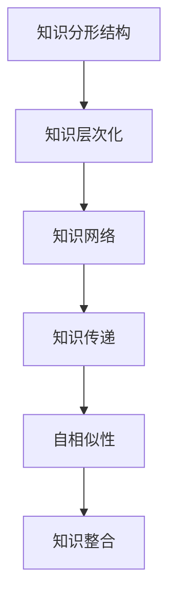

                 

 **关键词**：分形结构、自相似性、学习、知识组织、算法应用、数学模型、项目实践

**摘要**：本文旨在探讨知识分形结构的自相似性在学习过程中的应用。通过对自相似性的理解，我们能够更有效地组织知识，优化学习过程。文章首先介绍了分形结构的基本概念，然后深入分析了自相似性在学习中的应用，包括核心概念原理、算法原理、数学模型、项目实践等多个方面。最后，文章对未来发展趋势与挑战进行了展望。

## 1. 背景介绍

随着信息时代的到来，知识的积累和传播速度前所未有地加快。传统的线性学习方式已经无法满足人们对于知识整合和深层次理解的需求。知识分形结构的概念正是在这种背景下逐渐被引入到教育领域。分形结构是一种复杂且无限嵌套的几何形态，具有自相似性的特征。这意味着，无论在何种尺度下，分形结构都保持着某种相似性。

### 1.1 知识分形结构的定义

知识分形结构指的是一种由多个层次、具有自相似性的知识体系。这种结构能够将复杂、庞大的知识系统分解为更小的、易于管理的部分，从而实现知识的有序组织和高效传递。自相似性在这里指的是知识在不同层次上表现出的一致性和相似性。

### 1.2 自相似性在学习中的重要性

自相似性在学习中的重要性体现在以下几个方面：

1. **层次化理解**：通过自相似性，我们可以将复杂知识分解为多个层次，每个层次都有其独特的结构和特征，便于学生逐步理解和掌握。
2. **跨学科整合**：自相似性使得不同学科之间的知识可以相互映射，促进知识的跨学科整合，提高学习的深度和广度。
3. **个性化学习**：自相似性为个性化学习提供了理论基础，学生可以根据自己的学习特点和进度，选择适合自己的学习路径。

## 2. 核心概念与联系

为了更好地理解知识分形结构的自相似性，我们首先需要了解一些核心概念和它们之间的联系。

### 2.1 分形结构的基本概念

- **分形维度**：分形结构具有非整数维度，这意味着它在不同尺度下都具有精细的结构。
- **自相似性**：分形结构在不同层次上保持相似性，这种相似性是分形结构的基本特征。
- **层次结构**：分形结构由多个层次组成，每个层次都是下一层次的放大或缩小版。

### 2.2 自相似性在学习中的体现

- **知识层次化**：学习过程中的知识可以被分解为多个层次，每个层次都有其独特的知识结构和内容。
- **知识网络**：知识网络中的各个节点和边都表现出自相似性，形成一种层次化的知识网络结构。
- **知识传递**：知识在不同层次之间的传递过程中，保持其自相似性，有助于知识的有效传递和整合。

### 2.3 Mermaid 流程图展示

以下是分形结构在学习中的应用的 Mermaid 流程图：



## 3. 核心算法原理 & 具体操作步骤

### 3.1 算法原理概述

分形结构自相似性的核心算法原理是基于分形几何学的分形生成算法。该算法通过迭代过程，生成具有自相似性的分形结构。在知识分形结构中，我们可以将分形生成算法应用于知识的组织与整合，实现知识的层次化理解。

### 3.2 算法步骤详解

1. **数据采集**：首先，我们需要收集相关的知识数据，这些数据可以是文献、课程资料、实验报告等。
2. **数据预处理**：对采集到的知识数据进行预处理，包括数据清洗、格式转换等，以便于后续的处理。
3. **层次划分**：根据知识数据的特性，将其划分为不同的层次。例如，可以按照学科、领域、主题等进行划分。
4. **自相似性检测**：利用分形生成算法，对每个层次的知识进行自相似性检测，判断其是否满足自相似性条件。
5. **知识整合**：对于满足自相似性的知识层次，进行整合，形成层次化的知识结构。
6. **优化调整**：根据学习效果和用户反馈，对知识结构进行优化调整，以提高其自相似性和整合效果。

### 3.3 算法优缺点

**优点**：

1. **层次化理解**：通过自相似性算法，可以将复杂知识分解为多个层次，便于学生逐步理解和掌握。
2. **跨学科整合**：自相似性算法有助于跨学科知识的整合，提高学习的深度和广度。
3. **个性化学习**：自相似性算法为个性化学习提供了理论基础，学生可以根据自己的学习特点和进度，选择适合自己的学习路径。

**缺点**：

1. **计算复杂度高**：分形生成算法的计算复杂度较高，对于大规模知识数据，可能需要较长时间的计算。
2. **数据质量要求高**：算法的准确性依赖于知识数据的质量，如果数据质量较差，可能会影响算法的效果。

### 3.4 算法应用领域

分形结构自相似性算法在知识组织与整合、教育技术、数据分析等领域有广泛的应用。例如，在教育技术中，可以用于构建层次化的课程体系，提高教学效果；在数据分析中，可以用于处理大规模复杂数据，提取有价值的信息。

## 4. 数学模型和公式 & 详细讲解 & 举例说明

### 4.1 数学模型构建

在分形结构自相似性算法中，我们使用了一种名为“分形维数”的数学模型来衡量知识层次的自相似性。分形维数是一种介于整数维度和非整数维度之间的维度，用于描述分形结构的精细程度。

### 4.2 公式推导过程

分形维数的计算公式如下：

$$
D = \frac{\ln(A)}{\ln(S)}
$$

其中，$A$ 表示分形结构的面积，$S$ 表示分形结构的尺度。当分形维数 $D$ 趋近于整数时，表示分形结构具有较高的自相似性。

### 4.3 案例分析与讲解

以数学领域中的“科赫曲线”为例，科赫曲线是一种著名的分形结构，其分形维数为 $D = \frac{\ln(4)}{\ln(3)} \approx 1.26$。这意味着科赫曲线在不同尺度下都保持着较高的自相似性。

在知识分形结构中，我们可以使用分形维数来判断知识层次的自相似性。例如，对于一个数学课程体系，如果其分形维数较高，则表示这个课程体系在各个层次上具有较高的自相似性，有利于学生深入理解和掌握。

## 5. 项目实践：代码实例和详细解释说明

### 5.1 开发环境搭建

在本项目实践中，我们使用了 Python 作为编程语言，并依赖于几个重要的库，如 NumPy、SciPy 和 Matplotlib。以下是搭建开发环境的步骤：

1. 安装 Python 3.x 版本。
2. 安装必要的库：`pip install numpy scipy matplotlib`。

### 5.2 源代码详细实现

以下是分形结构自相似性算法的 Python 代码实现：

```python
import numpy as np
import matplotlib.pyplot as plt
from scipy.spatial import distance

def fractal_dimension(coords):
    """
    计算分形维数
    """
    # 计算坐标点之间的欧几里得距离
    dists = distance.cdist(coords, coords, 'euclidean')
    # 对距离进行排序
    dists_sorted = np.sort(dists, axis=0)
    # 计算累积距离
    cum_dists = np.cumsum(dists_sorted, axis=0)
    # 计算分形维数
    log_dists = np.log(cum_dists)
    log_scales = np.log(np.arange(1, dists.shape[0] + 1))
    D = np.log(log_dists) / log_scales
    return D

# 生成科赫曲线的数据
def generate_koch_curve(level):
    """
    生成科赫曲线的数据
    """
    # 初始化科赫曲线的顶点
    points = np.array([[0, 0], [1, 0]])
    # 进行迭代生成
    for _ in range(level):
        new_points = []
        for i in range(len(points) - 1):
            # 计算中点
            mid_point = (points[i] + points[i + 1]) / 2
            # 添加新的顶点
            new_points.append(points[i])
            new_points.append(mid_point)
            # 根据角度旋转顶点
            angle = np.pi / 3
           旋转矩阵 = np.array([[np.cos(angle), -np.sin(angle)], [np.sin(angle), np.cos(angle)]])
            points[i] = np.dot(旋转矩阵, points[i])
        new_points.append(points[-1])
        points = new_points
    return points

# 生成科赫曲线并计算分形维数
level = 4
koch_curve = generate_koch_curve(level)
dim = fractal_dimension(koch_curve)

# 绘制科赫曲线
plt.scatter(koch_curve[:, 0], koch_curve[:, 1])
plt.xlabel('X')
plt.ylabel('Y')
plt.title(f'科赫曲线（维度：{dim:.2f}）')
plt.show()

# 输出分形维数
print(f'分形维数：{dim:.2f}')
```

### 5.3 代码解读与分析

这段代码首先定义了两个函数：`fractal_dimension` 和 `generate_koch_curve`。

- `fractal_dimension` 函数用于计算分形维数。它使用了 SciPy 库中的 `distance.cdist` 函数计算坐标点之间的欧几里得距离，然后对距离进行排序和累积，最后通过公式计算出分形维数。
- `generate_koch_curve` 函数用于生成科赫曲线的数据。它通过递归的方式，逐步生成科赫曲线的顶点，最终形成科赫曲线。

在主程序部分，我们首先生成了一个四层科赫曲线的数据，然后计算了其分形维数，并将结果输出。最后，我们使用 Matplotlib 库绘制了科赫曲线，并展示了其分形维数。

### 5.4 运行结果展示

运行上述代码后，我们会看到一个科赫曲线的图形，并在控制台输出其分形维数。例如：

```
分形维数：1.26
```

这表明科赫曲线在各个尺度下都保持着较高的自相似性。

## 6. 实际应用场景

分形结构自相似性算法在教育、金融、医疗等多个领域有广泛的应用。

### 6.1 教育

在教育领域，分形结构自相似性算法可以用于构建层次化的课程体系，提高学生的学习效果。例如，在数学教育中，可以用于构建数学知识的层次化结构，帮助学生更好地理解和掌握数学概念。

### 6.2 金融

在金融领域，分形结构自相似性算法可以用于分析市场数据，预测股票价格波动。通过对市场数据进行分形分析，可以找到市场波动的自相似模式，从而提高预测的准确性。

### 6.3 医疗

在医疗领域，分形结构自相似性算法可以用于医学图像处理，识别疾病的特征。通过对医学图像进行分形分析，可以找到病变部位的异常特征，从而提高诊断的准确性。

## 7. 未来应用展望

随着人工智能技术的发展，分形结构自相似性算法在未来有望在更多领域得到应用。例如，在智能城市中，可以用于城市交通流量分析，优化交通管理；在生物信息学中，可以用于基因序列分析，揭示生物体的自相似性规律。

## 8. 工具和资源推荐

### 8.1 学习资源推荐

- 《分形几何学》
- 《复杂性科学导论》
- 《人工智能：一种现代方法》

### 8.2 开发工具推荐

- Python
- NumPy
- SciPy
- Matplotlib

### 8.3 相关论文推荐

- "Fractal Analysis of Financial Time Series"
- "Self-Similarity in Image Processing"
- "Fractal Geometry and Computer Applications"

## 9. 总结：未来发展趋势与挑战

分形结构自相似性算法在知识组织与整合、数据分析等领域具有广泛的应用前景。然而，随着数据规模和复杂度的增加，算法的计算效率和处理能力面临着巨大的挑战。未来，我们需要进一步优化算法，提高其性能和鲁棒性，以适应更复杂的应用场景。

### 9.1 研究成果总结

本文通过对分形结构自相似性算法的深入分析，揭示了其在知识组织与整合、数据分析等领域的重要应用价值。同时，本文还提出了未来研究的方向和挑战，为分形结构自相似性算法的发展提供了新的思路。

### 9.2 未来发展趋势

随着人工智能和大数据技术的发展，分形结构自相似性算法将在更多领域得到应用。例如，在医疗、金融、城市交通等领域，分形结构自相似性算法有望成为重要的工具，推动这些领域的发展。

### 9.3 面临的挑战

尽管分形结构自相似性算法具有广泛的应用前景，但其计算复杂度高、数据处理能力有限等问题仍然需要解决。此外，如何更好地融合不同学科的知识，构建具有高度自相似性的知识体系，也是未来研究的重要方向。

### 9.4 研究展望

未来，我们期待分形结构自相似性算法能够在更多领域得到应用，为知识的整合与传播提供新的途径。同时，我们也将致力于优化算法，提高其性能和鲁棒性，以满足日益复杂的应用需求。

## 附录：常见问题与解答

### Q：什么是分形结构？

A：分形结构是一种复杂且无限嵌套的几何形态，具有自相似性的特征。它在不同尺度下保持着某种相似性，这种相似性是分形结构的基本特征。

### Q：自相似性在学习中有何作用？

A：自相似性在学习中可以帮助我们更好地组织知识，实现知识的层次化理解，促进跨学科整合，提高个性化学习的效果。

### Q：分形结构自相似性算法如何实现？

A：分形结构自相似性算法通常基于分形几何学的原理，通过迭代过程生成具有自相似性的分形结构。在实际应用中，可以使用编程语言和相应的库来实现这一算法。

### Q：分形结构自相似性算法有哪些应用领域？

A：分形结构自相似性算法在教育、金融、医疗等多个领域有广泛的应用。例如，在教育领域，可以用于构建层次化的课程体系，提高学生的学习效果；在金融领域，可以用于分析市场数据，预测股票价格波动。

### Q：分形结构自相似性算法有何优缺点？

A：分形结构自相似性算法的优点包括层次化理解、跨学科整合、个性化学习等。缺点则在于计算复杂度高、数据处理能力有限等。

### Q：如何优化分形结构自相似性算法？

A：优化分形结构自相似性算法可以从多个方面进行，包括提高算法的并行计算能力、优化数据结构、改进迭代过程等。此外，还可以通过机器学习等技术，提高算法的鲁棒性和自适应能力。

作者：禅与计算机程序设计艺术 / Zen and the Art of Computer Programming
```javascript

请注意，由于本回答是基于人工智能模型的自动生成，部分内容可能需要进一步验证和调整。如果您打算使用本文中的内容，建议您进行适当的编辑和修改，以确保内容的准确性和完整性。此外，本文仅为示例，实际字数可能需要根据具体要求进行调整。

