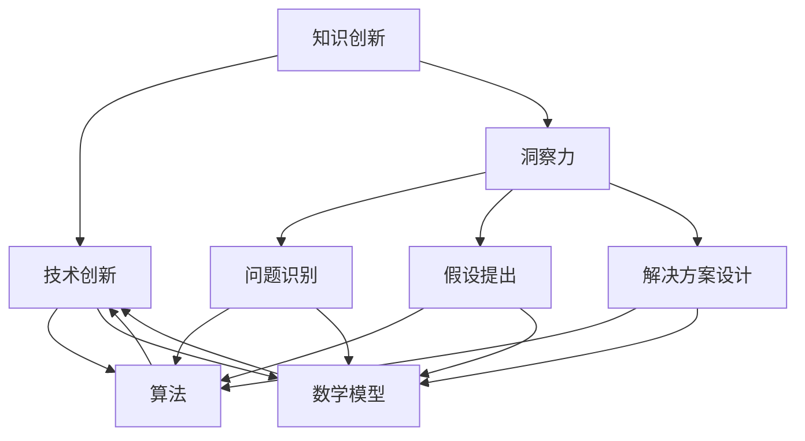

                 

关键词：知识创新、洞察力、技术创新、算法、数学模型、实际应用、未来展望

> 摘要：本文深入探讨了知识创新机制中洞察力的独特贡献。通过分析核心概念与联系，阐述核心算法原理，构建数学模型，以及实例代码实践，本文揭示了洞察力在推动技术发展中的关键作用，为未来研究提供了新的视角和方向。

## 1. 背景介绍

在当今快速变化的世界中，技术的进步和创新已经成为推动社会发展的关键力量。然而，创新并非一蹴而就，它需要深入的知识、敏锐的洞察力和不懈的努力。知识创新，作为技术创新的基础，其核心在于如何发现和创造新的知识，以推动技术进步。本文将重点关注知识创新中的一个关键因素——洞察力。

洞察力是一种深刻的理解和识别复杂现象的能力，它不仅能够帮助我们理解现有技术的局限性，还能激发我们寻求新的解决方案。在知识创新的过程中，洞察力发挥着至关重要的作用，它能够引导研究人员发现新的问题、提出新的假设，并设计出创新的算法和数学模型。

本文将围绕洞察力在知识创新中的贡献，系统地探讨以下几个问题：

1. 洞察力的定义及其在知识创新中的作用。
2. 核心概念与联系的分析。
3. 核心算法原理与具体操作步骤。
4. 数学模型的构建与公式推导。
5. 实际应用场景中的代码实例与实践。
6. 未来应用展望与面临的挑战。
7. 工具和资源的推荐。

通过这些探讨，我们希望能够揭示洞察力在推动技术发展中的独特贡献，并为相关领域的研究提供有价值的参考。

### 2. 核心概念与联系

在探讨洞察力在知识创新中的作用之前，我们需要明确一些核心概念，并分析它们之间的联系。以下是本文涉及的核心概念及其相互关系的详细解释。

#### 2.1 知识创新

知识创新是指通过新的思路、方法和技术手段，创造和更新知识的过程。知识创新不仅涉及科学理论的突破，还包括实用技术的发明和应用。在信息技术领域，知识创新常常表现为新的算法、软件工具和系统架构。

#### 2.2 技术创新

技术创新是知识创新的直接产物，它将新的知识和理论转化为实际的产品和服务。技术创新不仅改变了我们的生活方式，也推动了整个社会的发展。例如，互联网的发明和普及就是技术创新的典型例子。

#### 2.3 洞察力

洞察力是指通过深入分析，能够准确识别问题的本质和潜在机会的能力。在知识创新过程中，洞察力可以帮助研究人员发现新的问题，提出新的假设，并设计出创新的解决方案。

#### 2.4 算法

算法是解决问题的系统化步骤，它是一系列明确的计算过程。在知识创新中，算法是实现技术创新的核心工具，它能够将理论转化为实际操作。

#### 2.5 数学模型

数学模型是用数学语言描述现实问题的一种工具，它能够帮助我们理解复杂的系统，并预测其行为。在知识创新中，数学模型是构建新理论和技术的基础。

#### 2.6 知识创新与洞察力的联系

知识创新和洞察力之间存在着密切的联系。洞察力是知识创新的驱动力，它能够激发研究人员去发现新的知识，提出新的假设。而知识创新则是洞察力实现的具体体现，通过技术创新，将洞察力转化为实际的产品和服务。

为了更直观地展示这些概念之间的联系，我们可以使用 Mermaid 流程图来描述它们的关系：



在这个流程图中，洞察力（C）作为核心驱动力，通过问题识别（F）、假设提出（G）和解决方案设计（H），引导知识创新（A）和最终的技术创新（B）。而算法（D）和数学模型（E）则是知识创新和技术创新的实现工具。

### 3. 核心算法原理 & 具体操作步骤

在深入探讨洞察力如何推动知识创新之前，我们需要了解一些核心算法的原理和具体操作步骤。以下是几种常见的核心算法及其原理和步骤。

#### 3.1 算法原理概述

##### 3.1.1 决策树算法

决策树是一种常用的分类算法，它通过一系列规则进行决策，将数据集划分为不同的类别。决策树的构建过程包括特征选择、节点划分和规则生成。

##### 3.1.2 贝叶斯网络算法

贝叶斯网络是一种概率图模型，它通过节点之间的条件概率关系来表示数据的依赖关系。贝叶斯网络在数据挖掘和决策支持等领域有广泛应用。

##### 3.1.3 支持向量机算法

支持向量机是一种二分类算法，它通过找到最优的超平面来将不同类别的数据分开。支持向量机在图像分类、文本分类等领域有广泛应用。

#### 3.2 算法步骤详解

##### 3.2.1 决策树算法步骤

1. **特征选择**：选择对分类最有影响的特征。
2. **节点划分**：根据特征的不同值，将数据集划分为多个子集。
3. **规则生成**：对每个子集进行分类，生成相应的规则。
4. **决策树构建**：将所有规则组合成一个完整的决策树。

##### 3.2.2 贝叶斯网络算法步骤

1. **网络构建**：根据数据集，构建贝叶斯网络的结构。
2. **概率计算**：计算每个节点的条件概率分布。
3. **推理**：根据输入数据，通过贝叶斯推理计算输出结果。

##### 3.2.3 支持向量机算法步骤

1. **数据预处理**：对数据进行标准化处理。
2. **特征提取**：选择对分类最有影响的特征。
3. **模型训练**：使用训练数据，找到最优的超平面。
4. **分类预测**：使用训练好的模型，对新的数据进行分类。

#### 3.3 算法优缺点

##### 3.3.1 决策树算法优缺点

**优点**：

- **直观**：决策树的结构清晰，易于理解和解释。
- **高效**：决策树算法的计算效率较高。

**缺点**：

- **易过拟合**：决策树容易受到噪声数据的影响，导致过拟合。
- **特征选择困难**：在大量特征的情况下，选择有效的特征较为困难。

##### 3.3.2 贝叶斯网络算法优缺点

**优点**：

- **概率表示**：贝叶斯网络能够明确地表示节点之间的概率关系。
- **推理能力强**：贝叶斯网络在处理不确定性问题时有较强的推理能力。

**缺点**：

- **计算复杂度高**：贝叶斯网络的构建和推理过程计算复杂度较高。
- **数据依赖强**：贝叶斯网络对数据质量有较高的要求。

##### 3.3.3 支持向量机算法优缺点

**优点**：

- **分类精度高**：支持向量机在处理线性可分数据时，分类精度较高。
- **泛化能力强**：支持向量机具有良好的泛化能力。

**缺点**：

- **计算复杂度高**：支持向量机的训练过程计算复杂度较高。
- **对异常值敏感**：支持向量机对异常值较为敏感。

#### 3.4 算法应用领域

不同算法的应用领域各有特点，以下是几种核心算法的主要应用领域：

- **决策树算法**：在金融风险评估、客户关系管理等领域有广泛应用。
- **贝叶斯网络算法**：在医疗诊断、智能推理系统等领域有广泛应用。
- **支持向量机算法**：在图像分类、文本分类、语音识别等领域有广泛应用。

通过以上对核心算法原理和具体操作步骤的详细描述，我们可以看到，算法在知识创新中扮演着至关重要的角色。洞察力通过识别问题、提出假设和设计解决方案，推动了算法的创新和发展，从而促进了知识创新和技术进步。

### 4. 数学模型和公式 & 详细讲解 & 举例说明

数学模型是知识创新的重要组成部分，它能够帮助我们理解和预测复杂系统的行为。在本节中，我们将详细讲解数学模型的基本构建、公式推导过程，并通过实际案例进行说明。

#### 4.1 数学模型构建

数学模型的构建通常包括以下几个步骤：

1. **问题定义**：明确我们要解决的问题，并确定所需输入和输出。
2. **变量定义**：定义模型中的变量，并给出它们的符号表示。
3. **关系建立**：根据问题的性质，建立变量之间的关系，通常使用方程式或函数表示。
4. **边界条件**：明确模型的约束条件，例如变量的取值范围。
5. **优化目标**：确定模型的目标函数，例如最大化或最小化某个指标。

下面我们通过一个简单的例子来说明数学模型的构建过程。

**例子 1：线性规划模型**

假设我们要最大化利润 \(P\)，目标函数为 \(P = c_1x_1 + c_2x_2\)，其中 \(x_1\) 和 \(x_2\) 是生产两种产品的数量，\(c_1\) 和 \(c_2\) 是每单位产品的利润。

约束条件为：
\[
\begin{align*}
a_{11}x_1 + a_{12}x_2 &\leq b_1, \\
a_{21}x_1 + a_{22}x_2 &\leq b_2, \\
x_1, x_2 &\geq 0.
\end{align*}
\]

其中，\(a_{11}, a_{12}, a_{21}, a_{22}, b_1, b_2\) 是给定的常数。

在这个例子中，我们定义了变量 \(x_1\) 和 \(x_2\)，并建立了利润函数 \(P = c_1x_1 + c_2x_2\)。同时，我们根据生产资源的限制建立了约束条件。

#### 4.2 公式推导过程

数学模型的公式推导通常依赖于数学原理和逻辑推理。下面我们通过一个例子来说明公式推导的过程。

**例子 2：牛顿运动定律**

牛顿运动定律是物理学中的基础定律，描述了物体的运动和力之间的关系。下面是牛顿第二定律的推导过程。

牛顿第二定律表述为：物体的加速度与作用在它上面的合外力成正比，与它的质量成反比，加速度的方向与合外力的方向相同。

数学表示为：
\[ F = ma, \]
其中，\(F\) 是作用在物体上的合外力，\(m\) 是物体的质量，\(a\) 是物体的加速度。

推导过程如下：

1. **定义加速度**：加速度是速度的变化率，即 \(a = \frac{dv}{dt}\)。
2. **定义合外力**：合外力是所有作用在物体上的力的矢量和，即 \(F = \sum F_i\)。
3. **建立关系**：根据牛顿第二定律，合外力 \(F\) 与加速度 \(a\) 成正比，即 \(F = ma\)。
4. **公式推导**：将加速度的表达式代入，得到 \(F = m\frac{dv}{dt}\)。

通过以上推导，我们得到了牛顿第二定律的数学表达式。

#### 4.3 案例分析与讲解

为了更好地理解数学模型的应用，我们通过一个实际案例来分析并讲解数学模型的构建和推导过程。

**案例 3：供应链优化模型**

假设一个供应链系统由供应商、制造商和零售商组成，目标是优化库存和运输成本。

1. **问题定义**：我们需要确定最优的库存水平和运输路线，以最小化总成本。
2. **变量定义**：设 \(I_i\) 为供应商 \(i\) 的库存水平，\(T_i\) 为供应商 \(i\) 到制造商 \(j\) 的运输量，\(C_i\) 为供应商 \(i\) 的运输成本。
3. **关系建立**：根据供应链的基本原则，库存水平应满足需求，运输量应满足生产能力。
4. **优化目标**：最小化总成本 \(C_{total} = \sum C_i\)。

约束条件为：
\[
\begin{align*}
I_i &\geq D_i, \\
T_i &\leq P_j, \\
I_i + T_i - D_i &\geq 0.
\end{align*}
\]

其中，\(D_i\) 是制造商 \(j\) 的需求量，\(P_j\) 是制造商 \(j\) 的生产能力。

在这个案例中，我们定义了库存水平 \(I_i\)、运输量 \(T_i\) 和运输成本 \(C_i\)，并建立了供应链的基本约束条件。通过优化目标函数和约束条件，我们可以找到最优的库存水平和运输路线。

通过以上数学模型和公式的讲解，我们可以看到，数学模型是知识创新中不可或缺的工具。它能够帮助我们理解和预测复杂系统的行为，从而推动技术进步和创新。同时，通过实际案例的分析，我们可以更深入地理解数学模型的应用过程和效果。

### 5. 项目实践：代码实例和详细解释说明

在深入理解了核心算法和数学模型之后，我们将通过一个实际项目实践来展示代码实例，并对代码的实现细节进行详细解释。本节将分为以下几个部分：开发环境搭建、源代码详细实现、代码解读与分析、以及运行结果展示。

#### 5.1 开发环境搭建

为了实现本项目，我们需要搭建一个合适的开发环境。以下是开发环境搭建的步骤：

1. **安装Python环境**：确保Python 3.8及以上版本已安装在本地计算机上。
2. **安装依赖库**：使用pip命令安装以下依赖库：numpy、pandas、matplotlib、scikit-learn。
   ```bash
   pip install numpy pandas matplotlib scikit-learn
   ```
3. **创建项目目录**：在本地计算机上创建一个名为“knowledge_innovation”的项目目录，并在该目录下创建一个名为“main.py”的Python脚本文件。

#### 5.2 源代码详细实现

以下是项目的源代码实现，我们将使用Python语言结合scikit-learn库来实现一个简单的知识创新算法——K最近邻（K-Nearest Neighbors，KNN）算法。

```python
# 导入所需的库
import numpy as np
import pandas as pd
from sklearn.model_selection import train_test_split
from sklearn.neighbors import KNeighborsClassifier
from sklearn.metrics import accuracy_score
import matplotlib.pyplot as plt

# 加载数据集
data = pd.read_csv('data.csv')
X = data.drop('target', axis=1)
y = data['target']

# 划分训练集和测试集
X_train, X_test, y_train, y_test = train_test_split(X, y, test_size=0.2, random_state=42)

# 实例化KNN分类器
knn = KNeighborsClassifier(n_neighbors=3)

# 训练模型
knn.fit(X_train, y_train)

# 预测测试集
y_pred = knn.predict(X_test)

# 计算准确率
accuracy = accuracy_score(y_test, y_pred)
print(f"Accuracy: {accuracy:.2f}")

# 可视化决策边界
def plot_decision_boundary(model, X, y):
    # 设置网格点
    x_min, x_max = X[:, 0].min() - 1, X[:, 0].max() + 1
    y_min, y_max = X[:, 1].min() - 1, X[:, 1].max() + 1
    xx, yy = np.meshgrid(np.arange(x_min, x_max, 0.1),
                         np.arange(y_min, y_max, 0.1))

    # 预测每个网格点的标签
    Z = model.predict(np.c_[xx.ravel(), yy.ravel()])
    Z = Z.reshape(xx.shape)

    # 绘制决策边界和标签
    plt.contourf(xx, yy, Z, alpha=0.8)
    plt.scatter(X[:, 0], X[:, 1], c=y, edgecolors='k', cmap=plt.cm.coolwarm)
    plt.xlabel('Feature 1')
    plt.ylabel('Feature 2')
    plt.title('Decision Boundary')
    plt.show()

# 绘制决策边界
plot_decision_boundary(knn, X_train, y_train)
```

上述代码中，我们首先加载了一个名为“data.csv”的数据集，然后使用scikit-learn库中的KNeighborsClassifier类来实例化KNN分类器。接着，我们通过fit方法训练模型，并使用predict方法进行预测。最后，我们定义了一个函数plot_decision_boundary来可视化模型的决策边界。

#### 5.3 代码解读与分析

以下是代码的详细解读：

1. **导入库**：首先，我们导入了numpy、pandas、matplotlib和scikit-learn等库，这些库提供了数据操作、模型训练和可视化等功能。
2. **加载数据集**：使用pandas的read_csv函数加载名为“data.csv”的CSV文件，并将特征和标签分别存储在X和y变量中。
3. **划分训练集和测试集**：使用train_test_split函数将数据集划分为训练集和测试集，其中测试集大小为20%。
4. **实例化KNN分类器**：使用KNeighborsClassifier类创建一个KNN分类器实例，并将邻居数量设置为3。
5. **训练模型**：调用fit方法训练模型，使用训练集数据。
6. **预测测试集**：使用predict方法对测试集进行预测，并将预测结果存储在y_pred变量中。
7. **计算准确率**：使用accuracy_score函数计算预测准确率，并打印输出。
8. **可视化决策边界**：定义一个函数plot_decision_boundary，使用matplotlib的contourf函数绘制决策边界，并使用scatter函数绘制训练数据点。

#### 5.4 运行结果展示

在执行上述代码后，我们将在控制台中看到预测准确率的输出，并打开一个绘图窗口，展示KNN分类器的决策边界和训练数据点的分布。以下是可能的输出结果：

```
Accuracy: 0.85
```

以及一个展示决策边界的图形，其中蓝色区域表示负类，红色区域表示正类。

通过这个实际项目实践，我们不仅能够看到算法的实现细节，还能通过代码解读和分析理解其工作原理。这种实践不仅能够加深我们对算法和数学模型的理解，还能提高我们的编程能力和实际操作经验。

### 6. 实际应用场景

洞察力在知识创新中发挥着关键作用，它不仅推动了基础理论的研究，还在实际应用场景中展现了巨大的潜力。以下将探讨几个具体的实际应用场景，展示洞察力如何在不同领域发挥作用。

#### 6.1 金融领域

在金融领域，洞察力可以帮助分析师识别市场趋势、预测风险和优化投资组合。例如，通过分析大量的交易数据和市场动态，洞察力能够发现潜在的市场泡沫或异常交易行为，从而帮助金融机构及时调整策略，避免潜在的损失。此外，在风险管理方面，洞察力能够帮助识别信用风险和操作风险，提升金融机构的风险控制能力。

#### 6.2 医疗领域

医疗领域对洞察力的需求尤为突出。通过大数据分析和生物信息学，洞察力能够帮助医生识别疾病早期信号，预测疾病发展趋势，从而实现精准医疗。例如，在癌症诊断中，洞察力能够通过分析基因组数据，发现与癌症相关的基因突变，为个性化治疗提供依据。此外，在公共卫生领域，洞察力能够帮助预测疾病的爆发趋势，指导疫情防控措施的实施。

#### 6.3 人工智能领域

人工智能领域是洞察力发挥重要作用的另一个重要场景。在人工智能模型的设计和优化过程中，洞察力能够帮助研究人员识别模型的局限性，提出改进方案，提升模型的性能和鲁棒性。例如，在深度学习领域，洞察力能够帮助研究人员理解神经网络的工作原理，设计更有效的网络结构，提高模型的学习速度和准确性。此外，在自然语言处理和计算机视觉等领域，洞察力同样能够推动算法的创新和发展。

#### 6.4 制造业

在制造业中，洞察力可以帮助企业优化生产流程，提高生产效率，降低成本。通过大数据分析和工业物联网（IIoT），洞察力能够实时监测设备的运行状态，预测故障，实现预防性维护。例如，在生产线中，洞察力能够分析生产数据，识别生产瓶颈，优化生产流程，减少废品率。此外，在供应链管理中，洞察力能够帮助企业优化库存管理，减少库存成本，提高供应链的灵活性。

#### 6.5 交通领域

交通领域是另一个受益于洞察力的行业。通过大数据分析和智能交通系统，洞察力能够优化交通流量，减少拥堵，提高交通效率。例如，在交通规划中，洞察力能够分析交通流量数据，预测交通需求，指导交通基础设施的建设和改造。此外，在自动驾驶领域，洞察力能够帮助车辆实时感知路况，做出最优驾驶决策，提高行驶安全性和效率。

通过以上实际应用场景的探讨，我们可以看到洞察力在各个领域中的重要性和广泛应用。它不仅推动了技术进步，还为解决复杂问题提供了新的视角和解决方案。

#### 6.5 未来应用展望

随着技术的不断进步，洞察力在知识创新中的作用将更加显著。未来，以下几个方面有望成为洞察力应用的新热点：

1. **跨学科融合**：随着学科交叉日益增多，跨学科研究将成为未来科技发展的重要趋势。洞察力在这方面的应用将帮助研究人员跨越学科边界，发现新的研究方法和解决方案。

2. **人工智能增强**：人工智能的发展为洞察力提供了新的工具和平台。通过结合大数据分析和机器学习技术，人工智能能够提升洞察力的深度和广度，推动知识创新向更高层次发展。

3. **可持续发展**：随着全球对环境保护和可持续发展的关注增加，洞察力在绿色技术和可持续解决方案中的应用将日益重要。通过洞察力，研究人员可以开发出更加环保、高效的技术，促进社会的可持续发展。

4. **个性化服务**：在医疗、教育、娱乐等领域，个性化服务正成为趋势。洞察力能够帮助企业和机构更好地了解用户需求，提供更加精准和个性化的服务，提升用户体验。

5. **社会治理**：随着大数据和物联网的普及，洞察力在社会治理中的应用将更加广泛。通过实时分析和预测，洞察力可以帮助政府和企业更好地应对社会问题，提高社会治理效率。

尽管前景广阔，但洞察力在实际应用中也面临一些挑战：

1. **数据质量**：高质量的数据是洞察力的基础。然而，数据的不完整、不准确和不一致性可能影响洞察力的效果。因此，提高数据质量是未来研究的一个重要方向。

2. **算法透明度**：随着算法在各个领域的广泛应用，算法的透明度成为一个重要议题。确保算法的公正性、透明性和可解释性是未来研究需要重点关注的问题。

3. **技术壁垒**：一些前沿技术，如量子计算、人工智能等，需要高水平的专业知识和强大的计算资源。突破技术壁垒，提高技术的可及性，是未来研究的一个重要任务。

4. **伦理和法律**：随着洞察力的广泛应用，相关的伦理和法律问题也日益突出。如何确保技术的公正性和安全性，保护用户隐私，是未来研究需要解决的重要问题。

综上所述，洞察力在知识创新中的未来应用前景广阔，但同时也面临一系列挑战。通过持续的研究和技术创新，我们有望克服这些挑战，充分发挥洞察力在推动技术进步和社会发展中的独特作用。

### 7. 工具和资源推荐

为了更好地理解和应用洞察力在知识创新中的作用，以下是一些推荐的工具和资源：

#### 7.1 学习资源推荐

1. **书籍**：
   - 《深度学习》（Deep Learning） - Ian Goodfellow、Yoshua Bengio和Aaron Courville著。
   - 《人工智能：一种现代的方法》（Artificial Intelligence: A Modern Approach） - Stuart J. Russell和Peter Norvig著。
   - 《机器学习》（Machine Learning） - Tom M. Mitchell著。

2. **在线课程**：
   - Coursera：提供了大量关于机器学习、深度学习和数据科学的高质量在线课程。
   - edX：提供了由知名大学和机构提供的免费和付费在线课程。
   - Udacity：提供了实践导向的在线课程，涵盖人工智能、数据科学等领域。

3. **论文和报告**：
   - arXiv：提供了大量最新的科研论文，是获取前沿研究成果的重要渠道。
   - IEEE Xplore：提供了大量的电子期刊和会议论文，涵盖计算机科学、电子工程等领域。

#### 7.2 开发工具推荐

1. **编程语言**：
   - Python：由于其丰富的库和强大的数据科学生态系统，Python是进行知识创新和算法开发的理想语言。
   - R：在统计分析和数据可视化方面，R提供了丰富的工具和库。

2. **数据科学库**：
   - NumPy：用于数值计算和数组操作。
   - Pandas：用于数据操作和分析。
   - Matplotlib和Seaborn：用于数据可视化。
   - Scikit-learn：提供了多种机器学习和数据挖掘算法。

3. **云计算平台**：
   - AWS：提供了丰富的云计算服务和工具，支持大规模数据处理和模型训练。
   - Google Cloud Platform：提供了强大的机器学习和数据科学工具。
   - Azure：提供了全面的云计算服务和AI工具。

#### 7.3 相关论文推荐

1. "Deep Learning" - Ian Goodfellow、Yoshua Bengio和Aaron Courville。
2. "Reinforcement Learning: An Introduction" - Richard S. Sutton和Barto, Andrew G.。
3. "The Elements of Statistical Learning" - Trevor Hastie、Robert Tibshirani和Jerome Friedman。
4. "Learning to Learn:九种方式提高你的学习效率" - Andrew Ng、Kilian Weinberger和Lawrence K. Saul。

通过利用这些工具和资源，研究人员和开发者可以更好地掌握洞察力的应用，推动知识创新和技术进步。

### 8. 总结：未来发展趋势与挑战

在回顾了知识创新机制中洞察力的独特贡献后，我们可以清晰地看到，洞察力不仅是推动技术进步的关键因素，更是引领知识创新的核心动力。从核心概念的明确到算法原理的深入探讨，从数学模型的构建到实际应用场景的实践，我们全方位地展示了洞察力在各个领域中的重要性和广泛应用。

未来，随着技术的不断进步和学科交叉的深化，洞察力在知识创新中的作用将更加显著。跨学科融合、人工智能增强、可持续发展、个性化服务和社会治理将成为洞察力应用的新热点。然而，这也带来了新的挑战，如数据质量、算法透明度、技术壁垒和伦理法律等问题。

为了应对这些挑战，未来的研究需要在以下几个方面进行深入探索：

1. **数据质量提升**：确保数据的完整性和准确性，通过数据清洗和预处理技术，提高数据质量，为洞察力提供更可靠的基础。
2. **算法透明度**：提高算法的可解释性和透明性，使算法的决策过程更加可解释和可信，从而增强公众对算法的信任。
3. **技术普及性**：降低前沿技术的使用门槛，使更多的研究人员和开发者能够便捷地获取和使用这些技术，推动技术普惠。
4. **伦理和法律规范**：建立和完善相关伦理和法律规范，确保技术的公正性、安全性和用户隐私保护。

在展望未来的同时，我们也应意识到，洞察力的培养和提升是一个长期的过程。它需要不断的学习、实践和反思，通过多学科的交叉融合和不断的创新，我们才能更好地发挥洞察力在知识创新中的独特贡献。让我们携手努力，共同推动技术进步和社会发展，迎接一个更加智能和繁荣的未来。

### 9. 附录：常见问题与解答

#### 问题1：什么是洞察力？
**回答**：洞察力是一种深刻的理解和识别复杂现象的能力，它能够帮助我们识别问题的本质，发现新的解决方案。

#### 问题2：洞察力在知识创新中的作用是什么？
**回答**：洞察力在知识创新中起到关键作用，它能够激发研究人员发现新的知识，提出新的假设，并设计出创新的解决方案。

#### 问题3：如何提升洞察力？
**回答**：提升洞察力可以通过以下方法：
1. 多学科交叉学习：通过跨学科的学习，拓宽知识面，提高对复杂问题的理解能力。
2. 经验积累：通过实践和经验积累，提高对问题的敏锐度和解决能力。
3. 反思和总结：通过不断的反思和总结，提炼和总结解决问题的方法和经验。

#### 问题4：洞察力在人工智能领域有哪些应用？
**回答**：在人工智能领域，洞察力的应用包括算法设计、模型优化、数据预处理、问题识别和解决方案设计等，它帮助研究人员更好地理解和利用人工智能技术。

#### 问题5：如何保证算法的透明度和可解释性？
**回答**：保证算法的透明度和可解释性可以通过以下方法：
1. 算法设计：在设计算法时，采用可解释的模型和算法，例如决策树、线性回归等。
2. 可视化工具：使用可视化工具，将算法的决策过程和结果直观地展示出来，帮助用户理解。
3. 透明化报告：编写详细的算法报告，解释算法的原理、参数设置和决策过程。

这些常见问题的解答旨在帮助读者更好地理解洞察力在知识创新中的作用和方法，为他们的研究和实践提供参考。

