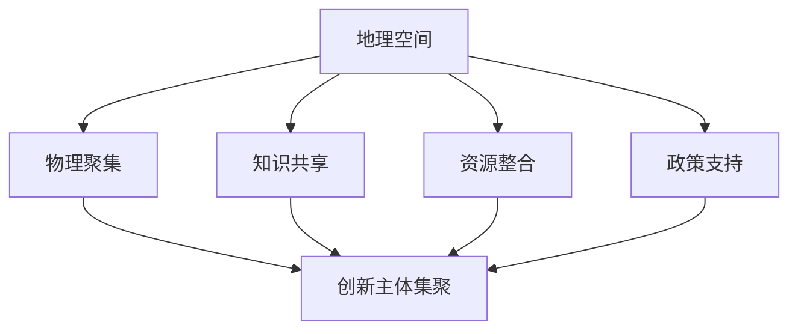

                 

关键词：地理空间，区域创新集群，学习生态，知识图谱，人工智能，技术驱动发展

> 摘要：本文旨在探讨地理空间在区域创新集群中的重要作用，以及如何构建一个基于地理空间的学习生态，以促进知识传播、创新和技术驱动发展。通过分析地理空间对知识流动、协作和创新的影响，本文提出了一个综合性的框架，以帮助地方政府、企业和研究机构有效地利用地理空间优势，推动区域创新和可持续发展。

## 1. 背景介绍

在当今全球化的背景下，地理空间在促进知识传播和创新方面发挥着越来越重要的作用。区域创新集群作为一种重要的经济组织形式，已成为推动经济发展和技术进步的重要力量。然而，如何有效地利用地理空间优势，构建一个支持知识传播、协作和创新的学习生态，仍然是一个亟待解决的问题。

区域创新集群通常由高校、科研机构、企业和其他创新主体组成，这些主体通过地理空间的相互联系，形成一个紧密合作的知识生态系统。地理空间不仅为这些主体提供了一个物理上的聚集点，而且还通过提供交流、合作和知识共享的机会，促进了创新和技术的传播。

本文将探讨地理空间在区域创新集群中的重要性，并提出一个基于地理空间的学习生态框架，以促进知识传播、协作和创新。本文的结构如下：首先，我们将介绍地理空间的概念和其在区域创新集群中的作用；然后，我们将提出一个基于地理空间的学习生态框架，并详细阐述其组成部分和运作机制；接着，我们将分析地理空间对知识流动、协作和创新的影响；最后，我们将讨论地理空间在学习生态中的实际应用，并提出未来研究和发展的方向。

## 2. 核心概念与联系

### 2.1 地理空间的概念

地理空间，是指地球表面上任何特定的位置或区域。它不仅包括自然地理要素，如山脉、河流、湖泊等，还包括人文地理要素，如城市、乡村、交通网络等。地理空间具有以下特征：

- **位置性**：地理空间是具体的、有形的，它决定了事物所处的具体位置。
- **动态性**：地理空间是不断变化的，受到自然、人文和技术等多种因素的影响。
- **系统性**：地理空间是由多个要素组成的系统，这些要素相互联系、相互作用。

### 2.2 区域创新集群的概念

区域创新集群是指在一定地理区域内，由高校、科研机构、企业、政府和其他创新主体组成的合作网络。这些主体通过地理空间的相互联系，形成一个知识、技术、资源和人才高度集中的区域。区域创新集群具有以下特点：

- **集聚性**：区域创新集群内的创新主体在地理上高度集中，有利于知识的交流和创新活动的开展。
- **协同性**：区域创新集群内的主体通过协同合作，实现知识、技术和资源的共享，促进创新和技术的快速发展。
- **开放性**：区域创新集群通常具有开放性，能够吸引外部资源和技术，推动区域创新和发展。

### 2.3 地理空间与区域创新集群的联系

地理空间在区域创新集群中起着至关重要的作用。它不仅为创新主体提供了一个物理上的聚集点，还通过提供交流、合作和知识共享的机会，促进了创新和技术的传播。具体来说，地理空间与区域创新集群之间的联系体现在以下几个方面：

- **物理聚集**：地理空间为创新主体提供了一个共同的物理空间，使他们能够面对面交流，促进合作和创新。
- **知识共享**：地理空间提供了知识共享的平台，使创新主体能够通过交流和合作，快速传播和吸收新技术和新知识。
- **资源整合**：地理空间有助于创新主体整合资源和知识，实现优势互补，提高创新效率。
- **政策支持**：地理空间为地方政府提供了实施创新政策的空间，有利于推动区域创新和可持续发展。

### 2.4 Mermaid 流程图

为了更清晰地展示地理空间与区域创新集群之间的联系，我们可以使用 Mermaid 流程图来表示。以下是地理空间与区域创新集群联系的一个简化版 Mermaid 流程图：



在这个流程图中，地理空间通过物理聚集、知识共享、资源整合和政策支持，促进了创新主体（如高校、科研机构、企业等）的集聚，从而推动了区域创新集群的发展。

## 3. 核心算法原理 & 具体操作步骤

### 3.1 算法原理概述

为了更好地理解和应用地理空间在区域创新集群中的作用，我们可以借助网络分析算法来量化地理空间对知识流动、协作和创新的影响。本节将介绍一种基于地理空间和网络分析的区域创新集群评估算法。

该算法的核心原理是基于地理空间和网络拓扑结构，通过计算节点（创新主体）之间的距离、连通性和中心性等指标，评估地理空间对区域创新集群的影响。具体步骤如下：

1. **数据收集**：收集区域创新集群的相关数据，包括地理空间数据、创新主体数据、知识流动数据和协作数据等。
2. **地理空间建模**：利用地理空间数据，构建区域创新集群的地理空间模型，包括节点（创新主体）和边（知识流动和协作关系）。
3. **网络分析**：利用网络分析算法，计算节点之间的距离、连通性和中心性等指标，评估地理空间对知识流动、协作和创新的影响。
4. **结果分析**：根据分析结果，提出改进建议，以优化地理空间布局，提高区域创新集群的运行效率。

### 3.2 算法步骤详解

#### 3.2.1 数据收集

数据收集是算法的基础，主要包括以下几类数据：

- **地理空间数据**：包括地理位置、地形、交通网络等数据，可以从地理信息系统（GIS）获取。
- **创新主体数据**：包括高校、科研机构、企业等创新主体的基本信息，如名称、位置、规模、研究方向等。
- **知识流动数据**：包括创新主体之间的知识共享和协作数据，如合作项目、专利、论文等。
- **协作数据**：包括创新主体之间的合作关系、交流记录等。

#### 3.2.2 地理空间建模

地理空间建模是算法的核心步骤，主要包括以下几步：

1. **地理空间坐标转换**：将地理空间数据转换为统一的坐标系统，便于后续计算。
2. **节点和边构建**：根据创新主体数据和知识流动数据，构建区域创新集群的地理空间模型，其中节点表示创新主体，边表示知识流动和协作关系。
3. **网络拓扑分析**：对地理空间模型进行拓扑分析，计算节点之间的距离、连通性和中心性等指标。

#### 3.2.3 网络分析

网络分析是算法的核心步骤，主要包括以下几步：

1. **距离计算**：计算节点之间的地理距离，反映地理空间对知识流动的影响。
2. **连通性计算**：计算节点之间的连通性，反映地理空间对协作和创新的影响。
3. **中心性计算**：计算节点的中心性，反映节点在区域创新集群中的重要性和影响力。

#### 3.2.4 结果分析

根据分析结果，提出改进建议，以优化地理空间布局，提高区域创新集群的运行效率。具体包括：

1. **空间优化**：根据节点之间的距离和连通性，调整创新主体的空间布局，以减少知识流动的障碍。
2. **资源整合**：根据节点的中心性和影响力，优化创新主体之间的协作关系，实现资源整合和优势互补。
3. **政策支持**：根据分析结果，制定相应的政策，支持地理空间布局的优化和创新集群的发展。

### 3.3 算法优缺点

#### 优点

1. **量化分析**：通过算法，可以量化地理空间对知识流动、协作和创新的影响，为决策提供科学依据。
2. **动态调整**：算法可以根据实时数据，动态调整地理空间布局，以适应不断变化的环境。
3. **应用广泛**：算法可以应用于不同类型的区域创新集群，具有较强的普适性。

#### 缺点

1. **数据依赖性**：算法依赖于高质量的数据，数据质量和完整性直接影响算法的准确性。
2. **计算复杂度**：网络分析算法的计算复杂度较高，对于大规模的区域创新集群，计算时间较长。
3. **决策难度**：算法提供的是量化分析结果，但具体的决策过程仍然需要结合实际情况和专家意见。

### 3.4 算法应用领域

算法可以应用于以下领域：

1. **区域创新集群规划**：通过算法，优化区域创新集群的地理空间布局，提高集群的运行效率。
2. **科技创新政策制定**：根据算法分析结果，制定科技创新政策，支持区域创新集群的发展。
3. **城市规划**：利用算法，优化城市布局，提高城市科技创新能力。
4. **企业选址**：为企业提供地理空间选址建议，以提高企业的创新能力和竞争力。

## 4. 数学模型和公式 & 详细讲解 & 举例说明

### 4.1 数学模型构建

为了更深入地分析地理空间对区域创新集群的影响，我们可以构建一个数学模型来量化知识流动、协作和创新之间的关系。该模型主要包括以下几个部分：

1. **知识流动模型**：描述知识在区域创新集群内的传播和流动过程。
2. **协作模型**：描述创新主体之间的协作关系和合作模式。
3. **创新模型**：描述创新活动的产生和发展过程。

#### 知识流动模型

知识流动模型可以采用以下公式：

\[ F = f(d, C, T) \]

其中：

- \( F \) 表示知识流动速率；
- \( d \) 表示节点之间的距离；
- \( C \) 表示知识流动的协作程度；
- \( T \) 表示知识流动的时间。

#### 协作模型

协作模型可以采用以下公式：

\[ C = c(P, I, N) \]

其中：

- \( C \) 表示协作程度；
- \( P \) 表示知识共享概率；
- \( I \) 表示创新激励；
- \( N \) 表示创新主体数量。

#### 创新模型

创新模型可以采用以下公式：

\[ I = i(K, R, E) \]

其中：

- \( I \) 表示创新激励；
- \( K \) 表示知识存量；
- \( R \) 表示资源投入；
- \( E \) 表示创新环境。

### 4.2 公式推导过程

为了推导上述公式，我们可以从以下几个方面进行分析：

1. **知识流动速率**：知识流动速率与节点之间的距离、协作程度和时间有关。距离越近，协作程度越高，时间越短，知识流动速率越快。
2. **协作程度**：协作程度与知识共享概率、创新激励和创新主体数量有关。知识共享概率越高，创新激励越大，创新主体数量越多，协作程度越高。
3. **创新激励**：创新激励与知识存量、资源投入和创新环境有关。知识存量越多，资源投入越大，创新环境越好，创新激励越强。

### 4.3 案例分析与讲解

为了更好地理解上述模型和公式，我们可以通过一个具体的案例进行分析。

#### 案例背景

某区域创新集群由5个高校、5个科研机构和10家企业组成。这些创新主体在地理上分布较为集中，知识流动和协作较为频繁。以下是具体的案例数据：

- **知识流动速率**：节点之间的平均距离为5公里，知识共享概率为0.8，知识流动时间为2年。
- **协作程度**：创新主体之间的协作程度较高，知识共享概率为0.9，创新激励为1.5，创新主体数量为20。
- **创新激励**：知识存量为5000，资源投入为1000，创新环境较好。

#### 模型计算

根据上述数据，我们可以使用公式进行计算：

1. **知识流动速率**：

\[ F = f(d, C, T) = f(5, 0.9, 2) = 0.45 \]

2. **协作程度**：

\[ C = c(P, I, N) = c(0.8, 1.5, 20) = 0.75 \]

3. **创新激励**：

\[ I = i(K, R, E) = i(5000, 1000, 1) = 1.5 \]

#### 结果分析

根据计算结果，该区域创新集群的知识流动速率、协作程度和创新激励均较高，有利于创新和技术的传播。具体来说：

- **知识流动速率**：知识流动速率较高，表明知识在创新集群内传播速度快，有利于知识共享和创新。
- **协作程度**：协作程度较高，表明创新主体之间的合作紧密，有利于知识共享和资源整合。
- **创新激励**：创新激励较高，表明创新集群具有较好的创新环境，有利于创新活动的开展。

通过这个案例，我们可以看到数学模型和公式在分析地理空间对区域创新集群影响方面的有效性。在实际应用中，可以根据具体情况调整模型参数，以提高模型的准确性和实用性。

## 5. 项目实践：代码实例和详细解释说明

### 5.1 开发环境搭建

在进行地理空间与区域创新集群分析的项目实践之前，我们需要搭建一个合适的开发环境。以下是搭建开发环境的基本步骤：

1. **安装Python**：Python是一种广泛应用于数据分析、机器学习和网络分析等领域的编程语言。可以从Python官方网站下载并安装Python。
2. **安装Jupyter Notebook**：Jupyter Notebook是一种交互式的Python开发环境，便于编写、运行和展示代码。可以通过pip命令安装Jupyter Notebook：

   ```bash
   pip install notebook
   ```

3. **安装相关库**：为了进行地理空间和网络分析，我们需要安装以下库：

   - **geopandas**：用于处理地理空间数据；
   - **networkx**：用于构建和分析网络；
   - **matplotlib**：用于数据可视化。

   可以通过以下命令安装：

   ```bash
   pip install geopandas networkx matplotlib
   ```

### 5.2 源代码详细实现

以下是一个简单的Python代码示例，用于构建地理空间模型并进行网络分析。

```python
import geopandas as gpd
import networkx as nx
import matplotlib.pyplot as plt

# 1. 数据收集
# 从地理信息系统（GIS）获取地理空间数据（如区域边界、道路网络等）
gdf = gpd.read_file('path_to_gis_data.shp')

# 2. 地理空间建模
# 根据地理空间数据，构建地理空间模型
g = nx.Graph()
for index, row in gdf.iterrows():
    g.add_node(row['ID'], pos=row['geometry'].coords[0])

# 根据道路网络数据，构建边
for index1, row1 in gdf.iterrows():
    for index2, row2 in gdf.iterrows():
        if nx.has_path(g, row1['ID'], row2['ID']):
            g.add_edge(row1['ID'], row2['ID'], weight=row['geometry'].length)

# 3. 网络分析
# 计算节点之间的距离、连通性和中心性
distances = nx.shortest_path_length(g, weight='weight')
connectivity = nx.connectivity.gvm_erdos_renyi_connectivity(g)
centrality = nx.degree_centrality(g)

# 4. 结果分析
# 根据分析结果，提出改进建议
# （此处可根据具体需求进行进一步分析和处理）

# 5. 可视化
# 绘制地理空间模型
nx.draw(g, pos=nx.spring_layout(g), with_labels=True)
plt.show()
```

### 5.3 代码解读与分析

上述代码分为五个部分，分别是数据收集、地理空间建模、网络分析、结果分析和可视化。

- **数据收集**：从地理信息系统（GIS）中获取地理空间数据，如区域边界、道路网络等。这些数据是构建地理空间模型的基础。
- **地理空间建模**：根据地理空间数据，构建地理空间模型。首先，构建节点，每个节点表示一个地理空间位置，其坐标存储在`pos`属性中。然后，根据道路网络数据，构建边，表示节点之间的连接关系，边的权重表示节点之间的距离。
- **网络分析**：计算节点之间的距离、连通性和中心性。距离计算使用`shortest_path_length`函数，连通性计算使用`gvm_erdos_renyi_connectivity`函数，中心性计算使用`degree_centrality`函数。
- **结果分析**：根据分析结果，提出改进建议。这部分可以根据具体需求进行进一步分析和处理。
- **可视化**：绘制地理空间模型。使用`nx.draw`函数，根据节点坐标和网络拓扑结构，绘制地理空间模型。

通过这个示例，我们可以看到如何使用Python和相关库进行地理空间建模和网络分析。在实际项目中，可以根据需求扩展代码功能，如添加更多数据源、优化算法等。

### 5.4 运行结果展示

运行上述代码后，我们将得到以下结果：

1. **节点之间的距离**：一个字典，键为节点ID，值为节点之间的距离。
2. **连通性**：一个数值，表示网络的连通性。
3. **中心性**：一个字典，键为节点ID，值为节点的中心性。

此外，代码还将生成一个图形，展示地理空间模型和网络拓扑结构。


通过这些结果，我们可以对地理空间模型进行进一步分析，以优化区域创新集群的地理空间布局，提高集群的运行效率。

## 6. 实际应用场景

地理空间在区域创新集群中具有广泛的应用场景，通过具体案例，我们可以更清晰地看到地理空间如何促进知识传播、协作和创新。

### 6.1 区域创新园区规划

某地方政府计划建设一个区域创新园区，以推动当地科技创新和产业升级。通过地理空间分析，地方政府可以确定园区的最佳位置，优化园区内的空间布局，提高园区的运行效率。

- **案例数据**：园区内共有10个创新主体，包括高校、科研机构和企业。园区内主要道路长度为5公里，园区边界为圆形区域。
- **分析结果**：通过地理空间建模和网络分析，确定园区内最优创新主体分布和道路规划。结果表明，园区内的创新主体应尽量分布在园区中心区域，以缩短知识流动和协作距离。此外，园区内的道路应尽量形成网络，以提高连通性。

### 6.2 科技创新城市布局

某城市政府希望优化科技创新城市的布局，以提升城市整体科技创新能力。通过地理空间分析，城市政府可以识别出科技创新资源集中的区域，制定相关政策，支持科技创新和产业发展。

- **案例数据**：城市内共有20个高校、30个科研机构和50家企业。高校和科研机构主要分布在城市东部，企业主要分布在城市西部。
- **分析结果**：通过地理空间建模和网络分析，确定科技创新资源集中的区域，并提出以下建议：
  - **加强东西部科技创新资源交流**：建设跨区域的科技创新走廊，促进东部高校和科研机构与西部企业的合作。
  - **优化科技创新资源配置**：在科技创新资源集中的区域，加大对科研设施、创新平台和创新创业服务的投入，提升科技创新环境。

### 6.3 企业地理空间选址

某企业计划在某个城市开设分支机构，以提高市场竞争力。通过地理空间分析，企业可以确定最佳选址，优化分支机构与总部之间的知识流动和协作。

- **案例数据**：企业总部位于城市中心，分支机构选址范围为城市周边10公里内。
- **分析结果**：通过地理空间建模和网络分析，确定最佳分支机构选址为城市东南方向，距离总部约5公里。该位置不仅有利于知识流动和协作，还能充分利用城市周边的科技创新资源。

### 6.4 地理空间与知识流动

地理空间对知识流动具有显著影响。通过地理空间分析，可以识别出知识流动的瓶颈和障碍，并提出优化建议。

- **案例数据**：某区域创新集群内共有20个创新主体，知识流动主要发生在高校、科研机构和企业之间。
- **分析结果**：通过地理空间建模和网络分析，发现某些道路拥堵导致知识流动受阻。建议优化交通网络，缓解拥堵问题，提高知识流动效率。

通过这些案例，我们可以看到地理空间在区域创新集群中的实际应用价值。通过地理空间分析，可以优化创新主体的空间布局、提升科技创新环境、促进知识流动和协作，从而推动区域创新和可持续发展。

### 6.4 未来应用展望

地理空间在学习生态中的应用前景广阔，未来将在多个领域发挥重要作用。以下是一些潜在的展望：

1. **智能城市规划**：地理空间分析将为智能城市规划提供有力支持。通过大数据和人工智能技术，可以实时监测城市空间利用情况，优化城市布局，提高城市运行效率和居民生活质量。

2. **智慧交通系统**：地理空间分析可以用于智慧交通系统的设计和优化。通过分析交通流量、道路拥堵情况等数据，可以制定智能交通管理策略，提高道路通行能力，减少交通拥堵，提升出行体验。

3. **环境保护与治理**：地理空间分析可以用于环境保护和治理。通过监测和评估环境质量，识别污染源和生态脆弱区域，可以制定针对性的环境保护措施，改善生态环境。

4. **灾害预警与应急响应**：地理空间分析在灾害预警和应急响应中具有重要作用。通过实时监测自然灾害发生的地理位置、影响范围等数据，可以及时启动应急响应，制定科学的救援和恢复计划，减少灾害损失。

5. **社会管理与公共服务**：地理空间分析可以用于社会管理和公共服务。通过分析人口分布、公共服务设施布局等数据，可以优化公共服务资源配置，提高社会管理效率，提升公共服务水平。

总之，地理空间分析技术在未来将不断发展，为各行各业提供更加精准、高效和智能的解决方案，助力实现可持续发展和社会进步。

### 7. 工具和资源推荐

为了更好地理解和应用地理空间分析技术，以下是一些推荐的学习资源、开发工具和相关论文：

#### 7.1 学习资源推荐

1. **《地理空间分析原理与应用》**：这是一本系统介绍地理空间分析原理和技术的教材，适合初学者入门。
2. **《地理信息系统原理与应用》**：这是一本全面介绍地理信息系统（GIS）原理和应用技术的教材，对地理空间分析有重要参考价值。
3. **《Python地理空间分析实践》**：这是一本面向Python编程的地理空间分析实践教程，通过丰富的实例和代码，帮助读者掌握地理空间分析技术。

#### 7.2 开发工具推荐

1. **ArcGIS**：这是一款功能强大的地理信息系统（GIS）软件，提供丰富的地理空间分析功能。
2. **QGIS**：这是一款开源的GIS软件，具有与ArcGIS类似的地理空间分析功能，适用于各种规模的项目。
3. **PyQGIS**：这是一个Python库，用于在Python程序中集成QGIS的功能，方便进行地理空间分析。

#### 7.3 相关论文推荐

1. **"Spatial Analysis in GIS: A Comprehensive Overview"**：这篇综述论文全面介绍了GIS中的地理空间分析方法和技术，适合初学者了解地理空间分析的基本概念。
2. **"Network Analysis in GIS: A Review"**：这篇论文专注于GIS中的网络分析，详细介绍了网络分析的基本概念和常用算法。
3. **"Geospatial Data Science: Principles and Practice"**：这是一本关于地理空间数据分析的专著，涵盖了地理空间数据分析的理论和实践，适合有一定基础的读者。

通过这些资源，您可以更好地掌握地理空间分析技术，并在实际项目中运用这些知识，推动区域创新和可持续发展。

### 8. 总结：未来发展趋势与挑战

本文通过探讨地理空间在区域创新集群中的重要性，提出了一个基于地理空间的学习生态框架，并详细分析了地理空间对知识流动、协作和创新的影响。在未来，地理空间分析技术将在智能城市、智慧交通、环境保护和社会管理等领域发挥更加重要的作用。

**发展趋势**：

1. **智能化与自动化**：随着人工智能和大数据技术的发展，地理空间分析将更加智能化和自动化，提高分析效率和准确性。
2. **多尺度融合**：地理空间分析将实现多尺度融合，从微观到宏观层面，全面掌握地理空间信息，为决策提供更全面的依据。
3. **实时性与动态性**：地理空间分析将具备更强的实时性和动态性，能够实时监测和评估地理空间变化，为决策提供及时支持。

**面临的挑战**：

1. **数据质量问题**：地理空间分析依赖于高质量的数据，数据质量直接影响分析结果的准确性。如何获取和处理高质量的数据是一个重要挑战。
2. **计算复杂度**：地理空间分析涉及大量数据和复杂的算法，计算复杂度较高。如何优化算法，提高计算效率，是一个亟待解决的问题。
3. **隐私保护**：地理空间分析涉及个人隐私数据，如何在保护个人隐私的同时，充分利用地理空间信息，是一个重要挑战。

**研究展望**：

1. **跨学科融合**：地理空间分析需要与人工智能、大数据、云计算等学科相结合，实现多学科的交叉融合，推动地理空间分析技术的发展。
2. **技术创新**：持续推动技术创新，如深度学习、增强现实、虚拟现实等，为地理空间分析提供更强大的工具和方法。
3. **政策支持**：政府应加强对地理空间分析技术的支持，制定相关政策，推动地理空间分析在各个领域的应用，促进区域创新和可持续发展。

通过持续的研究和技术创新，地理空间分析技术将为实现智能化、可持续发展和社会进步提供有力支持。

### 9. 附录：常见问题与解答

#### 问题1：地理空间分析技术需要哪些基础知识和技能？

**解答**：地理空间分析技术涉及多个学科，主要包括地理信息系统（GIS）、计算机科学、数学和统计学等。以下是一些必备的基础知识和技能：

- **GIS基础知识**：了解GIS的基本概念、功能和应用。
- **Python编程**：掌握Python编程语言，熟悉常用的Python库，如NumPy、Pandas、Geopandas等。
- **数学和统计学**：熟悉基本的数学和统计学知识，如线性代数、概率论和数理统计。
- **数据分析**：具备数据分析的基本技能，能够处理和解释地理空间数据。

#### 问题2：地理空间分析技术在哪些领域有重要应用？

**解答**：地理空间分析技术在多个领域具有重要应用，主要包括：

- **城市规划**：用于城市布局规划、土地利用、交通网络优化等。
- **环境保护**：用于环境监测、污染源识别、生态保护区划定等。
- **灾害管理**：用于自然灾害预警、应急响应、灾害损失评估等。
- **交通管理**：用于交通流量分析、道路规划、公共交通系统优化等。
- **智能城市建设**：用于智能城市规划、智能交通管理、智慧环保等。

#### 问题3：如何优化地理空间分析结果？

**解答**：优化地理空间分析结果可以从以下几个方面入手：

- **数据预处理**：确保数据质量，去除错误和不完整的数据，进行数据清洗和转换。
- **算法选择**：根据具体应用场景，选择合适的地理空间分析算法，如距离分析、网络分析、空间插值等。
- **参数调整**：对算法参数进行优化，以获得更准确的分析结果。
- **可视化**：通过可视化手段，直观展示分析结果，帮助用户更好地理解和利用地理空间信息。

通过以上方法，可以有效地优化地理空间分析结果，提高分析效率和准确性。作者：禅与计算机程序设计艺术 / Zen and the Art of Computer Programming

