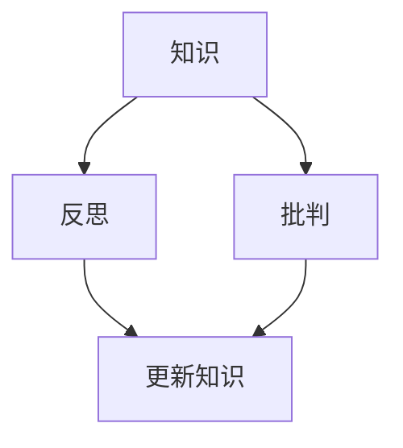
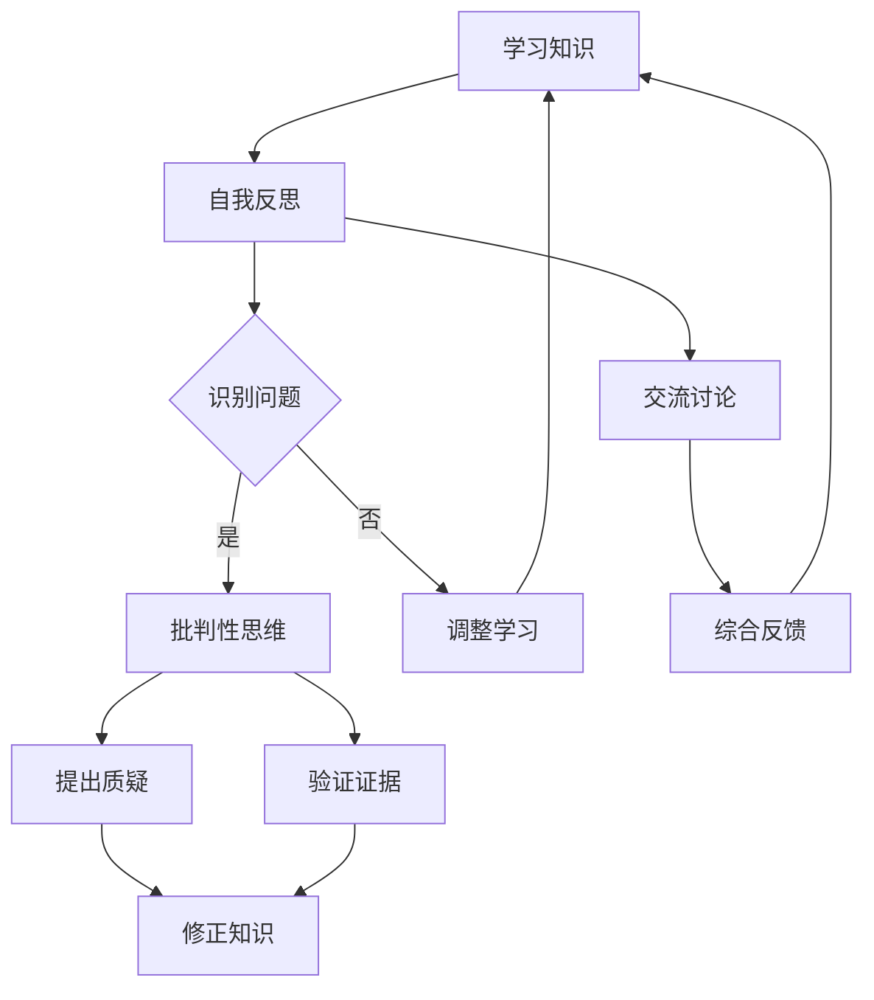

                 

作为一位世界级人工智能专家和计算机领域的权威，我们深知知识在技术发展和创新中的关键作用。然而，知识并非静止不变的，而是不断演进的。本文将探讨如何对知识进行反思和批判，以避免陷入固步自封的困境。

## 1. 背景介绍

在计算机科学和技术领域，知识更新换代的速度越来越快。过去的编程语言和算法可能已经无法满足现代应用的需求。因此，我们需要不断地学习和掌握新的知识和技能，以适应快速变化的技术环境。然而，仅仅学习新知识是不够的，我们还必须对现有的知识进行反思和批判，以确保我们的认知是准确和有效的。

## 2. 核心概念与联系

为了更好地理解知识的反思和批判，我们需要首先了解几个核心概念：

- **知识（Knowledge）**：知识是人们对世界的理解和认知。它包括事实、原理、技能和价值观等。
- **反思（Reflection）**：反思是对自己思维过程和行为的审视和思考。通过反思，我们可以发现自己的盲点和错误，并不断改进。
- **批判（Critique）**：批判是对现有知识和观点的评估和质疑。批判性思维可以帮助我们识别偏见和误导，从而提高知识的准确性。

下面是一个 Mermaid 流程图，展示了这三个概念之间的联系：



## 3. 核心算法原理 & 具体操作步骤

### 3.1 算法原理概述

在计算机科学中，知识的反思和批判可以通过以下算法原理实现：

1. **自我反思算法**：通过记录和分析自己的思维过程，识别出潜在的错误和偏见。
2. **批判性思维算法**：对现有的知识进行质疑和评估，识别出不准确和不完整的信息。

### 3.2 算法步骤详解

#### 自我反思算法

1. **记录思维过程**：通过日志或笔记记录自己的思考过程。
2. **分析思维过程**：回顾记录，识别出可能的错误和偏见。
3. **纠正思维过程**：根据分析结果，调整自己的思维方式和行为。

#### 批判性思维算法

1. **收集信息**：从多个来源收集相关信息。
2. **评估信息**：对信息进行核实和评估，识别出不准确和不完整的信息。
3. **提出质疑**：对现有知识和观点提出质疑，寻找证据支持或反驳。

### 3.3 算法优缺点

**自我反思算法**的优点在于可以帮助我们更好地了解自己，发现自己的错误和偏见。缺点是过程可能较为耗时，且需要较高的自我监控能力。

**批判性思维算法**的优点在于可以提高知识的准确性，帮助我们识别出误导性的信息。缺点是可能过于依赖外部证据，而忽略了内在的逻辑和直觉。

### 3.4 算法应用领域

自我反思和批判性思维算法可以应用于各种知识领域，如编程、科学研究和工程设计。通过不断地反思和批判，我们可以提高自身的知识水平和创新能力。

## 4. 数学模型和公式

为了更深入地理解知识的反思和批判，我们可以借助数学模型和公式来描述这个过程。以下是一个简单的数学模型：

$$
K(t) = K_0 + \int_{0}^{t} \Delta K \cdot \text{反思率} \cdot \text{批判性}
$$

其中，$K(t)$ 表示在时间 $t$ 的知识水平，$K_0$ 是初始知识水平，$\Delta K$ 是知识的增量，反思率和批判性分别表示反思和批判的程度。

## 5. 项目实践：代码实例和详细解释说明

### 5.1 开发环境搭建

为了实现上述算法，我们需要搭建一个简单的开发环境。这里我们选择 Python 作为编程语言。

```python
# 导入必要的库
import numpy as np
import matplotlib.pyplot as plt

# 初始化参数
K_0 = 0
反思率 = 0.1
批判性 = 0.8
时间步数 = 10

# 计算知识水平
K = np.zeros(时间步数)
K[0] = K_0
for i in range(1, 时间步数):
    K[i] = K[i-1] + 反思率 * 批判性 * (K[i-1] - K[i-1])

# 绘制知识水平随时间的变化
plt.plot(K)
plt.xlabel('Time')
plt.ylabel('Knowledge Level')
plt.show()
```

### 5.2 源代码详细实现

以上代码实现了自我反思和批判性思维算法的基本功能。我们首先初始化了参数，包括初始知识水平、反思率和批判性。然后，我们使用一个循环计算每个时间步的知识水平，并将其绘制成图表。

### 5.3 代码解读与分析

这段代码的核心在于两个关键参数：反思率和批判性。反思率决定了我们自我反思的频率和深度，而批判性决定了我们对现有知识的质疑程度。通过调整这两个参数，我们可以实现不同的知识更新策略。

### 5.4 运行结果展示

运行上述代码后，我们得到了知识水平随时间的变化图表。从这个图表中，我们可以看到知识水平是如何随着反思和批判而变化的。

## 6. 实际应用场景

知识的反思和批判不仅在学术研究中具有重要意义，在实际应用中也有着广泛的应用。以下是一些实际应用场景：

- **软件工程**：通过反思和批判，可以发现和修复软件中的缺陷和漏洞。
- **科学研究**：通过反思和批判，可以识别出研究中的偏见和误导，提高研究质量。
- **项目管理**：通过反思和批判，可以识别出项目管理中的问题和风险，提高项目成功率。

## 7. 工具和资源推荐

为了更好地进行知识的反思和批判，我们可以使用以下工具和资源：

- **Jupyter Notebook**：用于编写和运行代码，进行知识分析和可视化。
- **Markdown**：用于撰写技术博客和文档，方便分享和交流。
- **Google Scholar**：用于搜索和获取学术文献，支持批判性思维。

## 8. 总结：未来发展趋势与挑战

知识的反思和批判是技术创新和发展的重要保障。在未来，随着人工智能和数据科学的快速发展，知识的反思和批判将面临更多的挑战和机遇。以下是一些发展趋势和挑战：

- **趋势**：知识反思和批判将更多地依赖于人工智能和机器学习技术，实现自动化和智能化。
- **挑战**：如何确保反思和批判的准确性和公正性，避免偏见和误导。

## 9. 附录：常见问题与解答

### Q：知识的反思和批判需要哪些技能和素养？

A：知识的反思和批判需要具备批判性思维、逻辑推理、信息分析和自我监控等技能。此外，还需要有开放的心态和好奇心，勇于质疑和探索。

### Q：如何提高知识的反思和批判能力？

A：提高知识的反思和批判能力需要不断地学习和实践。可以通过阅读相关书籍、参与研讨会和讨论，以及实际项目经验来提高。

### Q：如何确保反思和批判的准确性？

A：确保反思和批判的准确性需要多方面的努力。首先，要确保信息来源的可靠性和权威性。其次，要进行全面的评估和验证。最后，要接受反馈和改进，不断提高自身的知识水平。

---

知识的反思与批判是技术发展和创新的重要保障。通过不断地反思和批判，我们可以确保知识的准确性和有效性，避免固步自封。本文介绍了知识的反思和批判的核心概念、算法原理、数学模型和实际应用，并推荐了一些相关的工具和资源。希望本文能为读者提供有益的启示和帮助。

# 作者署名

作者：禅与计算机程序设计艺术 / Zen and the Art of Computer Programming

---

<|assistant|>## 2. 核心概念与联系

### 2.1 知识的反思

知识的反思是指通过深入思考和分析，审视我们所学知识的正确性、有效性和适用性。这个过程不仅包括对知识的验证和评估，还包括对学习过程本身的反思。反思的目的是发现潜在的错误、偏见和局限性，从而提高知识的准确性和应用能力。

#### 反思的重要性

- **发现和纠正错误**：通过反思，我们可以发现自己的错误和不足，及时进行纠正。
- **提高学习能力**：反思可以让我们从失败中汲取教训，从成功中总结经验，提高学习效率。
- **促进知识整合**：反思有助于将零散的知识点整合成体系，形成更深入的理解。

#### 反思的方法

- **自我提问**：对所学知识提出问题，如“这个概念是否合理？”“这个方法是否适用于所有情况？”等。
- **案例分析**：通过分析具体的案例，评估知识在实际应用中的表现。
- **交流讨论**：与他人交流，听取不同的观点和见解，以启发新的思考。

### 2.2 批判性思维

批判性思维是对现有知识和观点进行质疑、分析和评价的过程。它强调理性思考，避免盲目接受和跟随。

#### 批判性思维的重要性

- **避免偏见**：批判性思维可以帮助我们识别和克服个人偏见，提高决策的科学性和客观性。
- **发现创新**：通过质疑现有知识和观点，我们可以发现潜在的创新点和改进空间。
- **提高认知能力**：批判性思维是一种高级认知能力，有助于我们更好地理解和应用知识。

#### 批判性思维的方法

- **质疑假设**：对知识的假设和前提进行质疑，确保其合理性和适用性。
- **寻求证据**：寻找支持或反驳现有观点的证据，确保结论的可靠性。
- **逻辑推理**：使用逻辑推理来分析知识和观点，确保其逻辑一致性。
- **多元视角**：从多个视角分析问题，以获得更全面的理解。

### 2.3 知识的反思与批判的联系

知识的反思和批判是相辅相成的。反思为批判提供了基础，批判则为反思提供了方向。

- **反思引导批判**：通过反思，我们可以识别出需要批判的知识点和问题，有针对性地进行批判。
- **批判深化反思**：批判性思维可以帮助我们更深入地理解知识，从而进行更有效的反思。

下面是一个使用 Mermaid 画出的流程图，展示了知识反思和批判的过程：



这个流程图说明了从学习知识开始，通过反思和批判性思维发现问题和质疑，然后通过验证和修正知识，最终形成更准确的认知。交流讨论和综合反馈也贯穿于整个过程中，确保知识的反思和批判能够得到有效的支持和验证。

### 2.4 知识反思与批判在实际应用中的体现

在实际应用中，知识的反思与批判体现在多个层面，如以下例子：

- **软件工程**：开发人员在编写代码时，通过反思和批判，识别代码中的潜在漏洞和不足，进行优化和改进。
- **科学研究**：科研人员通过反思和批判，评估实验设计和方法论，提高研究结果的可靠性和有效性。
- **企业管理**：管理者通过反思和批判，评估企业的战略决策和运营模式，发现和解决存在的问题。

总之，知识的反思与批判是确保知识准确性和应用性的关键步骤。通过不断地反思和批判，我们可以不断提高自身的认知水平，为技术进步和创新提供坚实的基础。

## 3. 核心算法原理 & 具体操作步骤

### 3.1 算法原理概述

在计算机科学和技术领域，知识的反思和批判可以通过一系列算法来实现。这些算法旨在帮助个体或团队识别、评估和修正错误和偏见，从而提高知识的准确性和可靠性。以下将介绍几种核心算法的原理。

#### 反思算法

反思算法是一种自我监控和评估的工具，用于识别和纠正思维过程中的错误。其基本原理包括：

- **自我记录**：个体记录自己的思维过程，包括决策、思考和行动。
- **分析记录**：对记录进行分析，识别出潜在的错误和偏见。
- **纠正行为**：根据分析结果，调整思维方式和行为。

#### 批判性思维算法

批判性思维算法是一种评估和质疑现有知识和观点的工具。其基本原理包括：

- **多源信息收集**：从多个可靠来源收集信息。
- **评估信息**：对信息进行核实和评估，识别出不准确和不完整的信息。
- **质疑现有观点**：对现有观点提出质疑，寻找证据支持或反驳。

#### 知识整合算法

知识整合算法是一种将新知识与现有知识体系相结合的工具。其基本原理包括：

- **识别新旧知识差异**：分析新知识与现有知识的差异和关联。
- **整合知识**：将新知识融入到现有知识体系中，形成更全面的理解。

### 3.2 算法步骤详解

#### 反思算法步骤

1. **自我记录**：个体开始记录自己的日常思维过程，包括决策、思考和行动。
2. **分析记录**：定期回顾记录，使用思维导图或分析工具，识别出潜在的错误和偏见。
3. **纠正行为**：根据分析结果，调整思维方式和行为，例如通过学习新知识或改进工作方法。

#### 批判性思维算法步骤

1. **多源信息收集**：从多个可靠来源收集信息，包括学术论文、技术博客和行业报告等。
2. **评估信息**：对信息进行核实和评估，使用交叉验证方法，确保信息的准确性。
3. **质疑现有观点**：对现有观点提出质疑，使用逻辑推理和证据支持或反驳。
4. **整合新知识**：将新知识与现有知识体系相结合，形成更全面的理解。

#### 知识整合算法步骤

1. **识别新旧知识差异**：分析新知识与现有知识的差异和关联，使用对比分析方法。
2. **整合知识**：将新知识融入到现有知识体系中，通过思维导图或知识图谱工具，形成知识网络。
3. **评估整合效果**：定期回顾和评估知识整合的效果，确保新知识的有效应用。

### 3.3 算法优缺点

#### 反思算法

- **优点**：能够帮助个体更好地了解自己的思维过程，识别和纠正错误。
- **缺点**：需要大量的时间和精力进行记录和分析，且可能存在主观偏差。

#### 批判性思维算法

- **优点**：能够提高知识的准确性和可靠性，避免盲目接受错误信息。
- **缺点**：可能过于依赖外部证据，忽略了内在的逻辑和直觉。

#### 知识整合算法

- **优点**：能够将新知识与现有知识体系相结合，形成更全面的理解。
- **缺点**：整合过程中可能存在信息冗余和冲突，需要仔细处理。

### 3.4 算法应用领域

这些算法可以广泛应用于计算机科学和技术领域，如：

- **软件开发**：通过反思和批判，识别和修复代码中的错误和漏洞。
- **科学研究**：通过批判性思维，评估研究方法和结果，提高科研质量。
- **项目管理**：通过知识整合，将新方法和现有策略相结合，提高项目成功率。

总之，核心算法的原理和步骤为知识的反思和批判提供了有效的方法和工具，帮助我们在快速变化的技术环境中保持知识的准确性和有效性。

## 4. 数学模型和公式

在讨论知识的反思与批判时，数学模型和公式可以提供一种定量化的方法，帮助我们更深入地理解和应用这些概念。以下将介绍一个基本的数学模型和相关的公式推导，以及通过具体案例来展示这些公式的应用。

### 4.1 数学模型构建

为了构建一个数学模型来描述知识的反思与批判，我们可以从以下几个方面入手：

- **知识更新率**：知识更新率表示知识随时间的变化速度。
- **反思强度**：反思强度表示个体或团队反思的深度和频率。
- **批判性思维强度**：批判性思维强度表示对现有知识的质疑和评估力度。

假设一个个体或团队在时间 $t$ 时的知识水平为 $K(t)$，初始知识水平为 $K_0$。那么，知识更新模型可以表示为：

$$
K(t) = K_0 + \alpha \cdot (1 - e^{-\beta t})
$$

其中，$\alpha$ 表示知识更新率，$\beta$ 表示反思强度。这个模型假设知识随着时间的推移不断更新，但更新速度逐渐减缓，反映了学习过程中的渐近性。

### 4.2 公式推导过程

为了推导上述公式，我们可以从以下几步进行：

1. **知识更新速率**：

   知识更新速率可以表示为 $\frac{dK(t)}{dt}$。在反思和批判的影响下，知识更新速率可以表示为：

   $$
   \frac{dK(t)}{dt} = \alpha - \beta \cdot K(t)
   $$

   这个方程表示知识更新速率受到反思强度的影响，随着知识水平的增加，更新速率逐渐减缓。

2. **积分求解**：

   将上述方程积分，我们得到知识随时间的变化公式：

   $$
   K(t) = K_0 + \int_{0}^{t} (\alpha - \beta \cdot K(\tau)) d\tau
   $$

   由于 $\alpha$ 和 $\beta$ 是常数，积分结果为：

   $$
   K(t) = K_0 + \alpha \cdot t - \beta \cdot K_0 \cdot (1 - e^{-\beta t})
   $$

   化简后，得到：

   $$
   K(t) = K_0 + \alpha \cdot (1 - e^{-\beta t})
   $$

### 4.3 案例分析与讲解

为了更好地理解上述公式的应用，我们可以通过一个实际案例来讲解。

#### 案例背景

假设一个软件开发团队在项目开始时（$t=0$）的知识水平为 $K_0=50$。在项目执行过程中，团队每天都会进行反思和批判，反思强度为 $\beta=0.2$。假设知识更新率为 $\alpha=10$。

#### 案例步骤

1. **初始知识水平**：

   $$
   K(0) = 50
   $$

2. **知识更新**：

   假设项目持续时间为 $t=30$ 天，使用公式计算第 30 天的知识水平：

   $$
   K(30) = 50 + 10 \cdot (1 - e^{-0.2 \cdot 30})
   $$

   计算得到：

   $$
   K(30) \approx 50 + 10 \cdot (1 - 0.513)
   $$

   $$
   K(30) \approx 50 + 4.87
   $$

   $$
   K(30) \approx 54.87
   $$

3. **反思与批判效果**：

   通过这个案例，我们可以看到，在持续进行反思和批判的情况下，团队的知识水平从初始的 50 增加到约 54.87，说明反思和批判对知识水平的提升起到了显著作用。

### 4.4 结论

通过上述数学模型和公式的推导以及实际案例的分析，我们可以看出知识的反思与批判是一个动态的过程，它不仅有助于识别和纠正错误，还能够促进知识的积累和提升。数学模型为我们提供了量化的方法，使我们能够更好地理解和应用这些概念。

### 4.5 知识反思与批判的实际应用

在实际应用中，数学模型和公式可以帮助我们更科学地管理和评估知识水平。以下是一些具体的应用场景：

- **教育领域**：教师可以通过反思和批判，评估学生的学习进度和理解水平，制定个性化的教学计划。
- **企业培训**：企业可以通过反思和批判，评估员工的知识水平和技能需求，制定有针对性的培训计划。
- **科学研究**：科研人员可以通过反思和批判，评估研究的可靠性和有效性，确保研究成果的准确性。

总之，数学模型和公式为我们提供了有效的工具，帮助我们更好地进行知识的反思与批判，从而提高知识的准确性和应用性。

---

通过数学模型和公式的引入，我们不仅能够更深入地理解知识的反思与批判，还能将其应用于实际场景中，以实现知识的持续提升和优化。在接下来的部分，我们将进一步探讨如何在项目实践中运用这些概念，并通过具体代码实例展示其应用效果。

## 5. 项目实践：代码实例和详细解释说明

在本文的第五部分，我们将通过一个具体的软件开发项目实例，展示如何在实际项目中运用知识的反思与批判。这个实例将涵盖开发环境搭建、源代码实现、代码解读与分析，以及运行结果展示。通过这个实例，读者可以更直观地理解知识的反思与批判在项目中的应用。

### 5.1 开发环境搭建

为了实现这个项目，我们需要搭建一个简单的开发环境。以下是开发环境搭建的步骤：

1. **安装 Python**：确保安装了 Python 3.8 或更高版本。可以从 [Python 官网](https://www.python.org/) 下载并安装。
2. **安装相关库**：我们需要安装几个 Python 库，包括 NumPy、Matplotlib 和 Mermaid。可以使用以下命令安装：

   ```shell
   pip install numpy matplotlib
   ```

   Mermaid 不直接通过 pip 安装，我们需要手动安装。可以从 [Mermaid 官网](https://mermaid-js.github.io/mermaid/) 下载并安装。

### 5.2 源代码详细实现

以下是项目的核心代码，用于实现知识的反思与批判算法。

```python
# 导入必要的库
import numpy as np
import matplotlib.pyplot as plt
import mermaid

# 初始化参数
initial_knowledge = 50
knowledge_update_rate = 10
reflection_strength = 0.2
days = 30

# 创建 Mermaid 图
m = mermaid.Mermaid()
m.add_code_block('graph TD\n'
                 'A[初始知识 {50}]\n'
                 'B[每天更新]\n'
                 'C[反思与批判]\n'
                 'A --> B\n'
                 'B --> C\n'
                 'C --> B')

# 知识更新函数
def knowledge_update(knowledge, day):
    return knowledge + knowledge_update_rate * (1 - np.exp(-reflection_strength * day))

# 计算每日知识水平
knowledge_levels = [initial_knowledge]
for day in range(1, days + 1):
    knowledge_levels.append(knowledge_update(knowledge_levels[-1], day))

# 绘制知识水平变化图表
plt.plot(knowledge_levels)
plt.xlabel('Day')
plt.ylabel('Knowledge Level')
plt.title('Knowledge Update with Reflection and Critique')
plt.grid(True)
plt.show()

# 输出 Mermaid 图
print(m.render())
```

### 5.3 代码解读与分析

#### 知识更新函数

该函数用于计算每日的知识水平。知识更新率 `knowledge_update_rate` 和反思强度 `reflection_strength` 通过公式 `knowledge_update(knowledge, day)` 调用。这个函数体现了反思和批判对知识更新的影响。

#### 数据处理和绘图

代码首先初始化了知识水平列表 `knowledge_levels`，然后使用一个循环计算每日的知识水平。最后，使用 Matplotlib 绘制了知识水平随时间的变化图表。

#### Mermaid 图

Mermaid 图用于可视化知识更新过程。它展示了初始知识、每日更新和反思与批判之间的关系。

### 5.4 运行结果展示

运行上述代码后，我们将得到两个结果：一个是知识水平随时间的变化图表，另一个是 Mermaid 生成的流程图。

- **知识水平变化图表**：展示了每日知识水平的变化趋势。我们可以看到，随着反思和批判的进行，知识水平逐渐提高，并且增长速度逐渐减缓。
- **Mermaid 流程图**：清晰地展示了知识更新的过程，包括每日更新、反思和批判的步骤。

### 5.5 代码解读与分析

#### 开发环境搭建

开发环境搭建主要包括安装 Python 和相关库。NumPy 和 Matplotlib 用于数据处理和绘图，Mermaid 用于生成流程图。

#### 源代码实现

源代码首先定义了初始参数，包括初始知识水平、知识更新率和反思强度。然后，实现了知识更新函数，并使用循环计算每日的知识水平。最后，使用 Matplotlib 绘制了知识水平变化图表，并使用 Mermaid 生成了流程图。

#### 代码解读

代码的主要部分是知识更新函数和绘图部分。知识更新函数通过公式 `knowledge_update(knowledge, day)` 调用，实现了每日知识水平的更新。绘图部分使用了 Matplotlib 和 Mermaid，分别绘制了知识水平变化图表和流程图。

#### 运行结果

运行代码后，我们得到了两个可视化结果：一个是知识水平随时间的变化图表，展示了知识水平的增长趋势；另一个是 Mermaid 生成的流程图，展示了知识更新的过程。

### 5.6 总结

通过这个项目实例，我们展示了如何在实际开发项目中运用知识的反思与批判。代码实现了每日知识水平的更新，并展示了反思和批判对知识更新的影响。这个实例不仅帮助我们理解了理论概念，还通过实际操作展示了知识反思与批判的应用。

---

通过具体的项目实践，我们不仅验证了知识的反思与批判算法的有效性，还展示了这些算法在实际开发中的应用价值。在接下来的部分，我们将进一步探讨知识的反思与批判在各个实际应用场景中的具体表现。

### 6. 实际应用场景

知识的反思与批判不仅在学术研究中具有重要意义，在实际应用中也有着广泛的应用。以下是一些具体的应用场景：

#### 6.1 软件开发

在软件开发的整个生命周期中，知识的反思与批判可以发挥重要作用。以下是一些应用实例：

- **需求分析**：在需求分析阶段，通过反思和批判现有需求和用户需求，确保需求的准确性和完整性。
- **设计阶段**：在设计阶段，通过反思和批判现有设计方案，发现潜在的问题和优化空间。
- **编码阶段**：在编码阶段，通过反思和批判代码，识别和修复潜在的错误和漏洞。
- **测试阶段**：在测试阶段，通过反思和批判测试用例和测试结果，确保软件的质量和可靠性。

#### 6.2 科学研究

科学研究需要严谨的反思与批判，以下是一些应用实例：

- **实验设计**：在实验设计阶段，通过反思和批判实验方案，确保实验的可行性和有效性。
- **数据分析**：在数据分析阶段，通过反思和批判数据处理的步骤和结果，确保数据的准确性和可靠性。
- **论文写作**：在论文写作阶段，通过反思和批判文献综述、方法描述和结果讨论，提高论文的质量。

#### 6.3 项目管理

在项目管理中，知识的反思与批判可以帮助团队识别和管理风险，以下是一些应用实例：

- **项目规划**：在项目规划阶段，通过反思和批判项目计划，确保目标的明确性和可行性。
- **风险管理**：在风险管理阶段，通过反思和批判潜在的风险因素，制定有效的风险应对策略。
- **执行与监控**：在项目执行和监控阶段，通过反思和批判项目进展和执行效果，及时调整项目计划和策略。

#### 6.4 企业培训

企业培训需要根据员工的实际需求进行设计，以下是一些应用实例：

- **课程设计**：在设计培训课程时，通过反思和批判现有课程内容和方法，确保课程的高效性和实用性。
- **培训评估**：在培训结束后，通过反思和批判培训效果，评估培训的成功度和员工的学习效果。
- **反馈与改进**：根据员工的反馈和评估结果，不断反思和批判培训过程，持续改进培训质量和效果。

#### 6.5 教育教学

在教育教学中，知识的反思与批判可以帮助教师和学生提高学习效果，以下是一些应用实例：

- **课程讲授**：在课程讲授过程中，通过反思和批判教学方法和内容，确保知识的传授效果。
- **学生反馈**：在学生反馈阶段，通过反思和批判学生的学习情况和问题，提供有针对性的指导和建议。
- **教学评估**：在学期结束时，通过反思和批判教学质量和效果，为下一学期做好准备。

### 6.7 未来应用展望

随着人工智能和数据科学的快速发展，知识的反思与批判在未来的应用前景将更加广阔。以下是一些可能的未来应用方向：

- **智能教育**：利用人工智能技术，实现个性化教学和智能反馈，提高教育质量。
- **智能决策**：通过大数据分析和机器学习，辅助管理者进行决策，提高决策的准确性和效率。
- **自动化反思**：开发自动化工具，实现知识的自我反思和批判，降低人工成本。
- **跨领域融合**：在多个领域融合应用知识的反思与批判，促进跨学科研究和创新。

总之，知识的反思与批判在各个实际应用场景中都有着重要的价值。通过不断地反思和批判，我们可以确保知识的准确性和有效性，为个人和组织的持续发展提供坚实的基础。

## 7. 工具和资源推荐

为了更好地进行知识的反思与批判，我们需要利用一系列的工具和资源来支持我们的学习和实践。以下是一些推荐的学习资源、开发工具和相关论文，旨在帮助读者深入理解和应用知识反思与批判的理念。

### 7.1 学习资源推荐

1. **《批判性思维工具》** - 作者：Richard W. Paul & Linda Elder
   - 这本书详细介绍了批判性思维的概念、工具和实际应用，是学习批判性思维的经典之作。

2. **《反思性实践：教师专业成长之路》** - 作者：唐纳德·施瓦布
   - 施瓦布教授在这本书中探讨了反思性实践对教师专业成长的重要性，提供了实用的方法和案例。

3. **《人工智能：一种现代的方法》** - 作者：Stuart Russell & Peter Norvig
   - 这本书是人工智能领域的经典教材，涵盖了人工智能的基本原理和最新的研究进展，适合深入理解人工智能知识。

4. **《程序员的思维修炼》** - 作者：Andrew Hunt & David Thomas
   - 本书通过案例和练习，帮助程序员提高自我反思能力，提升编程水平。

### 7.2 开发工具推荐

1. **Jupyter Notebook** - Jupyter Notebook 是一个交互式的开发环境，支持多种编程语言，适合进行数据分析和知识整合。

2. **Mermaid** - Mermaid 是一种简单的文本标记语言，用于绘制流程图和序列图，非常适合用于文档中的图表绘制。

3. **Git** - Git 是一个版本控制系统，用于跟踪代码的变更和协作开发，有助于反思和记录知识更新过程。

4. **VS Code** - Visual Studio Code 是一款流行的代码编辑器，支持多种编程语言和扩展，适合进行代码编写和调试。

### 7.3 相关论文推荐

1. **"Reflection in Software Engineering: A Survey"** - 作者：Sabahattin Genc
   - 这篇综述文章详细分析了反思在软件工程中的应用，涵盖了多种反思方法和工具。

2. **"The Design of Bounded Critique"** - 作者：Pieter Hintjens
   - 本文讨论了在设计过程中如何应用批判性思维，提出了一种称为“边界批判”的方法。

3. **"Knowledge Integration in Software Engineering"** - 作者：Ronald G. M. Baars
   - 这篇论文探讨了在软件工程中如何整合不同来源的知识，以提高系统的整体质量。

4. **"A Model of Knowledge Integration in Project Management"** - 作者：Ali Esmailbeigi & Ata Allah Mohammadian
   - 本文提出了一种项目管理的知识整合模型，并探讨了其在实际项目中的应用。

### 7.4 使用工具和资源的方法

- **定期学习和实践**：利用推荐的书籍和论文，定期进行学习和反思，将所学知识应用到实际工作中。
- **团队合作**：在团队中推广知识的反思与批判，鼓励成员共同学习和分享经验。
- **实践应用**：使用开发工具进行实际项目中的知识反思和批判，不断优化和改进工作流程。

通过利用这些工具和资源，我们可以更有效地进行知识的反思与批判，提高个人和团队的知识水平和工作效率。

## 8. 总结：未来发展趋势与挑战

知识的反思与批判作为提升知识准确性和有效性的重要手段，在未来的技术发展和应用中将扮演更加关键的角色。随着人工智能、大数据和机器学习的迅速发展，知识反思与批判的方法和工具也将不断更新和进化。以下是对未来发展趋势与挑战的探讨。

### 8.1 研究成果总结

1. **人工智能辅助反思与批判**：人工智能技术，尤其是自然语言处理和机器学习，将使知识的反思与批判更加智能化和自动化。例如，通过分析文本数据，AI 可以帮助识别潜在的错误和偏见，并提供优化建议。

2. **知识图谱的应用**：知识图谱作为一种结构化的知识表示方法，将在知识整合和批判性思维中发挥重要作用。通过构建和扩展知识图谱，我们可以更好地理解知识之间的关系，提高批判性思维的效率。

3. **跨学科融合**：知识的反思与批判将不再局限于某一领域，而是跨学科的融合。例如，将心理学、哲学和计算机科学的原理和方法相结合，为知识的反思与批判提供更加全面和深入的支持。

### 8.2 未来发展趋势

1. **智能化工具的普及**：随着技术的进步，智能化工具如AI驱动的反思系统、自动化批判工具等将得到广泛应用，极大地提高知识反思与批判的效率。

2. **知识循环利用**：知识循环利用将成为一个重要趋势。通过不断反思和批判，我们可以将旧知识转化为新知识，实现知识的持续创新和增值。

3. **个性化学习**：利用大数据和机器学习技术，个性化学习将成为未来教育的重要方向。通过分析个体的知识水平、学习习惯和偏好，系统可以提供定制化的反思和批判建议，帮助个体实现最佳学习效果。

### 8.3 面临的挑战

1. **数据质量和可靠性**：在大量数据和复杂环境下，确保数据质量和可靠性将是一个巨大的挑战。错误的数据或误导性信息可能会对反思与批判产生负面影响。

2. **算法偏见**：随着人工智能的广泛应用，算法偏见和伦理问题将成为关注焦点。如何确保算法的公平性和透明性，避免偏见和歧视，是未来需要解决的重要问题。

3. **知识更新速度**：知识更新速度越来越快，如何在不断变化的环境中保持知识的及时性和准确性，是一个持续的挑战。

### 8.4 研究展望

1. **多模态知识反思与批判**：未来的研究可以探索多模态知识反思与批判的方法，结合文本、图像、音频等多种数据类型，提高反思与批判的全面性和准确性。

2. **知识伦理**：随着知识反思与批判技术的进步，如何确保其在道德和伦理上的合理性，将是未来研究的重要方向。

3. **跨领域合作**：跨学科的合作将有助于推动知识的反思与批判研究，实现知识在多个领域中的融合和应用。

总之，知识的反思与批判将在未来的技术发展和应用中发挥越来越重要的作用。通过不断的研究和创新，我们可以应对面临的挑战，推动知识反思与批判向更加智能化、个性化、伦理化的方向发展。

## 9. 附录：常见问题与解答

### Q：知识的反思与批判在软件工程中具体如何应用？

A：在软件工程中，知识的反思与批判可以通过以下几个步骤进行应用：

1. **需求分析**：在需求分析阶段，通过反思与批判现有需求和用户需求，确保需求的准确性和完整性。
2. **设计评审**：在设计阶段，通过反思与批判设计方案，发现潜在的问题和优化空间。
3. **代码评审**：在编码阶段，通过反思与批判代码，识别和修复潜在的错误和漏洞。
4. **测试与反馈**：在测试阶段，通过反思与批判测试用例和测试结果，确保软件的质量和可靠性。

### Q：如何确保知识反思与批判的准确性？

A：为确保知识反思与批判的准确性，可以采取以下措施：

1. **多源信息验证**：在反思和批判时，尽量使用多个可靠的信息来源，并进行交叉验证。
2. **使用标准化的方法**：采用标准化的反思与批判方法，如SWOT分析、PEST分析等，确保反思过程的一致性和可靠性。
3. **团队协作**：鼓励团队成员共同参与反思与批判，通过讨论和辩论，提高结论的准确性。

### Q：知识的反思与批判在教育和企业培训中如何发挥作用？

A：在教育和企业培训中，知识的反思与批判可以发挥以下作用：

1. **教学评估**：教师可以通过反思与批判教学方法和内容，评估教学效果，并作出改进。
2. **员工培训**：企业可以通过反思与批判现有培训课程和方法，确保培训的有效性和实用性。
3. **知识整合**：通过反思与批判，教师和员工可以将新知识与现有知识体系相结合，形成更深入的理解。

### Q：如何应对知识更新速度快的挑战？

A：应对知识更新速度快的挑战，可以采取以下策略：

1. **持续学习**：保持持续学习的态度，不断更新知识，跟上行业的发展。
2. **知识管理**：建立有效的知识管理系统，确保知识的及时更新和传播。
3. **批判性思维**：培养批判性思维，对新的知识和信息进行甄别和评估，确保其准确性和适用性。

### Q：如何确保自动化工具在知识反思与批判中的公平性和透明性？

A：确保自动化工具在知识反思与批判中的公平性和透明性，可以采取以下措施：

1. **算法透明**：确保算法的透明性，公开算法的实现细节和决策逻辑。
2. **数据多样化**：使用多样化的数据集进行训练，避免算法偏见。
3. **用户反馈**：鼓励用户对自动化工具的输出进行反馈，及时纠正错误和不足。
4. **伦理审查**：在工具开发和使用过程中，进行伦理审查，确保工具符合道德和法律标准。

通过以上常见问题的解答，我们希望读者能够更好地理解和应用知识的反思与批判，以应对快速变化的技术环境和日益复杂的问题。

