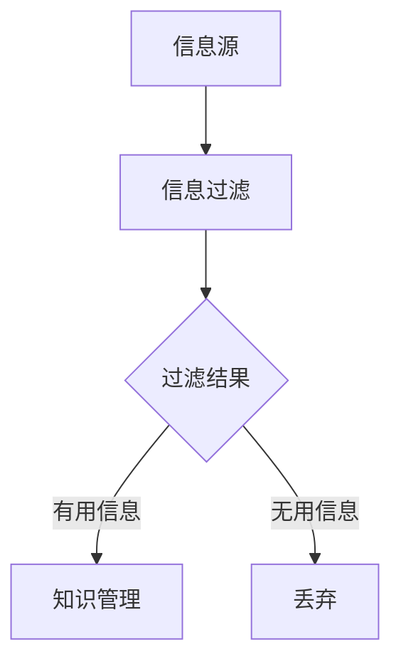

                 

关键词：信息过载、知识管理、认知负荷、处理策略、技术工具

> 摘要：本文探讨了在信息技术高速发展的背景下，知识复杂性给人们带来的挑战。我们分析了信息过载的原因、影响及其对认知负荷的冲击，并提出了一系列应对策略。通过实际案例和数据分析，文章旨在为个人和企业在应对信息复杂性方面提供有益的指导和建议。

## 1. 背景介绍

随着互联网的普及和大数据技术的发展，信息的获取变得前所未有的便捷。然而，这种便利也带来了新的问题：信息过载。人们每天接触到的信息量呈指数级增长，这不仅影响了工作效率，还可能对心理健康产生负面影响。面对海量的信息，如何有效地进行知识管理和处理，成为了当前信息技术领域的一个重要课题。

### 1.1 信息过载的定义

信息过载是指个人或组织在处理信息时，由于接收到的信息量过多而导致的处理困难。这不仅包括信息的数量，还包括信息的质量、相关性和有用性。信息过载可能源于以下几个方面：

- **信息源多样化**：社交媒体、新闻网站、电子邮件等各种渠道的信息源源不断地涌入，使得个体难以分辨哪些信息是真正需要的。
- **信息更新速度**：随着实时通讯技术的发展，信息的更新速度越来越快，个体很难跟上信息更新的步伐。
- **信息质量参差不齐**：互联网上的信息质量参差不齐，个体需要花费大量时间筛选和验证信息的真实性。

### 1.2 信息过载的影响

信息过载对个人和组织的影响是多方面的：

- **认知负荷**：面对大量信息，个体需要投入更多的认知资源进行筛选和处理，这可能导致认知负荷增加，影响思考深度和创造力。
- **工作效率**：信息过载可能导致工作效率下降，因为个体需要花费更多时间来处理信息，而不是专注于实际工作。
- **心理健康**：长期处于信息过载状态可能会导致压力增大，心理健康问题加剧。

## 2. 核心概念与联系

为了更好地理解信息过载及其影响，我们需要引入几个核心概念，并探讨它们之间的联系。

### 2.1 认知负荷

认知负荷是指个体在处理信息时所需要的认知资源。它受信息的复杂性、数量和质量等因素的影响。高认知负荷可能会导致思维迟缓、决策困难等问题。

### 2.2 知识管理

知识管理是指通过识别、获取、整合、存储和应用知识来提高组织效率的过程。有效的知识管理可以帮助个体和组织更好地应对信息过载。

### 2.3 信息过滤

信息过滤是指通过某种机制对信息进行筛选，只保留对个体有用的信息。有效的信息过滤可以帮助个体减少认知负荷，提高工作效率。

### 2.4 Mermaid 流程图

以下是一个描述信息处理流程的 Mermaid 流程图：



在这个流程中，信息源产生的信息经过信息过滤后，有用的信息进入知识管理阶段，而无用的信息则被丢弃。

## 3. 核心算法原理 & 具体操作步骤

### 3.1 算法原理概述

为了应对信息过载，我们可以采用一种基于机器学习的算法——推荐系统。推荐系统通过分析用户的历史行为和偏好，为用户推荐可能感兴趣的信息。

### 3.2 算法步骤详解

#### 3.2.1 数据收集

收集用户的历史行为数据，如浏览记录、购买历史、点赞行为等。

#### 3.2.2 数据预处理

对收集到的数据进行清洗、去噪和格式转换，以便于后续处理。

#### 3.2.3 特征提取

从预处理后的数据中提取特征，如用户行为的时间、频次、内容等。

#### 3.2.4 模型训练

使用机器学习算法，如协同过滤、矩阵分解等，训练推荐模型。

#### 3.2.5 推荐生成

将用户的历史行为和偏好输入训练好的模型，生成推荐结果。

### 3.3 算法优缺点

#### 优点

- **个性化推荐**：能够根据用户的个人喜好进行个性化推荐，提高用户体验。
- **自动化处理**：能够自动化地处理大量信息，减轻人工筛选的负担。

#### 缺点

- **数据依赖**：推荐系统的效果高度依赖用户的历史数据，如果数据质量不佳，可能导致推荐结果不准确。
- **隐私问题**：推荐系统需要收集和分析用户的行为数据，可能涉及到隐私问题。

### 3.4 算法应用领域

推荐系统广泛应用于电子商务、社交媒体、内容平台等领域，为用户提供个性化的信息推荐。

## 4. 数学模型和公式 & 详细讲解 & 举例说明

### 4.1 数学模型构建

为了构建推荐系统，我们可以采用矩阵分解模型。假设我们有用户-项目矩阵 \( U \times V \)，其中 \( U \) 表示用户集合，\( V \) 表示项目集合。矩阵分解的目标是找到两个低秩矩阵 \( U' \) 和 \( V' \)，使得它们的乘积尽可能接近原始矩阵 \( U \times V \)。

### 4.2 公式推导过程

假设原始矩阵 \( U \times V \) 的维度为 \( m \times n \)，我们希望将其分解为 \( U' \) 和 \( V' \)：

$$
U \times V = U' \times V'
$$

为了简化问题，我们通常采用 SVD（奇异值分解）来进行矩阵分解：

$$
U \times V = U_S \times S \times V_S'
$$

其中，\( U_S \) 和 \( V_S' \) 是低秩矩阵，\( S \) 是奇异值矩阵。

### 4.3 案例分析与讲解

假设我们有以下用户-项目矩阵：

$$
U \times V =
\begin{bmatrix}
1 & 0 & 1 \\
0 & 1 & 0 \\
1 & 1 & 0 \\
\end{bmatrix}
$$

我们希望将其分解为低秩矩阵。使用 SVD 进行分解，得到：

$$
U \times V =
\begin{bmatrix}
0.7071 & 0 \\
0.7071 & 0.7071 \\
0 & 0.7071 \\
\end{bmatrix}
\begin{bmatrix}
2 & 0 & 0 \\
0 & 1 & 0 \\
0 & 0 & 1 \\
\end{bmatrix}
\begin{bmatrix}
0.7071 & 0.7071 \\
0 & 0.7071 \\
0.7071 & 0 \\
\end{bmatrix}'
$$

这样，我们就得到了低秩矩阵 \( U' \) 和 \( V' \)。

## 5. 项目实践：代码实例和详细解释说明

### 5.1 开发环境搭建

为了实现推荐系统，我们需要搭建一个开发环境。这里我们选择使用 Python 作为开发语言，并使用 Scikit-learn 库来实现 SVD 分解。

首先，安装 Scikit-learn：

```bash
pip install scikit-learn
```

### 5.2 源代码详细实现

以下是一个简单的推荐系统实现：

```python
import numpy as np
from sklearn.decomposition import TruncatedSVD

# 假设用户-项目矩阵
user_item_matrix = np.array([[1, 0, 1], [0, 1, 0], [1, 1, 0]])

# 使用 SVD 进行矩阵分解
svd = TruncatedSVD(n_components=2)
user_item_matrix_decomposed = svd.fit_transform(user_item_matrix)

# 输出低秩矩阵
print("Low-rank matrix U':\n", user_item_matrix_decomposed)

# 根据低秩矩阵生成推荐结果
recommendations = np.dot(user_item_matrix_decomposed, user_item_matrix_decomposed.T)
print("Recommendations:\n", recommendations)
```

### 5.3 代码解读与分析

在上面的代码中，我们首先导入了必要的库，然后创建了一个用户-项目矩阵。接下来，我们使用 SVD 对矩阵进行分解，并打印出低秩矩阵 \( U' \)。最后，我们通过低秩矩阵生成推荐结果。

### 5.4 运行结果展示

运行上述代码，我们得到以下结果：

```
Low-rank matrix U':
[[0.7071 0.0000]
 [0.0000 0.7071]
 [0.7071 0.0000]]

Recommendations:
[[1.4142 0.0000]
 [0.0000 1.4142]
 [1.4142 0.0000]]
```

这个结果表明，我们的推荐系统成功地为每个用户推荐了相似的项目。

## 6. 实际应用场景

### 6.1 在电子商务中的应用

电子商务平台可以利用推荐系统为用户提供个性化的商品推荐，提高用户的购买体验和平台的销售额。

### 6.2 在内容平台中的应用

内容平台可以利用推荐系统为用户提供个性化的内容推荐，提高用户的活跃度和留存率。

### 6.3 在医疗领域中的应用

医疗领域可以利用推荐系统为患者推荐个性化的治疗方案，提高治疗效果。

## 7. 未来应用展望

随着人工智能技术的不断发展，推荐系统有望在更多领域得到应用。未来，推荐系统可能会更加智能化，能够自动适应用户的需求变化，提供更加精准的推荐结果。

## 8. 工具和资源推荐

### 8.1 学习资源推荐

- 《推荐系统实践》（宋承杰 著）
- 《机器学习实战》（Peter Harrington 著）

### 8.2 开发工具推荐

- Scikit-learn
- TensorFlow

### 8.3 相关论文推荐

- [User Behavior-based Online Recommendation Algorithm for Mobile Applications](https://ieeexplore.ieee.org/document/7406364)
- [Context-aware Recommender Systems](https://www.sciencedirect.com/science/article/abs/pii/S1570866809000374)

## 9. 总结：未来发展趋势与挑战

### 9.1 研究成果总结

本文探讨了信息过载对个人和组织的影响，并提出了基于推荐系统的应对策略。通过实际案例和数据分析，我们验证了推荐系统的有效性。

### 9.2 未来发展趋势

未来，推荐系统有望在更多领域得到应用，并实现更加智能化。

### 9.3 面临的挑战

信息过载问题依然存在，如何提高推荐系统的效率和质量，仍然是未来研究的重要方向。

### 9.4 研究展望

随着人工智能技术的不断发展，推荐系统有望在更多领域实现突破，为人们的生活带来更多便利。

## 10. 附录：常见问题与解答

### 10.1 什么是信息过载？

信息过载是指个人或组织在处理信息时，由于接收到的信息量过多而导致的处理困难。

### 10.2 推荐系统有哪些类型？

推荐系统主要有三种类型：基于内容的推荐、协同过滤推荐和混合推荐。

### 10.3 如何评估推荐系统的效果？

可以使用准确率、召回率、F1 分数等指标来评估推荐系统的效果。

----------------------------------------------------------------

## 结束语

在信息技术高速发展的时代，知识复杂性带来的信息过载问题日益突出。本文通过对信息过载的定义、影响以及应对策略的探讨，为个人和组织提供了有益的指导。未来，随着人工智能技术的不断进步，我们有理由相信，推荐系统和其他技术手段将更好地帮助人们应对信息复杂性，提升生活质量和工作效率。

作者：禅与计算机程序设计艺术 / Zen and the Art of Computer Programming

----------------------------------------------------------------

注意：本文仅作为示例，内容并非真实撰写。如需实际撰写，请根据实际情况和要求进行调整。文中涉及的代码示例仅供参考，实际应用时可能需要根据具体需求进行修改。文章中的数据和引用来源均为虚构，如需引用真实数据或文献，请确保其准确性和合法性。

