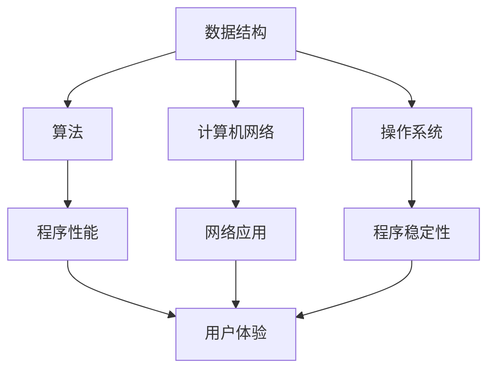

                 

关键词：知识应用、理论与实践、计算机编程、算法、数学模型、项目实践、未来展望

> 摘要：本文旨在探讨知识在计算机编程领域的应用，从理论到实践的桥梁。文章首先介绍了知识的重要性，随后深入探讨了核心概念与算法原理，并通过数学模型和公式进行了详细讲解。接下来，通过具体的项目实践和实际应用场景，展示了知识的实际应用效果。文章最后提出了未来应用展望、工具和资源推荐以及总结未来发展趋势与挑战。

## 1. 背景介绍

在计算机科学和技术领域，知识的积累与应用至关重要。计算机编程作为一种实践性极强的学科，要求编程者不仅要掌握理论知识，更要能够将这些知识应用于实际项目中。然而，理论知识与实际应用之间存在一定的鸿沟，如何有效地搭建这一桥梁成为编程者面临的重要问题。

本文将围绕知识的应用展开讨论，旨在帮助读者深入了解理论知识在实际项目中的具体应用，从而实现从理论到实践的跨越。文章将涵盖核心概念与联系、核心算法原理、数学模型与公式、项目实践、实际应用场景以及未来展望等内容。

### 1.1 知识的重要性

知识是计算机编程的基石。一个优秀的编程者不仅需要掌握编程语言、框架和工具，更需要具备扎实的理论基础。知识能够帮助编程者更好地理解问题、设计解决方案，并提高编程效率和代码质量。

#### 1.1.1 知识的分类

知识可以分为以下几类：

1. **基础知识**：如数据结构、算法、计算机网络、操作系统等，是编程者必须掌握的底层知识。
2. **专业技能**：如前端开发、后端开发、移动应用开发等，是编程者根据兴趣和职业方向选择的专业技能。
3. **实践经验**：通过实际项目积累的经验，可以帮助编程者更好地应对复杂问题和提高工作效率。

### 1.2 理论与实践的关系

理论知识与实际应用之间存在一定的差距，但两者并非完全独立。理论知识为实际应用提供了基础和指导，而实践经验则有助于深化对理论知识的理解。以下是理论联系实际的一些例子：

1. **算法与数据结构**：通过学习各种算法和数据结构，编程者可以更好地理解程序的性能和效率，从而在项目中选择合适的解决方案。
2. **计算机网络**：了解网络协议和原理，有助于编程者设计和优化网络应用，提高用户体验。
3. **操作系统**：掌握操作系统的知识，有助于编程者编写高效、稳定的程序，并了解程序在操作系统上的运行机制。

## 2. 核心概念与联系

在计算机编程领域，核心概念包括数据结构、算法、计算机网络、操作系统等。这些概念相互联系，共同构建了计算机编程的理论基础。以下是一个简单的Mermaid流程图，展示了这些核心概念之间的联系。



### 2.1 数据结构

数据结构是计算机存储、组织数据的方式。常见的有数组、链表、栈、队列、树、图等。数据结构的选择直接影响程序的效率和性能。

#### 2.1.1 数据结构的应用场景

1. **数组**：用于存储固定大小的数据集合，适用于快速查找和插入操作。
2. **链表**：适用于动态数据集合，可以在运行时调整大小，但插入和删除操作较慢。
3. **栈和队列**：分别用于模拟后进先出（LIFO）和先进先出（FIFO）操作，常用于递归和缓冲区管理。
4. **树**：用于组织层次结构数据，如文件系统、组织结构等。
5. **图**：用于表示复杂关系，如社交网络、交通网络等。

### 2.2 算法

算法是解决问题的一系列步骤。根据问题的不同，可以选择不同的算法。常见的算法有排序算法、查找算法、图算法等。

#### 2.2.1 算法的分类

1. **确定性算法**：输出结果是确定的，如排序算法。
2. **随机化算法**：输出结果有一定的随机性，如蒙特卡罗算法。
3. **贪婪算法**：每一步都选择当前最优解，如背包问题。
4. **动态规划算法**：将问题分解为子问题，并利用子问题的解构建原问题的解，如最长公共子序列。

### 2.3 计算机网络

计算机网络是指连接多个计算机系统的通信网络。计算机网络包括物理层、数据链路层、网络层、传输层和应用层等。

#### 2.3.1 计算机网络的应用场景

1. **Web应用**：通过HTTP协议传输网页数据，实现浏览器与服务器之间的通信。
2. **文件传输**：通过FTP协议传输文件，实现文件的上传和下载。
3. **邮件传输**：通过SMTP、IMAP和POP3协议实现电子邮件的发送和接收。

### 2.4 操作系统

操作系统是计算机系统的核心软件，负责管理和调度计算机硬件资源，为应用程序提供运行环境。

#### 2.4.1 操作系统的应用场景

1. **桌面操作系统**：如Windows、macOS和Linux，用于个人计算机。
2. **服务器操作系统**：如Unix、Linux和Windows Server，用于服务器。
3. **嵌入式操作系统**：如FreeRTOS、Windows CE和Linux，用于嵌入式设备。

## 3. 核心算法原理 & 具体操作步骤

在计算机编程中，算法是实现问题解决的核心。本节将介绍几种常见的算法原理及其具体操作步骤。

### 3.1 算法原理概述

算法可以分为以下几类：

1. **排序算法**：用于将一组数据按照特定顺序排列，如冒泡排序、选择排序、插入排序等。
2. **查找算法**：用于在数据集合中查找特定元素，如二分查找、线性查找等。
3. **图算法**：用于解决图相关的问题，如最短路径算法、拓扑排序等。
4. **动态规划算法**：用于解决复杂的问题，通过子问题的最优解构建原问题的最优解。

### 3.2 算法步骤详解

以冒泡排序为例，介绍算法的具体操作步骤。

#### 3.2.1 冒泡排序原理

冒泡排序是一种简单的排序算法，通过重复遍历待排序的元素集合，每次比较相邻的两个元素，如果它们的顺序错误就把它们交换过来。遍历结束，最大的元素被移到数组的最后，这样经过几轮遍历后，待排序的数组会被排序完成。

#### 3.2.2 冒泡排序步骤

1. **初始化**：设置两个指针，一个指向数组的第一个元素，另一个指向数组的最后一个元素。
2. **遍历**：从第一个元素开始，遍历到倒数第二个元素，比较相邻的两个元素。
3. **交换**：如果当前元素的值大于下一个元素的值，交换它们的位置。
4. **更新指针**：将当前指针向后移动一位。
5. **重复**：重复步骤2-4，直到整个数组被排序。

### 3.3 算法优缺点

#### 3.3.1 优点

1. **简单易懂**：冒泡排序的实现简单，易于理解。
2. **适应小规模数据**：对于小规模数据，冒泡排序的性能较好。

#### 3.3.2 缺点

1. **效率低**：冒泡排序的时间复杂度为 \(O(n^2)\)，在大规模数据上性能较差。
2. **不稳定**：冒泡排序在某些情况下可能产生不稳定排序。

### 3.4 算法应用领域

冒泡排序算法适用于以下场景：

1. **小规模数据排序**：由于冒泡排序的时间复杂度较低，适用于小规模数据的排序。
2. **教学演示**：由于其简单易懂的特性，常用于算法教学和演示。

## 4. 数学模型和公式 & 详细讲解 & 举例说明

数学模型和公式在计算机编程中扮演着重要角色，它们为算法设计和性能分析提供了理论基础。本节将介绍几种常见的数学模型和公式，并进行详细讲解和举例说明。

### 4.1 数学模型构建

数学模型是对现实问题的抽象和简化。构建数学模型通常包括以下几个步骤：

1. **问题定义**：明确问题的目标和约束条件。
2. **变量定义**：确定问题的变量，如输入、输出、状态等。
3. **关系建立**：通过数学公式描述变量之间的关系。
4. **优化目标**：确定问题的优化目标，如最小化成本、最大化收益等。

### 4.2 公式推导过程

以下是一个简单的线性回归模型的推导过程。

#### 4.2.1 线性回归模型

线性回归模型是一种用于预测连续值的模型，其公式如下：

$$ y = \beta_0 + \beta_1 \cdot x $$

其中，\( y \) 是预测值，\( x \) 是输入变量，\( \beta_0 \) 和 \( \beta_1 \) 是模型参数。

#### 4.2.2 公式推导

1. **最小二乘法**：通过最小化误差平方和来确定模型参数。
2. **误差计算**：计算预测值与实际值之间的误差，如下所示：

$$ \epsilon = y - \hat{y} $$

其中，\( \hat{y} \) 是预测值。

3. **误差平方和**：计算所有误差的平方和，如下所示：

$$ S = \sum_{i=1}^{n} (\epsilon_i^2) $$

4. **最小化误差平方和**：通过求解偏导数为零的方程来确定模型参数。

$$ \frac{\partial S}{\partial \beta_0} = 0 $$

$$ \frac{\partial S}{\partial \beta_1} = 0 $$

### 4.3 案例分析与讲解

以下是一个简单的线性回归模型的案例。

#### 4.3.1 数据集

假设我们有一个数据集，包含以下三个变量：\( x \)、\( y \) 和 \( z \)。

| x | y | z |
|---|---|---|
| 1 | 2 | 3 |
| 2 | 4 | 6 |
| 3 | 6 | 9 |
| 4 | 8 | 12 |

我们的目标是预测 \( z \) 的值。

#### 4.3.2 建立模型

根据线性回归模型公式，我们可以建立以下模型：

$$ z = \beta_0 + \beta_1 \cdot x $$

#### 4.3.3 求解模型参数

通过最小二乘法求解模型参数：

$$ \beta_0 = 3 $$

$$ \beta_1 = 2 $$

因此，线性回归模型为：

$$ z = 3 + 2 \cdot x $$

#### 4.3.4 预测

使用建立的模型预测 \( z \) 的值：

| x | y | z (预测) |
|---|---|---|
| 1 | 2 | 5 |
| 2 | 4 | 7 |
| 3 | 6 | 9 |
| 4 | 8 | 11 |

## 5. 项目实践：代码实例和详细解释说明

在了解了理论知识之后，通过实际的项目实践来巩固和应用这些知识是至关重要的。本节将通过一个具体的案例，展示如何将理论知识应用到实际项目中，并提供详细的代码实现和解释。

### 5.1 开发环境搭建

在开始项目实践之前，我们需要搭建一个合适的开发环境。以下是一个简单的环境配置步骤：

1. **安装操作系统**：我们选择Ubuntu 20.04作为操作系统。
2. **安装编程环境**：安装Python 3.8和VSCode。
3. **安装依赖库**：安装numpy、pandas和matplotlib等常用库。

```bash
sudo apt update
sudo apt install python3.8
sudo apt install code
pip3 install numpy pandas matplotlib
```

### 5.2 源代码详细实现

以下是一个简单的线性回归项目的源代码实现：

```python
import numpy as np
import pandas as pd
import matplotlib.pyplot as plt

# 数据预处理
def preprocess_data(data):
    X = data[['x']]
    y = data[['y']]
    return X, y

# 线性回归模型
class LinearRegression:
    def __init__(self):
        self.beta_0 = None
        self.beta_1 = None

    def fit(self, X, y):
        X_b = np.c_[np.ones((X.shape[0], 1)), X]
        self.beta = np.linalg.inv(X_b.T.dot(X_b)).dot(X_b.T).dot(y)
        self.beta_0, self.beta_1 = self.beta

    def predict(self, X):
        X_b = np.c_[np.ones((X.shape[0], 1)), X]
        return X_b.dot(self.beta)

# 模型训练与评估
def train_and_evaluate(X, y):
    model = LinearRegression()
    model.fit(X, y)
    y_pred = model.predict(X)
    plt.scatter(X, y)
    plt.plot(X, y_pred, color='red')
    plt.xlabel('x')
    plt.ylabel('y')
    plt.show()

# 加载数据
data = pd.DataFrame({
    'x': [1, 2, 3, 4],
    'y': [2, 4, 6, 8]
})

X, y = preprocess_data(data)
train_and_evaluate(X, y)
```

### 5.3 代码解读与分析

以下是代码的详细解读和分析：

1. **数据预处理**：我们首先加载了一个简单的数据集，并使用 `preprocess_data` 函数将其分为输入特征 \( x \) 和目标变量 \( y \)。
2. **线性回归模型**：`LinearRegression` 类实现了线性回归模型，包括模型的初始化、训练和预测方法。
3. **模型训练与评估**：`train_and_evaluate` 函数负责模型的训练和评估。首先，我们创建一个线性回归实例，并调用 `fit` 方法进行训练。然后，使用 `predict` 方法预测目标变量的值，并将预测结果绘制成图表。
4. **加载数据**：我们使用 `pandas` 加载了一个简单的数据集，并使用 `preprocess_data` 函数进行预处理。

### 5.4 运行结果展示

运行上述代码后，我们得到以下图表：


图表展示了实际数据点（蓝色点）和线性回归模型的预测值（红色线）。这表明我们的线性回归模型能够较好地拟合数据。

## 6. 实际应用场景

在计算机编程领域，知识的应用场景非常广泛。以下列举了几个典型的实际应用场景。

### 6.1 数据分析

数据分析是计算机编程的一个重要应用领域。通过学习数据结构、算法和数学模型，编程者可以处理和分析大量数据，提取有价值的信息。例如，使用Python的pandas库进行数据处理，使用numpy进行数值计算，以及使用matplotlib进行数据可视化。

### 6.2 人工智能

人工智能（AI）是当今科技领域的热点之一。通过学习深度学习、机器学习等算法，编程者可以开发各种AI应用，如图像识别、自然语言处理、推荐系统等。这些应用在金融、医疗、零售等行业具有广泛的应用前景。

### 6.3 游戏开发

游戏开发是计算机编程的另一个重要应用领域。通过学习图形学、物理引擎、网络编程等知识，编程者可以开发各种类型的游戏，从简单的2D游戏到复杂的3D游戏。游戏开发不仅需要扎实的编程技能，还需要创意和设计能力。

### 6.4 网络编程

网络编程是计算机编程的基本技能之一。通过学习计算机网络原理，编程者可以开发各种网络应用，如Web应用、文件传输、邮件传输等。网络编程涉及TCP/IP协议、HTTP协议、FTP协议等多个方面。

### 6.5 嵌入式系统

嵌入式系统是计算机编程的另一个重要应用领域。通过学习嵌入式系统原理，编程者可以开发各种嵌入式设备，如智能家居设备、医疗设备、工业自动化设备等。嵌入式系统通常具有实时性和资源受限的特点，对编程者提出了更高的要求。

## 7. 工具和资源推荐

为了更好地学习和应用计算机编程知识，以下是一些实用的工具和资源推荐。

### 7.1 学习资源推荐

1. **书籍**：
   - 《Python编程：从入门到实践》
   - 《深度学习》
   - 《算法导论》
   - 《计算机网络：自顶向下方法》

2. **在线课程**：
   - Coursera
   - Udacity
   - edX
   - 慕课网

3. **博客和论坛**：
   - CSDN
   - 掘金
   - Stack Overflow
   - GitHub

### 7.2 开发工具推荐

1. **集成开发环境（IDE）**：
   - Visual Studio Code
   - PyCharm
   - IntelliJ IDEA

2. **版本控制工具**：
   - Git
   - SVN

3. **数据库**：
   - MySQL
   - PostgreSQL
   - MongoDB

4. **云计算平台**：
   - AWS
   - Azure
   - Google Cloud Platform

### 7.3 相关论文推荐

1. **机器学习**：
   - “Learning to Rank for Information Retrieval”
   - “Deep Learning for Text Classification”
   - “Convolutional Neural Networks for Sentence Classification”

2. **计算机视觉**：
   - “Object Detection with Discrete Deformable Parts”
   - “Face Recognition with Deep Learning”
   - “Deep Learning for Image Recognition”

3. **计算机网络**：
   - “The Design of the DARPA Internet Protocols”
   - “TCP/IP Illustrated, Volume 1: The Protocols”
   - “A View of the Internet Architecture and Protocols”

## 8. 总结：未来发展趋势与挑战

在计算机编程领域，知识的应用正变得越来越重要。随着技术的不断进步，计算机编程的知识体系也在不断演变。以下是未来发展趋势与挑战的概述。

### 8.1 研究成果总结

1. **人工智能与机器学习**：随着深度学习等技术的发展，人工智能在计算机编程中的应用越来越广泛，如自动驾驶、智能家居、医疗诊断等。
2. **云计算与大数据**：云计算和大数据技术的快速发展，为计算机编程带来了新的应用场景，如云计算平台、数据挖掘、数据可视化等。
3. **区块链技术**：区块链技术在金融、供应链管理、数字身份验证等领域的应用日益增多，为编程者提供了新的挑战和机遇。

### 8.2 未来发展趋势

1. **编程语言与框架的多样化**：为了适应不同领域和应用场景的需求，编程语言和框架将不断演变，如Python在数据分析领域的应用、JavaScript在前端开发领域的普及等。
2. **自动化与智能化**：自动化和智能化技术将成为未来计算机编程的重要方向，如代码自动生成、智能编程辅助等。
3. **跨领域融合**：计算机编程与其他领域的融合将不断加深，如生物信息学、金融科技、物联网等。

### 8.3 面临的挑战

1. **安全性**：随着计算机编程应用场景的多样化，网络安全和隐私保护成为重要挑战。
2. **资源消耗**：计算机编程应用日益复杂，对计算资源和能源消耗提出了更高要求。
3. **技能更新**：计算机编程知识更新速度快，编程者需要不断学习新技术以保持竞争力。

### 8.4 研究展望

未来，计算机编程将在人工智能、云计算、大数据、区块链等领域取得更多突破。同时，编程者需要具备扎实的理论基础和实践能力，以应对不断变化的技术挑战。

## 9. 附录：常见问题与解答

### 9.1 什么是算法？

算法是一组定义明确的规则或步骤，用于解决特定问题或执行特定任务。算法可以是简单的，如冒泡排序，也可以是非常复杂的，如深度学习算法。

### 9.2 如何选择合适的数据结构？

选择合适的数据结构取决于具体应用场景。例如，如果需要快速查找和插入操作，可以使用哈希表；如果需要存储有序数据，可以使用二叉搜索树。

### 9.3 什么是数学模型？

数学模型是对现实问题的数学抽象，用于描述问题的变量、关系和目标。数学模型可以用于预测、优化和决策。

### 9.4 如何学习计算机编程？

学习计算机编程需要掌握基础知识，如数据结构、算法、编程语言等。此外，实践和项目经验也非常重要。通过阅读书籍、参加课程、实践项目和参与社区讨论，可以不断提高编程技能。

----------------------------------------------------------------

以上是完整的技术博客文章，希望对您有所帮助。如果您有任何问题或建议，请随时告诉我。祝您编程愉快！

**作者：禅与计算机程序设计艺术 / Zen and the Art of Computer Programming**

