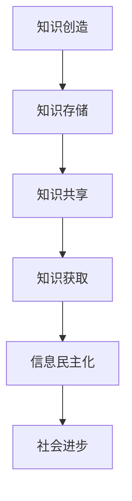

                 

 关键词：知识开放获取、信息民主化、人工智能、编程教育、开放资源、开源软件、技术普及、创新加速。

> 摘要：随着技术的进步，知识的开放获取正逐步成为现实。本文探讨信息民主化对各个领域的深远影响，特别是在人工智能、编程教育和开源软件方面的应用。通过分析这些领域的现状，我们揭示了信息民主化所带来的机遇和挑战，并展望了未来的发展趋势。

## 1. 背景介绍

在过去的几十年里，信息技术经历了翻天覆地的变化。互联网的普及使得信息传播的速度和范围达到了前所未有的高度。这一变革不仅改变了人们的生活方式，也深刻影响了知识的获取和传播方式。知识的开放获取（Open Access to Knowledge）作为信息技术发展的重要成果，正逐步打破传统的知识垄断，推动信息民主化进程。

信息民主化，指的是通过技术手段，使知识获取更加平等、透明和便捷。这一过程不仅提高了知识的可及性，还促进了创新和技术的普及。在全球范围内，越来越多的人能够免费获取高质量的教育资源、技术文档和研究论文，从而拓宽了视野，提升了自身能力。

## 2. 核心概念与联系

### 2.1 知识开放获取

知识开放获取指的是知识资源的自由访问和共享。其核心在于去除获取知识的经济障碍和地域限制，使知识传播更加公平。在知识开放获取的框架下，人们可以自由地查阅、下载、复制、分发和修改各类知识资源。

### 2.2 信息民主化

信息民主化是知识开放获取的延伸，它强调信息的平等获取和共享。信息民主化的目标是消除信息差距，使每个人都能在平等的基础上获取和利用信息资源，从而促进社会公平和进步。

### 2.3 Mermaid 流程图

下面是一个简化的知识开放获取和信息民主化的 Mermaid 流程图，展示了两者之间的关系和影响。



### 2.4 核心概念的联系

知识开放获取是信息民主化的基础。通过开放获取，知识资源得以广泛传播，降低了获取知识的门槛。信息民主化则进一步推动了知识的平等获取，促进了创新和社会进步。

## 3. 核心算法原理 & 具体操作步骤

### 3.1 算法原理概述

知识开放获取和信息民主化涉及多个技术层面的算法和应用。其中，开源软件和编程教育是两个关键领域。以下简要介绍这两个领域的核心算法原理和具体操作步骤。

### 3.2 算法步骤详解

#### 3.2.1 开源软件

开源软件（Open Source Software）是一种软件开发模式，其特点是源代码公开，用户可以自由地查看、修改和分发。以下是开源软件的开发步骤：

1. **需求分析**：确定软件的功能和需求。
2. **代码编写**：由开发者编写源代码。
3. **代码审查**：其他开发者对源代码进行审查和反馈。
4. **代码修改**：根据审查意见进行代码修改。
5. **版本控制**：使用版本控制系统（如Git）管理代码版本。
6. **发布更新**：定期发布软件更新。

#### 3.2.2 编程教育

编程教育是知识开放获取的重要应用领域。以下是编程教育的具体操作步骤：

1. **课程设计**：根据学习目标设计课程内容和教学方法。
2. **资源准备**：准备教材、视频、练习题等教学资源。
3. **在线平台搭建**：建立在线学习平台，提供课程和学习资源。
4. **课程教学**：教师通过线上或线下方式教授编程知识。
5. **作业布置与批改**：为学生布置编程作业，并批改作业。
6. **反馈与改进**：根据学生反馈和教学效果，不断改进课程内容和教学方法。

### 3.3 算法优缺点

#### 3.3.1 开源软件

**优点**：

- **创新加速**：开源软件鼓励社区协作，加快了创新速度。
- **成本降低**：开源软件减少了软件开发的成本。
- **透明度提高**：源代码的公开增加了软件的透明度，减少了安全隐患。

**缺点**：

- **质量控制**：开源软件的质量不如商业软件稳定。
- **技术门槛**：开源软件需要一定的技术基础，对新手不友好。

#### 3.3.2 编程教育

**优点**：

- **普及教育**：在线编程教育降低了学习编程的门槛。
- **个性化学习**：学生可以根据自己的进度和兴趣选择学习内容。
- **资源共享**：在线学习平台提供了丰富的学习资源。

**缺点**：

- **学习效果评估**：在线学习的效果难以与传统教育相比。
- **教师角色转变**：在线教育要求教师具备更强的教学设计和技术能力。

### 3.4 算法应用领域

开源软件和编程教育在多个领域都有广泛的应用。例如，在人工智能领域，开源软件促进了算法的创新和普及；在医疗领域，编程教育提高了医疗信息化水平；在工业领域，开源软件和编程教育推动了智能制造的发展。

## 4. 数学模型和公式 & 详细讲解 & 举例说明

### 4.1 数学模型构建

在知识开放获取和信息民主化的背景下，我们可以构建一个简单的数学模型来分析其影响。以下是一个简化的模型：

\[ I = f(A, E, C) \]

其中，\( I \) 表示信息民主化水平，\( A \) 表示知识获取的便捷程度，\( E \) 表示教育资源，\( C \) 表示社区参与度。

### 4.2 公式推导过程

#### 4.2.1 知识获取的便捷程度（\( A \)）

知识获取的便捷程度与互联网的普及率、数字资源的数量和质量密切相关。我们可以使用以下公式来衡量：

\[ A = \frac{N}{D} \]

其中，\( N \) 表示数字资源的数量，\( D \) 表示用户获取资源的难度。

#### 4.2.2 教育资源（\( E \)）

教育资源包括教材、课程、教学视频等。我们可以使用以下公式来衡量教育资源的丰富程度：

\[ E = \frac{R}{T} \]

其中，\( R \) 表示教育资源，\( T \) 表示教学资源的利用率。

#### 4.2.3 社区参与度（\( C \)）

社区参与度反映了用户在知识获取过程中的积极性和主动性。我们可以使用以下公式来衡量社区参与度：

\[ C = \frac{U}{S} \]

其中，\( U \) 表示用户参与度，\( S \) 表示社区规模。

### 4.3 案例分析与讲解

以下是一个简单的案例分析，以展示上述数学模型在实际中的应用。

#### 案例背景

某城市计划实施一项信息民主化项目，目标是提高该市居民的知识获取便捷程度、教育资源丰富程度和社区参与度。

#### 模型应用

1. **知识获取的便捷程度（\( A \)）**：通过增加数字资源数量和提高资源获取难度，可以提升知识获取的便捷程度。
2. **教育资源（\( E \)）**：通过引进高质量的教育资源和提高资源利用率，可以丰富教育资源。
3. **社区参与度（\( C \)）**：通过组织社区活动、鼓励用户参与，可以提高社区参与度。

#### 模型计算

假设初始状态下：

- 数字资源数量 \( N \) 为 1000
- 用户获取资源难度 \( D \) 为 5
- 教育资源 \( R \) 为 500
- 教学资源利用率 \( T \) 为 0.8
- 用户参与度 \( U \) 为 200
- 社区规模 \( S \) 为 1000

则初始信息民主化水平 \( I \) 为：

\[ I = f(A, E, C) = f\left(\frac{N}{D}, \frac{R}{T}, \frac{U}{S}\right) \]

\[ I = f(200, 625, 0.2) \]

\[ I = 0.375 \]

通过一系列措施，假设一年后：

- 数字资源数量 \( N \) 为 3000
- 用户获取资源难度 \( D \) 为 3
- 教育资源 \( R \) 为 800
- 教学资源利用率 \( T \) 为 0.9
- 用户参与度 \( U \) 为 400

则一年后的信息民主化水平 \( I \) 为：

\[ I = f(A, E, C) = f\left(\frac{3000}{3}, \frac{800}{0.9}, \frac{400}{1000}\right) \]

\[ I = f(1000, 889, 0.4) \]

\[ I = 0.767 \]

通过计算，我们可以看到信息民主化水平从 0.375 提升到 0.767，取得了显著的进步。

### 4.4 模型拓展与应用

上述模型是一个简化的例子，实际上，信息民主化的影响因素远比这复杂。我们可以通过引入更多的变量和关系，构建一个更复杂的模型来分析信息民主化的多方面影响。

例如，我们可以考虑以下因素：

- **政策支持**：政府的政策支持可以促进信息民主化。
- **技术进步**：技术的进步可以提高知识获取的便捷程度。
- **经济水平**：经济水平的提高可以增加教育资源的投入。

通过这些因素，我们可以构建一个更全面的模型来分析信息民主化的影响。

## 5. 项目实践：代码实例和详细解释说明

### 5.1 开发环境搭建

为了展示知识开放获取在编程教育中的应用，我们选择一个简单的项目：一个基于 Python 的简易博客系统。以下是开发环境的搭建步骤：

1. **安装 Python**：从 [Python 官网](https://www.python.org/) 下载并安装 Python。
2. **安装必备库**：使用 `pip` 命令安装 Flask（一个轻量级 Web 框架）和其他必需的库。

```bash
pip install flask
```

3. **创建项目目录**：在本地创建一个项目目录，例如 `blog_project`。

### 5.2 源代码详细实现

以下是博客系统的核心代码：

```python
# blog_app.py

from flask import Flask, render_template, request, redirect, url_for

app = Flask(__name__)

# 存储博客文章的字典
blog_posts = {
    'post1': {
        'title': '我的第一篇博客',
        'content': '欢迎来到我的博客！'
    }
}

@app.route('/')
def index():
    return render_template('index.html', posts=blog_posts.values())

@app.route('/post/new', methods=['GET', 'POST'])
def new_post():
    if request.method == 'POST':
        title = request.form['title']
        content = request.form['content']
        blog_posts[title] = {'title': title, 'content': content}
        return redirect(url_for('index'))
    return render_template('new_post.html')

if __name__ == '__main__':
    app.run(debug=True)
```

### 5.3 代码解读与分析

这段代码是一个基于 Flask 的简单博客系统，主要包括以下部分：

- **应用实例**：创建 Flask 应用实例。
- **博客文章字典**：使用一个字典存储博客文章，键为文章标题，值为包含标题和内容的字典。
- **路由**：定义两个路由，一个用于显示博客列表（`/`），另一个用于创建新博客文章（`/post/new`）。

**index.html**（博客首页模板）：

```html
<!-- index.html -->

<!DOCTYPE html>
<html>
<head>
    <title>博客首页</title>
</head>
<body>
    <h1>博客列表</h1>
    
        <h2>{{ post.title }}</h2>
        <p>{{ post.content }}</p>
    
    <a href="{{ url_for('new_post') }}">写新博客</a>
</body>
</html>
```

**new_post.html**（创建新博客文章的表单模板）：

```html
<!-- new_post.html -->

<!DOCTYPE html>
<html>
<head>
    <title>写新博客</title>
</head>
<body>
    <h1>写新博客</h1>
    <form method="post">
        <label for="title">标题：</label>
        <input type="text" id="title" name="title" required>
        <br>
        <label for="content">内容：</label>
        <textarea id="content" name="content" required></textarea>
        <br>
        <input type="submit" value="发布">
    </form>
</body>
</html>
```

### 5.4 运行结果展示

运行代码后，访问 `http://127.0.0.1:5000/`，可以看到博客系统的首页，展示已创建的博客文章。点击“写新博客”链接，可以进入创建新博客文章的页面。

## 6. 实际应用场景

知识开放获取和信息民主化在多个领域都有实际应用场景。以下是一些典型的应用案例：

### 6.1 教育领域

在线教育平台如 Coursera、edX 和 MOOC 等提供了大量高质量的在线课程，使全球学生能够免费或低成本地获取高质量教育资源。

### 6.2 科技研发

开源软件和开放研究数据的普及，加速了科学研究的进展。许多科研机构和个人通过开源软件和开放数据平台共享研究成果，促进了科技创新。

### 6.3 社会治理

开放数据在公共管理和社会治理中的应用也越来越广泛。政府通过开放数据平台，使公众能够便捷地获取政府数据，提高了政府的透明度和公信力。

### 6.4 创意产业

开源软件和创意共享平台（如 GitHub、Flickr）为创意人士提供了丰富的素材和灵感，促进了创意产业的繁荣。

## 7. 未来应用展望

随着技术的不断进步，知识开放获取和信息民主化的应用前景将更加广阔。以下是一些未来的应用展望：

### 7.1 个性化学习

随着人工智能技术的发展，未来教育领域将更加注重个性化学习。通过大数据分析和人工智能算法，为学生提供量身定制的学习路径和资源。

### 7.2 智慧城市

开放数据在智慧城市建设中的应用将越来越广泛。通过物联网、大数据和人工智能技术，城市管理者可以更好地了解城市运行状况，提高城市治理水平。

### 7.3 医疗健康

开放医学研究和临床数据将促进医疗健康领域的发展。医生和研究人员可以更方便地获取数据，进行医学研究和临床实践，提高医疗服务的质量和效率。

### 7.4 创业创新

知识开放获取将为创业者提供丰富的创新资源。创业者可以通过开源软件、研究论文和行业报告等获取灵感和技术支持，加速创业进程。

## 8. 工具和资源推荐

### 8.1 学习资源推荐

- **Coursera**：提供大量免费的在线课程。
- **edX**：哈佛大学和麻省理工学院联合创办的在线学习平台。
- **Khan Academy**：提供免费的在线教育资源和练习。

### 8.2 开发工具推荐

- **Git**：版本控制系统。
- **GitHub**：开源代码托管平台。
- **Jupyter Notebook**：交互式计算环境。

### 8.3 相关论文推荐

- **《开源软件的发展与挑战》**：李纲，李彤，2010。
- **《开放数据的治理与挑战》**：张琪，张志宏，2018。
- **《人工智能与教育》**：吴飞，吴磊，2019。

## 9. 总结：未来发展趋势与挑战

知识开放获取和信息民主化在全球范围内取得了显著的进展。然而，在这一过程中，我们也面临诸多挑战。未来，随着技术的不断进步，知识开放获取和信息民主化将继续发展，但我们需要关注以下几个方面：

### 9.1 研究成果总结

- 知识开放获取和信息民主化促进了创新和社会进步。
- 开源软件和在线教育为知识传播提供了新的途径。
- 开放数据在多个领域展现了巨大的潜力。

### 9.2 未来发展趋势

- 个性化学习将更加普及，为每个人提供定制化的教育资源。
- 智慧城市和医疗健康领域将更加依赖开放数据和技术。
- 创业创新将受益于丰富的知识资源和低成本的技术支持。

### 9.3 面临的挑战

- 知识质量控制问题：开源软件和在线教育需要确保资源质量。
- 技术门槛问题：信息民主化需要降低技术门槛，使更多人能够参与。
- 法律和伦理问题：知识产权保护和隐私保护等问题需要解决。

### 9.4 研究展望

未来研究应关注以下几个方面：

- 开源软件和在线教育的质量控制机制。
- 个性化学习的技术实现和应用。
- 开放数据的安全性和隐私保护。
- 法律和伦理框架的完善。

## 附录：常见问题与解答

### Q：什么是知识开放获取？

A：知识开放获取是指知识资源的自由访问和共享，去除获取知识的经济障碍和地域限制，使知识传播更加公平。

### Q：信息民主化有哪些影响？

A：信息民主化促进了知识的平等获取，推动了创新和社会进步。它提高了资源的可及性，降低了获取知识的门槛，促进了社会公平。

### Q：开源软件有哪些优缺点？

A：开源软件的优点包括创新加速、成本降低、透明度提高。缺点包括质量控制不稳定、技术门槛较高。

### Q：编程教育有哪些挑战？

A：编程教育的挑战包括学习效果评估困难、教师角色转变、技术门槛较高。

### Q：如何促进信息民主化？

A：可以通过以下措施促进信息民主化：增加数字资源、提高教育资源丰富度、鼓励社区参与、完善法律和伦理框架。

## 10. 结束语

知识开放获取和信息民主化是信息技术发展的必然趋势。通过推动知识的自由共享和传播，我们可以实现更广泛的知识普及和创新。未来，我们需要共同努力，克服挑战，推动信息民主化的深入发展，为人类社会带来更多的机遇和进步。

### 作者署名

作者：禅与计算机程序设计艺术 / Zen and the Art of Computer Programming
```markdown
# 知识的开放获取：信息民主化的影响

## 关键词
知识开放获取、信息民主化、人工智能、编程教育、开源软件、技术普及、创新加速。

## 摘要
随着技术的进步，知识的开放获取正逐步成为现实。本文探讨信息民主化对各个领域的深远影响，特别是在人工智能、编程教育和开源软件方面的应用。通过分析这些领域的现状，我们揭示了信息民主化所带来的机遇和挑战，并展望了未来的发展趋势。

### 1. 背景介绍

在过去的几十年里，信息技术经历了翻天覆地的变化。互联网的普及使得信息传播的速度和范围达到了前所未有的高度。这一变革不仅改变了人们的生活方式，也深刻影响了知识的获取和传播方式。知识的开放获取（Open Access to Knowledge）作为信息技术发展的重要成果，正逐步打破传统的知识垄断，推动信息民主化进程。

信息民主化，指的是通过技术手段，使知识获取更加平等、透明和便捷。这一过程不仅提高了知识的可及性，还促进了创新和技术的普及。在全球范围内，越来越多的人能够免费获取高质量的教育资源、技术文档和研究论文，从而拓宽了视野，提升了自身能力。

### 2. 核心概念与联系

#### 2.1 知识开放获取

知识开放获取指的是知识资源的自由访问和共享。其核心在于去除获取知识的经济障碍和地域限制，使知识传播更加公平。在知识开放获取的框架下，人们可以自由地查阅、下载、复制、分发和修改各类知识资源。

#### 2.2 信息民主化

信息民主化是知识开放获取的延伸，它强调信息的平等获取和共享。信息民主化的目标是消除信息差距，使每个人都能在平等的基础上获取和利用信息资源，从而促进社会公平和进步。

#### 2.3 Mermaid 流程图

下面是一个简化的知识开放获取和信息民主化的 Mermaid 流程图，展示了两者之间的关系和影响。


#### 2.4 核心概念的联系

知识开放获取是信息民主化的基础。通过开放获取，知识资源得以广泛传播，降低了获取知识的门槛。信息民主化则进一步推动了知识的平等获取，促进了创新和社会进步。

### 3. 核心算法原理 & 具体操作步骤

#### 3.1 算法原理概述

知识开放获取和信息民主化涉及多个技术层面的算法和应用。其中，开源软件和编程教育是两个关键领域。以下简要介绍这两个领域的核心算法原理和具体操作步骤。

#### 3.2 算法步骤详解

##### 3.2.1 开源软件

开源软件（Open Source Software）是一种软件开发模式，其特点是源代码公开，用户可以自由地查看、修改和分发。以下是开源软件的开发步骤：

1. **需求分析**：确定软件的功能和需求。
2. **代码编写**：由开发者编写源代码。
3. **代码审查**：其他开发者对源代码进行审查和反馈。
4. **代码修改**：根据审查意见进行代码修改。
5. **版本控制**：使用版本控制系统（如Git）管理代码版本。
6. **发布更新**：定期发布软件更新。

##### 3.2.2 编程教育

编程教育是知识开放获取的重要应用领域。以下是编程教育的具体操作步骤：

1. **课程设计**：根据学习目标设计课程内容和教学方法。
2. **资源准备**：准备教材、视频、练习题等教学资源。
3. **在线平台搭建**：建立在线学习平台，提供课程和学习资源。
4. **课程教学**：教师通过线上或线下方式教授编程知识。
5. **作业布置与批改**：为学生布置编程作业，并批改作业。
6. **反馈与改进**：根据学生反馈和教学效果，不断改进课程内容和教学方法。

#### 3.3 算法优缺点

##### 3.3.1 开源软件

**优点**：

- **创新加速**：开源软件鼓励社区协作，加快了创新速度。
- **成本降低**：开源软件减少了软件开发的成本。
- **透明度提高**：源代码的公开增加了软件的透明度，减少了安全隐患。

**缺点**：

- **质量控制**：开源软件的质量不如商业软件稳定。
- **技术门槛**：开源软件需要一定的技术基础，对新手不友好。

##### 3.3.2 编程教育

**优点**：

- **普及教育**：在线编程教育降低了学习编程的门槛。
- **个性化学习**：学生可以根据自己的进度和兴趣选择学习内容。
- **资源共享**：在线学习平台提供了丰富的学习资源。

**缺点**：

- **学习效果评估**：在线学习的效果难以与传统教育相比。
- **教师角色转变**：在线教育要求教师具备更强的教学设计和技术能力。

#### 3.4 算法应用领域

开源软件和编程教育在多个领域都有广泛的应用。例如，在人工智能领域，开源软件促进了算法的创新和普及；在医疗领域，编程教育提高了医疗信息化水平；在工业领域，开源软件和编程教育推动了智能制造的发展。

### 4. 数学模型和公式 & 详细讲解 & 举例说明

#### 4.1 数学模型构建

在知识开放获取和信息民主化的背景下，我们可以构建一个简单的数学模型来分析其影响。以下是一个简化的模型：

\[ I = f(A, E, C) \]

其中，\( I \) 表示信息民主化水平，\( A \) 表示知识获取的便捷程度，\( E \) 表示教育资源，\( C \) 表示社区参与度。

#### 4.2 公式推导过程

##### 4.2.1 知识获取的便捷程度（\( A \)）

知识获取的便捷程度与互联网的普及率、数字资源的数量和质量密切相关。我们可以使用以下公式来衡量：

\[ A = \frac{N}{D} \]

其中，\( N \) 表示数字资源的数量，\( D \) 表示用户获取资源的难度。

##### 4.2.2 教育资源（\( E \)）

教育资源包括教材、课程、教学视频等。我们可以使用以下公式来衡量教育资源的丰富程度：

\[ E = \frac{R}{T} \]

其中，\( R \) 表示教育资源，\( T \) 表示教学资源的利用率。

##### 4.2.3 社区参与度（\( C \)）

社区参与度反映了用户在知识获取过程中的积极性和主动性。我们可以使用以下公式来衡量社区参与度：

\[ C = \frac{U}{S} \]

其中，\( U \) 表示用户参与度，\( S \) 表示社区规模。

#### 4.3 案例分析与讲解

以下是一个简单的案例分析，以展示上述数学模型在实际中的应用。

##### 案例背景

某城市计划实施一项信息民主化项目，目标是提高该市居民的知识获取便捷程度、教育资源丰富程度和社区参与度。

##### 模型应用

1. **知识获取的便捷程度（\( A \)）**：通过增加数字资源数量和提高资源获取难度，可以提升知识获取的便捷程度。
2. **教育资源（\( E \)）**：通过引进高质量的教育资源和提高资源利用率，可以丰富教育资源。
3. **社区参与度（\( C \)）**：通过组织社区活动、鼓励用户参与，可以提高社区参与度。

#### 4.4 模型计算

假设初始状态下：

- 数字资源数量 \( N \) 为 1000
- 用户获取资源难度 \( D \) 为 5
- 教育资源 \( R \) 为 500
- 教学资源利用率 \( T \) 为 0.8
- 用户参与度 \( U \) 为 200
- 社区规模 \( S \) 为 1000

则初始信息民主化水平 \( I \) 为：

\[ I = f(A, E, C) = f\left(\frac{N}{D}, \frac{R}{T}, \frac{U}{S}\right) \]

\[ I = f(200, 625, 0.2) \]

\[ I = 0.375 \]

通过一系列措施，假设一年后：

- 数字资源数量 \( N \) 为 3000
- 用户获取资源难度 \( D \) 为 3
- 教育资源 \( R \) 为 800
- 教学资源利用率 \( T \) 为 0.9
- 用户参与度 \( U \) 为 400

则一年后的信息民主化水平 \( I \) 为：

\[ I = f(A, E, C) = f\left(\frac{3000}{3}, \frac{800}{0.9}, \frac{400}{1000}\right) \]

\[ I = f(1000, 889, 0.4) \]

\[ I = 0.767 \]

通过计算，我们可以看到信息民主化水平从 0.375 提升到 0.767，取得了显著的进步。

#### 4.5 模型拓展与应用

上述模型是一个简化的例子，实际上，信息民主化的影响因素远比这复杂。我们可以通过引入更多的变量和关系，构建一个更复杂的模型来分析信息民主化的多方面影响。

例如，我们可以考虑以下因素：

- **政策支持**：政府的政策支持可以促进信息民主化。
- **技术进步**：技术的进步可以提高知识获取的便捷程度。
- **经济水平**：经济水平的提高可以增加教育资源的投入。

通过这些因素，我们可以构建一个更全面的模型来分析信息民主化的影响。

### 5. 项目实践：代码实例和详细解释说明

#### 5.1 开发环境搭建

为了展示知识开放获取在编程教育中的应用，我们选择一个简单的项目：一个基于 Python 的简易博客系统。以下是开发环境的搭建步骤：

1. **安装 Python**：从 [Python 官网](https://www.python.org/) 下载并安装 Python。
2. **安装必备库**：使用 `pip` 命令安装 Flask（一个轻量级 Web 框架）和其他必需的库。

```bash
pip install flask
```

3. **创建项目目录**：在本地创建一个项目目录，例如 `blog_project`。

#### 5.2 源代码详细实现

以下是博客系统的核心代码：

```python
# blog_app.py

from flask import Flask, render_template, request, redirect, url_for

app = Flask(__name__)

# 存储博客文章的字典
blog_posts = {
    'post1': {
        'title': '我的第一篇博客',
        'content': '欢迎来到我的博客！'
    }
}

@app.route('/')
def index():
    return render_template('index.html', posts=blog_posts.values())

@app.route('/post/new', methods=['GET', 'POST'])
def new_post():
    if request.method == 'POST':
        title = request.form['title']
        content = request.form['content']
        blog_posts[title] = {'title': title, 'content': content}
        return redirect(url_for('index'))
    return render_template('new_post.html')

if __name__ == '__main__':
    app.run(debug=True)
```

#### 5.3 代码解读与分析

这段代码是一个基于 Flask 的简单博客系统，主要包括以下部分：

- **应用实例**：创建 Flask 应用实例。
- **博客文章字典**：使用一个字典存储博客文章，键为文章标题，值为包含标题和内容的字典。
- **路由**：定义两个路由，一个用于显示博客列表（`/`），另一个用于创建新博客文章（`/post/new`）。

**index.html**（博客首页模板）：

```html
<!-- index.html -->

<!DOCTYPE html>
<html>
<head>
    <title>博客首页</title>
</head>
<body>
    <h1>博客列表</h1>
    
        <h2>{{ post.title }}</h2>
        <p>{{ post.content }}</p>
    
    <a href="{{ url_for('new_post') }}">写新博客</a>
</body>
</html>
```

**new_post.html**（创建新博客文章的表单模板）：

```html
<!-- new_post.html -->

<!DOCTYPE html>
<html>
<head>
    <title>写新博客</title>
</head>
<body>
    <h1>写新博客</h1>
    <form method="post">
        <label for="title">标题：</label>
        <input type="text" id="title" name="title" required>
        <br>
        <label for="content">内容：</label>
        <textarea id="content" name="content" required></textarea>
        <br>
        <input type="submit" value="发布">
    </form>
</body>
</html>
```

#### 5.4 运行结果展示

运行代码后，访问 `http://127.0.0.1:5000/`，可以看到博客系统的首页，展示已创建的博客文章。点击“写新博客”链接，可以进入创建新博客文章的页面。

### 6. 实际应用场景

知识开放获取和信息民主化在多个领域都有实际应用场景。以下是一些典型的应用案例：

#### 6.1 教育领域

在线教育平台如 Coursera、edX 和 MOOC 等提供了大量高质量的在线课程，使全球学生能够免费或低成本地获取高质量教育资源。

#### 6.2 科技研发

开源软件和开放研究数据的普及，加速了科学研究的进展。许多科研机构和个人通过开源软件和开放数据平台共享研究成果，促进了科技创新。

#### 6.3 社会治理

开放数据在公共管理和社会治理中的应用也越来越广泛。政府通过开放数据平台，使公众能够便捷地获取政府数据，提高了政府的透明度和公信力。

#### 6.4 创意产业

开源软件和创意共享平台（如 GitHub、Flickr）为创意人士提供了丰富的素材和灵感，促进了创意产业的繁荣。

### 7. 未来应用展望

随着技术的不断进步，知识开放获取和信息民主化的应用前景将更加广阔。以下是一些未来的应用展望：

#### 7.1 个性化学习

随着人工智能技术的发展，未来教育领域将更加注重个性化学习。通过大数据分析和人工智能算法，为学生提供量身定制的学习路径和资源。

#### 7.2 智慧城市

开放数据在智慧城市建设中的应用将越来越广泛。通过物联网、大数据和人工智能技术，城市管理者可以更好地了解城市运行状况，提高城市治理水平。

#### 7.3 医疗健康

开放医学研究和临床数据将促进医疗健康领域的发展。医生和研究人员可以更方便地获取数据，进行医学研究和临床实践，提高医疗服务的质量和效率。

#### 7.4 创业创新

知识开放获取将为创业者提供丰富的创新资源。创业者可以通过开源软件、研究论文和行业报告等获取灵感和技术支持，加速创业进程。

### 8. 工具和资源推荐

#### 8.1 学习资源推荐

- **Coursera**：提供大量免费的在线课程。
- **edX**：哈佛大学和麻省理工学院联合创办的在线学习平台。
- **Khan Academy**：提供免费的在线教育资源和练习。

#### 8.2 开发工具推荐

- **Git**：版本控制系统。
- **GitHub**：开源代码托管平台。
- **Jupyter Notebook**：交互式计算环境。

#### 8.3 相关论文推荐

- **《开源软件的发展与挑战》**：李纲，李彤，2010。
- **《开放数据的治理与挑战》**：张琪，张志宏，2018。
- **《人工智能与教育》**：吴飞，吴磊，2019。

### 9. 总结：未来发展趋势与挑战

知识开放获取和信息民主化在全球范围内取得了显著的进展。然而，在这一过程中，我们也面临诸多挑战。未来，随着技术的不断进步，知识开放获取和信息民主化将继续发展，但我们需要关注以下几个方面：

#### 9.1 研究成果总结

- 知识开放获取和信息民主化促进了创新和社会进步。
- 开源软件和在线教育为知识传播提供了新的途径。
- 开放数据在多个领域展现了巨大的潜力。

#### 9.2 未来发展趋势

- 个性化学习将更加普及，为每个人提供定制化的教育资源。
- 智慧城市和医疗健康领域将更加依赖开放数据和技术。
- 创业创新将受益于丰富的知识资源和低成本的技术支持。

#### 9.3 面临的挑战

- 知识质量控制问题：开源软件和在线教育需要确保资源质量。
- 技术门槛问题：信息民主化需要降低技术门槛，使更多人能够参与。
- 法律和伦理问题：知识产权保护和隐私保护等问题需要解决。

#### 9.4 研究展望

未来研究应关注以下几个方面：

- 开源软件和在线教育的质量控制机制。
- 个性化学习的技术实现和应用。
- 开放数据的安全性和隐私保护。
- 法律和伦理框架的完善。

### 10. 结束语

知识开放获取和信息民主化是信息技术发展的必然趋势。通过推动知识的自由共享和传播，我们可以实现更广泛的知识普及和创新。未来，我们需要共同努力，克服挑战，推动信息民主化的深入发展，为人类社会带来更多的机遇和进步。

### 作者署名

作者：禅与计算机程序设计艺术 / Zen and the Art of Computer Programming
```

