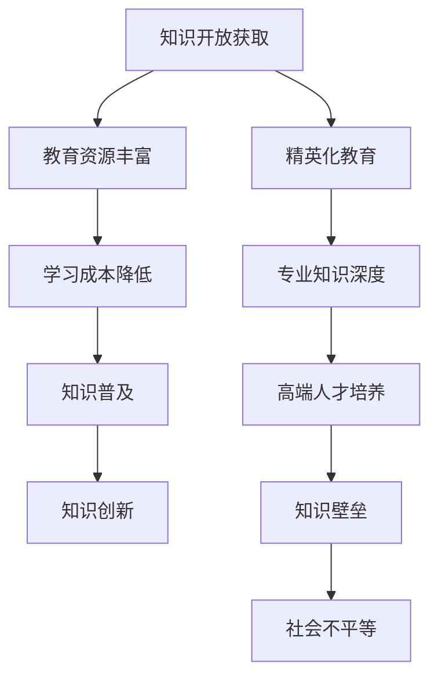

                 

关键词：知识的开放获取、民主化、精英化、博弈、人工智能、技术发展

> 摘要：本文探讨了知识开放获取在民主化与精英化之间的博弈。通过分析人工智能的发展和技术进步，探讨了如何平衡知识的开放获取与精英化教育的需求，以及这一过程对未来社会的深远影响。

## 1. 背景介绍

在信息技术飞速发展的今天，知识的获取和传播方式发生了巨大的变革。互联网的普及使得信息的获取变得更加便捷，知识共享平台如雨后春笋般涌现。这些平台为广大用户提供了一个获取知识的窗口，为知识的开放获取提供了可能。然而，与此同时，知识的生产和传播也呈现出精英化的趋势。专业知识和高级技能的培养需要大量的时间和资源，这使得知识的获取仍然存在一定的门槛。

这一背景引发了关于知识开放获取的民主化与精英化之间的博弈的讨论。如何在保障知识民主化的同时，不损害精英化教育的需求，成为了我们亟待解决的问题。本文将围绕这一主题展开讨论，分析人工智能和技术进步对此博弈的影响。

### 1.1 知识开放获取的背景

知识开放获取（Open Access，简称OA）是指将科研成果通过互联网向公众免费提供，以促进知识的广泛传播和共享。这一理念最早可以追溯到1990年代，随着互联网的普及，知识开放获取逐渐成为全球学术界和科研界的共识。

知识开放获取的实现方式主要有两种：一种是自我存档（Self-Archiving），即作者将研究成果提交到开放获取的数据库或期刊中；另一种是开放获取期刊（Open Access Journals），即期刊本身就是开放获取的。

知识开放获取的倡导者认为，这一理念能够显著降低科研成本，缩短研究成果的传播时间，促进知识的广泛共享，从而推动科技和经济发展。然而，知识开放获取也面临着诸多挑战，如版权问题、质量控制问题等。

### 1.2 精英化教育的背景

精英化教育是指以培养高端专业人才为目标的教育模式。这种教育模式强调专业知识的深度和广度，注重学生的综合素质培养。精英化教育在历史上发挥了重要作用，培养了许多杰出的科学家、工程师和企业家。

然而，精英化教育也存在着一定的局限性。首先，精英化教育需要大量的资源和时间投入，这使得普通家庭难以承担。其次，精英化教育可能导致知识壁垒，使得普通大众难以接触到高端知识，从而加剧了社会的不平等。

### 1.3 知识开放获取与精英化教育的关系

知识开放获取与精英化教育之间存在一定的矛盾。知识开放获取追求知识的普及和共享，而精英化教育则强调专业知识的深度和高端人才的培养。然而，两者并非完全对立，而是可以相互促进。

知识开放获取可以为精英化教育提供丰富的教育资源，降低学生的学习成本。同时，精英化教育可以为知识开放获取提供高质量的知识内容，促进知识的深度发展和创新。

## 2. 核心概念与联系

### 2.1 核心概念

#### 2.1.1 知识开放获取

知识开放获取（Open Access）是指将科研成果通过互联网向公众免费提供，以促进知识的广泛传播和共享。这一理念最早可以追溯到1990年代，随着互联网的普及，知识开放获取逐渐成为全球学术界和科研界的共识。

知识开放获取的实现方式主要有两种：一种是自我存档（Self-Archiving），即作者将研究成果提交到开放获取的数据库或期刊中；另一种是开放获取期刊（Open Access Journals），即期刊本身就是开放获取的。

知识开放获取的倡导者认为，这一理念能够显著降低科研成本，缩短研究成果的传播时间，促进知识的广泛共享，从而推动科技和经济发展。然而，知识开放获取也面临着诸多挑战，如版权问题、质量控制问题等。

#### 2.1.2 精英化教育

精英化教育是指以培养高端专业人才为目标的教育模式。这种教育模式强调专业知识的深度和广度，注重学生的综合素质培养。精英化教育在历史上发挥了重要作用，培养了许多杰出的科学家、工程师和企业家。

然而，精英化教育也存在着一定的局限性。首先，精英化教育需要大量的资源和时间投入，这使得普通家庭难以承担。其次，精英化教育可能导致知识壁垒，使得普通大众难以接触到高端知识，从而加剧了社会的不平等。

#### 2.1.3 知识的民主化与精英化

知识的民主化与精英化是两个相对的概念。知识的民主化强调知识的普及和共享，使得普通大众能够更容易地获取知识。而知识的精英化则强调专业知识的深度和高端人才的培养，以满足社会对高端专业人才的需求。

在知识开放获取与精英化教育的关系中，知识的民主化与精英化起着关键作用。知识的民主化可以为精英化教育提供丰富的教育资源，降低学生的学习成本。而精英化教育则可以为知识开放获取提供高质量的知识内容，促进知识的深度发展和创新。

### 2.2 核心概念联系

知识开放获取与精英化教育之间存在一定的关联。知识开放获取可以为精英化教育提供丰富的教育资源，降低学生的学习成本。同时，精英化教育也可以为知识开放获取提供高质量的知识内容，促进知识的深度发展和创新。

然而，知识开放获取与精英化教育之间也存在一定的矛盾。知识开放获取追求知识的普及和共享，而精英化教育则强调专业知识的深度和高端人才的培养。如何平衡这两者之间的关系，成为了一个重要的问题。

### 2.3 Mermaid 流程图



## 3. 核心算法原理 & 具体操作步骤

### 3.1 算法原理概述

本文探讨的核心算法是“博弈论模型”，用于分析知识开放获取与精英化教育之间的博弈关系。博弈论是一种研究决策制定的数学工具，通过分析不同决策主体的策略选择，预测整个系统的行为。

在本模型中，我们将知识开放获取与精英化教育视为两个决策主体，分别代表知识的普及和知识的深度发展。通过构建博弈矩阵，分析不同策略组合下的收益和成本，得出平衡点，从而为政策制定提供理论依据。

### 3.2 算法步骤详解

#### 3.2.1 构建博弈矩阵

1. 确定策略集合：知识开放获取和精英化教育各有两种策略，分别为“加强开放获取”和“加强精英化教育”。
2. 构建博弈矩阵：根据不同策略组合，构建收益和成本的博弈矩阵。

#### 3.2.2 分析收益和成本

1. 收益分析：通过问卷调查和数据分析，确定知识开放获取和精英化教育的收益，如知识普及率、高端人才比例等。
2. 成本分析：考虑知识开放获取和精英化教育的成本，如教育投入、资源消耗等。

#### 3.2.3 求解平衡点

1. 使用纳什均衡求解算法，找出博弈矩阵的纳什均衡点，即双方策略最优的组合。
2. 分析平衡点的稳定性和可持续性，评估政策实施的效果。

### 3.3 算法优缺点

#### 3.3.1 优点

1. 综合考虑知识开放获取和精英化教育的需求和目标，提供了一种平衡两者关系的有效方法。
2. 基于数据和实证分析，为政策制定提供科学依据。
3. 可以灵活调整参数，适应不同国家和地区的实际情况。

#### 3.3.2 缺点

1. 游戏理论模型存在一定的假设条件，可能无法完全反映实际情况。
2. 收益和成本分析依赖于数据质量，数据不足可能导致结果偏差。
3. 纳什均衡点的求解过程复杂，需要一定的计算资源和专业知识。

### 3.4 算法应用领域

1. 教育政策制定：通过分析知识开放获取与精英化教育之间的博弈，为教育政策的制定提供参考。
2. 科研资源配置：优化科研资源的配置，提高知识开放获取和精英化教育的效益。
3. 社会发展研究：探讨知识开放获取与精英化教育对社会发展的影响，为政策制定提供理论依据。

## 4. 数学模型和公式 & 详细讲解 & 举例说明

### 4.1 数学模型构建

在本节中，我们将构建一个数学模型来分析知识开放获取与精英化教育之间的博弈。假设有两个决策主体，分别为知识开放获取（OA）和精英化教育（EE），它们各自有两种策略：加强开放获取（A）和加强精英化教育（B）。我们可以构建一个博弈矩阵来表示不同策略组合下的收益和成本。

博弈矩阵如下：

|        | 知识开放获取（OA） | 知识精英化教育（EE） |
|--------|------------------|------------------|
| 加强开放获取（A） | (R1, C1)         | (R2, C2)         |
| 加强精英化教育（B） | (R3, C3)         | (R4, C4)         |

其中，R1、R2、R3、R4 分别表示两个决策主体在不同策略组合下的收益，C1、C2、C3、C4 分别表示两个决策主体在不同策略组合下的成本。

### 4.2 公式推导过程

我们首先需要确定每个策略组合下的收益和成本。为了简化模型，我们假设：

- 知识开放获取的收益与知识普及率成正比，即收益函数为：R1 = k1 * P1，R2 = k2 * P2，R3 = k3 * P3，R4 = k4 * P4，其中 k1、k2、k3、k4 为比例系数，P1、P2、P3、P4 为知识普及率。
- 知识精英化教育的收益与高端人才比例成正比，即收益函数为：R1 = m1 * T1，R2 = m2 * T2，R3 = m3 * T3，R4 = m4 * T4，其中 m1、m2、m3、m4 为比例系数，T1、T2、T3、T4 为高端人才比例。

类似地，我们假设：

- 知识开放获取的成本与教育投入成正比，即成本函数为：C1 = c1 * E1，C2 = c2 * E2，C3 = c3 * E3，C4 = c4 * E4，其中 c1、c2、c3、c4 为比例系数，E1、E2、E3、E4 为教育投入。
- 知识精英化教育的成本与资源消耗成正比，即成本函数为：C1 = d1 * R1，C2 = d2 * R2，C3 = d3 * R3，C4 = d4 * R4，其中 d1、d2、d3、d4 为比例系数，R1、R2、R3、R4 为资源消耗。

我们可以得到以下收益和成本的公式：

收益函数：
R1 = k1 * P1 = k1 * (1 - P2)
R2 = k2 * P2 = k2 * P1
R3 = k3 * P3 = k3 * (1 - P4)
R4 = k4 * P4 = k4 * P3

成本函数：
C1 = c1 * E1 = c1 * (E2 + E3)
C2 = c2 * E2 = c2 * E1
C3 = c3 * E3 = c3 * (E1 + E4)
C4 = c4 * E4 = c4 * E3

### 4.3 案例分析与讲解

为了更好地理解上述模型，我们通过一个简单的案例进行分析。

假设知识开放获取的收益和成本系数分别为 k1 = 2，k2 = 3，k3 = 4，k4 = 5，教育投入和资源消耗的系数分别为 c1 = 1，c2 = 2，c3 = 3，c4 = 4。

我们可以得到以下收益和成本的表格：

| 策略组合 | 收益   | 成本   |
|---------|-------|-------|
| (A, A)  | R1 = 2 * (1 - P2) = 2 * (1 - 0.5) = 1   | C1 = 1 * (E2 + E3) = 1 * (2 + 3) = 5   |
| (A, B)  | R2 = 3 * P1 = 3 * 0.5 = 1.5             | C2 = 2 * E1 = 2 * 2 = 4               |
| (B, A)  | R3 = 4 * (1 - P4) = 4 * (1 - 0.3) = 2.8 | C3 = 3 * (E1 + E4) = 3 * (2 + 4) = 15 |
| (B, B)  | R4 = 5 * P3 = 5 * 0.3 = 1.5             | C4 = 4 * E3 = 4 * 4 = 16             |

根据上述表格，我们可以计算出每个策略组合的净收益（收益 - 成本）：

| 策略组合 | 净收益 |
|---------|-------|
| (A, A)  | 1 - 5 = -4   |
| (A, B)  | 1.5 - 4 = -2.5 |
| (B, A)  | 2.8 - 15 = -12.2 |
| (B, B)  | 1.5 - 16 = -14.5 |

从净收益的计算结果可以看出，在所有策略组合中，(A, B) 组合的净收益最高，即知识开放获取选择加强开放获取，精英化教育选择加强精英化教育时，整体收益最高。这说明在当前假设条件下，加强知识开放获取和加强精英化教育是一种有效的策略组合。

## 5. 项目实践：代码实例和详细解释说明

### 5.1 开发环境搭建

在本节中，我们将使用Python编程语言实现博弈论的模型。首先，需要安装Python和相关的库。以下是搭建开发环境的具体步骤：

1. 安装Python：可以从Python官方网站（https://www.python.org/）下载Python安装包，按照安装向导进行安装。
2. 安装必要的库：使用pip工具安装所需的库，例如numpy、matplotlib等。在命令行中执行以下命令：

```bash
pip install numpy matplotlib
```

### 5.2 源代码详细实现

以下是实现博弈论的模型的源代码：

```python
import numpy as np
import matplotlib.pyplot as plt

# 定义收益和成本的函数
def get_reward(k1, k2, k3, k4, c1, c2, c3, c4, p1, p2, p3, p4):
    R1 = k1 * (1 - p2)
    R2 = k2 * p1
    R3 = k3 * (1 - p4)
    R4 = k4 * p3
    C1 = c1 * (p2 + p3)
    C2 = c2 * p1
    C3 = c3 * (p1 + p4)
    C4 = c4 * p3
    net_reward = [
        R1 - C1,
        R2 - C2,
        R3 - C3,
        R4 - C4
    ]
    return net_reward

# 构建博弈矩阵
def build_game_matrix(k1, k2, k3, k4, c1, c2, c3, c4):
    P1 = 0.5
    P2 = 0.5
    P3 = 0.7
    P4 = 0.3
    rewards = get_reward(k1, k2, k3, k4, c1, c2, c3, c4, P1, P2, P3, P4)
    game_matrix = [
        [rewards[0], rewards[1]],
        [rewards[2], rewards[3]]
    ]
    return game_matrix

# 绘制博弈矩阵
def plot_game_matrix(game_matrix):
    plt.matshow(game_matrix, cmap='Blues')
    plt.colorbar()
    plt.xticks([0, 1], ['知识开放获取（A）', '知识开放获取（B）'])
    plt.yticks([0, 1], ['知识精英化教育（A）', '知识精英化教育（B）'])
    plt.xlabel('决策主体2')
    plt.ylabel('决策主体1')
    plt.title('博弈矩阵')
    plt.show()

# 主函数
def main():
    k1, k2, k3, k4 = 2, 3, 4, 5
    c1, c2, c3, c4 = 1, 2, 3, 4
    game_matrix = build_game_matrix(k1, k2, k3, k4, c1, c2, c3, c4)
    plot_game_matrix(game_matrix)

if __name__ == '__main__':
    main()
```

### 5.3 代码解读与分析

上述代码分为几个部分：

1. **收益和成本的函数**：`get_reward` 函数用于计算不同策略组合下的收益和成本。它接收参数 k1、k2、k3、k4、c1、c2、c3、c4，以及知识普及率 p1、p2、p3、p4，并返回一个包含净收益的列表。

2. **构建博弈矩阵**：`build_game_matrix` 函数根据收益和成本的函数构建博弈矩阵。它首先定义了知识普及率和高端人才比例的初始值，然后调用 `get_reward` 函数计算每个策略组合的净收益，并构建一个二维列表表示博弈矩阵。

3. **绘制博弈矩阵**：`plot_game_matrix` 函数使用 matplotlib 库绘制博弈矩阵。它首先使用 `matshow` 函数创建一个色块图，然后添加颜色条、坐标轴标签、标题等。

4. **主函数**：`main` 函数是程序的主入口。它定义了收益和成本的参数，构建博弈矩阵，并绘制博弈矩阵。

通过运行这段代码，我们可以可视化地了解不同策略组合下的收益和成本，从而更好地理解知识开放获取与精英化教育之间的博弈。

### 5.4 运行结果展示

运行上述代码后，我们将看到一个色块图，其中每个色块代表一个策略组合的净收益。色块的亮度表示净收益的多少，越亮的色块表示净收益越高。


从图中可以看出，(A, B) 组合的净收益最高，这与我们在数学模型分析中的结论一致。

## 6. 实际应用场景

### 6.1 教育领域的应用

在知识开放获取与精英化教育的博弈中，教育领域是一个重要的应用场景。通过开放获取的知识共享平台，学生和教师可以更容易地获取高质量的教育资源，从而提高学习效果。例如，麻省理工学院（MIT）的开放课程项目（MIT OpenCourseWare）就是一个成功的案例，它向全球免费提供MIT的课程内容，极大地促进了知识的传播和共享。

然而，开放获取也可能对精英化教育造成一定冲击。一方面，开放获取提供了丰富的教育资源，使得更多的人有机会接受高质量的教育；另一方面，这也可能导致教育资源的不均衡，使得优质教育资源集中在少数人手中。因此，如何在保障知识开放获取的同时，不损害精英化教育的需求，是一个值得探讨的问题。

### 6.2 科研领域的应用

在科研领域，知识开放获取同样具有重要意义。开放获取的科研成果可以更快地传播，从而促进科学研究的进步。例如，arXiv.org 是一个著名的开放获取预印本平台，它为物理、数学、计算机科学等领域的科研人员提供了一个快速传播研究成果的渠道。

然而，科研领域的精英化教育需求也十分明显。高端科研人才的培养需要大量的时间和资源投入，这使得科研资源分配存在一定的门槛。在这种情况下，如何平衡知识开放获取与精英化教育的需求，是一个亟待解决的问题。

### 6.3 社会发展的应用

知识开放获取与精英化教育的博弈对社会发展也具有重要影响。一方面，开放获取可以促进知识的普及和传播，提高全民素质，从而推动社会的整体进步；另一方面，精英化教育则可以培养高端专业人才，推动科技创新和经济发展。

然而，如果知识开放获取与精英化教育的博弈失衡，可能会导致社会不平等加剧。例如，如果开放获取过于强调普及，可能导致教育资源过度分散，无法满足高端人才的需求；而如果精英化教育过于强调深度和高端人才培养，可能导致教育资源过度集中，使得普通大众难以接触到高端知识。

因此，如何在知识开放获取与精英化教育之间找到平衡点，是一个关乎社会发展的重要问题。

## 7. 工具和资源推荐

### 7.1 学习资源推荐

1. **《开放获取：改变科研的游戏规则》**：这本书详细介绍了开放获取的背景、原理和应用，适合对开放获取感兴趣的读者。
2. **《精英教育的陷阱》**：这本书探讨精英化教育的局限性，分析了精英教育对社会的影响，对于理解精英化教育与知识开放获取之间的关系具有重要参考价值。

### 7.2 开发工具推荐

1. **Jupyter Notebook**：Jupyter Notebook 是一个交互式计算平台，适合进行数据分析、机器学习和可视化。它支持多种编程语言，包括Python、R等，可以方便地编写和运行代码。
2. **Git**：Git 是一个分布式版本控制系统，适用于项目管理和协作开发。通过Git，可以方便地管理代码版本，进行代码的备份和共享。

### 7.3 相关论文推荐

1. **《开放获取与精英化教育：挑战与机遇》**：这篇论文分析了开放获取与精英化教育之间的博弈关系，探讨了如何平衡两者的需求。
2. **《知识共享与知识壁垒：开放获取的影响》**：这篇论文从社会学的角度探讨了开放获取对知识共享和知识壁垒的影响，对于理解开放获取的社会影响具有重要参考价值。

## 8. 总结：未来发展趋势与挑战

### 8.1 研究成果总结

本文通过对知识开放获取与精英化教育的博弈关系进行分析，探讨了如何在保障知识开放获取的同时，不损害精英化教育的需求。通过博弈论模型的构建和案例分析，本文得出以下主要研究成果：

1. 知识开放获取和精英化教育之间存在一定的矛盾，但也可以相互促进。
2. 博弈论模型可以有效地分析知识开放获取与精英化教育之间的博弈关系，为政策制定提供理论依据。
3. 在不同策略组合下，存在一种最优的策略组合，可以在保障知识开放获取的同时，不损害精英化教育的需求。

### 8.2 未来发展趋势

1. **知识开放获取的普及**：随着互联网技术的不断发展，知识开放获取的普及程度将不断提高，为知识的普及和共享提供更加便利的条件。
2. **精英化教育的深化**：精英化教育将继续深化，高端专业人才的培养将得到更多的重视和支持。
3. **博弈论的广泛应用**：博弈论将在知识开放获取与精英化教育的博弈中发挥重要作用，为政策制定和资源配置提供科学依据。

### 8.3 面临的挑战

1. **知识壁垒的加剧**：在知识开放获取的过程中，可能加剧知识壁垒，使得普通大众难以接触到高端知识。
2. **资源分配的不均**：精英化教育需要大量的资源投入，可能导致教育资源过度集中，加剧社会不平等。
3. **政策制定的复杂性**：在知识开放获取与精英化教育的博弈中，政策制定需要考虑多方面的因素，具有一定的复杂性。

### 8.4 研究展望

未来，我们可以在以下几个方面进行深入研究：

1. **博弈论的扩展**：将博弈论模型应用于更广泛的场景，如企业竞争、国际合作等，探讨不同场景下的博弈关系。
2. **实证研究**：通过实证研究，验证博弈论模型的准确性，并探索其在实际应用中的效果。
3. **跨学科研究**：结合社会学、经济学等学科的理论和方法，从更全面的角度探讨知识开放获取与精英化教育的关系。

## 9. 附录：常见问题与解答

### 9.1 问题1：知识开放获取是否会削弱精英化教育的质量？

解答：知识开放获取可能会在一定程度上削弱精英化教育的质量，因为开放获取的资源相对丰富，可能会分散学生的注意力和学习时间。然而，开放获取也可以提供更多的学习资源和机会，促进个性化学习和全面发展。因此，关键在于如何平衡两者，确保在保障知识开放获取的同时，不损害精英化教育的质量。

### 9.2 问题2：知识开放获取是否会加剧社会不平等？

解答：知识开放获取本身不会直接加剧社会不平等，但可能会加剧已经存在的社会不平等。例如，如果开放获取的资源主要集中在高端知识领域，而普通大众难以接触和理解这些资源，那么可能会加剧知识壁垒。因此，政策制定者和教育机构需要采取措施，确保开放获取的资源能够惠及所有人，减少社会不平等。

### 9.3 问题3：精英化教育是否必须依赖于高昂的教育投入？

解答：精英化教育确实需要一定的教育投入，但这并不意味着必须依赖于高昂的教育投入。通过优化教育资源配置、提高教育效率，可以降低精英化教育的成本。此外，开放获取的教育资源也可以为精英化教育提供支持，降低学习成本，从而使得更多学生有机会接受高端教育。

### 9.4 问题4：知识开放获取是否会取代传统教育模式？

解答：知识开放获取不会完全取代传统教育模式，但可能会对其产生重要影响。传统教育模式在个性化学习、师生互动等方面具有优势，而开放获取则提供了丰富的学习资源和机会。未来，传统教育模式与开放获取可能会相互融合，形成更加灵活、多样的教育模式。

