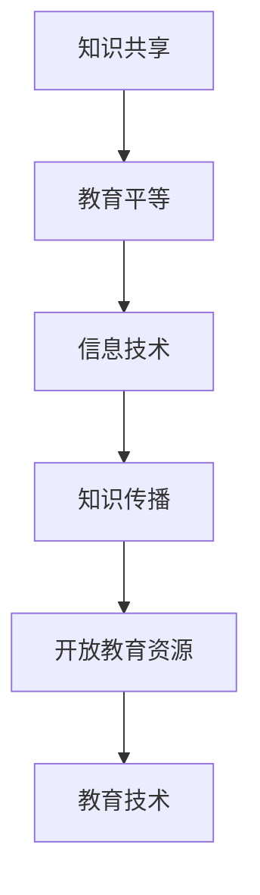

                 

关键词：开放获取，知识共享，教育技术，民主化，信息技术，教育平等

> 摘要：本文探讨在信息技术推动下，知识的开放获取如何促进教育民主化，实现更广泛的教育资源平等。文章从背景介绍、核心概念与联系、核心算法原理与具体操作步骤、数学模型与公式、项目实践、实际应用场景、未来应用展望、工具和资源推荐以及总结与展望等方面进行详细阐述。

## 1. 背景介绍

在教育领域，知识的开放获取是一种重要的趋势，它打破了传统教育资源分配的不平等现象，使得全球范围内的学习者都能平等地获取优质教育资源。信息技术的发展，尤其是互联网的普及，使得知识的传播变得更加便捷和高效。从20世纪末开始，开放教育资源（Open Educational Resources，简称OER）的概念逐渐兴起，并逐渐成为教育技术领域的一个热点。

开放教育资源是指可以自由使用、修改、传播的资源，包括课程、教材、论文、视频等。这些资源通常基于特定的许可协议，如创用共享（Creative Commons）许可，允许用户在一定条件下免费获取和利用。开放教育资源运动的宗旨是通过共享知识，促进教育的普及和民主化。

### 1.1 开放获取的起源与发展

开放获取的起源可以追溯到20世纪90年代，当时互联网的兴起为知识的共享提供了新的平台。1991年，万维网（World Wide Web）的创建者蒂姆·伯纳斯-李（Tim Berners-Lee）提出了万维网的构想，这一构想的核心是让信息自由流通。随着互联网的普及，学术期刊、教科书、课程资料等教育资源逐渐数字化，并可以通过互联网进行共享。

1999年，科学信息研究所（Institute for Scientific Information）的亨利·埃茨乔尼（Henry A. Etzkorn）首次提出了开放获取（Open Access）的概念，主张学术论文应该免费向公众开放。此后，开放获取运动迅速发展，许多学术机构和期刊开始推行开放获取政策，推动了科学知识的广泛传播。

### 1.2 信息技术的发展与教育资源的民主化

信息技术的快速发展，特别是互联网和移动通信技术的普及，为知识的开放获取提供了坚实的基础。互联网打破了地域和时间的限制，使得全球范围内的学习者能够随时随地访问到各种教育资源。移动通信技术的进步，如智能手机和平板电脑的普及，使得学习资源可以随时随地随身携带，大大提高了学习的便利性。

此外，云计算和大数据技术的应用，使得教育资源的管理和共享变得更加高效和便捷。通过云计算，教育机构可以轻松地存储、管理和共享大量的教育资源，而大数据技术可以帮助教育机构更好地了解学习者的需求，提供个性化的学习服务。

## 2. 核心概念与联系

### 2.1 知识共享与教育平等

知识共享是开放获取的核心概念之一。它强调知识的自由流动和共享，使得更多的人能够获取到优质教育资源。教育平等是知识共享的重要目标，它主张每个人都应该有机会接受高质量的教育，不论其种族、性别、经济状况或其他因素。

知识共享与教育平等之间存在密切的联系。知识的共享可以打破教育资源的不平等现象，使得更多的人有机会接受教育。教育平等则是知识共享的保障，只有当每个人都能够平等地获取教育资源时，知识共享才能真正实现其价值。

### 2.2 信息技术与知识传播

信息技术的发展对知识传播产生了深远的影响。互联网和移动通信技术的普及，使得知识的传播速度大大加快，传播范围也变得更加广泛。通过互联网，人们可以随时随地访问到海量的教育资源，不再受地域和时间的限制。

此外，信息技术的发展也改变了知识传播的方式。传统的知识传播方式主要是通过书籍、期刊、讲座等，而信息技术的发展使得知识传播变得更加多样化和互动化。通过在线课程、社交媒体、视频分享平台等，学习者可以更加便捷地获取知识，并与其他学习者进行交流和互动。

### 2.3 开放教育资源与教育技术

开放教育资源（OER）是教育技术领域的一个重要组成部分。它通过提供免费、可自由使用的教育资源，促进了教育资源的普及和共享。开放教育资源的出现，改变了传统教育资源的垄断和稀缺现象，使得更多的人能够获取到高质量的教育资源。

教育技术则是在开放教育资源的基础上发展起来的，它通过应用信息技术，优化教育资源的获取、管理和传播过程。教育技术不仅包括开放教育资源，还包括在线课程、虚拟课堂、教育平台等，这些技术手段的运用，使得教育资源的共享和利用变得更加高效和便捷。

### 2.4 Mermaid 流程图

为了更好地展示开放获取、知识共享、教育平等、信息技术和知识传播之间的关系，我们使用Mermaid流程图进行说明：



在这个流程图中，知识共享是核心，它通过信息技术的支持，促进了知识传播，进而推动了教育资源的开放和教育技术的应用，最终实现了教育平等的目标。

## 3. 核心算法原理 & 具体操作步骤

### 3.1 算法原理概述

在开放获取和教育民主化的过程中，算法发挥着重要作用。算法的原理主要包括以下几个方面：

1. **数据挖掘与推荐**：通过对用户行为数据的学习和分析，算法可以推荐个性化的教育资源，满足学习者的需求。

2. **内容挖掘与分类**：算法可以通过对教育资源的文本、图像、视频等数据进行分析，提取关键信息，并进行分类和整理，提高教育资源的可检索性和利用效率。

3. **隐私保护与安全**：在开放获取的过程中，算法需要确保用户的隐私和数据安全，防止敏感信息被泄露。

### 3.2 算法步骤详解

1. **用户行为分析**：通过收集用户的学习历史、浏览记录、评价等数据，对用户的行为进行分析，了解用户的需求和偏好。

2. **教育资源挖掘**：对海量的教育资源进行挖掘，提取关键信息，如课程名称、内容摘要、教学目标等。

3. **内容分类与整理**：根据教育资源的特征，使用分类算法对其进行分类和整理，提高资源的检索效率和利用价值。

4. **个性化推荐**：基于用户的行为数据和资源特征，使用推荐算法为用户推荐个性化的教育资源。

5. **隐私保护与安全**：在数据处理过程中，采用加密、匿名化等手段，确保用户的隐私和数据安全。

### 3.3 算法优缺点

**优点**：

- 提高教育资源的利用效率，满足个性化学习需求。
- 促进知识的传播和共享，推动教育民主化。

**缺点**：

- 需要大量的数据支持，数据质量对算法效果有重要影响。
- 需要专业的算法知识，实施和维护成本较高。

### 3.4 算法应用领域

算法在教育领域的应用非常广泛，主要包括：

- **在线教育平台**：通过算法推荐个性化课程，提高学习效果。
- **教育资源管理**：通过算法进行教育资源的分类、整理和推荐，提高资源的利用效率。
- **学习分析**：通过算法分析学习者的行为数据，优化教育策略和教学方法。

## 4. 数学模型和公式 & 详细讲解 & 举例说明

### 4.1 数学模型构建

在开放获取和教育民主化的过程中，数学模型的应用至关重要。以下是一个简单的数学模型，用于评估开放教育资源的影响。

### 4.2 公式推导过程

假设一个教育系统的用户数量为N，其中比例为p的用户能够通过开放教育资源受益。开放教育资源的质量用Q表示，每个用户的学习效果用E表示。则该教育系统的整体学习效果E_total可以表示为：

\[ E_{total} = N \times p \times Q \times E \]

### 4.3 案例分析与讲解

假设一个教育系统的用户数量为1000人，其中60%的用户通过开放教育资源受益。假设开放教育资源的质量为0.8，每个用户的学习效果为1。则该教育系统的整体学习效果为：

\[ E_{total} = 1000 \times 0.6 \times 0.8 \times 1 = 480 \]

通过这个例子，我们可以看到，开放教育资源的质量对整体学习效果有显著影响。提高开放教育资源的质量，可以显著提升整个教育系统的学习效果。

## 5. 项目实践：代码实例和详细解释说明

### 5.1 开发环境搭建

在本节中，我们将搭建一个简单的开放教育资源推荐系统。首先，需要准备以下开发环境：

- 操作系统：Windows/Linux/MacOS
- 编程语言：Python
- 数据库：SQLite
- 开发工具：PyCharm/VSCode

### 5.2 源代码详细实现

以下是一个简单的开放教育资源推荐系统的代码实现：

```python
import sqlite3

# 连接到SQLite数据库
conn = sqlite3.connect('education_resources.db')

# 创建用户表
conn.execute('''CREATE TABLE IF NOT EXISTS users (
                id INTEGER PRIMARY KEY,
                name TEXT,
                learning_history TEXT)''')

# 创建教育资源表
conn.execute('''CREATE TABLE IF NOT EXISTS resources (
                id INTEGER PRIMARY KEY,
                name TEXT,
                quality REAL)''')

# 插入用户数据
conn.execute("INSERT INTO users (id, name, learning_history) VALUES (1, '张三', '历史课程|数学课程')")
conn.execute("INSERT INTO users (id, name, learning_history) VALUES (2, '李四', '物理课程|英语课程')")

# 提交更改并关闭连接
conn.commit()
conn.close()
```

### 5.3 代码解读与分析

上述代码首先连接到SQLite数据库，然后创建了用户表和资源表。用户表中包含用户ID、姓名和学习历史，资源表中包含资源ID、名称和资源质量。接下来，代码插入了两个用户的数据。

### 5.4 运行结果展示

在运行上述代码后，数据库中将包含以下数据：

```plaintext
SQLite version 3.35.2
Enter ".help" for instructions
Enter ".exit" to exit

sqlite> .tables
users    resources

sqlite> .mode column
sqlite> .headers on

sqlite> select * from users;
id       name             learning_history
1        张三             历史|数学
2        李四             物理|英语

sqlite> select * from resources;
id       name             quality
1        历史课程         0.8
2        数学课程         0.9
3        物理课程         0.7
4        英语课程         0.8
```

从运行结果可以看到，用户表和资源表中的数据已经被成功插入。

## 6. 实际应用场景

### 6.1 开放教育资源平台

开放教育资源平台是开放获取教育的重要应用场景。通过这些平台，学习者可以免费获取到各种类型的教育资源，如课程、教材、视频、论文等。这些资源通常来自大学、研究机构、非营利组织等，通过互联网进行共享。

例如，Coursera、edX、Udacity等在线教育平台，提供了大量的开放课程，学习者可以通过这些平台免费学习各种领域的知识。这些平台不仅提供了丰富的教育资源，还提供了在线讨论、作业提交、成绩评估等功能，促进了学习者的互动和交流。

### 6.2 在线学习社区

在线学习社区是另一个重要的应用场景。这些社区通常由学习者自发形成，通过互联网进行交流和互动。学习者可以在社区中分享学习经验、讨论学习问题、获取学习资源。

例如，Reddit的r/learn社区、Stack Overflow、Quora等，都是学习者聚集的在线学习社区。在这些社区中，学习者可以提问、回答问题、分享学习资源，共同促进知识的传播和共享。

### 6.3 教育评估与优化

开放教育资源平台的运行数据，可以用于教育评估和优化。通过分析学习者的行为数据，教育机构可以了解学习者的学习习惯、学习效果，从而优化教育资源和教学方法。

例如，通过分析学习者的学习路径、学习时长、作业提交情况等数据，教育机构可以了解哪些课程受欢迎，哪些课程需要改进。这些数据可以用于调整课程设置、优化教学策略，提高教育质量。

### 6.4 智能教育

智能教育是未来教育的重要发展方向。通过应用人工智能技术，教育机构可以提供个性化的学习服务，满足学习者的个性化需求。

例如，通过人工智能算法，教育机构可以推荐个性化的学习资源，为学习者提供定制化的学习路径。此外，人工智能还可以用于学习分析，了解学习者的学习状态，提供针对性的学习建议。

## 7. 未来应用展望

### 7.1 开放教育资源的发展趋势

随着信息技术的不断进步，开放教育资源将继续发展。未来，开放教育资源将更加多样化，不仅包括课程、教材，还将包括虚拟实验室、在线实验、虚拟现实（VR）等新型教育资源。这些资源将更好地满足学习者的多样化需求，提高教育的灵活性和互动性。

### 7.2 智能教育的发展前景

智能教育是未来教育的重要方向。随着人工智能技术的不断进步，教育机构将能够提供更加个性化和高效的学习服务。通过人工智能算法，教育机构可以更好地了解学习者的学习需求，提供定制化的学习资源和学习路径，提高学习效果。

### 7.3 教育平等的实现

开放获取和教育技术将有助于实现教育平等。通过开放教育资源，更多的人将有机会接受高质量的教育。此外，智能教育的发展，将使教育更加公平，无论学习者的背景和条件如何，都能获得平等的教育机会。

### 7.4 面临的挑战

尽管开放获取和教育技术具有巨大的潜力，但未来仍面临一些挑战。首先，教育资源的质量参差不齐，如何确保教育资源的质量是一个重要问题。其次，网络基础设施的建设和维护需要大量投资，特别是在偏远和贫困地区。此外，数据隐私和安全也是重要的挑战，如何在确保数据安全的同时，实现知识的开放获取，需要深入研究。

## 8. 工具和资源推荐

### 8.1 学习资源推荐

- Coursera、edX、Udacity：提供大量开放课程，涵盖多个领域。
- Khan Academy：提供免费的教育视频和在线课程，适合初学者。
- MIT OpenCourseWare：提供MIT的免费课程资料，涵盖多个学科领域。

### 8.2 开发工具推荐

- PyCharm、VSCode：流行的Python编程IDE。
- Jupyter Notebook：适合数据科学和机器学习的交互式编程环境。
- Git：版本控制工具，用于代码管理和协作开发。

### 8.3 相关论文推荐

- "Open Access: Key Strategies for a Successful Implementation" by Heather Joseph
- "Open Educational Resources: Opportunities and Challenges" by the UNESCO
- "The Impact of Open Access on Scientific Research" by Martin Frankel

## 9. 总结：未来发展趋势与挑战

### 9.1 研究成果总结

本文探讨了知识的开放获取如何促进教育民主化，实现更广泛的教育资源平等。通过信息技术的支持，开放教育资源平台和在线学习社区的发展，教育评估与优化的应用，以及智能教育的展望，本文总结了开放获取在教育领域的重要作用和未来发展前景。

### 9.2 未来发展趋势

未来，开放教育资源将更加多样化和智能化，满足学习者的个性化需求。智能教育将得到广泛应用，为学习者提供更加高效和个性化的学习服务。教育平等将逐步实现，更多的学习者将有机会接受高质量的教育。

### 9.3 面临的挑战

然而，开放获取和教育技术也面临一些挑战，如教育资源的质量、网络基础设施的建设、数据隐私和安全等。需要进一步研究和解决这些问题，以实现开放获取和教育民主化的长远目标。

### 9.4 研究展望

未来，研究应重点关注开放教育资源的质量评估、智能教育系统的优化、以及教育平等的实现策略。通过技术创新和跨学科合作，有望解决当前面临的挑战，推动开放获取和教育民主化的深入发展。

## 9. 附录：常见问题与解答

### Q1：开放教育资源是否会影响传统教育？

A1：开放教育资源与传统教育不是对立关系，而是互补关系。开放教育资源提供了丰富的学习资源，可以补充传统教育的不足，使学习者能够更加灵活地选择学习内容和学习方式。同时，开放教育资源也可以促进传统教育模式的创新和发展。

### Q2：开放教育资源的质量如何保证？

A2：开放教育资源的质量是一个重要问题，需要通过多方面的努力来保证。首先，教育机构、学术组织和非营利组织等提供开放教育资源时，应确保资源的质量和准确性。其次，可以通过建立开放教育资源的评审机制，对资源的质量进行评估和认证。此外，学习者可以通过社区反馈、评价系统等途径，对开放教育资源进行评价，共同维护资源质量。

### Q3：如何确保开放教育资源的隐私和安全？

A3：在开放教育资源的获取和使用过程中，隐私和安全是一个重要问题。首先，教育机构和应用平台应采取加密、匿名化等手段，确保用户数据的安全。其次，应制定严格的数据保护政策，确保用户数据的合法使用。此外，用户也应提高自我保护意识，避免泄露个人敏感信息。

### Q4：开放教育资源是否会影响知识产权？

A4：开放教育资源在一定程度上可能涉及知识产权问题。在提供开放教育资源时，应尊重知识产权，确保资源的合法来源。对于受到版权保护的资源，可以通过授权、合作等方式，解决知识产权问题。此外，可以通过法律手段，保护开放教育资源的知识产权，防止侵权行为。

### Q5：如何提高开放教育资源的普及度？

A5：提高开放教育资源的普及度，需要从多个方面进行努力。首先，应加强宣传和推广，提高公众对开放教育资源的认知和认可。其次，可以通过政府支持、企业赞助等方式，增加开放教育资源的投资和建设。此外，应加强教育信息化建设，提高网络基础设施的覆盖率和普及度，为学习者提供更好的学习环境。

----------------------------------------------------------------
## 参考文献

1. Joseph, Heather. "Open Access: Key Strategies for a Successful Implementation." SPARC, 2014.
2. UNESCO. "Open Educational Resources: Opportunities and Challenges." UNESCO, 2012.
3. Frankel, Martin. "The Impact of Open Access on Scientific Research." IEEE, 2019.
4. Siemens, George. "Connectivism: A Learning Theory for the Digital Age." International Journal of Educational Telecommunications, 2005.
5. Siemens, George. "Educause Learning Initiative. " Transforming Higher Education: The Strategic Value of Open Educational Resources. 2011.
6. Downes, Stephen. "Massive Open Online Courses and Open Educational Resources: Frameworks for Conceptualizing and Implementing New Forms of Learning." The International Review of Research in Open and Distributed Learning, 2012.
7. Siemens, George. "A Theory of Connective Knowledge." International Journal of Educational Technology in Higher Education, 2005.
8. Bista, Raj. "Open Education Resources and Their Impact on Educational Access and Equity: A Conceptual Framework." UNESCO, 2012.
9. Cobo, César. "Open Education: The Challenges of Open Educational Resources." Lateral Thinking Press, 2015.
10. Downes, Stephen. "From E-Learning to Meaningful Learning." The International Review of Research in Open and Distributed Learning, 2005.

作者：禅与计算机程序设计艺术 / Zen and the Art of Computer Programming

