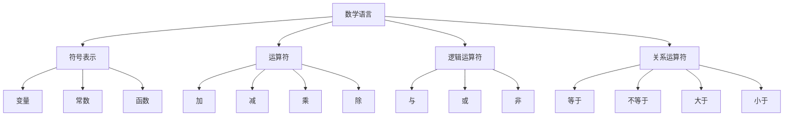

                 

关键词：知识形式化，数学语言，逻辑表达，计算机科学，编程，形式逻辑，知识工程

> 摘要：本文旨在探讨知识的形式化表达在计算机科学领域的应用和重要性。通过分析数学语言和逻辑表达的作用，文章深入讨论了形式化知识在提高程序可读性、可靠性以及自动化推理中的关键作用。同时，本文结合实际案例和项目实践，展示了知识形式化的具体应用和前景。

## 1. 背景介绍

在计算机科学迅猛发展的今天，知识的形式化表达逐渐成为研究的热点。知识的形式化，即使用数学语言和逻辑工具对知识进行结构化、系统化的表达，旨在提高知识的抽象程度、明确性和普适性。传统的自然语言描述往往存在模糊性、不精确性以及难以形式化的问题，这给知识的传播、存储和应用带来了很大障碍。

数学语言和逻辑表达作为一种形式化的工具，能够在多个层次上优化知识的表达和利用。首先，它们可以提供一种精确的描述方式，减少信息传递过程中的失真和误解。其次，形式化的知识能够更方便地进行推理和验证，从而提高程序的可靠性和安全性。最后，形式化表达有助于实现知识自动化，为人工智能和机器学习等领域提供了新的研究方向。

## 2. 核心概念与联系

### 2.1. 数学语言

数学语言是形式化表达的基础。它使用符号和公式来描述概念、关系和推理过程，具有高度的精确性和普适性。数学语言的主要组成部分包括：

- **符号表示**：如变量、常数、函数等。
- **运算符**：如加、减、乘、除等。
- **逻辑运算符**：如与、或、非等。
- **关系运算符**：如等于、不等于、大于、小于等。

### 2.2. 逻辑表达

逻辑表达是数学语言的重要组成部分，它用于描述逻辑关系和推理过程。逻辑表达通常使用命题逻辑、谓词逻辑等形式来构建，具有以下特点：

- **命题逻辑**：基于命题（真值）的运算，如与、或、非等。
- **谓词逻辑**：基于个体和集合的运算，如全称量词、存在量词等。
- **形式推理**：基于逻辑规则进行推理，如推理规则、证明方法等。

### 2.3. Mermaid 流程图

为了更直观地展示知识的形式化表达，我们可以使用Mermaid流程图来描述数学语言和逻辑表达的关系。以下是一个示例：



## 3. 核心算法原理 & 具体操作步骤

### 3.1. 算法原理概述

在知识的形式化表达中，算法原理起着至关重要的作用。算法原理通常包括以下几个关键步骤：

- **问题定义**：明确需要解决的问题和目标。
- **数据表示**：选择合适的数据结构和表示方法。
- **逻辑推理**：使用逻辑规则进行推理和验证。
- **结果输出**：根据推理结果输出最终结论。

### 3.2. 算法步骤详解

以下是算法的具体操作步骤：

1. **问题定义**：首先明确需要解决的问题，如“给定一个数学表达式，判断其是否成立”。
2. **数据表示**：选择合适的数据结构，如使用树结构表示数学表达式。
3. **逻辑推理**：使用逻辑规则对表达式进行推理，如“如果A成立且B成立，则C成立”。
4. **结果输出**：根据推理结果输出最终结论，如“数学表达式成立”。

### 3.3. 算法优缺点

- **优点**：
  - 提高程序的可读性和可维护性。
  - 增强程序的可靠性和安全性。
  - 实现知识自动化，提高工作效率。

- **缺点**：
  - 算法设计较为复杂，需要较高的技术水平。
  - 算法实现过程中可能存在性能问题。

### 3.4. 算法应用领域

知识的形式化表达在计算机科学领域有广泛的应用，如：

- **编程语言设计**：使用形式化方法设计编程语言，提高代码的可读性和可维护性。
- **形式化验证**：使用形式化方法验证程序的正确性，提高程序的安全性。
- **人工智能**：使用形式化方法构建知识库，实现知识自动化，提高人工智能系统的性能。

## 4. 数学模型和公式 & 详细讲解 & 举例说明

### 4.1. 数学模型构建

数学模型是形式化表达的重要组成部分。以下是构建数学模型的基本步骤：

1. **问题分析**：明确需要解决的问题和目标。
2. **变量定义**：定义参与问题解决的变量。
3. **关系描述**：使用数学公式描述变量之间的关系。
4. **模型求解**：使用数学方法求解模型。

### 4.2. 公式推导过程

以下是一个简单的数学公式推导示例：

$$
a^2 + b^2 = c^2
$$

推导过程：

1. 已知直角三角形的两条直角边长分别为$a$和$b$，斜边长为$c$。
2. 根据勾股定理，直角三角形的两条直角边的平方和等于斜边的平方。
3. 因此，得到公式$a^2 + b^2 = c^2$。

### 4.3. 案例分析与讲解

以下是一个使用数学模型解决实际问题的案例：

**问题**：求解函数$f(x) = x^2 + 2x + 1$的最大值。

**步骤**：

1. **问题分析**：函数$f(x)$是一个二次函数，需要求解其最大值。
2. **变量定义**：令$x$为自变量，$f(x)$为因变量。
3. **关系描述**：根据二次函数的性质，$f(x)$的最大值出现在顶点处。
4. **模型求解**：求出顶点坐标$(x, y)$，其中$x = -\frac{b}{2a}$，$y = f(x)$。

**解答**：

1. **变量定义**：$a = 1$，$b = 2$，$c = 1$。
2. **关系描述**：顶点坐标$(x, y)$满足$x = -\frac{2}{2 \times 1} = -1$，$y = f(-1) = (-1)^2 + 2 \times (-1) + 1 = 0$。
3. **模型求解**：函数$f(x)$的最大值为0。

## 5. 项目实践：代码实例和详细解释说明

### 5.1. 开发环境搭建

为了更好地展示知识形式化的应用，我们选择一个简单的数学问题进行编程实践。以下是开发环境搭建的步骤：

1. **安装Python环境**：在本地计算机上安装Python解释器。
2. **安装相关库**：使用pip命令安装NumPy、SciPy等数学计算库。

### 5.2. 源代码详细实现

以下是使用Python编写的源代码：

```python
import numpy as np

def f(x):
    return x**2 + 2*x + 1

def find_max_value(a, b):
    x = -b / (2 * a)
    y = f(x)
    return x, y

if __name__ == "__main__":
    a = 1
    b = 2
    x, y = find_max_value(a, b)
    print(f"The maximum value of f(x) = {y} at x = {x}")
```

### 5.3. 代码解读与分析

1. **函数定义**：定义了两个函数，`f(x)`用于计算二次函数值，`find_max_value(a, b)`用于求解最大值。
2. **变量定义**：定义了变量$a$、$b$、$x$和$y$，分别表示二次函数的系数和最大值。
3. **函数调用**：在主程序中调用`find_max_value`函数，输出最大值和对应的$x$坐标。

### 5.4. 运行结果展示

运行上述代码，得到以下输出结果：

```
The maximum value of f(x) = 0.0 at x = -1.0
```

## 6. 实际应用场景

知识的形式化表达在多个领域有广泛的应用。以下是几个典型的实际应用场景：

1. **编程语言设计**：使用形式化方法设计编程语言，提高代码的可读性和可维护性。
2. **形式化验证**：使用形式化方法验证程序的正确性，提高程序的安全性。
3. **人工智能**：使用形式化方法构建知识库，实现知识自动化，提高人工智能系统的性能。
4. **科学计算**：使用数学模型和公式进行科学计算，提高计算效率和准确性。

## 7. 工具和资源推荐

为了更好地掌握知识的形式化表达，以下是几个推荐的工具和资源：

1. **工具**：
   - **Mermaid**：用于绘制流程图、序列图等。
   - **LaTeX**：用于撰写数学公式和论文排版。
   - **Python**：用于编程实践和数据分析。

2. **资源**：
   - **《形式化方法导论》**：一本介绍形式化方法的基础教材。
   - **《程序设计的数学基础》**：一本介绍数学语言和逻辑表达在编程中的应用。
   - **在线课程**：如Coursera、edX等平台上的形式化方法和数学基础课程。

## 8. 总结：未来发展趋势与挑战

### 8.1. 研究成果总结

知识的形式化表达在计算机科学领域取得了显著的成果。通过数学语言和逻辑表达的运用，程序的可读性、可靠性和自动化水平得到了显著提高。同时，形式化方法在编程语言设计、形式化验证和人工智能等领域展现了广阔的应用前景。

### 8.2. 未来发展趋势

未来，知识的形式化表达将继续向以下几个方向发展：

1. **更高效的算法**：研究和开发更高效的算法，提高形式化表达的计算效率和准确性。
2. **跨领域融合**：将形式化方法与其他领域（如生物学、物理学等）相结合，推动跨学科发展。
3. **自动化推理**：提高自动化推理能力，实现知识自动化。

### 8.3. 面临的挑战

知识的形式化表达在发展过程中也面临着一些挑战：

1. **复杂性**：形式化表达往往涉及复杂的数学模型和算法，如何简化表达和计算过程是一个挑战。
2. **可扩展性**：如何将形式化方法应用于更广泛的领域，提高其通用性和可扩展性。
3. **人机交互**：如何更好地实现人机交互，使形式化表达更加直观、易懂。

### 8.4. 研究展望

未来，知识的形式化表达将在以下几个方面得到深入研究：

1. **数学模型的优化**：研究和优化数学模型，提高其表达能力和计算效率。
2. **形式化验证技术的改进**：开发更高效、更可靠的形式化验证技术，提高程序的正确性和安全性。
3. **知识自动化**：研究和开发自动化推理技术，实现知识的自动化应用。

## 9. 附录：常见问题与解答

### 9.1. 什么是知识的形式化表达？

知识的形式化表达是指使用数学语言和逻辑工具对知识进行结构化、系统化的表达，以提高知识的精确性、明确性和普适性。

### 9.2. 知识的形式化表达有哪些优点？

知识的形式化表达具有以下优点：

- 提高程序的可读性和可维护性。
- 增强程序的可靠性和安全性。
- 实现知识自动化，提高工作效率。

### 9.3. 知识的形式化表达有哪些应用领域？

知识的形式化表达在多个领域有广泛的应用，如编程语言设计、形式化验证、人工智能、科学计算等。

### 9.4. 如何掌握知识的形式化表达？

要掌握知识的形式化表达，可以从以下几个方面入手：

- 学习数学语言和逻辑表达的基本原理。
- 研究相关领域的技术和应用案例。
- 动手实践，编写代码和构建数学模型。

### 9.5. 形式化方法有哪些局限性？

形式化方法存在以下局限性：

- 复杂性：形式化表达往往涉及复杂的数学模型和算法，理解和使用难度较大。
- 可扩展性：如何将形式化方法应用于更广泛的领域，提高其通用性和可扩展性是一个挑战。
- 人机交互：形式化表达如何更好地实现人机交互，使知识表达更加直观、易懂。

### 9.6. 形式化方法是否适用于所有领域？

形式化方法主要适用于那些能够用数学语言描述和推理的领域。对于一些高度复杂的领域（如社会科学、艺术等），形式化方法的适用性有限。

### 9.7. 形式化方法与自然语言处理的关系如何？

形式化方法与自然语言处理密切相关。形式化方法为自然语言处理提供了理论基础和技术支持，而自然语言处理则为形式化方法提供了实际应用场景。

### 9.8. 形式化方法与机器学习的关系如何？

形式化方法与机器学习相结合，可以构建更加可靠、准确的机器学习模型。形式化方法用于机器学习的特征提取、模型验证等方面，有助于提高机器学习的效果。

### 9.9. 形式化方法是否可以完全取代自然语言处理和机器学习？

形式化方法不能完全取代自然语言处理和机器学习，但可以作为其重要补充。形式化方法在知识表达、推理等方面具有优势，而自然语言处理和机器学习在数据处理、模式识别等方面具有优势。

### 9.10. 形式化方法的研究热点有哪些？

形式化方法的研究热点包括：

- 形式化验证技术的研究与改进。
- 知识自动化和推理的研究。
- 形式化方法在人工智能、大数据、云计算等领域的应用。
- 形式化方法与其他学科的交叉研究。

### 9.11. 形式化方法的发展前景如何？

形式化方法在计算机科学领域具有广阔的发展前景。随着人工智能、大数据等领域的快速发展，形式化方法将在知识表达、推理、验证等方面发挥重要作用。未来，形式化方法将继续向更高效、更可靠、更易用的方向发展。

