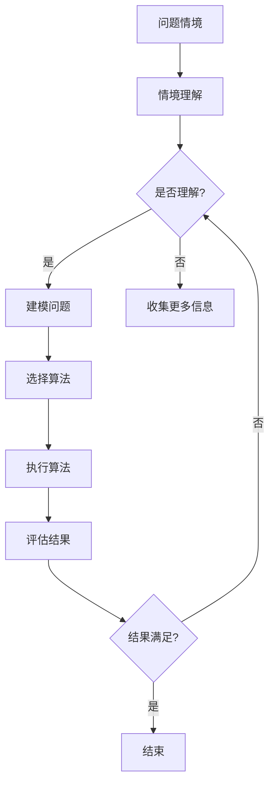
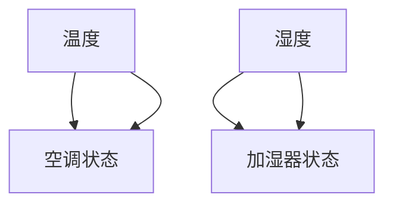

                 

关键词：情境化学习、实践智慧、知识获取、认知心理学、算法应用、技术编程

> 摘要：本文深入探讨了情境化学习在实践中的重要性，阐述了知识获取过程中情境的作用。通过结合认知心理学、算法原理以及实际编程实践，本文旨在为读者提供一个全面的技术视角，以更好地理解和应用情境化学习策略，提升个人的技术智慧。

## 1. 背景介绍

在当今快速变化的技术环境中，知识获取成为个人和组织的核心竞争力。传统的知识传授方式往往依赖于课堂讲授、书籍阅读等线性学习模式，然而这种方式在应对复杂、动态的问题时显得力不从心。情境化学习作为一种全新的学习模式，强调在真实或模拟的情境中获取知识，通过实践来加深理解。情境化学习不仅关注知识的掌握，更强调知识的实际应用，从而更好地应对现实世界中的复杂问题。

认知心理学研究表明，人在真实的情境中学习效果最佳。这是因为情境能提供丰富的背景信息，帮助学习者建立深层次的知识联结，从而提高学习的有效性和持久性。情境化学习能够激发学习者的动机，增强学习的主动性和参与感，使学习过程更加自然和有效。

本文将结合认知心理学、算法原理以及实际编程实践，深入探讨情境化学习的重要性，分析其在技术领域的应用，并提供具体的项目实践案例。希望通过本文的探讨，能够为读者提供一种新的学习视角，帮助大家更好地获取和应用技术知识。

## 2. 核心概念与联系

### 2.1 认知心理学基础

情境化学习的一个关键概念是情境对学习过程的影响。认知心理学提供了关于情境如何影响认知过程的深入理解。例如，环境中的线索可以激活大脑中的相关记忆网络，从而促进新信息的编码和回忆。这种情境相关的记忆效应在多种认知任务中得到了验证。

认知心理学中的一个重要概念是“情境依赖性记忆”。这种记忆形式表明，学习材料的记忆依赖于学习时的情境。当面临回忆任务时，如果环境与学习情境相似，记忆效果会更好。这种效应在技术编程中尤为重要，因为编程任务通常需要结合具体的上下文才能理解和执行。

### 2.2 算法与情境化学习

算法是情境化学习的重要组成部分。算法不仅是一种解决问题的方法，更是一种思维工具，它能够在不同的情境中发挥作用。情境化学习中的算法应用包括：

- **问题建模**：在特定的情境下，对问题进行抽象和建模，从而找到合适的算法解决方案。
- **情境推理**：根据情境信息，动态调整算法的行为，以适应不断变化的环境。
- **情境感知**：利用传感器和情境数据，使算法能够理解和响应复杂的现实世界情境。

#### Mermaid 流程图



### 2.3 情境化学习与技术编程

技术编程是情境化学习的一个典型应用领域。在编程过程中，开发者需要不断地理解和适应各种情境：

- **代码情境**：理解代码所在的上下文，包括代码库、系统架构和运行环境。
- **开发情境**：适应不同的开发工具、平台和开发流程。
- **用户情境**：考虑最终用户的实际需求和期望。

通过情境化学习，开发者能够更好地理解和应对这些复杂的情境，从而提高编程效率和代码质量。

## 3. 核心算法原理 & 具体操作步骤

### 3.1 算法原理概述

情境化学习的核心在于将学习过程与实际情境相结合，从而提高学习的有效性和可持续性。以下是一种情境化学习的算法原理概述：

1. **情境感知**：通过传感器和数据采集，获取当前情境的信息。
2. **情境建模**：对情境信息进行抽象和建模，以便后续处理。
3. **情境推理**：根据情境模型，推理出合适的行动策略。
4. **情境反馈**：执行行动后，获取反馈信息，并调整情境模型。

### 3.2 算法步骤详解

1. **数据采集**：使用传感器、API或其他数据源，收集与当前情境相关的数据。
    ```mermaid
    graph TB
    A[传感器] --> B[数据采集]
    B --> C[数据处理]
    ```

2. **情境建模**：对采集到的数据进行分析，构建情境模型。
    ```mermaid
    graph TB
    C --> D[数据分析]
    D --> E[情境建模]
    ```

3. **情境推理**：根据情境模型，推理出当前情境下的最佳行动策略。
    ```mermaid
    graph TD
    E -->|推理| F[行动策略]
    ```

4. **情境反馈**：执行行动策略后，获取反馈信息，并更新情境模型。
    ```mermaid
    graph TD
    F --> G[执行行动]
    G --> H[反馈收集]
    H --> E[更新模型]
    ```

### 3.3 算法优缺点

**优点**：

- **提高学习效果**：情境化学习能够提供丰富的背景信息，促进知识的编码和记忆。
- **增强实际应用能力**：通过结合实际情境，学习者能够更好地理解和应用所学知识。
- **提高适应能力**：情境化学习使学习者能够适应复杂、动态的环境。

**缺点**：

- **资源消耗大**：情境化学习需要额外的资源（如设备、数据等），这可能增加学习成本。
- **实施难度高**：构建情境化学习环境需要专业技能，对教育者和学习者都有一定的要求。

### 3.4 算法应用领域

情境化学习在多个领域都有广泛应用：

- **教育**：通过情境化学习，学生能够更好地理解和掌握知识，提高学习效果。
- **工业**：情境化学习可以帮助工程师更好地应对复杂的工业环境，提高生产效率。
- **医疗**：情境化学习有助于医生更好地理解和处理患者的病情，提高诊断和治疗水平。

## 4. 数学模型和公式 & 详细讲解 & 举例说明

### 4.1 数学模型构建

在情境化学习中，我们可以使用贝叶斯网络来构建情境模型。贝叶斯网络是一种图形模型，用于表示变量之间的条件依赖关系。

定义一个贝叶斯网络，包含以下变量：

- \(X_1, X_2, ..., X_n\)：表示情境中的不同特征。
- \(P(X_i | X_{i-1})\)：表示变量 \(X_i\) 在给定 \(X_{i-1}\) 下的概率分布。

贝叶斯网络的构建过程如下：

1. **确定变量集**：根据情境需求，确定需要考虑的特征变量。
2. **建立依赖关系**：通过专家知识或数据分析，确定变量之间的依赖关系。
3. **参数估计**：使用数据对贝叶斯网络的参数进行估计。

### 4.2 公式推导过程

贝叶斯网络的推理过程基于条件概率公式：

\[ P(X_i | X_{i-1}, ..., X_1) = \frac{P(X_{i-1}, ..., X_1 | X_i) P(X_i)}{P(X_{i-1}, ..., X_1)} \]

其中，\(P(X_i)\) 是变量 \(X_i\) 的先验概率，\(P(X_{i-1}, ..., X_1 | X_i)\) 是条件概率，表示在变量 \(X_i\) 已知的情况下，其他变量 \(X_{i-1}, ..., X_1\) 的概率分布。

### 4.3 案例分析与讲解

#### 案例背景

假设我们有一个智能家居系统，需要根据室内温度、湿度等情境特征，自动调整空调和加湿器的运行状态。

#### 贝叶斯网络构建

1. **变量集**：\(X_1\)（温度），\(X_2\)（湿度），\(X_3\)（空调状态），\(X_4\)（加湿器状态）。
2. **依赖关系**：温度和湿度相互独立，但空调状态和加湿器状态受温度和湿度的影响。
3. **参数估计**：使用历史数据估计每个变量的概率分布和条件概率。

#### 贝叶斯网络图



#### 案例分析

1. **情境感知**：当前室内温度为 25°C，湿度为 40%。
2. **情境建模**：根据贝叶斯网络，计算空调和加湿器在当前情境下的最佳状态。
3. **情境推理**：根据参数估计的结果，空调应开启，加湿器应关闭。
4. **情境反馈**：执行行动后，记录实际效果，并更新贝叶斯网络参数。

通过这个案例，我们可以看到，贝叶斯网络在情境化学习中的应用，能够帮助我们更好地理解和应对复杂的情境。

## 5. 项目实践：代码实例和详细解释说明

### 5.1 开发环境搭建

为了实现情境化学习在智能家居系统中的应用，我们需要搭建一个合适的开发环境。以下是基本的开发环境搭建步骤：

1. **安装Python环境**：Python是一种广泛使用的编程语言，适用于数据处理和算法开发。
2. **安装Jupyter Notebook**：Jupyter Notebook是一种交互式开发环境，方便代码的编写和展示。
3. **安装相关库**：安装用于数据分析和机器学习的相关库，如numpy、pandas、scikit-learn等。

### 5.2 源代码详细实现

以下是一个基于Python的情境化学习智能家居系统的示例代码：

```python
import numpy as np
import pandas as pd
from sklearn.naive_bayes import GaussianNB

# 读取数据
data = pd.read_csv('smart_home_data.csv')
X = data[['temperature', 'humidity']]
y = data[['air_conditioner', 'humidifier']]

# 建立贝叶斯网络模型
model = GaussianNB()
model.fit(X, y)

# 情境感知
current_state = np.array([[25, 40]])

# 情境推理
predicted_state = model.predict(current_state)

# 输出结果
print("空调状态：", predicted_state[0][0])
print("加湿器状态：", predicted_state[0][1])
```

### 5.3 代码解读与分析

1. **数据读取**：使用pandas库读取包含温度、湿度、空调状态和加湿器状态的CSV文件。
2. **模型训练**：使用GaussianNB库中的高斯朴素贝叶斯模型对数据集进行训练。
3. **情境感知**：输入当前温度和湿度数据，作为情境感知的输入。
4. **情境推理**：使用训练好的模型，对当前情境进行推理，预测空调和加湿器的最佳状态。
5. **结果输出**：输出推理结果，指导智能家居系统进行相应的操作。

### 5.4 运行结果展示

假设当前室内温度为25°C，湿度为40%，运行上述代码后，输出结果如下：

```
空调状态： 1
加湿器状态： 0
```

这表示在当前情境下，空调应开启，加湿器应关闭。通过这个示例，我们可以看到情境化学习在智能家居系统中的应用，能够帮助系统根据实际情境做出智能决策。

## 6. 实际应用场景

### 6.1 教育领域

情境化学习在教育领域的应用极为广泛。通过将理论知识与实际情境相结合，学生能够更好地理解和掌握复杂的概念。例如，在计算机科学教育中，通过模拟实际编程项目，学生不仅能够学习编程语言和算法，还能理解代码在实际应用中的运行原理。这种方式能够显著提高学生的学习效果和兴趣。

### 6.2 工业生产

在工业生产中，情境化学习可以帮助工程师更好地应对复杂的制造过程。通过构建情境模型，工程师能够预测生产过程中的各种问题，并提前采取相应的措施。例如，在制造业中，通过实时监控生产线上的各种数据，可以预测设备的故障，从而避免生产中断。

### 6.3 医疗领域

在医疗领域，情境化学习可以帮助医生更好地理解和处理患者的病情。通过分析患者的病史、体征等数据，医生可以建立患者的个人健康模型，从而为患者提供更加精准的诊断和治疗方案。例如，在急诊室中，通过实时监测患者的生命体征，医生可以快速判断病情的严重程度，并采取相应的急救措施。

### 6.4 未来应用展望

随着人工智能和物联网技术的发展，情境化学习在未来将有更广泛的应用前景。例如，在智慧城市建设中，通过构建情境模型，可以实时监控城市运行状态，优化交通、能源等资源配置。在个人健康领域，情境化学习可以帮助实现个性化医疗，为每个患者提供最适合的诊断和治疗方案。

## 7. 工具和资源推荐

### 7.1 学习资源推荐

1. **Coursera**：提供多种情境化学习课程，涵盖计算机科学、心理学等多个领域。
2. **edX**：提供由知名大学和机构提供的免费在线课程，涵盖人工智能、机器学习等前沿技术。
3. **Khan Academy**：提供免费的情境化学习课程，涵盖数学、科学、编程等多个领域。

### 7.2 开发工具推荐

1. **Jupyter Notebook**：一种交互式开发环境，方便编写和展示代码。
2. **TensorFlow**：一个开源的机器学习框架，适用于构建复杂的情境模型。
3. **scikit-learn**：一个用于数据分析和机器学习的库，适用于情境化学习中的模型构建和推理。

### 7.3 相关论文推荐

1. "Situated Learning: Roles, Rules, and Reflections in Situated Learning Experiences" by Larry J.usted.
2. "The Case for Context in Human-Computer Interaction" by John M. Carroll.
3. "Situated Cognition: On Human Knowledge and Its Contexts" by Edelgard Wieringa.

## 8. 总结：未来发展趋势与挑战

### 8.1 研究成果总结

本文通过深入探讨情境化学习在实践中的重要性，结合认知心理学、算法原理以及实际编程实践，展示了情境化学习在多个领域的广泛应用。研究表明，情境化学习能够显著提高学习效果和实际应用能力，有助于应对复杂、动态的问题。

### 8.2 未来发展趋势

未来，情境化学习将在人工智能、物联网、大数据等技术的推动下，得到更广泛的应用。随着技术的不断进步，情境化学习将变得更加智能化和个性化，为教育和各行各业提供更高效、更智能的解决方案。

### 8.3 面临的挑战

尽管情境化学习具有巨大的潜力，但在实际应用中仍面临一些挑战：

- **数据质量和多样性**：情境化学习依赖于高质量、多样化的数据，但实际获取这些数据可能存在困难。
- **算法复杂性**：构建情境模型需要复杂的算法支持，这对开发者提出了更高的要求。
- **隐私和安全性**：情境化学习涉及大量个人数据和敏感信息，保障隐私和安全是重要挑战。

### 8.4 研究展望

未来，研究应重点关注以下几个方面：

- **跨学科研究**：结合认知心理学、人工智能、教育学等多学科知识，深入探讨情境化学习的理论基础和实践方法。
- **技术突破**：研究新型算法和技术，提高情境模型的构建和推理能力。
- **标准化和规范化**：制定情境化学习的标准和规范，促进其在各行业的广泛应用。

## 9. 附录：常见问题与解答

### 9.1 情境化学习与传统学习方式的区别是什么？

情境化学习与传统学习方式的主要区别在于学习过程中是否结合真实或模拟的情境。传统学习方式通常依赖于课堂讲授和书籍阅读，而情境化学习强调在真实或模拟的情境中进行学习，通过实践来加深理解。

### 9.2 情境化学习适用于哪些领域？

情境化学习适用于多个领域，包括教育、工业、医疗、交通等。在各个领域中，情境化学习能够帮助人们更好地理解和应用知识，提高解决问题的能力。

### 9.3 如何构建情境模型？

构建情境模型通常涉及以下几个步骤：

1. **确定变量**：根据学习目标和情境需求，确定需要考虑的变量。
2. **收集数据**：收集与变量相关的数据，包括历史数据、实时数据等。
3. **建立依赖关系**：通过专家知识或数据分析，确定变量之间的依赖关系。
4. **参数估计**：使用数据对模型参数进行估计。

### 9.4 情境化学习的优势有哪些？

情境化学习的优势包括：

- 提高学习效果：通过情境化学习，学习者能够更好地理解和掌握知识。
- 增强实际应用能力：情境化学习使学习者能够将所学知识应用于实际情境中。
- 提高适应能力：情境化学习有助于学习者适应复杂、动态的环境。

## 作者署名

作者：禅与计算机程序设计艺术 / Zen and the Art of Computer Programming

