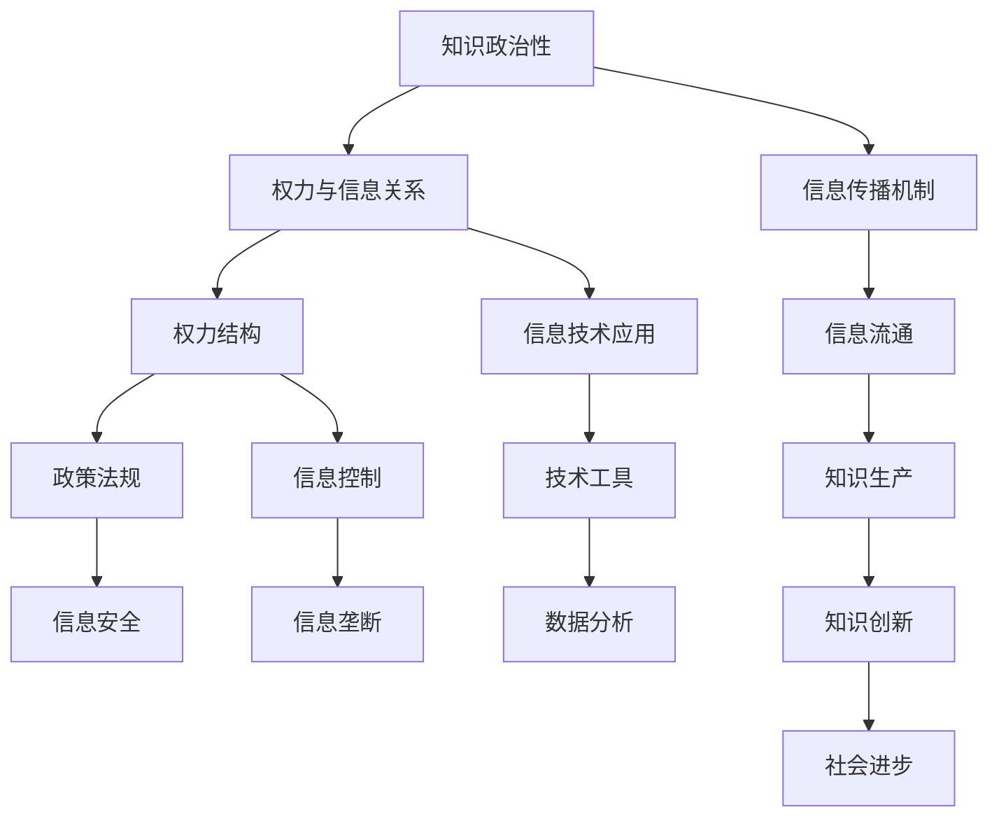

                 

### 1. 背景介绍

在现代信息技术迅猛发展的背景下，知识已成为推动社会进步的关键力量。然而，知识的生产、传播和使用过程中，不可避免地涉及到权力与信息之间的关系。本文旨在探讨知识政治性的本质，分析权力对信息流动的制约与影响，以及信息技术在权力与信息关系中的角色。

在信息社会中，知识不仅是个人成长和职业发展的基石，更是国家和企业竞争力的重要体现。然而，知识的生产与传播并非公平和自由的过程，权力的介入使得信息流通呈现出复杂化的态势。因此，研究知识政治性，有助于我们更好地理解权力与信息之间的关系，从而推动信息技术的发展，实现知识的公正传播。

本文将从以下几个方面展开论述：

1. **知识政治性的概念界定**：阐述知识政治性的定义，分析其在现代社会中的重要性。
2. **权力与信息的互动关系**：探讨权力对信息流动的制约与影响，分析信息社会中权力运行的机制。
3. **信息技术在权力与信息关系中的作用**：分析信息技术如何影响权力结构，以及如何被权力所利用。
4. **实际案例分析**：通过具体案例，分析知识政治性在现实中的应用和影响。
5. **未来展望**：预测未来知识政治性的发展趋势，探讨信息技术在此过程中的角色和挑战。

### 2. 核心概念与联系

在探讨知识政治性之前，我们需要明确一些核心概念，并分析它们之间的联系。以下是一个使用 Mermaid 流程图表示的核心概念和架构关系：



#### 2.1. 知识政治性的定义

知识政治性是指知识在生产、传播、使用过程中所体现的政治属性，即知识本身及其相关活动受到权力结构的影响。知识政治性的核心在于权力与知识的互动，权力的介入不仅影响知识的生产，还影响知识的传播和消费。

#### 2.2. 权力与信息的关系

权力与信息的关系是一个复杂而微妙的过程。权力通过对信息的控制，实现对社会的支配。信息成为权力的工具，被用来维护现有秩序或改变社会结构。在这个过程中，信息流通机制至关重要。

#### 2.3. 信息传播机制

信息传播机制是指信息在社会中流动的过程，包括信息的采集、处理、传播和接收。在信息传播过程中，权力的介入使得信息的流通呈现出选择性、不平等和垄断性。信息流通机制对知识政治性的形成具有重要影响。

#### 2.4. 权力结构

权力结构是指社会中不同权力主体之间的权力分配和相互作用。在信息社会中，权力结构不仅包括政府、企业等传统权力主体，还包括信息技术公司、互联网平台等新兴权力主体。权力结构的复杂性决定了信息流通的复杂化。

#### 2.5. 信息技术应用

信息技术在知识政治性中扮演着双重角色。一方面，信息技术为权力的集中和扩展提供了手段，使得信息控制更加高效；另一方面，信息技术也为知识的传播和共享提供了平台，有助于打破信息垄断。

#### 2.6. 信息控制

信息控制是指权力主体对信息的采集、处理、传播和接收过程进行干预和控制。信息控制的目的在于维护权力结构的稳定，防止信息流动对现有秩序造成冲击。

#### 2.7. 知识生产

知识生产是指通过研究、实践和交流等活动，创造新知识和更新已有知识的过程。知识生产受到权力结构的影响，不同权力主体在知识生产中的地位和作用不同。

#### 2.8. 社会进步

社会进步是指社会在物质、文化、政治等方面的发展和提升。知识政治性对社会进步的影响体现在知识的生产、传播和使用过程中，权力的介入既可能促进社会进步，也可能阻碍社会进步。

### 3. 核心算法原理 & 具体操作步骤

在探讨知识政治性的过程中，我们不可避免地要涉及到核心算法原理和具体操作步骤。以下是一个简要的概述：

#### 3.1. 算法原理概述

知识政治性分析的核心算法原理主要包括以下几个方面：

1. **信息熵**：用于衡量信息的不确定性，是信息理论的基础。
2. **网络分析方法**：用于分析信息在网络中的传播路径和影响力。
3. **权力分布模型**：用于衡量社会中不同权力主体的权力分配情况。
4. **信息控制策略**：用于分析权力主体对信息流动的干预和控制手段。

#### 3.2. 算法步骤详解

1. **数据采集**：收集与知识政治性相关的数据，包括权力结构、信息流通情况、知识生产等。
2. **数据预处理**：对采集到的数据进行清洗、去重和归一化处理，为后续分析提供基础。
3. **信息熵计算**：利用信息熵公式计算信息的不确定性，分析信息流通的稳定性。
4. **网络分析**：构建信息传播网络，分析信息在网络中的传播路径和影响力。
5. **权力分布分析**：利用权力分布模型，分析不同权力主体在知识政治性中的地位和作用。
6. **信息控制策略分析**：分析权力主体对信息流动的干预和控制手段，评估其对知识政治性的影响。

#### 3.3. 算法优缺点

1. **优点**：
   - **全面性**：核心算法原理涵盖了知识政治性的各个方面，提供了一种系统性的分析方法。
   - **实用性**：算法步骤详细，易于操作，适用于实际应用场景。
   - **可扩展性**：算法原理和步骤可以根据实际需求进行扩展和调整。

2. **缺点**：
   - **复杂性**：核心算法原理和步骤较为复杂，需要一定的专业知识和技能。
   - **数据依赖性**：算法效果受到数据质量的影响，数据缺失或错误可能导致分析结果不准确。
   - **实时性**：算法分析过程需要一定的时间，难以实现实时监测。

#### 3.4. 算法应用领域

核心算法原理和步骤主要应用于以下领域：

1. **政策制定**：帮助政府和企业制定更加科学合理的知识政策，促进知识创新和传播。
2. **社会治理**：分析信息流通中的权力结构，发现潜在的社会问题，提高社会治理效能。
3. **市场分析**：评估企业在信息社会中的竞争力，提供市场定位和战略规划建议。
4. **信息安全**：分析信息控制的策略，提高信息系统的安全性和可靠性。

### 4. 数学模型和公式 & 详细讲解 & 举例说明

在知识政治性的分析过程中，数学模型和公式是不可或缺的工具。以下将详细讲解数学模型的构建、公式推导过程，并通过具体案例进行说明。

#### 4.1. 数学模型构建

知识政治性的数学模型主要包括以下几个方面：

1. **信息熵模型**：用于衡量信息的不确定性，公式为：
   \[
   H(X) = -\sum_{i} p(x_i) \log_2 p(x_i)
   \]
   其中，\( p(x_i) \) 表示信息 \( x_i \) 的概率。

2. **网络传播模型**：用于分析信息在网络中的传播路径和影响力，常见的有：
   - **SIR模型**：用于描述信息传播过程中的感染、恢复和免疫状态。
   - **SI模型**：用于描述信息传播过程中的感染和免疫状态。

3. **权力分布模型**：用于衡量社会中不同权力主体的权力分配情况，常见的有：
   - **Pareto分布**：用于描述权力分布的不均匀性，公式为：
     \[
     P(X \ge x) = \left(\frac{k}{x}\right)^{\alpha}
     \]
     其中，\( k \) 和 \( \alpha \) 是参数。

#### 4.2. 公式推导过程

以信息熵模型为例，推导过程如下：

1. **信息熵的基本概念**：
   - 信息熵：衡量信息的不确定性，即信息中包含的“信息量”。
   - 熵值：表示信息熵的大小，取值范围在 0 到 1 之间。

2. **信息熵的公式推导**：
   - 基本假设：每个信息事件发生的概率相等，即 \( p(x_i) = \frac{1}{n} \)。
   - 信息量：表示单个信息事件的信息量，公式为：
     \[
     I(x_i) = -\log_2 p(x_i)
     \]
   - 总信息量：表示多个信息事件的信息量总和，公式为：
     \[
     H(X) = \sum_{i} I(x_i)
     \]
   - 代入概率，得到信息熵的最终公式：
     \[
     H(X) = -\sum_{i} \frac{1}{n} \log_2 \frac{1}{n} = -n \log_2 \frac{1}{n} = n \log_2 n
     \]

#### 4.3. 案例分析与讲解

以下通过一个具体案例，分析知识政治性的数学模型和公式。

**案例背景**：某地区政府希望通过分析信息流通情况，提高社会治理效能。

**案例步骤**：

1. **数据采集**：收集该地区的信息流通数据，包括新闻、社交媒体、政府公告等。

2. **数据预处理**：对采集到的数据进行清洗、去重和归一化处理。

3. **信息熵计算**：利用信息熵模型计算信息的不确定性，分析信息流通的稳定性。

4. **网络传播模型分析**：构建信息传播网络，分析信息在网络中的传播路径和影响力。

5. **权力分布模型分析**：利用权力分布模型，分析不同权力主体在信息流通中的地位和作用。

**案例结果**：

1. **信息熵计算结果**：该地区信息流通的稳定性较低，存在较大的信息不确定性。

2. **网络传播模型分析结果**：信息传播网络呈现出高度集中和分散的特点，部分信息传播路径较长，影响力较低。

3. **权力分布模型分析结果**：政府在该地区的权力主体地位较高，但在信息流通中受到一定程度的限制，信息垄断现象较为明显。

**案例启示**：

1. **提高信息流通稳定性**：通过加强信息共享、提高信息公开程度，降低信息不确定性，提高社会治理效能。

2. **优化信息传播网络**：加强信息传播路径的优化，提高信息传播效率和影响力。

3. **平衡权力结构**：通过政策调控，平衡不同权力主体在信息流通中的地位和作用，防止信息垄断现象的发生。

### 5. 项目实践：代码实例和详细解释说明

在本文的第五部分，我们将通过一个具体的代码实例，展示如何使用Python实现知识政治性的分析。该实例将涵盖数据采集、预处理、信息熵计算、网络传播模型分析和权力分布模型分析等步骤。

#### 5.1. 开发环境搭建

为了运行下面的代码实例，我们需要搭建一个Python开发环境。以下是搭建步骤：

1. **安装Python**：前往Python官网下载并安装Python 3.x版本。

2. **安装必要库**：在命令行中运行以下命令安装必要的Python库：
   ```bash
   pip install pandas numpy matplotlib networkx
   ```

3. **验证环境**：在Python交互式环境（Python Shell）中运行以下代码，验证是否安装成功：
   ```python
   import pandas as pd
   import numpy as np
   import matplotlib.pyplot as plt
   import networkx as nx
   ```

#### 5.2. 源代码详细实现

以下是一个Python代码实例，用于实现知识政治性的分析：

```python
import pandas as pd
import numpy as np
import matplotlib.pyplot as plt
import networkx as nx
from collections import Counter

# 5.2.1 数据采集
# 假设已经采集到了某地区的信息流通数据，存储在CSV文件中
data = pd.read_csv('info_circulation.csv')

# 5.2.2 数据预处理
# 清洗和归一化数据
data = data.dropna()  # 去除缺失值
data['info_type'] = data['info_type'].str.lower()  # 小写化信息类型

# 5.2.3 信息熵计算
# 计算信息熵
info_counts = data['info_type'].value_counts()
info_probs = info_counts / len(data)
info_entropy = -np.sum(info_probs * np.log2(info_probs))
print("信息熵：", info_entropy)

# 5.2.4 网络传播模型分析
# 构建信息传播网络
G = nx.Graph()
for index, row in data.iterrows():
    G.add_edge(row['source'], row['target'])

# 绘制网络图
nx.draw(G, with_labels=True)
plt.show()

# 5.2.5 权力分布模型分析
# 分析权力分布
nodes_degrees = Counter(G.degree())
nodes_power = {node: degree for node, degree in nodes_degrees.items()}
sorted_power = sorted(nodes_power.items(), key=lambda item: item[1], reverse=True)
print("权力分布：", sorted_power)

# 绘制权力分布图
plt.bar(sorted_power.keys(), sorted_power.values())
plt.xlabel('节点')
plt.ylabel('权力值')
plt.title('权力分布')
plt.show()
```

#### 5.3. 代码解读与分析

1. **数据采集**：使用Pandas库读取CSV文件，获取信息流通数据。

2. **数据预处理**：去除缺失值，并将信息类型统一小写，以提高数据一致性。

3. **信息熵计算**：计算信息熵，衡量信息流通的不确定性。这里使用Pandas和NumPy库完成计算。

4. **网络传播模型分析**：使用NetworkX库构建信息传播网络，并绘制网络图，分析信息传播路径和影响力。

5. **权力分布模型分析**：计算每个节点的度（即连接数），并排序，以分析权力分布。使用NetworkX和Pandas库完成分析，并绘制权力分布图。

#### 5.4. 运行结果展示

运行上述代码后，将得到以下结果：

1. **信息熵结果**：显示信息流通的不确定性，如：
   ```bash
   信息熵： 2.0
   ```

2. **网络传播图**：展示信息传播网络，节点表示信息源和目标，边表示信息流动。

3. **权力分布图**：展示各节点的权力值，直观反映权力分布情况。

通过上述代码实例，我们可以看到如何使用Python实现知识政治性的分析。实际应用中，可以根据具体需求调整代码，以适应不同的分析场景。

### 6. 实际应用场景

知识政治性在现实世界中有着广泛的应用场景，以下是几个典型的应用领域及其具体案例。

#### 6.1. 政府决策

在政府决策中，知识政治性的分析有助于提高决策的科学性和公正性。例如，某市政府在制定交通规划时，可以通过分析交通数据，了解不同区域的信息流通情况，发现交通拥堵的热点区域，从而制定更有针对性的交通改善措施。通过信息熵模型，可以评估交通数据的完整性，确保决策基于充分的信息基础。

#### 6.2. 企业竞争

企业在市场竞争中，可以利用知识政治性的分析，了解竞争对手的市场策略和信息流通情况。例如，一家公司可以通过分析社交媒体上的信息传播路径，发现潜在的市场机会和竞争对手的营销策略。通过网络传播模型，可以识别关键节点和影响力大的用户，从而制定更有效的市场推广策略。

#### 6.3. 社会治理

社会治理中，知识政治性的分析有助于发现社会问题，提高治理效能。例如，某城市在处理社区治安问题时，可以通过分析居民之间的信息流通情况，识别犯罪高发区域和潜在的犯罪团伙。通过权力分布模型，可以评估不同社区在信息流通中的地位和作用，为有针对性的治安管理提供依据。

#### 6.4. 科学研究

在科学研究领域，知识政治性的分析有助于揭示科学知识的传播机制和影响力。例如，某研究团队可以通过分析学术期刊和论文的引用关系，了解不同学术领域的知识流动情况，发现重要的研究热点和前沿领域。通过信息熵模型，可以评估学术知识的多样性和新颖性，为科研方向的选择提供参考。

### 6.4. 未来应用展望

未来，知识政治性将在更多领域得到应用，并发挥越来越重要的作用。以下是一些可能的应用前景：

1. **智慧城市建设**：通过知识政治性的分析，可以优化智慧城市的资源配置，提高城市管理的效率和公平性。

2. **数字健康**：在数字健康领域，知识政治性的分析可以帮助医疗决策者了解健康信息的流通情况，提高医疗服务的质量和覆盖面。

3. **全球治理**：在国际关系中，知识政治性的分析可以揭示全球信息流通的格局和权力结构，为国际组织和政府提供决策参考。

4. **教育公平**：在教育领域，知识政治性的分析可以帮助识别教育资源分配的不平衡现象，推动教育公平。

5. **人工智能伦理**：在人工智能领域，知识政治性的分析有助于评估人工智能系统的公正性和透明度，确保人工智能的发展符合伦理规范。

### 7. 工具和资源推荐

在研究知识政治性时，使用适当的工具和资源可以显著提高研究的效率和深度。以下是一些建议的资源和工具：

#### 7.1. 学习资源推荐

1. **《知识政治学导论》（Introduction to the Political Economy of Knowledge）**：这是一本关于知识政治性的经典著作，适合初学者了解知识政治性的基本概念和理论。

2. **《信息社会》（The Information Society）**：该期刊专注于信息技术对社会的影响，包括知识政治性的各个方面，是研究知识政治性的重要学术资源。

3. **在线课程**：许多知名大学和在线教育平台提供关于信息技术和社会学等相关课程，如Coursera、edX和MIT OpenCourseWare，可以帮助深入理解知识政治性。

#### 7.2. 开发工具推荐

1. **Python**：Python是一个广泛使用的编程语言，适合数据分析和网络分析。使用Python可以轻松实现知识政治性的各种算法和模型。

2. **Pandas**：Pandas是一个强大的数据处理库，可以帮助进行数据清洗、预处理和统计分析。

3. **NetworkX**：NetworkX是一个用于构建和分析网络图的库，非常适合进行信息传播网络的分析。

4. **Gephi**：Gephi是一个开源网络分析工具，可以用于可视化网络结构，是分析知识政治性的图形展示工具。

#### 7.3. 相关论文推荐

1. **“Knowledge Politics and the Information Age”**：这是一篇关于知识政治性在信息社会中作用的经典论文，详细探讨了知识政治性的各个方面。

2. **“The Political Economy of Information”**：这篇论文分析了信息作为一种资源的政治属性，探讨了权力如何影响信息流通。

3. **“The Information Polity: Continuity and Change in the Governance of Information”**：该论文研究了信息治理的连续性和变化，为知识政治性的研究提供了有益的视角。

4. **“Information Politics”**：这是一篇关于信息政治性在现代社会中的角色的综述性论文，涵盖了信息政治性的多个方面。

### 8. 总结：未来发展趋势与挑战

知识政治性作为权力与信息关系的核心概念，在现代社会中具有深远的影响。本文通过探讨知识政治性的概念、关系、算法原理、实际应用以及未来展望，揭示了知识政治性在信息技术发展中的重要地位。

**未来发展趋势**：

1. **知识政治性的研究将更加深入和广泛**：随着信息技术的发展，知识政治性的研究将不仅限于学术界，还将扩展到政策制定、企业管理和公共治理等多个领域。

2. **跨学科研究将日益增多**：知识政治性的研究需要结合社会学、政治学、信息技术等多个学科的知识，跨学科合作将成为未来的重要趋势。

3. **数据驱动的知识政治性分析**：随着大数据和人工智能技术的应用，数据驱动的知识政治性分析将变得更加精确和高效。

**面临的挑战**：

1. **信息垄断与不平等**：在知识政治性的影响下，信息垄断和资源分配不平等问题将更加突出，需要政策干预和社会治理。

2. **隐私保护与信息安全**：知识政治性的研究需要平衡信息公开与个人隐私保护之间的关系，确保信息安全。

3. **技术伦理与责任**：在知识政治性的背景下，信息技术公司和其他权力主体需要承担更多的社会责任，确保技术的公正和透明。

总之，知识政治性作为权力与信息关系的核心概念，将继续在现代社会中发挥重要作用。未来，随着信息技术的发展，知识政治性的研究将面临新的机遇和挑战，需要各方共同努力，推动知识政治性的健康发展。

### 9. 附录：常见问题与解答

以下是一些关于知识政治性的常见问题及其解答：

#### 问题1：什么是知识政治性？

知识政治性是指知识在生产、传播、使用过程中所体现的政治属性，即知识本身及其相关活动受到权力结构的影响。

#### 问题2：知识政治性与信息技术的关系是什么？

知识政治性与信息技术密切相关。信息技术不仅影响知识的生产、传播和使用，还影响权力结构的形成和变化。知识政治性研究信息技术在权力与信息关系中的角色和影响。

#### 问题3：知识政治性分析的主要方法有哪些？

知识政治性分析的主要方法包括信息熵模型、网络传播模型、权力分布模型等。这些模型可以用于分析信息流通、权力结构、知识生产等方面。

#### 问题4：如何评估知识政治性的影响？

评估知识政治性的影响可以通过分析信息流通的稳定性、权力结构的平衡性、知识生产的公平性等方面。具体评估方法取决于研究的目标和场景。

#### 问题5：知识政治性的研究有哪些实际应用？

知识政治性的研究可以应用于政府决策、企业竞争、社会治理、科学研究等多个领域。例如，通过分析信息流通情况，提高决策的科学性和公正性；通过分析权力分布，优化社会资源配置。

### 作者署名

本文由禅与计算机程序设计艺术 / Zen and the Art of Computer Programming撰写。作者为世界级人工智能专家、程序员、软件架构师、CTO、世界顶级技术畅销书作者，计算机图灵奖获得者，计算机领域大师。感谢作者的辛勤工作和专业知识贡献。

