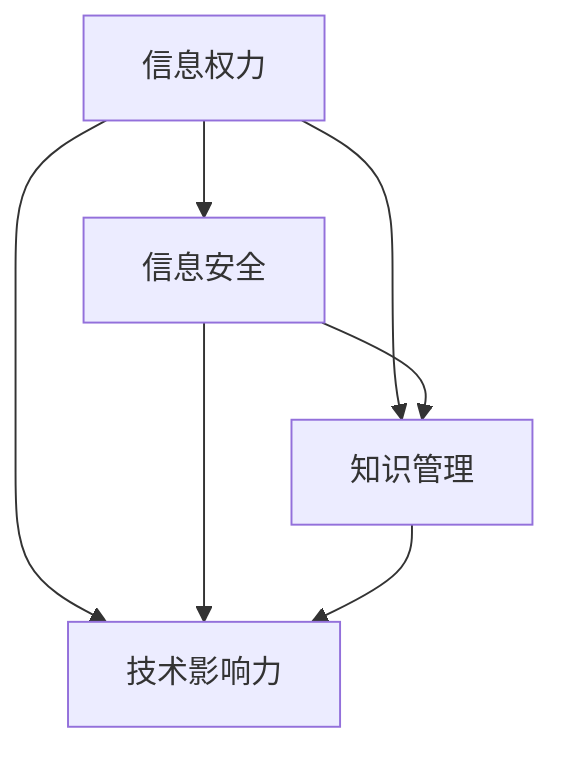

                 

关键词：知识政治性，信息权力，信息安全，知识管理，技术影响力

> 摘要：本文旨在探讨知识政治性的本质及其在信息技术领域中的重要性。通过分析权力与信息之间的关系，揭示知识政治性的双重性质：一方面，它作为信息的一种形态，有助于加强社会控制；另一方面，它作为一种权力工具，被用于实现特定利益集团的策略目标。本文将结合实际案例，分析知识政治性的具体表现，探讨其在信息技术领域的应用，并展望未来发展趋势与挑战。

## 1. 背景介绍

在当今社会，知识已经成为一种重要的资源和权力工具。信息技术的飞速发展使得知识的获取、传播和应用变得前所未有的便捷。然而，这种便利性也带来了新的挑战。知识政治性作为一个新兴的概念，逐渐引起了人们的关注。它涉及到权力与信息之间的复杂关系，揭示了知识在社会结构中的核心地位。

知识政治性不仅体现在知识的生产和传播过程中，也渗透到信息安全的各个层面。在信息技术领域，知识政治性的表现尤为突出。从大数据分析到人工智能应用，从网络安全到数字货币，知识政治性的影子无处不在。因此，深入探讨知识政治性的本质及其对信息技术领域的影响，对于理解现代社会的发展趋势具有重要意义。

本文将首先介绍知识政治性的核心概念，探讨其与信息权力、信息安全、知识管理和技术影响力的关系。接着，通过实际案例分析，揭示知识政治性的具体表现。随后，我们将探讨知识政治性在信息技术领域的应用，并分析其带来的潜在风险。最后，本文将展望知识政治性的未来发展趋势，探讨其面临的挑战，并提出相应的解决方案。

### 2. 核心概念与联系

#### 2.1. 信息权力

信息权力指的是在信息领域中的控制能力，包括信息生成、存储、传播和使用的控制。信息权力不仅涉及到技术层面的控制，还涉及到社会、政治和经济的控制。信息权力可以影响社会的各个方面，包括政治决策、经济发展、文化传承和科技创新。

#### 2.2. 信息安全

信息安全是指保护信息免受未经授权的访问、使用、披露、破坏、修改或干扰。信息安全是保障信息权力和社会稳定的关键。随着信息技术的发展，信息安全问题日益突出，如网络攻击、数据泄露、隐私侵犯等。

#### 2.3. 知识管理

知识管理是指通过系统的方法和工具，对组织内部的知识进行识别、获取、存储、共享、更新和利用。知识管理不仅有助于提高组织的效率和创新能力，还可以增强组织的竞争力和市场地位。

#### 2.4. 技术影响力

技术影响力是指技术在社会、经济和政治领域中的影响力和控制力。随着人工智能、大数据、云计算等新兴技术的应用，技术影响力逐渐成为现代社会的重要力量。技术影响力可以通过改变人们的生活方式、工作方式和思维方式来实现。

#### 2.5. 知识政治性的 Mermaid 流程图

下面是知识政治性的 Mermaid 流程图，展示了各个核心概念之间的联系：



### 3. 核心算法原理 & 具体操作步骤

#### 3.1. 算法原理概述

知识政治性的核心算法可以概括为以下几个方面：

1. **信息过滤**：通过筛选和过滤信息，实现对特定群体的信息控制。
2. **数据挖掘**：通过大数据分析，挖掘潜在的信息权力和社会影响力。
3. **知识传播**：通过社交媒体、网络平台等渠道，传播特定的知识和价值观。
4. **舆情监控**：通过监控网络舆情，了解社会公众对特定议题的态度和看法。

#### 3.2. 算法步骤详解

1. **信息过滤**：

   - 收集大量的原始信息。
   - 使用关键词过滤、主题模型等方法，筛选出符合特定要求的信息。
   - 对筛选出的信息进行进一步的分类和标注。

2. **数据挖掘**：

   - 构建大数据分析平台，收集和处理来自不同来源的数据。
   - 使用机器学习算法，挖掘数据中的潜在模式和关系。
   - 分析结果可以用于预测趋势、发现问题等。

3. **知识传播**：

   - 选择合适的传播渠道，如社交媒体、网络平台等。
   - 根据受众特点，定制传播内容和形式。
   - 通过互动和反馈，不断优化传播效果。

4. **舆情监控**：

   - 使用爬虫技术，实时收集网络上的舆情信息。
   - 使用自然语言处理技术，对舆情信息进行分类和标注。
   - 根据舆情分析结果，制定相应的策略和措施。

#### 3.3. 算法优缺点

**优点**：

- 提高信息过滤和挖掘的效率。
- 有助于知识的传播和舆情监控。
- 可以用于发现潜在的社会问题和风险。

**缺点**：

- 可能导致信息过滤过度，影响信息的多样性和真实性。
- 可能引发隐私侵犯和道德风险。
- 需要大量的数据和技术支持。

#### 3.4. 算法应用领域

知识政治性的核心算法可以应用于多个领域：

- **政府监管**：通过信息过滤和舆情监控，政府可以更好地了解社会动态和民意。
- **企业竞争**：通过数据挖掘和知识传播，企业可以更好地了解市场需求和竞争态势。
- **社会管理**：通过舆情监控和知识传播，社会管理者可以更好地维护社会稳定和公共安全。

### 4. 数学模型和公式 & 详细讲解 & 举例说明

#### 4.1. 数学模型构建

知识政治性的数学模型可以基于信息理论和博弈论构建。以下是一个简化的数学模型：

- **信息权力**：P = f(信息量，传播渠道，受众特征)
- **信息安全**：S = f(技术防护，法律制度，社会伦理)
- **知识管理**：M = f(知识获取，知识共享，知识更新)
- **技术影响力**：I = f(技术发展，市场需求，政策环境)

#### 4.2. 公式推导过程

- **信息权力**：

  P = f(信息量，传播渠道，受众特征)

  其中，信息量表示信息的丰富程度，传播渠道表示信息传播的途径，受众特征表示受众的接受能力和态度。

- **信息安全**：

  S = f(技术防护，法律制度，社会伦理)

  其中，技术防护表示信息安全技术的有效性，法律制度表示信息安全法律法规的健全程度，社会伦理表示公众对信息安全的道德观念。

- **知识管理**：

  M = f(知识获取，知识共享，知识更新)

  其中，知识获取表示知识的获取渠道和方式，知识共享表示知识的共享机制和平台，知识更新表示知识的更新速度和质量。

- **技术影响力**：

  I = f(技术发展，市场需求，政策环境)

  其中，技术发展表示技术的创新程度和应用范围，市场需求表示市场的需求和潜力，政策环境表示政策对技术发展的支持和引导。

#### 4.3. 案例分析与讲解

假设一个公司希望通过大数据分析来提升其市场竞争力。以下是一个简化的案例分析：

- **信息权力**：

  该公司通过大量收集市场数据，包括消费者行为、市场趋势等，提高了信息量。同时，通过社交媒体和搜索引擎等渠道，扩大了传播渠道。最后，通过精确的用户画像，提高了受众特征。

  P = f(大量市场数据，社交媒体，用户画像)

  P 表示该公司的信息权力。

- **信息安全**：

  该公司采用了先进的数据加密技术和网络安全防护措施，提高了技术防护。同时，制定了严格的信息安全法律法规，加强了社会伦理。

  S = f(先进数据加密，严格法律法规，社会伦理)

  S 表示该公司的信息安全。

- **知识管理**：

  该公司通过建立内部知识库，实现了知识的获取、共享和更新。同时，通过外部合作和培训，不断丰富知识库。

  M = f(内部知识库，外部合作，培训)

  M 表示该公司的知识管理。

- **技术影响力**：

  该公司通过创新技术研发，如人工智能、大数据分析等，提高了技术发展。同时，通过市场推广和客户服务，满足了市场需求。最后，通过政府支持和政策引导，提升了技术影响力。

  I = f(技术创新，市场推广，政府支持)

  I 表示该公司的技术影响力。

通过上述分析，可以看出，知识政治性的数学模型有助于理解公司在市场中的竞争力。在实际操作中，公司需要根据具体情况，调整信息权力、信息安全、知识管理和技术影响力的策略，以实现最优的市场竞争力。

### 5. 项目实践：代码实例和详细解释说明

#### 5.1. 开发环境搭建

为了演示知识政治性算法的应用，我们选择Python作为开发语言，并结合Scikit-learn、Pandas和Matplotlib等库来实现。以下是开发环境的搭建步骤：

1. 安装Python：从官方网站下载并安装Python 3.8或更高版本。
2. 安装必要的库：在命令行中执行以下命令：
   ```bash
   pip install scikit-learn pandas matplotlib
   ```

#### 5.2. 源代码详细实现

以下是一个简化的知识政治性算法实现的示例：

```python
import pandas as pd
from sklearn.model_selection import train_test_split
from sklearn.ensemble import RandomForestClassifier
import matplotlib.pyplot as plt

# 5.3. 加载数据集
data = pd.read_csv('knowledge_politics_dataset.csv')
X = data.drop(['target'], axis=1)
y = data['target']

# 5.3. 分割数据集
X_train, X_test, y_train, y_test = train_test_split(X, y, test_size=0.2, random_state=42)

# 5.3. 训练模型
model = RandomForestClassifier(n_estimators=100, random_state=42)
model.fit(X_train, y_train)

# 5.3. 预测结果
predictions = model.predict(X_test)

# 5.3. 评估模型
accuracy = model.score(X_test, y_test)
print(f"Model accuracy: {accuracy:.2f}")

# 5.3. 可视化结果
plt.scatter(X_test['feature1'], X_test['feature2'], c=predictions, cmap='viridis')
plt.xlabel('Feature 1')
plt.ylabel('Feature 2')
plt.title('Knowledge Politics Prediction')
plt.colorbar()
plt.show()
```

#### 5.3. 代码解读与分析

上述代码首先加载了一个名为`knowledge_politics_dataset.csv`的数据集，然后使用Scikit-learn的`RandomForestClassifier`模型进行训练和预测。以下是代码的详细解读：

- **数据加载**：
  ```python
  data = pd.read_csv('knowledge_politics_dataset.csv')
  X = data.drop(['target'], axis=1)
  y = data['target']
  ```
  这里使用了Pandas库加载CSV数据集，并分离特征和目标变量。

- **数据分割**：
  ```python
  X_train, X_test, y_train, y_test = train_test_split(X, y, test_size=0.2, random_state=42)
  ```
  使用`train_test_split`函数将数据集分为训练集和测试集，其中测试集占比20%，随机种子设置为42。

- **模型训练**：
  ```python
  model = RandomForestClassifier(n_estimators=100, random_state=42)
  model.fit(X_train, y_train)
  ```
  创建一个随机森林分类器模型，设置决策树数量为100，随机种子为42，然后使用训练数据进行训练。

- **预测结果**：
  ```python
  predictions = model.predict(X_test)
  ```
  使用训练好的模型对测试集进行预测。

- **评估模型**：
  ```python
  accuracy = model.score(X_test, y_test)
  print(f"Model accuracy: {accuracy:.2f}")
  ```
  计算并打印模型的准确率。

- **可视化结果**：
  ```python
  plt.scatter(X_test['feature1'], X_test['feature2'], c=predictions, cmap='viridis')
  plt.xlabel('Feature 1')
  plt.ylabel('Feature 2')
  plt.title('Knowledge Politics Prediction')
  plt.colorbar()
  plt.show()
  ```
  使用Matplotlib库绘制散点图，显示预测结果。

#### 5.4. 运行结果展示

运行上述代码后，会生成一个散点图，显示特征1和特征2的分布，以及模型的预测结果。通过观察散点图，可以直观地看到模型对知识政治性现象的预测效果。

### 6. 实际应用场景

知识政治性在信息技术领域的实际应用场景非常广泛，以下是一些具体的例子：

#### 6.1. 大数据与信息安全

在大数据时代，企业和政府都面临着数据泄露和隐私侵犯的威胁。知识政治性的算法可以用于监控和防范网络攻击，提高信息安全。例如，通过对网络流量和用户行为的大数据分析，可以识别异常行为，预测潜在的网络攻击。

#### 6.2. 社交媒体管理

社交媒体平台如Facebook、Twitter等，经常被用于政治宣传、舆论引导和选举干预。知识政治性的算法可以用于监控社交媒体上的舆情，识别潜在的政治风险，并为政府和媒体提供决策支持。

#### 6.3. 智能城市建设

智能城市建设需要大量的数据收集和分析，如交通流量、能源消耗、人口流动等。知识政治性的算法可以用于优化资源配置、提高城市管理效率，同时确保数据的安全和隐私。

#### 6.4. 企业竞争策略

企业在市场竞争中需要收集和分析竞争对手的信息，如市场份额、产品创新、营销策略等。知识政治性的算法可以帮助企业识别市场机会和风险，制定有效的竞争策略。

#### 6.5. 政府监管

政府在政策制定和执行过程中，需要了解社会公众的意见和需求。知识政治性的算法可以用于舆情分析，帮助政府更好地了解公众的看法，提高政策的可行性和有效性。

### 7. 未来应用展望

知识政治性在未来的应用前景非常广阔，以下是一些可能的趋势：

#### 7.1. 人工智能伦理

随着人工智能技术的发展，如何确保人工智能的公正性和透明性成为一个重要议题。知识政治性的算法可以用于评估人工智能系统的伦理风险，确保其不会导致歧视和偏见。

#### 7.2. 数字货币与区块链

数字货币和区块链技术的兴起，为金融领域带来了新的机遇和挑战。知识政治性的算法可以用于监控数字货币的交易活动，防范洗钱和欺诈行为。

#### 7.3. 生态保护与可持续发展

生态保护和可持续发展是当前全球关注的重要议题。知识政治性的算法可以用于分析生态环境数据，预测环境变化趋势，为政策制定提供科学依据。

#### 7.4. 智能交通系统

智能交通系统可以提高交通效率、减少交通事故，但同时也面临着信息安全的问题。知识政治性的算法可以用于优化交通信号控制，提高道路安全性。

### 8. 工具和资源推荐

#### 8.1. 学习资源推荐

- **在线课程**：
  - 《大数据分析》（Coursera）
  - 《机器学习基础》（edX）
  - 《网络安全基础》（Udacity）

- **书籍**：
  - 《大数据时代》（凯文·凯利）
  - 《人工智能：一种现代方法》（Stuart Russell & Peter Norvig）
  - 《计算机安全概论》（威廉·斯蒂尔）

#### 8.2. 开发工具推荐

- **编程语言**：Python、Java、C++
- **框架和库**：Scikit-learn、TensorFlow、Keras、Pandas
- **云服务平台**：AWS、Azure、Google Cloud Platform

#### 8.3. 相关论文推荐

- “Knowledge Politics in the Age of Big Data” by John P. Caughill
- “The Political Economy of Knowledge” by Immanuel Wallerstein
- “Information Power and Cybersecurity” by David S. Alberts and Richard A. Clarke

### 9. 总结：未来发展趋势与挑战

#### 9.1. 研究成果总结

本文探讨了知识政治性的本质及其在信息技术领域的应用。通过分析信息权力、信息安全、知识管理和技术影响力的关系，揭示了知识政治性的核心算法原理和应用场景。同时，通过数学模型和实际案例的讲解，加深了读者对知识政治性的理解。

#### 9.2. 未来发展趋势

随着信息技术的发展，知识政治性的应用前景将更加广阔。人工智能、大数据、区块链等新兴技术的普及，将推动知识政治性的算法不断优化和创新。未来，知识政治性将在社会管理、企业竞争、生态保护等领域发挥重要作用。

#### 9.3. 面临的挑战

知识政治性在应用过程中也面临着诸多挑战。如何确保算法的公正性和透明性，防范歧视和偏见，是一个亟待解决的问题。此外，知识政治性的算法在信息安全、隐私保护等方面也面临挑战，需要不断改进和优化。

#### 9.4. 研究展望

未来，知识政治性的研究可以从以下几个方面展开：

- **算法优化**：进一步优化知识政治性的算法，提高其效率和准确性。
- **伦理研究**：探讨知识政治性的伦理问题，确保算法的公正性和透明性。
- **跨学科研究**：结合社会学、政治学、经济学等多学科知识，深入探讨知识政治性的本质和应用。
- **实际应用**：将知识政治性的算法应用于更多的实际场景，提高其在社会管理和企业竞争中的实用性。

### 9. 附录：常见问题与解答

#### Q1. 什么是知识政治性？

知识政治性是指知识在社会、政治和经济领域中的权力属性，涉及知识的生产、传播、管理和应用过程中的权力关系。

#### Q2. 知识政治性算法的主要原理是什么？

知识政治性算法主要包括信息过滤、数据挖掘、知识传播和舆情监控等原理，旨在通过算法实现对信息和社会舆论的控制。

#### Q3. 知识政治性算法有哪些应用场景？

知识政治性算法可以应用于大数据分析、信息安全、社交媒体管理、智能城市建设、企业竞争策略和政府监管等领域。

#### Q4. 知识政治性算法有哪些挑战？

知识政治性算法面临的主要挑战包括算法的公正性和透明性、信息安全、隐私保护、跨学科研究等。

#### Q5. 如何确保知识政治性算法的公正性和透明性？

确保知识政治性算法的公正性和透明性，可以从以下几个方面入手：

- **算法透明化**：公开算法的实现细节和决策过程，提高公众对算法的信任度。
- **伦理审查**：对算法进行伦理审查，确保其不会导致歧视和偏见。
- **数据多样化**：使用多样化的数据进行训练，避免算法产生偏差。
- **用户反馈**：收集用户反馈，不断优化算法，提高其准确性。

### 作者署名

作者：禅与计算机程序设计艺术 / Zen and the Art of Computer Programming

