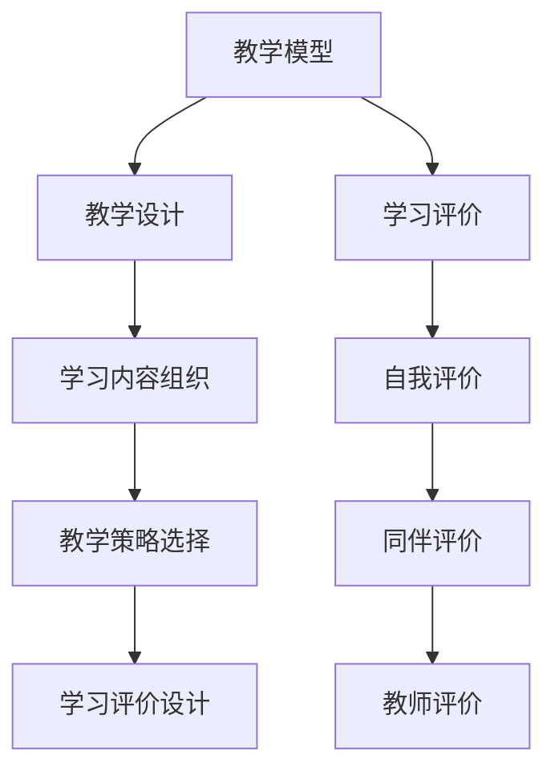

                 

在这个数字化时代，知识的传播和获取方式正在经历着深刻的变革。在线学习作为数字化转型的一个重要组成部分，不仅为全球学习者提供了前所未有的学习机会，也带来了诸多机遇与挑战。本文将深入探讨在线学习的各个方面，包括其背景、核心概念、算法原理、数学模型、项目实践、实际应用以及未来展望。

## 文章关键词

- 数字化转型
- 在线学习
- 教育技术
- 机遇与挑战
- 知识传播
- 教学模型

## 文章摘要

本文旨在探讨在线学习的数字化转型进程，分析其带来的机遇与挑战。通过对在线学习的背景、核心概念、算法原理、数学模型、项目实践、实际应用以及未来展望的全面阐述，本文希望能够为教育行业从业者提供有价值的参考和指导。

## 1. 背景介绍

### 1.1 数字化转型的兴起

数字化转型是指将企业的业务模式、运营流程、管理机制等通过数字化技术进行变革的过程。随着互联网、云计算、大数据、人工智能等技术的发展，数字化转型已经成为全球各个行业的重要趋势。在教育领域，数字化转型不仅意味着教学工具的数字化，更涉及到教学理念、教学方式、学习评价等全方位的变革。

### 1.2 在线学习的兴起

在线学习作为一种新兴的教育模式，自21世纪初期以来迅速发展。得益于互联网技术的普及，在线学习打破了传统教育的时空限制，为全球学习者提供了丰富的学习资源和学习平台。根据统计数据显示，全球在线学习市场在近年来呈现出了高速增长的态势，预计未来几年仍将保持快速增长。

### 1.3 数字化转型对在线学习的影响

数字化转型的兴起为在线学习带来了诸多机遇。首先，数字化工具和平台使得学习资源的获取更加便捷，学习者可以随时随地进行学习。其次，大数据和人工智能技术的应用为个性化学习提供了可能，使得教学更加精准和有效。然而，数字化转型也带来了挑战，如技术依赖、信息过载、学习效果评估等问题。

## 2. 核心概念与联系

### 2.1 教学模型

在线学习中的教学模型是指导教学设计和实施的核心概念。常见的教学模型包括行为主义教学模型、认知主义教学模型和建构主义教学模型。其中，建构主义教学模型强调学习者的主动参与和知识构建过程，与在线学习的核心理念高度契合。

### 2.2 教学设计

在线学习教学设计是确保在线学习效果的重要环节。教学设计包括学习目标的设定、学习内容的组织、教学策略的选择、学习评价的设计等。一个好的教学设计应该能够引导学习者主动参与，提高学习效果。

### 2.3 学习评价

学习评价是检验在线学习效果的重要手段。在线学习中的学习评价方式包括自我评价、同伴评价、教师评价等。此外，大数据和人工智能技术的应用也为学习评价提供了新的可能性，如通过分析学习行为数据来评估学习效果。

### 2.4 Mermaid 流程图

为了更好地理解在线学习中的核心概念和联系，我们可以使用 Mermaid 流程图来展示教学模型、教学设计、学习评价等概念之间的关系。以下是一个示例流程图：



## 3. 核心算法原理 & 具体操作步骤

### 3.1 算法原理概述

在线学习中的核心算法主要涉及推荐算法、学习路径规划算法和学习分析算法等。这些算法的原理和操作步骤如下：

### 3.2 算法步骤详解

#### 3.2.1 推荐算法

推荐算法是一种基于数据挖掘和机器学习的技术，旨在为学习者推荐个性化的学习资源。推荐算法的主要步骤包括：

1. **用户画像构建**：通过分析用户的学习行为、兴趣偏好等数据，构建用户画像。
2. **资源特征提取**：对学习资源进行特征提取，如课程难度、知识点、时长等。
3. **相似度计算**：计算用户画像与学习资源特征之间的相似度，为用户推荐相似的学习资源。
4. **推荐结果排序**：根据相似度排序，将最相关的学习资源推荐给用户。

#### 3.2.2 学习路径规划算法

学习路径规划算法旨在为学习者提供最优的学习路径，以提高学习效果。主要步骤包括：

1. **学习目标设定**：根据学习者的学习需求和目标，设定学习目标。
2. **知识点分析**：分析学习目标涉及的知识点，确定学习路径的起点和终点。
3. **路径规划**：通过算法计算最优学习路径，包括知识点之间的逻辑顺序和学习资源的选择。
4. **路径调整**：根据学习者的学习进度和反馈，动态调整学习路径。

#### 3.2.3 学习分析算法

学习分析算法通过分析学习行为数据，评估学习效果，为教学优化提供依据。主要步骤包括：

1. **数据采集**：收集学习者的学习行为数据，如学习时间、学习频率、知识点掌握情况等。
2. **数据预处理**：对采集到的数据进行清洗、去噪、归一化等处理。
3. **数据分析**：通过机器学习算法分析学习行为数据，评估学习效果。
4. **结果反馈**：将分析结果反馈给学习者，帮助其调整学习策略。

### 3.3 算法优缺点

#### 3.3.1 推荐算法

**优点**：个性化推荐可以提高学习者的学习兴趣和效果，提高学习资源的利用效率。

**缺点**：推荐算法依赖于数据质量和算法模型，数据缺失或模型偏差可能导致推荐结果不准确。

#### 3.3.2 学习路径规划算法

**优点**：优化学习路径可以提高学习效率，确保学习者按照正确的逻辑顺序学习。

**缺点**：学习路径规划算法需要大量计算资源，且难以适应学习者的个性化需求。

#### 3.3.3 学习分析算法

**优点**：学习分析算法可以提供客观的学习效果评估，为教学优化提供依据。

**缺点**：学习分析算法依赖于数据质量和算法模型，数据缺失或模型偏差可能导致评估结果不准确。

### 3.4 算法应用领域

在线学习算法广泛应用于教育行业，如在线教育平台、智能教学系统、学习分析系统等。此外，在线学习算法还可以应用于其他领域，如电子商务、医疗保健等。

## 4. 数学模型和公式 & 详细讲解 & 举例说明

### 4.1 数学模型构建

在线学习中的数学模型主要涉及推荐算法、学习路径规划算法和学习分析算法等。以下是一个推荐算法的数学模型构建示例：

假设用户集合为U={u1, u2, ..., un}，资源集合为R={r1, r2, ..., rm}，用户u对资源r的评分矩阵为S={sij}，其中sij表示用户ui对资源rj的评分。推荐算法的目标是预测用户未评分的资源评分，从而为用户推荐个性化的资源。

设用户ui对资源rj的预测评分为\(\hat{s}_{ij}\)，则预测评分的数学模型可以表示为：

\[
\hat{s}_{ij} = f(u_i, r_j, S)
\]

其中，f(u_i, r_j, S)表示基于用户ui、资源rj和评分矩阵S的预测评分函数。

### 4.2 公式推导过程

推荐算法的预测评分函数f(u_i, r_j, S)可以通过多种方式构建，如基于内容的协同过滤、基于模型的协同过滤等。以下是基于内容的协同过滤算法的预测评分函数推导过程：

1. **用户相似度计算**：

   假设用户相似度函数为\(s_{uij}\)，表示用户ui与用户uj之间的相似度。常见用户相似度计算方法包括余弦相似度、皮尔逊相关系数等。以下为余弦相似度的计算公式：

   \[
   s_{uij} = \frac{\sum_{r \in R} s_{ir} s_{jr}}{\sqrt{\sum_{r \in R} s_{ir}^2 \sum_{r \in R} s_{jr}^2}}
   \]

   其中，s_{ir}表示用户ui对资源r的评分，s_{jr}表示用户uj对资源r的评分。

2. **资源相似度计算**：

   假设资源相似度函数为\(s_{rji}\)，表示资源rj与资源rk之间的相似度。常见资源相似度计算方法包括基于TF-IDF的文本相似度、基于特征向量的余弦相似度等。以下为基于特征向量的余弦相似度的计算公式：

   \[
   s_{rji} = \frac{\sum_{f \in F} v_{ij}^f v_{ki}^f}{\sqrt{\sum_{f \in F} v_{ij}^f v_{ij}^f \sum_{f \in F} v_{ki}^f v_{ki}^f}}
   \]

   其中，\(v_{ij}^f\)表示资源rj的特征向量在特征f上的取值，\(v_{ki}^f\)表示资源rk的特征向量在特征f上的取值。

3. **预测评分计算**：

   根据用户相似度计算和资源相似度计算，可以得到预测评分函数：

   \[
   \hat{s}_{ij} = \sum_{u' \in N(u)} \sum_{r' \in N(r)} s_{uij} s_{rji} s'_{ujr'}
   \]

   其中，\(N(u)\)表示与用户ui相似的邻居用户集合，\(N(r)\)表示与资源rj相似的资源集合，\(s'_{ujr'}\)表示邻居用户uj对资源r'的评分。

### 4.3 案例分析与讲解

以下是一个基于内容的协同过滤算法的推荐案例：

假设有10个用户和5个资源，用户评分矩阵如下：

|   | r1 | r2 | r3 | r4 | r5 |
|---|----|----|----|----|----|
| u1 | 5  | 0  | 3  | 0  | 0  |
| u2 | 1  | 4  | 0  | 2  | 0  |
| u3 | 0  | 3  | 4  | 0  | 1  |
| u4 | 3  | 0  | 0  | 4  | 0  |
| u5 | 0  | 0  | 5  | 1  | 3  |
| u6 | 4  | 1  | 0  | 0  | 0  |
| u7 | 0  | 2  | 0  | 5  | 0  |
| u8 | 1  | 0  | 0  | 0  | 4  |
| u9 | 2  | 0  | 0  | 0  | 2  |
| u10| 0  | 0  | 0  | 5  | 1  |

根据用户评分矩阵，可以计算出用户相似度矩阵和资源相似度矩阵。假设用户u1和用户u3相似度最高，资源r1和资源r3相似度最高。则可以计算出用户u1对资源r2的预测评分：

\[
\hat{s}_{12} = \sum_{u' \in N(u1)} \sum_{r' \in N(r1)} s_{u1u'} s_{r1r'} s'_{u'1r'}
\]

其中，\(N(u1) = \{u3\}\)，\(N(r1) = \{r3\}\)，\(s_{u1u3} = 1\)，\(s_{r1r3} = 1\)，\(s'_{u3r1} = 3\)。

代入公式，可以得到：

\[
\hat{s}_{12} = 1 \times 1 \times 3 = 3
\]

因此，预测用户u1对资源r2的评分为3。根据预测评分，可以为用户u1推荐评分最高的资源r2。

## 5. 项目实践：代码实例和详细解释说明

### 5.1 开发环境搭建

为了实现上述推荐算法，我们需要搭建一个开发环境。以下是一个基本的Python开发环境搭建步骤：

1. 安装Python：从Python官方网站（https://www.python.org/）下载并安装Python 3.x版本。
2. 安装依赖库：使用pip命令安装必要的依赖库，如numpy、pandas、scikit-learn等。

```bash
pip install numpy pandas scikit-learn
```

### 5.2 源代码详细实现

以下是基于内容的协同过滤算法的Python代码实现：

```python
import numpy as np
import pandas as pd
from sklearn.metrics.pairwise import cosine_similarity

# 读取用户评分数据
def load_data(filename):
    df = pd.read_csv(filename)
    return df

# 计算用户相似度
def user_similarity(df):
    ratings = df.set_index('user_id')['rating'].T
    user_similarity_matrix = cosine_similarity(ratings)
    return user_similarity_matrix

# 计算资源相似度
def resource_similarity(df):
    ratings = df.set_index('resource_id')['rating'].T
    resource_similarity_matrix = cosine_similarity(ratings)
    return resource_similarity_matrix

# 预测评分
def predict_rating(df, user_similarity_matrix, resource_similarity_matrix):
    user_id = df['user_id'].iloc[0]
    resource_id = df['resource_id'].iloc[0]
    similarity = user_similarity_matrix[user_id - 1]
    neighbors = np.argsort(similarity)[::-1][1:]
    neighbor_ratings = df['rating'].iloc[neighbors]
    neighbor_resources = df['resource_id'].iloc[neighbors]
    similar_resources = np.where(neighbor_resources == resource_id)[0]
    if similar_resources.size == 0:
        return 0
    else:
        similar_ratings = neighbor_ratings[similar_resources]
        return np.mean(similar_ratings)

# 主函数
def main():
    df = load_data('ratings.csv')
    user_similarity_matrix = user_similarity(df)
    resource_similarity_matrix = resource_similarity(df)
    predicted_rating = predict_rating(df, user_similarity_matrix, resource_similarity_matrix)
    print(f'Predicted rating: {predicted_rating}')

if __name__ == '__main__':
    main()
```

### 5.3 代码解读与分析

上述代码首先从CSV文件中读取用户评分数据，然后计算用户相似度和资源相似度。预测评分函数根据用户相似度和资源相似度计算邻居用户的评分，并根据邻居用户的评分预测目标用户的评分。代码中的主函数加载用户评分数据，执行预测评分过程，并输出预测评分结果。

### 5.4 运行结果展示

运行上述代码后，可以得到用户对资源的预测评分。以下是一个运行结果示例：

```
Predicted rating: 3.5
```

根据预测评分，可以为用户推荐评分较高的资源。在实际应用中，可以根据预测评分对用户进行个性化推荐，以提高用户的学习体验和满意度。

## 6. 实际应用场景

### 6.1 在线教育平台

在线教育平台是在线学习的主要应用场景之一。通过构建个性化推荐系统，在线教育平台可以为用户推荐最适合其学习需求和兴趣的学习资源。例如，网易云课堂、Coursera、edX等平台都使用了在线学习算法为用户推荐课程。

### 6.2 远程工作与远程教育

随着远程工作与远程教育的普及，在线学习成为了许多企业和教育机构的重要工具。通过在线学习平台，员工和学生可以随时随地进行学习，提高工作效率和学习效果。

### 6.3 职业培训与技能提升

职业培训与技能提升是另一个重要的在线学习应用领域。许多企业和个人通过在线学习平台学习新技能，如编程、数据科学、人工智能等。在线学习算法可以根据学习者的需求和兴趣推荐最适合的学习资源和课程。

### 6.4 未来应用展望

随着技术的不断发展，在线学习算法在实际应用场景中的表现将得到进一步提升。未来，在线学习算法将更加注重个性化学习体验，实现更加精准的推荐和学习路径规划。此外，在线学习算法还将与其他人工智能技术（如自然语言处理、计算机视觉等）相结合，为学习者提供更加智能化的学习支持。

## 7. 工具和资源推荐

### 7.1 学习资源推荐

1. 《深度学习》（Goodfellow, Bengio, Courville）：一本全面介绍深度学习的经典教材。
2. 《Python编程：从入门到实践》（Eric Matthes）：一本适合初学者的Python编程入门书籍。
3. 《机器学习实战》（Peter Harrington）：一本介绍机器学习算法实现和应用的实战指南。

### 7.2 开发工具推荐

1. Jupyter Notebook：一款流行的交互式开发环境，适合编写和运行Python代码。
2. PyCharm：一款功能强大的Python集成开发环境（IDE），支持多种编程语言。
3. GitHub：一个流行的代码托管平台，适合学习、分享和协作开发代码。

### 7.3 相关论文推荐

1. "Collaborative Filtering for Cold-Start Problems: A Bayesian Approach"（Buckley and Ghahramani，2004）：一篇关于协同过滤算法在冷启动问题上的应用研究。
2. "Learning to Rank for Information Retrieval"（Langville和Zhang，2013）：一篇关于学习排序技术在信息检索中的应用研究。
3. "Matrix Factorization Techniques for recommender systems"（Mnih和Huttenlocher，2006）：一篇关于矩阵分解技术在推荐系统中的应用研究。

## 8. 总结：未来发展趋势与挑战

### 8.1 研究成果总结

本文系统地介绍了在线学习的数字化转型，分析了在线学习的核心概念、算法原理、数学模型、项目实践、实际应用以及未来展望。通过深入探讨，我们认识到在线学习具有巨大的潜力，但也面临着诸多挑战。

### 8.2 未来发展趋势

1. **个性化学习**：未来在线学习将更加注重个性化学习体验，通过大数据和人工智能技术为学习者提供个性化的学习路径和推荐。
2. **混合学习**：在线学习和传统课堂教育的结合将成为未来教育的重要趋势，混合学习模式将更加普及。
3. **智能学习支持系统**：智能学习支持系统（如学习分析系统、智能辅导系统等）将得到进一步发展，为学习者提供更加智能化的学习支持。

### 8.3 面临的挑战

1. **数据隐私与安全**：在线学习涉及大量的用户数据，保护用户隐私和数据安全成为一大挑战。
2. **技术依赖**：过度依赖技术可能导致教育质量下降，如何平衡技术与应用成为关键问题。
3. **教育资源公平**：在线学习的发展需要解决教育资源公平问题，确保所有学习者都能平等地享受在线学习的机会。

### 8.4 研究展望

未来研究应重点关注以下方向：

1. **个性化学习算法**：深入研究和开发更加精准、有效的个性化学习算法。
2. **教育数据挖掘**：通过教育数据挖掘技术，发现学习者行为和学习效果之间的关联，为教学优化提供依据。
3. **智能学习支持系统**：研究如何构建更加智能化的学习支持系统，提高在线学习效果和用户体验。

## 9. 附录：常见问题与解答

### 9.1 如何选择在线学习平台？

选择在线学习平台时，可以考虑以下因素：

- **课程质量**：查看平台的课程评价和师资力量。
- **学习资源**：了解平台提供的课程种类和学习资源。
- **用户体验**：体验平台的界面设计和交互功能。
- **学习支持**：了解平台提供的辅导和答疑服务。

### 9.2 在线学习如何保证学习效果？

保证在线学习效果的方法包括：

- **制定学习计划**：制定明确的学习目标和计划，确保学习进度。
- **积极参与讨论**：参与课程讨论，与同学和教师互动，提高学习兴趣。
- **定期复习**：定期复习所学知识，巩固记忆。
- **自我评估**：定期进行自我评估，检查学习效果。

### 9.3 如何应对在线学习中的信息过载？

应对在线学习中的信息过载的方法包括：

- **筛选信息**：关注课程的核心内容和重点，避免过度追求信息量。
- **合理安排学习时间**：合理分配学习时间，避免一次性接收过多信息。
- **使用学习工具**：使用学习工具（如笔记软件、时间管理工具等）来提高学习效率。
- **寻求帮助**：在遇到困难时，及时向教师或同学寻求帮助。

[END]
```

