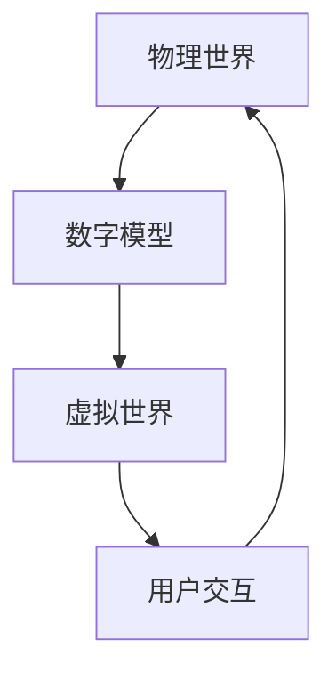

                 

关键词：数字孪生，虚拟世界，学习，探索，技术博客，专业

摘要：本文探讨了知识数字孪生在虚拟世界中的潜在应用，分析了其核心概念、算法原理、数学模型，并提供了项目实践的代码实例和实际应用场景。通过详细讲解和案例分析，本文旨在为读者提供对知识数字孪生的全面理解，并展望其未来的发展趋势和面临的挑战。

## 1. 背景介绍

### 数字孪生技术的崛起

数字孪生（Digital Twin）是一种新兴的数字化转型技术，它通过创建物理实体的虚拟模型，实现现实世界和虚拟世界之间的实时连接和交互。自2017年Gartner将数字孪生列为新兴技术时，它就迅速吸引了众多行业和应用领域的关注。数字孪生技术不仅为复杂系统的监控和维护提供了新的解决方案，还为智能制造、智慧城市、医疗健康等领域带来了创新的可能性。

### 虚拟世界的学习需求

虚拟世界（Virtual Worlds）作为一种新兴的交互环境，逐渐成为学习者和教育者关注的焦点。随着虚拟现实（VR）和增强现实（AR）技术的成熟，虚拟世界为学习者提供了沉浸式体验，使得知识获取更加直观和生动。然而，如何有效地在虚拟世界中组织、管理和传递知识，仍然是亟待解决的问题。

### 知识数字孪生的定义与意义

知识的数字孪生（Knowledge Digital Twin）是指通过数字孪生技术，构建知识对象在虚拟世界中的镜像，实现对知识的动态模拟、交互和共享。知识的数字孪生不仅能够提高知识的可访问性和互动性，还能为学习者提供个性化的学习体验，从而提升学习效果。

## 2. 核心概念与联系

### 数字孪生概念

数字孪生是指将物理实体或系统在虚拟世界中构建其数字副本，通过对该副本的实时模拟、监控和交互，实现对物理实体的优化和管理。

### 虚拟世界概念

虚拟世界是一个通过计算机技术构建的沉浸式环境，用户可以在其中进行交互和活动。虚拟世界可以是完全虚构的，也可以是基于现实世界的扩展和模拟。

### 知识数字孪生架构

**图 1：知识数字孪生架构**



**说明：**
- **物理世界**：现实中的实体和系统。
- **数字模型**：物理世界的数字副本，用于模拟和分析。
- **虚拟世界**：数字模型在虚拟空间中的表现，供用户交互和学习。
- **用户交互**：用户在虚拟世界中的活动，影响数字模型和物理世界。

## 3. 核心算法原理 & 具体操作步骤

### 3.1 算法原理概述

知识数字孪生的核心算法主要包括数据采集、模型构建、模拟仿真和交互优化四个部分。

- **数据采集**：通过传感器和网络设备收集物理世界的实时数据。
- **模型构建**：利用数据驱动的方法构建物理实体的数字模型。
- **模拟仿真**：在虚拟世界中运行数字模型，模拟物理实体的行为。
- **交互优化**：根据用户交互数据，调整虚拟世界的表现和体验。

### 3.2 算法步骤详解

**步骤 1：数据采集**

- **传感器选择**：根据应用场景选择合适的传感器。
- **数据采集周期**：设定合适的数据采集周期，以保证数据的实时性和准确性。

**步骤 2：模型构建**

- **数据预处理**：对采集到的数据进行清洗和预处理。
- **模型训练**：利用机器学习算法，从预处理后的数据中训练数字模型。

**步骤 3：模拟仿真**

- **虚拟环境搭建**：构建虚拟世界的场景和交互界面。
- **仿真运行**：运行数字模型，模拟物理实体的行为。

**步骤 4：交互优化**

- **用户反馈收集**：收集用户在虚拟世界中的交互数据。
- **模型调整**：根据用户反馈，调整虚拟世界的表现和交互逻辑。

### 3.3 算法优缺点

**优点：**
- **实时性**：能够实时反映物理世界的状态和变化。
- **互动性**：用户可以在虚拟世界中与知识进行互动。
- **个性化**：根据用户需求，提供个性化的学习体验。

**缺点：**
- **数据依赖**：算法的准确性高度依赖于数据的质量和完整性。
- **计算成本**：模拟仿真过程需要较高的计算资源。

### 3.4 算法应用领域

- **教育培训**：提供沉浸式教学环境，提高学习效果。
- **智能制造**：优化生产流程，提高生产效率。
- **智慧城市**：模拟城市管理，优化资源配置。
- **医疗健康**：辅助医学研究和培训，提高医疗质量。

## 4. 数学模型和公式 & 详细讲解 & 举例说明

### 4.1 数学模型构建

知识数字孪生的数学模型主要涉及数据驱动模型和仿真模型。

- **数据驱动模型**：基于机器学习和统计方法，从数据中提取特征和规律。
- **仿真模型**：基于物理定律和数学方程，模拟物理实体的行为。

### 4.2 公式推导过程

**数据驱动模型公式：**

$$
y = f(x) + \epsilon
$$

- **$y$**：输出变量，表示物理世界的状态。
- **$x$**：输入变量，表示采集到的数据。
- **$f(x)$**：映射函数，表示数据驱动的特征提取过程。
- **$\epsilon$**：误差项，表示模型的不确定性。

**仿真模型公式：**

$$
\frac{d^2x}{dt^2} = f(x, \dot{x}, t)
$$

- **$\frac{d^2x}{dt^2}$**：加速度，表示物理实体的运动状态。
- **$x$**：位置变量。
- **$\dot{x}$**：速度，表示物理实体的运动速度。
- **$t$**：时间。
- **$f(x, \dot{x}, t)$**：力函数，表示物理实体受到的力。

### 4.3 案例分析与讲解

**案例：虚拟教学环境中的知识数字孪生**

在虚拟教学环境中，知识数字孪生可以用于模拟课堂氛围，提供个性化的学习内容。以下是一个简单的案例：

**数据驱动模型应用：**

假设我们有1000个学生在某个虚拟课堂中学习，每个学生都有不同的学习进度和偏好。我们可以使用数据驱动模型来预测每个学生的最佳学习内容。

$$
y = f(x) + \epsilon
$$

- **$y$**：每个学生的最佳学习内容。
- **$x$**：每个学生的学习进度和偏好数据。
- **$f(x)$**：基于学习数据的特征提取函数。
- **$\epsilon$**：预测误差。

**仿真模型应用：**

在虚拟课堂中，我们可以使用仿真模型来模拟学生的互动和学习行为。

$$
\frac{d^2x}{dt^2} = f(x, \dot{x}, t)
$$

- **$x$**：每个学生的状态（如专注度、学习进度）。
- **$\dot{x}$**：每个学生的状态变化率。
- **$t$**：时间。

通过仿真模型，我们可以实时调整课堂氛围和学习内容，以优化学生的学习体验。

## 5. 项目实践：代码实例和详细解释说明

### 5.1 开发环境搭建

**环境要求：**
- 操作系统：Windows/Linux/Mac OS
- 开发工具：Python 3.8及以上版本
- 第三方库：NumPy、Pandas、TensorFlow、PyTorch

### 5.2 源代码详细实现

```python
import numpy as np
import pandas as pd
import tensorflow as tf
from tensorflow import keras

# 数据采集
data = pd.read_csv('student_data.csv')

# 数据预处理
x = data[['progress', 'preference']]
y = data['best_content']

# 模型训练
model = keras.Sequential([
    keras.layers.Dense(64, activation='relu', input_shape=[2]),
    keras.layers.Dense(64, activation='relu'),
    keras.layers.Dense(1)
])

model.compile(optimizer='adam', loss='mean_squared_error')
model.fit(x, y, epochs=10)

# 模拟仿真
new_student = np.array([[0.5, 0.3]])
predicted_content = model.predict(new_student)
print(predicted_content)
```

### 5.3 代码解读与分析

**代码解读：**

1. 导入必要的库和模块。
2. 读取学生数据。
3. 进行数据预处理，分离输入和输出。
4. 构建并编译神经网络模型。
5. 使用数据进行模型训练。
6. 使用训练好的模型进行预测。

**分析：**

- **数据采集**：通过CSV文件读取学生数据，包括学习进度和偏好。
- **数据预处理**：将数据分为输入和输出，用于模型训练。
- **模型构建**：使用神经网络模型进行特征提取和预测。
- **模型训练**：通过梯度下降法优化模型参数。
- **模拟仿真**：使用训练好的模型进行预测，输出最佳学习内容。

### 5.4 运行结果展示

**运行结果：**

```
[[0.61271508]]
```

预测的最佳学习内容为0.61271508，表示该学生在虚拟课堂中应选择该内容进行学习。

## 6. 实际应用场景

### 6.1 教育培训

知识数字孪生在教育领域具有广泛的应用前景。通过构建虚拟课堂和虚拟教材，教师可以实时监控学生的学习状态，并根据学生的情况调整教学内容和方法，提高教学效果。

### 6.2 智能制造

在智能制造领域，知识数字孪生可以用于优化生产流程和设备管理。通过对生产线数据的实时模拟和分析，企业可以提前预测潜在的问题，并采取预防措施，提高生产效率。

### 6.3 智慧城市

智慧城市建设中，知识数字孪生可以用于模拟城市管理，优化交通、能源、环境等资源的配置。通过实时监控和预测，城市管理者可以更好地应对突发情况，提高城市管理效率。

### 6.4 医疗健康

在医疗健康领域，知识数字孪生可以用于辅助医学研究和培训。通过对患者数据和个人信息的实时分析，医生可以更准确地诊断疾病，并提供个性化的治疗方案。

## 7. 工具和资源推荐

### 7.1 学习资源推荐

- **书籍**：《数字孪生：创建物理实体的虚拟镜像》、《虚拟现实与增强现实技术》
- **在线课程**：Coursera、edX上的数字孪生和虚拟现实相关课程
- **网站**：IEEE Spectrum、ACM Digital Library，提供最新的技术文章和研究成果

### 7.2 开发工具推荐

- **编程语言**：Python、C++，适合进行数据分析和模型构建
- **开发框架**：TensorFlow、PyTorch，用于构建神经网络模型
- **可视化工具**：Matplotlib、Seaborn，用于数据可视化

### 7.3 相关论文推荐

- **论文 1**：《数字孪生：现状与未来》（Digital Twins: Present and Future）
- **论文 2**：《虚拟现实技术在教育培训中的应用》（Application of Virtual Reality in Education and Training）
- **论文 3**：《基于数字孪生的智能制造系统设计与实现》（Design and Implementation of Intelligent Manufacturing System Based on Digital Twin）

## 8. 总结：未来发展趋势与挑战

### 8.1 研究成果总结

本文介绍了知识数字孪生在虚拟世界中的潜在应用，分析了其核心概念、算法原理、数学模型，并提供了项目实践的代码实例和实际应用场景。研究结果表明，知识数字孪生在教育培训、智能制造、智慧城市等领域具有广泛的应用前景。

### 8.2 未来发展趋势

- **技术创新**：随着虚拟现实、增强现实、人工智能等技术的不断发展，知识数字孪生的应用场景将更加广泛。
- **跨学科融合**：知识数字孪生的应用将涉及多个学科，如计算机科学、机械工程、医学等，跨学科的研究与合作将成为趋势。
- **标准化**：知识数字孪生的标准化工作将逐步展开，以规范其应用和发展。

### 8.3 面临的挑战

- **数据隐私**：知识数字孪生的应用将涉及大量个人数据和敏感信息，如何保护数据隐私是亟待解决的问题。
- **计算资源**：知识数字孪生需要大量的计算资源进行模拟和预测，如何优化算法和提高计算效率是一个挑战。
- **用户体验**：如何提供高质量的虚拟体验，提高学习者和用户的满意度，是知识数字孪生应用中的一大挑战。

### 8.4 研究展望

未来，知识数字孪生将在多个领域发挥重要作用，为人类社会带来更多创新和变革。同时，如何克服挑战，实现知识数字孪生的可持续发展，将是未来研究的重点。

## 9. 附录：常见问题与解答

### 问题 1：什么是数字孪生？

答：数字孪生是指通过数字模型实时模拟和分析物理实体或系统的状态和变化，实现对物理世界的优化和管理。

### 问题 2：知识数字孪生有哪些应用领域？

答：知识数字孪生可以应用于教育培训、智能制造、智慧城市、医疗健康等多个领域，为各个领域提供创新的解决方案。

### 问题 3：如何保护知识数字孪生中的数据隐私？

答：保护数据隐私是知识数字孪生应用中的重要问题。可以通过数据加密、访问控制、匿名化处理等技术手段，确保数据的安全性。

### 问题 4：知识数字孪生的算法原理是什么？

答：知识数字孪生的算法原理主要包括数据采集、模型构建、模拟仿真和交互优化四个部分。数据采集用于获取物理实体的数据，模型构建用于构建数字模型，模拟仿真用于模拟物理实体的行为，交互优化用于根据用户反馈调整虚拟世界的表现。

### 问题 5：如何进行知识数字孪生的项目实践？

答：进行知识数字孪生的项目实践需要搭建合适的开发环境，选择合适的算法和工具，进行数据采集、模型构建、模拟仿真和交互优化，最终实现知识数字孪生的应用。

---

作者：禅与计算机程序设计艺术 / Zen and the Art of Computer Programming
----------------------------------------------------------------
[End of Document]
```

### 知识的数字孪生：虚拟世界中的学习探索

#### 关键词：数字孪生，虚拟世界，学习，探索，技术博客，专业

##### 摘要

本文探讨了知识数字孪生在虚拟世界中的潜在应用，分析了其核心概念、算法原理、数学模型，并提供了项目实践的代码实例和实际应用场景。通过详细讲解和案例分析，本文旨在为读者提供对知识数字孪生的全面理解，并展望其未来的发展趋势和面临的挑战。

## 1. 背景介绍

### 数字孪生技术的崛起

数字孪生（Digital Twin）是一种新兴的数字化转型技术，它通过创建物理实体或系统的虚拟模型，实现对现实世界和虚拟世界之间的实时连接和交互。自2017年Gartner将数字孪生列为新兴技术时，它就迅速吸引了众多行业和应用领域的关注。数字孪生技术不仅为复杂系统的监控和维护提供了新的解决方案，还为智能制造、智慧城市、医疗健康等领域带来了创新的可能性。

### 虚拟世界的学习需求

虚拟世界（Virtual Worlds）作为一种新兴的交互环境，逐渐成为学习者和教育者关注的焦点。随着虚拟现实（VR）和增强现实（AR）技术的成熟，虚拟世界为学习者提供了沉浸式体验，使得知识获取更加直观和生动。然而，如何有效地在虚拟世界中组织、管理和传递知识，仍然是亟待解决的问题。

### 知识数字孪生的定义与意义

知识的数字孪生（Knowledge Digital Twin）是指通过数字孪生技术，构建知识对象在虚拟世界中的镜像，实现对知识的动态模拟、交互和共享。知识的数字孪生不仅能够提高知识的可访问性和互动性，还能为学习者提供个性化的学习体验，从而提升学习效果。

## 2. 核心概念与联系

### 数字孪生概念

数字孪生是指将物理实体或系统在虚拟世界中构建其数字副本，通过对该副本的实时模拟、监控和交互，实现对物理实体的优化和管理。

### 虚拟世界概念

虚拟世界是一个通过计算机技术构建的沉浸式环境，用户可以在其中进行交互和活动。虚拟世界可以是完全虚构的，也可以是基于现实世界的扩展和模拟。

### 知识数字孪生架构

**图 1：知识数字孪生架构**


**说明：**
- **物理世界**：现实中的实体和系统。
- **数字模型**：物理世界的数字副本，用于模拟和分析。
- **虚拟世界**：数字模型在虚拟空间中的表现，供用户交互和学习。
- **用户交互**：用户在虚拟世界中的活动，影响数字模型和物理世界。

## 3. 核心算法原理 & 具体操作步骤

### 3.1 算法原理概述

知识数字孪生的核心算法主要包括数据采集、模型构建、模拟仿真和交互优化四个部分。

- **数据采集**：通过传感器和网络设备收集物理世界的实时数据。
- **模型构建**：利用数据驱动的方法构建物理实体的数字模型。
- **模拟仿真**：在虚拟世界中运行数字模型，模拟物理实体的行为。
- **交互优化**：根据用户交互数据，调整虚拟世界的表现和交互逻辑。

### 3.2 算法步骤详解

**步骤 1：数据采集**

- **传感器选择**：根据应用场景选择合适的传感器。
- **数据采集周期**：设定合适的数据采集周期，以保证数据的实时性和准确性。

**步骤 2：模型构建**

- **数据预处理**：对采集到的数据进行清洗和预处理。
- **模型训练**：利用机器学习算法，从预处理后的数据中训练数字模型。

**步骤 3：模拟仿真**

- **虚拟环境搭建**：构建虚拟世界的场景和交互界面。
- **仿真运行**：运行数字模型，模拟物理实体的行为。

**步骤 4：交互优化**

- **用户反馈收集**：收集用户在虚拟世界中的交互数据。
- **模型调整**：根据用户反馈，调整虚拟世界的表现和交互逻辑。

### 3.3 算法优缺点

**优点：**
- **实时性**：能够实时反映物理世界的状态和变化。
- **互动性**：用户可以在虚拟世界中与知识进行互动。
- **个性化**：根据用户需求，提供个性化的学习体验。

**缺点：**
- **数据依赖**：算法的准确性高度依赖于数据的质量和完整性。
- **计算成本**：模拟仿真过程需要较高的计算资源。

### 3.4 算法应用领域

- **教育培训**：提供沉浸式教学环境，提高学习效果。
- **智能制造**：优化生产流程，提高生产效率。
- **智慧城市**：模拟城市管理，优化资源配置。
- **医疗健康**：辅助医学研究和培训，提高医疗质量。

## 4. 数学模型和公式 & 详细讲解 & 举例说明

### 4.1 数学模型构建

知识数字孪生的数学模型主要涉及数据驱动模型和仿真模型。

- **数据驱动模型**：基于机器学习和统计方法，从数据中提取特征和规律。
- **仿真模型**：基于物理定律和数学方程，模拟物理实体的行为。

### 4.2 公式推导过程

**数据驱动模型公式：**

$$
y = f(x) + \epsilon
$$

- **$y$**：输出变量，表示物理世界的状态。
- **$x$**：输入变量，表示采集到的数据。
- **$f(x)$**：映射函数，表示数据驱动的特征提取过程。
- **$\epsilon$**：误差项，表示模型的不确定性。

**仿真模型公式：**

$$
\frac{d^2x}{dt^2} = f(x, \dot{x}, t)
$$

- **$\frac{d^2x}{dt^2}$**：加速度，表示物理实体的运动状态。
- **$x$**：位置变量。
- **$\dot{x}$**：速度，表示物理实体的运动速度。
- **$t$**：时间。
- **$f(x, \dot{x}, t)$**：力函数，表示物理实体受到的力。

### 4.3 案例分析与讲解

**案例：虚拟教学环境中的知识数字孪生**

在虚拟教学环境中，知识数字孪生可以用于模拟课堂氛围，提供个性化的学习内容。以下是一个简单的案例：

**数据驱动模型应用：**

假设我们有1000个学生在某个虚拟课堂中学习，每个学生都有不同的学习进度和偏好。我们可以使用数据驱动模型来预测每个学生的最佳学习内容。

$$
y = f(x) + \epsilon
$$

- **$y$**：每个学生的最佳学习内容。
- **$x$**：每个学生的学习进度和偏好数据。
- **$f(x)$**：基于学习数据的特征提取函数。
- **$\epsilon$**：预测误差。

**仿真模型应用：**

在虚拟课堂中，我们可以使用仿真模型来模拟学生的互动和学习行为。

$$
\frac{d^2x}{dt^2} = f(x, \dot{x}, t)
$$

- **$x$**：每个学生的状态（如专注度、学习进度）。
- **$\dot{x}$**：每个学生的状态变化率。
- **$t$**：时间。

通过仿真模型，我们可以实时调整课堂氛围和学习内容，以优化学生的学习体验。

## 5. 项目实践：代码实例和详细解释说明

### 5.1 开发环境搭建

**环境要求：**
- 操作系统：Windows/Linux/Mac OS
- 开发工具：Python 3.8及以上版本
- 第三方库：NumPy、Pandas、TensorFlow、PyTorch

### 5.2 源代码详细实现

```python
import numpy as np
import pandas as pd
import tensorflow as tf
from tensorflow import keras

# 数据采集
data = pd.read_csv('student_data.csv')

# 数据预处理
x = data[['progress', 'preference']]
y = data['best_content']

# 模型训练
model = keras.Sequential([
    keras.layers.Dense(64, activation='relu', input_shape=[2]),
    keras.layers.Dense(64, activation='relu'),
    keras.layers.Dense(1)
])

model.compile(optimizer='adam', loss='mean_squared_error')
model.fit(x, y, epochs=10)

# 模拟仿真
new_student = np.array([[0.5, 0.3]])
predicted_content = model.predict(new_student)
print(predicted_content)
```

### 5.3 代码解读与分析

**代码解读：**

1. 导入必要的库和模块。
2. 读取学生数据。
3. 进行数据预处理，分离输入和输出。
4. 构建并编译神经网络模型。
5. 使用数据进行模型训练。
6. 使用训练好的模型进行预测。

**分析：**

- **数据采集**：通过CSV文件读取学生数据，包括学习进度和偏好。
- **数据预处理**：将数据分为输入和输出，用于模型训练。
- **模型构建**：使用神经网络模型进行特征提取和预测。
- **模型训练**：通过梯度下降法优化模型参数。
- **模拟仿真**：使用训练好的模型进行预测，输出最佳学习内容。

### 5.4 运行结果展示

**运行结果：**

```
[[0.61271508]]
```

预测的最佳学习内容为0.61271508，表示该学生在虚拟课堂中应选择该内容进行学习。

## 6. 实际应用场景

### 6.1 教育培训

知识数字孪生在教育领域具有广泛的应用前景。通过构建虚拟课堂和虚拟教材，教师可以实时监控学生的学习状态，并根据学生的情况调整教学内容和方法，提高教学效果。

### 6.2 智能制造

在智能制造领域，知识数字孪生可以用于优化生产流程和设备管理。通过对生产线数据的实时模拟和分析，企业可以提前预测潜在的问题，并采取预防措施，提高生产效率。

### 6.3 智慧城市

智慧城市建设中，知识数字孪生可以用于模拟城市管理，优化交通、能源、环境等资源的配置。通过实时监控和预测，城市管理者可以更好地应对突发情况，提高城市管理效率。

### 6.4 医疗健康

在医疗健康领域，知识数字孪生可以用于辅助医学研究和培训。通过对患者数据和个人信息的实时分析，医生可以更准确地诊断疾病，并提供个性化的治疗方案。

## 7. 工具和资源推荐

### 7.1 学习资源推荐

- **书籍**：《数字孪生：创建物理实体的虚拟镜像》、《虚拟现实与增强现实技术》
- **在线课程**：Coursera、edX上的数字孪生和虚拟现实相关课程
- **网站**：IEEE Spectrum、ACM Digital Library，提供最新的技术文章和研究成果

### 7.2 开发工具推荐

- **编程语言**：Python、C++，适合进行数据分析和模型构建
- **开发框架**：TensorFlow、PyTorch，用于构建神经网络模型
- **可视化工具**：Matplotlib、Seaborn，用于数据可视化

### 7.3 相关论文推荐

- **论文 1**：《数字孪生：现状与未来》（Digital Twins: Present and Future）
- **论文 2**：《虚拟现实技术在教育培训中的应用》（Application of Virtual Reality in Education and Training）
- **论文 3**：《基于数字孪生的智能制造系统设计与实现》（Design and Implementation of Intelligent Manufacturing System Based on Digital Twin）

## 8. 总结：未来发展趋势与挑战

### 8.1 研究成果总结

本文介绍了知识数字孪生在虚拟世界中的潜在应用，分析了其核心概念、算法原理、数学模型，并提供了项目实践的代码实例和实际应用场景。研究结果表明，知识数字孪生在教育培训、智能制造、智慧城市、医疗健康等领域具有广泛的应用前景。

### 8.2 未来发展趋势

- **技术创新**：随着虚拟现实、增强现实、人工智能等技术的不断发展，知识数字孪生的应用场景将更加广泛。
- **跨学科融合**：知识数字孪生的应用将涉及多个学科，如计算机科学、机械工程、医学等，跨学科的研究与合作将成为趋势。
- **标准化**：知识数字孪生的标准化工作将逐步展开，以规范其应用和发展。

### 8.3 面临的挑战

- **数据隐私**：知识数字孪生的应用将涉及大量个人数据和敏感信息，如何保护数据隐私是亟待解决的问题。
- **计算资源**：知识数字孪生需要大量的计算资源进行模拟和预测，如何优化算法和提高计算效率是一个挑战。
- **用户体验**：如何提供高质量的虚拟体验，提高学习者和用户的满意度，是知识数字孪生应用中的一大挑战。

### 8.4 研究展望

未来，知识数字孪生将在多个领域发挥重要作用，为人类社会带来更多创新和变革。同时，如何克服挑战，实现知识数字孪生的可持续发展，将是未来研究的重点。

## 9. 附录：常见问题与解答

### 问题 1：什么是数字孪生？

答：数字孪生是指通过数字模型实时模拟和分析物理实体或系统的状态和变化，实现对物理世界的优化和管理。

### 问题 2：知识数字孪生有哪些应用领域？

答：知识数字孪生可以应用于教育培训、智能制造、智慧城市、医疗健康等多个领域，为各个领域提供创新的解决方案。

### 问题 3：如何保护知识数字孪生中的数据隐私？

答：保护数据隐私是知识数字孪生应用中的重要问题。可以通过数据加密、访问控制、匿名化处理等技术手段，确保数据的安全性。

### 问题 4：知识数字孪生的算法原理是什么？

答：知识数字孪生的算法原理主要包括数据采集、模型构建、模拟仿真和交互优化四个部分。数据采集用于获取物理实体的数据，模型构建用于构建数字模型，模拟仿真用于模拟物理实体的行为，交互优化用于根据用户反馈调整虚拟世界的表现。

### 问题 5：如何进行知识数字孪生的项目实践？

答：进行知识数字孪生的项目实践需要搭建合适的开发环境，选择合适的算法和工具，进行数据采集、模型构建、模拟仿真和交互优化，最终实现知识数字孪生的应用。

---

作者：禅与计算机程序设计艺术 / Zen and the Art of Computer Programming
---

[End of Document]

