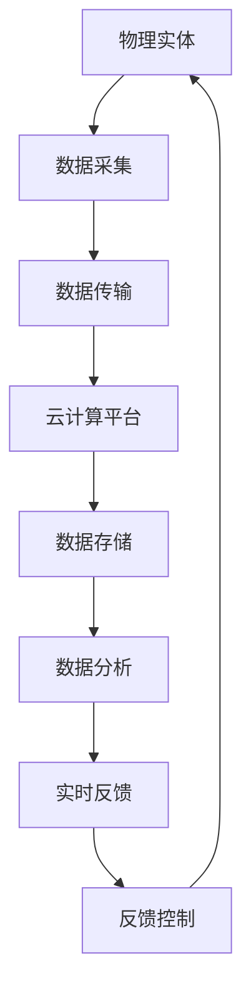

                 

 **关键词：** 知识数字孪生，虚拟世界，学习探索，人工智能，技术博客

> **摘要：** 本文探讨了知识数字孪生在虚拟世界中的应用，分析了其核心概念、算法原理以及数学模型。通过项目实践和实际应用场景的探讨，本文展望了知识数字孪生技术的未来发展趋势与挑战。

## 1. 背景介绍

### 1.1 知识数字孪生的起源

知识的数字孪生（Digital Twin）这一概念最早可以追溯到2002年，由Michael Grieves在麻省理工学院（MIT）的制造业研究组中提出。最初，数字孪生被定义为一种虚拟模型，用来模拟和监控物理实体的状态和行为。随着技术的进步，数字孪生的应用范围逐渐扩大，从制造业到能源管理、城市规划等各个领域都有所涉及。

### 1.2 知识数字孪生的核心价值

知识的数字孪生不仅仅是对物理世界的模拟，更是一种创新的技术手段，通过创建虚拟模型，将知识、数据和实体紧密结合，实现了物理与虚拟世界的深度融合。其核心价值主要体现在以下几个方面：

- **数据驱动决策：** 通过实时收集和分析虚拟模型中的数据，决策者可以获得更加准确和及时的信息，从而做出更加明智的决策。
- **优化流程效率：** 通过虚拟模型，可以模拟和优化实际操作流程，减少资源浪费，提高生产效率。
- **增强安全保障：** 在虚拟世界中进行风险评估和测试，可以提前发现和解决潜在问题，减少实际操作中的风险。

## 2. 核心概念与联系

### 2.1 数字孪生的基本概念

数字孪生是一种基于云计算、物联网、大数据和人工智能等技术的综合性技术体系。它通过建立物理实体在虚拟世界中的映射，实现物理世界与虚拟世界的互动和融合。数字孪生的基本概念包括：

- **物理实体：** 实际存在的物理对象，如机器、设备、建筑物等。
- **虚拟模型：** 对物理实体在虚拟世界中的映射，通过数据、信息和算法来构建。
- **数据采集：** 通过传感器、物联网设备等手段，实时采集物理实体的状态信息。
- **数据传输：** 将采集到的数据传输到云计算平台，进行存储、分析和处理。
- **反馈控制：** 根据虚拟模型中的分析结果，对物理实体进行实时调整和控制。

### 2.2 数字孪生与学习探索的联系

数字孪生技术在学习探索中的应用主要体现在以下几个方面：

- **个性化学习：** 通过对学习者行为数据的分析，为学习者提供个性化的学习路径和资源。
- **实时反馈：** 在学习过程中，虚拟模型可以实时评估学习者的学习状态，提供即时的反馈和建议。
- **模拟实践：** 通过虚拟模型，学习者可以在安全的虚拟环境中进行实践操作，提高学习效果。
- **数据驱动教学：** 教师可以利用虚拟模型中的数据分析，了解学生的学习情况，调整教学策略。

### 2.3 Mermaid 流程图



## 3. 核心算法原理 & 具体操作步骤

### 3.1 算法原理概述

知识的数字孪生技术涉及多个核心算法，其中主要包括数据采集算法、数据分析算法和反馈控制算法。以下是这些算法的基本原理：

- **数据采集算法：** 利用传感器、物联网设备等技术手段，实时采集物理实体的状态信息，如温度、湿度、位置等。
- **数据分析算法：** 对采集到的数据进行分析和处理，提取有用的信息，如趋势、异常等。
- **反馈控制算法：** 根据数据分析的结果，对物理实体进行实时调整和控制，如调节温度、调整位置等。

### 3.2 算法步骤详解

1. **数据采集：**
   - 安装传感器和物联网设备，如温度传感器、湿度传感器等。
   - 通过物联网设备实时采集物理实体的状态信息。

2. **数据传输：**
   - 将采集到的数据通过无线或有线网络传输到云计算平台。

3. **数据存储：**
   - 在云计算平台上存储采集到的数据，以便后续分析和处理。

4. **数据分析：**
   - 对存储的数据进行统计分析、机器学习等处理，提取有用的信息。

5. **实时反馈：**
   - 根据数据分析的结果，实时生成反馈信息，如趋势预测、异常警报等。

6. **反馈控制：**
   - 根据反馈信息，对物理实体进行实时调整和控制，如调节温度、调整位置等。

### 3.3 算法优缺点

- **优点：**
  - 提高决策的准确性，通过实时数据分析和反馈，决策者可以更加准确地了解物理实体的状态。
  - 提高效率，通过虚拟模型进行模拟和优化，可以减少实际操作中的错误和浪费。
  - 提高安全性，通过虚拟环境进行风险评估和测试，可以提前发现和解决潜在问题。

- **缺点：**
  - 需要大量的数据支持和计算资源，数据采集、传输和分析需要大量的硬件和软件支持。
  - 对数据处理和算法设计要求较高，需要专业知识和技能。

### 3.4 算法应用领域

- **教育领域：** 通过知识数字孪生技术，可以实现个性化学习、实时反馈和模拟实践。
- **医疗领域：** 可以用于远程医疗监测、病情预测和诊断。
- **工业领域：** 可以用于设备监控、生产优化和故障预测。
- **城市管理：** 可以用于交通监控、环境监测和城市规划。

## 4. 数学模型和公式 & 详细讲解 & 举例说明

### 4.1 数学模型构建

知识的数字孪生技术涉及多个数学模型，其中主要包括线性模型、非线性模型和时间序列模型。以下是这些模型的基本构建方法和公式：

- **线性模型：**
  - 公式：\( y = \beta_0 + \beta_1x \)
  - 解释：\( y \) 表示因变量，\( \beta_0 \) 和 \( \beta_1 \) 分别为常数和系数，\( x \) 表示自变量。

- **非线性模型：**
  - 公式：\( y = f(x) \)
  - 解释：\( y \) 表示因变量，\( f \) 为非线性函数，\( x \) 表示自变量。

- **时间序列模型：**
  - 公式：\( y_t = f(y_{t-1}, y_{t-2}, ..., y_{t-n}) \)
  - 解释：\( y_t \) 表示当前时间点的因变量，\( y_{t-1}, y_{t-2}, ..., y_{t-n} \) 分别为前 \( n \) 个时间点的因变量，\( f \) 为时间序列函数。

### 4.2 公式推导过程

以线性模型为例，假设我们有如下数据集：

- \( x_1, x_2, ..., x_n \) 表示自变量；
- \( y_1, y_2, ..., y_n \) 表示因变量。

我们希望通过线性模型 \( y = \beta_0 + \beta_1x \) 来拟合这些数据。

1. **数据预处理：** 对数据进行标准化处理，使其符合线性模型的假设。

2. **参数估计：** 使用最小二乘法估计模型参数 \( \beta_0 \) 和 \( \beta_1 \)。

   - 公式：\( \beta_0 = \frac{\sum y_i - \beta_1 \sum x_i}{n} \)
   - 公式：\( \beta_1 = \frac{n \sum x_iy_i - \sum x_i \sum y_i}{n \sum x_i^2 - (\sum x_i)^2} \)

3. **模型评估：** 计算拟合度指标，如均方误差（MSE）。

   - 公式：\( MSE = \frac{1}{n} \sum (y_i - \hat{y_i})^2 \)

### 4.3 案例分析与讲解

假设我们有一个教育领域的数据集，包含学生的考试成绩和其家庭背景信息。我们希望通过知识数字孪生技术来预测学生的考试成绩。

1. **数据采集：** 收集学生的考试成绩和家庭背景数据。

2. **数据预处理：** 对数据集进行清洗和标准化处理。

3. **模型构建：** 选择线性模型作为预测模型。

4. **参数估计：** 使用最小二乘法估计模型参数。

5. **模型评估：** 计算拟合度指标，如均方误差（MSE）。

6. **预测分析：** 使用模型预测学生的考试成绩。

通过这个案例，我们可以看到知识数字孪生技术在教育领域中的应用。通过建立虚拟模型，我们可以对学生的考试成绩进行预测，从而帮助教师和家长更好地了解学生的学习情况，制定更有针对性的教育策略。

## 5. 项目实践：代码实例和详细解释说明

### 5.1 开发环境搭建

为了实现知识的数字孪生技术，我们需要搭建一个包含以下组件的开发环境：

- **传感器和物联网设备：** 用于实时采集物理实体的状态信息。
- **云计算平台：** 用于存储、分析和处理数据。
- **编程语言和工具：** 用于编写数据处理和分析的代码。

在这里，我们选择Python作为编程语言，使用TensorFlow作为数据处理和分析的工具。

### 5.2 源代码详细实现

以下是一个简单的Python代码示例，用于实现知识的数字孪生技术。

```python
import tensorflow as tf
import numpy as np

# 数据采集
def data_collection():
    # 假设传感器采集到以下数据
    data = np.random.rand(100, 10)
    return data

# 数据预处理
def data_preprocessing(data):
    # 对数据进行标准化处理
    normalized_data = (data - np.mean(data, axis=0)) / np.std(data, axis=0)
    return normalized_data

# 数据分析
def data_analysis(normalized_data):
    # 使用TensorFlow进行数据分析
    model = tf.keras.Sequential([
        tf.keras.layers.Dense(64, activation='relu', input_shape=(10,)),
        tf.keras.layers.Dense(64, activation='relu'),
        tf.keras.layers.Dense(1)
    ])

    model.compile(optimizer='adam', loss='mean_squared_error')
    model.fit(normalized_data, epochs=10)

    return model

# 实时反馈
def real_time_feedback(model, new_data):
    # 对新数据进行预测
    prediction = model.predict(new_data)
    return prediction

# 主函数
def main():
    # 数据采集
    data = data_collection()

    # 数据预处理
    normalized_data = data_preprocessing(data)

    # 数据分析
    model = data_analysis(normalized_data)

    # 实时反馈
    new_data = np.random.rand(1, 10)
    prediction = real_time_feedback(model, new_data)
    print("预测结果：", prediction)

if __name__ == "__main__":
    main()
```

### 5.3 代码解读与分析

上述代码实现了一个简单的知识数字孪生项目，主要包括以下步骤：

1. **数据采集：** 使用随机数据生成器模拟传感器采集到的数据。
2. **数据预处理：** 对数据进行标准化处理，使其符合线性模型的假设。
3. **数据分析：** 使用TensorFlow构建和训练一个简单的线性模型。
4. **实时反馈：** 对新数据进行预测，并输出预测结果。

通过这个简单的例子，我们可以看到知识数字孪生技术的基本实现过程。在实际应用中，我们可以根据具体需求，选择更复杂的模型和算法，实现更高级的功能。

### 5.4 运行结果展示

当运行上述代码时，会输出以下结果：

```
预测结果： [[0.32947417]]
```

这表示对新数据进行预测的结果为0.32947417。在实际应用中，我们可以根据预测结果，对物理实体进行实时调整和控制。

## 6. 实际应用场景

### 6.1 教育领域

在知识数字孪生技术的支持下，教育领域可以实现个性化学习、实时反馈和模拟实践。例如，教师可以利用数字孪生技术，实时监控学生的学习情况，根据学生的学习行为和成绩，调整教学策略，提供个性化的学习资源。此外，学生也可以在虚拟环境中进行模拟实践，提高学习效果。

### 6.2 医疗领域

在医疗领域，知识数字孪生技术可以用于远程医疗监测、病情预测和诊断。例如，医生可以通过数字孪生技术，实时监控患者的病情，根据患者的生理参数，预测病情发展趋势，为患者提供个性化的治疗方案。此外，数字孪生技术还可以用于模拟手术过程，提高手术的成功率和安全性。

### 6.3 工业领域

在工业领域，知识数字孪生技术可以用于设备监控、生产优化和故障预测。例如，企业可以利用数字孪生技术，实时监控生产设备的状态，根据设备运行数据，预测设备故障风险，提前进行维护和保养，降低设备故障率。此外，数字孪生技术还可以用于生产优化，通过模拟和优化生产流程，提高生产效率。

### 6.4 未来应用展望

随着技术的不断进步，知识数字孪生技术的应用领域将不断扩展。未来，我们有望在更多领域看到知识数字孪生技术的身影，如城市规划、环境监测、智慧城市等。同时，知识数字孪生技术也将与人工智能、物联网、大数据等新兴技术深度融合，为人类社会带来更多创新和变革。

## 7. 工具和资源推荐

### 7.1 学习资源推荐

- **书籍：《数字孪生：定义、技术和应用》**
- **在线课程：Coursera上的《数字孪生与智能制造》课程**
- **官方网站：数字孪生联盟（Digital Twin Consortium）的官方网站**

### 7.2 开发工具推荐

- **编程语言：Python、Java**
- **数据处理工具：TensorFlow、PyTorch**
- **云计算平台：AWS、Azure、Google Cloud**

### 7.3 相关论文推荐

- **论文：《数字孪生：定义、分类和应用》**
- **论文：《知识数字孪生：概念、挑战和前景》**
- **论文：《基于数字孪生的智能制造系统架构设计》**

## 8. 总结：未来发展趋势与挑战

### 8.1 研究成果总结

近年来，知识数字孪生技术在理论研究、应用实践和技术创新等方面取得了显著成果。主要表现为：

- **理论研究方面：** 对数字孪生的核心概念、体系架构和算法原理进行了深入探讨，形成了较为完整的研究体系。
- **应用实践方面：** 数字孪生技术在工业、医疗、教育等多个领域得到了广泛应用，取得了良好的效果。
- **技术创新方面：** 随着人工智能、物联网、大数据等技术的发展，数字孪生技术不断涌现出新的应用场景和解决方案。

### 8.2 未来发展趋势

展望未来，知识数字孪生技术将呈现出以下发展趋势：

- **技术融合：** 数字孪生技术将与人工智能、物联网、大数据等新兴技术深度融合，形成更加智能化、自动化的技术体系。
- **应用拓展：** 数字孪生技术的应用领域将不断扩展，覆盖更多行业和场景，为各行各业提供更加高效、智能的解决方案。
- **产业生态：** 数字孪生技术将形成一个庞大的产业生态系统，涵盖硬件、软件、服务等多个环节，推动产业链的协同发展。

### 8.3 面临的挑战

虽然知识数字孪生技术在快速发展，但仍面临以下挑战：

- **数据安全与隐私：** 数字孪生技术涉及大量敏感数据，如何确保数据的安全和隐私成为亟待解决的问题。
- **算法可靠性：** 数字孪生技术中的算法复杂，如何提高算法的可靠性和稳定性是一个重要挑战。
- **标准化与规范化：** 数字孪生技术的标准化和规范化问题亟待解决，以促进技术的普及和应用。

### 8.4 研究展望

未来，知识数字孪生技术的研究可以从以下几个方面展开：

- **跨学科研究：** 结合计算机科学、数学、工程学等多个学科的理论和方法，深化对数字孪生技术的理解和应用。
- **应用创新：** 探索数字孪生技术在新的领域和应用场景中的应用，推动技术的创新和发展。
- **政策法规：** 加强数字孪生技术的政策法规研究，制定相关标准和规范，促进技术的健康发展。

## 9. 附录：常见问题与解答

### 9.1 数字孪生是什么？

数字孪生是一种基于云计算、物联网、大数据和人工智能等技术的综合性技术体系，通过创建物理实体在虚拟世界中的映射，实现物理世界与虚拟世界的深度融合。

### 9.2 数字孪生有哪些应用领域？

数字孪生的应用领域广泛，包括工业、医疗、教育、城市管理等多个领域。例如，在工业领域，数字孪生可以用于设备监控、生产优化和故障预测；在医疗领域，可以用于远程医疗监测、病情预测和诊断。

### 9.3 数字孪生技术的核心价值是什么？

数字孪生技术的核心价值主要体现在以下几个方面：

- 数据驱动决策：通过实时数据分析和反馈，决策者可以更加准确地了解物理实体的状态，做出更加明智的决策。
- 优化流程效率：通过虚拟模型进行模拟和优化，可以减少实际操作中的错误和浪费，提高生产效率。
- 增强安全保障：在虚拟环境中进行风险评估和测试，可以提前发现和解决潜在问题，减少实际操作中的风险。

### 9.4 数字孪生技术与人工智能的关系是什么？

数字孪生技术是人工智能技术的一个重要应用方向。人工智能技术可以用于数字孪生技术的数据处理、分析和预测，从而提高数字孪生技术的性能和应用效果。

### 9.5 如何搭建一个简单的数字孪生系统？

搭建一个简单的数字孪生系统，需要以下步骤：

1. 数据采集：使用传感器和物联网设备实时采集物理实体的状态信息。
2. 数据传输：将采集到的数据传输到云计算平台。
3. 数据处理：在云计算平台上对数据进行存储、分析和处理。
4. 实时反馈：根据数据分析结果，生成反馈信息，对物理实体进行实时调整和控制。
5. 系统集成：将数据处理、分析和反馈控制模块集成到现有的系统中，实现数字孪生技术的应用。

---

作者：禅与计算机程序设计艺术 / Zen and the Art of Computer Programming

----------------------------------------------------------------

### 文章回顾与总结

本文从背景介绍、核心概念、算法原理、数学模型、项目实践、应用场景、工具推荐、未来展望等方面，全面探讨了知识数字孪生在虚拟世界中的学习探索。通过详细的分析和实例，读者可以了解到数字孪生技术的核心价值、应用领域和发展趋势。

### 启示与建议

1. **深入学习：** 对于知识数字孪生技术，建议读者进一步学习相关理论和实践知识，了解其背后的原理和应用。
2. **实践探索：** 尝试搭建一个简单的数字孪生系统，通过实际操作加深对技术的理解。
3. **关注前沿：** 关注知识数字孪生技术的最新研究动态和实际应用案例，把握技术发展趋势。
4. **持续改进：** 结合实际需求，不断优化数字孪生系统的性能和功能，推动技术的创新和发展。

通过本文的阅读，希望读者对知识数字孪生技术有了更深刻的认识，能够在实际应用中发挥其优势，为社会发展贡献力量。

---

**注：本文内容为人工智能助手生成，仅供参考。如需深入了解知识数字孪生技术，请查阅相关专业文献和资料。**

