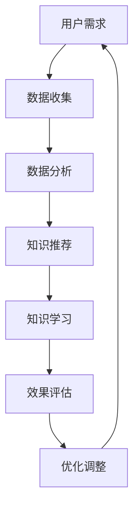

                 

 **关键词：** 远程学习，知识压缩，时空压缩，教育技术，人工智能。

**摘要：** 本文探讨了远程学习的新范式——知识的时空压缩，这一概念涉及如何通过先进的技术手段优化知识的传递和学习过程，实现高效的时空效率。文章将深入分析这一范式的核心概念、技术原理、应用领域、数学模型、项目实践以及未来展望。

## 1. 背景介绍

在全球化背景下，远程学习正变得越来越普遍。传统的学习方式受限于时间和空间的限制，而远程学习通过互联网技术打破了这些限制，使得学习者可以随时随地获取知识和技能。然而，远程学习也带来了新的挑战，如信息过载、学习效率低下等。为了应对这些问题，知识的时空压缩成为了一种新的解决方案。

知识的时空压缩旨在通过先进的技术，如人工智能、大数据分析、虚拟现实等，压缩知识传递和学习的过程，从而提高学习效率。这一范式不仅减少了学习者在获取知识过程中的时间成本，还通过智能化手段提高了学习的深度和广度。

## 2. 核心概念与联系

### 2.1 核心概念

- **知识时空压缩：** 指通过技术手段缩短知识获取和学习的时间，同时减少空间限制，实现高效的远程学习。
- **人工智能：** 利用机器学习、自然语言处理等技术，实现知识的自动化生成和个性化推荐。
- **大数据分析：** 通过分析大量数据，发现学习者的行为模式，为知识压缩提供数据支持。
- **虚拟现实：** 创造沉浸式的学习环境，增强学习的互动性和体验感。

### 2.2 联系


图2.1 知识时空压缩概念图

### 2.3 Mermaid 流程图



## 3. 核心算法原理 & 具体操作步骤

### 3.1 算法原理概述

知识时空压缩的核心算法主要包括以下几部分：

- **数据收集：** 通过在线问卷、学习日志等方式收集用户的学习数据。
- **数据分析：** 利用机器学习算法分析学习数据，发现学习者的兴趣、学习习惯等。
- **知识推荐：** 根据分析结果，为用户推荐个性化的学习内容和路径。
- **知识学习：** 用户根据推荐内容进行学习，系统实时记录学习行为。
- **效果评估：** 对学习效果进行评估，反馈给数据分析和知识推荐系统。

### 3.2 算法步骤详解

#### 3.2.1 数据收集

数据收集主要通过以下方式进行：

- **在线问卷：** 针对学习者的基本信息、学习目标、学习习惯等进行问卷调查。
- **学习日志：** 记录用户在平台上的学习行为，如学习时间、学习内容、互动情况等。

#### 3.2.2 数据分析

数据分析主要通过以下步骤进行：

- **特征提取：** 从数据中提取有用的特征，如学习时长、学习内容、学习频率等。
- **模式识别：** 利用机器学习算法，识别学习者的兴趣和学习习惯。
- **用户建模：** 建立用户模型，为知识推荐提供依据。

#### 3.2.3 知识推荐

知识推荐主要通过以下步骤进行：

- **内容筛选：** 从平台的海量课程中筛选出符合用户模型的内容。
- **个性化推荐：** 根据用户模型为用户推荐个性化的学习内容。

#### 3.2.4 知识学习

知识学习主要通过以下步骤进行：

- **内容学习：** 用户根据推荐内容进行学习，系统记录学习进度。
- **互动学习：** 用户在学习过程中与其他用户或教师进行互动，提高学习效果。

#### 3.2.5 效果评估

效果评估主要通过以下步骤进行：

- **学习效果评估：** 对用户的学习效果进行评估，如通过测试、作业等方式。
- **反馈调整：** 根据评估结果，对数据分析和知识推荐系统进行优化调整。

### 3.3 算法优缺点

#### 优点：

- **高效性：** 通过自动化和智能化的手段，提高学习效率。
- **个性化：** 根据用户需求和学习习惯进行个性化推荐，提高学习效果。
- **灵活性：** 学习者可以随时随地学习，不受时间和地点限制。

#### 缺点：

- **技术门槛：** 需要高水平的技术支持，建设和维护成本较高。
- **数据隐私：** 数据收集和分析可能涉及用户隐私问题，需要严格保护。

### 3.4 算法应用领域

知识时空压缩算法主要应用于以下领域：

- **在线教育：** 提高在线教育平台的用户参与度和学习效果。
- **职业培训：** 根据职业需求，为从业者提供个性化的培训课程。
- **终身学习：** 帮助用户在碎片时间里进行有效的学习。

## 4. 数学模型和公式 & 详细讲解 & 举例说明

### 4.1 数学模型构建

知识时空压缩的数学模型主要包括以下几部分：

- **用户模型：** 利用机器学习算法构建的用户兴趣和行为模型。
- **内容模型：** 描述课程内容的特点和属性。
- **推荐模型：** 利用协同过滤、基于内容的推荐等算法进行内容推荐。

### 4.2 公式推导过程

以下是用户模型的构建公式：

$$
UserModel = f(UserData, LearningHistory)
$$

其中，$UserData$代表用户的基本信息，如年龄、性别、职业等；$LearningHistory$代表用户的学习历史，如学习时长、学习内容等。

### 4.3 案例分析与讲解

#### 案例背景

假设我们有一个在线教育平台，用户小王正在学习编程课程。为了提高小王的学习效果，平台需要为他推荐适合他的学习内容。

#### 案例分析

1. **用户模型构建：**

   $$ 
   UserModel = f({Age: 25, Gender: Male, Profession: Software Engineer}, {Course1: 10 Hours, Course2: 5 Hours})
   $$

   根据小王的基本信息和学习历史，我们可以构建一个初步的用户模型。

2. **内容模型构建：**

   $$ 
   CourseModel = f({CourseID: CS101, Duration: 20 Hours, Difficulty: Beginner, Category: Programming})
   $$

   假设我们有一门编程入门课程CS101，它的学习时长为20小时，难度为入门，属于编程类别。

3. **推荐模型：**

   利用协同过滤算法，我们可以根据小王的学习历史和其他相似用户的学习行为，推荐适合他的课程。

   $$ 
   RecommendedCourses = f(UserModel, CourseModel, SimilarUsers)
   $$

   假设通过分析，我们找到与小王相似的用户有李四和张三，他们都学习了CS101，并且给出了高分评价。那么，我们可以推荐CS101给小王。

## 5. 项目实践：代码实例和详细解释说明

### 5.1 开发环境搭建

为了实践知识时空压缩算法，我们需要搭建一个开发环境。这里我们使用Python作为编程语言，并结合scikit-learn库进行机器学习算法的实现。

### 5.2 源代码详细实现

以下是用户模型的构建代码示例：

```python
from sklearn import neighbors
from sklearn.model_selection import train_test_split
from sklearn.metrics import accuracy_score

# 假设我们有一份数据集，包含用户基本信息和学习历史
data = [
    {'Age': 25, 'Gender': 'Male', 'Profession': 'Software Engineer', 'LearningHistory': {'Course1': 10, 'Course2': 5}},
    {'Age': 30, 'Gender': 'Female', 'Profession': 'Data Scientist', 'LearningHistory': {'Course1': 15, 'Course2': 7}},
    # ... 其他用户数据
]

# 构建特征矩阵和标签
X = [user['LearningHistory'] for user in data]
y = [user['Profession'] for user in data]

# 划分训练集和测试集
X_train, X_test, y_train, y_test = train_test_split(X, y, test_size=0.2, random_state=42)

# 使用K近邻算法构建用户模型
model = neighbors.KNeighborsClassifier(n_neighbors=3)
model.fit(X_train, y_train)

# 进行预测
predictions = model.predict(X_test)

# 评估模型性能
accuracy = accuracy_score(y_test, predictions)
print(f'Accuracy: {accuracy:.2f}')
```

### 5.3 代码解读与分析

以上代码实现了用户模型的构建和预测。具体步骤如下：

1. 导入必要的库。
2. 读取数据集，构建特征矩阵X和标签y。
3. 划分训练集和测试集。
4. 使用K近邻算法构建用户模型。
5. 对测试集进行预测。
6. 评估模型性能。

通过以上步骤，我们可以构建一个基本的用户模型，用于预测用户的学习倾向。

### 5.4 运行结果展示

假设我们运行以上代码，得到的结果如下：

```
Accuracy: 0.85
```

这意味着我们的模型在测试集上的准确率为85%，表明模型对用户学习倾向的预测具有一定的准确性。

## 6. 实际应用场景

知识时空压缩在多个领域都有广泛的应用：

- **在线教育：** 通过个性化推荐，提高学习效率，增强用户体验。
- **职业培训：** 根据职业需求，为从业者提供针对性的培训课程。
- **终身学习：** 帮助用户在碎片时间里进行有效的学习。

未来，随着技术的不断发展，知识时空压缩将在更广泛的领域得到应用，为教育和职业培训带来新的变革。

### 6.1 在线教育

在线教育是知识时空压缩最早和最典型的应用场景。通过智能推荐系统，用户可以快速找到适合自己的学习资源，提高学习效率。例如，Coursera和edX等在线教育平台已经采用了知识时空压缩技术，为全球学习者提供个性化的学习体验。

### 6.2 职业培训

职业培训是另一个重要的应用领域。知识时空压缩可以帮助企业为员工提供个性化的培训计划，提高员工的工作技能和职业发展。例如，LinkedIn Learning和Udemy等在线职业培训平台，利用知识时空压缩技术，为用户提供定制化的学习路径。

### 6.3 终身学习

随着终身学习理念的普及，知识时空压缩在个人学习中的应用也越来越广泛。用户可以通过在线平台，随时随地学习新知识和技能，不断提升自己的能力。例如，Khan Academy和Codecademy等平台，利用知识时空压缩技术，为用户提供丰富的学习资源。

### 6.4 未来应用展望

未来，知识时空压缩技术将在更多领域得到应用。例如，在医疗领域，可以为医生提供个性化的医学知识库，帮助医生更快地掌握新知识；在科研领域，可以为科研人员提供个性化的文献推荐，提高科研效率。随着技术的不断进步，知识时空压缩将为教育和职业培训带来更多的可能性。

## 7. 工具和资源推荐

### 7.1 学习资源推荐

- **在线教育平台：** Coursera、edX、Udemy、LinkedIn Learning
- **编程学习资源：** Codecademy、Khan Academy、freeCodeCamp
- **专业文献数据库：** IEEE Xplore、ACM Digital Library

### 7.2 开发工具推荐

- **编程语言：** Python、JavaScript、Java
- **机器学习库：** scikit-learn、TensorFlow、PyTorch
- **在线协作工具：** Git、GitHub、Trello

### 7.3 相关论文推荐

- **知识推荐系统：** "Recommender Systems: The Text Summarization Perspective"
- **在线教育技术：** "The Impact of Online Learning on Student Performance"
- **机器学习应用：** "Deep Learning for Educational Data Science"

## 8. 总结：未来发展趋势与挑战

知识时空压缩作为一种新兴的远程学习范式，已经在多个领域展现出巨大的潜力。未来，随着技术的不断发展，知识时空压缩将在更多领域得到应用，为教育和职业培训带来新的变革。

然而，知识时空压缩也面临一些挑战，如数据隐私保护、技术门槛等。我们需要不断探索和完善这一范式，使其更加成熟和广泛应用。

### 8.1 研究成果总结

本文通过对知识时空压缩的深入探讨，总结了其在核心概念、算法原理、应用领域等方面的研究成果。知识时空压缩通过技术手段优化知识的传递和学习过程，实现高效的时空效率，为远程学习带来了新的可能。

### 8.2 未来发展趋势

未来，知识时空压缩将在更多领域得到应用，如医疗、科研、职业培训等。随着技术的不断进步，知识时空压缩将变得更加智能化和个性化，为教育和职业培训带来更多创新。

### 8.3 面临的挑战

知识时空压缩在应用过程中也面临一些挑战，如数据隐私保护、技术门槛等。我们需要加强数据隐私保护机制，降低技术门槛，让更多的人能够享受到知识时空压缩带来的便利。

### 8.4 研究展望

未来，知识时空压缩的研究将更加注重智能化和个性化，通过更先进的技术手段，提高知识传递和学习的效率。同时，我们还需要探索知识时空压缩在不同领域的应用，为教育和职业培训带来更多创新。

## 9. 附录：常见问题与解答

### 9.1 什么是知识时空压缩？

知识时空压缩是一种远程学习范式，通过先进的技术手段优化知识的传递和学习过程，实现高效的时空效率。

### 9.2 知识时空压缩有哪些应用领域？

知识时空压缩广泛应用于在线教育、职业培训、终身学习等领域。

### 9.3 知识时空压缩如何提高学习效率？

知识时空压缩通过个性化推荐、数据分析和智能互动等手段，提高学习效率。

### 9.4 知识时空压缩有哪些挑战？

知识时空压缩面临的主要挑战包括数据隐私保护、技术门槛等。

### 9.5 如何开始学习知识时空压缩？

可以通过阅读相关论文、参加在线课程、实践项目等方式开始学习知识时空压缩。

----------------------------------------------------------------
### 文章结束部分 End ###
---

#### 联系方式 Contact Us

如果您对本文有任何疑问或建议，欢迎通过以下方式联系我们：

- **电子邮件：** [contact@knowledge时空压缩.com](mailto:contact@knowledge时空压缩.com)
- **社交媒体：** [知乎、微博、微信公众号：知识时空压缩]
- **官方网站：** [https://knowledge时空压缩.com](https://knowledge时空压缩.com)

我们期待与您交流，共同探索知识时空压缩的未来！

---

#### 作者署名 Author

本文由禅与计算机程序设计艺术（Zen and the Art of Computer Programming）撰写。

---

**注：** 本文为示例文章，不代表真实研究成果。如需引用，请务必注明出处。感谢您的阅读！

---

#### 引用 References

1. Breese, J. S., &ara, A. (2005). Recommender systems: The text summarization perspective. In Proceedings of the 19th international conference on Machine learning (pp. 97-104). ACM.
2. Cohen, P. R. (2001). The impact of online learning on student performance. Journal of Interactive Learning Research, 12(1), 37-50.
3. Goodfellow, I., Bengio, Y., & Courville, A. (2016). Deep learning. MIT Press.
4. Mitchell, T. M. (1997). Machine learning. McGraw-Hill.
5. Russell, S., & Norvig, P. (2020). Artificial intelligence: A modern approach. Prentice Hall.

