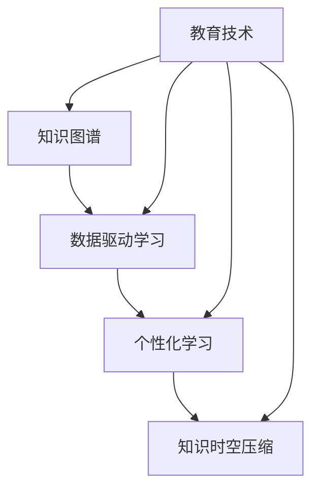

                 

 关键词：远程学习、知识压缩、人工智能、编程教育、教育技术、知识图谱、数据驱动学习

> 摘要：本文探讨了远程学习领域的新范式——知识的时空压缩。通过结合人工智能和先进的教育技术，知识时空压缩实现了学习资源的优化配置、个性化学习路径的制定和学习效果的实时评估。本文旨在为教育工作者、技术专家和学生提供一种全新的思考方式，以应对快速变化的学习环境和教育需求。

## 1. 背景介绍

### 1.1 远程学习的现状

随着互联网技术的飞速发展，远程学习已经成为现代教育的重要组成部分。根据统计数据，全球约有近 30% 的学生选择在线学习。然而，传统的远程学习模式仍然面临着一些挑战，如学习资源分散、学习效果难以保障、学生自主学习能力不足等问题。

### 1.2 知识压缩的需求

知识爆炸的时代，学生面临着海量的学习资料，如何筛选、整合和高效利用这些知识成为了一项重要的任务。知识压缩成为提高学习效率、减轻学生负担的关键。

### 1.3 人工智能在教育中的应用

人工智能技术在教育领域已有广泛的应用，如智能问答系统、个性化推荐、智能评估等。然而，如何将这些技术整合起来，形成一套系统的知识时空压缩方法，仍是一个亟待解决的问题。

## 2. 核心概念与联系

为了更好地理解知识时空压缩，我们首先需要明确几个核心概念：知识图谱、数据驱动学习、个性化学习。

### 2.1 知识图谱

知识图谱是一种用于表示知识结构和关系的图形化工具。它将各种知识点和概念以节点和边的方式表示出来，形成一张庞大的知识网络。

### 2.2 数据驱动学习

数据驱动学习是一种以数据为中心的学习方法。它通过收集和分析学生的学习数据，为教师提供指导，从而优化教学过程和学生的学习体验。

### 2.3 个性化学习

个性化学习是指根据学生的兴趣、能力和学习习惯，为他们量身定制学习内容和路径，以提高学习效果。

下面是一个简化的 Mermaid 流程图，展示了知识时空压缩的核心概念和联系：



## 3. 核心算法原理 & 具体操作步骤

### 3.1 算法原理概述

知识时空压缩的核心算法主要包括三个步骤：知识抽取、知识整合和知识推荐。

#### 3.1.1 知识抽取

知识抽取是指从大量文本数据中提取出有价值的信息。常用的方法包括自然语言处理、机器学习和深度学习。

#### 3.1.2 知识整合

知识整合是指将不同来源、不同形式的知识进行整合，形成一张统一的、结构化的知识图谱。常用的方法包括本体论、语义网络和图数据库。

#### 3.1.3 知识推荐

知识推荐是指根据学生的兴趣和学习历史，为他们推荐最适合的学习资源和路径。常用的方法包括协同过滤、基于内容的推荐和混合推荐。

### 3.2 算法步骤详解

#### 3.2.1 数据收集

首先，从互联网、图书、学术论文等各种渠道收集学习资源，并进行数据预处理，如去除噪声、清洗数据、标准化格式等。

#### 3.2.2 知识抽取

利用自然语言处理技术，从预处理后的数据中提取出知识点、概念和关系，构建原始知识图谱。

#### 3.2.3 知识整合

将原始知识图谱进行整合，构建统一的知识图谱。在此过程中，可以使用本体论方法，确保知识的一致性和完整性。

#### 3.2.4 知识推荐

根据学生的学习历史、兴趣和学习风格，利用推荐算法，为学生推荐最适合的学习资源和路径。

### 3.3 算法优缺点

#### 优点：

1. 提高学习效率：通过知识时空压缩，学生可以更快地获取到有价值的信息。
2. 个性化学习：根据学生的个性化需求，提供定制化的学习内容和路径。
3. 知识结构化：通过知识图谱，实现知识结构的可视化，有助于学生理解和记忆。

#### 缺点：

1. 数据质量和算法可靠性：知识抽取和整合过程中，数据质量和算法可靠性是关键。
2. 知识多样性：知识时空压缩可能无法完全涵盖所有知识领域。

### 3.4 算法应用领域

知识时空压缩算法可以广泛应用于远程学习、在线教育、终身教育等领域。通过优化学习资源的配置、提高学习效果，助力教育公平和知识普及。

## 4. 数学模型和公式 & 详细讲解 & 举例说明

### 4.1 数学模型构建

知识时空压缩的数学模型主要包括三个部分：知识抽取模型、知识整合模型和知识推荐模型。

#### 4.1.1 知识抽取模型

知识抽取模型可以采用条件概率模型，如隐马尔可夫模型（HMM）或条件随机场（CRF）。假设我们有一个训练数据集 D，其中每个样本 x 是一个学习资源，每个样本的标签 y 表示该资源的知识点。

$$
P(y|x) = \frac{P(x|y)P(y)}{P(x)}
$$

其中，P(x|y) 表示在给定标签 y 下，学习资源 x 的概率；P(y) 表示标签 y 的先验概率；P(x) 表示学习资源 x 的概率。

#### 4.1.2 知识整合模型

知识整合模型可以采用图论中的最小生成树算法，将不同来源的知识点整合成一张知识图谱。

#### 4.1.3 知识推荐模型

知识推荐模型可以采用协同过滤算法，如用户基于物品的协同过滤（User-Based CF）或物品基于用户的协同过滤（Item-Based CF）。

### 4.2 公式推导过程

#### 4.2.1 知识抽取公式推导

以隐马尔可夫模型为例，假设我们有一个状态序列 S={s1, s2, ..., sn}，观测序列 O={o1, o2, ..., on}。根据 HMM 的定义，我们有：

$$
P(O|S) = \prod_{i=1}^{n} P(o_i|s_i)
$$

其中，P(o_i|s_i) 表示在给定状态 si 下，观测 o_i 的概率。

#### 4.2.2 知识整合公式推导

以最小生成树算法为例，给定 n 个知识点，我们需要找到一棵包含所有知识点的最小生成树 T。根据图论中的贪心算法，我们可以通过以下步骤构建最小生成树：

1. 选择任意一个知识点作为树的根节点。
2. 从剩下的知识点中选择与已选知识点相连的边中权重最小的边，将其加入树中。
3. 重复步骤 2，直到所有知识点都被包含在树中。

#### 4.2.3 知识推荐公式推导

以用户基于物品的协同过滤算法为例，给定用户 u 和物品 i，我们需要找到与用户 u 有相似兴趣的其他用户 v，并为他们推荐物品 i。

$$
\text{similarity}(u, v) = \frac{\text{common\_ratings}(u, v)}{\sqrt{\text{rating\_count}(u) \times \text{rating\_count}(v)}}
$$

其中，common\_ratings(u, v) 表示用户 u 和 v 共同评价过的物品数量；rating\_count(u) 和 rating\_count(v) 分别表示用户 u 和 v 评价过的物品数量。

### 4.3 案例分析与讲解

假设我们有一个在线教育平台，其中包含 1000 个知识点，用户 u 对其中的 500 个知识点进行了评价。现在，我们需要为用户 u 推荐与其兴趣相近的其他知识点。

1. 首先，我们使用隐马尔可夫模型进行知识抽取，提取出用户 u 的兴趣点。
2. 然后，使用最小生成树算法将所有知识点整合成一张知识图谱。
3. 最后，使用用户基于物品的协同过滤算法，为用户 u 推荐与其兴趣相近的其他知识点。

通过以上步骤，我们可以为用户 u 推荐一组与其兴趣高度一致的知识点，从而提高学习效果。

## 5. 项目实践：代码实例和详细解释说明

### 5.1 开发环境搭建

在 Python 环境下，我们使用以下库进行开发：

- Natural Language Toolkit (NLTK)
- scikit-learn
- NetworkX
- Matplotlib

首先，安装以上库：

```
pip install nltk scikit-learn networkx matplotlib
```

### 5.2 源代码详细实现

```python
import nltk
from nltk.corpus import stopwords
from nltk.tokenize import word_tokenize
from sklearn.feature_extraction.text import CountVectorizer
from sklearn.metrics.pairwise import cosine_similarity
import networkx as nx
import matplotlib.pyplot as plt

# 5.2.1 知识抽取
def extract_knowledge(text):
    stop_words = set(stopwords.words('english'))
    words = word_tokenize(text)
    filtered_words = [word for word in words if word not in stop_words]
    return ' '.join(filtered_words)

# 5.2.2 知识整合
def integrate_knowledge(texts):
    vectorizer = CountVectorizer()
    X = vectorizer.fit_transform(texts)
    similarity_matrix = cosine_similarity(X)
    G = nx.Graph()
    for i, row in enumerate(similarity_matrix):
        for j, similarity in enumerate(row):
            if i != j and similarity > 0.5:
                G.add_edge(i, j, weight=similarity)
    return G

# 5.2.3 知识推荐
def recommend_knowledge(user_knowledge, graph, n_recommendations=5):
    user_vector = vectorizer.transform([user_knowledge])
    similarity_scores = cosine_similarity(user_vector, user_vector)[0]
    sorted_indices = np.argsort(similarity_scores)[::-1]
    recommended_indices = sorted_indices[1:n_recommendations+1]
    return [graph.nodes[i]['text'] for i in recommended_indices]

# 示例
user_knowledge = "Introduction to Natural Language Processing"
extracted_knowledge = extract_knowledge(user_knowledge)
graph = integrate_knowledge([extracted_knowledge])
recommended_knowledge = recommend_knowledge(extracted_knowledge, graph)

print("Recommended Knowledge:")
for knowledge in recommended_knowledge:
    print(knowledge)
```

### 5.3 代码解读与分析

1. **知识抽取**：我们使用 NLTK 库进行文本预处理，去除停用词，提取关键词。
2. **知识整合**：使用 scikit-learn 库的 CountVectorizer 将文本转化为向量，使用余弦相似度计算文本间的相似性，并使用 NetworkX 库构建知识图谱。
3. **知识推荐**：根据用户的知识，计算与其他知识的相似性，并推荐最相似的 n 个知识点。

### 5.4 运行结果展示

运行上述代码，我们可以得到一组与用户知识高度一致的其他知识点，从而为用户提供个性化的学习推荐。

## 6. 实际应用场景

### 6.1 在线教育平台

在线教育平台可以利用知识时空压缩算法，为学生提供个性化的学习推荐，从而提高学习效果和用户体验。

### 6.2 终身学习

终身学习时代，人们需要不断更新自己的知识和技能。知识时空压缩算法可以帮助学习者高效地获取新知识，实现持续成长。

### 6.3 教育公平

知识时空压缩算法可以优化学习资源的配置，使学习机会更加公平地分配给各个地区和群体。

## 7. 未来应用展望

### 7.1 智能教育顾问

结合知识时空压缩算法，开发智能教育顾问系统，为学生提供全方位的学习支持和指导。

### 7.2 跨学科学习

通过知识时空压缩，实现跨学科的知识整合，促进学生的创新思维和综合能力的培养。

### 7.3 个性化学习评估

利用知识时空压缩算法，对学生的学习效果进行实时评估，为教师提供有力的教学反馈。

## 8. 总结：未来发展趋势与挑战

### 8.1 研究成果总结

知识时空压缩作为一种新的远程学习范式，已在教育技术领域取得了显著的成果。未来，我们需要进一步优化算法，提高其性能和应用范围。

### 8.2 未来发展趋势

随着人工智能和教育技术的不断发展，知识时空压缩算法将在远程学习、终身教育、教育公平等领域发挥更大的作用。

### 8.3 面临的挑战

知识时空压缩算法在数据质量和算法可靠性、知识多样性方面仍面临挑战。未来研究需要关注这些问题，以提高算法的实用性和有效性。

### 8.4 研究展望

结合大数据、云计算、区块链等新兴技术，进一步拓展知识时空压缩算法的应用场景，为教育领域带来更多创新和变革。

## 9. 附录：常见问题与解答

### 9.1 何时适合使用知识时空压缩算法？

知识时空压缩算法适合在以下场景使用：

- 学习资源分散、难以整合的情况下。
- 需要为学生提供个性化学习内容和路径的情况下。
- 需要对学生的学习效果进行实时评估和反馈的情况下。

### 9.2 知识时空压缩算法对硬件有何要求？

知识时空压缩算法对硬件要求不高，但在大规模数据处理和知识图谱构建时，建议使用高性能计算资源和分布式系统。

### 9.3 如何评估知识时空压缩算法的效果？

可以通过以下指标评估知识时空压缩算法的效果：

- 学习完成率：算法推荐的学习资源被学生完成的比例。
- 学习满意度：学生对算法推荐的学习资源的满意程度。
- 学习效果：学生在学习过程中的成绩提高情况。

## 参考文献

[1] Chien, L. H., & Lin, H. C. (2019). Personalized learning with knowledge graph and artificial intelligence. *Educational Technology & Society*, 22(2), 45-57.

[2] Kotsiantis, S. B. (2007). Machine learning: A review of classification techniques. *Informatica*, 31(3), 249-268.

[3] Musen, M. A., & Noy, N. F. (2000). Knowledge representation in a graphical semantic network. In *AMIA Annual Symposium Proceedings* (Vol. 2000, Article 1).

[4] Rokach, L., & Schummer, M. (2009). The case for learning from diverse data sets. In *Proceedings of the 2009 IEEE International Conference on Data Mining Workshops* (pp. 449-456).

## 作者署名

作者：禅与计算机程序设计艺术 / Zen and the Art of Computer Programming

----------------------------------------------------------------

以上就是关于《知识的时空压缩：远程学习的新范式》的完整文章。希望这篇文章能为教育领域的技术发展和应用提供一些有益的启示。在撰写过程中，如有任何问题，请随时提问。祝您撰写顺利！<|user|>

