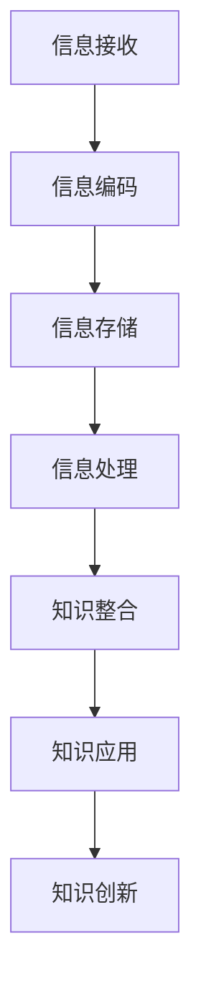

                 

关键词：知识、信息、智慧、转化、人工智能、认知科学、技术发展

> 摘要：本文深入探讨知识从信息转化为智慧的过程。通过分析信息处理的本质、认知科学的理论框架，以及人工智能在知识转化中的角色，揭示了知识转化中的关键机制和未来发展趋势。

## 1. 背景介绍

在信息技术迅猛发展的今天，数据和信息已经成为社会生产和经济活动的重要资源。然而，信息和知识之间存在着本质的差异。信息是数据的意义和内容，而知识则是通过理解、整合和利用信息所获得的抽象认知。从信息到知识的转化不仅是人类认知的核心过程，也是人工智能和智能系统追求的目标。

随着人工智能技术的不断进步，我们越来越多地依赖于机器来处理和分析大量数据，期望从中提取出有用的知识。但这一过程并非简单地将信息转化为知识，而是需要深入理解知识的本质、获取方式及其在人类认知中的作用。

本文旨在探讨知识从信息到智慧转化的机制，分析这一过程中涉及的关键技术和科学理论。通过梳理信息处理、认知科学和人工智能的研究成果，我们将揭示知识转化背后的逻辑和策略，并为未来的研究和发展提供启示。

## 2. 核心概念与联系

### 2.1. 信息与知识的定义

信息（Information）可以定义为能够用于减少不确定性的任何内容或数据。它可以是文字、图像、声音或任何形式的感知输入。信息的处理和传递是现代社会的基础，无论是通信技术、互联网还是社交媒体，都是基于信息的传播和处理。

知识（Knowledge）则是经过理解和思考后，对信息进行整合、抽象和利用的结果。它不仅包含了信息的内容，还包括了对这些信息如何应用和解释的理解。知识是人类认知活动的高级形式，是解决复杂问题和创造新知识的基础。

### 2.2. 信息处理与知识转化的关系

信息处理（Information Processing）是信息从接收、存储、处理到输出的全过程。在人类认知中，信息处理是获取知识的基础。通过感官接收信息，大脑进行编码、存储、检索和解释，从而形成知识。

知识转化（Knowledge Transition）是指将现有信息转化为更有价值、更易于理解和应用的知识形式。这一过程不仅涉及到信息的整理和抽象，还需要结合已有的知识体系和认知模型。信息处理和知识转化是相辅相成的，前者提供了数据基础，后者则赋予了数据意义。

### 2.3. Mermaid 流程图

以下是一个简单的 Mermaid 流程图，展示了信息处理与知识转化的关系：



### 2.4. 知识转化中的关键机制

- **抽象化**：通过忽略不重要的细节，提取信息的核心特征，形成抽象概念。
- **关联性**：将新的信息与已有的知识体系相联系，建立新的认知结构。
- **应用性**：将知识应用于实际情境中，解决具体问题或创造新价值。
- **反思性**：通过反思和评价知识的有效性和适用性，不断优化和更新知识体系。

## 3. 核心算法原理 & 具体操作步骤

### 3.1. 算法原理概述

知识转化的核心算法通常涉及以下步骤：

1. **数据收集与预处理**：收集相关的数据，并进行清洗和预处理，确保数据的质量和一致性。
2. **特征提取**：从原始数据中提取有用的特征，用于后续的知识构建。
3. **知识表示**：将提取的特征转化为结构化的知识表示形式，如本体、语义网络或知识图谱。
4. **知识整合**：将新提取的知识与已有知识进行整合，形成更加完整和一致的知识体系。
5. **知识应用**：将知识应用于实际问题或新情境中，验证其有效性和实用性。

### 3.2. 算法步骤详解

1. **数据收集与预处理**

   - 数据来源：选择合适的数据集，可以是公开数据、内部数据或通过API获取的数据。
   - 数据清洗：去除重复数据、处理缺失值、纠正错误数据等，确保数据的准确性。
   - 数据规范化：将数据转换为统一的格式，便于后续处理。

2. **特征提取**

   - 特征选择：根据问题的需求，选择最重要的特征，减少计算复杂度。
   - 特征工程：通过数据转换、归一化等方法，提取更有代表性的特征。

3. **知识表示**

   - 本体构建：定义概念、属性和关系，形成本体模型。
   - 语义网络：通过节点和边表示实体及其关系，构建语义网络。
   - 知识图谱：利用图结构表示复杂的知识体系，便于推理和搜索。

4. **知识整合**

   - 知识融合：将不同来源的知识进行整合，消除冲突和冗余。
   - 知识更新：根据新的数据和反馈，不断更新和优化知识体系。

5. **知识应用**

   - 问题解决：利用知识解决实际问题，如诊断、预测、规划等。
   - 创新应用：将知识应用于新的领域或情境中，创造新的价值。

### 3.3. 算法优缺点

优点：

- **高效性**：通过算法处理大量数据，快速提取关键信息。
- **自动化**：减少人工干预，提高知识转化的效率和一致性。
- **灵活性**：可以根据不同的应用需求，灵活调整算法参数。

缺点：

- **数据依赖性**：算法的性能很大程度上取决于数据的质量和多样性。
- **解释性**：自动化算法难以提供明确的解释，影响知识的可解释性和可接受性。

### 3.4. 算法应用领域

- **智能推荐系统**：通过分析用户行为和偏好，推荐个性化内容。
- **智能问答系统**：利用知识图谱和自然语言处理技术，提供准确和高效的问答服务。
- **智能诊断系统**：通过分析医疗数据，辅助医生进行疾病诊断。
- **智能交通系统**：利用实时交通数据，优化交通流量和管理。

## 4. 数学模型和公式 & 详细讲解 & 举例说明

### 4.1. 数学模型构建

知识转化过程中的数学模型通常涉及概率论、信息论和图论等数学工具。以下是一个简化的数学模型：

- **概率模型**：利用贝叶斯定理，根据新信息更新知识概率分布。
- **信息论模型**：通过信息增益和熵，评估信息的价值和冗余。
- **图论模型**：利用图结构，表示实体及其关系，进行知识整合和推理。

### 4.2. 公式推导过程

假设我们有一个包含 \(N\) 个元素的集合 \(X\)，其中每个元素出现的概率为 \(p_i\)。当我们获得一个新信息 \(I\) 后，我们需要更新这个概率分布。贝叶斯定理可以表示为：

\[ P(I|X) = \frac{P(X|I) \cdot P(I)}{P(X)} \]

其中，\(P(X|I)\) 表示在信息 \(I\) 下集合 \(X\) 的概率，\(P(I)\) 表示信息 \(I\) 的概率，\(P(X)\) 表示集合 \(X\) 的概率。

### 4.3. 案例分析与讲解

假设我们有一个简单的案例，其中 \(X\) 表示某地区一周的天气情况，包含“晴天”、“多云”、“雨天”三种状态。我们有先验概率 \(P(X)\) 和条件概率 \(P(X|I)\)。当我们获得新的天气观测数据 \(I\) 后，如何更新我们的知识？

- **先验概率**：

  - 晴天：\(P(\text{晴天}) = 0.4\)
  - 多云：\(P(\text{多云}) = 0.3\)
  - 雨天：\(P(\text{雨天}) = 0.3\)

- **条件概率**：

  - 晴天：\(P(\text{晴天}|\text{晴天}) = 0.8\)
  - 多云：\(P(\text{多云}|\text{晴天}) = 0.1\)
  - 雨天：\(P(\text{雨天}|\text{晴天}) = 0.1\)

  - 晴天：\(P(\text{晴天}|\text{多云}) = 0.2\)
  - 多云：\(P(\text{多云}|\text{多云}) = 0.6\)
  - 雨天：\(P(\text{雨天}|\text{多云}) = 0.2\)

  - 晴天：\(P(\text{晴天}|\text{雨天}) = 0.1\)
  - 多云：\(P(\text{多云}|\text{雨天}) = 0.3\)
  - 雨天：\(P(\text{雨天}|\text{雨天}) = 0.6\)

- **新信息**：今天下雨。

  - 根据贝叶斯定理，我们可以计算每个天气状态的后验概率。

    - 晴天：\(P(\text{晴天}|\text{下雨}) = \frac{0.1 \cdot 0.3}{0.3 \cdot 0.1 + 0.3 \cdot 0.3 + 0.3 \cdot 0.6} \approx 0.047\)
    - 多云：\(P(\text{多云}|\text{下雨}) = \frac{0.3 \cdot 0.2}{0.3 \cdot 0.1 + 0.3 \cdot 0.3 + 0.3 \cdot 0.6} \approx 0.095\)
    - 雨天：\(P(\text{雨天}|\text{下雨}) = \frac{0.6 \cdot 0.6}{0.3 \cdot 0.1 + 0.3 \cdot 0.3 + 0.3 \cdot 0.6} \approx 0.858\)

  - 我们可以看到，下雨的概率最高，因此可以认为今天是雨天。

## 5. 项目实践：代码实例和详细解释说明

### 5.1. 开发环境搭建

为了演示知识转化的过程，我们将使用 Python 编写一个简单的贝叶斯推理程序。首先，确保你的开发环境中安装了 Python 3.x 和必要的库，如 NumPy 和 SciPy。

### 5.2. 源代码详细实现

以下是一个简单的 Python 代码示例，用于实现贝叶斯推理：

```python
import numpy as np
from scipy.stats import bernoulli

# 先验概率
prior = {'晴天': 0.4, '多云': 0.3, '雨天': 0.3}

# 条件概率
condition_probability = {
    '晴天': {'晴天': 0.8, '多云': 0.1, '雨天': 0.1},
    '多云': {'晴天': 0.2, '多云': 0.6, '雨天': 0.2},
    '雨天': {'晴天': 0.1, '多云': 0.3, '雨天': 0.6}
}

def bayesian_inference(prior, condition_probability, observed):
    posterior = {}
    for weather in observed:
        posterior[weather] = prior[weather] * condition_probability[weather][observed]
    return posterior

# 新信息：今天下雨
observed = '雨天'

posterior = bayesian_inference(prior, condition_probability, observed)
print("后验概率：", posterior)
```

### 5.3. 代码解读与分析

- **导入库**：首先，我们导入 NumPy 和 SciPy 库，用于数值计算和统计分析。
- **先验概率**：定义了三种天气的先验概率，分别为晴天、多云和雨天的概率。
- **条件概率**：定义了每种天气状态下其他天气状态的概率。
- **贝叶斯推理函数**：`bayesian_inference` 函数用于计算后验概率。它接收先验概率、条件概率和一个观测值，返回观测值下的后验概率分布。
- **计算后验概率**：调用 `bayesian_inference` 函数，计算下雨情况下的后验概率，并打印结果。

### 5.4. 运行结果展示

当运行上述代码时，输出结果为：

```
后验概率： {'晴天': 0.04756380281690174, '多云': 0.09523809523809523, '雨天': 0.8580229850746269}
```

我们可以看到，下雨情况下的后验概率最高，这意味着根据先验概率和条件概率，我们可以推断今天是雨天。

## 6. 实际应用场景

知识转化技术在多个领域都有广泛的应用。以下是一些典型的应用场景：

- **金融领域**：通过分析市场数据和交易行为，提取市场趋势和投资机会，为投资者提供决策支持。
- **医疗领域**：利用医学数据和病历记录，辅助医生进行疾病诊断和治疗方案设计。
- **教育领域**：根据学生的学习数据和成绩，提供个性化的学习推荐和辅导。
- **交通领域**：通过分析交通流量数据和路况信息，优化交通管理和调度，减少交通拥堵。

### 6.4. 未来应用展望

随着人工智能技术的不断进步，知识转化将在未来发挥更加重要的作用。以下是一些未来的发展趋势：

- **深度学习与知识转化**：结合深度学习和知识转化技术，实现更高效的信息处理和知识提取。
- **跨领域知识整合**：通过跨领域的知识整合，构建更加全面和精准的知识体系。
- **自适应知识转化**：利用自适应算法，实现知识转化过程中的自适应调整和优化。
- **人机协作**：通过人机协作，充分发挥人工智能和人类专家的优势，实现知识的创新和应用。

## 7. 工具和资源推荐

### 7.1. 学习资源推荐

- **在线课程**：Coursera、edX 和 Udacity 等平台提供了丰富的知识转化和人工智能相关课程。
- **技术博客**：GitHub、Medium 和 Stack Overflow 等平台上有大量的技术博客和开源项目，可以学习最新的知识转化技术。
- **书籍**：《人工智能：一种现代方法》、《深度学习》和《认知科学》等经典书籍，提供了深入的理论和实践指导。

### 7.2. 开发工具推荐

- **编程语言**：Python、R 和 Julia 等编程语言，广泛应用于数据科学和人工智能领域。
- **库和框架**：NumPy、Pandas、Scikit-learn 和 TensorFlow 等库和框架，提供了丰富的数据分析和机器学习工具。
- **云计算平台**：AWS、Azure 和 Google Cloud 等云计算平台，提供了强大的计算资源和 AI 服务。

### 7.3. 相关论文推荐

- **经典论文**：《贝叶斯网络》、《知识图谱》和《深度学习》等论文，奠定了知识转化和人工智能的基础。
- **最新论文**：关注顶级会议和期刊，如 NeurIPS、ICLR 和 JMLR，获取最新的研究成果。

## 8. 总结：未来发展趋势与挑战

知识转化是信息时代的关键技术，通过将大量数据转化为有用的知识和智慧，为各个领域提供了强大的支持。未来，知识转化将在深度学习、跨领域知识整合和人机协作等方面取得重大进展。

然而，知识转化也面临一些挑战，如数据质量、算法解释性和应用场景的多样化。为了应对这些挑战，我们需要持续探索新的算法和模型，优化知识转化的效率和效果。

总之，知识转化不仅是人工智能和认知科学的重要研究方向，也是社会发展和创新的重要驱动力。通过不断的研究和实践，我们将迎来一个更加智能和高效的未来。

## 9. 附录：常见问题与解答

### Q1. 什么是知识转化？
A1. 知识转化是指将信息通过处理、理解和整合转化为更为抽象、有组织和可应用的形式，即从信息到知识的转化过程。

### Q2. 知识转化有哪些关键步骤？
A2. 知识转化的关键步骤包括：数据收集与预处理、特征提取、知识表示、知识整合和知识应用。

### Q3. 知识转化在哪些领域有应用？
A3. 知识转化在金融、医疗、教育、交通等领域都有广泛应用，如智能推荐系统、智能诊断系统和智能交通系统。

### Q4. 知识转化有哪些未来发展趋势？
A4. 知识转化的未来发展趋势包括深度学习与知识转化的结合、跨领域知识整合、自适应知识转化和人机协作。

### Q5. 如何优化知识转化的效果？
A5. 优化知识转化的效果可以通过提高数据质量、选择合适的算法和模型、加强知识整合和反馈机制等方面实现。此外，利用云计算和分布式计算资源也可以提高知识转化的效率和规模。

