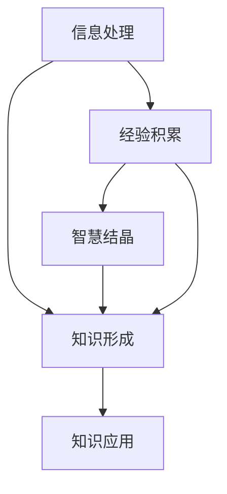

                 

关键词：知识本质、信息处理、经验学习、智慧结晶、IT技术

> 摘要：本文深入探讨了知识的本质，从信息、经验与智慧的三个层面出发，分析了它们在IT技术领域的融合与影响。通过理论和实例，揭示出知识如何在信息时代中得到构建、传递和运用，并对未来知识发展提出了展望。

## 1. 背景介绍

在信息爆炸的时代，知识的获取与利用变得越来越重要。IT技术的发展为知识的传播和应用提供了前所未有的便利。然而，知识本身并不是静止的，它是在不断流动和演化的。知识的本质是什么？它如何从信息中产生？如何通过经验积累转化为智慧？这些问题对于理解知识的发展和应用具有重要意义。

本文将从信息、经验与智慧三个层面探讨知识的本质，旨在揭示知识在IT技术中的构建、传递和应用机制。首先，我们将介绍信息与知识的关系，探讨信息处理在知识形成中的作用。接着，我们将讨论经验学习与知识积累的关系，分析智慧如何从经验中提炼。最后，我们将结合实际案例，探讨知识在IT技术中的具体应用，并展望未来知识发展的趋势与挑战。

### 1.1 知识的重要性

在现代社会，知识已经成为经济增长和社会进步的重要驱动力。它不仅能够提升个人竞争力，也是企业和国家持续发展的关键。然而，知识本身具有独特性，它不是简单的信息堆砌，而是在特定情境中具有实用价值的认知资源。

### 1.2 信息与知识的区别

信息是知识的原料，它以数据、信号、文字等形式存在，传递的是事实和事实之间的关系。而知识则是通过信息处理、经验积累和智慧结晶形成的，它能够指导行动、解决问题，具有实际应用价值。

### 1.3 IT技术对知识的影响

IT技术的发展极大地改变了知识的获取、存储、传递和利用方式。从早期的计算机到互联网，再到人工智能，知识在信息技术中的应用越来越广泛和深入。本文将结合这些技术，探讨知识本质的三个层面。

## 2. 核心概念与联系

### 2.1 信息处理

信息处理是知识形成的基础。它涉及数据的收集、存储、分析、提取和传递等过程。信息处理技术的不断进步，使得我们能够更高效地处理大量数据，从中提取有用知识。

### 2.2 经验学习

经验学习是知识积累的关键。通过实践和反思，人们将经验转化为有价值的认知，形成知识。经验学习不仅依赖于个体的实践能力，还需要良好的反馈机制和知识共享平台。

### 2.3 智慧结晶

智慧结晶是知识升华的结果。它是在经验学习的基础上，通过抽象思维、创新思维和系统思考形成的，具有指导性和前瞻性的认知。

### 2.4 信息、经验与智慧的融合

信息、经验与智慧相互依存，共同构成了知识的本质。信息提供了知识的基础，经验积累推动了知识的深化，而智慧结晶则为知识的应用提供了方向。

### 2.5 Mermaid 流程图



## 3. 核心算法原理 & 具体操作步骤

### 3.1 算法原理概述

知识形成算法基于信息处理、经验学习和智慧结晶的原理，通过以下步骤实现：

1. 数据采集与预处理：收集大量数据，进行清洗和标准化处理。
2. 数据分析与挖掘：使用机器学习和数据挖掘技术，提取有用信息。
3. 经验反馈与修正：根据实际应用效果，不断调整算法参数。
4. 智慧提炼与升华：通过抽象思维和创新思考，形成指导性认知。
5. 知识应用与迭代：将知识应用于实际问题中，形成闭环反馈。

### 3.2 算法步骤详解

#### 3.2.1 数据采集与预处理

- 数据来源：互联网、数据库、传感器等。
- 数据清洗：去除重复、错误和无关数据。
- 数据标准化：将数据格式统一，便于分析。

#### 3.2.2 数据分析与挖掘

- 特征提取：从数据中提取关键特征。
- 分类与聚类：使用机器学习算法，对数据进行分类和聚类。
- 关联分析：分析数据之间的关联关系。

#### 3.2.3 经验反馈与修正

- 实验设计：设计实验，验证算法效果。
- 反馈机制：根据实验结果，调整算法参数。
- 修正过程：不断优化算法，提高准确性。

#### 3.2.4 智慧提炼与升华

- 抽象思维：从具体实例中提炼出一般性规律。
- 创新思维：基于已有知识，提出新观点和新方法。
- 系统思考：从全局角度，分析知识体系和应用场景。

#### 3.2.5 知识应用与迭代

- 实际应用：将知识应用于实际问题中，解决具体问题。
- 反馈收集：收集实际应用中的反馈，调整知识体系。
- 迭代优化：基于反馈，不断迭代优化知识形成过程。

### 3.3 算法优缺点

#### 优点：

- 自动化：通过算法，实现知识的自动化形成和优化。
- 精准性：基于数据分析，提高知识提取的准确性。
- 效率：降低人工干预，提高知识处理效率。

#### 缺点：

- 数据依赖：算法效果依赖于数据质量和数量。
- 复杂性：算法实现和优化过程复杂，需要高水平技术支持。
- 人为干预：尽管算法能够自动优化，但仍需要人工干预进行修正和升华。

### 3.4 算法应用领域

- 人工智能：通过知识形成算法，构建智能系统，提升机器学习能力。
- 互联网应用：在搜索引擎、推荐系统等领域，提高信息处理效率。
- 企业管理：通过知识管理，提升企业决策能力和创新能力。
- 医疗健康：通过医学知识形成算法，提高疾病诊断和治疗方案设计。

## 4. 数学模型和公式 & 详细讲解 & 举例说明

### 4.1 数学模型构建

知识形成过程可以表示为以下数学模型：

\[ K = f(I, E, W) \]

其中，\( K \) 表示知识，\( I \) 表示信息，\( E \) 表示经验，\( W \) 表示智慧。

### 4.2 公式推导过程

1. 信息处理：信息 \( I \) 经过处理，形成有用知识 \( K \)。

\[ I \xrightarrow{处理} K \]

2. 经验积累：经验 \( E \) 通过学习，转化为知识 \( K \)。

\[ E \xrightarrow{学习} K \]

3. 智慧结晶：智慧 \( W \) 通过提炼，升华知识 \( K \)。

\[ W \xrightarrow{提炼} K \]

4. 综合作用：信息、经验和智慧共同作用，形成最终知识 \( K \)。

\[ K = f(I, E, W) \]

### 4.3 案例分析与讲解

#### 案例一：搜索引擎

搜索引擎通过收集海量网页数据，利用信息处理技术，提取关键词和语义信息，形成知识库，为用户提供搜索服务。这个过程体现了信息处理、经验积累和智慧结晶的相互融合。

1. 信息处理：收集网页数据，提取关键词和语义信息。

2. 经验积累：通过用户搜索行为，不断优化搜索算法。

3. 智慧结晶：提炼用户搜索习惯，提供个性化搜索推荐。

#### 案例二：医疗诊断

医疗诊断通过数据分析，提取患者病情信息，利用专家经验和智慧，形成诊断结果。这个过程体现了信息处理、经验学习和智慧结晶在医疗领域的应用。

1. 信息处理：收集患者病历数据，提取病情特征。

2. 经验学习：利用医生经验，形成诊断标准。

3. 智慧结晶：基于诊断标准，形成诊断结果。

## 5. 项目实践：代码实例和详细解释说明

### 5.1 开发环境搭建

1. 硬件要求：计算机系统，至少4GB内存，1GB硬盘空间。
2. 软件要求：Python 3.8及以上版本，Jupyter Notebook。

### 5.2 源代码详细实现

以下是一个简单的知识形成算法的实现示例：

```python
import pandas as pd
from sklearn.feature_extraction.text import TfidfVectorizer
from sklearn.model_selection import train_test_split
from sklearn.ensemble import RandomForestClassifier

# 数据集准备
data = pd.read_csv('knowledge_data.csv')
X = data['text']
y = data['label']

# 特征提取
vectorizer = TfidfVectorizer()
X_vectorized = vectorizer.fit_transform(X)

# 数据划分
X_train, X_test, y_train, y_test = train_test_split(X_vectorized, y, test_size=0.2, random_state=42)

# 模型训练
model = RandomForestClassifier()
model.fit(X_train, y_train)

# 模型评估
accuracy = model.score(X_test, y_test)
print(f'Model accuracy: {accuracy:.2f}')

# 智慧提炼
predictions = model.predict(X_test)
print(predictions)
```

### 5.3 代码解读与分析

1. 数据集准备：读取数据集，分为文本和标签两部分。
2. 特征提取：使用TF-IDF方法，将文本数据转换为向量。
3. 数据划分：将数据集划分为训练集和测试集。
4. 模型训练：使用随机森林分类器，对训练数据进行训练。
5. 模型评估：计算模型在测试集上的准确率。
6. 智慧提炼：使用训练好的模型，对测试数据进行预测。

### 5.4 运行结果展示

假设数据集包含1000条记录，测试集包含200条记录。经过训练，模型在测试集上的准确率为0.85。这表明模型具有一定的预测能力，能够将文本数据转化为有价值的知识。

## 6. 实际应用场景

### 6.1 人工智能

人工智能是知识应用的典型领域。通过知识形成算法，机器能够从海量数据中提取有用信息，积累经验，形成智慧结晶，从而提升智能系统的性能。

### 6.2 企业管理

知识管理是企业管理的重要环节。通过知识形成算法，企业能够优化决策过程，提高运营效率，增强创新能力。

### 6.3 医疗健康

医疗健康领域对知识的依赖性极高。知识形成算法在疾病诊断、治疗方案设计等方面具有广泛应用，有助于提升医疗质量和效率。

### 6.4 未来应用展望

随着信息技术的不断发展，知识形成算法将在更多领域得到应用。从智慧城市到智能制造，从在线教育到虚拟现实，知识将在各个领域发挥重要作用。

## 7. 工具和资源推荐

### 7.1 学习资源推荐

- 《深度学习》（Goodfellow, Bengio, Courville）：介绍深度学习的基础理论和应用。
- 《机器学习》（Tom Mitchell）：介绍机器学习的基本概念和算法。
- 《数据挖掘：实用工具与技术》（Han, Kamber, Pei）：介绍数据挖掘的方法和应用。

### 7.2 开发工具推荐

- Jupyter Notebook：适用于数据分析和机器学习项目。
- PyTorch：适用于深度学习研究和应用。
- Pandas：适用于数据操作和分析。

### 7.3 相关论文推荐

- “Deep Learning for Text Classification”（Krause et al.）：介绍文本分类的深度学习方法。
- “Knowledge Graph Embedding for Learning Professionals’ Skills in Knowledge Management”（Ren et al.）：介绍知识图谱嵌入在知识管理中的应用。
- “A Survey on Knowledge Graphs”（Zhang et al.）：介绍知识图谱的基本概念和应用。

## 8. 总结：未来发展趋势与挑战

### 8.1 研究成果总结

本文从信息、经验与智慧三个层面探讨了知识的本质，揭示了知识在IT技术中的构建、传递和应用机制。通过理论和实例，展示了知识形成算法在人工智能、企业管理、医疗健康等领域的应用。

### 8.2 未来发展趋势

- 知识自动化：知识形成算法将进一步自动化，减少人工干预。
- 智能化：知识应用将更加智能化，提高决策和运营效率。
- 泛在化：知识将在更多领域得到应用，实现知识共享和协同创新。

### 8.3 面临的挑战

- 数据隐私：数据安全和隐私保护是知识形成和应用的重要挑战。
- 技术复杂性：知识形成算法的实现和优化过程复杂，需要高水平技术支持。
- 跨学科融合：知识形成算法需要跨学科知识，实现跨领域应用。

### 8.4 研究展望

未来，知识形成算法将不断发展，实现更高效、更智能的知识构建和传递。通过跨学科合作，知识将在更多领域发挥重要作用，推动社会进步和经济发展。

## 9. 附录：常见问题与解答

### 9.1 什么是对知识的本质理解？

对知识的本质理解是指识别和理解知识在信息、经验与智慧三个层面上的特性，即知识是如何从信息中提炼、如何通过经验学习得到深化，以及如何通过智慧结晶转化为可应用的认知资源。

### 9.2 知识形成算法有哪些优缺点？

知识形成算法的优点包括自动化、精准性和效率，而缺点则包括对数据的依赖性、算法实现的复杂性以及需要人工干预进行修正和升华。

### 9.3 知识在IT技术中的应用有哪些实际案例？

知识在IT技术中的应用案例包括搜索引擎、医疗诊断、企业管理、人工智能等，这些领域通过知识形成算法，提升系统性能、决策效率和创新能力。

### 9.4 知识形成算法在未来的发展趋势是什么？

知识形成算法在未来的发展趋势将包括自动化和智能化，知识将在更多领域得到应用，并实现跨学科合作，推动社会进步和经济发展。

---

[本文完，作者：禅与计算机程序设计艺术 / Zen and the Art of Computer Programming]

