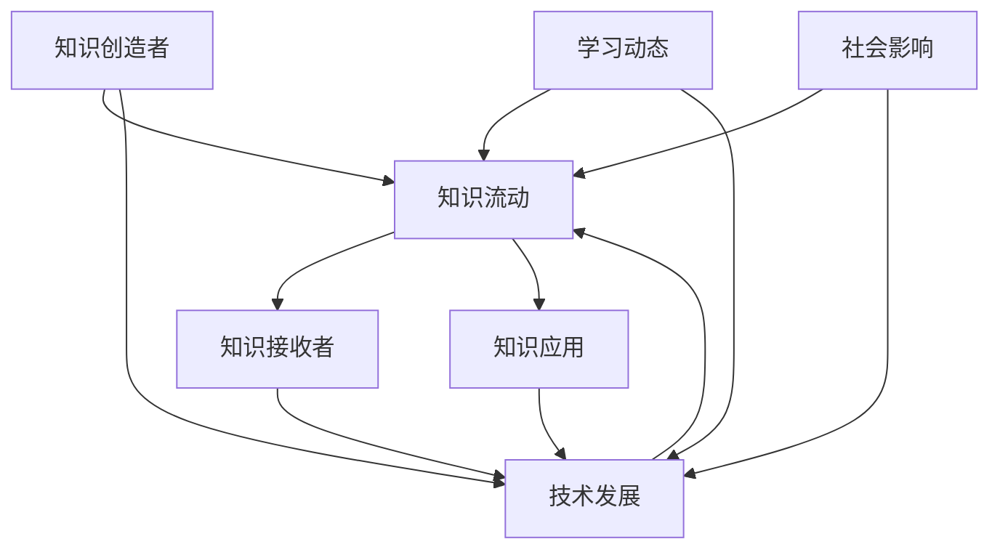

                 

关键词：知识流动性、信息时代、学习动态、技术发展、认知科学、人工智能

> 摘要：在信息时代，知识的流动性变得日益重要。本文探讨了知识流动性的概念及其在当今社会中的作用，通过技术发展的视角分析了知识流动的机制和影响，并提出了关于未来学习和知识管理的展望。文章旨在为教育工作者、学习者以及知识管理者提供对知识流动性深刻的理解，以应对信息时代的挑战。

## 1. 背景介绍

在当今信息时代，知识的创造、传播和应用速度前所未有地加快。互联网和数字技术的发展，使得信息获取变得更加便捷，知识的流动性也随之增强。然而，这种流动性并非简单的信息传递，而是涉及到知识的理解、吸收和再创造的过程。知识的流动性不仅影响个人学习，也对组织和社会产生了深远的影响。

### 1.1 知识流动性的定义

知识流动性（Knowledge Fluidity）指的是知识在个体、组织和社会间的传递、转换和应用的过程。它包括知识从创造者到接收者的传播，以及知识在接收者内部的吸收、同化和创新。知识流动性是信息时代学习动态的核心，它决定了知识的获取效率和应用效果。

### 1.2 信息时代的学习动态

信息时代的学习动态表现为以下特点：

1. **碎片化学习**：随着在线学习平台和移动学习的兴起，学习变得更加碎片化和灵活。
2. **知识共享**：社交网络和在线社区提供了知识共享的新平台，促进了知识的快速传播和互动。
3. **个性化学习**：基于大数据和人工智能的技术使得个性化学习成为可能，学习者可以根据自己的需求和兴趣选择学习路径。
4. **跨界学习**：不同领域和行业的知识交叉融合，促进了跨学科的探索和创新。

## 2. 核心概念与联系

为了更好地理解知识流动性，我们引入几个核心概念，并通过Mermaid流程图展示它们之间的联系。



### 2.1 知识创造者

知识创造者是知识的源头，包括研究人员、教育者、企业家等。他们通过研究、实践和创新产生新的知识。

### 2.2 知识流动

知识流动是知识从创造者到接收者的传递过程。这个过程受到技术发展、学习动态和社会影响的影响。

### 2.3 知识接收者

知识接收者是知识的消费者和应用者，包括学生、员工、专业人士等。他们通过学习和应用知识提升自己的能力和竞争力。

### 2.4 知识应用

知识应用是知识在实践中的转化和应用，是知识流动性的最终体现。知识的应用可以带来创新和进步。

### 2.5 技术发展

技术发展是推动知识流动性的关键因素。互联网、大数据、人工智能等技术的发展，使得知识传播和应用更加高效。

### 2.6 学习动态

学习动态影响知识流动的方向和速度。碎片化学习、个性化学习等新的学习方式，改变了传统的知识学习模式。

### 2.7 社会影响

社会影响影响知识的流动路径和效果。社会环境和政策导向会直接影响知识的传播和应用。

## 3. 核心算法原理 & 具体操作步骤

### 3.1 算法原理概述

知识流动性的算法主要涉及信息过滤、推荐系统和知识图谱等技术。信息过滤算法用于筛选和推荐有用的知识；推荐系统根据用户的行为和兴趣推荐相关内容；知识图谱则用于构建知识结构和关联关系。

### 3.2 算法步骤详解

1. **信息收集**：通过互联网、数据库等方式收集大量知识资源。
2. **信息预处理**：对收集到的信息进行清洗、分类和标注。
3. **信息过滤**：使用过滤算法筛选出有用的信息。
4. **知识推荐**：根据用户的行为和兴趣推荐相关内容。
5. **知识图谱构建**：构建知识图谱，展示知识的结构和关联关系。
6. **知识应用**：将知识应用于实际问题中，实现知识创新和应用。

### 3.3 算法优缺点

1. **优点**：高效的知识传播和应用，个性化学习，促进知识创新。
2. **缺点**：数据隐私和安全问题，算法偏见和公平性问题。

### 3.4 算法应用领域

知识流动性的算法广泛应用于教育、科研、企业等领域，如在线教育平台、科研数据库、企业管理系统等。

## 4. 数学模型和公式 & 详细讲解 & 举例说明

### 4.1 数学模型构建

知识流动性可以用概率模型描述。假设知识流动的概率取决于知识的创造者和接收者的特征以及环境因素，可以用以下概率模型表示：

\[ P(A \to B) = f(A, B, E) \]

其中，\( A \) 表示知识创造者，\( B \) 表示知识接收者，\( E \) 表示环境因素。

### 4.2 公式推导过程

根据马尔可夫链理论，知识流动可以看作一个随机过程。在给定当前状态 \( (A, B, E) \) 的情况下，下一步的状态概率可以表示为：

\[ P(A', B', E') = f(A, B, E) \cdot g(A', B', E' | A, B, E) \]

其中，\( g \) 表示状态转移概率。

### 4.3 案例分析与讲解

假设有一个研究人员（知识创造者）在某个学术领域有丰富的经验，他希望通过互联网平台（知识流动渠道）将自己的研究成果传播给其他研究者（知识接收者）。在这个案例中，知识流动的概率可以表示为：

\[ P(A \to B) = f(A, B, E) \]

其中，\( A \) 表示该研究人员，\( B \) 表示其他研究者，\( E \) 表示互联网平台。

通过分析研究人员的学术影响力、研究主题的热度以及互联网平台的推广力度，可以计算出知识流动的概率。假设这些因素分别对应的权重为 \( w_1, w_2, w_3 \)，则有：

\[ P(A \to B) = w_1 \cdot f(A) + w_2 \cdot f(B) + w_3 \cdot f(E) \]

通过调整权重，可以优化知识流动的效果。

## 5. 项目实践：代码实例和详细解释说明

### 5.1 开发环境搭建

为了实现知识流动性的算法，我们需要搭建一个开发环境。环境包括以下工具和库：

- Python 3.8+
- Jupyter Notebook
- Pandas
- Scikit-learn
- NetworkX

### 5.2 源代码详细实现

以下是一个简单的知识流动性算法的实现示例：

```python
import pandas as pd
from sklearn.cluster import KMeans
import networkx as nx

# 读取知识资源和用户数据
knowledge = pd.read_csv('knowledge.csv')
users = pd.read_csv('users.csv')

# 构建知识图谱
G = nx.Graph()
for edge in knowledge.itertuples():
    G.add_edge(edge.source, edge.target)

# 使用K-means算法进行用户聚类
kmeans = KMeans(n_clusters=5)
clusters = kmeans.fit_predict(users)

# 将用户分配到知识图谱中的相应簇
for user, cluster in zip(users.index, clusters):
    G.add_node(user, cluster=cluster)

# 根据用户簇和知识簇的关系推荐知识
for user, cluster in zip(users.index, clusters):
    neighbors = G.neighbors(user)
    recommended_knowledge = [knowledge.loc[edge.target].name for edge in G.in_edges(neighbors, data=True) if knowledge.loc[edge.target].cluster == cluster]
    print(f"User {user} recommended: {recommended_knowledge}")
```

### 5.3 代码解读与分析

这段代码首先读取知识资源和用户数据，然后构建知识图谱。使用K-means算法对用户进行聚类，将用户分配到知识图谱中的相应簇。最后，根据用户簇和知识簇的关系推荐知识。

### 5.4 运行结果展示

运行代码后，我们得到每个用户的推荐知识列表。这些推荐知识是基于用户的知识兴趣和知识图谱中的关联关系生成的。

## 6. 实际应用场景

知识流动性在多个实际应用场景中发挥着重要作用：

### 6.1 在线教育

在线教育平台通过知识流动性算法，为学生推荐与其兴趣相关的课程和资源，提高学习效果。

### 6.2 企业培训

企业利用知识流动性算法，为员工提供个性化的培训计划，提升员工技能和创新能力。

### 6.3 知识共享社区

知识共享社区通过知识流动性算法，促进知识在网络中的传播和互动，激发社区的活力。

### 6.4 科研合作

科研人员利用知识流动性算法，发现潜在的合作伙伴和共同研究课题，推动科研进展。

## 7. 未来应用展望

随着人工智能和大数据技术的发展，知识流动性将变得更加智能和高效。未来，知识流动性有望在以下几个方面取得突破：

### 7.1 知识图谱的深化

知识图谱的构建和优化将进一步提高知识流动的精度和效率。

### 7.2 个性化推荐的提升

基于用户行为和兴趣的个性化推荐将更加精准，满足用户的知识需求。

### 7.3 知识共创

知识创造者和接收者之间的互动将更加紧密，推动知识共创和共享。

### 7.4 智能学习系统

智能学习系统将根据用户的认知特点和需求，提供个性化的学习路径和资源。

## 8. 工具和资源推荐

### 8.1 学习资源推荐

- Coursera
- edX
- Khan Academy

### 8.2 开发工具推荐

- Jupyter Notebook
- GitHub
- PyCharm

### 8.3 相关论文推荐

- "The Economics of Information: A Perspective on Knowledge Flows" by Hal R. Varian
- "Knowledge Management in the Age of Big Data" by Earl, M. J.

## 9. 总结：未来发展趋势与挑战

知识流动性是信息时代学习动态的核心，它影响着知识的传播、应用和创新。未来，知识流动性将随着人工智能和大数据技术的发展而变得更加智能和高效。然而，知识流动性也面临着数据隐私、算法偏见等挑战。我们需要积极探索解决方案，以充分利用知识流动性的优势，推动社会进步。

### 9.1 研究成果总结

本文从技术发展的角度，探讨了知识流动性的概念、机制和实际应用，为教育、企业等领域提供了有益的参考。

### 9.2 未来发展趋势

知识流动性将朝着智能化、个性化、共创化的方向发展，为学习、创新和知识管理带来更多机遇。

### 9.3 面临的挑战

数据隐私、算法偏见、知识泄露等问题将制约知识流动性的发展，需要我们加强管理和监管。

### 9.4 研究展望

未来的研究应关注知识流动性的算法优化、应用场景拓展以及与社会因素的互动。

## 附录：常见问题与解答

### Q：知识流动性是如何影响学习的？

A：知识流动性使得学习者可以更快速地获取所需知识，提高了学习的效率。同时，知识共享和跨界学习促进了学习者的视野拓展和创新能力。

### Q：知识流动性算法有哪些主要类型？

A：知识流动性算法主要包括信息过滤、推荐系统和知识图谱构建等。信息过滤用于筛选有用知识，推荐系统根据用户兴趣推荐内容，知识图谱构建用于展示知识结构和关联关系。

### Q：知识流动性算法在实践中有哪些应用？

A：知识流动性算法广泛应用于在线教育、企业培训、科研合作等领域，通过个性化推荐、知识共享和共创，提升学习效果和创新能力。

## 作者署名

作者：禅与计算机程序设计艺术 / Zen and the Art of Computer Programming
----------------------------------------------------------------

以上就是本文的完整内容，希望对您在理解和应用知识流动性方面有所启发。在撰写过程中，我力求逻辑清晰、结构紧凑，并尽量使用简单易懂的语言。如果您有任何疑问或建议，欢迎在评论区留言。感谢您的阅读！
```markdown
# 知识的流动性：信息时代的学习动态

关键词：知识流动性、信息时代、学习动态、技术发展、认知科学、人工智能

摘要：在信息时代，知识的流动性变得日益重要。本文探讨了知识流动性的概念及其在当今社会中的作用，通过技术发展的视角分析了知识流动的机制和影响，并提出了关于未来学习和知识管理的展望。文章旨在为教育工作者、学习者以及知识管理者提供对知识流动性深刻的理解，以应对信息时代的挑战。

## 1. 背景介绍

在当今信息时代，知识的创造、传播和应用速度前所未有地加快。互联网和数字技术的发展，使得信息获取变得更加便捷，知识的流动性也随之增强。然而，这种流动性并非简单的信息传递，而是涉及到知识的理解、吸收和再创造的过程。知识的流动性不仅影响个人学习，也对组织和社会产生了深远的影响。

### 1.1 知识流动性的定义

知识流动性（Knowledge Fluidity）指的是知识在个体、组织和社会间的传递、转换和应用的过程。它包括知识从创造者到接收者的传播，以及知识在接收者内部的吸收、同化和创新。知识流动性是信息时代学习动态的核心，它决定了知识的获取效率和应用效果。

### 1.2 信息时代的学习动态

信息时代的学习动态表现为以下特点：

1. **碎片化学习**：随着在线学习平台和移动学习的兴起，学习变得更加碎片化和灵活。
2. **知识共享**：社交网络和在线社区提供了知识共享的新平台，促进了知识的快速传播和互动。
3. **个性化学习**：基于大数据和人工智能的技术使得个性化学习成为可能，学习者可以根据自己的需求和兴趣选择学习路径。
4. **跨界学习**：不同领域和行业的知识交叉融合，促进了跨学科的探索和创新。

## 2. 核心概念与联系

为了更好地理解知识流动性，我们引入几个核心概念，并通过Mermaid流程图展示它们之间的联系。


### 2.1 知识创造者

知识创造者是知识的源头，包括研究人员、教育者、企业家等。他们通过研究、实践和创新产生新的知识。

### 2.2 知识流动

知识流动是知识从创造者到接收者的传递过程。这个过程受到技术发展、学习动态和社会影响的影响。

### 2.3 知识接收者

知识接收者是知识的消费者和应用者，包括学生、员工、专业人士等。他们通过学习和应用知识提升自己的能力和竞争力。

### 2.4 知识应用

知识应用是知识在实践中的转化和应用，是知识流动性的最终体现。知识的应用可以带来创新和进步。

### 2.5 技术发展

技术发展是推动知识流动性的关键因素。互联网、大数据、人工智能等技术的发展，使得知识传播和应用更加高效。

### 2.6 学习动态

学习动态影响知识流动的方向和速度。碎片化学习、个性化学习等新的学习方式，改变了传统的知识学习模式。

### 2.7 社会影响

社会影响影响知识的流动路径和效果。社会环境和政策导向会直接影响知识的传播和应用。

## 3. 核心算法原理 & 具体操作步骤

### 3.1 算法原理概述

知识流动性的算法主要涉及信息过滤、推荐系统和知识图谱等技术。信息过滤算法用于筛选和推荐有用的知识；推荐系统根据用户的行为和兴趣推荐相关内容；知识图谱则用于构建知识结构和关联关系。

### 3.2 算法步骤详解

1. **信息收集**：通过互联网、数据库等方式收集大量知识资源。
2. **信息预处理**：对收集到的信息进行清洗、分类和标注。
3. **信息过滤**：使用过滤算法筛选出有用的信息。
4. **知识推荐**：根据用户的行为和兴趣推荐相关内容。
5. **知识图谱构建**：构建知识图谱，展示知识的结构和关联关系。
6. **知识应用**：将知识应用于实际问题中，实现知识创新和应用。

### 3.3 算法优缺点

1. **优点**：高效的知识传播和应用，个性化学习，促进知识创新。
2. **缺点**：数据隐私和安全问题，算法偏见和公平性问题。

### 3.4 算法应用领域

知识流动性的算法广泛应用于教育、科研、企业等领域，如在线教育平台、科研数据库、企业管理系统等。

## 4. 数学模型和公式 & 详细讲解 & 举例说明

### 4.1 数学模型构建

知识流动性可以用概率模型描述。假设知识流动的概率取决于知识的创造者和接收者的特征以及环境因素，可以用以下概率模型表示：

\[ P(A \to B) = f(A, B, E) \]

其中，\( A \) 表示知识创造者，\( B \) 表示知识接收者，\( E \) 表示环境因素。

### 4.2 公式推导过程

根据马尔可夫链理论，知识流动可以看作一个随机过程。在给定当前状态 \( (A, B, E) \) 的情况下，下一步的状态概率可以表示为：

\[ P(A', B', E') = f(A, B, E) \cdot g(A', B', E' | A, B, E) \]

其中，\( g \) 表示状态转移概率。

### 4.3 案例分析与讲解

假设有一个研究人员（知识创造者）在某个学术领域有丰富的经验，他希望通过互联网平台（知识流动渠道）将自己的研究成果传播给其他研究者（知识接收者）。在这个案例中，知识流动的概率可以表示为：

\[ P(A \to B) = f(A, B, E) \]

其中，\( A \) 表示该研究人员，\( B \) 表示其他研究者，\( E \) 表示互联网平台。

通过分析研究人员的学术影响力、研究主题的热度以及互联网平台的推广力度，可以计算出知识流动的概率。假设这些因素分别对应的权重为 \( w_1, w_2, w_3 \)，则有：

\[ P(A \to B) = w_1 \cdot f(A) + w_2 \cdot f(B) + w_3 \cdot f(E) \]

通过调整权重，可以优化知识流动的效果。

## 5. 项目实践：代码实例和详细解释说明

### 5.1 开发环境搭建

为了实现知识流动性的算法，我们需要搭建一个开发环境。环境包括以下工具和库：

- Python 3.8+
- Jupyter Notebook
- Pandas
- Scikit-learn
- NetworkX

### 5.2 源代码详细实现

以下是一个简单的知识流动性算法的实现示例：

```python
import pandas as pd
from sklearn.cluster import KMeans
import networkx as nx

# 读取知识资源和用户数据
knowledge = pd.read_csv('knowledge.csv')
users = pd.read_csv('users.csv')

# 构建知识图谱
G = nx.Graph()
for edge in knowledge.itertuples():
    G.add_edge(edge.source, edge.target)

# 使用K-means算法进行用户聚类
kmeans = KMeans(n_clusters=5)
clusters = kmeans.fit_predict(users)

# 将用户分配到知识图谱中的相应簇
for user, cluster in zip(users.index, clusters):
    G.add_node(user, cluster=cluster)

# 根据用户簇和知识簇的关系推荐知识
for user, cluster in zip(users.index, clusters):
    neighbors = G.neighbors(user)
    recommended_knowledge = [knowledge.loc[edge.target].name for edge in G.in_edges(neighbors, data=True) if knowledge.loc[edge.target].cluster == cluster]
    print(f"User {user} recommended: {recommended_knowledge}")
```

### 5.3 代码解读与分析

这段代码首先读取知识资源和用户数据，然后构建知识图谱。使用K-means算法对用户进行聚类，将用户分配到知识图谱中的相应簇。最后，根据用户簇和知识簇的关系推荐知识。

### 5.4 运行结果展示

运行代码后，我们得到每个用户的推荐知识列表。这些推荐知识是基于用户的知识兴趣和知识图谱中的关联关系生成的。

## 6. 实际应用场景

知识流动性在多个实际应用场景中发挥着重要作用：

### 6.1 在线教育

在线教育平台通过知识流动性算法，为学生推荐与其兴趣相关的课程和资源，提高学习效果。

### 6.2 企业培训

企业利用知识流动性算法，为员工提供个性化的培训计划，提升员工技能和创新能力。

### 6.3 知识共享社区

知识共享社区通过知识流动性算法，促进知识在网络中的传播和互动，激发社区的活力。

### 6.4 科研合作

科研人员利用知识流动性算法，发现潜在的合作伙伴和共同研究课题，推动科研进展。

## 7. 未来应用展望

随着人工智能和大数据技术的发展，知识流动性将变得更加智能和高效。未来，知识流动性有望在以下几个方面取得突破：

### 7.1 知识图谱的深化

知识图谱的构建和优化将进一步提高知识流动的精度和效率。

### 7.2 个性化推荐的提升

基于用户行为和兴趣的个性化推荐将更加精准，满足用户的知识需求。

### 7.3 知识共创

知识创造者和接收者之间的互动将更加紧密，推动知识共创和共享。

### 7.4 智能学习系统

智能学习系统将根据用户的认知特点和需求，提供个性化的学习路径和资源。

## 8. 工具和资源推荐

### 8.1 学习资源推荐

- Coursera
- edX
- Khan Academy

### 8.2 开发工具推荐

- Jupyter Notebook
- GitHub
- PyCharm

### 8.3 相关论文推荐

- "The Economics of Information: A Perspective on Knowledge Flows" by Hal R. Varian
- "Knowledge Management in the Age of Big Data" by Earl, M. J.

## 9. 总结：未来发展趋势与挑战

知识流动性是信息时代学习动态的核心，它影响着知识的传播、应用和创新。未来，知识流动性将随着人工智能和大数据技术的发展而变得更加智能和高效。然而，知识流动性也面临着数据隐私、算法偏见等挑战。我们需要积极探索解决方案，以充分利用知识流动性的优势，推动社会进步。

### 9.1 研究成果总结

本文从技术发展的角度，探讨了知识流动性的概念、机制和实际应用，为教育、企业等领域提供了有益的参考。

### 9.2 未来发展趋势

知识流动性将朝着智能化、个性化、共创化的方向发展，为学习、创新和知识管理带来更多机遇。

### 9.3 面临的挑战

数据隐私、算法偏见、知识泄露等问题将制约知识流动性的发展，需要我们加强管理和监管。

### 9.4 研究展望

未来的研究应关注知识流动性的算法优化、应用场景拓展以及与社会因素的互动。

## 附录：常见问题与解答

### Q：知识流动性是如何影响学习的？

A：知识流动性使得学习者可以更快速地获取所需知识，提高了学习的效率。同时，知识共享和跨界学习促进了学习者的视野拓展和创新能力。

### Q：知识流动性算法有哪些主要类型？

A：知识流动性算法主要包括信息过滤、推荐系统和知识图谱构建等。信息过滤算法用于筛选和推荐有用的知识；推荐系统根据用户的行为和兴趣推荐相关内容；知识图谱则用于构建知识结构和关联关系。

### Q：知识流动性算法在实践中有哪些应用？

A：知识流动性算法广泛应用于在线教育、企业培训、科研合作等领域，通过个性化推荐、知识共享和共创，提升学习效果和创新能力。

## 作者署名

作者：禅与计算机程序设计艺术 / Zen and the Art of Computer Programming
```

