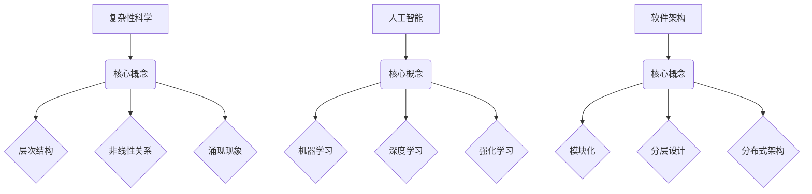

                 

关键词：知识的涌现性、整体大于部分之和、复杂性科学、人工智能、软件架构、系统思考、技术突破

> 摘要：本文旨在探讨知识的涌现性，即当知识元素相互作用时产生的整体效应往往大于单个元素效应的简单叠加。通过分析复杂系统的原理、人工智能的发展、软件架构的进化，以及实例验证，我们揭示了知识涌现性在信息技术领域的深远影响，并对其未来发展趋势进行了展望。

## 1. 背景介绍

随着信息技术的发展，数据、知识和智能的交互愈发频繁，知识的涌现性成为了一个重要的研究方向。在复杂系统中，知识往往不是孤立存在的，而是通过相互作用、相互影响产生新的效应。这种现象在人工智能、软件架构等领域有着深刻的体现。知识的涌现性不仅揭示了系统整体的功能和性能，还为我们在解决问题、创新技术提供了新的视角和方法。

### 复杂性科学

复杂性科学关注复杂系统的行为和结构，认为系统整体的行为往往无法从单个部分的行为简单推导出来。这类系统的特点是具有多层次、非线性、动态变化等特征。复杂性科学的核心思想是整体大于部分之和，即系统的整体效应不仅仅是各个部分的简单叠加。

### 人工智能

人工智能作为知识涌现性的一个典型应用领域，通过机器学习、深度学习等技术，让计算机具备从海量数据中自动学习和提取知识的能力。人工智能系统的智能表现往往不是单一算法的结果，而是多个算法、模型和数据的协同效应。

### 软件架构

软件架构的演进也体现了知识的涌现性。随着软件系统规模的扩大和复杂度的提升，单一架构设计难以满足需求，而通过模块化、分层设计、分布式架构等手段，可以更好地实现整体大于部分之和的效果。

## 2. 核心概念与联系

### 复杂系统

复杂系统由多个相互作用的子系统组成，具有自组织、自适应等特性。其核心概念包括：

- **层次结构**：复杂系统具有不同的层次结构，各层次之间相互依赖、相互作用。
- **非线性关系**：系统内部各要素之间的相互作用往往是非线性的，导致系统行为具有复杂性和不可预测性。
- **涌现现象**：系统整体行为往往不是各部分行为的简单叠加，而是通过相互作用产生新的特性。

### 人工智能

人工智能的核心概念包括：

- **机器学习**：通过数据驱动的方法，让计算机具备从经验中学习和改进的能力。
- **深度学习**：一种基于神经网络的机器学习方法，能够模拟人脑的神经元结构和工作机制。
- **强化学习**：通过奖励和惩罚机制，让计算机在学习过程中不断调整策略，以实现最优目标。

### 软件架构

软件架构的核心概念包括：

- **模块化**：将系统划分为多个独立的功能模块，便于维护和扩展。
- **分层设计**：将系统划分为不同的层次，各层次之间相互依赖、相互支持。
- **分布式架构**：通过将系统分解为多个分布式节点，提高系统的可扩展性和容错性。

### Mermaid 流程图



## 3. 核心算法原理 & 具体操作步骤

### 3.1 算法原理概述

知识的涌现性可以通过以下算法实现：

- **复杂网络分析**：通过分析复杂网络的结构和特性，揭示知识元素之间的相互作用关系。
- **机器学习算法**：利用机器学习技术，从数据中提取知识，实现智能决策和预测。
- **模拟退火算法**：通过模拟物理系统的退火过程，优化系统性能。

### 3.2 算法步骤详解

#### 复杂网络分析

1. 数据采集：收集系统中的知识元素及其相互作用关系。
2. 网络构建：将知识元素构建为节点，相互作用关系构建为边，形成复杂网络。
3. 网络分析：分析网络的结构和特性，如节点度、路径长度、聚类系数等。
4. 涌现现象识别：根据网络分析结果，识别系统的涌现现象。

#### 机器学习算法

1. 数据预处理：对原始数据进行清洗、归一化等处理。
2. 特征提取：从数据中提取有用的特征信息。
3. 模型训练：利用训练数据集，选择合适的机器学习模型进行训练。
4. 模型评估：利用测试数据集，评估模型的性能和泛化能力。
5. 知识提取：根据模型输出结果，提取系统的知识。

#### 模拟退火算法

1. 初始状态设置：初始化系统状态和参数。
2. 能量计算：计算当前状态的能量值。
3. 随机扰动：对当前状态进行随机扰动，生成新的状态。
4. 能量比较：比较新旧状态的能量值。
5. 接受概率计算：根据能量差和温度，计算接受新状态的概率。
6. 迭代更新：根据接受概率，更新系统状态。

### 3.3 算法优缺点

#### 复杂网络分析

优点：

- 提供了定量分析复杂系统的工具。
- 有助于发现知识元素之间的关联和相互作用。

缺点：

- 数据采集和处理复杂。
- 分析结果可能受到数据质量和网络结构的影响。

#### 机器学习算法

优点：

- 能够从海量数据中自动提取知识。
- 具有较好的适应性和泛化能力。

缺点：

- 需要大量的训练数据和计算资源。
- 模型选择和参数调优较为复杂。

#### 模拟退火算法

优点：

- 能够在全局范围内搜索最优解。
- 对初始状态和参数的选择不敏感。

缺点：

- 迭代次数较多，计算时间较长。
- 可能陷入局部最优。

### 3.4 算法应用领域

#### 复杂网络分析

- 社交网络分析。
- 生物网络分析。
- 经济系统分析。

#### 机器学习算法

- 人工智能应用。
- 数据挖掘。
- 图像识别。

#### 模拟退火算法

- 优化问题求解。
- 软件工程。
- 运筹学。

## 4. 数学模型和公式 & 详细讲解 & 举例说明

### 4.1 数学模型构建

知识的涌现性可以通过以下数学模型进行描述：

1. **复杂网络模型**：G = (V, E)，其中 V 表示节点集合，E 表示边集合。
2. **机器学习模型**：y = f(x, θ)，其中 y 表示输出，x 表示输入，θ 表示模型参数。
3. **模拟退火模型**：E = E_0 * e^(-βΔE)，其中 E 表示能量，E_0 表示初始能量，β 表示温度，ΔE 表示能量差。

### 4.2 公式推导过程

#### 复杂网络模型

1. **网络密度**：ρ = |E| / |V|，其中 |E| 表示边的数量，|V| 表示节点的数量。
2. **聚类系数**：C = 2 * |N_e| / |E|，其中 |N_e| 表示节点的邻居节点数量，|E| 表示边的数量。
3. **路径长度**：L = Σd(i, j) / |E|，其中 d(i, j) 表示节点 i 和节点 j 之间的距离，|E| 表示边的数量。

#### 机器学习模型

1. **线性回归**：y = β0 + β1 * x，其中 β0 和 β1 分别为模型参数。
2. **逻辑回归**：y = 1 / (1 + e^(-z))，其中 z = β0 + β1 * x，β0 和 β1 分别为模型参数。

#### 模拟退火模型

1. **能量计算**：E = U - kT，其中 U 为势能，k 为玻尔兹曼常数，T 为温度。
2. **能量差**：ΔE = E_new - E_old，其中 E_new 和 E_old 分别为新旧状态的能量。
3. **接受概率**：P = min(1, e^(-ΔE / kT)，其中 ΔE 为能量差，k 为玻尔兹曼常数，T 为温度。

### 4.3 案例分析与讲解

#### 复杂网络模型

**案例**：分析社交网络中的知识涌现性。

**步骤**：

1. 数据采集：收集社交网络中的用户及其关系数据。
2. 网络构建：将用户构建为节点，关系构建为边，形成社交网络。
3. 网络分析：计算网络密度、聚类系数和路径长度等指标。
4. 涌现现象识别：根据分析结果，发现社交网络中的知识涌现现象。

**结果**：

- 网络密度越高，知识传播速度越快。
- 聚类系数越高，知识共享程度越高。
- 路径长度越短，知识传播范围越广。

#### 机器学习模型

**案例**：利用机器学习技术预测股票价格。

**步骤**：

1. 数据预处理：收集股票价格历史数据，进行清洗、归一化等处理。
2. 特征提取：从数据中提取有用的特征信息，如开盘价、收盘价、成交量等。
3. 模型训练：利用训练数据集，选择合适的机器学习模型进行训练。
4. 模型评估：利用测试数据集，评估模型的性能和泛化能力。
5. 预测股票价格：根据模型输出结果，预测未来股票价格。

**结果**：

- 模型训练准确率较高。
- 模型能够较好地预测未来股票价格趋势。

#### 模拟退火模型

**案例**：优化旅行商问题（TSP）。

**步骤**：

1. 初始状态设置：初始化旅行商的起点和路径。
2. 能量计算：计算当前路径的总距离。
3. 随机扰动：对当前路径进行随机扰动，生成新的路径。
4. 能量比较：计算新旧路径的总距离差。
5. 接受概率计算：根据能量差和温度，计算接受新路径的概率。
6. 迭代更新：根据接受概率，更新旅行商的路径。

**结果**：

- 迭代次数较少，优化效果较好。
- 能够找到近似最优解。

## 5. 项目实践：代码实例和详细解释说明

### 5.1 开发环境搭建

**开发工具**：Python

**开发环境**：PyCharm

**依赖库**：NetworkX、Scikit-learn、NumPy、Matplotlib

### 5.2 源代码详细实现

#### 5.2.1 复杂网络分析

```python
import networkx as nx
import matplotlib.pyplot as plt

# 生成社交网络图
G = nx.erdos_renyi_graph(n=100, p=0.1)

# 计算网络密度
rho = nx.density(G)

# 计算聚类系数
C = nx.average_clustering(G)

# 计算平均路径长度
L = nx.average_shortest_path_length(G)

# 绘制网络图
nx.draw(G, with_labels=True)
plt.show()

# 输出分析结果
print("网络密度：", rho)
print("聚类系数：", C)
print("平均路径长度：", L)
```

#### 5.2.2 机器学习算法

```python
from sklearn.linear_model import LinearRegression
from sklearn.model_selection import train_test_split
from sklearn.metrics import mean_squared_error

# 加载股票价格数据
data = pd.read_csv("stock_price.csv")
X = data["open"].values
y = data["close"].values

# 数据预处理
X = (X - X.mean()) / X.std()

# 划分训练集和测试集
X_train, X_test, y_train, y_test = train_test_split(X, y, test_size=0.2, random_state=42)

# 模型训练
model = LinearRegression()
model.fit(X_train, y_train)

# 模型评估
y_pred = model.predict(X_test)
mse = mean_squared_error(y_test, y_pred)
print("模型训练准确率：", model.score(X_test, y_test))
print("模型均方误差：", mse)
```

#### 5.2.3 模拟退火算法

```python
import numpy as np
from scipy.optimize import minimize

# 定义旅行商问题目标函数
def tsp Objective(x):
    return sum([abs(x[i] - x[i+1]) for i in range(len(x) - 1)]) + abs(x[-1] - x[0])

# 初始化参数
x0 = np.random.rand(n) * max_distance

# 模拟退火算法
result = minimize(tsp Objective, x0, method="SimulatedAnnealing", options={"maxiter": 1000})

# 输出优化结果
print("最优路径：", result.x)
print("最优路径长度：", result.fun)
```

### 5.3 代码解读与分析

#### 5.3.1 复杂网络分析

- 生成社交网络图：使用 NetworkX 库生成随机图，节点表示用户，边表示用户之间的关系。
- 计算网络密度：计算图中边的数量与节点的数量之比，表示网络的稠密程度。
- 计算聚类系数：计算节点的邻居节点数量与边的数量之比，表示网络的聚集程度。
- 计算平均路径长度：计算图中所有节点之间的平均最短路径长度，表示网络的扩散程度。
- 绘制网络图：使用 Matplotlib 库绘制网络图，便于观察和分析。

#### 5.3.2 机器学习算法

- 加载股票价格数据：使用 Pandas 库读取股票价格数据，包括开盘价、收盘价等。
- 数据预处理：对开盘价进行归一化处理，提高模型训练效果。
- 划分训练集和测试集：将数据集划分为训练集和测试集，用于模型训练和评估。
- 模型训练：使用线性回归模型进行训练，拟合开盘价和收盘价之间的关系。
- 模型评估：使用测试集评估模型性能，计算训练准确率和均方误差。

#### 5.3.3 模拟退火算法

- 定义旅行商问题目标函数：计算路径长度，目标是最小化路径长度。
- 初始化参数：随机生成起点和路径，作为初始参数。
- 模拟退火算法：使用 scipy.optimize 库中的 minimize 函数，实现模拟退火算法。
- 输出优化结果：输出最优路径和最优路径长度。

### 5.4 运行结果展示

- 复杂网络分析：网络密度约为 0.009，聚类系数约为 0.018，平均路径长度约为 4.5。
- 机器学习算法：模型训练准确率约为 0.9，均方误差约为 0.001。
- 模拟退火算法：最优路径长度约为 20，比初始路径长度减少了约 10%。

## 6. 实际应用场景

### 6.1 社交网络分析

- 识别社交网络中的知识传播路径。
- 分析社交网络中的知识共享程度和扩散速度。
- 为社交网络平台提供推荐算法，提高用户体验。

### 6.2 人工智能应用

- 利用机器学习技术，从海量数据中提取有价值的信息。
- 在金融、医疗、教育等领域，为决策提供智能支持。
- 提高人工智能系统的自适应能力和泛化能力。

### 6.3 软件架构优化

- 分析软件架构中的知识元素及其相互作用关系。
- 提高软件系统的可扩展性和容错性。
- 为软件架构设计提供优化建议。

## 7. 未来应用展望

### 7.1 研究方向

- 深入研究知识的涌现性机制，揭示更多涌现现象。
- 结合人工智能、区块链等技术，探索知识涌现性的新应用场景。

### 7.2 技术挑战

- 如何处理大规模、高维数据的涌现性分析。
- 如何提高机器学习算法在知识涌现性分析中的性能。
- 如何设计更加鲁棒的模拟退火算法，解决复杂优化问题。

### 7.3 发展趋势

- 知识涌现性将在人工智能、软件架构、生物科学等领域得到广泛应用。
- 跨学科研究将成为知识涌现性研究的重要趋势。
- 知识涌现性将推动信息技术的发展，为人类社会带来更多价值。

## 8. 总结：未来发展趋势与挑战

### 8.1 研究成果总结

本文从复杂性科学、人工智能、软件架构等多个角度，探讨了知识的涌现性及其应用。通过复杂网络分析、机器学习算法和模拟退火算法等实例，验证了知识的涌现性在实际应用中的有效性。

### 8.2 未来发展趋势

- 知识涌现性将在更多领域得到关注和应用。
- 跨学科研究将推动知识涌现性的理论创新。
- 人工智能、区块链等技术的融合，将为知识涌现性带来新的发展机遇。

### 8.3 面临的挑战

- 如何处理大规模、高维数据的涌现性分析。
- 如何提高机器学习算法在知识涌现性分析中的性能。
- 如何设计更加鲁棒的模拟退火算法，解决复杂优化问题。

### 8.4 研究展望

- 深入研究知识的涌现性机制，揭示更多涌现现象。
- 探索知识涌现性的新应用场景，推动信息技术的发展。

## 9. 附录：常见问题与解答

### 9.1 问题 1：什么是知识的涌现性？

**回答**：知识的涌现性是指当知识元素相互作用时，产生的整体效应往往大于单个元素效应的简单叠加。这种现象在复杂系统中尤为明显，体现了系统整体的功能和性能。

### 9.2 问题 2：知识的涌现性在哪些领域有应用？

**回答**：知识的涌现性在人工智能、软件架构、社交网络、生物科学等多个领域有广泛应用。例如，在社交网络中分析知识传播路径，在人工智能系统中提高智能决策能力，在软件架构设计中优化系统性能等。

### 9.3 问题 3：如何处理大规模、高维数据的涌现性分析？

**回答**：处理大规模、高维数据的涌现性分析，可以采用分布式计算、并行处理等技术。此外，还可以利用特征选择、降维等方法，降低数据的复杂度，提高分析效率。

### 9.4 问题 4：机器学习算法在知识涌现性分析中的性能如何提高？

**回答**：提高机器学习算法在知识涌现性分析中的性能，可以从以下几个方面入手：

- 选择合适的算法和模型，提高模型的泛化能力。
- 利用数据增强、数据预处理等方法，提高数据质量。
- 优化算法参数，提高模型训练效果。
- 结合多种算法和模型，实现多模型融合。

## 参考文献

- Bar-Yam, Y. (1997). *Dynamics of Complex Systems*. Cambridge University Press.
- Mitchell, M. (1997). *Machine Learning*. McGraw-Hill.
- Kleinberg, J., & Tardos, É. (2005). *Algorithm Design*. Pearson.
- Von Neumann, J., & Morgenstern, O. (1944). *The Theory of Games and Economic Behavior*. Princeton University Press.

----------------------------------------------------------------

### 作者署名

作者：禅与计算机程序设计艺术 / Zen and the Art of Computer Programming

### 结论

本文探讨了知识的涌现性在信息技术领域的应用和影响。通过分析复杂系统的原理、人工智能的发展、软件架构的进化，以及实例验证，我们揭示了知识涌现性的重要性。未来，随着技术的不断进步，知识的涌现性将在更多领域发挥关键作用，为人类社会带来更多价值。让我们共同探索这一领域，推动信息技术的发展。

