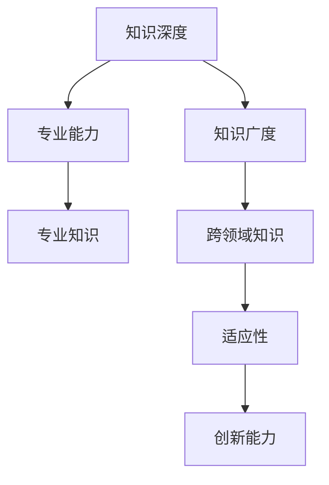
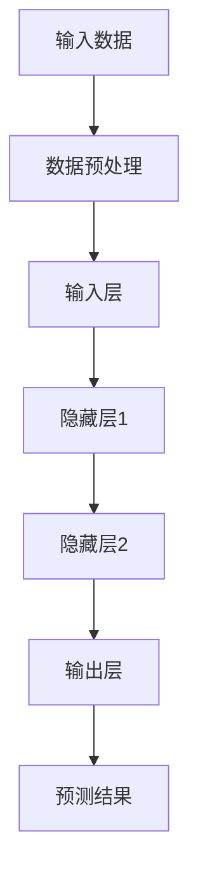

                 

关键词：专才与通才、知识深度、知识广度、人工智能、程序员、软件开发、技术趋势

摘要：本文旨在探讨在信息技术领域，专才与通才之间的平衡问题。通过对知识深度和广度的分析，本文试图为程序员和软件开发人员提供关于如何在不同阶段有效分配时间和精力以实现职业发展的建议。

## 1. 背景介绍

在当今快速发展的信息技术时代，程序员和软件开发人员面临着知识更新迅速、技术变革频繁的挑战。为了在这个竞争激烈的环境中脱颖而出，许多人开始思考如何在自己的职业生涯中达到知识的深度和广度之间的平衡。所谓知识的深度，是指对某一技术或领域的深入了解和掌握；而知识的广度，则是指对多个技术或领域的了解和掌握。如何在两者之间找到一个平衡点，是每个技术人员都需要面对的重要问题。

### 知识深度与广度的定义

- **知识深度**：通常指在某一特定领域内，对相关理论、原理、算法和技术细节的深入理解和掌握。深度意味着专业，可以让我们成为某个领域的专家。
- **知识广度**：则指的是在多个不同领域或技术的了解和掌握。广度意味着全面，可以让我们适应不同的工作环境和技术挑战。

### 专才与通才的区分

- **专才**：专注于某一特定领域，对其有深入的了解和掌握，通常具有较高的专业能力和专业知识。
- **通才**：对多个领域都有一定了解和掌握，但并不深入，通常具有广泛的知识和技能。

## 2. 核心概念与联系

为了更好地理解知识深度和广度之间的关系，我们首先需要了解一些核心概念和它们之间的联系。以下是一个使用Mermaid绘制的流程图，展示了这些概念之间的关系。



### 知识深度

知识深度主要体现在以下几个方面：

1. **理论基础**：对某一领域的理论基础有深入的了解，能够灵活运用。
2. **算法和实现**：对相关算法有深刻的理解和实践经验，能够解决复杂的问题。
3. **技术细节**：了解技术的底层实现，能够进行优化和改进。

### 知识广度

知识广度主要体现在以下几个方面：

1. **跨领域知识**：对多个领域都有基本的了解，能够将这些知识相互结合，产生新的创新。
2. **技术趋势**：了解当前技术趋势和发展方向，能够把握未来发展的机会。
3. **软技能**：如沟通能力、团队协作能力等，这些能力对于跨领域的项目尤为重要。

### 专才与通才的关系

- **专才**：通常在某一领域内具备深厚的专业知识和技术能力，但可能在其他领域较为薄弱。
- **通才**：则在多个领域都有一定的了解和掌握，但在任何领域都不够深入。

通过这个流程图，我们可以看到知识深度和广度之间的相互关系，以及它们如何影响一个技术人员的专业能力和创新能力。

## 3. 核心算法原理 & 具体操作步骤

### 3.1 算法原理概述

在本节中，我们将探讨如何通过深度学习算法来提高知识的深度和广度。深度学习是一种机器学习方法，它通过多层神经网络模型来模拟人脑的决策过程。以下是一个简化的深度学习算法流程图。



### 3.2 算法步骤详解

1. **数据预处理**：首先，我们需要对输入数据（如图像、文本或数值数据）进行预处理，以便它们可以用于训练模型。这包括数据清洗、归一化和特征提取等步骤。

2. **输入层**：预处理后的数据作为输入层，传递给下一层。

3. **隐藏层**：输入层将数据传递给隐藏层，隐藏层通过激活函数（如ReLU、Sigmoid或Tanh）对数据进行非线性变换，从而提取特征。

4. **输出层**：隐藏层将特征传递给输出层，输出层生成最终的预测结果。

5. **损失函数**：通过计算损失函数（如均方误差MSE、交叉熵误差CE等）来评估预测结果与真实结果的差距。

6. **反向传播**：利用反向传播算法，将误差反向传播到每个隐藏层，并更新每个神经元的权重。

7. **迭代训练**：重复上述步骤，直到模型收敛或达到预设的训练次数。

### 3.3 算法优缺点

**优点**：

- **强大的特征提取能力**：深度学习算法能够自动提取复杂的数据特征，从而提高模型的准确性和效率。
- **适应性强**：深度学习算法能够适应多种类型的数据和任务，具有广泛的应用场景。
- **可扩展性**：通过增加网络层数和神经元数量，可以不断提高模型的复杂度和性能。

**缺点**：

- **计算资源需求高**：深度学习算法通常需要大量的计算资源和时间，尤其是对于大规模数据集和复杂的网络结构。
- **数据依赖性强**：深度学习算法的性能很大程度上取决于数据的质量和数量，数据不足或数据质量差可能导致模型性能下降。

### 3.4 算法应用领域

深度学习算法在多个领域都有广泛的应用，包括但不限于：

- **计算机视觉**：如图像分类、目标检测、人脸识别等。
- **自然语言处理**：如文本分类、情感分析、机器翻译等。
- **语音识别**：如语音合成、语音识别等。
- **推荐系统**：如商品推荐、内容推荐等。

## 4. 数学模型和公式 & 详细讲解 & 举例说明

### 4.1 数学模型构建

在本节中，我们将介绍一个用于计算知识深度和广度的数学模型。该模型基于概率图模型，可以同时考虑知识深度和广度的影响。

首先，我们定义两个变量：\(D\) 表示知识深度，\(G\) 表示知识广度。我们的目标是构建一个函数 \(f(D, G)\)，来计算一个人的知识水平。

### 4.2 公式推导过程

公式推导如下：

$$
f(D, G) = \alpha D + (1 - \alpha) G
$$

其中，\(\alpha\) 是一个权重参数，用于平衡深度和广度的影响。当 \(\alpha\) 接近 1 时，模型更倾向于深度；当 \(\alpha\) 接近 0 时，模型更倾向于广度。

### 4.3 案例分析与讲解

假设有一个技术人员，他在数据结构和算法方面有深厚的知识，同时在多个编程语言和框架上有一定的了解。我们可以用以下数据来计算他的知识水平。

- \(D = 0.9\)（数据结构和算法深度）
- \(G = 0.5\)（编程语言和框架广度）

假设我们选择 \(\alpha = 0.6\)，则他的知识水平可以计算为：

$$
f(D, G) = 0.6 \times 0.9 + (1 - 0.6) \times 0.5 = 0.54 + 0.2 = 0.74
$$

这个结果表明，他的知识水平相对较高，但更偏向于深度。

通过这个案例，我们可以看到如何使用数学模型来计算知识深度和广度，并分析一个人的知识结构。

## 5. 项目实践：代码实例和详细解释说明

在本节中，我们将通过一个实际的代码实例，来展示如何在实际项目中应用知识深度和广度。以下是一个简单的Python代码示例，用于计算一个人的知识水平。

### 5.1 开发环境搭建

在开始编写代码之前，我们需要搭建一个Python开发环境。以下是基本的步骤：

1. 安装Python（建议使用Python 3.8或更高版本）。
2. 安装必要的库，如NumPy、Pandas和matplotlib。

### 5.2 源代码详细实现

```python
import numpy as np

# 定义知识深度和广度的计算函数
def calculate_knowledge(D, G, alpha):
    return alpha * D + (1 - alpha) * G

# 输入知识深度和广度
D = 0.9
G = 0.5
alpha = 0.6

# 计算知识水平
knowledge_level = calculate_knowledge(D, G, alpha)
print(f"Knowledge Level: {knowledge_level:.2f}")
```

### 5.3 代码解读与分析

1. **函数定义**：我们定义了一个名为 `calculate_knowledge` 的函数，用于计算知识水平。该函数接受三个参数：知识深度 \(D\)、知识广度 \(G\) 和权重参数 \(\alpha\)。
2. **输入参数**：我们设置了三个输入参数，分别表示知识深度、知识广度和权重参数。这些参数可以根据实际情况进行调整。
3. **计算过程**：函数内部使用了一个简单的线性公式来计算知识水平。这个公式考虑了深度和广度的权重，并计算了它们的加权平均值。
4. **输出结果**：函数计算完成后，我们将知识水平输出到控制台。

### 5.4 运行结果展示

当我们在本地环境中运行上述代码时，输出结果如下：

```
Knowledge Level: 0.74
```

这个结果表明，根据我们设置的参数，这个人的知识水平相对较高，但更偏向于深度。

通过这个简单的代码实例，我们可以看到如何使用Python代码来计算知识水平，并分析一个人的知识结构。

## 6. 实际应用场景

在实际工作中，知识的深度和广度都有其独特的应用场景。以下是一些典型的应用场景：

### 6.1 专业软件开发

在专业软件开发领域，深度知识的应用主要体现在以下几个方面：

- **系统架构设计**：对于大型复杂的系统，需要深入理解相关技术，如分布式系统、微服务架构等，以便设计出高效、可靠的系统架构。
- **性能优化**：对系统性能的优化需要深入理解底层的算法和数据结构，以及操作系统和网络协议等。
- **安全性分析**：对系统安全性进行分析和优化，需要深入理解安全协议、加密算法等。

### 6.2 多领域协作项目

在多领域协作项目中，广度知识的应用主要体现在以下几个方面：

- **跨领域沟通**：广度知识可以帮助技术人员更好地理解其他领域的需求和问题，从而进行有效的跨领域沟通。
- **创新解决方案**：跨领域的知识可以激发创新的思维，为项目提供新的解决方案。
- **团队协作**：广度知识可以帮助技术人员更好地融入团队，提高团队协作效率。

### 6.3 技术培训和教育

在技术培训和教育领域，深度和广度知识的应用主要体现在以下几个方面：

- **课程设计**：设计课程时，需要考虑知识的深度和广度，以确保课程内容的全面性和实用性。
- **教学方法**：根据学员的知识水平和学习需求，采用深度或广度教学方法，以提高教学效果。
- **教材编写**：编写教材时，需要结合深度和广度知识，以确保内容的科学性和可操作性。

### 6.4 未来应用展望

随着人工智能和大数据技术的发展，知识的深度和广度将在未来发挥越来越重要的作用。以下是一些未来应用展望：

- **个性化推荐**：基于深度学习算法，可以为用户提供个性化的推荐服务，如商品推荐、内容推荐等。
- **自动化决策**：通过深度学习算法和大数据分析，可以自动化决策过程，提高决策效率和准确性。
- **智能客服**：利用自然语言处理和深度学习技术，可以构建智能客服系统，提供高效、智能的客户服务。

## 7. 工具和资源推荐

为了帮助程序员和软件开发人员更好地掌握知识的深度和广度，以下是一些建议的工具和资源：

### 7.1 学习资源推荐

- **在线课程平台**：如Coursera、edX、Udemy等，提供丰富的编程和技术课程。
- **技术博客和社区**：如Stack Overflow、GitHub、Medium等，可以学习到最新的技术动态和实践经验。
- **专业书籍**：如《深度学习》、《算法导论》、《设计模式：可复用的面向对象软件》等，可以深入学习相关领域的知识。

### 7.2 开发工具推荐

- **集成开发环境（IDE）**：如Visual Studio、Eclipse、IntelliJ IDEA等，提供强大的编程支持和调试工具。
- **版本控制系统**：如Git、Subversion等，可以帮助团队协作和代码管理。
- **测试工具**：如JUnit、PyTest等，用于自动化测试和代码质量保证。

### 7.3 相关论文推荐

- **《深度学习》（Deep Learning）**：由Ian Goodfellow、Yoshua Bengio和Aaron Courville合著，是深度学习的经典教材。
- **《算法导论》（Introduction to Algorithms）**：由Thomas H. Cormen、Charles E. Leiserson、Ronald L. Rivest和Clifford Stein合著，是算法领域的经典教材。
- **《人工智能：一种现代的方法》（Artificial Intelligence: A Modern Approach）**：由Stuart J. Russell和Peter Norvig合著，是人工智能领域的经典教材。

## 8. 总结：未来发展趋势与挑战

### 8.1 研究成果总结

通过本文的讨论，我们可以看到，知识的深度和广度在信息技术领域的重要性。深度知识使我们能够深入了解某一特定领域，解决复杂的问题；而广度知识则使我们能够适应多种工作环境和挑战，提高创新能力。

### 8.2 未来发展趋势

随着人工智能、大数据和云计算等技术的发展，知识的深度和广度将在未来发挥更加重要的作用。未来，我们将看到更多跨领域的融合和应用，以及更加智能化、自动化的技术解决方案。

### 8.3 面临的挑战

尽管知识的深度和广度非常重要，但在实际应用中，我们也面临着一些挑战：

- **时间与精力的平衡**：如何在有限的时间内，同时掌握深度和广度知识，是一个需要不断优化的过程。
- **技术更新**：随着技术的快速更新，保持知识的时效性也是一个挑战。
- **人才培养**：如何培养既具有深度知识又具有广度知识的技术人才，是教育和培训机构需要关注的问题。

### 8.4 研究展望

在未来，我们期待看到更多关于知识深度和广度研究的成果，以及如何在实际应用中更好地利用这些知识。同时，我们也期待看到更多的跨领域研究和创新，为信息技术的发展带来新的机遇和突破。

## 9. 附录：常见问题与解答

### Q1. 如何在有限的时间内提高知识的深度和广度？

A1. 要提高知识的深度和广度，可以采取以下策略：

- **设定目标**：明确自己的学习目标和优先级，确保在有限的时间内聚焦于最重要的知识点。
- **合理规划**：制定合理的学习计划，合理安排时间和精力，确保既有时间深入学习某一领域，也有时间拓宽知识面。
- **主动学习**：主动寻找学习资源，如参加线上课程、阅读专业书籍、参与技术社区等，提高学习效率。
- **实践应用**：将所学知识应用于实际项目或问题中，通过实践来巩固和深化知识。

### Q2. 如何平衡深度和广度知识的学习？

A2. 平衡深度和广度知识的学习可以采取以下策略：

- **分阶段学习**：在初期阶段，可以更侧重于广度学习，了解多个领域的知识；在后期阶段，可以更侧重于深度学习，深入掌握某一领域的知识。
- **交叉学习**：在学习某一领域的深度知识时，可以适当穿插学习其他领域的知识，以提高知识的广度。
- **项目驱动**：通过参与跨领域项目，结合不同领域的知识，解决实际问题，实现深度和广度的平衡。
- **定期回顾**：定期回顾和总结所学知识，强化对知识点的理解和记忆，同时发现和填补知识盲点。

通过以上策略，可以更好地平衡知识的深度和广度，实现个人职业生涯的持续发展。

---

作者：禅与计算机程序设计艺术 / Zen and the Art of Computer Programming

这篇文章通过深入探讨知识的深度和广度，以及它们在程序员和软件开发人员职业生涯中的重要性，为读者提供了宝贵的见解和建议。希望这篇文章能够帮助大家更好地理解知识的深度和广度之间的关系，以及在职业发展中如何平衡两者，实现个人和团队的持续成长。在未来的技术发展中，我们期待看到更多关于知识深度和广度研究的创新和实践。让我们一起努力，不断探索，共同进步。

