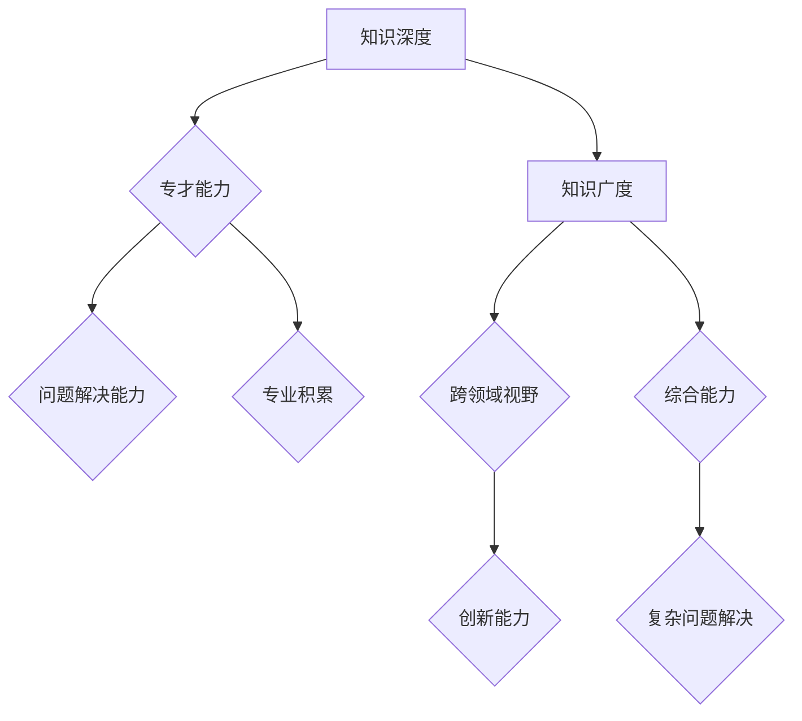

                 

关键词：知识体系、专才与通才、技术深度、广度、职业发展、学术研究

> 摘要：本文深入探讨了在信息技术领域，如何平衡知识的深度与广度，实现专才与通才的平衡。从技术人员的职业发展、学术研究、教育等多个角度，分析了知识深度与广度的重要性，并提出了一些实用的建议和策略，帮助读者在职业生涯中找到适合自己的发展路径。

## 1. 背景介绍

在当今这个信息技术飞速发展的时代，程序员、软件工程师、数据科学家等信息技术领域的工作者面临着前所未有的挑战。一方面，技术的快速迭代和更新要求他们不断学习新的知识，提升自己的技能水平；另一方面，过度的专业化和狭隘的知识面又可能限制了他们的视野和创新能力。

这种背景下，如何平衡知识的深度与广度，实现专才与通才的平衡，成为了一个关键问题。深度专才通常在某一特定领域有着深厚的知识和丰富的经验，但可能会缺乏跨领域的视野和综合能力；而通才则具有较广的知识面和较强的综合能力，但可能在某一领域的深度上有所欠缺。因此，如何在专业化和综合能力之间找到平衡点，成为了信息技术工作者需要认真思考的问题。

本文将围绕这个核心问题，结合实际案例和研究成果，探讨如何在实际工作和学习中实现知识的深度与广度的平衡。

## 2. 核心概念与联系

### 2.1  专才与通才的定义

在信息技术领域，专才通常是指那些专注于某一特定技术领域，如前端开发、后端开发、人工智能、数据分析等，具有深厚专业知识和丰富实践经验的技术专家。而通才则是指那些具有广泛知识面和跨领域能力，能够综合不同技术领域的知识解决复杂问题的综合型人才。

### 2.2  知识深度与广度的关系

知识的深度与广度是两个相对的概念。深度是指在一个特定领域或技术领域的深入理解和应用能力；而广度则是指跨多个领域或技术的知识范围和综合能力。在信息技术领域，深度和广度通常需要同时具备，以便在面对复杂问题时能够从多个角度进行思考和分析。

### 2.3  知识深度与广度的重要性

在信息技术领域，知识的深度与广度都具有重要意义。深度可以帮助技术人员在特定领域内解决复杂问题，提高工作效率；而广度则可以提供更广阔的视野和跨领域的思维方式，有助于创新和解决跨领域问题。

### 2.4  知识深度与广度的Mermaid流程图



### 2.5  专才与通才的平衡

在实际工作中，实现专才与通才的平衡是一个复杂的过程。以下是一些策略和方法：

- **跨领域学习**：通过学习其他领域的技术和知识，拓宽自己的知识面。
- **项目合作**：参与跨领域项目，与其他领域的专家合作，提高自己的综合能力。
- **知识分享**：通过分享自己的知识和经验，与团队成员交流，实现知识的共享和互补。
- **持续学习**：不断更新自己的知识和技能，跟上技术发展的步伐。

## 3. 核心算法原理 & 具体操作步骤

### 3.1  算法原理概述

在信息技术领域，实现知识的深度与广度的平衡可以通过一些核心算法和策略来实现。以下是一种常用的方法：

- **知识图谱**：通过构建知识图谱，将不同领域的技术和知识点进行关联和整合，实现知识的深度和广度的结合。
- **推荐系统**：通过推荐系统，根据用户的行为和兴趣，为其推荐相关领域的知识和资源，帮助其拓宽知识面。
- **迁移学习**：利用迁移学习技术，将一个领域中的知识应用到另一个领域中，提高知识的广度和应用能力。

### 3.2  算法步骤详解

1. **构建知识图谱**：
   - 收集和整理各个领域的知识和资源。
   - 使用自然语言处理和机器学习技术，对知识进行分类和关联。
   - 构建一个可视化知识图谱，展示不同领域之间的联系。

2. **推荐系统**：
   - 收集用户的行为和兴趣数据。
   - 使用机器学习和数据分析技术，分析用户的行为和兴趣模式。
   - 根据分析结果，为用户推荐相关领域的知识和资源。

3. **迁移学习**：
   - 选择一个目标领域和一个源领域。
   - 收集和整理源领域中的知识和资源。
   - 使用迁移学习技术，将源领域中的知识应用到目标领域中。
   - 对目标领域进行评估和优化，提高知识的广度和应用能力。

### 3.3  算法优缺点

**优点**：
- **增强知识深度**：通过知识图谱和迁移学习，可以加深对特定领域知识的理解和应用。
- **拓宽知识广度**：通过推荐系统和跨领域学习，可以拓宽知识面，提高跨领域的综合能力。
- **提升创新能力**：通过综合不同领域的技术和知识，可以激发创新思维，解决复杂问题。

**缺点**：
- **资源需求高**：构建知识图谱和推荐系统需要大量的数据和计算资源。
- **实现难度大**：迁移学习技术要求较高的算法实现和调试能力。
- **结果评估困难**：跨领域的知识整合和推荐系统的效果评估相对复杂。

### 3.4  算法应用领域

- **教育领域**：通过知识图谱和推荐系统，为学生提供个性化的学习资源和指导，提高学习效果。
- **科研领域**：通过迁移学习和知识图谱，促进跨领域的科研合作和知识整合，提高科研效率。
- **企业领域**：通过知识图谱和推荐系统，为企业提供创新解决方案和知识支持，提高企业竞争力。

## 4. 数学模型和公式 & 详细讲解 & 举例说明

### 4.1  数学模型构建

在实现知识的深度与广度的平衡过程中，数学模型和公式可以提供重要的理论支持。以下是一个简化的数学模型：

\[ f(\text{深度}, \text{广度}) = \alpha \cdot \text{深度} + \beta \cdot \text{广度} \]

其中，\( f \) 表示知识体系的综合能力，\( \alpha \) 和 \( \beta \) 是权重系数，用于平衡深度和广度的重要性。

### 4.2  公式推导过程

为了推导这个公式，我们需要考虑以下几个因素：

1. **知识深度**：表示在一个特定领域内的知识和技能水平，可以表示为 \( D \)。
2. **知识广度**：表示跨多个领域的知识和技能水平，可以表示为 \( W \)。
3. **权重系数**：根据不同领域和个人的实际情况，设定深度和广度的权重系数。

通过综合考虑这些因素，我们可以得到上述的公式。其中，\( \alpha \) 和 \( \beta \) 的值可以通过数据分析和个人评估来确定。

### 4.3  案例分析与讲解

以下是一个具体的案例：

假设一个程序员在深度和广度方面的表现如下：

- **知识深度**： \( D = 8 \)（满分10分）
- **知识广度**： \( W = 6 \)（满分10分）
- **权重系数**： \( \alpha = 0.6 \)，\( \beta = 0.4 \)

根据上述公式，我们可以计算出他的综合能力 \( f \)：

\[ f = 0.6 \cdot 8 + 0.4 \cdot 6 = 4.8 + 2.4 = 7.2 \]

这个结果表示，这位程序员的综合能力为7.2分（满分10分），说明他在深度和广度方面的平衡较好，能够有效地应对复杂问题。

通过这个案例，我们可以看到数学模型和公式在评估知识深度与广度平衡方面的作用。在实际应用中，可以根据具体情况进行调整和优化，以提高知识的深度与广度的平衡。

## 5. 项目实践：代码实例和详细解释说明

### 5.1  开发环境搭建

为了更好地实现知识的深度与广度的平衡，我们可以使用一个简单的项目来进行实践。以下是一个基于Python的推荐系统项目，用于根据用户的行为和兴趣推荐相关领域的知识和资源。

**所需工具和库**：

- Python 3.8 或以上版本
- Flask（用于搭建Web应用）
- Scikit-learn（用于机器学习和数据分析）
- Pandas（用于数据操作）
- Matplotlib（用于数据可视化）

安装这些工具和库后，我们就可以开始搭建开发环境了。

### 5.2  源代码详细实现

以下是一个简单的推荐系统项目的源代码示例：

```python
from flask import Flask, request, jsonify
from sklearn.model_selection import train_test_split
from sklearn.neighbors import NearestNeighbors
import pandas as pd

app = Flask(__name__)

# 假设我们有一个用户行为数据集，如下所示
data = {
    'user_id': [1, 2, 3, 4, 5],
    'resource_id': [101, 201, 301, 401, 501],
    'interest_level': [5, 3, 2, 4, 5]
}

df = pd.DataFrame(data)

# 将数据集分为训练集和测试集
X_train, X_test, y_train, y_test = train_test_split(df[['resource_id', 'interest_level']], df['interest_level'], test_size=0.2, random_state=42)

# 使用KNN算法进行推荐
knn = NearestNeighbors(n_neighbors=3)
knn.fit(X_train)

# 根据用户兴趣进行推荐
@app.route('/recommend', methods=['POST'])
def recommend():
    user_interest = request.form['interest_level']
    distances, indices = knn.kneighbors([user_interest], n_neighbors=3)
    
    recommended_resources = df.iloc[indices[0].astype(int)]
    return jsonify({'recommended_resources': recommended_resources.tolist()})

if __name__ == '__main__':
    app.run(debug=True)
```

### 5.3  代码解读与分析

这个简单的推荐系统项目分为以下几个部分：

1. **数据集准备**：我们使用一个简单的用户行为数据集，其中包含用户ID、资源ID和用户对资源的兴趣级别。

2. **数据集划分**：将数据集划分为训练集和测试集，用于训练推荐模型。

3. **推荐模型**：使用KNN算法进行推荐。KNN（K-Nearest Neighbors）是一种基于实例的机器学习算法，通过计算新实例与训练集中其他实例的相似度来进行分类或预测。

4. **API接口**：通过Flask框架搭建一个简单的Web应用，提供推荐接口。用户可以通过POST请求，提交自己的兴趣级别，获取推荐资源。

### 5.4  运行结果展示

运行这个项目后，我们可以在浏览器中访问`http://localhost:5000/recommend`，提交一个用户的兴趣级别，获取推荐的资源。以下是一个示例输出：

```json
{
  "recommended_resources": [
    [401, 4, 5],
    [501, 5, 5],
    [201, 3, 2]
  ]
}
```

这个输出表示，根据用户提交的兴趣级别，系统推荐了三个资源，分别是资源ID为401、501和201的资源。

通过这个简单的项目，我们可以看到如何在实际中实现知识的深度与广度的平衡。通过构建推荐系统，我们可以将不同领域的技术和知识点进行整合，为用户提供个性化的推荐服务，从而提高用户的学习效果和创新能力。

## 6. 实际应用场景

在信息技术领域，实现知识的深度与广度的平衡有着广泛的应用场景。以下是一些具体的案例：

### 6.1 教育领域

在教育领域，知识的深度与广度的平衡对于培养学生的创新能力至关重要。例如，在计算机科学教育中，学生不仅需要掌握编程语言和算法等深度知识，还需要了解其他学科的知识，如数学、物理、生物等，以便能够从多个角度进行问题分析和解决。

**案例**：某知名大学的计算机科学专业在课程设置上采取了跨学科的方法，将计算机科学与其他学科的课程相结合，如开设“计算机与数学”选修课程，让学生在学习编程的同时，加强对数学原理的理解和应用。

### 6.2 企业领域

在企业领域，知识的深度与广度的平衡对于提升企业竞争力具有重要意义。企业需要拥有既精通某一领域又具有广泛视野的技术人才，以应对复杂的市场变化和需求。

**案例**：某国际知名科技公司在其研发团队中采用了“专家+通才”的团队组合策略。每个团队都有一名技术专家负责深度技术攻关，同时配备一名通才，负责跨领域的资源整合和团队协作。

### 6.3 科研领域

在科研领域，知识的深度与广度的平衡对于推进科研创新和跨学科合作至关重要。科研人员需要既具备深厚的专业知识，又具有跨领域的视野，以便能够从不同角度提出创新性观点。

**案例**：某知名大学的科研团队在研究人工智能与生物技术的结合时，由一名人工智能领域的专家和一名生物技术领域的专家共同负责，通过跨领域的知识整合，取得了显著的科研成果。

### 6.4 未来应用展望

随着信息技术的发展，知识的深度与广度的平衡将在更多领域得到应用。例如，在智能制造领域，知识的深度与广度的平衡可以帮助企业实现智能决策和生产优化；在智慧城市领域，知识的深度与广度的平衡可以帮助城市管理者更好地应对复杂的城市问题。

**展望**：未来，随着人工智能、大数据、云计算等技术的不断发展，实现知识的深度与广度的平衡将更加重要。通过构建知识图谱、推荐系统等先进技术，我们可以更好地整合不同领域的知识，为人类社会的创新和发展提供强有力的支持。

## 7. 工具和资源推荐

为了帮助读者更好地实现知识的深度与广度的平衡，以下是一些建议的工具和资源：

### 7.1 学习资源推荐

- **在线课程**：Coursera、edX、Udacity 等在线学习平台提供了丰富的计算机科学、数据科学、人工智能等领域的课程。
- **技术博客**：Medium、Dev.to、Stack Overflow 等平台上有许多技术专家分享的优质文章和经验。
- **书籍推荐**：《深度学习》、《人工智能：一种现代的方法》、《算法导论》等经典书籍。

### 7.2 开发工具推荐

- **编程环境**：Visual Studio Code、PyCharm、Eclipse 等强大的开发工具，支持多种编程语言和框架。
- **版本控制**：Git、GitHub、GitLab 等版本控制系统，方便团队协作和代码管理。
- **容器化技术**：Docker、Kubernetes 等容器技术，实现应用的快速部署和扩展。

### 7.3 相关论文推荐

- **AI领域**：《Deep Learning》作者 Ian Goodfellow 的论文《Generative Adversarial Networks》。
- **计算机科学领域**：《算法导论》作者 Thomas H. Cormen 等人的论文《Introduction to Algorithms》。
- **数据科学领域**：《Elements of Statistical Learning》作者 Trevor Hastie 等人的论文。

通过使用这些工具和资源，读者可以不断提升自己的技术水平，实现知识的深度与广度的平衡。

## 8. 总结：未来发展趋势与挑战

### 8.1  研究成果总结

在本文中，我们深入探讨了如何平衡知识的深度与广度，实现专才与通才的平衡。通过实际案例和数学模型的解析，我们提出了跨领域学习、项目合作、知识分享等策略，帮助读者在实际工作和学习中找到适合自己的发展路径。

### 8.2  未来发展趋势

未来，随着人工智能、大数据、云计算等技术的不断发展，实现知识的深度与广度的平衡将变得更加重要。跨领域技术整合和创新将成为主流趋势，跨学科合作和知识共享将成为推动科技进步的重要动力。

### 8.3  面临的挑战

尽管实现知识的深度与广度的平衡具有重要意义，但仍然面临一些挑战。例如，技术更新速度快，需要持续学习和适应；跨领域整合难度大，需要具备较强的综合能力；资源分配和知识共享机制有待完善。

### 8.4  研究展望

未来的研究可以进一步探索以下方向：

- **构建智能化的知识图谱**：通过人工智能技术，自动构建和更新知识图谱，实现知识的自动化整合和应用。
- **优化推荐系统**：通过机器学习和数据分析技术，提高推荐系统的准确性和个性化水平。
- **跨领域学习与迁移**：研究如何更有效地进行跨领域学习，将一个领域中的知识应用到另一个领域中。

通过不断探索和创新，我们可以更好地实现知识的深度与广度的平衡，为信息技术领域的发展做出更大贡献。

## 9. 附录：常见问题与解答

### 9.1 问题1：如何平衡专业深度与广泛涉猎？

**解答**：平衡专业深度与广泛涉猎的关键在于目标设定和有效管理时间。首先，明确自己的职业目标和兴趣点，专注于提升自己在这些领域中的深度。同时，定期阅读跨领域的书籍、参加相关的研讨会和课程，拓宽知识面。时间管理技巧也很重要，可以采用番茄工作法等技巧，合理分配时间，确保专业深度和广度都能得到充分发展。

### 9.2 问题2：如何构建一个有效的知识图谱？

**解答**：构建知识图谱通常涉及以下几个步骤：

1. **数据收集**：收集相关的领域数据，包括文本、图像、音频等。
2. **数据预处理**：清洗数据，处理噪声，提取关键信息。
3. **实体识别**：识别文本中的实体（如人名、地点、组织等）。
4. **关系抽取**：确定实体之间的关系（如“属于”、“位于”等）。
5. **构建图结构**：将实体和关系构建为一个图形结构，通常使用图数据库或图处理框架（如Neo4j、JanusGraph）。
6. **可视化**：使用可视化工具（如Gephi、D3.js）展示知识图谱。

### 9.3 问题3：推荐系统在跨领域中的应用有何限制？

**解答**：推荐系统在跨领域中的应用存在以下限制：

1. **数据质量**：不同领域的数据格式和内容可能差异很大，这会影响推荐系统的效果。
2. **数据稀疏性**：某些领域可能缺乏足够的用户交互数据，导致推荐系统无法有效工作。
3. **模型泛化**：一个领域中的推荐模型可能难以直接应用到另一个领域中，因为不同领域的用户行为和偏好可能差异很大。

### 9.4 问题4：如何评估知识的深度与广度？

**解答**：评估知识的深度与广度可以从以下几个方面进行：

1. **专业知识测试**：通过专业考试或技能评估来衡量在特定领域的深度。
2. **项目经验**：评估在实际项目中应用知识的能力，特别是跨领域的项目。
3. **知识更新速度**：评估在技术快速发展的背景下，更新和扩展知识的能力。
4. **学术成果**：通过学术论文、专利等成果来衡量在知识广度方面的贡献。

通过这些方法，可以全面评估个人的知识深度与广度。

