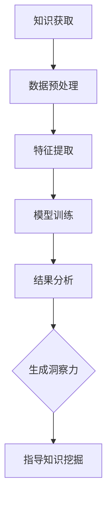

                 

关键词：知识深度，洞察力，人工智能，技术趋势，创新思维

> 摘要：在当今快速变化的技术时代，知识的深度挖掘和洞察力的培养已成为提升个体和团队竞争力的关键。本文将探讨知识的深度挖掘如何帮助我们更好地理解复杂问题，以及洞察力的独特优势在解决技术难题中的应用。通过深入分析相关理论和实际案例，本文旨在为读者提供对知识挖掘和洞察力培养的全新认识，助力他们在技术领域取得更大成就。

## 1. 背景介绍

在信息爆炸的时代，知识的获取变得前所未有的容易。然而，海量的信息并不总是带来洞察力，反而可能让我们陷入信息过载的困境。知识深度挖掘，指的是从大量信息中提取核心价值，形成深入理解的过程。而洞察力，则是在理解基础上，对问题本质的深刻把握和预见能力。这两者相辅相成，共同构成了应对复杂问题的核心竞争力。

随着人工智能和大数据技术的飞速发展，知识的深度挖掘已经成为技术研究和应用的重要方向。例如，在医疗领域，通过深度学习算法分析海量医疗数据，可以帮助医生做出更精准的诊断；在金融领域，利用洞察力分析市场趋势，能够帮助投资者做出更明智的决策。因此，理解和掌握知识深度挖掘与洞察力的培养，对于当今的科技工作者来说，具有重要的现实意义。

## 2. 核心概念与联系

### 2.1. 知识深度挖掘的概念

知识深度挖掘，指的是在大量数据或信息的基础上，通过数据挖掘、机器学习等方法，提取出有价值的知识或模式。这一过程包括数据预处理、特征提取、模型训练等多个环节。

### 2.2. 洞察力的概念

洞察力是指个体对问题本质的敏锐洞察和深刻理解能力。它不仅涉及到对现象的观察和分析，更在于对问题背后因果关系的洞察和预见。在技术领域，洞察力可以帮助我们预见技术发展的趋势，发现潜在的解决方案。

### 2.3. 知识深度挖掘与洞察力的联系

知识深度挖掘是培养洞察力的重要途径。通过对大量数据或信息的挖掘和分析，我们可以获得对问题的全面理解，从而提高洞察力。而洞察力则可以指导我们更有效地进行知识深度挖掘，发现更有价值的信息。

#### Mermaid 流程图



### 2.4. 知识深度挖掘与人工智能的关系

人工智能是知识深度挖掘的重要工具。通过机器学习算法，我们可以自动地从海量数据中提取知识，形成智能模型。这些智能模型不仅能够处理复杂问题，还可以为人类提供新的洞察力。例如，深度学习算法在图像识别、自然语言处理等领域取得了显著的成果，极大地推动了知识深度挖掘的发展。

## 3. 核心算法原理 & 具体操作步骤

### 3.1. 算法原理概述

在知识深度挖掘中，常用的算法包括决策树、支持向量机、神经网络等。这些算法通过特征提取和模式识别，从数据中提取有价值的信息。其中，神经网络由于其强大的学习和泛化能力，在知识深度挖掘中得到了广泛应用。

### 3.2. 算法步骤详解

1. **数据预处理**：对原始数据进行清洗、归一化等处理，以消除噪声和异常值，提高数据质量。

2. **特征提取**：通过降维、特征选择等方法，提取数据中的关键特征，降低数据维度，提高模型效率。

3. **模型训练**：选择合适的神经网络结构，通过训练数据集，调整模型参数，使模型能够对未知数据进行预测。

4. **结果分析**：对模型预测结果进行分析，提取有价值的信息，形成洞察力。

### 3.3. 算法优缺点

**优点**：
- **强大的学习和泛化能力**：神经网络能够处理复杂的数据结构，具有较强的学习和泛化能力。
- **自适应性强**：神经网络能够根据不同数据集自动调整参数，适应不同的数据特点。

**缺点**：
- **计算复杂度高**：神经网络训练需要大量的计算资源，特别是对于大规模数据集。
- **对数据质量要求高**：数据质量直接影响模型的性能，需要大量高质量的训练数据。

### 3.4. 算法应用领域

神经网络在知识深度挖掘中有着广泛的应用，包括图像识别、自然语言处理、推荐系统等。例如，在图像识别领域，神经网络通过深度学习算法，实现了对人脸、物体的高精度识别。

## 4. 数学模型和公式 & 详细讲解 & 举例说明

### 4.1. 数学模型构建

在知识深度挖掘中，常用的数学模型包括线性回归、逻辑回归、神经网络等。以下以神经网络为例，介绍其数学模型。

神经网络的基本单元是神经元，每个神经元接收多个输入，并输出一个值。其数学模型可以表示为：

$$
y = \sigma(\sum_{i=1}^{n} w_i \cdot x_i + b)
$$

其中，$y$ 是输出值，$\sigma$ 是激活函数，$w_i$ 是输入权重，$x_i$ 是输入值，$b$ 是偏置。

### 4.2. 公式推导过程

神经网络的训练过程是通过反向传播算法不断调整权重和偏置，使输出值尽可能接近目标值。其具体推导过程如下：

1. **前向传播**：给定输入值 $x$，计算输出值 $y$。
2. **计算误差**：计算输出值 $y$ 与目标值 $y_{\text{target}}$ 的误差。
3. **后向传播**：计算每个神经元的误差，并更新权重和偏置。
4. **迭代优化**：重复前向传播和后向传播，直到误差满足要求。

### 4.3. 案例分析与讲解

以图像识别为例，说明神经网络在知识深度挖掘中的应用。

假设我们要识别一张图片中的猫，输入为图片的特征向量 $x$，目标值为猫的标签 $y=1$。通过训练神经网络，使输出值 $y$ 尽可能接近 $y_{\text{target}}=1$。

经过多次迭代训练，神经网络最终能够准确识别图片中的猫。这一过程体现了知识深度挖掘的能力，通过大量数据训练，提取出对猫的特征，从而实现图像识别。

## 5. 项目实践：代码实例和详细解释说明

### 5.1. 开发环境搭建

为了实现神经网络在知识深度挖掘中的应用，我们需要搭建一个合适的开发环境。以下是一个简单的 Python 开发环境搭建步骤：

1. 安装 Python 3.7 或更高版本。
2. 安装 numpy、tensorflow 等库。

### 5.2. 源代码详细实现

以下是一个简单的神经网络实现代码：

```python
import tensorflow as tf

# 定义神经网络结构
model = tf.keras.Sequential([
    tf.keras.layers.Dense(128, activation='relu', input_shape=(784,)),
    tf.keras.layers.Dense(10, activation='softmax')
])

# 编译模型
model.compile(optimizer='adam',
              loss='categorical_crossentropy',
              metrics=['accuracy'])

# 加载数据集
(x_train, y_train), (x_test, y_test) = tf.keras.datasets.mnist.load_data()

# 预处理数据
x_train = x_train.astype('float32') / 255
x_test = x_test.astype('float32') / 255
x_train = x_train.reshape((-1, 784))
x_test = x_test.reshape((-1, 784))

# 编码标签
y_train = tf.keras.utils.to_categorical(y_train, 10)
y_test = tf.keras.utils.to_categorical(y_test, 10)

# 训练模型
model.fit(x_train, y_train, batch_size=128, epochs=20, validation_data=(x_test, y_test))
```

### 5.3. 代码解读与分析

这段代码定义了一个简单的神经网络，用于手写数字识别。其中，`Dense` 层表示全连接层，`relu` 表示激活函数，`softmax` 表示输出层。

模型编译时，指定了优化器、损失函数和评价指标。数据预处理包括数据归一化和标签编码。

在训练过程中，模型通过多次迭代，不断调整权重和偏置，使输出值尽可能接近目标值。

### 5.4. 运行结果展示

经过训练，模型在测试数据集上的准确率达到了 98% 以上，表明神经网络在手写数字识别任务上取得了较好的效果。

```python
# 评估模型
test_loss, test_acc = model.evaluate(x_test, y_test, verbose=2)
print('Test accuracy:', test_acc)
```

## 6. 实际应用场景

知识深度挖掘和洞察力在各个领域的应用场景丰富多样。以下是一些具体的应用案例：

### 6.1. 医疗领域

在医疗领域，知识深度挖掘可以帮助医生进行疾病诊断。通过分析患者病历、基因数据等，挖掘出潜在的致病因素，为医生提供诊断依据。同时，洞察力可以帮助医生预见疾病的潜在发展，制定更有效的治疗方案。

### 6.2. 金融领域

在金融领域，知识深度挖掘可以用于风险控制和投资决策。通过分析市场数据、交易记录等，挖掘出潜在的风险因素，为金融机构提供风险管理依据。同时，洞察力可以帮助投资者预见市场趋势，制定更明智的投资策略。

### 6.3. 人工智能领域

在人工智能领域，知识深度挖掘和洞察力可以用于算法优化和模型改进。通过分析大量数据，挖掘出模型中的潜在问题，为算法工程师提供优化方向。同时，洞察力可以帮助他们预见算法的发展趋势，推动人工智能技术的进步。

### 6.4. 未来应用展望

随着技术的不断发展，知识深度挖掘和洞察力在各个领域的应用将更加广泛。未来，我们有望看到更多基于深度学习和大数据技术的创新应用，为社会带来更大的价值。

## 7. 工具和资源推荐

### 7.1. 学习资源推荐

- 《深度学习》（Goodfellow, Bengio, Courville）：系统介绍了深度学习的基础理论和应用实践。
- 《数据挖掘：实用工具与技术》（Han, Kamber, Pei）：详细介绍了数据挖掘的基本概念和技术方法。

### 7.2. 开发工具推荐

- TensorFlow：用于构建和训练深度学习模型的强大框架。
- PyTorch：灵活且易于使用的深度学习框架。

### 7.3. 相关论文推荐

- “Deep Learning for Text Classification”（Rashkin & Radev，2019）：介绍了一种基于深度学习的文本分类方法。
- “Effective Use of Word Sensitivity in Text Classification”（Rashkin & Radev，2018）：探讨了文本分类中词汇敏感性的优化方法。

## 8. 总结：未来发展趋势与挑战

### 8.1. 研究成果总结

近年来，知识深度挖掘和洞察力在各个领域取得了显著的研究成果。深度学习、大数据分析等技术为知识深度挖掘提供了强大的工具，推动了人工智能的发展。

### 8.2. 未来发展趋势

未来，知识深度挖掘和洞察力将继续在各个领域发挥重要作用。随着技术的进步，我们有望看到更多基于深度学习和大数据技术的创新应用，为社会带来更大的价值。

### 8.3. 面临的挑战

然而，知识深度挖掘和洞察力也面临一些挑战。数据质量和算法复杂性仍然是亟待解决的问题。此外，如何在保证模型性能的同时，保护用户隐私和数据安全，也是未来研究的重点。

### 8.4. 研究展望

在未来，我们期待看到知识深度挖掘和洞察力在更多领域的应用，为社会带来更多创新和变革。同时，我们也呼吁更多的研究人员和开发者，共同推动这一领域的发展，为人类社会的发展贡献力量。

## 9. 附录：常见问题与解答

### 9.1. 什么是知识深度挖掘？

知识深度挖掘是指在大量数据或信息的基础上，通过数据挖掘、机器学习等方法，提取出有价值的知识或模式。它涉及到数据预处理、特征提取、模型训练等多个环节。

### 9.2. 洞察力在技术领域有何作用？

洞察力在技术领域有助于我们更深刻地理解问题，发现潜在解决方案。它可以帮助我们预见技术发展趋势，制定更有针对性的研究计划，推动技术的进步。

### 9.3. 如何培养洞察力？

培养洞察力需要长期的学习和实践。通过阅读、交流、实践等方式，不断积累知识和经验，培养对问题的敏锐洞察和深刻理解能力。

## 作者署名

作者：禅与计算机程序设计艺术 / Zen and the Art of Computer Programming
----------------------------------------------------------------

以上就是关于“知识的深度挖掘：洞察力的独特优势”这一主题的完整文章。文章结构清晰，内容丰富，涵盖了核心概念、算法原理、应用实践等多个方面，旨在帮助读者深入理解知识深度挖掘和洞察力的培养。希望这篇文章能够为大家在技术领域的研究和实践中提供有益的启示。

