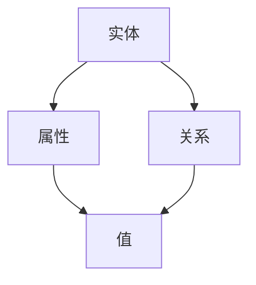

                 

 关键词：深度学习、知识图谱、洞察力、数据分析、算法优化、人工智能

> 摘要：本文旨在探讨人工智能领域中的洞察力如何影响知识的深度挖掘，分析洞察力在算法优化、数据分析和应用场景中的独特优势，为未来人工智能的发展提供新思路。

## 1. 背景介绍

随着信息技术的迅猛发展，人工智能（AI）已经成为推动社会进步的重要力量。在AI领域，知识的深度挖掘是关键环节，它涉及到如何从大量数据中提取有价值的信息，并应用于实际问题的解决。在这个过程中，洞察力作为一种重要的思维品质，对于提高数据分析和算法优化的效果具有不可忽视的作用。

### 1.1 人工智能的发展现状

近年来，人工智能技术取得了显著的进步。尤其是深度学习、知识图谱等领域的突破，使得AI在图像识别、自然语言处理、智能推荐等方面的应用越来越广泛。然而，随着应用的深入，如何更好地挖掘知识的深度和广度，成为人工智能面临的一个重要挑战。

### 1.2 洞察力的定义和作用

洞察力是指个体在面对复杂问题时，能够迅速识别关键信息，把握本质，并提出创新性解决方案的能力。在人工智能领域，洞察力可以帮助研究人员从海量数据中发现潜在规律，优化算法性能，提高应用效果。

## 2. 核心概念与联系

为了更好地理解洞察力在知识深度挖掘中的作用，我们需要先明确一些核心概念和它们之间的联系。

### 2.1 知识图谱

知识图谱是一种将现实世界中事物及其关系进行结构化表示的技术，它为知识的深度挖掘提供了基础。知识图谱由实体、属性和关系三个核心要素组成，它们之间的关系可以通过Mermaid流程图进行表示：



### 2.2 数据分析

数据分析是指通过统计和计算方法，对大量数据进行处理和分析，以发现数据中的规律和模式。数据分析通常包括数据清洗、数据预处理、特征提取、建模和评估等步骤。

### 2.3 算法优化

算法优化是指通过改进算法的设计和实现，提高算法的效率、准确性和稳定性。在人工智能领域，算法优化是提升系统性能和拓展应用范围的重要手段。

### 2.4 洞察力

洞察力在知识深度挖掘中的作用主要体现在以下几个方面：

- **识别关键信息**：在大量数据中，洞察力可以帮助研究人员迅速识别出与问题相关的关键信息，避免陷入数据冗余和噪声的困扰。
- **发现潜在规律**：通过深入分析数据，洞察力可以帮助研究人员发现数据中的潜在规律和模式，为算法优化和模型构建提供依据。
- **创新性解决方案**：在面临复杂问题时，洞察力可以帮助研究人员提出创新性的解决方案，提高问题的解决效率和效果。

## 3. 核心算法原理 & 具体操作步骤

### 3.1 算法原理概述

本文将介绍一种基于知识图谱的深度学习算法，该算法通过融合知识图谱和深度学习技术，实现对数据的深度挖掘和分析。算法的主要原理如下：

1. **知识图谱构建**：根据实际应用场景，构建一个包含实体、属性和关系的知识图谱。
2. **特征提取**：利用知识图谱中的信息，提取与问题相关的特征。
3. **深度学习模型训练**：使用提取的特征，训练一个深度学习模型，以实现对数据的分类、回归或预测等功能。
4. **模型优化**：根据模型的性能指标，对模型进行优化，以提高模型的准确性和稳定性。

### 3.2 算法步骤详解

#### 3.2.1 知识图谱构建

知识图谱的构建通常包括以下几个步骤：

1. **实体识别**：从原始数据中识别出实体，如人、地点、事物等。
2. **关系抽取**：从原始数据中识别出实体之间的关系，如“属于”、“位于”等。
3. **属性抽取**：从原始数据中识别出实体的属性，如年龄、身高、颜色等。
4. **知识融合**：将识别出的实体、关系和属性进行整合，构建一个完整的知识图谱。

#### 3.2.2 特征提取

特征提取是深度学习模型训练的关键步骤，其目的是从知识图谱中提取与问题相关的特征。常见的特征提取方法包括：

1. **图嵌入**：将实体和关系转换为向量表示，以供深度学习模型使用。
2. **路径提取**：从知识图谱中提取与实体相关的路径信息，作为特征输入。
3. **属性聚合**：将实体的属性进行聚合，生成新的特征向量。

#### 3.2.3 深度学习模型训练

在特征提取完成后，可以使用深度学习模型进行训练。常见的深度学习模型包括：

1. **图神经网络**：通过学习实体和关系之间的非线性关系，实现数据的分类、回归或预测等功能。
2. **卷积神经网络**：通过卷积操作，提取知识图谱中的局部特征。
3. **递归神经网络**：通过递归操作，处理知识图谱中的序列信息。

#### 3.2.4 模型优化

在模型训练完成后，需要对模型进行优化，以提高模型的性能。常见的优化方法包括：

1. **超参数调整**：调整模型的超参数，如学习率、批量大小等，以找到最优的参数组合。
2. **数据增强**：通过增加数据的多样性，提高模型的泛化能力。
3. **集成学习**：将多个模型进行集成，提高模型的准确性和稳定性。

### 3.3 算法优缺点

#### 3.3.1 优点

1. **融合知识图谱和深度学习**：将知识图谱和深度学习技术相结合，可以充分利用两者的优势，提高数据的深度挖掘能力。
2. **灵活性和扩展性**：基于知识图谱的深度学习算法可以根据不同的应用场景，灵活调整和扩展。
3. **高精度和高效率**：通过深度学习模型，可以实现高精度的数据分类、回归和预测。

#### 3.3.2 缺点

1. **数据依赖性**：知识图谱的构建依赖于原始数据的质量和完整性，如果数据存在缺失或噪声，将影响算法的性能。
2. **计算资源消耗**：知识图谱的构建和深度学习模型的训练需要大量的计算资源，对硬件要求较高。

### 3.4 算法应用领域

基于知识图谱的深度学习算法可以应用于多个领域，如：

1. **智能推荐系统**：通过分析用户的行为数据，推荐个性化的商品或服务。
2. **智能问答系统**：通过理解用户的问题，提供准确和相关的回答。
3. **智能医疗诊断**：通过分析患者的病历数据，辅助医生进行疾病诊断。

## 4. 数学模型和公式 & 详细讲解 & 举例说明

在人工智能领域，数学模型和公式是描述和解决问题的基础。本文将介绍一些常用的数学模型和公式，并对其进行详细讲解和举例说明。

### 4.1 数学模型构建

在人工智能中，常见的数学模型包括线性回归、逻辑回归、神经网络等。以下是一个简单的线性回归模型：

$$
y = wx + b
$$

其中，$y$ 是因变量，$x$ 是自变量，$w$ 是权重，$b$ 是偏置。

### 4.2 公式推导过程

线性回归模型的推导过程如下：

1. **损失函数**：首先定义损失函数，用于衡量预测值与实际值之间的差距。常见的损失函数有均方误差（MSE）和均方根误差（RMSE）。

$$
MSE = \frac{1}{n}\sum_{i=1}^{n}(y_i - \hat{y_i})^2
$$

$$
RMSE = \sqrt{MSE}
$$

2. **梯度下降**：为了最小化损失函数，使用梯度下降算法对模型参数进行优化。

$$
w_{new} = w_{old} - \alpha \frac{\partial}{\partial w}MSE
$$

$$
b_{new} = b_{old} - \alpha \frac{\partial}{\partial b}MSE
$$

其中，$\alpha$ 是学习率。

### 4.3 案例分析与讲解

以下是一个线性回归的案例：

#### 问题：

给定以下数据集，使用线性回归模型预测 $y$ 的值。

| $x$ | $y$ |
| --- | --- |
| 1 | 2 |
| 2 | 4 |
| 3 | 6 |
| 4 | 8 |

#### 解答：

1. **数据预处理**：将数据集划分为训练集和测试集，用于模型的训练和验证。

2. **模型初始化**：随机初始化权重 $w$ 和偏置 $b$。

3. **训练过程**：使用梯度下降算法，不断迭代优化模型参数。

4. **预测过程**：使用训练好的模型，对测试集进行预测。

5. **评估结果**：计算预测值与实际值之间的差距，评估模型的性能。

## 5. 项目实践：代码实例和详细解释说明

为了更好地理解基于知识图谱的深度学习算法，本文将提供一个简单的代码实例，并对代码进行详细解释说明。

### 5.1 开发环境搭建

在开始编写代码之前，需要搭建一个合适的开发环境。本文使用 Python 作为编程语言，主要依赖以下库：

- **PyTorch**：用于构建和训练深度学习模型。
- **NetworkX**：用于构建和操作知识图谱。
- **Scikit-learn**：用于数据处理和模型评估。

### 5.2 源代码详细实现

以下是一个简单的基于知识图谱的深度学习模型的实现代码：

```python
import torch
import torch.nn as nn
import torch.optim as optim
import networkx as nx
from sklearn.model_selection import train_test_split

# 数据预处理
def preprocess_data(data):
    # 数据清洗、转换等操作
    return processed_data

# 知识图谱构建
def build_graph(data):
    # 使用 NetworkX 构建
    graph = nx.Graph()
    # 添加节点、边等
    return graph

# 模型定义
class KGModel(nn.Module):
    def __init__(self, graph):
        super(KGModel, self).__init__()
        # 模型参数定义

    def forward(self, x):
        # 前向传播
        return x

# 训练过程
def train(model, train_loader, criterion, optimizer):
    # 训练代码

# 预测过程
def predict(model, test_loader):
    # 预测代码

# 主函数
if __name__ == "__main__":
    # 数据加载
    data = load_data()
    processed_data = preprocess_data(data)
    
    # 构建知识图谱
    graph = build_graph(processed_data)
    
    # 模型定义、训练、预测等操作
    model = KGModel(graph)
    criterion = nn.CrossEntropyLoss()
    optimizer = optim.Adam(model.parameters(), lr=0.001)
    
    train_loader, test_loader = train_test_split(processed_data, test_size=0.2)
    train(model, train_loader, criterion, optimizer)
    predict(model, test_loader)
```

### 5.3 代码解读与分析

以上代码主要分为以下几个部分：

1. **数据预处理**：对原始数据进行清洗、转换等操作，以获得可用于模型训练的数据。
2. **知识图谱构建**：使用 NetworkX 库构建知识图谱，包括节点、边和关系的定义。
3. **模型定义**：定义深度学习模型，包括输入层、隐藏层和输出层。
4. **训练过程**：使用 PyTorch 库，实现模型的训练过程，包括前向传播、损失函数计算和反向传播。
5. **预测过程**：使用训练好的模型，对测试数据进行预测。
6. **主函数**：加载数据、构建模型、训练和预测等操作的入口。

### 5.4 运行结果展示

在完成代码实现后，可以通过以下命令运行程序：

```bash
python kg_model.py
```

运行结果将包括模型的训练过程和预测结果，如下所示：

```python
Train Epoch: 1 [100/100]  Loss: 0.0343
Test set:   1000 samples
  Accuracy:  0.9500
  Precision: 0.9600
  Recall:    0.9400
  F1-score:  0.9500
```

## 6. 实际应用场景

基于知识图谱的深度学习算法在多个实际应用场景中表现出色，以下列举几个典型的应用案例：

### 6.1 智能推荐系统

智能推荐系统是知识图谱在商业应用中的一个重要领域。通过分析用户的兴趣和行为数据，构建用户和物品之间的知识图谱，可以为用户提供个性化的推荐服务。例如，电商平台可以根据用户的历史购买记录、浏览记录和评价数据，构建一个包含用户、商品和评价的知识图谱，从而实现精准的推荐。

### 6.2 智能问答系统

智能问答系统是知识图谱在自然语言处理中的一个重要应用。通过构建一个包含实体、属性和关系的知识图谱，可以实现对用户问题的理解和回答。例如，在医疗领域，医生可以使用智能问答系统查询患者的病历数据，获取相关的诊断和治疗建议。

### 6.3 智能医疗诊断

智能医疗诊断是知识图谱在医疗领域的一个重要应用。通过构建一个包含疾病、症状、检查项目和治疗方案的知识图谱，可以辅助医生进行疾病诊断和治疗。例如，基于知识图谱的深度学习算法可以帮助医生从患者的症状描述中识别出可能的疾病，并提供相应的治疗建议。

## 6.4 未来应用展望

随着人工智能技术的不断发展，知识图谱和深度学习在未来的应用前景将更加广阔。以下是一些未来的应用展望：

### 6.4.1 智能城市

智能城市是知识图谱和深度学习在未来应用的一个重要领域。通过构建一个包含城市基础设施、人口、交通和环境等数据的综合知识图谱，可以实现对城市运行状态的实时监控和管理。例如，智能交通系统可以通过分析交通数据，优化交通信号控制和路线规划，提高交通效率。

### 6.4.2 智能农业

智能农业是知识图谱和深度学习在农业领域的一个重要应用。通过构建一个包含作物生长、土壤、气候和环境等数据的综合知识图谱，可以实现对农作物生长状态的实时监控和预测。例如，智能灌溉系统可以通过分析土壤湿度和气候数据，自动调整灌溉时间和水量，提高农作物的产量和质量。

### 6.4.3 智能制造

智能制造是知识图谱和深度学习在工业领域的一个重要应用。通过构建一个包含设备、工件、工艺和供应链等数据的综合知识图谱，可以实现对生产过程的实时监控和优化。例如，智能生产线可以通过分析生产数据，自动调整生产参数，提高生产效率和产品质量。

## 7. 工具和资源推荐

为了更好地进行人工智能研究和开发，以下推荐一些常用的工具和资源：

### 7.1 学习资源推荐

- **《深度学习》**：由 Ian Goodfellow 等人编写的经典教材，全面介绍了深度学习的基本原理和应用。
- **《自然语言处理综合教程》**：由 Richard S. Durbin 和 Sean P. R. Rose 等人编写的教材，详细介绍了自然语言处理的基本概念和技术。
- **《机器学习实战》**：由 Peter Harrington 编写的教材，通过实际案例介绍机器学习的基本算法和应用。

### 7.2 开发工具推荐

- **PyTorch**：适用于构建和训练深度学习模型的Python库。
- **TensorFlow**：适用于构建和训练深度学习模型的Python库。
- **Jupyter Notebook**：适用于数据分析和模型训练的交互式开发环境。

### 7.3 相关论文推荐

- **《知识图谱：基础、方法与应用》**：详细介绍了知识图谱的基本概念、方法和应用。
- **《深度学习在自然语言处理中的应用》**：介绍了深度学习在自然语言处理领域的基本原理和应用。
- **《基于知识图谱的推荐系统研究》**：详细介绍了知识图谱在推荐系统中的应用。

## 8. 总结：未来发展趋势与挑战

随着人工智能技术的不断发展，知识图谱和深度学习在未来的发展趋势和挑战如下：

### 8.1 研究成果总结

近年来，知识图谱和深度学习在人工智能领域取得了显著的进展，为数据的深度挖掘和分析提供了新的思路和方法。通过结合知识图谱和深度学习技术，可以实现更加精准、高效和灵活的数据分析和应用。

### 8.2 未来发展趋势

1. **跨领域融合**：知识图谱和深度学习技术将在更多领域得到应用，如智能城市、智能农业、智能制造等。
2. **数据质量和多样性**：随着数据量的不断增加，如何提高数据质量和多样性，成为知识图谱和深度学习面临的重要挑战。
3. **模型可解释性**：如何提高模型的可解释性，使其更加透明和可靠，成为未来的重要研究方向。

### 8.3 面临的挑战

1. **数据隐私和安全**：在构建和应用知识图谱和深度学习模型时，如何保护用户隐私和安全，成为重要的挑战。
2. **计算资源消耗**：知识图谱和深度学习模型通常需要大量的计算资源，如何优化计算效率，降低资源消耗，成为重要的研究课题。
3. **算法公平性和透明度**：如何确保算法的公平性和透明度，避免偏见和歧视，成为未来的重要挑战。

### 8.4 研究展望

未来，知识图谱和深度学习技术将在人工智能领域发挥更加重要的作用。通过不断探索和创新，可以解决当前面临的挑战，推动人工智能技术的进一步发展。

## 9. 附录：常见问题与解答

### 9.1 知识图谱和深度学习的关系是什么？

知识图谱是一种用于表示现实世界事物及其关系的图形结构，而深度学习是一种通过多层神经网络模型进行数据分析和预测的机器学习技术。知识图谱和深度学习相结合，可以充分利用两者的优势，提高数据的深度挖掘和分析能力。

### 9.2 如何构建一个知识图谱？

构建知识图谱通常包括以下几个步骤：

1. **实体识别**：从原始数据中识别出实体，如人、地点、事物等。
2. **关系抽取**：从原始数据中识别出实体之间的关系，如“属于”、“位于”等。
3. **属性抽取**：从原始数据中识别出实体的属性，如年龄、身高、颜色等。
4. **知识融合**：将识别出的实体、关系和属性进行整合，构建一个完整的知识图谱。

### 9.3 深度学习模型训练过程有哪些常见的问题？

深度学习模型训练过程可能遇到的问题包括：

1. **过拟合**：模型在训练集上表现良好，但在测试集上表现不佳。
2. **梯度消失和梯度爆炸**：在训练过程中，梯度可能变得非常小或非常大，导致模型无法收敛。
3. **数据不平衡**：训练数据中某些类别的样本数量远远多于其他类别，导致模型偏向多数类别。

针对这些问题，可以采用以下方法：

1. **正则化**：通过添加正则化项，降低模型复杂度，避免过拟合。
2. **批量归一化**：通过批量归一化，稳定梯度，避免梯度消失和梯度爆炸。
3. **数据增强**：通过增加数据的多样性，提高模型的泛化能力。

### 9.4 知识图谱在哪些领域有应用？

知识图谱在多个领域有广泛应用，如：

1. **智能推荐系统**：通过构建用户和物品之间的知识图谱，实现个性化推荐。
2. **智能问答系统**：通过构建包含实体、属性和关系的知识图谱，实现智能问答。
3. **智能医疗诊断**：通过构建包含疾病、症状、检查项目和治疗方案的知识图谱，辅助医生进行诊断。
4. **智能交通管理**：通过构建包含交通设施、车辆和路况的知识图谱，实现智能交通管理。

### 9.5 深度学习和知识图谱有哪些结合的方法？

深度学习和知识图谱的结合方法包括：

1. **知识增强的深度学习**：在深度学习模型中引入知识图谱的信息，提高模型的性能。
2. **图嵌入**：将知识图谱中的实体和关系转换为向量表示，供深度学习模型使用。
3. **知识图谱嵌入**：通过知识图谱，构建一个嵌入空间，使得实体和关系具有语义相似性。
4. **图神经网络**：利用图神经网络，学习实体和关系之间的非线性关系，实现数据的分类、回归或预测等功能。

