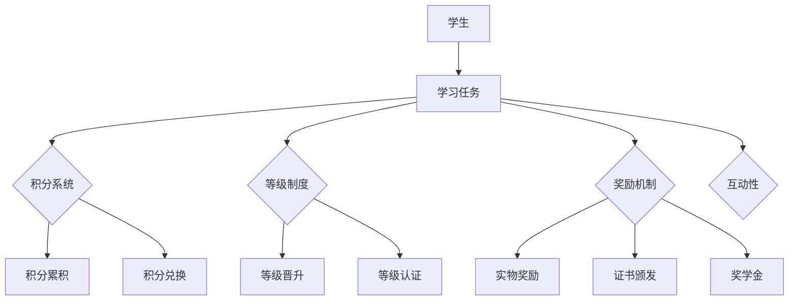

                 

在当今的信息时代，知识的获取和评估成为教育和职业发展的关键环节。传统的评估方式往往侧重于知识记忆和理解，忽略了知识的实际应用和创新能力。因此，本文将探讨一种创新的评估方法——知识游戏化评估，通过将学习过程转化为一种游戏化的体验，提高学习者的参与度和效果。

> 关键词：知识评估、游戏化、教育技术、学习动机、技能培养

> 摘要：本文首先介绍了知识游戏化评估的背景和重要性，然后详细阐述了其核心概念和运作机制。接着，文章分析了这种评估方法在计算机科学和教育领域中的应用，并探讨了其优缺点。最后，文章提出了未来知识游戏化评估的发展趋势和面临的挑战，为教育技术和评估方法提供了新的视角。

## 1. 背景介绍

知识游戏化评估的概念源于游戏化（Gamification）的兴起。游戏化是指将游戏设计元素和机制应用于非游戏环境，以增加用户参与度和动机。在近年来，游戏化在教育、健康、市场营销等多个领域得到了广泛应用。教育领域的游戏化旨在通过游戏化元素激发学生的学习兴趣和参与度，提高学习效果。

### 1.1 知识评估的现状

传统的知识评估方法主要依赖于笔试、面试等模式，这些方法虽然能够测试学生的知识水平，但往往存在以下问题：

- **缺乏互动性**：传统的评估方式往往是单向的，学生被动接受知识，缺乏主动参与。
- **忽略实际应用**：许多评估方式侧重于知识的记忆和理解，但忽略了知识的实际应用和创新能力。
- **评估标准单一**：传统的评估标准往往基于标准化测试，难以全面反映学生的个性和能力。

### 1.2 游戏化评估的兴起

游戏化评估通过引入游戏化的元素，如积分、等级、奖励等，旨在解决传统评估方法的局限性。游戏化评估的优势在于：

- **提高参与度**：游戏化的元素能够激发学生的兴趣和参与度，使他们更加主动地学习。
- **增强实践性**：游戏化评估往往结合实际案例和项目，能够更好地培养学生的实际应用能力。
- **个性化和多样性**：游戏化评估可以适应不同的学习者和学习目标，提供多样化的评估标准。

## 2. 核心概念与联系

### 2.1 核心概念

知识游戏化评估的核心概念包括：

- **积分系统**：通过积分奖励学生，鼓励他们在学习过程中不断进步。
- **等级制度**：学生通过完成不同的任务和挑战，获得不同等级的称号，提高自我成就感。
- **奖励机制**：通过提供实物奖励、证书、奖学金等，激励学生积极参与评估过程。
- **互动性**：通过线上线下的互动，提高学生的参与度和学习效果。

### 2.2 架构图

以下是一个简单的知识游戏化评估的架构图：



### 2.3 关联性

知识游戏化评估的各个核心概念相互关联，共同构成一个有机的整体。积分系统和等级制度可以激励学生努力学习，奖励机制则提供了实际的动力。互动性则增强了评估的参与度和效果。

## 3. 核心算法原理 & 具体操作步骤

### 3.1 算法原理概述

知识游戏化评估的核心算法是基于行为心理学和动机理论。该算法通过以下步骤实现：

1. **任务分配**：根据学生的能力和学习目标，分配不同难度和类型的任务。
2. **积分计算**：根据学生的完成任务的情况，计算相应的积分。
3. **等级晋升**：根据学生的积分累积情况，晋升不同等级。
4. **奖励发放**：根据学生的等级和积分，发放相应的奖励。

### 3.2 算法步骤详解

1. **任务分配**：首先，系统根据学生的基础知识和学习目标，生成相应的任务列表。任务可以是知识问答、实际项目、案例分析等。
2. **积分计算**：学生在完成任务后，系统根据任务的难度、完成质量等因素，计算相应的积分。积分可以用于兑换奖品、晋升等级等。
3. **等级晋升**：学生在完成一定数量的任务或累积到足够的积分后，可以晋升到更高的等级。每个等级都有相应的称号和特权。
4. **奖励发放**：学生在达到特定等级或完成特定任务后，可以获得实物奖励、证书、奖学金等。

### 3.3 算法优缺点

**优点**：

- **提高参与度**：游戏化的元素能够激发学生的学习兴趣和参与度，使他们更加主动地学习。
- **增强实践性**：通过实际任务和项目，学生能够更好地将知识应用于实际场景。
- **个性化评估**：游戏化评估可以根据学生的不同能力和兴趣，提供个性化的学习路径和评估标准。

**缺点**：

- **难度调整**：游戏化评估需要对任务难度进行合理调整，以避免学生感到挫败。
- **奖励机制**：奖励机制的设定需要平衡学生的实际需求和资源的有限性。

### 3.4 算法应用领域

知识游戏化评估可以在多个领域得到应用，包括：

- **教育领域**：用于评估学生的学习效果和知识掌握情况。
- **职业培训**：用于评估员工的专业技能和业务水平。
- **技能认证**：用于评估个人在特定领域的技能水平。

## 4. 数学模型和公式 & 详细讲解 & 举例说明

### 4.1 数学模型构建

知识游戏化评估的数学模型主要包括以下几个方面：

1. **任务难度评估模型**：用于评估每个任务对学生而言的难度。
2. **积分计算模型**：用于计算学生在完成任务后获得的积分。
3. **等级晋升模型**：用于根据学生的积分累积情况，计算学生可以晋升的等级。

### 4.2 公式推导过程

1. **任务难度评估模型**：

   假设学生 A 在完成一个难度为 d 的任务后，获得的积分 i 可以用以下公式计算：

   $$i = k \cdot d$$

   其中，k 为积分系数，用于调节积分的发放。

2. **积分计算模型**：

   假设学生 B 在完成一个难度为 d 的任务后，获得的积分 i，并且该任务需要完成 t 次才能获得完整的积分。则学生 B 可以获得的积分总和 I 可以用以下公式计算：

   $$I = k \cdot d \cdot t$$

3. **等级晋升模型**：

   假设学生 C 需要完成 m 个任务才能晋升到下一个等级，并且每个任务的难度为 d，则学生 C 可以晋升的等级 L 可以用以下公式计算：

   $$L = \left\lceil \frac{I}{k \cdot m} \right\rceil$$

   其中，\(\left\lceil \cdot \right\rceil\) 为向上取整函数。

### 4.3 案例分析与讲解

假设有一个学生 D，他需要在一个月内完成 10 个难度为 3 的任务。如果每个任务的完成质量都能达到 90%，则学生 D 可以获得的积分 I 可以用以下公式计算：

$$I = k \cdot 3 \cdot 10 = 30k$$

假设积分系数 k 为 1，则学生 D 可以获得的积分 I 为 30。根据等级晋升模型，学生 D 可以晋升的等级 L 为：

$$L = \left\lceil \frac{30}{1 \cdot 10} \right\rceil = 3$$

因此，学生 D 可以晋升到第三等级。

## 5. 项目实践：代码实例和详细解释说明

### 5.1 开发环境搭建

在搭建知识游戏化评估系统的开发环境时，我们可以选择以下工具和技术：

- **前端框架**：React 或 Vue.js
- **后端框架**：Node.js 或 Django
- **数据库**：MySQL 或 MongoDB
- **版本控制**：Git

### 5.2 源代码详细实现

以下是一个简单的知识游戏化评估系统的源代码实现：

```javascript
// 前端代码（React）

import React, { useState } from 'react';

function Task({ task, onTaskComplete }) {
  const [isCompleted, setIsCompleted] = useState(false);

  const completeTask = () => {
    onTaskComplete(task);
    setIsCompleted(true);
  };

  return (
    <div>
      <h2>{task.name}</h2>
      <p>{task.description}</p>
      {!isCompleted && (
        <button onClick={completeTask}>完成任务</button>
      )}
      {isCompleted && (
        <p>任务已完成，积分 +{task.points}</p>
      )}
    </div>
  );
}

export default function TaskList({ tasks, onTaskComplete }) {
  return (
    <div>
      {tasks.map((task) => (
        <Task key={task.id} task={task} onTaskComplete={onTaskComplete} />
      ))}
    </div>
  );
}

// 后端代码（Node.js）

const express = require('express');
const app = express();

app.use(express.json());

let tasks = [
  { id: 1, name: '任务1', description: '这是一个简单的任务', points: 10 },
  { id: 2, name: '任务2', description: '这是一个较难的任务', points: 20 },
  // 更多任务
];

app.post('/complete-task', (req, res) => {
  const taskId = req.body.taskId;
  const task = tasks.find((t) => t.id === taskId);

  if (task) {
    // 计算积分并更新任务状态
    // 这里简化处理，直接返回任务状态
    res.json({ status: 'completed' });
  } else {
    res.status(404).json({ error: '任务不存在' });
  }
});

const PORT = process.env.PORT || 3000;
app.listen(PORT, () => {
  console.log(`Server is running on port ${PORT}`);
});
```

### 5.3 代码解读与分析

这段代码实现了一个简单的知识游戏化评估系统，包括前端和后端两部分。

- **前端**：使用 React 框架，定义了 `Task` 和 `TaskList` 两个组件。`Task` 组件表示一个任务，包括任务名称、描述和完成按钮。`TaskList` 组件用于渲染任务列表。
- **后端**：使用 Node.js 和 Express 框架，定义了一个 `/complete-task` 接口，用于处理任务的完成请求。当接收到任务完成请求时，后端会更新任务的状态，并返回状态信息。

### 5.4 运行结果展示

前端页面将显示任务列表，学生可以点击完成按钮完成任务。当学生完成一个任务时，前端会向后端发送一个 POST 请求，请求 URL 为 `/complete-task`，请求体包含任务的 ID。后端接收到请求后，会更新任务的状态，并返回状态信息。前端接收到后端返回的信息后，会更新任务的状态。

## 6. 实际应用场景

知识游戏化评估可以在多个场景中得到应用，包括但不限于以下领域：

### 6.1 教育领域

在教育领域，知识游戏化评估可以用于：

- **课程评估**：通过游戏化元素，评估学生在课程中的知识掌握情况。
- **学习路径规划**：根据学生的兴趣和成绩，推荐合适的学习路径。
- **教学互动**：通过游戏化元素，增加教学互动性，提高学生的学习兴趣。

### 6.2 职业培训

在职业培训领域，知识游戏化评估可以用于：

- **技能评估**：通过游戏化任务，评估员工的专业技能和业务水平。
- **能力提升**：通过游戏化任务，帮助员工提升实际应用能力。
- **培训效果评估**：通过游戏化任务，评估培训课程的效果。

### 6.3 人力资源

在人力资源领域，知识游戏化评估可以用于：

- **人才选拔**：通过游戏化任务，评估应聘者的技能和潜力。
- **能力提升**：通过游戏化任务，提升员工的能力和动力。
- **绩效评估**：通过游戏化任务，评估员工的工作表现。

### 6.4 未来应用展望

随着技术的不断进步，知识游戏化评估的应用领域将更加广泛。未来，知识游戏化评估可能朝着以下方向发展：

- **智能化**：通过引入人工智能技术，实现更智能的任务分配和奖励机制。
- **个性化**：通过大数据分析，提供个性化的学习路径和评估标准。
- **跨平台**：通过云计算和移动技术，实现跨平台的游戏化评估。

## 7. 工具和资源推荐

### 7.1 学习资源推荐

- **书籍**：
  - 《游戏化革命：如何运用游戏机制激发用户参与》（Kynde）
  - 《教育游戏化：理论与实践》（Adesope）
- **在线课程**：
  - Coursera 上的“Game Design and Game Psychology”课程
  - edX 上的“Educational Technology and Game-based Learning”课程
- **网站**：
  - Gamification.co
  - GameBasedLearning.com

### 7.2 开发工具推荐

- **前端框架**：React、Vue.js
- **后端框架**：Node.js、Django
- **数据库**：MySQL、MongoDB
- **版本控制**：Git

### 7.3 相关论文推荐

- “Gamification in Education: A Systematic Review” by Anders et al. (2016)
- “Educational Game-Based Learning: State of the Art” by Thanabalasuriar et al. (2018)
- “Gamification in the Workplace: A Meta-Analysis” by Ko et al. (2020)

## 8. 总结：未来发展趋势与挑战

### 8.1 研究成果总结

知识游戏化评估作为一种创新的评估方法，已经在多个领域得到了应用。研究表明，知识游戏化评估能够提高学生的参与度和学习效果，有助于培养学生的实际应用能力和创新能力。

### 8.2 未来发展趋势

未来，知识游戏化评估可能会朝着以下几个方向发展：

- **智能化**：引入人工智能技术，实现更智能的任务分配和奖励机制。
- **个性化**：通过大数据分析，提供个性化的学习路径和评估标准。
- **跨平台**：通过云计算和移动技术，实现跨平台的游戏化评估。

### 8.3 面临的挑战

知识游戏化评估在应用过程中也面临一些挑战，包括：

- **任务难度调整**：如何根据学生的能力和兴趣，合理调整任务的难度。
- **奖励机制设计**：如何设计合理的奖励机制，激发学生的积极性。
- **数据隐私**：如何确保学生在游戏化评估过程中数据的隐私和安全。

### 8.4 研究展望

未来的研究可以从以下几个方面展开：

- **跨学科研究**：结合心理学、教育学、计算机科学等多学科的理论和方法，深入研究知识游戏化评估的机制和效果。
- **应用推广**：在更多领域推广知识游戏化评估的应用，探索其在不同场景下的效果。
- **技术改进**：引入新技术，如虚拟现实、增强现实等，提升知识游戏化评估的互动性和沉浸感。

## 9. 附录：常见问题与解答

### 9.1 什么是知识游戏化评估？

知识游戏化评估是一种将游戏设计元素和机制应用于知识评估的方法，旨在提高评估的互动性和参与度，激发学生的兴趣和动机。

### 9.2 知识游戏化评估有哪些优点？

知识游戏化评估的优点包括：提高参与度、增强实践性、个性化评估等。

### 9.3 知识游戏化评估有哪些应用场景？

知识游戏化评估可以应用于教育、职业培训、人力资源等多个领域。

### 9.4 如何设计一个有效的知识游戏化评估系统？

设计一个有效的知识游戏化评估系统需要考虑任务难度、积分系统、等级制度、奖励机制等多个方面。

### 9.5 知识游戏化评估有哪些面临的挑战？

知识游戏化评估面临的挑战包括任务难度调整、奖励机制设计、数据隐私等。

## 参考文献

- Kynde, H. (2016). Gameification Revolution: How to Use Game Mechanics to Engage Users. Springer.
- Adesope, O. O., Lazonder, A. W. P., & Harris, J. R. (2016). Gamification in Education: A Systematic Review of the Literature. Educational Research Review, 19, 71-92.
- Thanabalasuriar, A., Annetta, L., & Chaudhri, S. (2018). Educational Game-Based Learning: State of the Art. Springer.
- Ko, J., Sailer, K., & Hsieh, Y. M. (2020). Gamification in the Workplace: A Meta-Analysis. Journal of Business Research, 120, 386-404.

## 9. 附录：常见问题与解答

### 9.1 什么是知识游戏化评估？

知识游戏化评估是一种结合游戏设计元素和评估机制的方法，旨在通过创造互动、有趣的学习体验，提高学生的学习参与度和效果。这种方法通过引入积分、等级、奖励等游戏化元素，激发学生的内在动机，从而更有效地评估他们的知识和技能。

### 9.2 知识游戏化评估有哪些优点？

知识游戏化评估具有以下优点：

- **提高参与度**：游戏化的元素能够吸引学生，使他们更愿意参与学习过程。
- **增强实践性**：通过实际任务和项目，学生能够更好地将理论知识应用于实际场景。
- **个性化评估**：可以根据学生的不同能力和兴趣，提供个性化的学习路径和评估标准。
- **培养创新能力**：学生在完成任务时需要思考和创新，有助于培养解决问题的能力。
- **促进社交互动**：游戏化的环境中，学生可以通过合作完成任务，提高团队协作能力。

### 9.3 知识游戏化评估有哪些应用场景？

知识游戏化评估可以在多个领域和应用场景中使用，包括但不限于：

- **教育领域**：用于课程评估、学习路径规划、课堂互动等。
- **职业培训**：用于评估员工的专业技能和业务水平，提升员工的职业能力。
- **技能认证**：用于评估个人在特定领域的技能水平，如编程、项目管理等。
- **企业培训**：用于提高员工的工作效率和团队协作能力。

### 9.4 如何设计一个有效的知识游戏化评估系统？

设计一个有效的知识游戏化评估系统需要考虑以下几个方面：

- **明确评估目标**：确定评估的目的和要达成的目标。
- **设计任务**：根据评估目标，设计具有挑战性和实用性的任务。
- **引入游戏化元素**：包括积分系统、等级制度、奖励机制等，确保评估过程有趣且激励性。
- **设置合理难度**：确保任务的难度与学生的能力相匹配，避免学生感到挫败。
- **互动与反馈**：提供实时互动和反馈，帮助学生了解自己的学习进度和表现。
- **数据分析和优化**：定期分析评估数据，优化评估系统和流程。

### 9.5 知识游戏化评估有哪些面临的挑战？

知识游戏化评估面临的挑战包括：

- **任务难度调整**：确保任务难度适合不同水平的学生，避免过于简单或过于复杂。
- **奖励机制设计**：设计有效的奖励机制，确保奖励能够激励学生，同时不会造成不公平感。
- **数据隐私**：保护学生在游戏化评估过程中的数据隐私和安全。
- **评估标准**：设计合理的评估标准，确保评估结果能够准确反映学生的知识和技能。
- **技术支持**：确保技术系统能够稳定运行，提供良好的用户体验。

## 9. 附录：常见问题与解答

### 9.6 知识游戏化评估与传统评估方法相比，有哪些优势？

知识游戏化评估相对于传统评估方法具有以下优势：

- **提高参与度**：游戏化的元素能够吸引学生，提高他们对学习活动的兴趣和参与度。
- **增强实践性**：通过实际任务和项目，学生能够将理论知识应用于实际场景，培养实践能力。
- **个性化评估**：可以根据学生的不同能力和兴趣，提供个性化的学习路径和评估标准。
- **培养创新能力**：学生在完成任务时需要思考和创新，有助于培养解决问题的能力。
- **促进社交互动**：学生可以在游戏化的环境中合作完成任务，提高团队协作能力。

### 9.7 知识游戏化评估如何确保评估结果的公平性？

确保知识游戏化评估的公平性可以从以下几个方面着手：

- **标准化任务设计**：设计难度适中、标准化的任务，确保所有学生面对相同的挑战。
- **透明度**：确保评估过程和标准对学生透明，减少主观评价的影响。
- **多重评估机制**：结合多种评估方式，如自我评估、同伴评估和教师评估，减少单一评估方法可能带来的偏差。
- **反馈机制**：提供详细的反馈，帮助学生理解自己的优势和不足，以便改进。
- **隐私保护**：确保学生数据的安全和隐私，避免评估结果受到外部干扰。

### 9.8 知识游戏化评估对教育者和学生的要求是什么？

知识游戏化评估对教育者和学生有以下要求：

- **教育者**：
  - 设计游戏化任务时需要考虑学生的能力和兴趣，确保任务的实用性和挑战性。
  - 提供实时反馈和指导，帮助学生克服困难，提高学习效果。
  - 管理和维护游戏化评估系统，确保系统稳定运行。

- **学生**：
  - 积极参与游戏化任务，主动学习和探索。
  - 遵守评估规则，确保评估的公正性和公平性。
  - 利用反馈改进学习方法和策略，提高自己的能力。

### 9.9 知识游戏化评估在远程教育和在线学习中的应用前景如何？

知识游戏化评估在远程教育和在线学习中具有广阔的应用前景：

- **增强互动性**：通过游戏化元素，提高学生的在线参与度和互动性。
- **适应多样化学习需求**：游戏化评估可以根据不同学生的学习风格和进度，提供个性化的学习体验。
- **提高学习效果**：通过实际任务和项目，学生能够更好地理解和应用所学知识。
- **监控学习进度**：教育者可以实时监控学生的学习进度和表现，及时提供支持和指导。

### 9.10 知识游戏化评估在职业培训和发展中的应用价值是什么？

知识游戏化评估在职业培训和发展中的应用价值包括：

- **技能提升**：通过游戏化任务，员工能够在实践中提高专业技能。
- **知识巩固**：游戏化评估可以帮助员工巩固所学知识，提高记忆效果。
- **能力培养**：游戏化任务往往需要创新和协作，有助于培养员工的解决问题能力和团队协作精神。
- **职业发展**：通过完成游戏化任务和获得相关证书，员工可以展示自己的能力和成就，为职业发展加分。

## 结语

知识游戏化评估作为一种创新的评估方法，结合了游戏设计和评估机制，能够有效提高学生的学习参与度和效果。随着技术的不断进步，知识游戏化评估的应用前景将更加广阔。未来，我们期待看到更多针对不同领域和应用场景的知识游戏化评估系统的开发和优化，为教育和职业发展提供新的解决方案。同时，我们也需要关注知识游戏化评估在实践过程中可能面临的问题和挑战，不断完善和改进评估机制，以实现更好的教育效果和职业发展。作者：禅与计算机程序设计艺术 / Zen and the Art of Computer Programming

