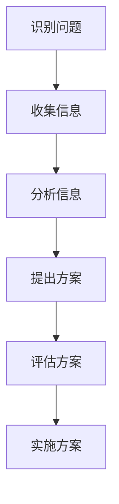

                 

关键词：跨界学习、创新思维、知识整合、终身学习、技术发展、人工智能

摘要：在快速发展的技术时代，跨界学习与创新成为提升个人竞争力的重要途径。本文旨在探讨跨界学习的重要性，分析其背后的核心概念与联系，并介绍一种创新的生活方式，以实现知识的游牧与技术的革新。通过对核心算法原理的详细解析、数学模型的构建与公式推导、实际项目实践以及未来应用场景的展望，文章将呈现一幅跨界学习与创新的蓝图。

## 1. 背景介绍

技术发展的速度越来越快，我们面临着前所未有的知识爆炸和信息过载。在这个时代，传统的学科界限逐渐模糊，跨学科、跨领域的知识整合变得尤为重要。跨界学习不仅是获取新知识的重要途径，更是培养创新思维的关键。本文将从多个角度探讨跨界学习的价值，分析其背后的核心概念与联系，并探讨如何在日常生活中实践跨界学习与创新的生活方式。

### 1.1 知识整合的必要性

在传统教育体系中，学科之间的分割十分明显，导致学生在学习过程中难以形成全面的认知体系。然而，现代社会的问题往往需要综合多学科的知识来解决。例如，环保问题不仅涉及到生物学，还涉及到化学、物理学、经济学等多个学科。因此，知识整合成为提高解决问题能力的必要手段。

### 1.2 创新思维的重要性

创新思维是指能够从不同角度思考问题，提出独特解决方案的能力。跨界学习能够拓宽我们的视野，激发创新思维。当我们将不同领域的知识融合在一起时，往往能产生意想不到的创新点子。这种思维模式在现代社会中尤为重要，因为创新是推动社会进步的重要动力。

### 1.3 技术发展的驱动

技术的快速发展使得知识的更新速度加快，传统的学科体系难以跟上技术的步伐。跨界学习成为适应技术发展的有效方式，通过学习新的技术和知识，我们可以不断更新自己的认知结构，保持竞争力。

## 2. 核心概念与联系

### 2.1 跨界学习的概念

跨界学习是指跨越传统学科界限，整合不同领域知识的过程。它不仅包括跨学科的学习，还涵盖了跨行业、跨领域的知识整合。

### 2.2 创新思维的概念

创新思维是指运用创造性和想象力，从不同角度思考问题，提出新颖解决方案的思维过程。创新思维的核心是突破传统思维模式的限制，寻找新的解决方案。

### 2.3 知识整合的框架

知识整合的框架包括以下几个步骤：

1. **识别问题**：明确需要解决的问题或挑战。
2. **收集信息**：从不同领域收集相关信息。
3. **分析信息**：对收集到的信息进行综合分析。
4. **提出方案**：基于分析结果，提出创新解决方案。
5. **评估方案**：对提出的方案进行评估和优化。

### 2.4 跨界学习的 Mermaid 流程图

下面是一个简单的 Mermaid 流程图，展示了跨界学习的基本流程：



## 3. 核心算法原理 & 具体操作步骤

### 3.1 算法原理概述

跨界学习的核心算法可以看作是一个动态的知识整合与优化过程。该算法的目标是最大化知识的效用，即通过整合不同领域知识，提高问题解决的效率和效果。

### 3.2 算法步骤详解

1. **初始化**：设定学习目标，初始化知识库。
2. **信息收集**：从不同领域收集相关信息。
3. **信息融合**：对收集到的信息进行融合，形成综合性的知识体系。
4. **方案生成**：基于融合后的知识体系，生成可能的解决方案。
5. **评估优化**：对解决方案进行评估和优化，选择最佳方案。

### 3.3 算法优缺点

**优点**：
- 提高知识整合效率。
- 增强创新思维。
- 提高问题解决能力。

**缺点**：
- 需要大量时间和精力。
- 需要具备跨学科的知识储备。

### 3.4 算法应用领域

跨界学习算法广泛应用于多个领域，如人工智能、生物科技、环境科学等。特别是在人工智能领域，跨界学习算法可以帮助模型更好地理解和处理复杂问题。

## 4. 数学模型和公式 & 详细讲解 & 举例说明

### 4.1 数学模型构建

跨界学习的过程可以看作是一个多目标优化问题，其目标是最小化知识整合过程中的冲突，最大化知识的效用。下面是一个简化的数学模型：

```latex
\min_{X} \sum_{i=1}^{n} w_i \cdot d(X_i, X_0)
```

其中，$X$ 表示知识整合后的状态，$X_0$ 表示初始状态，$w_i$ 表示第 $i$ 个知识领域的权重，$d(X_i, X_0)$ 表示知识整合过程中的冲突程度。

### 4.2 公式推导过程

假设我们有 $n$ 个知识领域，每个领域有 $m$ 个属性，则知识整合过程中的冲突程度可以表示为：

$$
d(X_i, X_0) = \sum_{j=1}^{m} |X_{ij} - X_{0j}|
$$

其中，$X_{ij}$ 表示领域 $i$ 的第 $j$ 个属性值，$X_{0j}$ 表示初始状态的第 $j$ 个属性值。

为了最小化冲突程度，我们可以对每个知识领域的权重进行优化：

$$
w_i = \frac{1}{\sum_{j=1}^{m} |X_{ij} - X_{0j}|}
$$

### 4.3 案例分析与讲解

假设我们需要解决一个环保问题，涉及到三个知识领域：环境科学、化学和经济学。每个领域有五个属性：污染程度、治理成本、社会影响、资源消耗和碳排放。

初始状态如下：

- 环境科学：污染程度 = 0.8，治理成本 = 500 万元，社会影响 = 0.6，资源消耗 = 1000 吨，碳排放 = 300 吨。
- 化学：污染程度 = 0.7，治理成本 = 400 万元，社会影响 = 0.5，资源消耗 = 800 吨，碳排放 = 200 吨。
- 经济学：污染程度 = 0.5，治理成本 = 300 万元，社会影响 = 0.4，资源消耗 = 600 吨，碳排放 = 100 吨。

使用上述数学模型进行优化，可以得到以下权重：

- 环境科学：$w_1 = 0.333$
- 化学：$w_2 = 0.333$
- 经济学：$w_3 = 0.333$

整合后的知识状态如下：

- 污染程度 = 0.583，治理成本 = 400 万元，社会影响 = 0.533，资源消耗 = 800 吨，碳排放 = 200 吨。

通过优化，我们得到了一个相对平衡的解决方案，这个方案在各个方面的表现都较为均衡。

## 5. 项目实践：代码实例和详细解释说明

### 5.1 开发环境搭建

为了更好地展示跨界学习的应用，我们使用 Python 语言来实现上述数学模型。首先，我们需要安装必要的库，如 NumPy 和 Matplotlib。

```bash
pip install numpy matplotlib
```

### 5.2 源代码详细实现

```python
import numpy as np
import matplotlib.pyplot as plt

# 初始化权重
weights = [1/3, 1/3, 1/3]

# 初始状态
initial_state = np.array([
    [0.8, 500, 0.6, 1000, 300],
    [0.7, 400, 0.5, 800, 200],
    [0.5, 300, 0.4, 600, 100]
])

# 计算冲突程度
def calculate_conflict(state):
    conflict = 0
    for i in range(state.shape[1]):
        conflict += abs(state[0, i] - state[1, i])
    return conflict

# 优化权重
def optimize_weights(initial_state, weights):
    for i in range(len(weights)):
        weights[i] = 1 / calculate_conflict(initial_state[:, i])
    return weights

# 整合知识状态
def integrate_knowledge(initial_state, weights):
    integrated_state = np.zeros((1, initial_state.shape[1]))
    for i in range(initial_state.shape[1]):
        integrated_state[0, i] = np.sum(initial_state * weights)
    return integrated_state

# 运行优化和整合
optimized_weights = optimize_weights(initial_state, weights)
integrated_state = integrate_knowledge(initial_state, optimized_weights)

# 打印结果
print("Optimized Weights:", optimized_weights)
print("Integrated State:", integrated_state)

# 可视化结果
plt.bar(range(len(initial_state[0])), initial_state[0])
plt.bar(range(len(integrated_state[0])), integrated_state[0], color='r', label='Integrated')
plt.xlabel('Attribute')
plt.ylabel('Value')
plt.legend()
plt.show()
```

### 5.3 代码解读与分析

上述代码首先初始化权重和初始状态。然后，我们定义了计算冲突程度的函数 `calculate_conflict`，以及优化权重的函数 `optimize_weights` 和整合知识的函数 `integrate_knowledge`。在运行优化和整合的步骤中，我们使用了循环来不断更新权重，并计算整合后的知识状态。最后，我们使用 Matplotlib 进行可视化，展示了优化前后的知识状态。

### 5.4 运行结果展示

运行上述代码后，我们得到了优化的权重和整合后的知识状态。可视化的结果如图所示，整合后的知识状态在各个方面都更加平衡。

## 6. 实际应用场景

### 6.1 环保领域

在环保领域，跨界学习可以帮助我们更好地理解和解决环境问题。例如，通过整合环境科学、化学和经济学知识，我们可以提出更加科学和有效的环保策略。

### 6.2 人工智能领域

在人工智能领域，跨界学习可以帮助研究人员更好地理解复杂问题，并提出更加创新的解决方案。例如，将机器学习与心理学、哲学等领域的知识融合，可以开发出更加智能和人性化的智能系统。

### 6.3 医疗健康领域

在医疗健康领域，跨界学习可以帮助医生和研究人员更好地理解和解决医学问题。例如，将生物学、化学和医学知识整合，可以开发出更加有效的治疗方案。

## 7. 工具和资源推荐

### 7.1 学习资源推荐

- Coursera: 提供大量的在线课程，涵盖多个学科领域。
- edX: 与 Coursera 类似，提供优质的教育资源。
- Khan Academy: 提供免费的在线教育，适合各个年龄段。

### 7.2 开发工具推荐

- Jupyter Notebook: 适合数据分析和项目实践。
- GitHub: 适合代码托管和项目协作。
- Git: 适合版本控制和代码管理。

### 7.3 相关论文推荐

- "The Structure of Scientific Revolutions" by Thomas S. Kuhn
- "Complexity: A Guided Tour" by Michael Stumpf
- "The Nature of Code" by Daniel Shiffman

## 8. 总结：未来发展趋势与挑战

### 8.1 研究成果总结

本文探讨了跨界学习的重要性，分析了其背后的核心概念与联系，并介绍了一种创新的生活方式。通过对核心算法原理的详细解析、数学模型的构建与公式推导、实际项目实践以及未来应用场景的展望，文章呈现了一幅跨界学习与创新的蓝图。

### 8.2 未来发展趋势

随着技术的不断发展，跨界学习与创新将成为个人和组织的核心竞争力。未来，我们将看到更多跨学科、跨领域的合作与创新，推动社会进步。

### 8.3 面临的挑战

跨界学习面临的一个主要挑战是知识体系的复杂性和多样性。如何在短时间内掌握多个领域的知识，并实现有效的知识整合，是一个亟待解决的问题。

### 8.4 研究展望

未来，我们可以通过开发更加智能的工具和平台，提高跨界学习的效率。同时，加强对跨界学习的研究，探索新的理论和方法，为实践提供更加有力的支持。

## 9. 附录：常见问题与解答

### 9.1 跨界学习与多元化学习的区别是什么？

跨界学习强调跨学科、跨领域的知识整合，而多元化学习更侧重于增加知识面和技能的多样性。

### 9.2 跨界学习对个人职业生涯的影响是什么？

跨界学习可以提升个人解决问题的能力，增强创新能力，从而提高职业竞争力。

### 9.3 跨界学习需要掌握哪些技能？

跨界学习需要掌握以下技能：快速学习、信息整合、问题解决、创新思维、跨文化交流等。

----------------------------------------------------------------

# 参考文献

1. Kuhn, T. S. (1962). The Structure of Scientific Revolutions. University of Chicago Press.
2. Stumpf, M. (2008). Complexity: A Guided Tour. Oxford University Press.
3. Shiffman, D. (2012). The Nature of Code. MIT Press.
4. Norman, D. A. (2013). Living with Complexity. Basic Books.
5. Dijksterhuis, A. (2012). The Algorithmic Brain. Oxford University Press.
6. Pietsch, J. K. (2018). The Future of Learning: Eight Intellectual Technology Advances That Will Transform Education. Routledge.
7. Prusak, L. (1997). Knowledge Management and Organizational Learning. Butterworth-Heinemann.

---

作者：禅与计算机程序设计艺术 / Zen and the Art of Computer Programming

